```python
#importing required Libraries.
import numpy as np
import pandas as pd
import matplotlib.pyplot as plt
import seaborn as sns
%matplotlib inline

import sidetable
from tabulate import tabulate

import warnings
warnings.filterwarnings('ignore')
```


```python
#setting max number of columns to be displayed to 100, to get a better view.
pd.set_option('display.max_columns',100)
pd.set_option('display.max_rows',100)
from IPython.display import HTML
HTML('''<script>
code_show_err=false; 
function code_toggle_err() {
 if (code_show_err){
 $('div.output_stderr').hide();
 } else {
 $('div.output_stderr').show();
 }
 code_show_err = !code_show_err
} 
$( document ).ready(code_toggle_err);
</script>
''')
```


<script>
code_show_err=false; 
function code_toggle_err() {
 if (code_show_err){
 $('div.output_stderr').hide();
 } else {
 $('div.output_stderr').show();
 }
 code_show_err = !code_show_err
} 
$( document ).ready(code_toggle_err);
</script>


## Loading Application Data


```python
application_data=pd.read_csv('application_data.csv')
```


```python
#checking shape 
application_data.shape
```


    (307511, 122)


```python
application_data.info()
```

    <class 'pandas.core.frame.DataFrame'>
    RangeIndex: 307511 entries, 0 to 307510
    Columns: 122 entries, SK_ID_CURR to AMT_REQ_CREDIT_BUREAU_YEAR
    dtypes: float64(65), int64(41), object(16)
    memory usage: 286.2+ MB


```python
application_data.describe()
```


<div>
<style scoped>
    .dataframe tbody tr th:only-of-type {
        vertical-align: middle;
    }

    .dataframe tbody tr th {
        vertical-align: top;
    }

    .dataframe thead th {
        text-align: right;
    }
</style>
<table border="1" class="dataframe">
  <thead>
    <tr style="text-align: right;">
      <th></th>
      <th>SK_ID_CURR</th>
      <th>TARGET</th>
      <th>CNT_CHILDREN</th>
      <th>AMT_INCOME_TOTAL</th>
      <th>AMT_CREDIT</th>
      <th>AMT_ANNUITY</th>
      <th>AMT_GOODS_PRICE</th>
      <th>REGION_POPULATION_RELATIVE</th>
      <th>DAYS_BIRTH</th>
      <th>DAYS_EMPLOYED</th>
      <th>DAYS_REGISTRATION</th>
      <th>DAYS_ID_PUBLISH</th>
      <th>OWN_CAR_AGE</th>
      <th>FLAG_MOBIL</th>
      <th>FLAG_EMP_PHONE</th>
      <th>FLAG_WORK_PHONE</th>
      <th>FLAG_CONT_MOBILE</th>
      <th>FLAG_PHONE</th>
      <th>FLAG_EMAIL</th>
      <th>CNT_FAM_MEMBERS</th>
      <th>REGION_RATING_CLIENT</th>
      <th>REGION_RATING_CLIENT_W_CITY</th>
      <th>HOUR_APPR_PROCESS_START</th>
      <th>REG_REGION_NOT_LIVE_REGION</th>
      <th>REG_REGION_NOT_WORK_REGION</th>
      <th>LIVE_REGION_NOT_WORK_REGION</th>
      <th>REG_CITY_NOT_LIVE_CITY</th>
      <th>REG_CITY_NOT_WORK_CITY</th>
      <th>LIVE_CITY_NOT_WORK_CITY</th>
      <th>EXT_SOURCE_1</th>
      <th>EXT_SOURCE_2</th>
      <th>EXT_SOURCE_3</th>
      <th>APARTMENTS_AVG</th>
      <th>BASEMENTAREA_AVG</th>
      <th>YEARS_BEGINEXPLUATATION_AVG</th>
      <th>YEARS_BUILD_AVG</th>
      <th>COMMONAREA_AVG</th>
      <th>ELEVATORS_AVG</th>
      <th>ENTRANCES_AVG</th>
      <th>FLOORSMAX_AVG</th>
      <th>FLOORSMIN_AVG</th>
      <th>LANDAREA_AVG</th>
      <th>LIVINGAPARTMENTS_AVG</th>
      <th>LIVINGAREA_AVG</th>
      <th>NONLIVINGAPARTMENTS_AVG</th>
      <th>NONLIVINGAREA_AVG</th>
      <th>APARTMENTS_MODE</th>
      <th>BASEMENTAREA_MODE</th>
      <th>YEARS_BEGINEXPLUATATION_MODE</th>
      <th>YEARS_BUILD_MODE</th>
      <th>...</th>
      <th>LIVINGAPARTMENTS_MODE</th>
      <th>LIVINGAREA_MODE</th>
      <th>NONLIVINGAPARTMENTS_MODE</th>
      <th>NONLIVINGAREA_MODE</th>
      <th>APARTMENTS_MEDI</th>
      <th>BASEMENTAREA_MEDI</th>
      <th>YEARS_BEGINEXPLUATATION_MEDI</th>
      <th>YEARS_BUILD_MEDI</th>
      <th>COMMONAREA_MEDI</th>
      <th>ELEVATORS_MEDI</th>
      <th>ENTRANCES_MEDI</th>
      <th>FLOORSMAX_MEDI</th>
      <th>FLOORSMIN_MEDI</th>
      <th>LANDAREA_MEDI</th>
      <th>LIVINGAPARTMENTS_MEDI</th>
      <th>LIVINGAREA_MEDI</th>
      <th>NONLIVINGAPARTMENTS_MEDI</th>
      <th>NONLIVINGAREA_MEDI</th>
      <th>TOTALAREA_MODE</th>
      <th>OBS_30_CNT_SOCIAL_CIRCLE</th>
      <th>DEF_30_CNT_SOCIAL_CIRCLE</th>
      <th>OBS_60_CNT_SOCIAL_CIRCLE</th>
      <th>DEF_60_CNT_SOCIAL_CIRCLE</th>
      <th>DAYS_LAST_PHONE_CHANGE</th>
      <th>FLAG_DOCUMENT_2</th>
      <th>FLAG_DOCUMENT_3</th>
      <th>FLAG_DOCUMENT_4</th>
      <th>FLAG_DOCUMENT_5</th>
      <th>FLAG_DOCUMENT_6</th>
      <th>FLAG_DOCUMENT_7</th>
      <th>FLAG_DOCUMENT_8</th>
      <th>FLAG_DOCUMENT_9</th>
      <th>FLAG_DOCUMENT_10</th>
      <th>FLAG_DOCUMENT_11</th>
      <th>FLAG_DOCUMENT_12</th>
      <th>FLAG_DOCUMENT_13</th>
      <th>FLAG_DOCUMENT_14</th>
      <th>FLAG_DOCUMENT_15</th>
      <th>FLAG_DOCUMENT_16</th>
      <th>FLAG_DOCUMENT_17</th>
      <th>FLAG_DOCUMENT_18</th>
      <th>FLAG_DOCUMENT_19</th>
      <th>FLAG_DOCUMENT_20</th>
      <th>FLAG_DOCUMENT_21</th>
      <th>AMT_REQ_CREDIT_BUREAU_HOUR</th>
      <th>AMT_REQ_CREDIT_BUREAU_DAY</th>
      <th>AMT_REQ_CREDIT_BUREAU_WEEK</th>
      <th>AMT_REQ_CREDIT_BUREAU_MON</th>
      <th>AMT_REQ_CREDIT_BUREAU_QRT</th>
      <th>AMT_REQ_CREDIT_BUREAU_YEAR</th>
    </tr>
  </thead>
  <tbody>
    <tr>
      <th>count</th>
      <td>307,511.00</td>
      <td>307,511.00</td>
      <td>307,511.00</td>
      <td>307,511.00</td>
      <td>307,511.00</td>
      <td>307,499.00</td>
      <td>307,233.00</td>
      <td>307,511.00</td>
      <td>307,511.00</td>
      <td>307,511.00</td>
      <td>307,511.00</td>
      <td>307,511.00</td>
      <td>104,582.00</td>
      <td>307,511.00</td>
      <td>307,511.00</td>
      <td>307,511.00</td>
      <td>307,511.00</td>
      <td>307,511.00</td>
      <td>307,511.00</td>
      <td>307,509.00</td>
      <td>307,511.00</td>
      <td>307,511.00</td>
      <td>307,511.00</td>
      <td>307,511.00</td>
      <td>307,511.00</td>
      <td>307,511.00</td>
      <td>307,511.00</td>
      <td>307,511.00</td>
      <td>307,511.00</td>
      <td>134,133.00</td>
      <td>306,851.00</td>
      <td>246,546.00</td>
      <td>151,450.00</td>
      <td>127,568.00</td>
      <td>157,504.00</td>
      <td>103,023.00</td>
      <td>92,646.00</td>
      <td>143,620.00</td>
      <td>152,683.00</td>
      <td>154,491.00</td>
      <td>98,869.00</td>
      <td>124,921.00</td>
      <td>97,312.00</td>
      <td>153,161.00</td>
      <td>93,997.00</td>
      <td>137,829.00</td>
      <td>151,450.00</td>
      <td>127,568.00</td>
      <td>157,504.00</td>
      <td>103,023.00</td>
      <td>...</td>
      <td>97,312.00</td>
      <td>153,161.00</td>
      <td>93,997.00</td>
      <td>137,829.00</td>
      <td>151,450.00</td>
      <td>127,568.00</td>
      <td>157,504.00</td>
      <td>103,023.00</td>
      <td>92,646.00</td>
      <td>143,620.00</td>
      <td>152,683.00</td>
      <td>154,491.00</td>
      <td>98,869.00</td>
      <td>124,921.00</td>
      <td>97,312.00</td>
      <td>153,161.00</td>
      <td>93,997.00</td>
      <td>137,829.00</td>
      <td>159,080.00</td>
      <td>306,490.00</td>
      <td>306,490.00</td>
      <td>306,490.00</td>
      <td>306,490.00</td>
      <td>307,510.00</td>
      <td>307,511.00</td>
      <td>307,511.00</td>
      <td>307,511.00</td>
      <td>307,511.00</td>
      <td>307,511.00</td>
      <td>307,511.00</td>
      <td>307,511.00</td>
      <td>307,511.00</td>
      <td>307,511.00</td>
      <td>307,511.00</td>
      <td>307,511.00</td>
      <td>307,511.00</td>
      <td>307,511.00</td>
      <td>307,511.00</td>
      <td>307,511.00</td>
      <td>307,511.00</td>
      <td>307,511.00</td>
      <td>307,511.00</td>
      <td>307,511.00</td>
      <td>307,511.00</td>
      <td>265,992.00</td>
      <td>265,992.00</td>
      <td>265,992.00</td>
      <td>265,992.00</td>
      <td>265,992.00</td>
      <td>265,992.00</td>
    </tr>
    <tr>
      <th>mean</th>
      <td>278,180.52</td>
      <td>0.08</td>
      <td>0.42</td>
      <td>168,797.92</td>
      <td>599,026.00</td>
      <td>27,108.57</td>
      <td>538,396.21</td>
      <td>0.02</td>
      <td>-16,037.00</td>
      <td>63,815.05</td>
      <td>-4,986.12</td>
      <td>-2,994.20</td>
      <td>12.06</td>
      <td>1.00</td>
      <td>0.82</td>
      <td>0.20</td>
      <td>1.00</td>
      <td>0.28</td>
      <td>0.06</td>
      <td>2.15</td>
      <td>2.05</td>
      <td>2.03</td>
      <td>12.06</td>
      <td>0.02</td>
      <td>0.05</td>
      <td>0.04</td>
      <td>0.08</td>
      <td>0.23</td>
      <td>0.18</td>
      <td>0.50</td>
      <td>0.51</td>
      <td>0.51</td>
      <td>0.12</td>
      <td>0.09</td>
      <td>0.98</td>
      <td>0.75</td>
      <td>0.04</td>
      <td>0.08</td>
      <td>0.15</td>
      <td>0.23</td>
      <td>0.23</td>
      <td>0.07</td>
      <td>0.10</td>
      <td>0.11</td>
      <td>0.01</td>
      <td>0.03</td>
      <td>0.11</td>
      <td>0.09</td>
      <td>0.98</td>
      <td>0.76</td>
      <td>...</td>
      <td>0.11</td>
      <td>0.11</td>
      <td>0.01</td>
      <td>0.03</td>
      <td>0.12</td>
      <td>0.09</td>
      <td>0.98</td>
      <td>0.76</td>
      <td>0.04</td>
      <td>0.08</td>
      <td>0.15</td>
      <td>0.23</td>
      <td>0.23</td>
      <td>0.07</td>
      <td>0.10</td>
      <td>0.11</td>
      <td>0.01</td>
      <td>0.03</td>
      <td>0.10</td>
      <td>1.42</td>
      <td>0.14</td>
      <td>1.41</td>
      <td>0.10</td>
      <td>-962.86</td>
      <td>0.00</td>
      <td>0.71</td>
      <td>0.00</td>
      <td>0.02</td>
      <td>0.09</td>
      <td>0.00</td>
      <td>0.08</td>
      <td>0.00</td>
      <td>0.00</td>
      <td>0.00</td>
      <td>0.00</td>
      <td>0.00</td>
      <td>0.00</td>
      <td>0.00</td>
      <td>0.01</td>
      <td>0.00</td>
      <td>0.01</td>
      <td>0.00</td>
      <td>0.00</td>
      <td>0.00</td>
      <td>0.01</td>
      <td>0.01</td>
      <td>0.03</td>
      <td>0.27</td>
      <td>0.27</td>
      <td>1.90</td>
    </tr>
    <tr>
      <th>std</th>
      <td>102,790.18</td>
      <td>0.27</td>
      <td>0.72</td>
      <td>237,123.15</td>
      <td>402,490.78</td>
      <td>14,493.74</td>
      <td>369,446.46</td>
      <td>0.01</td>
      <td>4,363.99</td>
      <td>141,275.77</td>
      <td>3,522.89</td>
      <td>1,509.45</td>
      <td>11.94</td>
      <td>0.00</td>
      <td>0.38</td>
      <td>0.40</td>
      <td>0.04</td>
      <td>0.45</td>
      <td>0.23</td>
      <td>0.91</td>
      <td>0.51</td>
      <td>0.50</td>
      <td>3.27</td>
      <td>0.12</td>
      <td>0.22</td>
      <td>0.20</td>
      <td>0.27</td>
      <td>0.42</td>
      <td>0.38</td>
      <td>0.21</td>
      <td>0.19</td>
      <td>0.19</td>
      <td>0.11</td>
      <td>0.08</td>
      <td>0.06</td>
      <td>0.11</td>
      <td>0.08</td>
      <td>0.13</td>
      <td>0.10</td>
      <td>0.14</td>
      <td>0.16</td>
      <td>0.08</td>
      <td>0.09</td>
      <td>0.11</td>
      <td>0.05</td>
      <td>0.07</td>
      <td>0.11</td>
      <td>0.08</td>
      <td>0.06</td>
      <td>0.11</td>
      <td>...</td>
      <td>0.10</td>
      <td>0.11</td>
      <td>0.05</td>
      <td>0.07</td>
      <td>0.11</td>
      <td>0.08</td>
      <td>0.06</td>
      <td>0.11</td>
      <td>0.08</td>
      <td>0.13</td>
      <td>0.10</td>
      <td>0.15</td>
      <td>0.16</td>
      <td>0.08</td>
      <td>0.09</td>
      <td>0.11</td>
      <td>0.05</td>
      <td>0.07</td>
      <td>0.11</td>
      <td>2.40</td>
      <td>0.45</td>
      <td>2.38</td>
      <td>0.36</td>
      <td>826.81</td>
      <td>0.01</td>
      <td>0.45</td>
      <td>0.01</td>
      <td>0.12</td>
      <td>0.28</td>
      <td>0.01</td>
      <td>0.27</td>
      <td>0.06</td>
      <td>0.00</td>
      <td>0.06</td>
      <td>0.00</td>
      <td>0.06</td>
      <td>0.05</td>
      <td>0.03</td>
      <td>0.10</td>
      <td>0.02</td>
      <td>0.09</td>
      <td>0.02</td>
      <td>0.02</td>
      <td>0.02</td>
      <td>0.08</td>
      <td>0.11</td>
      <td>0.20</td>
      <td>0.92</td>
      <td>0.79</td>
      <td>1.87</td>
    </tr>
    <tr>
      <th>min</th>
      <td>100,002.00</td>
      <td>0.00</td>
      <td>0.00</td>
      <td>25,650.00</td>
      <td>45,000.00</td>
      <td>1,615.50</td>
      <td>40,500.00</td>
      <td>0.00</td>
      <td>-25,229.00</td>
      <td>-17,912.00</td>
      <td>-24,672.00</td>
      <td>-7,197.00</td>
      <td>0.00</td>
      <td>0.00</td>
      <td>0.00</td>
      <td>0.00</td>
      <td>0.00</td>
      <td>0.00</td>
      <td>0.00</td>
      <td>1.00</td>
      <td>1.00</td>
      <td>1.00</td>
      <td>0.00</td>
      <td>0.00</td>
      <td>0.00</td>
      <td>0.00</td>
      <td>0.00</td>
      <td>0.00</td>
      <td>0.00</td>
      <td>0.01</td>
      <td>0.00</td>
      <td>0.00</td>
      <td>0.00</td>
      <td>0.00</td>
      <td>0.00</td>
      <td>0.00</td>
      <td>0.00</td>
      <td>0.00</td>
      <td>0.00</td>
      <td>0.00</td>
      <td>0.00</td>
      <td>0.00</td>
      <td>0.00</td>
      <td>0.00</td>
      <td>0.00</td>
      <td>0.00</td>
      <td>0.00</td>
      <td>0.00</td>
      <td>0.00</td>
      <td>0.00</td>
      <td>...</td>
      <td>0.00</td>
      <td>0.00</td>
      <td>0.00</td>
      <td>0.00</td>
      <td>0.00</td>
      <td>0.00</td>
      <td>0.00</td>
      <td>0.00</td>
      <td>0.00</td>
      <td>0.00</td>
      <td>0.00</td>
      <td>0.00</td>
      <td>0.00</td>
      <td>0.00</td>
      <td>0.00</td>
      <td>0.00</td>
      <td>0.00</td>
      <td>0.00</td>
      <td>0.00</td>
      <td>0.00</td>
      <td>0.00</td>
      <td>0.00</td>
      <td>0.00</td>
      <td>-4,292.00</td>
      <td>0.00</td>
      <td>0.00</td>
      <td>0.00</td>
      <td>0.00</td>
      <td>0.00</td>
      <td>0.00</td>
      <td>0.00</td>
      <td>0.00</td>
      <td>0.00</td>
      <td>0.00</td>
      <td>0.00</td>
      <td>0.00</td>
      <td>0.00</td>
      <td>0.00</td>
      <td>0.00</td>
      <td>0.00</td>
      <td>0.00</td>
      <td>0.00</td>
      <td>0.00</td>
      <td>0.00</td>
      <td>0.00</td>
      <td>0.00</td>
      <td>0.00</td>
      <td>0.00</td>
      <td>0.00</td>
      <td>0.00</td>
    </tr>
    <tr>
      <th>25%</th>
      <td>189,145.50</td>
      <td>0.00</td>
      <td>0.00</td>
      <td>112,500.00</td>
      <td>270,000.00</td>
      <td>16,524.00</td>
      <td>238,500.00</td>
      <td>0.01</td>
      <td>-19,682.00</td>
      <td>-2,760.00</td>
      <td>-7,479.50</td>
      <td>-4,299.00</td>
      <td>5.00</td>
      <td>1.00</td>
      <td>1.00</td>
      <td>0.00</td>
      <td>1.00</td>
      <td>0.00</td>
      <td>0.00</td>
      <td>2.00</td>
      <td>2.00</td>
      <td>2.00</td>
      <td>10.00</td>
      <td>0.00</td>
      <td>0.00</td>
      <td>0.00</td>
      <td>0.00</td>
      <td>0.00</td>
      <td>0.00</td>
      <td>0.33</td>
      <td>0.39</td>
      <td>0.37</td>
      <td>0.06</td>
      <td>0.04</td>
      <td>0.98</td>
      <td>0.69</td>
      <td>0.01</td>
      <td>0.00</td>
      <td>0.07</td>
      <td>0.17</td>
      <td>0.08</td>
      <td>0.02</td>
      <td>0.05</td>
      <td>0.05</td>
      <td>0.00</td>
      <td>0.00</td>
      <td>0.05</td>
      <td>0.04</td>
      <td>0.98</td>
      <td>0.70</td>
      <td>...</td>
      <td>0.05</td>
      <td>0.04</td>
      <td>0.00</td>
      <td>0.00</td>
      <td>0.06</td>
      <td>0.04</td>
      <td>0.98</td>
      <td>0.69</td>
      <td>0.01</td>
      <td>0.00</td>
      <td>0.07</td>
      <td>0.17</td>
      <td>0.08</td>
      <td>0.02</td>
      <td>0.05</td>
      <td>0.05</td>
      <td>0.00</td>
      <td>0.00</td>
      <td>0.04</td>
      <td>0.00</td>
      <td>0.00</td>
      <td>0.00</td>
      <td>0.00</td>
      <td>-1,570.00</td>
      <td>0.00</td>
      <td>0.00</td>
      <td>0.00</td>
      <td>0.00</td>
      <td>0.00</td>
      <td>0.00</td>
      <td>0.00</td>
      <td>0.00</td>
      <td>0.00</td>
      <td>0.00</td>
      <td>0.00</td>
      <td>0.00</td>
      <td>0.00</td>
      <td>0.00</td>
      <td>0.00</td>
      <td>0.00</td>
      <td>0.00</td>
      <td>0.00</td>
      <td>0.00</td>
      <td>0.00</td>
      <td>0.00</td>
      <td>0.00</td>
      <td>0.00</td>
      <td>0.00</td>
      <td>0.00</td>
      <td>0.00</td>
    </tr>
    <tr>
      <th>50%</th>
      <td>278,202.00</td>
      <td>0.00</td>
      <td>0.00</td>
      <td>147,150.00</td>
      <td>513,531.00</td>
      <td>24,903.00</td>
      <td>450,000.00</td>
      <td>0.02</td>
      <td>-15,750.00</td>
      <td>-1,213.00</td>
      <td>-4,504.00</td>
      <td>-3,254.00</td>
      <td>9.00</td>
      <td>1.00</td>
      <td>1.00</td>
      <td>0.00</td>
      <td>1.00</td>
      <td>0.00</td>
      <td>0.00</td>
      <td>2.00</td>
      <td>2.00</td>
      <td>2.00</td>
      <td>12.00</td>
      <td>0.00</td>
      <td>0.00</td>
      <td>0.00</td>
      <td>0.00</td>
      <td>0.00</td>
      <td>0.00</td>
      <td>0.51</td>
      <td>0.57</td>
      <td>0.54</td>
      <td>0.09</td>
      <td>0.08</td>
      <td>0.98</td>
      <td>0.76</td>
      <td>0.02</td>
      <td>0.00</td>
      <td>0.14</td>
      <td>0.17</td>
      <td>0.21</td>
      <td>0.05</td>
      <td>0.08</td>
      <td>0.07</td>
      <td>0.00</td>
      <td>0.00</td>
      <td>0.08</td>
      <td>0.07</td>
      <td>0.98</td>
      <td>0.76</td>
      <td>...</td>
      <td>0.08</td>
      <td>0.07</td>
      <td>0.00</td>
      <td>0.00</td>
      <td>0.09</td>
      <td>0.08</td>
      <td>0.98</td>
      <td>0.76</td>
      <td>0.02</td>
      <td>0.00</td>
      <td>0.14</td>
      <td>0.17</td>
      <td>0.21</td>
      <td>0.05</td>
      <td>0.08</td>
      <td>0.07</td>
      <td>0.00</td>
      <td>0.00</td>
      <td>0.07</td>
      <td>0.00</td>
      <td>0.00</td>
      <td>0.00</td>
      <td>0.00</td>
      <td>-757.00</td>
      <td>0.00</td>
      <td>1.00</td>
      <td>0.00</td>
      <td>0.00</td>
      <td>0.00</td>
      <td>0.00</td>
      <td>0.00</td>
      <td>0.00</td>
      <td>0.00</td>
      <td>0.00</td>
      <td>0.00</td>
      <td>0.00</td>
      <td>0.00</td>
      <td>0.00</td>
      <td>0.00</td>
      <td>0.00</td>
      <td>0.00</td>
      <td>0.00</td>
      <td>0.00</td>
      <td>0.00</td>
      <td>0.00</td>
      <td>0.00</td>
      <td>0.00</td>
      <td>0.00</td>
      <td>0.00</td>
      <td>1.00</td>
    </tr>
    <tr>
      <th>75%</th>
      <td>367,142.50</td>
      <td>0.00</td>
      <td>1.00</td>
      <td>202,500.00</td>
      <td>808,650.00</td>
      <td>34,596.00</td>
      <td>679,500.00</td>
      <td>0.03</td>
      <td>-12,413.00</td>
      <td>-289.00</td>
      <td>-2,010.00</td>
      <td>-1,720.00</td>
      <td>15.00</td>
      <td>1.00</td>
      <td>1.00</td>
      <td>0.00</td>
      <td>1.00</td>
      <td>1.00</td>
      <td>0.00</td>
      <td>3.00</td>
      <td>2.00</td>
      <td>2.00</td>
      <td>14.00</td>
      <td>0.00</td>
      <td>0.00</td>
      <td>0.00</td>
      <td>0.00</td>
      <td>0.00</td>
      <td>0.00</td>
      <td>0.68</td>
      <td>0.66</td>
      <td>0.67</td>
      <td>0.15</td>
      <td>0.11</td>
      <td>0.99</td>
      <td>0.82</td>
      <td>0.05</td>
      <td>0.12</td>
      <td>0.21</td>
      <td>0.33</td>
      <td>0.38</td>
      <td>0.09</td>
      <td>0.12</td>
      <td>0.13</td>
      <td>0.00</td>
      <td>0.03</td>
      <td>0.14</td>
      <td>0.11</td>
      <td>0.99</td>
      <td>0.82</td>
      <td>...</td>
      <td>0.13</td>
      <td>0.13</td>
      <td>0.00</td>
      <td>0.02</td>
      <td>0.15</td>
      <td>0.11</td>
      <td>0.99</td>
      <td>0.83</td>
      <td>0.05</td>
      <td>0.12</td>
      <td>0.21</td>
      <td>0.33</td>
      <td>0.38</td>
      <td>0.09</td>
      <td>0.12</td>
      <td>0.13</td>
      <td>0.00</td>
      <td>0.03</td>
      <td>0.13</td>
      <td>2.00</td>
      <td>0.00</td>
      <td>2.00</td>
      <td>0.00</td>
      <td>-274.00</td>
      <td>0.00</td>
      <td>1.00</td>
      <td>0.00</td>
      <td>0.00</td>
      <td>0.00</td>
      <td>0.00</td>
      <td>0.00</td>
      <td>0.00</td>
      <td>0.00</td>
      <td>0.00</td>
      <td>0.00</td>
      <td>0.00</td>
      <td>0.00</td>
      <td>0.00</td>
      <td>0.00</td>
      <td>0.00</td>
      <td>0.00</td>
      <td>0.00</td>
      <td>0.00</td>
      <td>0.00</td>
      <td>0.00</td>
      <td>0.00</td>
      <td>0.00</td>
      <td>0.00</td>
      <td>0.00</td>
      <td>3.00</td>
    </tr>
    <tr>
      <th>max</th>
      <td>456,255.00</td>
      <td>1.00</td>
      <td>19.00</td>
      <td>117,000,000.00</td>
      <td>4,050,000.00</td>
      <td>258,025.50</td>
      <td>4,050,000.00</td>
      <td>0.07</td>
      <td>-7,489.00</td>
      <td>365,243.00</td>
      <td>0.00</td>
      <td>0.00</td>
      <td>91.00</td>
      <td>1.00</td>
      <td>1.00</td>
      <td>1.00</td>
      <td>1.00</td>
      <td>1.00</td>
      <td>1.00</td>
      <td>20.00</td>
      <td>3.00</td>
      <td>3.00</td>
      <td>23.00</td>
      <td>1.00</td>
      <td>1.00</td>
      <td>1.00</td>
      <td>1.00</td>
      <td>1.00</td>
      <td>1.00</td>
      <td>0.96</td>
      <td>0.85</td>
      <td>0.90</td>
      <td>1.00</td>
      <td>1.00</td>
      <td>1.00</td>
      <td>1.00</td>
      <td>1.00</td>
      <td>1.00</td>
      <td>1.00</td>
      <td>1.00</td>
      <td>1.00</td>
      <td>1.00</td>
      <td>1.00</td>
      <td>1.00</td>
      <td>1.00</td>
      <td>1.00</td>
      <td>1.00</td>
      <td>1.00</td>
      <td>1.00</td>
      <td>1.00</td>
      <td>...</td>
      <td>1.00</td>
      <td>1.00</td>
      <td>1.00</td>
      <td>1.00</td>
      <td>1.00</td>
      <td>1.00</td>
      <td>1.00</td>
      <td>1.00</td>
      <td>1.00</td>
      <td>1.00</td>
      <td>1.00</td>
      <td>1.00</td>
      <td>1.00</td>
      <td>1.00</td>
      <td>1.00</td>
      <td>1.00</td>
      <td>1.00</td>
      <td>1.00</td>
      <td>1.00</td>
      <td>348.00</td>
      <td>34.00</td>
      <td>344.00</td>
      <td>24.00</td>
      <td>0.00</td>
      <td>1.00</td>
      <td>1.00</td>
      <td>1.00</td>
      <td>1.00</td>
      <td>1.00</td>
      <td>1.00</td>
      <td>1.00</td>
      <td>1.00</td>
      <td>1.00</td>
      <td>1.00</td>
      <td>1.00</td>
      <td>1.00</td>
      <td>1.00</td>
      <td>1.00</td>
      <td>1.00</td>
      <td>1.00</td>
      <td>1.00</td>
      <td>1.00</td>
      <td>1.00</td>
      <td>1.00</td>
      <td>4.00</td>
      <td>9.00</td>
      <td>8.00</td>
      <td>27.00</td>
      <td>261.00</td>
      <td>25.00</td>
    </tr>
  </tbody>
</table>
<p>8 rows × 106 columns</p>
</div>


## Data Quality Check

### Checking Columns with High Null Percentage


```python
def color_red(value):
    '''
      Colors elements in a dateframe
      green if nulls <50% and red if
      >=50%.
    '''
    if value >=50:
        color = 'red'
    elif value <50:
        color = 'green'

    return 'color: %s' % color

#Finding Percentage of Missing values in each and every column
missing_data = np.round(100*application_data.isnull().sum()/len(application_data),2)
missing_data = pd.DataFrame(data={'Column Name' :missing_data.index, 'Null Percentage' : missing_data.values})
missing_data.style.applymap(color_red,subset=['Null Percentage'])

```


<style  type="text/css" >
    #T_26966230_b4b0_11ea_b9b3_88e9fe4e6667row0_col1 {
            color:  green;
        }    #T_26966230_b4b0_11ea_b9b3_88e9fe4e6667row1_col1 {
            color:  green;
        }    #T_26966230_b4b0_11ea_b9b3_88e9fe4e6667row2_col1 {
            color:  green;
        }    #T_26966230_b4b0_11ea_b9b3_88e9fe4e6667row3_col1 {
            color:  green;
        }    #T_26966230_b4b0_11ea_b9b3_88e9fe4e6667row4_col1 {
            color:  green;
        }    #T_26966230_b4b0_11ea_b9b3_88e9fe4e6667row5_col1 {
            color:  green;
        }    #T_26966230_b4b0_11ea_b9b3_88e9fe4e6667row6_col1 {
            color:  green;
        }    #T_26966230_b4b0_11ea_b9b3_88e9fe4e6667row7_col1 {
            color:  green;
        }    #T_26966230_b4b0_11ea_b9b3_88e9fe4e6667row8_col1 {
            color:  green;
        }    #T_26966230_b4b0_11ea_b9b3_88e9fe4e6667row9_col1 {
            color:  green;
        }    #T_26966230_b4b0_11ea_b9b3_88e9fe4e6667row10_col1 {
            color:  green;
        }    #T_26966230_b4b0_11ea_b9b3_88e9fe4e6667row11_col1 {
            color:  green;
        }    #T_26966230_b4b0_11ea_b9b3_88e9fe4e6667row12_col1 {
            color:  green;
        }    #T_26966230_b4b0_11ea_b9b3_88e9fe4e6667row13_col1 {
            color:  green;
        }    #T_26966230_b4b0_11ea_b9b3_88e9fe4e6667row14_col1 {
            color:  green;
        }    #T_26966230_b4b0_11ea_b9b3_88e9fe4e6667row15_col1 {
            color:  green;
        }    #T_26966230_b4b0_11ea_b9b3_88e9fe4e6667row16_col1 {
            color:  green;
        }    #T_26966230_b4b0_11ea_b9b3_88e9fe4e6667row17_col1 {
            color:  green;
        }    #T_26966230_b4b0_11ea_b9b3_88e9fe4e6667row18_col1 {
            color:  green;
        }    #T_26966230_b4b0_11ea_b9b3_88e9fe4e6667row19_col1 {
            color:  green;
        }    #T_26966230_b4b0_11ea_b9b3_88e9fe4e6667row20_col1 {
            color:  green;
        }    #T_26966230_b4b0_11ea_b9b3_88e9fe4e6667row21_col1 {
            color:  red;
        }    #T_26966230_b4b0_11ea_b9b3_88e9fe4e6667row22_col1 {
            color:  green;
        }    #T_26966230_b4b0_11ea_b9b3_88e9fe4e6667row23_col1 {
            color:  green;
        }    #T_26966230_b4b0_11ea_b9b3_88e9fe4e6667row24_col1 {
            color:  green;
        }    #T_26966230_b4b0_11ea_b9b3_88e9fe4e6667row25_col1 {
            color:  green;
        }    #T_26966230_b4b0_11ea_b9b3_88e9fe4e6667row26_col1 {
            color:  green;
        }    #T_26966230_b4b0_11ea_b9b3_88e9fe4e6667row27_col1 {
            color:  green;
        }    #T_26966230_b4b0_11ea_b9b3_88e9fe4e6667row28_col1 {
            color:  green;
        }    #T_26966230_b4b0_11ea_b9b3_88e9fe4e6667row29_col1 {
            color:  green;
        }    #T_26966230_b4b0_11ea_b9b3_88e9fe4e6667row30_col1 {
            color:  green;
        }    #T_26966230_b4b0_11ea_b9b3_88e9fe4e6667row31_col1 {
            color:  green;
        }    #T_26966230_b4b0_11ea_b9b3_88e9fe4e6667row32_col1 {
            color:  green;
        }    #T_26966230_b4b0_11ea_b9b3_88e9fe4e6667row33_col1 {
            color:  green;
        }    #T_26966230_b4b0_11ea_b9b3_88e9fe4e6667row34_col1 {
            color:  green;
        }    #T_26966230_b4b0_11ea_b9b3_88e9fe4e6667row35_col1 {
            color:  green;
        }    #T_26966230_b4b0_11ea_b9b3_88e9fe4e6667row36_col1 {
            color:  green;
        }    #T_26966230_b4b0_11ea_b9b3_88e9fe4e6667row37_col1 {
            color:  green;
        }    #T_26966230_b4b0_11ea_b9b3_88e9fe4e6667row38_col1 {
            color:  green;
        }    #T_26966230_b4b0_11ea_b9b3_88e9fe4e6667row39_col1 {
            color:  green;
        }    #T_26966230_b4b0_11ea_b9b3_88e9fe4e6667row40_col1 {
            color:  green;
        }    #T_26966230_b4b0_11ea_b9b3_88e9fe4e6667row41_col1 {
            color:  red;
        }    #T_26966230_b4b0_11ea_b9b3_88e9fe4e6667row42_col1 {
            color:  green;
        }    #T_26966230_b4b0_11ea_b9b3_88e9fe4e6667row43_col1 {
            color:  green;
        }    #T_26966230_b4b0_11ea_b9b3_88e9fe4e6667row44_col1 {
            color:  red;
        }    #T_26966230_b4b0_11ea_b9b3_88e9fe4e6667row45_col1 {
            color:  red;
        }    #T_26966230_b4b0_11ea_b9b3_88e9fe4e6667row46_col1 {
            color:  green;
        }    #T_26966230_b4b0_11ea_b9b3_88e9fe4e6667row47_col1 {
            color:  red;
        }    #T_26966230_b4b0_11ea_b9b3_88e9fe4e6667row48_col1 {
            color:  red;
        }    #T_26966230_b4b0_11ea_b9b3_88e9fe4e6667row49_col1 {
            color:  red;
        }    #T_26966230_b4b0_11ea_b9b3_88e9fe4e6667row50_col1 {
            color:  red;
        }    #T_26966230_b4b0_11ea_b9b3_88e9fe4e6667row51_col1 {
            color:  green;
        }    #T_26966230_b4b0_11ea_b9b3_88e9fe4e6667row52_col1 {
            color:  red;
        }    #T_26966230_b4b0_11ea_b9b3_88e9fe4e6667row53_col1 {
            color:  red;
        }    #T_26966230_b4b0_11ea_b9b3_88e9fe4e6667row54_col1 {
            color:  red;
        }    #T_26966230_b4b0_11ea_b9b3_88e9fe4e6667row55_col1 {
            color:  red;
        }    #T_26966230_b4b0_11ea_b9b3_88e9fe4e6667row56_col1 {
            color:  red;
        }    #T_26966230_b4b0_11ea_b9b3_88e9fe4e6667row57_col1 {
            color:  red;
        }    #T_26966230_b4b0_11ea_b9b3_88e9fe4e6667row58_col1 {
            color:  red;
        }    #T_26966230_b4b0_11ea_b9b3_88e9fe4e6667row59_col1 {
            color:  red;
        }    #T_26966230_b4b0_11ea_b9b3_88e9fe4e6667row60_col1 {
            color:  green;
        }    #T_26966230_b4b0_11ea_b9b3_88e9fe4e6667row61_col1 {
            color:  red;
        }    #T_26966230_b4b0_11ea_b9b3_88e9fe4e6667row62_col1 {
            color:  red;
        }    #T_26966230_b4b0_11ea_b9b3_88e9fe4e6667row63_col1 {
            color:  red;
        }    #T_26966230_b4b0_11ea_b9b3_88e9fe4e6667row64_col1 {
            color:  red;
        }    #T_26966230_b4b0_11ea_b9b3_88e9fe4e6667row65_col1 {
            color:  green;
        }    #T_26966230_b4b0_11ea_b9b3_88e9fe4e6667row66_col1 {
            color:  red;
        }    #T_26966230_b4b0_11ea_b9b3_88e9fe4e6667row67_col1 {
            color:  red;
        }    #T_26966230_b4b0_11ea_b9b3_88e9fe4e6667row68_col1 {
            color:  red;
        }    #T_26966230_b4b0_11ea_b9b3_88e9fe4e6667row69_col1 {
            color:  red;
        }    #T_26966230_b4b0_11ea_b9b3_88e9fe4e6667row70_col1 {
            color:  red;
        }    #T_26966230_b4b0_11ea_b9b3_88e9fe4e6667row71_col1 {
            color:  red;
        }    #T_26966230_b4b0_11ea_b9b3_88e9fe4e6667row72_col1 {
            color:  red;
        }    #T_26966230_b4b0_11ea_b9b3_88e9fe4e6667row73_col1 {
            color:  red;
        }    #T_26966230_b4b0_11ea_b9b3_88e9fe4e6667row74_col1 {
            color:  green;
        }    #T_26966230_b4b0_11ea_b9b3_88e9fe4e6667row75_col1 {
            color:  red;
        }    #T_26966230_b4b0_11ea_b9b3_88e9fe4e6667row76_col1 {
            color:  red;
        }    #T_26966230_b4b0_11ea_b9b3_88e9fe4e6667row77_col1 {
            color:  red;
        }    #T_26966230_b4b0_11ea_b9b3_88e9fe4e6667row78_col1 {
            color:  red;
        }    #T_26966230_b4b0_11ea_b9b3_88e9fe4e6667row79_col1 {
            color:  green;
        }    #T_26966230_b4b0_11ea_b9b3_88e9fe4e6667row80_col1 {
            color:  red;
        }    #T_26966230_b4b0_11ea_b9b3_88e9fe4e6667row81_col1 {
            color:  red;
        }    #T_26966230_b4b0_11ea_b9b3_88e9fe4e6667row82_col1 {
            color:  red;
        }    #T_26966230_b4b0_11ea_b9b3_88e9fe4e6667row83_col1 {
            color:  red;
        }    #T_26966230_b4b0_11ea_b9b3_88e9fe4e6667row84_col1 {
            color:  red;
        }    #T_26966230_b4b0_11ea_b9b3_88e9fe4e6667row85_col1 {
            color:  red;
        }    #T_26966230_b4b0_11ea_b9b3_88e9fe4e6667row86_col1 {
            color:  red;
        }    #T_26966230_b4b0_11ea_b9b3_88e9fe4e6667row87_col1 {
            color:  red;
        }    #T_26966230_b4b0_11ea_b9b3_88e9fe4e6667row88_col1 {
            color:  green;
        }    #T_26966230_b4b0_11ea_b9b3_88e9fe4e6667row89_col1 {
            color:  red;
        }    #T_26966230_b4b0_11ea_b9b3_88e9fe4e6667row90_col1 {
            color:  green;
        }    #T_26966230_b4b0_11ea_b9b3_88e9fe4e6667row91_col1 {
            color:  green;
        }    #T_26966230_b4b0_11ea_b9b3_88e9fe4e6667row92_col1 {
            color:  green;
        }    #T_26966230_b4b0_11ea_b9b3_88e9fe4e6667row93_col1 {
            color:  green;
        }    #T_26966230_b4b0_11ea_b9b3_88e9fe4e6667row94_col1 {
            color:  green;
        }    #T_26966230_b4b0_11ea_b9b3_88e9fe4e6667row95_col1 {
            color:  green;
        }    #T_26966230_b4b0_11ea_b9b3_88e9fe4e6667row96_col1 {
            color:  green;
        }    #T_26966230_b4b0_11ea_b9b3_88e9fe4e6667row97_col1 {
            color:  green;
        }    #T_26966230_b4b0_11ea_b9b3_88e9fe4e6667row98_col1 {
            color:  green;
        }    #T_26966230_b4b0_11ea_b9b3_88e9fe4e6667row99_col1 {
            color:  green;
        }    #T_26966230_b4b0_11ea_b9b3_88e9fe4e6667row100_col1 {
            color:  green;
        }    #T_26966230_b4b0_11ea_b9b3_88e9fe4e6667row101_col1 {
            color:  green;
        }    #T_26966230_b4b0_11ea_b9b3_88e9fe4e6667row102_col1 {
            color:  green;
        }    #T_26966230_b4b0_11ea_b9b3_88e9fe4e6667row103_col1 {
            color:  green;
        }    #T_26966230_b4b0_11ea_b9b3_88e9fe4e6667row104_col1 {
            color:  green;
        }    #T_26966230_b4b0_11ea_b9b3_88e9fe4e6667row105_col1 {
            color:  green;
        }    #T_26966230_b4b0_11ea_b9b3_88e9fe4e6667row106_col1 {
            color:  green;
        }    #T_26966230_b4b0_11ea_b9b3_88e9fe4e6667row107_col1 {
            color:  green;
        }    #T_26966230_b4b0_11ea_b9b3_88e9fe4e6667row108_col1 {
            color:  green;
        }    #T_26966230_b4b0_11ea_b9b3_88e9fe4e6667row109_col1 {
            color:  green;
        }    #T_26966230_b4b0_11ea_b9b3_88e9fe4e6667row110_col1 {
            color:  green;
        }    #T_26966230_b4b0_11ea_b9b3_88e9fe4e6667row111_col1 {
            color:  green;
        }    #T_26966230_b4b0_11ea_b9b3_88e9fe4e6667row112_col1 {
            color:  green;
        }    #T_26966230_b4b0_11ea_b9b3_88e9fe4e6667row113_col1 {
            color:  green;
        }    #T_26966230_b4b0_11ea_b9b3_88e9fe4e6667row114_col1 {
            color:  green;
        }    #T_26966230_b4b0_11ea_b9b3_88e9fe4e6667row115_col1 {
            color:  green;
        }    #T_26966230_b4b0_11ea_b9b3_88e9fe4e6667row116_col1 {
            color:  green;
        }    #T_26966230_b4b0_11ea_b9b3_88e9fe4e6667row117_col1 {
            color:  green;
        }    #T_26966230_b4b0_11ea_b9b3_88e9fe4e6667row118_col1 {
            color:  green;
        }    #T_26966230_b4b0_11ea_b9b3_88e9fe4e6667row119_col1 {
            color:  green;
        }    #T_26966230_b4b0_11ea_b9b3_88e9fe4e6667row120_col1 {
            color:  green;
        }    #T_26966230_b4b0_11ea_b9b3_88e9fe4e6667row121_col1 {
            color:  green;
        }</style><table id="T_26966230_b4b0_11ea_b9b3_88e9fe4e6667" ><thead>    <tr>        <th class="blank level0" ></th>        <th class="col_heading level0 col0" >Column Name</th>        <th class="col_heading level0 col1" >Null Percentage</th>    </tr></thead><tbody>
                <tr>
                        <th id="T_26966230_b4b0_11ea_b9b3_88e9fe4e6667level0_row0" class="row_heading level0 row0" >0</th>
                        <td id="T_26966230_b4b0_11ea_b9b3_88e9fe4e6667row0_col0" class="data row0 col0" >SK_ID_CURR</td>
                        <td id="T_26966230_b4b0_11ea_b9b3_88e9fe4e6667row0_col1" class="data row0 col1" >0.00</td>
            </tr>
            <tr>
                        <th id="T_26966230_b4b0_11ea_b9b3_88e9fe4e6667level0_row1" class="row_heading level0 row1" >1</th>
                        <td id="T_26966230_b4b0_11ea_b9b3_88e9fe4e6667row1_col0" class="data row1 col0" >TARGET</td>
                        <td id="T_26966230_b4b0_11ea_b9b3_88e9fe4e6667row1_col1" class="data row1 col1" >0.00</td>
            </tr>
            <tr>
                        <th id="T_26966230_b4b0_11ea_b9b3_88e9fe4e6667level0_row2" class="row_heading level0 row2" >2</th>
                        <td id="T_26966230_b4b0_11ea_b9b3_88e9fe4e6667row2_col0" class="data row2 col0" >NAME_CONTRACT_TYPE</td>
                        <td id="T_26966230_b4b0_11ea_b9b3_88e9fe4e6667row2_col1" class="data row2 col1" >0.00</td>
            </tr>
            <tr>
                        <th id="T_26966230_b4b0_11ea_b9b3_88e9fe4e6667level0_row3" class="row_heading level0 row3" >3</th>
                        <td id="T_26966230_b4b0_11ea_b9b3_88e9fe4e6667row3_col0" class="data row3 col0" >CODE_GENDER</td>
                        <td id="T_26966230_b4b0_11ea_b9b3_88e9fe4e6667row3_col1" class="data row3 col1" >0.00</td>
            </tr>
            <tr>
                        <th id="T_26966230_b4b0_11ea_b9b3_88e9fe4e6667level0_row4" class="row_heading level0 row4" >4</th>
                        <td id="T_26966230_b4b0_11ea_b9b3_88e9fe4e6667row4_col0" class="data row4 col0" >FLAG_OWN_CAR</td>
                        <td id="T_26966230_b4b0_11ea_b9b3_88e9fe4e6667row4_col1" class="data row4 col1" >0.00</td>
            </tr>
            <tr>
                        <th id="T_26966230_b4b0_11ea_b9b3_88e9fe4e6667level0_row5" class="row_heading level0 row5" >5</th>
                        <td id="T_26966230_b4b0_11ea_b9b3_88e9fe4e6667row5_col0" class="data row5 col0" >FLAG_OWN_REALTY</td>
                        <td id="T_26966230_b4b0_11ea_b9b3_88e9fe4e6667row5_col1" class="data row5 col1" >0.00</td>
            </tr>
            <tr>
                        <th id="T_26966230_b4b0_11ea_b9b3_88e9fe4e6667level0_row6" class="row_heading level0 row6" >6</th>
                        <td id="T_26966230_b4b0_11ea_b9b3_88e9fe4e6667row6_col0" class="data row6 col0" >CNT_CHILDREN</td>
                        <td id="T_26966230_b4b0_11ea_b9b3_88e9fe4e6667row6_col1" class="data row6 col1" >0.00</td>
            </tr>
            <tr>
                        <th id="T_26966230_b4b0_11ea_b9b3_88e9fe4e6667level0_row7" class="row_heading level0 row7" >7</th>
                        <td id="T_26966230_b4b0_11ea_b9b3_88e9fe4e6667row7_col0" class="data row7 col0" >AMT_INCOME_TOTAL</td>
                        <td id="T_26966230_b4b0_11ea_b9b3_88e9fe4e6667row7_col1" class="data row7 col1" >0.00</td>
            </tr>
            <tr>
                        <th id="T_26966230_b4b0_11ea_b9b3_88e9fe4e6667level0_row8" class="row_heading level0 row8" >8</th>
                        <td id="T_26966230_b4b0_11ea_b9b3_88e9fe4e6667row8_col0" class="data row8 col0" >AMT_CREDIT</td>
                        <td id="T_26966230_b4b0_11ea_b9b3_88e9fe4e6667row8_col1" class="data row8 col1" >0.00</td>
            </tr>
            <tr>
                        <th id="T_26966230_b4b0_11ea_b9b3_88e9fe4e6667level0_row9" class="row_heading level0 row9" >9</th>
                        <td id="T_26966230_b4b0_11ea_b9b3_88e9fe4e6667row9_col0" class="data row9 col0" >AMT_ANNUITY</td>
                        <td id="T_26966230_b4b0_11ea_b9b3_88e9fe4e6667row9_col1" class="data row9 col1" >0.00</td>
            </tr>
            <tr>
                        <th id="T_26966230_b4b0_11ea_b9b3_88e9fe4e6667level0_row10" class="row_heading level0 row10" >10</th>
                        <td id="T_26966230_b4b0_11ea_b9b3_88e9fe4e6667row10_col0" class="data row10 col0" >AMT_GOODS_PRICE</td>
                        <td id="T_26966230_b4b0_11ea_b9b3_88e9fe4e6667row10_col1" class="data row10 col1" >0.09</td>
            </tr>
            <tr>
                        <th id="T_26966230_b4b0_11ea_b9b3_88e9fe4e6667level0_row11" class="row_heading level0 row11" >11</th>
                        <td id="T_26966230_b4b0_11ea_b9b3_88e9fe4e6667row11_col0" class="data row11 col0" >NAME_TYPE_SUITE</td>
                        <td id="T_26966230_b4b0_11ea_b9b3_88e9fe4e6667row11_col1" class="data row11 col1" >0.42</td>
            </tr>
            <tr>
                        <th id="T_26966230_b4b0_11ea_b9b3_88e9fe4e6667level0_row12" class="row_heading level0 row12" >12</th>
                        <td id="T_26966230_b4b0_11ea_b9b3_88e9fe4e6667row12_col0" class="data row12 col0" >NAME_INCOME_TYPE</td>
                        <td id="T_26966230_b4b0_11ea_b9b3_88e9fe4e6667row12_col1" class="data row12 col1" >0.00</td>
            </tr>
            <tr>
                        <th id="T_26966230_b4b0_11ea_b9b3_88e9fe4e6667level0_row13" class="row_heading level0 row13" >13</th>
                        <td id="T_26966230_b4b0_11ea_b9b3_88e9fe4e6667row13_col0" class="data row13 col0" >NAME_EDUCATION_TYPE</td>
                        <td id="T_26966230_b4b0_11ea_b9b3_88e9fe4e6667row13_col1" class="data row13 col1" >0.00</td>
            </tr>
            <tr>
                        <th id="T_26966230_b4b0_11ea_b9b3_88e9fe4e6667level0_row14" class="row_heading level0 row14" >14</th>
                        <td id="T_26966230_b4b0_11ea_b9b3_88e9fe4e6667row14_col0" class="data row14 col0" >NAME_FAMILY_STATUS</td>
                        <td id="T_26966230_b4b0_11ea_b9b3_88e9fe4e6667row14_col1" class="data row14 col1" >0.00</td>
            </tr>
            <tr>
                        <th id="T_26966230_b4b0_11ea_b9b3_88e9fe4e6667level0_row15" class="row_heading level0 row15" >15</th>
                        <td id="T_26966230_b4b0_11ea_b9b3_88e9fe4e6667row15_col0" class="data row15 col0" >NAME_HOUSING_TYPE</td>
                        <td id="T_26966230_b4b0_11ea_b9b3_88e9fe4e6667row15_col1" class="data row15 col1" >0.00</td>
            </tr>
            <tr>
                        <th id="T_26966230_b4b0_11ea_b9b3_88e9fe4e6667level0_row16" class="row_heading level0 row16" >16</th>
                        <td id="T_26966230_b4b0_11ea_b9b3_88e9fe4e6667row16_col0" class="data row16 col0" >REGION_POPULATION_RELATIVE</td>
                        <td id="T_26966230_b4b0_11ea_b9b3_88e9fe4e6667row16_col1" class="data row16 col1" >0.00</td>
            </tr>
            <tr>
                        <th id="T_26966230_b4b0_11ea_b9b3_88e9fe4e6667level0_row17" class="row_heading level0 row17" >17</th>
                        <td id="T_26966230_b4b0_11ea_b9b3_88e9fe4e6667row17_col0" class="data row17 col0" >DAYS_BIRTH</td>
                        <td id="T_26966230_b4b0_11ea_b9b3_88e9fe4e6667row17_col1" class="data row17 col1" >0.00</td>
            </tr>
            <tr>
                        <th id="T_26966230_b4b0_11ea_b9b3_88e9fe4e6667level0_row18" class="row_heading level0 row18" >18</th>
                        <td id="T_26966230_b4b0_11ea_b9b3_88e9fe4e6667row18_col0" class="data row18 col0" >DAYS_EMPLOYED</td>
                        <td id="T_26966230_b4b0_11ea_b9b3_88e9fe4e6667row18_col1" class="data row18 col1" >0.00</td>
            </tr>
            <tr>
                        <th id="T_26966230_b4b0_11ea_b9b3_88e9fe4e6667level0_row19" class="row_heading level0 row19" >19</th>
                        <td id="T_26966230_b4b0_11ea_b9b3_88e9fe4e6667row19_col0" class="data row19 col0" >DAYS_REGISTRATION</td>
                        <td id="T_26966230_b4b0_11ea_b9b3_88e9fe4e6667row19_col1" class="data row19 col1" >0.00</td>
            </tr>
            <tr>
                        <th id="T_26966230_b4b0_11ea_b9b3_88e9fe4e6667level0_row20" class="row_heading level0 row20" >20</th>
                        <td id="T_26966230_b4b0_11ea_b9b3_88e9fe4e6667row20_col0" class="data row20 col0" >DAYS_ID_PUBLISH</td>
                        <td id="T_26966230_b4b0_11ea_b9b3_88e9fe4e6667row20_col1" class="data row20 col1" >0.00</td>
            </tr>
            <tr>
                        <th id="T_26966230_b4b0_11ea_b9b3_88e9fe4e6667level0_row21" class="row_heading level0 row21" >21</th>
                        <td id="T_26966230_b4b0_11ea_b9b3_88e9fe4e6667row21_col0" class="data row21 col0" >OWN_CAR_AGE</td>
                        <td id="T_26966230_b4b0_11ea_b9b3_88e9fe4e6667row21_col1" class="data row21 col1" >65.99</td>
            </tr>
            <tr>
                        <th id="T_26966230_b4b0_11ea_b9b3_88e9fe4e6667level0_row22" class="row_heading level0 row22" >22</th>
                        <td id="T_26966230_b4b0_11ea_b9b3_88e9fe4e6667row22_col0" class="data row22 col0" >FLAG_MOBIL</td>
                        <td id="T_26966230_b4b0_11ea_b9b3_88e9fe4e6667row22_col1" class="data row22 col1" >0.00</td>
            </tr>
            <tr>
                        <th id="T_26966230_b4b0_11ea_b9b3_88e9fe4e6667level0_row23" class="row_heading level0 row23" >23</th>
                        <td id="T_26966230_b4b0_11ea_b9b3_88e9fe4e6667row23_col0" class="data row23 col0" >FLAG_EMP_PHONE</td>
                        <td id="T_26966230_b4b0_11ea_b9b3_88e9fe4e6667row23_col1" class="data row23 col1" >0.00</td>
            </tr>
            <tr>
                        <th id="T_26966230_b4b0_11ea_b9b3_88e9fe4e6667level0_row24" class="row_heading level0 row24" >24</th>
                        <td id="T_26966230_b4b0_11ea_b9b3_88e9fe4e6667row24_col0" class="data row24 col0" >FLAG_WORK_PHONE</td>
                        <td id="T_26966230_b4b0_11ea_b9b3_88e9fe4e6667row24_col1" class="data row24 col1" >0.00</td>
            </tr>
            <tr>
                        <th id="T_26966230_b4b0_11ea_b9b3_88e9fe4e6667level0_row25" class="row_heading level0 row25" >25</th>
                        <td id="T_26966230_b4b0_11ea_b9b3_88e9fe4e6667row25_col0" class="data row25 col0" >FLAG_CONT_MOBILE</td>
                        <td id="T_26966230_b4b0_11ea_b9b3_88e9fe4e6667row25_col1" class="data row25 col1" >0.00</td>
            </tr>
            <tr>
                        <th id="T_26966230_b4b0_11ea_b9b3_88e9fe4e6667level0_row26" class="row_heading level0 row26" >26</th>
                        <td id="T_26966230_b4b0_11ea_b9b3_88e9fe4e6667row26_col0" class="data row26 col0" >FLAG_PHONE</td>
                        <td id="T_26966230_b4b0_11ea_b9b3_88e9fe4e6667row26_col1" class="data row26 col1" >0.00</td>
            </tr>
            <tr>
                        <th id="T_26966230_b4b0_11ea_b9b3_88e9fe4e6667level0_row27" class="row_heading level0 row27" >27</th>
                        <td id="T_26966230_b4b0_11ea_b9b3_88e9fe4e6667row27_col0" class="data row27 col0" >FLAG_EMAIL</td>
                        <td id="T_26966230_b4b0_11ea_b9b3_88e9fe4e6667row27_col1" class="data row27 col1" >0.00</td>
            </tr>
            <tr>
                        <th id="T_26966230_b4b0_11ea_b9b3_88e9fe4e6667level0_row28" class="row_heading level0 row28" >28</th>
                        <td id="T_26966230_b4b0_11ea_b9b3_88e9fe4e6667row28_col0" class="data row28 col0" >OCCUPATION_TYPE</td>
                        <td id="T_26966230_b4b0_11ea_b9b3_88e9fe4e6667row28_col1" class="data row28 col1" >31.35</td>
            </tr>
            <tr>
                        <th id="T_26966230_b4b0_11ea_b9b3_88e9fe4e6667level0_row29" class="row_heading level0 row29" >29</th>
                        <td id="T_26966230_b4b0_11ea_b9b3_88e9fe4e6667row29_col0" class="data row29 col0" >CNT_FAM_MEMBERS</td>
                        <td id="T_26966230_b4b0_11ea_b9b3_88e9fe4e6667row29_col1" class="data row29 col1" >0.00</td>
            </tr>
            <tr>
                        <th id="T_26966230_b4b0_11ea_b9b3_88e9fe4e6667level0_row30" class="row_heading level0 row30" >30</th>
                        <td id="T_26966230_b4b0_11ea_b9b3_88e9fe4e6667row30_col0" class="data row30 col0" >REGION_RATING_CLIENT</td>
                        <td id="T_26966230_b4b0_11ea_b9b3_88e9fe4e6667row30_col1" class="data row30 col1" >0.00</td>
            </tr>
            <tr>
                        <th id="T_26966230_b4b0_11ea_b9b3_88e9fe4e6667level0_row31" class="row_heading level0 row31" >31</th>
                        <td id="T_26966230_b4b0_11ea_b9b3_88e9fe4e6667row31_col0" class="data row31 col0" >REGION_RATING_CLIENT_W_CITY</td>
                        <td id="T_26966230_b4b0_11ea_b9b3_88e9fe4e6667row31_col1" class="data row31 col1" >0.00</td>
            </tr>
            <tr>
                        <th id="T_26966230_b4b0_11ea_b9b3_88e9fe4e6667level0_row32" class="row_heading level0 row32" >32</th>
                        <td id="T_26966230_b4b0_11ea_b9b3_88e9fe4e6667row32_col0" class="data row32 col0" >WEEKDAY_APPR_PROCESS_START</td>
                        <td id="T_26966230_b4b0_11ea_b9b3_88e9fe4e6667row32_col1" class="data row32 col1" >0.00</td>
            </tr>
            <tr>
                        <th id="T_26966230_b4b0_11ea_b9b3_88e9fe4e6667level0_row33" class="row_heading level0 row33" >33</th>
                        <td id="T_26966230_b4b0_11ea_b9b3_88e9fe4e6667row33_col0" class="data row33 col0" >HOUR_APPR_PROCESS_START</td>
                        <td id="T_26966230_b4b0_11ea_b9b3_88e9fe4e6667row33_col1" class="data row33 col1" >0.00</td>
            </tr>
            <tr>
                        <th id="T_26966230_b4b0_11ea_b9b3_88e9fe4e6667level0_row34" class="row_heading level0 row34" >34</th>
                        <td id="T_26966230_b4b0_11ea_b9b3_88e9fe4e6667row34_col0" class="data row34 col0" >REG_REGION_NOT_LIVE_REGION</td>
                        <td id="T_26966230_b4b0_11ea_b9b3_88e9fe4e6667row34_col1" class="data row34 col1" >0.00</td>
            </tr>
            <tr>
                        <th id="T_26966230_b4b0_11ea_b9b3_88e9fe4e6667level0_row35" class="row_heading level0 row35" >35</th>
                        <td id="T_26966230_b4b0_11ea_b9b3_88e9fe4e6667row35_col0" class="data row35 col0" >REG_REGION_NOT_WORK_REGION</td>
                        <td id="T_26966230_b4b0_11ea_b9b3_88e9fe4e6667row35_col1" class="data row35 col1" >0.00</td>
            </tr>
            <tr>
                        <th id="T_26966230_b4b0_11ea_b9b3_88e9fe4e6667level0_row36" class="row_heading level0 row36" >36</th>
                        <td id="T_26966230_b4b0_11ea_b9b3_88e9fe4e6667row36_col0" class="data row36 col0" >LIVE_REGION_NOT_WORK_REGION</td>
                        <td id="T_26966230_b4b0_11ea_b9b3_88e9fe4e6667row36_col1" class="data row36 col1" >0.00</td>
            </tr>
            <tr>
                        <th id="T_26966230_b4b0_11ea_b9b3_88e9fe4e6667level0_row37" class="row_heading level0 row37" >37</th>
                        <td id="T_26966230_b4b0_11ea_b9b3_88e9fe4e6667row37_col0" class="data row37 col0" >REG_CITY_NOT_LIVE_CITY</td>
                        <td id="T_26966230_b4b0_11ea_b9b3_88e9fe4e6667row37_col1" class="data row37 col1" >0.00</td>
            </tr>
            <tr>
                        <th id="T_26966230_b4b0_11ea_b9b3_88e9fe4e6667level0_row38" class="row_heading level0 row38" >38</th>
                        <td id="T_26966230_b4b0_11ea_b9b3_88e9fe4e6667row38_col0" class="data row38 col0" >REG_CITY_NOT_WORK_CITY</td>
                        <td id="T_26966230_b4b0_11ea_b9b3_88e9fe4e6667row38_col1" class="data row38 col1" >0.00</td>
            </tr>
            <tr>
                        <th id="T_26966230_b4b0_11ea_b9b3_88e9fe4e6667level0_row39" class="row_heading level0 row39" >39</th>
                        <td id="T_26966230_b4b0_11ea_b9b3_88e9fe4e6667row39_col0" class="data row39 col0" >LIVE_CITY_NOT_WORK_CITY</td>
                        <td id="T_26966230_b4b0_11ea_b9b3_88e9fe4e6667row39_col1" class="data row39 col1" >0.00</td>
            </tr>
            <tr>
                        <th id="T_26966230_b4b0_11ea_b9b3_88e9fe4e6667level0_row40" class="row_heading level0 row40" >40</th>
                        <td id="T_26966230_b4b0_11ea_b9b3_88e9fe4e6667row40_col0" class="data row40 col0" >ORGANIZATION_TYPE</td>
                        <td id="T_26966230_b4b0_11ea_b9b3_88e9fe4e6667row40_col1" class="data row40 col1" >0.00</td>
            </tr>
            <tr>
                        <th id="T_26966230_b4b0_11ea_b9b3_88e9fe4e6667level0_row41" class="row_heading level0 row41" >41</th>
                        <td id="T_26966230_b4b0_11ea_b9b3_88e9fe4e6667row41_col0" class="data row41 col0" >EXT_SOURCE_1</td>
                        <td id="T_26966230_b4b0_11ea_b9b3_88e9fe4e6667row41_col1" class="data row41 col1" >56.38</td>
            </tr>
            <tr>
                        <th id="T_26966230_b4b0_11ea_b9b3_88e9fe4e6667level0_row42" class="row_heading level0 row42" >42</th>
                        <td id="T_26966230_b4b0_11ea_b9b3_88e9fe4e6667row42_col0" class="data row42 col0" >EXT_SOURCE_2</td>
                        <td id="T_26966230_b4b0_11ea_b9b3_88e9fe4e6667row42_col1" class="data row42 col1" >0.21</td>
            </tr>
            <tr>
                        <th id="T_26966230_b4b0_11ea_b9b3_88e9fe4e6667level0_row43" class="row_heading level0 row43" >43</th>
                        <td id="T_26966230_b4b0_11ea_b9b3_88e9fe4e6667row43_col0" class="data row43 col0" >EXT_SOURCE_3</td>
                        <td id="T_26966230_b4b0_11ea_b9b3_88e9fe4e6667row43_col1" class="data row43 col1" >19.83</td>
            </tr>
            <tr>
                        <th id="T_26966230_b4b0_11ea_b9b3_88e9fe4e6667level0_row44" class="row_heading level0 row44" >44</th>
                        <td id="T_26966230_b4b0_11ea_b9b3_88e9fe4e6667row44_col0" class="data row44 col0" >APARTMENTS_AVG</td>
                        <td id="T_26966230_b4b0_11ea_b9b3_88e9fe4e6667row44_col1" class="data row44 col1" >50.75</td>
            </tr>
            <tr>
                        <th id="T_26966230_b4b0_11ea_b9b3_88e9fe4e6667level0_row45" class="row_heading level0 row45" >45</th>
                        <td id="T_26966230_b4b0_11ea_b9b3_88e9fe4e6667row45_col0" class="data row45 col0" >BASEMENTAREA_AVG</td>
                        <td id="T_26966230_b4b0_11ea_b9b3_88e9fe4e6667row45_col1" class="data row45 col1" >58.52</td>
            </tr>
            <tr>
                        <th id="T_26966230_b4b0_11ea_b9b3_88e9fe4e6667level0_row46" class="row_heading level0 row46" >46</th>
                        <td id="T_26966230_b4b0_11ea_b9b3_88e9fe4e6667row46_col0" class="data row46 col0" >YEARS_BEGINEXPLUATATION_AVG</td>
                        <td id="T_26966230_b4b0_11ea_b9b3_88e9fe4e6667row46_col1" class="data row46 col1" >48.78</td>
            </tr>
            <tr>
                        <th id="T_26966230_b4b0_11ea_b9b3_88e9fe4e6667level0_row47" class="row_heading level0 row47" >47</th>
                        <td id="T_26966230_b4b0_11ea_b9b3_88e9fe4e6667row47_col0" class="data row47 col0" >YEARS_BUILD_AVG</td>
                        <td id="T_26966230_b4b0_11ea_b9b3_88e9fe4e6667row47_col1" class="data row47 col1" >66.50</td>
            </tr>
            <tr>
                        <th id="T_26966230_b4b0_11ea_b9b3_88e9fe4e6667level0_row48" class="row_heading level0 row48" >48</th>
                        <td id="T_26966230_b4b0_11ea_b9b3_88e9fe4e6667row48_col0" class="data row48 col0" >COMMONAREA_AVG</td>
                        <td id="T_26966230_b4b0_11ea_b9b3_88e9fe4e6667row48_col1" class="data row48 col1" >69.87</td>
            </tr>
            <tr>
                        <th id="T_26966230_b4b0_11ea_b9b3_88e9fe4e6667level0_row49" class="row_heading level0 row49" >49</th>
                        <td id="T_26966230_b4b0_11ea_b9b3_88e9fe4e6667row49_col0" class="data row49 col0" >ELEVATORS_AVG</td>
                        <td id="T_26966230_b4b0_11ea_b9b3_88e9fe4e6667row49_col1" class="data row49 col1" >53.30</td>
            </tr>
            <tr>
                        <th id="T_26966230_b4b0_11ea_b9b3_88e9fe4e6667level0_row50" class="row_heading level0 row50" >50</th>
                        <td id="T_26966230_b4b0_11ea_b9b3_88e9fe4e6667row50_col0" class="data row50 col0" >ENTRANCES_AVG</td>
                        <td id="T_26966230_b4b0_11ea_b9b3_88e9fe4e6667row50_col1" class="data row50 col1" >50.35</td>
            </tr>
            <tr>
                        <th id="T_26966230_b4b0_11ea_b9b3_88e9fe4e6667level0_row51" class="row_heading level0 row51" >51</th>
                        <td id="T_26966230_b4b0_11ea_b9b3_88e9fe4e6667row51_col0" class="data row51 col0" >FLOORSMAX_AVG</td>
                        <td id="T_26966230_b4b0_11ea_b9b3_88e9fe4e6667row51_col1" class="data row51 col1" >49.76</td>
            </tr>
            <tr>
                        <th id="T_26966230_b4b0_11ea_b9b3_88e9fe4e6667level0_row52" class="row_heading level0 row52" >52</th>
                        <td id="T_26966230_b4b0_11ea_b9b3_88e9fe4e6667row52_col0" class="data row52 col0" >FLOORSMIN_AVG</td>
                        <td id="T_26966230_b4b0_11ea_b9b3_88e9fe4e6667row52_col1" class="data row52 col1" >67.85</td>
            </tr>
            <tr>
                        <th id="T_26966230_b4b0_11ea_b9b3_88e9fe4e6667level0_row53" class="row_heading level0 row53" >53</th>
                        <td id="T_26966230_b4b0_11ea_b9b3_88e9fe4e6667row53_col0" class="data row53 col0" >LANDAREA_AVG</td>
                        <td id="T_26966230_b4b0_11ea_b9b3_88e9fe4e6667row53_col1" class="data row53 col1" >59.38</td>
            </tr>
            <tr>
                        <th id="T_26966230_b4b0_11ea_b9b3_88e9fe4e6667level0_row54" class="row_heading level0 row54" >54</th>
                        <td id="T_26966230_b4b0_11ea_b9b3_88e9fe4e6667row54_col0" class="data row54 col0" >LIVINGAPARTMENTS_AVG</td>
                        <td id="T_26966230_b4b0_11ea_b9b3_88e9fe4e6667row54_col1" class="data row54 col1" >68.35</td>
            </tr>
            <tr>
                        <th id="T_26966230_b4b0_11ea_b9b3_88e9fe4e6667level0_row55" class="row_heading level0 row55" >55</th>
                        <td id="T_26966230_b4b0_11ea_b9b3_88e9fe4e6667row55_col0" class="data row55 col0" >LIVINGAREA_AVG</td>
                        <td id="T_26966230_b4b0_11ea_b9b3_88e9fe4e6667row55_col1" class="data row55 col1" >50.19</td>
            </tr>
            <tr>
                        <th id="T_26966230_b4b0_11ea_b9b3_88e9fe4e6667level0_row56" class="row_heading level0 row56" >56</th>
                        <td id="T_26966230_b4b0_11ea_b9b3_88e9fe4e6667row56_col0" class="data row56 col0" >NONLIVINGAPARTMENTS_AVG</td>
                        <td id="T_26966230_b4b0_11ea_b9b3_88e9fe4e6667row56_col1" class="data row56 col1" >69.43</td>
            </tr>
            <tr>
                        <th id="T_26966230_b4b0_11ea_b9b3_88e9fe4e6667level0_row57" class="row_heading level0 row57" >57</th>
                        <td id="T_26966230_b4b0_11ea_b9b3_88e9fe4e6667row57_col0" class="data row57 col0" >NONLIVINGAREA_AVG</td>
                        <td id="T_26966230_b4b0_11ea_b9b3_88e9fe4e6667row57_col1" class="data row57 col1" >55.18</td>
            </tr>
            <tr>
                        <th id="T_26966230_b4b0_11ea_b9b3_88e9fe4e6667level0_row58" class="row_heading level0 row58" >58</th>
                        <td id="T_26966230_b4b0_11ea_b9b3_88e9fe4e6667row58_col0" class="data row58 col0" >APARTMENTS_MODE</td>
                        <td id="T_26966230_b4b0_11ea_b9b3_88e9fe4e6667row58_col1" class="data row58 col1" >50.75</td>
            </tr>
            <tr>
                        <th id="T_26966230_b4b0_11ea_b9b3_88e9fe4e6667level0_row59" class="row_heading level0 row59" >59</th>
                        <td id="T_26966230_b4b0_11ea_b9b3_88e9fe4e6667row59_col0" class="data row59 col0" >BASEMENTAREA_MODE</td>
                        <td id="T_26966230_b4b0_11ea_b9b3_88e9fe4e6667row59_col1" class="data row59 col1" >58.52</td>
            </tr>
            <tr>
                        <th id="T_26966230_b4b0_11ea_b9b3_88e9fe4e6667level0_row60" class="row_heading level0 row60" >60</th>
                        <td id="T_26966230_b4b0_11ea_b9b3_88e9fe4e6667row60_col0" class="data row60 col0" >YEARS_BEGINEXPLUATATION_MODE</td>
                        <td id="T_26966230_b4b0_11ea_b9b3_88e9fe4e6667row60_col1" class="data row60 col1" >48.78</td>
            </tr>
            <tr>
                        <th id="T_26966230_b4b0_11ea_b9b3_88e9fe4e6667level0_row61" class="row_heading level0 row61" >61</th>
                        <td id="T_26966230_b4b0_11ea_b9b3_88e9fe4e6667row61_col0" class="data row61 col0" >YEARS_BUILD_MODE</td>
                        <td id="T_26966230_b4b0_11ea_b9b3_88e9fe4e6667row61_col1" class="data row61 col1" >66.50</td>
            </tr>
            <tr>
                        <th id="T_26966230_b4b0_11ea_b9b3_88e9fe4e6667level0_row62" class="row_heading level0 row62" >62</th>
                        <td id="T_26966230_b4b0_11ea_b9b3_88e9fe4e6667row62_col0" class="data row62 col0" >COMMONAREA_MODE</td>
                        <td id="T_26966230_b4b0_11ea_b9b3_88e9fe4e6667row62_col1" class="data row62 col1" >69.87</td>
            </tr>
            <tr>
                        <th id="T_26966230_b4b0_11ea_b9b3_88e9fe4e6667level0_row63" class="row_heading level0 row63" >63</th>
                        <td id="T_26966230_b4b0_11ea_b9b3_88e9fe4e6667row63_col0" class="data row63 col0" >ELEVATORS_MODE</td>
                        <td id="T_26966230_b4b0_11ea_b9b3_88e9fe4e6667row63_col1" class="data row63 col1" >53.30</td>
            </tr>
            <tr>
                        <th id="T_26966230_b4b0_11ea_b9b3_88e9fe4e6667level0_row64" class="row_heading level0 row64" >64</th>
                        <td id="T_26966230_b4b0_11ea_b9b3_88e9fe4e6667row64_col0" class="data row64 col0" >ENTRANCES_MODE</td>
                        <td id="T_26966230_b4b0_11ea_b9b3_88e9fe4e6667row64_col1" class="data row64 col1" >50.35</td>
            </tr>
            <tr>
                        <th id="T_26966230_b4b0_11ea_b9b3_88e9fe4e6667level0_row65" class="row_heading level0 row65" >65</th>
                        <td id="T_26966230_b4b0_11ea_b9b3_88e9fe4e6667row65_col0" class="data row65 col0" >FLOORSMAX_MODE</td>
                        <td id="T_26966230_b4b0_11ea_b9b3_88e9fe4e6667row65_col1" class="data row65 col1" >49.76</td>
            </tr>
            <tr>
                        <th id="T_26966230_b4b0_11ea_b9b3_88e9fe4e6667level0_row66" class="row_heading level0 row66" >66</th>
                        <td id="T_26966230_b4b0_11ea_b9b3_88e9fe4e6667row66_col0" class="data row66 col0" >FLOORSMIN_MODE</td>
                        <td id="T_26966230_b4b0_11ea_b9b3_88e9fe4e6667row66_col1" class="data row66 col1" >67.85</td>
            </tr>
            <tr>
                        <th id="T_26966230_b4b0_11ea_b9b3_88e9fe4e6667level0_row67" class="row_heading level0 row67" >67</th>
                        <td id="T_26966230_b4b0_11ea_b9b3_88e9fe4e6667row67_col0" class="data row67 col0" >LANDAREA_MODE</td>
                        <td id="T_26966230_b4b0_11ea_b9b3_88e9fe4e6667row67_col1" class="data row67 col1" >59.38</td>
            </tr>
            <tr>
                        <th id="T_26966230_b4b0_11ea_b9b3_88e9fe4e6667level0_row68" class="row_heading level0 row68" >68</th>
                        <td id="T_26966230_b4b0_11ea_b9b3_88e9fe4e6667row68_col0" class="data row68 col0" >LIVINGAPARTMENTS_MODE</td>
                        <td id="T_26966230_b4b0_11ea_b9b3_88e9fe4e6667row68_col1" class="data row68 col1" >68.35</td>
            </tr>
            <tr>
                        <th id="T_26966230_b4b0_11ea_b9b3_88e9fe4e6667level0_row69" class="row_heading level0 row69" >69</th>
                        <td id="T_26966230_b4b0_11ea_b9b3_88e9fe4e6667row69_col0" class="data row69 col0" >LIVINGAREA_MODE</td>
                        <td id="T_26966230_b4b0_11ea_b9b3_88e9fe4e6667row69_col1" class="data row69 col1" >50.19</td>
            </tr>
            <tr>
                        <th id="T_26966230_b4b0_11ea_b9b3_88e9fe4e6667level0_row70" class="row_heading level0 row70" >70</th>
                        <td id="T_26966230_b4b0_11ea_b9b3_88e9fe4e6667row70_col0" class="data row70 col0" >NONLIVINGAPARTMENTS_MODE</td>
                        <td id="T_26966230_b4b0_11ea_b9b3_88e9fe4e6667row70_col1" class="data row70 col1" >69.43</td>
            </tr>
            <tr>
                        <th id="T_26966230_b4b0_11ea_b9b3_88e9fe4e6667level0_row71" class="row_heading level0 row71" >71</th>
                        <td id="T_26966230_b4b0_11ea_b9b3_88e9fe4e6667row71_col0" class="data row71 col0" >NONLIVINGAREA_MODE</td>
                        <td id="T_26966230_b4b0_11ea_b9b3_88e9fe4e6667row71_col1" class="data row71 col1" >55.18</td>
            </tr>
            <tr>
                        <th id="T_26966230_b4b0_11ea_b9b3_88e9fe4e6667level0_row72" class="row_heading level0 row72" >72</th>
                        <td id="T_26966230_b4b0_11ea_b9b3_88e9fe4e6667row72_col0" class="data row72 col0" >APARTMENTS_MEDI</td>
                        <td id="T_26966230_b4b0_11ea_b9b3_88e9fe4e6667row72_col1" class="data row72 col1" >50.75</td>
            </tr>
            <tr>
                        <th id="T_26966230_b4b0_11ea_b9b3_88e9fe4e6667level0_row73" class="row_heading level0 row73" >73</th>
                        <td id="T_26966230_b4b0_11ea_b9b3_88e9fe4e6667row73_col0" class="data row73 col0" >BASEMENTAREA_MEDI</td>
                        <td id="T_26966230_b4b0_11ea_b9b3_88e9fe4e6667row73_col1" class="data row73 col1" >58.52</td>
            </tr>
            <tr>
                        <th id="T_26966230_b4b0_11ea_b9b3_88e9fe4e6667level0_row74" class="row_heading level0 row74" >74</th>
                        <td id="T_26966230_b4b0_11ea_b9b3_88e9fe4e6667row74_col0" class="data row74 col0" >YEARS_BEGINEXPLUATATION_MEDI</td>
                        <td id="T_26966230_b4b0_11ea_b9b3_88e9fe4e6667row74_col1" class="data row74 col1" >48.78</td>
            </tr>
            <tr>
                        <th id="T_26966230_b4b0_11ea_b9b3_88e9fe4e6667level0_row75" class="row_heading level0 row75" >75</th>
                        <td id="T_26966230_b4b0_11ea_b9b3_88e9fe4e6667row75_col0" class="data row75 col0" >YEARS_BUILD_MEDI</td>
                        <td id="T_26966230_b4b0_11ea_b9b3_88e9fe4e6667row75_col1" class="data row75 col1" >66.50</td>
            </tr>
            <tr>
                        <th id="T_26966230_b4b0_11ea_b9b3_88e9fe4e6667level0_row76" class="row_heading level0 row76" >76</th>
                        <td id="T_26966230_b4b0_11ea_b9b3_88e9fe4e6667row76_col0" class="data row76 col0" >COMMONAREA_MEDI</td>
                        <td id="T_26966230_b4b0_11ea_b9b3_88e9fe4e6667row76_col1" class="data row76 col1" >69.87</td>
            </tr>
            <tr>
                        <th id="T_26966230_b4b0_11ea_b9b3_88e9fe4e6667level0_row77" class="row_heading level0 row77" >77</th>
                        <td id="T_26966230_b4b0_11ea_b9b3_88e9fe4e6667row77_col0" class="data row77 col0" >ELEVATORS_MEDI</td>
                        <td id="T_26966230_b4b0_11ea_b9b3_88e9fe4e6667row77_col1" class="data row77 col1" >53.30</td>
            </tr>
            <tr>
                        <th id="T_26966230_b4b0_11ea_b9b3_88e9fe4e6667level0_row78" class="row_heading level0 row78" >78</th>
                        <td id="T_26966230_b4b0_11ea_b9b3_88e9fe4e6667row78_col0" class="data row78 col0" >ENTRANCES_MEDI</td>
                        <td id="T_26966230_b4b0_11ea_b9b3_88e9fe4e6667row78_col1" class="data row78 col1" >50.35</td>
            </tr>
            <tr>
                        <th id="T_26966230_b4b0_11ea_b9b3_88e9fe4e6667level0_row79" class="row_heading level0 row79" >79</th>
                        <td id="T_26966230_b4b0_11ea_b9b3_88e9fe4e6667row79_col0" class="data row79 col0" >FLOORSMAX_MEDI</td>
                        <td id="T_26966230_b4b0_11ea_b9b3_88e9fe4e6667row79_col1" class="data row79 col1" >49.76</td>
            </tr>
            <tr>
                        <th id="T_26966230_b4b0_11ea_b9b3_88e9fe4e6667level0_row80" class="row_heading level0 row80" >80</th>
                        <td id="T_26966230_b4b0_11ea_b9b3_88e9fe4e6667row80_col0" class="data row80 col0" >FLOORSMIN_MEDI</td>
                        <td id="T_26966230_b4b0_11ea_b9b3_88e9fe4e6667row80_col1" class="data row80 col1" >67.85</td>
            </tr>
            <tr>
                        <th id="T_26966230_b4b0_11ea_b9b3_88e9fe4e6667level0_row81" class="row_heading level0 row81" >81</th>
                        <td id="T_26966230_b4b0_11ea_b9b3_88e9fe4e6667row81_col0" class="data row81 col0" >LANDAREA_MEDI</td>
                        <td id="T_26966230_b4b0_11ea_b9b3_88e9fe4e6667row81_col1" class="data row81 col1" >59.38</td>
            </tr>
            <tr>
                        <th id="T_26966230_b4b0_11ea_b9b3_88e9fe4e6667level0_row82" class="row_heading level0 row82" >82</th>
                        <td id="T_26966230_b4b0_11ea_b9b3_88e9fe4e6667row82_col0" class="data row82 col0" >LIVINGAPARTMENTS_MEDI</td>
                        <td id="T_26966230_b4b0_11ea_b9b3_88e9fe4e6667row82_col1" class="data row82 col1" >68.35</td>
            </tr>
            <tr>
                        <th id="T_26966230_b4b0_11ea_b9b3_88e9fe4e6667level0_row83" class="row_heading level0 row83" >83</th>
                        <td id="T_26966230_b4b0_11ea_b9b3_88e9fe4e6667row83_col0" class="data row83 col0" >LIVINGAREA_MEDI</td>
                        <td id="T_26966230_b4b0_11ea_b9b3_88e9fe4e6667row83_col1" class="data row83 col1" >50.19</td>
            </tr>
            <tr>
                        <th id="T_26966230_b4b0_11ea_b9b3_88e9fe4e6667level0_row84" class="row_heading level0 row84" >84</th>
                        <td id="T_26966230_b4b0_11ea_b9b3_88e9fe4e6667row84_col0" class="data row84 col0" >NONLIVINGAPARTMENTS_MEDI</td>
                        <td id="T_26966230_b4b0_11ea_b9b3_88e9fe4e6667row84_col1" class="data row84 col1" >69.43</td>
            </tr>
            <tr>
                        <th id="T_26966230_b4b0_11ea_b9b3_88e9fe4e6667level0_row85" class="row_heading level0 row85" >85</th>
                        <td id="T_26966230_b4b0_11ea_b9b3_88e9fe4e6667row85_col0" class="data row85 col0" >NONLIVINGAREA_MEDI</td>
                        <td id="T_26966230_b4b0_11ea_b9b3_88e9fe4e6667row85_col1" class="data row85 col1" >55.18</td>
            </tr>
            <tr>
                        <th id="T_26966230_b4b0_11ea_b9b3_88e9fe4e6667level0_row86" class="row_heading level0 row86" >86</th>
                        <td id="T_26966230_b4b0_11ea_b9b3_88e9fe4e6667row86_col0" class="data row86 col0" >FONDKAPREMONT_MODE</td>
                        <td id="T_26966230_b4b0_11ea_b9b3_88e9fe4e6667row86_col1" class="data row86 col1" >68.39</td>
            </tr>
            <tr>
                        <th id="T_26966230_b4b0_11ea_b9b3_88e9fe4e6667level0_row87" class="row_heading level0 row87" >87</th>
                        <td id="T_26966230_b4b0_11ea_b9b3_88e9fe4e6667row87_col0" class="data row87 col0" >HOUSETYPE_MODE</td>
                        <td id="T_26966230_b4b0_11ea_b9b3_88e9fe4e6667row87_col1" class="data row87 col1" >50.18</td>
            </tr>
            <tr>
                        <th id="T_26966230_b4b0_11ea_b9b3_88e9fe4e6667level0_row88" class="row_heading level0 row88" >88</th>
                        <td id="T_26966230_b4b0_11ea_b9b3_88e9fe4e6667row88_col0" class="data row88 col0" >TOTALAREA_MODE</td>
                        <td id="T_26966230_b4b0_11ea_b9b3_88e9fe4e6667row88_col1" class="data row88 col1" >48.27</td>
            </tr>
            <tr>
                        <th id="T_26966230_b4b0_11ea_b9b3_88e9fe4e6667level0_row89" class="row_heading level0 row89" >89</th>
                        <td id="T_26966230_b4b0_11ea_b9b3_88e9fe4e6667row89_col0" class="data row89 col0" >WALLSMATERIAL_MODE</td>
                        <td id="T_26966230_b4b0_11ea_b9b3_88e9fe4e6667row89_col1" class="data row89 col1" >50.84</td>
            </tr>
            <tr>
                        <th id="T_26966230_b4b0_11ea_b9b3_88e9fe4e6667level0_row90" class="row_heading level0 row90" >90</th>
                        <td id="T_26966230_b4b0_11ea_b9b3_88e9fe4e6667row90_col0" class="data row90 col0" >EMERGENCYSTATE_MODE</td>
                        <td id="T_26966230_b4b0_11ea_b9b3_88e9fe4e6667row90_col1" class="data row90 col1" >47.40</td>
            </tr>
            <tr>
                        <th id="T_26966230_b4b0_11ea_b9b3_88e9fe4e6667level0_row91" class="row_heading level0 row91" >91</th>
                        <td id="T_26966230_b4b0_11ea_b9b3_88e9fe4e6667row91_col0" class="data row91 col0" >OBS_30_CNT_SOCIAL_CIRCLE</td>
                        <td id="T_26966230_b4b0_11ea_b9b3_88e9fe4e6667row91_col1" class="data row91 col1" >0.33</td>
            </tr>
            <tr>
                        <th id="T_26966230_b4b0_11ea_b9b3_88e9fe4e6667level0_row92" class="row_heading level0 row92" >92</th>
                        <td id="T_26966230_b4b0_11ea_b9b3_88e9fe4e6667row92_col0" class="data row92 col0" >DEF_30_CNT_SOCIAL_CIRCLE</td>
                        <td id="T_26966230_b4b0_11ea_b9b3_88e9fe4e6667row92_col1" class="data row92 col1" >0.33</td>
            </tr>
            <tr>
                        <th id="T_26966230_b4b0_11ea_b9b3_88e9fe4e6667level0_row93" class="row_heading level0 row93" >93</th>
                        <td id="T_26966230_b4b0_11ea_b9b3_88e9fe4e6667row93_col0" class="data row93 col0" >OBS_60_CNT_SOCIAL_CIRCLE</td>
                        <td id="T_26966230_b4b0_11ea_b9b3_88e9fe4e6667row93_col1" class="data row93 col1" >0.33</td>
            </tr>
            <tr>
                        <th id="T_26966230_b4b0_11ea_b9b3_88e9fe4e6667level0_row94" class="row_heading level0 row94" >94</th>
                        <td id="T_26966230_b4b0_11ea_b9b3_88e9fe4e6667row94_col0" class="data row94 col0" >DEF_60_CNT_SOCIAL_CIRCLE</td>
                        <td id="T_26966230_b4b0_11ea_b9b3_88e9fe4e6667row94_col1" class="data row94 col1" >0.33</td>
            </tr>
            <tr>
                        <th id="T_26966230_b4b0_11ea_b9b3_88e9fe4e6667level0_row95" class="row_heading level0 row95" >95</th>
                        <td id="T_26966230_b4b0_11ea_b9b3_88e9fe4e6667row95_col0" class="data row95 col0" >DAYS_LAST_PHONE_CHANGE</td>
                        <td id="T_26966230_b4b0_11ea_b9b3_88e9fe4e6667row95_col1" class="data row95 col1" >0.00</td>
            </tr>
            <tr>
                        <th id="T_26966230_b4b0_11ea_b9b3_88e9fe4e6667level0_row96" class="row_heading level0 row96" >96</th>
                        <td id="T_26966230_b4b0_11ea_b9b3_88e9fe4e6667row96_col0" class="data row96 col0" >FLAG_DOCUMENT_2</td>
                        <td id="T_26966230_b4b0_11ea_b9b3_88e9fe4e6667row96_col1" class="data row96 col1" >0.00</td>
            </tr>
            <tr>
                        <th id="T_26966230_b4b0_11ea_b9b3_88e9fe4e6667level0_row97" class="row_heading level0 row97" >97</th>
                        <td id="T_26966230_b4b0_11ea_b9b3_88e9fe4e6667row97_col0" class="data row97 col0" >FLAG_DOCUMENT_3</td>
                        <td id="T_26966230_b4b0_11ea_b9b3_88e9fe4e6667row97_col1" class="data row97 col1" >0.00</td>
            </tr>
            <tr>
                        <th id="T_26966230_b4b0_11ea_b9b3_88e9fe4e6667level0_row98" class="row_heading level0 row98" >98</th>
                        <td id="T_26966230_b4b0_11ea_b9b3_88e9fe4e6667row98_col0" class="data row98 col0" >FLAG_DOCUMENT_4</td>
                        <td id="T_26966230_b4b0_11ea_b9b3_88e9fe4e6667row98_col1" class="data row98 col1" >0.00</td>
            </tr>
            <tr>
                        <th id="T_26966230_b4b0_11ea_b9b3_88e9fe4e6667level0_row99" class="row_heading level0 row99" >99</th>
                        <td id="T_26966230_b4b0_11ea_b9b3_88e9fe4e6667row99_col0" class="data row99 col0" >FLAG_DOCUMENT_5</td>
                        <td id="T_26966230_b4b0_11ea_b9b3_88e9fe4e6667row99_col1" class="data row99 col1" >0.00</td>
            </tr>
            <tr>
                        <th id="T_26966230_b4b0_11ea_b9b3_88e9fe4e6667level0_row100" class="row_heading level0 row100" >100</th>
                        <td id="T_26966230_b4b0_11ea_b9b3_88e9fe4e6667row100_col0" class="data row100 col0" >FLAG_DOCUMENT_6</td>
                        <td id="T_26966230_b4b0_11ea_b9b3_88e9fe4e6667row100_col1" class="data row100 col1" >0.00</td>
            </tr>
            <tr>
                        <th id="T_26966230_b4b0_11ea_b9b3_88e9fe4e6667level0_row101" class="row_heading level0 row101" >101</th>
                        <td id="T_26966230_b4b0_11ea_b9b3_88e9fe4e6667row101_col0" class="data row101 col0" >FLAG_DOCUMENT_7</td>
                        <td id="T_26966230_b4b0_11ea_b9b3_88e9fe4e6667row101_col1" class="data row101 col1" >0.00</td>
            </tr>
            <tr>
                        <th id="T_26966230_b4b0_11ea_b9b3_88e9fe4e6667level0_row102" class="row_heading level0 row102" >102</th>
                        <td id="T_26966230_b4b0_11ea_b9b3_88e9fe4e6667row102_col0" class="data row102 col0" >FLAG_DOCUMENT_8</td>
                        <td id="T_26966230_b4b0_11ea_b9b3_88e9fe4e6667row102_col1" class="data row102 col1" >0.00</td>
            </tr>
            <tr>
                        <th id="T_26966230_b4b0_11ea_b9b3_88e9fe4e6667level0_row103" class="row_heading level0 row103" >103</th>
                        <td id="T_26966230_b4b0_11ea_b9b3_88e9fe4e6667row103_col0" class="data row103 col0" >FLAG_DOCUMENT_9</td>
                        <td id="T_26966230_b4b0_11ea_b9b3_88e9fe4e6667row103_col1" class="data row103 col1" >0.00</td>
            </tr>
            <tr>
                        <th id="T_26966230_b4b0_11ea_b9b3_88e9fe4e6667level0_row104" class="row_heading level0 row104" >104</th>
                        <td id="T_26966230_b4b0_11ea_b9b3_88e9fe4e6667row104_col0" class="data row104 col0" >FLAG_DOCUMENT_10</td>
                        <td id="T_26966230_b4b0_11ea_b9b3_88e9fe4e6667row104_col1" class="data row104 col1" >0.00</td>
            </tr>
            <tr>
                        <th id="T_26966230_b4b0_11ea_b9b3_88e9fe4e6667level0_row105" class="row_heading level0 row105" >105</th>
                        <td id="T_26966230_b4b0_11ea_b9b3_88e9fe4e6667row105_col0" class="data row105 col0" >FLAG_DOCUMENT_11</td>
                        <td id="T_26966230_b4b0_11ea_b9b3_88e9fe4e6667row105_col1" class="data row105 col1" >0.00</td>
            </tr>
            <tr>
                        <th id="T_26966230_b4b0_11ea_b9b3_88e9fe4e6667level0_row106" class="row_heading level0 row106" >106</th>
                        <td id="T_26966230_b4b0_11ea_b9b3_88e9fe4e6667row106_col0" class="data row106 col0" >FLAG_DOCUMENT_12</td>
                        <td id="T_26966230_b4b0_11ea_b9b3_88e9fe4e6667row106_col1" class="data row106 col1" >0.00</td>
            </tr>
            <tr>
                        <th id="T_26966230_b4b0_11ea_b9b3_88e9fe4e6667level0_row107" class="row_heading level0 row107" >107</th>
                        <td id="T_26966230_b4b0_11ea_b9b3_88e9fe4e6667row107_col0" class="data row107 col0" >FLAG_DOCUMENT_13</td>
                        <td id="T_26966230_b4b0_11ea_b9b3_88e9fe4e6667row107_col1" class="data row107 col1" >0.00</td>
            </tr>
            <tr>
                        <th id="T_26966230_b4b0_11ea_b9b3_88e9fe4e6667level0_row108" class="row_heading level0 row108" >108</th>
                        <td id="T_26966230_b4b0_11ea_b9b3_88e9fe4e6667row108_col0" class="data row108 col0" >FLAG_DOCUMENT_14</td>
                        <td id="T_26966230_b4b0_11ea_b9b3_88e9fe4e6667row108_col1" class="data row108 col1" >0.00</td>
            </tr>
            <tr>
                        <th id="T_26966230_b4b0_11ea_b9b3_88e9fe4e6667level0_row109" class="row_heading level0 row109" >109</th>
                        <td id="T_26966230_b4b0_11ea_b9b3_88e9fe4e6667row109_col0" class="data row109 col0" >FLAG_DOCUMENT_15</td>
                        <td id="T_26966230_b4b0_11ea_b9b3_88e9fe4e6667row109_col1" class="data row109 col1" >0.00</td>
            </tr>
            <tr>
                        <th id="T_26966230_b4b0_11ea_b9b3_88e9fe4e6667level0_row110" class="row_heading level0 row110" >110</th>
                        <td id="T_26966230_b4b0_11ea_b9b3_88e9fe4e6667row110_col0" class="data row110 col0" >FLAG_DOCUMENT_16</td>
                        <td id="T_26966230_b4b0_11ea_b9b3_88e9fe4e6667row110_col1" class="data row110 col1" >0.00</td>
            </tr>
            <tr>
                        <th id="T_26966230_b4b0_11ea_b9b3_88e9fe4e6667level0_row111" class="row_heading level0 row111" >111</th>
                        <td id="T_26966230_b4b0_11ea_b9b3_88e9fe4e6667row111_col0" class="data row111 col0" >FLAG_DOCUMENT_17</td>
                        <td id="T_26966230_b4b0_11ea_b9b3_88e9fe4e6667row111_col1" class="data row111 col1" >0.00</td>
            </tr>
            <tr>
                        <th id="T_26966230_b4b0_11ea_b9b3_88e9fe4e6667level0_row112" class="row_heading level0 row112" >112</th>
                        <td id="T_26966230_b4b0_11ea_b9b3_88e9fe4e6667row112_col0" class="data row112 col0" >FLAG_DOCUMENT_18</td>
                        <td id="T_26966230_b4b0_11ea_b9b3_88e9fe4e6667row112_col1" class="data row112 col1" >0.00</td>
            </tr>
            <tr>
                        <th id="T_26966230_b4b0_11ea_b9b3_88e9fe4e6667level0_row113" class="row_heading level0 row113" >113</th>
                        <td id="T_26966230_b4b0_11ea_b9b3_88e9fe4e6667row113_col0" class="data row113 col0" >FLAG_DOCUMENT_19</td>
                        <td id="T_26966230_b4b0_11ea_b9b3_88e9fe4e6667row113_col1" class="data row113 col1" >0.00</td>
            </tr>
            <tr>
                        <th id="T_26966230_b4b0_11ea_b9b3_88e9fe4e6667level0_row114" class="row_heading level0 row114" >114</th>
                        <td id="T_26966230_b4b0_11ea_b9b3_88e9fe4e6667row114_col0" class="data row114 col0" >FLAG_DOCUMENT_20</td>
                        <td id="T_26966230_b4b0_11ea_b9b3_88e9fe4e6667row114_col1" class="data row114 col1" >0.00</td>
            </tr>
            <tr>
                        <th id="T_26966230_b4b0_11ea_b9b3_88e9fe4e6667level0_row115" class="row_heading level0 row115" >115</th>
                        <td id="T_26966230_b4b0_11ea_b9b3_88e9fe4e6667row115_col0" class="data row115 col0" >FLAG_DOCUMENT_21</td>
                        <td id="T_26966230_b4b0_11ea_b9b3_88e9fe4e6667row115_col1" class="data row115 col1" >0.00</td>
            </tr>
            <tr>
                        <th id="T_26966230_b4b0_11ea_b9b3_88e9fe4e6667level0_row116" class="row_heading level0 row116" >116</th>
                        <td id="T_26966230_b4b0_11ea_b9b3_88e9fe4e6667row116_col0" class="data row116 col0" >AMT_REQ_CREDIT_BUREAU_HOUR</td>
                        <td id="T_26966230_b4b0_11ea_b9b3_88e9fe4e6667row116_col1" class="data row116 col1" >13.50</td>
            </tr>
            <tr>
                        <th id="T_26966230_b4b0_11ea_b9b3_88e9fe4e6667level0_row117" class="row_heading level0 row117" >117</th>
                        <td id="T_26966230_b4b0_11ea_b9b3_88e9fe4e6667row117_col0" class="data row117 col0" >AMT_REQ_CREDIT_BUREAU_DAY</td>
                        <td id="T_26966230_b4b0_11ea_b9b3_88e9fe4e6667row117_col1" class="data row117 col1" >13.50</td>
            </tr>
            <tr>
                        <th id="T_26966230_b4b0_11ea_b9b3_88e9fe4e6667level0_row118" class="row_heading level0 row118" >118</th>
                        <td id="T_26966230_b4b0_11ea_b9b3_88e9fe4e6667row118_col0" class="data row118 col0" >AMT_REQ_CREDIT_BUREAU_WEEK</td>
                        <td id="T_26966230_b4b0_11ea_b9b3_88e9fe4e6667row118_col1" class="data row118 col1" >13.50</td>
            </tr>
            <tr>
                        <th id="T_26966230_b4b0_11ea_b9b3_88e9fe4e6667level0_row119" class="row_heading level0 row119" >119</th>
                        <td id="T_26966230_b4b0_11ea_b9b3_88e9fe4e6667row119_col0" class="data row119 col0" >AMT_REQ_CREDIT_BUREAU_MON</td>
                        <td id="T_26966230_b4b0_11ea_b9b3_88e9fe4e6667row119_col1" class="data row119 col1" >13.50</td>
            </tr>
            <tr>
                        <th id="T_26966230_b4b0_11ea_b9b3_88e9fe4e6667level0_row120" class="row_heading level0 row120" >120</th>
                        <td id="T_26966230_b4b0_11ea_b9b3_88e9fe4e6667row120_col0" class="data row120 col0" >AMT_REQ_CREDIT_BUREAU_QRT</td>
                        <td id="T_26966230_b4b0_11ea_b9b3_88e9fe4e6667row120_col1" class="data row120 col1" >13.50</td>
            </tr>
            <tr>
                        <th id="T_26966230_b4b0_11ea_b9b3_88e9fe4e6667level0_row121" class="row_heading level0 row121" >121</th>
                        <td id="T_26966230_b4b0_11ea_b9b3_88e9fe4e6667row121_col0" class="data row121 col0" >AMT_REQ_CREDIT_BUREAU_YEAR</td>
                        <td id="T_26966230_b4b0_11ea_b9b3_88e9fe4e6667row121_col1" class="data row121 col1" >13.50</td>
            </tr>
    </tbody></table>


```python
#Finding the columns that have more than or equal to 50% null values and storing it to columns_to_drop.
columns_to_drop=application_data.columns[100*application_data.isnull().sum()/len(application_data)>=50]
columns_to_drop
```


    Index(['OWN_CAR_AGE', 'EXT_SOURCE_1', 'APARTMENTS_AVG', 'BASEMENTAREA_AVG',
           'YEARS_BUILD_AVG', 'COMMONAREA_AVG', 'ELEVATORS_AVG', 'ENTRANCES_AVG',
           'FLOORSMIN_AVG', 'LANDAREA_AVG', 'LIVINGAPARTMENTS_AVG',
           'LIVINGAREA_AVG', 'NONLIVINGAPARTMENTS_AVG', 'NONLIVINGAREA_AVG',
           'APARTMENTS_MODE', 'BASEMENTAREA_MODE', 'YEARS_BUILD_MODE',
           'COMMONAREA_MODE', 'ELEVATORS_MODE', 'ENTRANCES_MODE', 'FLOORSMIN_MODE',
           'LANDAREA_MODE', 'LIVINGAPARTMENTS_MODE', 'LIVINGAREA_MODE',
           'NONLIVINGAPARTMENTS_MODE', 'NONLIVINGAREA_MODE', 'APARTMENTS_MEDI',
           'BASEMENTAREA_MEDI', 'YEARS_BUILD_MEDI', 'COMMONAREA_MEDI',
           'ELEVATORS_MEDI', 'ENTRANCES_MEDI', 'FLOORSMIN_MEDI', 'LANDAREA_MEDI',
           'LIVINGAPARTMENTS_MEDI', 'LIVINGAREA_MEDI', 'NONLIVINGAPARTMENTS_MEDI',
           'NONLIVINGAREA_MEDI', 'FONDKAPREMONT_MODE', 'HOUSETYPE_MODE',
           'WALLSMATERIAL_MODE'],
          dtype='object')


```python
#dropping the columns where the null values are >= 50%.
application_data.drop(labels=columns_to_drop,axis=1,inplace=True)
```


```python
#verifying if the columns are dropped.
application_data.shape
```


    (307511, 81)


## Imputation Consideration


### Finding the best values to impute below columns that have <=13% of null values


```python
#Finding columns with <= 13% missing columns

null_info = pd.DataFrame(100*application_data.isnull().sum()/len(application_data))
null_info.columns = ['Null Percentage']
null_info[(null_info['Null Percentage'] > 0) & (null_info['Null Percentage'] <=13)]

```


<div>
<style scoped>
    .dataframe tbody tr th:only-of-type {
        vertical-align: middle;
    }

    .dataframe tbody tr th {
        vertical-align: top;
    }

    .dataframe thead th {
        text-align: right;
    }
</style>
<table border="1" class="dataframe">
  <thead>
    <tr style="text-align: right;">
      <th></th>
      <th>Null Percentage</th>
    </tr>
  </thead>
  <tbody>
    <tr>
      <th>AMT_ANNUITY</th>
      <td>0.00</td>
    </tr>
    <tr>
      <th>AMT_GOODS_PRICE</th>
      <td>0.09</td>
    </tr>
    <tr>
      <th>NAME_TYPE_SUITE</th>
      <td>0.42</td>
    </tr>
    <tr>
      <th>CNT_FAM_MEMBERS</th>
      <td>0.00</td>
    </tr>
    <tr>
      <th>EXT_SOURCE_2</th>
      <td>0.21</td>
    </tr>
    <tr>
      <th>OBS_30_CNT_SOCIAL_CIRCLE</th>
      <td>0.33</td>
    </tr>
    <tr>
      <th>DEF_30_CNT_SOCIAL_CIRCLE</th>
      <td>0.33</td>
    </tr>
    <tr>
      <th>OBS_60_CNT_SOCIAL_CIRCLE</th>
      <td>0.33</td>
    </tr>
    <tr>
      <th>DEF_60_CNT_SOCIAL_CIRCLE</th>
      <td>0.33</td>
    </tr>
    <tr>
      <th>DAYS_LAST_PHONE_CHANGE</th>
      <td>0.00</td>
    </tr>
  </tbody>
</table>
</div>


### Columns To Impute

We have chosen the following columns to consider the best value to impute the missing values with

* AMT_ANNUITY
* AMT_GOODS_PRICE
* NAME_TYPE_SUITE
* CNT_FAM_MEMBERS
* OBS_60_CNT_SOCIAL_CIRCLE

### AMT_ANNUITY Imputation


```python
# Boxplot to check for outliers
application_data['AMT_ANNUITY'].plot.box()
plt.title('\n Box Plot of AMT_GOODS_PRICE')

# Calculating Quantiles
print('Quantile\tAMT_ANNUITY')
application_data['AMT_ANNUITY'].quantile([0.5,0.8,0.85,0.90,0.95,1])
```

    Quantile	AMT_ANNUITY


    0.50    24,903.00
    0.80    37,516.50
    0.85    40,806.00
    0.90    45,954.00
    0.95    53,325.00
    1.00   258,025.50
    Name: AMT_ANNUITY, dtype: float64


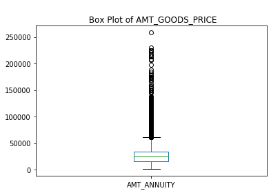


From the above box plot of AMT_ANNUITY, there are a lot of outliers.

Calculating Quantiles confirms the same. There is a huge jump from 95% value to max value .  
Hence, **Median : 24903** is the best value to impute the missing values in ```AMT_ANNUITY```, since mean is not robust to outliers. 

### AMT_GOODS_PRICE Imputation


```python
print('Quantile\tAMT_GOODS_PRICE')
application_data['AMT_GOODS_PRICE'].plot.box()
plt.title('\n Box Plot of AMT_GOODS_PRICE')
application_data['AMT_GOODS_PRICE'].quantile([0.5,0.8,0.85,0.90,0.95,1])
```

    Quantile	AMT_GOODS_PRICE


    0.50     450,000.00
    0.80     814,500.00
    0.85     900,000.00
    0.90   1,093,500.00
    0.95   1,305,000.00
    1.00   4,050,000.00
    Name: AMT_GOODS_PRICE, dtype: float64


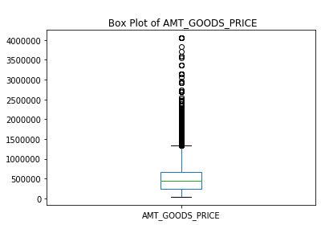


The above box plot show significant number of outliers. This confirmed by the quantiles.   
There is a huge jump from 95 percentile value to Maximum value.   
In this case, since there are many outliers, Mean is not a good representation of the data since it is not robust to outliers.   

Hence ,**Median : 450000** is the best metric to impute missing values

### NAME_TYPE_SUITE Imputation : 


```python
print('Data type of NAME_TYPE_SUITE : ',application_data['NAME_TYPE_SUITE'].dtype,'\n\n')
print('Category\tNormalized Count\n\n',application_data['NAME_TYPE_SUITE'].value_counts(normalize=True))
data = application_data['NAME_TYPE_SUITE'].value_counts(normalize=True)
plt.bar(data.index,data.values)
# data.hist()
plt.xticks(rotation=90)
plt.ylabel('Normalized Value Counts')
plt.title('\nNAME_TYPE_SUITE');
```

    Data type of NAME_TYPE_SUITE :  object 
    
    
    Category	Normalized Count
    
     Unaccompanied     0.81
    Family            0.13
    Spouse, partner   0.04
    Children          0.01
    Other_B           0.01
    Other_A           0.00
    Group of people   0.00
    Name: NAME_TYPE_SUITE, dtype: float64


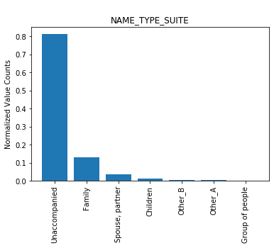


```NAME_TYPE_SUITE``` is a categorical variable.   
The best metric to impute missing values is Mode of the data.   
From the above plot, 'Unaccompanied' is the Mode  

Hence, **Unaccompanied** is the best value to impute the missing values.   

### CNT_FAM_MEMBERS Imputation


```python
application_data['CNT_FAM_MEMBERS'] = application_data['CNT_FAM_MEMBERS'].astype('category')

print('Data type of CNT_FAM_MEMBERS : ',application_data['CNT_FAM_MEMBERS'].dtype,'\n\n')

print('Fly Mems | Value Counts\n',application_data['CNT_FAM_MEMBERS'].value_counts(normalize=True))

(application_data['CNT_FAM_MEMBERS'].value_counts()).sort_index().plot(kind='bar')
plt.title('\nNo of Family Members vs Value Counts');
```

    Data type of CNT_FAM_MEMBERS :  category 
    
    
    Fly Mems | Value Counts
     2.00    0.51
    1.00    0.22
    3.00    0.17
    4.00    0.08
    5.00    0.01
    6.00    0.00
    7.00    0.00
    8.00    0.00
    9.00    0.00
    10.00   0.00
    16.00   0.00
    12.00   0.00
    14.00   0.00
    20.00   0.00
    11.00   0.00
    13.00   0.00
    15.00   0.00
    Name: CNT_FAM_MEMBERS, dtype: float64


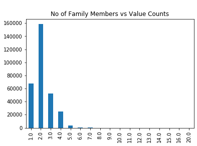


### EXT_SOURCE_2 Imputation


```python
print('Data type of EXT_SOURCE_2 : ',application_data['EXT_SOURCE_2'].dtype,'\n\n')
application_data['EXT_SOURCE_2'].plot.box()
plt.title('\nEXT_SOURCE_2');
print('Quantile\tValue')
application_data['EXT_SOURCE_2'].quantile([0.5,0.8,0.85,0.90,0.95,1])
```

    Data type of EXT_SOURCE_2 :  float64 
    
    
    Quantile	Value


    0.50   0.57
    0.80   0.68
    0.85   0.70
    0.90   0.72
    0.95   0.75
    1.00   0.85
    Name: EXT_SOURCE_2, dtype: float64


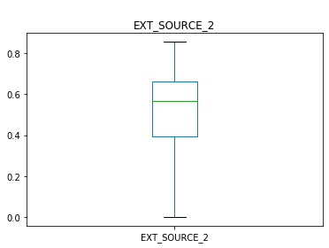


```python
round(application_data['EXT_SOURCE_2'].mean(),2)
```


    0.51


```EXT_SOURCE_2``` is the credit rating by an external source. It is a numerical continuous variable. The above bar plot and the quantiles show no outliers. In this case **Mean** and **Median** are very close. Because there are no outliers, **Mean : 0.51** could be used to impute missing values. 

### Checking for Disguised Missing Values


```python
def cat_value_counts(column_name) : 
    print(tabulate(pd.DataFrame(application_data.stb.freq([column_name])), headers='keys', tablefmt='psql'))
    print(pd.DataFrame(application_data[column_name]).stb.missing(),'\n\n\n')

```


```python
#Replacing XAN with np.nan in Gender column : 

application_data['CODE_GENDER'] = application_data['CODE_GENDER'].replace('XNA',np.nan)
cat_value_counts('CODE_GENDER')
```

    +----+---------------+---------+-----------+--------------------+----------------------+
    |    | CODE_GENDER   |   Count |   Percent |   Cumulative Count |   Cumulative Percent |
    |----+---------------+---------+-----------+--------------------+----------------------|
    |  0 | F             |  202448 |  0.658352 |             202448 |             0.658352 |
    |  1 | M             |  105059 |  0.341648 |             307507 |             1        |
    +----+---------------+---------+-----------+--------------------+----------------------+
                 Missing   Total  Percent
    CODE_GENDER        4  307511     0.00 
    
    
    


Since ```CODE_GENDER``` is a categorical variable, the missing values could be imputed with **Mode** : F


```python
# replacing Unknown in NAME_FAMILY_STATUS with np.nan 
application_data['NAME_FAMILY_STATUS'] = application_data['NAME_FAMILY_STATUS'].replace('Unknown',np.nan)
cat_value_counts('NAME_FAMILY_STATUS')
```

    +----+----------------------+---------+-----------+--------------------+----------------------+
    |    | NAME_FAMILY_STATUS   |   Count |   Percent |   Cumulative Count |   Cumulative Percent |
    |----+----------------------+---------+-----------+--------------------+----------------------|
    |  0 | Married              |  196432 | 0.638785  |             196432 |             0.638785 |
    |  1 | Single / not married |   45444 | 0.147781  |             241876 |             0.786566 |
    |  2 | Civil marriage       |   29775 | 0.0968264 |             271651 |             0.883392 |
    |  3 | Separated            |   19770 | 0.0642908 |             291421 |             0.947683 |
    |  4 | Widow                |   16088 | 0.0523172 |             307509 |             1        |
    +----+----------------------+---------+-----------+--------------------+----------------------+
                        Missing   Total  Percent
    NAME_FAMILY_STATUS        2  307511     0.00 
    
    
    


Since ```NAME_FAMILY_STATUS``` is a categorical variable, the missing values could be imputed with **Mode** : Married


```python
# replacing XNA values in ORGANIZATION_TYPE 
application_data['ORGANIZATION_TYPE'] = application_data['ORGANIZATION_TYPE'].replace('XNA',np.nan)
cat_value_counts('ORGANIZATION_TYPE')
```

    +----+------------------------+---------+-------------+--------------------+----------------------+
    |    | ORGANIZATION_TYPE      |   Count |     Percent |   Cumulative Count |   Cumulative Percent |
    |----+------------------------+---------+-------------+--------------------+----------------------|
    |  0 | Business Entity Type 3 |   67992 | 0.269663    |              67992 |             0.269663 |
    |  1 | Self-employed          |   38412 | 0.152346    |             106404 |             0.422009 |
    |  2 | Other                  |   16683 | 0.0661664   |             123087 |             0.488175 |
    |  3 | Medicine               |   11193 | 0.0443925   |             134280 |             0.532568 |
    |  4 | Business Entity Type 2 |   10553 | 0.0418542   |             144833 |             0.574422 |
    |  5 | Government             |   10404 | 0.0412633   |             155237 |             0.615685 |
    |  6 | School                 |    8893 | 0.0352705   |             164130 |             0.650956 |
    |  7 | Trade: type 7          |    7831 | 0.0310585   |             171961 |             0.682014 |
    |  8 | Kindergarten           |    6880 | 0.0272868   |             178841 |             0.709301 |
    |  9 | Construction           |    6721 | 0.0266561   |             185562 |             0.735957 |
    | 10 | Business Entity Type 1 |    5984 | 0.0237331   |             191546 |             0.75969  |
    | 11 | Transport: type 4      |    5398 | 0.021409    |             196944 |             0.781099 |
    | 12 | Trade: type 3          |    3492 | 0.0138496   |             200436 |             0.794949 |
    | 13 | Industry: type 9       |    3368 | 0.0133578   |             203804 |             0.808307 |
    | 14 | Industry: type 3       |    3278 | 0.0130009   |             207082 |             0.821307 |
    | 15 | Security               |    3247 | 0.0128779   |             210329 |             0.834185 |
    | 16 | Housing                |    2958 | 0.0117317   |             213287 |             0.845917 |
    | 17 | Industry: type 11      |    2704 | 0.0107243   |             215991 |             0.856641 |
    | 18 | Military               |    2634 | 0.0104467   |             218625 |             0.867088 |
    | 19 | Bank                   |    2507 | 0.00994301  |             221132 |             0.877031 |
    | 20 | Agriculture            |    2454 | 0.0097328   |             223586 |             0.886764 |
    | 21 | Police                 |    2341 | 0.00928463  |             225927 |             0.896049 |
    | 22 | Transport: type 2      |    2204 | 0.00874128  |             228131 |             0.90479  |
    | 23 | Postal                 |    2157 | 0.00855487  |             230288 |             0.913345 |
    | 24 | Security Ministries    |    1974 | 0.00782908  |             232262 |             0.921174 |
    | 25 | Trade: type 2          |    1900 | 0.00753559  |             234162 |             0.928709 |
    | 26 | Restaurant             |    1811 | 0.0071826   |             235973 |             0.935892 |
    | 27 | Services               |    1575 | 0.0062466   |             237548 |             0.942139 |
    | 28 | University             |    1327 | 0.00526301  |             238875 |             0.947402 |
    | 29 | Industry: type 7       |    1307 | 0.00518369  |             240182 |             0.952585 |
    | 30 | Transport: type 3      |    1187 | 0.00470776  |             241369 |             0.957293 |
    | 31 | Industry: type 1       |    1039 | 0.00412078  |             242408 |             0.961414 |
    | 32 | Hotel                  |     966 | 0.00383125  |             243374 |             0.965245 |
    | 33 | Electricity            |     950 | 0.00376779  |             244324 |             0.969013 |
    | 34 | Industry: type 4       |     877 | 0.00347827  |             245201 |             0.972491 |
    | 35 | Trade: type 6          |     631 | 0.00250261  |             245832 |             0.974994 |
    | 36 | Industry: type 5       |     599 | 0.00237569  |             246431 |             0.977369 |
    | 37 | Insurance              |     597 | 0.00236776  |             247028 |             0.979737 |
    | 38 | Telecom                |     577 | 0.00228844  |             247605 |             0.982026 |
    | 39 | Emergency              |     560 | 0.00222101  |             248165 |             0.984247 |
    | 40 | Industry: type 2       |     458 | 0.00181647  |             248623 |             0.986063 |
    | 41 | Advertising            |     429 | 0.00170146  |             249052 |             0.987765 |
    | 42 | Realtor                |     396 | 0.00157057  |             249448 |             0.989335 |
    | 43 | Culture                |     379 | 0.00150315  |             249827 |             0.990838 |
    | 44 | Industry: type 12      |     369 | 0.00146349  |             250196 |             0.992302 |
    | 45 | Trade: type 1          |     348 | 0.0013802   |             250544 |             0.993682 |
    | 46 | Mobile                 |     317 | 0.00125725  |             250861 |             0.994939 |
    | 47 | Legal Services         |     305 | 0.00120966  |             251166 |             0.996149 |
    | 48 | Cleaning               |     260 | 0.00103119  |             251426 |             0.99718  |
    | 49 | Transport: type 1      |     201 | 0.000797186 |             251627 |             0.997977 |
    | 50 | Industry: type 6       |     112 | 0.000444203 |             251739 |             0.998421 |
    | 51 | Industry: type 10      |     109 | 0.000432305 |             251848 |             0.998854 |
    | 52 | Religion               |      85 | 0.000337118 |             251933 |             0.999191 |
    | 53 | Industry: type 13      |      67 | 0.000265729 |             252000 |             0.999457 |
    | 54 | Trade: type 4          |      64 | 0.00025383  |             252064 |             0.99971  |
    | 55 | Trade: type 5          |      49 | 0.000194339 |             252113 |             0.999905 |
    | 56 | Industry: type 8       |      24 | 9.51863e-05 |             252137 |             1        |
    +----+------------------------+---------+-------------+--------------------+----------------------+
                       Missing   Total  Percent
    ORGANIZATION_TYPE    55374  307511     0.18 
    
    
    


Since ```ORGANIZATION_TYPE``` is a categorical variable, the missing values could be imputed with **Mode** : Business Entity Type 3

### Data Type Checks


```python
pd.DataFrame(application_data.dtypes)
```


<div>
<style scoped>
    .dataframe tbody tr th:only-of-type {
        vertical-align: middle;
    }

    .dataframe tbody tr th {
        vertical-align: top;
    }

    .dataframe thead th {
        text-align: right;
    }
</style>
<table border="1" class="dataframe">
  <thead>
    <tr style="text-align: right;">
      <th></th>
      <th>0</th>
    </tr>
  </thead>
  <tbody>
    <tr>
      <th>SK_ID_CURR</th>
      <td>int64</td>
    </tr>
    <tr>
      <th>TARGET</th>
      <td>int64</td>
    </tr>
    <tr>
      <th>NAME_CONTRACT_TYPE</th>
      <td>object</td>
    </tr>
    <tr>
      <th>CODE_GENDER</th>
      <td>object</td>
    </tr>
    <tr>
      <th>FLAG_OWN_CAR</th>
      <td>object</td>
    </tr>
    <tr>
      <th>FLAG_OWN_REALTY</th>
      <td>object</td>
    </tr>
    <tr>
      <th>CNT_CHILDREN</th>
      <td>int64</td>
    </tr>
    <tr>
      <th>AMT_INCOME_TOTAL</th>
      <td>float64</td>
    </tr>
    <tr>
      <th>AMT_CREDIT</th>
      <td>float64</td>
    </tr>
    <tr>
      <th>AMT_ANNUITY</th>
      <td>float64</td>
    </tr>
    <tr>
      <th>AMT_GOODS_PRICE</th>
      <td>float64</td>
    </tr>
    <tr>
      <th>NAME_TYPE_SUITE</th>
      <td>object</td>
    </tr>
    <tr>
      <th>NAME_INCOME_TYPE</th>
      <td>object</td>
    </tr>
    <tr>
      <th>NAME_EDUCATION_TYPE</th>
      <td>object</td>
    </tr>
    <tr>
      <th>NAME_FAMILY_STATUS</th>
      <td>object</td>
    </tr>
    <tr>
      <th>NAME_HOUSING_TYPE</th>
      <td>object</td>
    </tr>
    <tr>
      <th>REGION_POPULATION_RELATIVE</th>
      <td>float64</td>
    </tr>
    <tr>
      <th>DAYS_BIRTH</th>
      <td>int64</td>
    </tr>
    <tr>
      <th>DAYS_EMPLOYED</th>
      <td>int64</td>
    </tr>
    <tr>
      <th>DAYS_REGISTRATION</th>
      <td>float64</td>
    </tr>
    <tr>
      <th>DAYS_ID_PUBLISH</th>
      <td>int64</td>
    </tr>
    <tr>
      <th>FLAG_MOBIL</th>
      <td>int64</td>
    </tr>
    <tr>
      <th>FLAG_EMP_PHONE</th>
      <td>int64</td>
    </tr>
    <tr>
      <th>FLAG_WORK_PHONE</th>
      <td>int64</td>
    </tr>
    <tr>
      <th>FLAG_CONT_MOBILE</th>
      <td>int64</td>
    </tr>
    <tr>
      <th>FLAG_PHONE</th>
      <td>int64</td>
    </tr>
    <tr>
      <th>FLAG_EMAIL</th>
      <td>int64</td>
    </tr>
    <tr>
      <th>OCCUPATION_TYPE</th>
      <td>object</td>
    </tr>
    <tr>
      <th>CNT_FAM_MEMBERS</th>
      <td>category</td>
    </tr>
    <tr>
      <th>REGION_RATING_CLIENT</th>
      <td>int64</td>
    </tr>
    <tr>
      <th>REGION_RATING_CLIENT_W_CITY</th>
      <td>int64</td>
    </tr>
    <tr>
      <th>WEEKDAY_APPR_PROCESS_START</th>
      <td>object</td>
    </tr>
    <tr>
      <th>HOUR_APPR_PROCESS_START</th>
      <td>int64</td>
    </tr>
    <tr>
      <th>REG_REGION_NOT_LIVE_REGION</th>
      <td>int64</td>
    </tr>
    <tr>
      <th>REG_REGION_NOT_WORK_REGION</th>
      <td>int64</td>
    </tr>
    <tr>
      <th>LIVE_REGION_NOT_WORK_REGION</th>
      <td>int64</td>
    </tr>
    <tr>
      <th>REG_CITY_NOT_LIVE_CITY</th>
      <td>int64</td>
    </tr>
    <tr>
      <th>REG_CITY_NOT_WORK_CITY</th>
      <td>int64</td>
    </tr>
    <tr>
      <th>LIVE_CITY_NOT_WORK_CITY</th>
      <td>int64</td>
    </tr>
    <tr>
      <th>ORGANIZATION_TYPE</th>
      <td>object</td>
    </tr>
    <tr>
      <th>EXT_SOURCE_2</th>
      <td>float64</td>
    </tr>
    <tr>
      <th>EXT_SOURCE_3</th>
      <td>float64</td>
    </tr>
    <tr>
      <th>YEARS_BEGINEXPLUATATION_AVG</th>
      <td>float64</td>
    </tr>
    <tr>
      <th>FLOORSMAX_AVG</th>
      <td>float64</td>
    </tr>
    <tr>
      <th>YEARS_BEGINEXPLUATATION_MODE</th>
      <td>float64</td>
    </tr>
    <tr>
      <th>FLOORSMAX_MODE</th>
      <td>float64</td>
    </tr>
    <tr>
      <th>YEARS_BEGINEXPLUATATION_MEDI</th>
      <td>float64</td>
    </tr>
    <tr>
      <th>FLOORSMAX_MEDI</th>
      <td>float64</td>
    </tr>
    <tr>
      <th>TOTALAREA_MODE</th>
      <td>float64</td>
    </tr>
    <tr>
      <th>EMERGENCYSTATE_MODE</th>
      <td>object</td>
    </tr>
    <tr>
      <th>OBS_30_CNT_SOCIAL_CIRCLE</th>
      <td>float64</td>
    </tr>
    <tr>
      <th>DEF_30_CNT_SOCIAL_CIRCLE</th>
      <td>float64</td>
    </tr>
    <tr>
      <th>OBS_60_CNT_SOCIAL_CIRCLE</th>
      <td>float64</td>
    </tr>
    <tr>
      <th>DEF_60_CNT_SOCIAL_CIRCLE</th>
      <td>float64</td>
    </tr>
    <tr>
      <th>DAYS_LAST_PHONE_CHANGE</th>
      <td>float64</td>
    </tr>
    <tr>
      <th>FLAG_DOCUMENT_2</th>
      <td>int64</td>
    </tr>
    <tr>
      <th>FLAG_DOCUMENT_3</th>
      <td>int64</td>
    </tr>
    <tr>
      <th>FLAG_DOCUMENT_4</th>
      <td>int64</td>
    </tr>
    <tr>
      <th>FLAG_DOCUMENT_5</th>
      <td>int64</td>
    </tr>
    <tr>
      <th>FLAG_DOCUMENT_6</th>
      <td>int64</td>
    </tr>
    <tr>
      <th>FLAG_DOCUMENT_7</th>
      <td>int64</td>
    </tr>
    <tr>
      <th>FLAG_DOCUMENT_8</th>
      <td>int64</td>
    </tr>
    <tr>
      <th>FLAG_DOCUMENT_9</th>
      <td>int64</td>
    </tr>
    <tr>
      <th>FLAG_DOCUMENT_10</th>
      <td>int64</td>
    </tr>
    <tr>
      <th>FLAG_DOCUMENT_11</th>
      <td>int64</td>
    </tr>
    <tr>
      <th>FLAG_DOCUMENT_12</th>
      <td>int64</td>
    </tr>
    <tr>
      <th>FLAG_DOCUMENT_13</th>
      <td>int64</td>
    </tr>
    <tr>
      <th>FLAG_DOCUMENT_14</th>
      <td>int64</td>
    </tr>
    <tr>
      <th>FLAG_DOCUMENT_15</th>
      <td>int64</td>
    </tr>
    <tr>
      <th>FLAG_DOCUMENT_16</th>
      <td>int64</td>
    </tr>
    <tr>
      <th>FLAG_DOCUMENT_17</th>
      <td>int64</td>
    </tr>
    <tr>
      <th>FLAG_DOCUMENT_18</th>
      <td>int64</td>
    </tr>
    <tr>
      <th>FLAG_DOCUMENT_19</th>
      <td>int64</td>
    </tr>
    <tr>
      <th>FLAG_DOCUMENT_20</th>
      <td>int64</td>
    </tr>
    <tr>
      <th>FLAG_DOCUMENT_21</th>
      <td>int64</td>
    </tr>
    <tr>
      <th>AMT_REQ_CREDIT_BUREAU_HOUR</th>
      <td>float64</td>
    </tr>
    <tr>
      <th>AMT_REQ_CREDIT_BUREAU_DAY</th>
      <td>float64</td>
    </tr>
    <tr>
      <th>AMT_REQ_CREDIT_BUREAU_WEEK</th>
      <td>float64</td>
    </tr>
    <tr>
      <th>AMT_REQ_CREDIT_BUREAU_MON</th>
      <td>float64</td>
    </tr>
    <tr>
      <th>AMT_REQ_CREDIT_BUREAU_QRT</th>
      <td>float64</td>
    </tr>
    <tr>
      <th>AMT_REQ_CREDIT_BUREAU_YEAR</th>
      <td>float64</td>
    </tr>
  </tbody>
</table>
</div>


```python
application_data[['DAYS_BIRTH','DAYS_EMPLOYED','DAYS_REGISTRATION','DAYS_ID_PUBLISH']].head()
```


<div>
<style scoped>
    .dataframe tbody tr th:only-of-type {
        vertical-align: middle;
    }

    .dataframe tbody tr th {
        vertical-align: top;
    }

    .dataframe thead th {
        text-align: right;
    }
</style>
<table border="1" class="dataframe">
  <thead>
    <tr style="text-align: right;">
      <th></th>
      <th>DAYS_BIRTH</th>
      <th>DAYS_EMPLOYED</th>
      <th>DAYS_REGISTRATION</th>
      <th>DAYS_ID_PUBLISH</th>
    </tr>
  </thead>
  <tbody>
    <tr>
      <th>0</th>
      <td>-9461</td>
      <td>-637</td>
      <td>-3,648.00</td>
      <td>-2120</td>
    </tr>
    <tr>
      <th>1</th>
      <td>-16765</td>
      <td>-1188</td>
      <td>-1,186.00</td>
      <td>-291</td>
    </tr>
    <tr>
      <th>2</th>
      <td>-19046</td>
      <td>-225</td>
      <td>-4,260.00</td>
      <td>-2531</td>
    </tr>
    <tr>
      <th>3</th>
      <td>-19005</td>
      <td>-3039</td>
      <td>-9,833.00</td>
      <td>-2437</td>
    </tr>
    <tr>
      <th>4</th>
      <td>-19932</td>
      <td>-3038</td>
      <td>-4,311.00</td>
      <td>-3458</td>
    </tr>
  </tbody>
</table>
</div>


The ```DAYS_BIRTH```,```DAYS_EMPLOYED```,```DAYS_REGISTRATION```,```DAYS_ID_PUBLISH``` have negative values, since they are in past with respect to date of application.   
To standard size these columns for the purpose of analysis, we could converted them to their absolute values


```python
columns_to_convert = ['DAYS_BIRTH','DAYS_EMPLOYED','DAYS_REGISTRATION','DAYS_ID_PUBLISH']
application_data[columns_to_convert] = application_data[columns_to_convert].abs()
application_data[columns_to_convert].head()
```


<div>
<style scoped>
    .dataframe tbody tr th:only-of-type {
        vertical-align: middle;
    }

    .dataframe tbody tr th {
        vertical-align: top;
    }

    .dataframe thead th {
        text-align: right;
    }
</style>
<table border="1" class="dataframe">
  <thead>
    <tr style="text-align: right;">
      <th></th>
      <th>DAYS_BIRTH</th>
      <th>DAYS_EMPLOYED</th>
      <th>DAYS_REGISTRATION</th>
      <th>DAYS_ID_PUBLISH</th>
    </tr>
  </thead>
  <tbody>
    <tr>
      <th>0</th>
      <td>9,461.00</td>
      <td>637.00</td>
      <td>3,648.00</td>
      <td>2,120.00</td>
    </tr>
    <tr>
      <th>1</th>
      <td>16,765.00</td>
      <td>1,188.00</td>
      <td>1,186.00</td>
      <td>291.00</td>
    </tr>
    <tr>
      <th>2</th>
      <td>19,046.00</td>
      <td>225.00</td>
      <td>4,260.00</td>
      <td>2,531.00</td>
    </tr>
    <tr>
      <th>3</th>
      <td>19,005.00</td>
      <td>3,039.00</td>
      <td>9,833.00</td>
      <td>2,437.00</td>
    </tr>
    <tr>
      <th>4</th>
      <td>19,932.00</td>
      <td>3,038.00</td>
      <td>4,311.00</td>
      <td>3,458.00</td>
    </tr>
  </tbody>
</table>
</div>


```python
# checking columns with binary values
values_per_column = application_data.nunique().sort_values()
col_values_dtype = pd.DataFrame(index=values_per_column.index, data= {'Unique Values' : values_per_column.values, 'Data Type' : application_data.dtypes})
col_values_dtype
```


<div>
<style scoped>
    .dataframe tbody tr th:only-of-type {
        vertical-align: middle;
    }

    .dataframe tbody tr th {
        vertical-align: top;
    }

    .dataframe thead th {
        text-align: right;
    }
</style>
<table border="1" class="dataframe">
  <thead>
    <tr style="text-align: right;">
      <th></th>
      <th>Unique Values</th>
      <th>Data Type</th>
    </tr>
  </thead>
  <tbody>
    <tr>
      <th>FLAG_DOCUMENT_3</th>
      <td>2</td>
      <td>int64</td>
    </tr>
    <tr>
      <th>FLAG_PHONE</th>
      <td>2</td>
      <td>int64</td>
    </tr>
    <tr>
      <th>FLAG_DOCUMENT_4</th>
      <td>2</td>
      <td>int64</td>
    </tr>
    <tr>
      <th>FLAG_DOCUMENT_2</th>
      <td>2</td>
      <td>int64</td>
    </tr>
    <tr>
      <th>REG_REGION_NOT_LIVE_REGION</th>
      <td>2</td>
      <td>int64</td>
    </tr>
    <tr>
      <th>REG_REGION_NOT_WORK_REGION</th>
      <td>2</td>
      <td>int64</td>
    </tr>
    <tr>
      <th>LIVE_REGION_NOT_WORK_REGION</th>
      <td>2</td>
      <td>int64</td>
    </tr>
    <tr>
      <th>REG_CITY_NOT_LIVE_CITY</th>
      <td>2</td>
      <td>int64</td>
    </tr>
    <tr>
      <th>REG_CITY_NOT_WORK_CITY</th>
      <td>2</td>
      <td>int64</td>
    </tr>
    <tr>
      <th>LIVE_CITY_NOT_WORK_CITY</th>
      <td>2</td>
      <td>int64</td>
    </tr>
    <tr>
      <th>FLAG_DOCUMENT_14</th>
      <td>2</td>
      <td>int64</td>
    </tr>
    <tr>
      <th>FLAG_DOCUMENT_13</th>
      <td>2</td>
      <td>int64</td>
    </tr>
    <tr>
      <th>FLAG_DOCUMENT_12</th>
      <td>2</td>
      <td>int64</td>
    </tr>
    <tr>
      <th>FLAG_DOCUMENT_11</th>
      <td>2</td>
      <td>int64</td>
    </tr>
    <tr>
      <th>FLAG_DOCUMENT_10</th>
      <td>2</td>
      <td>int64</td>
    </tr>
    <tr>
      <th>FLAG_DOCUMENT_9</th>
      <td>2</td>
      <td>int64</td>
    </tr>
    <tr>
      <th>FLAG_DOCUMENT_8</th>
      <td>2</td>
      <td>int64</td>
    </tr>
    <tr>
      <th>FLAG_DOCUMENT_7</th>
      <td>2</td>
      <td>int64</td>
    </tr>
    <tr>
      <th>EMERGENCYSTATE_MODE</th>
      <td>2</td>
      <td>object</td>
    </tr>
    <tr>
      <th>FLAG_DOCUMENT_6</th>
      <td>2</td>
      <td>int64</td>
    </tr>
    <tr>
      <th>FLAG_CONT_MOBILE</th>
      <td>2</td>
      <td>int64</td>
    </tr>
    <tr>
      <th>FLAG_WORK_PHONE</th>
      <td>2</td>
      <td>int64</td>
    </tr>
    <tr>
      <th>FLAG_EMAIL</th>
      <td>2</td>
      <td>int64</td>
    </tr>
    <tr>
      <th>FLAG_MOBIL</th>
      <td>2</td>
      <td>int64</td>
    </tr>
    <tr>
      <th>TARGET</th>
      <td>2</td>
      <td>int64</td>
    </tr>
    <tr>
      <th>NAME_CONTRACT_TYPE</th>
      <td>2</td>
      <td>object</td>
    </tr>
    <tr>
      <th>CODE_GENDER</th>
      <td>2</td>
      <td>object</td>
    </tr>
    <tr>
      <th>FLAG_OWN_CAR</th>
      <td>2</td>
      <td>object</td>
    </tr>
    <tr>
      <th>FLAG_OWN_REALTY</th>
      <td>2</td>
      <td>object</td>
    </tr>
    <tr>
      <th>FLAG_DOCUMENT_21</th>
      <td>2</td>
      <td>int64</td>
    </tr>
    <tr>
      <th>FLAG_DOCUMENT_20</th>
      <td>2</td>
      <td>int64</td>
    </tr>
    <tr>
      <th>FLAG_EMP_PHONE</th>
      <td>2</td>
      <td>int64</td>
    </tr>
    <tr>
      <th>FLAG_DOCUMENT_19</th>
      <td>2</td>
      <td>int64</td>
    </tr>
    <tr>
      <th>FLAG_DOCUMENT_5</th>
      <td>2</td>
      <td>int64</td>
    </tr>
    <tr>
      <th>FLAG_DOCUMENT_15</th>
      <td>2</td>
      <td>int64</td>
    </tr>
    <tr>
      <th>FLAG_DOCUMENT_16</th>
      <td>2</td>
      <td>int64</td>
    </tr>
    <tr>
      <th>FLAG_DOCUMENT_17</th>
      <td>2</td>
      <td>int64</td>
    </tr>
    <tr>
      <th>FLAG_DOCUMENT_18</th>
      <td>2</td>
      <td>int64</td>
    </tr>
    <tr>
      <th>REGION_RATING_CLIENT_W_CITY</th>
      <td>3</td>
      <td>int64</td>
    </tr>
    <tr>
      <th>REGION_RATING_CLIENT</th>
      <td>3</td>
      <td>int64</td>
    </tr>
    <tr>
      <th>AMT_REQ_CREDIT_BUREAU_HOUR</th>
      <td>5</td>
      <td>float64</td>
    </tr>
    <tr>
      <th>NAME_FAMILY_STATUS</th>
      <td>5</td>
      <td>object</td>
    </tr>
    <tr>
      <th>NAME_EDUCATION_TYPE</th>
      <td>5</td>
      <td>object</td>
    </tr>
    <tr>
      <th>NAME_HOUSING_TYPE</th>
      <td>6</td>
      <td>object</td>
    </tr>
    <tr>
      <th>NAME_TYPE_SUITE</th>
      <td>7</td>
      <td>object</td>
    </tr>
    <tr>
      <th>WEEKDAY_APPR_PROCESS_START</th>
      <td>7</td>
      <td>object</td>
    </tr>
    <tr>
      <th>NAME_INCOME_TYPE</th>
      <td>8</td>
      <td>object</td>
    </tr>
    <tr>
      <th>AMT_REQ_CREDIT_BUREAU_DAY</th>
      <td>9</td>
      <td>float64</td>
    </tr>
    <tr>
      <th>AMT_REQ_CREDIT_BUREAU_WEEK</th>
      <td>9</td>
      <td>float64</td>
    </tr>
    <tr>
      <th>DEF_60_CNT_SOCIAL_CIRCLE</th>
      <td>9</td>
      <td>float64</td>
    </tr>
    <tr>
      <th>DEF_30_CNT_SOCIAL_CIRCLE</th>
      <td>10</td>
      <td>float64</td>
    </tr>
    <tr>
      <th>AMT_REQ_CREDIT_BUREAU_QRT</th>
      <td>11</td>
      <td>float64</td>
    </tr>
    <tr>
      <th>CNT_CHILDREN</th>
      <td>15</td>
      <td>int64</td>
    </tr>
    <tr>
      <th>CNT_FAM_MEMBERS</th>
      <td>17</td>
      <td>category</td>
    </tr>
    <tr>
      <th>OCCUPATION_TYPE</th>
      <td>18</td>
      <td>object</td>
    </tr>
    <tr>
      <th>HOUR_APPR_PROCESS_START</th>
      <td>24</td>
      <td>int64</td>
    </tr>
    <tr>
      <th>AMT_REQ_CREDIT_BUREAU_MON</th>
      <td>24</td>
      <td>float64</td>
    </tr>
    <tr>
      <th>AMT_REQ_CREDIT_BUREAU_YEAR</th>
      <td>25</td>
      <td>float64</td>
    </tr>
    <tr>
      <th>FLOORSMAX_MODE</th>
      <td>25</td>
      <td>float64</td>
    </tr>
    <tr>
      <th>OBS_60_CNT_SOCIAL_CIRCLE</th>
      <td>33</td>
      <td>float64</td>
    </tr>
    <tr>
      <th>OBS_30_CNT_SOCIAL_CIRCLE</th>
      <td>33</td>
      <td>float64</td>
    </tr>
    <tr>
      <th>FLOORSMAX_MEDI</th>
      <td>49</td>
      <td>float64</td>
    </tr>
    <tr>
      <th>ORGANIZATION_TYPE</th>
      <td>57</td>
      <td>object</td>
    </tr>
    <tr>
      <th>REGION_POPULATION_RELATIVE</th>
      <td>81</td>
      <td>float64</td>
    </tr>
    <tr>
      <th>YEARS_BEGINEXPLUATATION_MODE</th>
      <td>221</td>
      <td>float64</td>
    </tr>
    <tr>
      <th>YEARS_BEGINEXPLUATATION_MEDI</th>
      <td>245</td>
      <td>float64</td>
    </tr>
    <tr>
      <th>YEARS_BEGINEXPLUATATION_AVG</th>
      <td>285</td>
      <td>float64</td>
    </tr>
    <tr>
      <th>FLOORSMAX_AVG</th>
      <td>403</td>
      <td>float64</td>
    </tr>
    <tr>
      <th>EXT_SOURCE_3</th>
      <td>814</td>
      <td>float64</td>
    </tr>
    <tr>
      <th>AMT_GOODS_PRICE</th>
      <td>1002</td>
      <td>float64</td>
    </tr>
    <tr>
      <th>AMT_INCOME_TOTAL</th>
      <td>2548</td>
      <td>float64</td>
    </tr>
    <tr>
      <th>DAYS_LAST_PHONE_CHANGE</th>
      <td>3773</td>
      <td>float64</td>
    </tr>
    <tr>
      <th>TOTALAREA_MODE</th>
      <td>5116</td>
      <td>float64</td>
    </tr>
    <tr>
      <th>AMT_CREDIT</th>
      <td>5603</td>
      <td>float64</td>
    </tr>
    <tr>
      <th>DAYS_ID_PUBLISH</th>
      <td>6168</td>
      <td>float64</td>
    </tr>
    <tr>
      <th>DAYS_EMPLOYED</th>
      <td>12574</td>
      <td>float64</td>
    </tr>
    <tr>
      <th>AMT_ANNUITY</th>
      <td>13672</td>
      <td>float64</td>
    </tr>
    <tr>
      <th>DAYS_REGISTRATION</th>
      <td>15688</td>
      <td>float64</td>
    </tr>
    <tr>
      <th>DAYS_BIRTH</th>
      <td>17460</td>
      <td>float64</td>
    </tr>
    <tr>
      <th>EXT_SOURCE_2</th>
      <td>119831</td>
      <td>float64</td>
    </tr>
    <tr>
      <th>SK_ID_CURR</th>
      <td>307511</td>
      <td>int64</td>
    </tr>
  </tbody>
</table>
</div>


The above columns are 'categorical' variables with only two values. But they have been read as 'int' datatype  
We could convert them into 'categorical' data type


```python
# converting to category data type 
convert_to_cat = col_values_dtype[col_values_dtype['Unique Values']<=8].index
application_data[convert_to_cat] = application_data[convert_to_cat].astype('category')
```


```python
# check if the columns are converted
values_per_column = application_data.nunique().sort_values()
new_categories  = pd.DataFrame(index=values_per_column.index, data= {'Unique Values' : values_per_column.values, 'Data Type' : application_data.dtypes})
new_categories
```


<div>
<style scoped>
    .dataframe tbody tr th:only-of-type {
        vertical-align: middle;
    }

    .dataframe tbody tr th {
        vertical-align: top;
    }

    .dataframe thead th {
        text-align: right;
    }
</style>
<table border="1" class="dataframe">
  <thead>
    <tr style="text-align: right;">
      <th></th>
      <th>Unique Values</th>
      <th>Data Type</th>
    </tr>
  </thead>
  <tbody>
    <tr>
      <th>FLAG_DOCUMENT_3</th>
      <td>2</td>
      <td>category</td>
    </tr>
    <tr>
      <th>FLAG_PHONE</th>
      <td>2</td>
      <td>category</td>
    </tr>
    <tr>
      <th>FLAG_DOCUMENT_4</th>
      <td>2</td>
      <td>category</td>
    </tr>
    <tr>
      <th>FLAG_DOCUMENT_2</th>
      <td>2</td>
      <td>category</td>
    </tr>
    <tr>
      <th>REG_REGION_NOT_LIVE_REGION</th>
      <td>2</td>
      <td>category</td>
    </tr>
    <tr>
      <th>REG_REGION_NOT_WORK_REGION</th>
      <td>2</td>
      <td>category</td>
    </tr>
    <tr>
      <th>LIVE_REGION_NOT_WORK_REGION</th>
      <td>2</td>
      <td>category</td>
    </tr>
    <tr>
      <th>REG_CITY_NOT_LIVE_CITY</th>
      <td>2</td>
      <td>category</td>
    </tr>
    <tr>
      <th>REG_CITY_NOT_WORK_CITY</th>
      <td>2</td>
      <td>category</td>
    </tr>
    <tr>
      <th>LIVE_CITY_NOT_WORK_CITY</th>
      <td>2</td>
      <td>category</td>
    </tr>
    <tr>
      <th>FLAG_DOCUMENT_14</th>
      <td>2</td>
      <td>category</td>
    </tr>
    <tr>
      <th>FLAG_DOCUMENT_13</th>
      <td>2</td>
      <td>category</td>
    </tr>
    <tr>
      <th>FLAG_DOCUMENT_12</th>
      <td>2</td>
      <td>category</td>
    </tr>
    <tr>
      <th>FLAG_DOCUMENT_11</th>
      <td>2</td>
      <td>category</td>
    </tr>
    <tr>
      <th>FLAG_DOCUMENT_10</th>
      <td>2</td>
      <td>category</td>
    </tr>
    <tr>
      <th>FLAG_DOCUMENT_9</th>
      <td>2</td>
      <td>category</td>
    </tr>
    <tr>
      <th>FLAG_DOCUMENT_8</th>
      <td>2</td>
      <td>category</td>
    </tr>
    <tr>
      <th>FLAG_DOCUMENT_7</th>
      <td>2</td>
      <td>category</td>
    </tr>
    <tr>
      <th>EMERGENCYSTATE_MODE</th>
      <td>2</td>
      <td>category</td>
    </tr>
    <tr>
      <th>FLAG_DOCUMENT_6</th>
      <td>2</td>
      <td>category</td>
    </tr>
    <tr>
      <th>FLAG_CONT_MOBILE</th>
      <td>2</td>
      <td>category</td>
    </tr>
    <tr>
      <th>FLAG_WORK_PHONE</th>
      <td>2</td>
      <td>category</td>
    </tr>
    <tr>
      <th>FLAG_EMAIL</th>
      <td>2</td>
      <td>category</td>
    </tr>
    <tr>
      <th>FLAG_MOBIL</th>
      <td>2</td>
      <td>category</td>
    </tr>
    <tr>
      <th>TARGET</th>
      <td>2</td>
      <td>category</td>
    </tr>
    <tr>
      <th>NAME_CONTRACT_TYPE</th>
      <td>2</td>
      <td>category</td>
    </tr>
    <tr>
      <th>CODE_GENDER</th>
      <td>2</td>
      <td>category</td>
    </tr>
    <tr>
      <th>FLAG_OWN_CAR</th>
      <td>2</td>
      <td>category</td>
    </tr>
    <tr>
      <th>FLAG_OWN_REALTY</th>
      <td>2</td>
      <td>category</td>
    </tr>
    <tr>
      <th>FLAG_DOCUMENT_21</th>
      <td>2</td>
      <td>category</td>
    </tr>
    <tr>
      <th>FLAG_DOCUMENT_20</th>
      <td>2</td>
      <td>category</td>
    </tr>
    <tr>
      <th>FLAG_EMP_PHONE</th>
      <td>2</td>
      <td>category</td>
    </tr>
    <tr>
      <th>FLAG_DOCUMENT_19</th>
      <td>2</td>
      <td>category</td>
    </tr>
    <tr>
      <th>FLAG_DOCUMENT_5</th>
      <td>2</td>
      <td>category</td>
    </tr>
    <tr>
      <th>FLAG_DOCUMENT_15</th>
      <td>2</td>
      <td>category</td>
    </tr>
    <tr>
      <th>FLAG_DOCUMENT_16</th>
      <td>2</td>
      <td>category</td>
    </tr>
    <tr>
      <th>FLAG_DOCUMENT_17</th>
      <td>2</td>
      <td>category</td>
    </tr>
    <tr>
      <th>FLAG_DOCUMENT_18</th>
      <td>2</td>
      <td>category</td>
    </tr>
    <tr>
      <th>REGION_RATING_CLIENT_W_CITY</th>
      <td>3</td>
      <td>category</td>
    </tr>
    <tr>
      <th>REGION_RATING_CLIENT</th>
      <td>3</td>
      <td>category</td>
    </tr>
    <tr>
      <th>AMT_REQ_CREDIT_BUREAU_HOUR</th>
      <td>5</td>
      <td>category</td>
    </tr>
    <tr>
      <th>NAME_FAMILY_STATUS</th>
      <td>5</td>
      <td>category</td>
    </tr>
    <tr>
      <th>NAME_EDUCATION_TYPE</th>
      <td>5</td>
      <td>category</td>
    </tr>
    <tr>
      <th>NAME_HOUSING_TYPE</th>
      <td>6</td>
      <td>category</td>
    </tr>
    <tr>
      <th>NAME_TYPE_SUITE</th>
      <td>7</td>
      <td>category</td>
    </tr>
    <tr>
      <th>WEEKDAY_APPR_PROCESS_START</th>
      <td>7</td>
      <td>category</td>
    </tr>
    <tr>
      <th>NAME_INCOME_TYPE</th>
      <td>8</td>
      <td>category</td>
    </tr>
    <tr>
      <th>AMT_REQ_CREDIT_BUREAU_DAY</th>
      <td>9</td>
      <td>float64</td>
    </tr>
    <tr>
      <th>AMT_REQ_CREDIT_BUREAU_WEEK</th>
      <td>9</td>
      <td>float64</td>
    </tr>
    <tr>
      <th>DEF_60_CNT_SOCIAL_CIRCLE</th>
      <td>9</td>
      <td>float64</td>
    </tr>
    <tr>
      <th>DEF_30_CNT_SOCIAL_CIRCLE</th>
      <td>10</td>
      <td>float64</td>
    </tr>
    <tr>
      <th>AMT_REQ_CREDIT_BUREAU_QRT</th>
      <td>11</td>
      <td>float64</td>
    </tr>
    <tr>
      <th>CNT_CHILDREN</th>
      <td>15</td>
      <td>int64</td>
    </tr>
    <tr>
      <th>CNT_FAM_MEMBERS</th>
      <td>17</td>
      <td>category</td>
    </tr>
    <tr>
      <th>OCCUPATION_TYPE</th>
      <td>18</td>
      <td>object</td>
    </tr>
    <tr>
      <th>HOUR_APPR_PROCESS_START</th>
      <td>24</td>
      <td>int64</td>
    </tr>
    <tr>
      <th>AMT_REQ_CREDIT_BUREAU_MON</th>
      <td>24</td>
      <td>float64</td>
    </tr>
    <tr>
      <th>AMT_REQ_CREDIT_BUREAU_YEAR</th>
      <td>25</td>
      <td>float64</td>
    </tr>
    <tr>
      <th>FLOORSMAX_MODE</th>
      <td>25</td>
      <td>float64</td>
    </tr>
    <tr>
      <th>OBS_60_CNT_SOCIAL_CIRCLE</th>
      <td>33</td>
      <td>float64</td>
    </tr>
    <tr>
      <th>OBS_30_CNT_SOCIAL_CIRCLE</th>
      <td>33</td>
      <td>float64</td>
    </tr>
    <tr>
      <th>FLOORSMAX_MEDI</th>
      <td>49</td>
      <td>float64</td>
    </tr>
    <tr>
      <th>ORGANIZATION_TYPE</th>
      <td>57</td>
      <td>object</td>
    </tr>
    <tr>
      <th>REGION_POPULATION_RELATIVE</th>
      <td>81</td>
      <td>float64</td>
    </tr>
    <tr>
      <th>YEARS_BEGINEXPLUATATION_MODE</th>
      <td>221</td>
      <td>float64</td>
    </tr>
    <tr>
      <th>YEARS_BEGINEXPLUATATION_MEDI</th>
      <td>245</td>
      <td>float64</td>
    </tr>
    <tr>
      <th>YEARS_BEGINEXPLUATATION_AVG</th>
      <td>285</td>
      <td>float64</td>
    </tr>
    <tr>
      <th>FLOORSMAX_AVG</th>
      <td>403</td>
      <td>float64</td>
    </tr>
    <tr>
      <th>EXT_SOURCE_3</th>
      <td>814</td>
      <td>float64</td>
    </tr>
    <tr>
      <th>AMT_GOODS_PRICE</th>
      <td>1002</td>
      <td>float64</td>
    </tr>
    <tr>
      <th>AMT_INCOME_TOTAL</th>
      <td>2548</td>
      <td>float64</td>
    </tr>
    <tr>
      <th>DAYS_LAST_PHONE_CHANGE</th>
      <td>3773</td>
      <td>float64</td>
    </tr>
    <tr>
      <th>TOTALAREA_MODE</th>
      <td>5116</td>
      <td>float64</td>
    </tr>
    <tr>
      <th>AMT_CREDIT</th>
      <td>5603</td>
      <td>float64</td>
    </tr>
    <tr>
      <th>DAYS_ID_PUBLISH</th>
      <td>6168</td>
      <td>float64</td>
    </tr>
    <tr>
      <th>DAYS_EMPLOYED</th>
      <td>12574</td>
      <td>float64</td>
    </tr>
    <tr>
      <th>AMT_ANNUITY</th>
      <td>13672</td>
      <td>float64</td>
    </tr>
    <tr>
      <th>DAYS_REGISTRATION</th>
      <td>15688</td>
      <td>float64</td>
    </tr>
    <tr>
      <th>DAYS_BIRTH</th>
      <td>17460</td>
      <td>float64</td>
    </tr>
    <tr>
      <th>EXT_SOURCE_2</th>
      <td>119831</td>
      <td>float64</td>
    </tr>
    <tr>
      <th>SK_ID_CURR</th>
      <td>307511</td>
      <td>int64</td>
    </tr>
  </tbody>
</table>
</div>


### Checking for Outliers 

### Checking for outliers in the following numerical columns 
* AMT_INCOME_TOTAL
* AMT_CREDIT
* AMT_ANNUITY
* AMT_GOODS_PRICE
* DAYS_BIRTH


```python
# Adding a new column "AGE_YEARS" using 'DAYS_BIRTH' with age in years
def days_to_years(x) : 
    if x < 0 : 
        x = -1*x 
    return x//365
application_data['AGE_YEARS'] = application_data['DAYS_BIRTH'].apply(days_to_years)
application_data['AGE_YEARS'].describe()
```


    count   307,511.00
    mean         43.44
    std          11.95
    min          20.00
    25%          34.00
    50%          43.00
    75%          53.00
    max          69.00
    Name: AGE_YEARS, dtype: float64


```python
# Box plots of the above numerical variables 
outlier_check_col = ["AMT_INCOME_TOTAL","AMT_CREDIT","AMT_ANNUITY","AMT_GOODS_PRICE","DAYS_BIRTH"]

fig,ax = plt.subplots(3,2)
fig.set_figheight(15)
fig.set_figwidth(15)
ax[0,0].set_yscale('log')
ax[0,0].set(ylabel ='Income in Log Scale')
application_data[outlier_check_col[0]].plot.box(ax=ax[0,0],);
application_data[outlier_check_col[1]].plot.box(ax=ax[0,1]);
application_data[outlier_check_col[2]].plot.box(ax=ax[1,0]);
application_data[outlier_check_col[3]].plot.box(ax=ax[1,1]);
ax[2,0].set(ylabel ='Age In Days')
application_data[outlier_check_col[4]].plot.box(ax=ax[2,0]); 
ax[2,1].axis('off')
print('Box Plots of "AMT_INCOME_TOTAL","AMT_CREDIT","AMT_ANNUITY","AMT_GOODS_PRICE","DAYS_BIRTH" \n')
    
```

    Box Plots of "AMT_INCOME_TOTAL","AMT_CREDIT","AMT_ANNUITY","AMT_GOODS_PRICE","DAYS_BIRTH" 
    


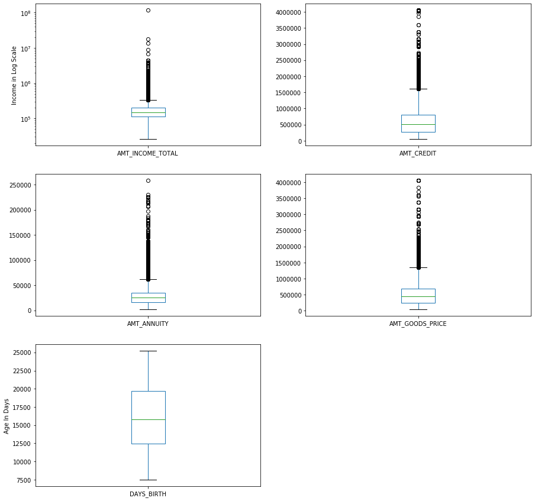


```python
## Calculating quantiles for the above columns
pd.options.display.float_format = '{:,.2f}'.format
for col in outlier_check_col : 
    print(col,'\n',application_data[col].quantile([0.5,0.8,0.85,0.90,0.95,1]),'\n\n')
    
```

    AMT_INCOME_TOTAL 
     0.50       147,150.00
    0.80       225,000.00
    0.85       234,000.00
    0.90       270,000.00
    0.95       337,500.00
    1.00   117,000,000.00
    Name: AMT_INCOME_TOTAL, dtype: float64 
    
    
    AMT_CREDIT 
     0.50     513,531.00
    0.80     900,000.00
    0.85   1,024,740.00
    0.90   1,133,748.00
    0.95   1,350,000.00
    1.00   4,050,000.00
    Name: AMT_CREDIT, dtype: float64 
    
    
    AMT_ANNUITY 
     0.50    24,903.00
    0.80    37,516.50
    0.85    40,806.00
    0.90    45,954.00
    0.95    53,325.00
    1.00   258,025.50
    Name: AMT_ANNUITY, dtype: float64 
    
    
    AMT_GOODS_PRICE 
     0.50     450,000.00
    0.80     814,500.00
    0.85     900,000.00
    0.90   1,093,500.00
    0.95   1,305,000.00
    1.00   4,050,000.00
    Name: AMT_GOODS_PRICE, dtype: float64 
    
    
    DAYS_BIRTH 
     0.50   15,750.00
    0.80   20,474.00
    0.85   21,316.00
    0.90   22,181.00
    0.95   23,204.00
    1.00   25,229.00
    Name: DAYS_BIRTH, dtype: float64 
    
    


#### Outliers in Numerical Columns 
From the above box plots and quantile calculations, we see that  
```AMT_INCOME_TOTAL``` has huge jump from 95th Percentile (337,500.00) to Maximum value (117,000,000.00) {346 times 95th Percentile}.   
Apart from this jump, there are several values > 1.5 times IQR. All of these are deemed outliers.  
To avoid skewed results of analysis, values greater than 95th percentile value  may be capped to 95th Percentile value (337,500.00)  

```AMT_CREDIT``` also has a huge jump from 95th Percentile (1,350,000.00) to Maximum value (4,050,000.00) {3 times 95th percentile}.  
Apart from this jump, there are several values > 1.5 times IQR. All of these are deemed outliers.   
To avoid skewed results of analysis, values greater than 95th percentile value  may be capped to 95th Percentile value (1,350,000.00)

Similarly , ```AMT_ANNUITY```, ```AMT_ANNUITY``` have outliers and they could be capped to 95th percentile values. 

```DAYS_BIRTH``` has no outliers


### Binning Continuous Variables


```python
# AMT_INCOME_TOTAL
min_income = int(application_data['AMT_INCOME_TOTAL'].min())
max_income = int(application_data['AMT_INCOME_TOTAL'].max())


bins = [0,25000,50000,75000,100000,125000,150000,175000,200000,225000,250000,275000,300000,325000,350000,375000,400000,425000,450000,475000,500000,10000000000]
intervals = ['0-25000', '25000-50000','50000-75000','75000-100000','100000-125000', '125000-150000', '150000-175000','175000-200000',
       '200000-225000','225000-250000','250000-275000','275000-300000','300000-325000','325000-350000','350000-375000',
       '375000-400000','400000-425000','425000-450000','450000-475000','475000-500000','500000 and above']

application_data['AMT_INCOME_CAT']=pd.cut(application_data['AMT_INCOME_TOTAL'],bins,labels=intervals)
print('Income Range\t Count')
print(application_data['AMT_INCOME_CAT'].value_counts())

income_cat = application_data['AMT_INCOME_CAT'].value_counts()
plt.hist(application_data['AMT_INCOME_CAT'])

plt.title('\n Income Range vs No of Applications')
plt.xticks(rotation=90);
```

    Income Range	 Count
    125000-150000       47890
    100000-125000       43701
    200000-225000       40797
    75000-100000        39806
    150000-175000       34663
    175000-200000       29644
    50000-75000         19375
    250000-275000       12733
    225000-250000        7340
    300000-325000        6752
    350000-375000        4537
    25000-50000          4517
    275000-300000        4306
    425000-450000        3113
    500000 and above     2702
    325000-350000        2122
    400000-425000        1811
    375000-400000        1265
    475000-500000         312
    450000-475000         125
    0-25000                 0
    Name: AMT_INCOME_CAT, dtype: int64


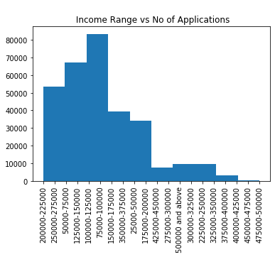


```python
#AMT_CREDIT
bins = [0,150000,200000,250000,300000,350000,400000,450000,500000,550000,600000,650000,700000,750000,800000,850000,900000,1000000000]
intervals = ['0-150000', '150000-200000','200000-250000', '250000-300000', '300000-350000', '350000-400000','400000-450000',
        '450000-500000','500000-550000','550000-600000','600000-650000','650000-700000','700000-750000','750000-800000',
        '800000-850000','850000-900000','900000 and above']

application_data['AMT_CREDIT_RANGE']=pd.cut(application_data['AMT_CREDIT'],bins=bins,labels=intervals)
application_data['AMT_CREDIT_RANGE'] = application_data['AMT_CREDIT_RANGE'].astype('category')
print('Credit Range\t Count')
credit_range = application_data['AMT_CREDIT_RANGE'].value_counts()
print(credit_range)
plt.hist(application_data['AMT_CREDIT_RANGE'])
plt.xticks(rotation=90)
```

    Credit Range	 Count
    900000 and above    58912
    250000-300000       31759
    200000-250000       23054
    500000-550000       22678
    400000-450000       18239
    0-150000            18159
    150000-200000       17985
    300000-350000       16205
    650000-700000       15051
    450000-500000       13799
    750000-800000       12380
    800000-850000       11559
    550000-600000       11554
    850000-900000       10233
    350000-400000       10133
    600000-650000        8998
    700000-750000        6813
    Name: AMT_CREDIT_RANGE, dtype: int64


    ([0, 1, 2, 3, 4, 5, 6, 7, 8, 9, 10, 11, 12, 13, 14, 15, 16],
     <a list of 17 Text xticklabel objects>)


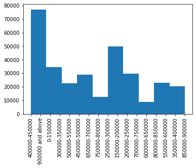


## Data Imbalance


```python
# Target Variable - 1: Client with Payment difficulties, 0 : All other cases 
cat_value_counts('TARGET')
```

    +----+----------+---------+-----------+--------------------+----------------------+
    |    |   TARGET |   Count |   Percent |   Cumulative Count |   Cumulative Percent |
    |----+----------+---------+-----------+--------------------+----------------------|
    |  0 |        0 |  282686 | 0.919271  |             282686 |             0.919271 |
    |  1 |        1 |   24825 | 0.0807288 |             307511 |             1        |
    +----+----------+---------+-----------+--------------------+----------------------+
            Missing   Total  Percent
    TARGET        0  307511     0.00 
    
    
    


From the above, you can see that this data set contains **91.9%** of records about Clients with Payment difficulties and **0.08%** records about all other cases.  
Ratio of classes = .919/0.08 = 11.375   
**This represents an huge Data Imbalance**  
The dataset is skewed towards 'Clients with Payment difficulties'

## Data Set division wrt ```TARGET```


```python
application_data0=application_data.loc[application_data["TARGET"]==0]
application_data1=application_data.loc[application_data["TARGET"]==1]
```

## Columns Selection for Analysis


```python
columnsForAnalysis = ['SK_ID_CURR', 'TARGET', 'NAME_CONTRACT_TYPE', 'CODE_GENDER',
       'FLAG_OWN_CAR', 'FLAG_OWN_REALTY', 'CNT_CHILDREN', 'AMT_INCOME_TOTAL',
       'AMT_CREDIT', 'AMT_ANNUITY', 'AMT_GOODS_PRICE',
       'NAME_INCOME_TYPE', 'NAME_EDUCATION_TYPE', 'NAME_FAMILY_STATUS',
       'NAME_HOUSING_TYPE',
       'DAYS_EMPLOYED','FLAG_MOBIL', 'FLAG_CONT_MOBILE',
       'FLAG_EMAIL', 'OCCUPATION_TYPE', 'CNT_FAM_MEMBERS',
       'REGION_RATING_CLIENT_W_CITY',
                      'REG_CITY_NOT_LIVE_CITY',
       'REG_CITY_NOT_WORK_CITY', 'LIVE_CITY_NOT_WORK_CITY',
       'ORGANIZATION_TYPE', 'EXT_SOURCE_2', 'EXT_SOURCE_3',
        'DAYS_LAST_PHONE_CHANGE' ,'AGE_YEARS', 'AMT_INCOME_CAT',
       'AMT_CREDIT_RANGE']
```

## Analysis

### Univariate Analysis


```python
# LOAN DATA
```


```python
# function for categorical variable univariate analysis
def cat_univariate_analysis(column_name,figsize=(10,5)) : 
    # print unique values
    print('TARGET 0\n', application_data0[column_name].unique(),'\n')
    print('TARGET 1\n',application_data1[column_name].unique(),'\n')
    
    # column vs target count plot
    plt.figure(figsize=figsize)
    ax = sns.countplot(x=column_name,hue='TARGET',data=application_data)
    title = column_name + ' vs Number of Applications'
    ax.set(title= title)
    for p in ax.patches:
        height = p.get_height()
        ax.text(p.get_x()+p.get_width()/2,
                height + 10,
                format(height),
                ha="center")
    # Percentages 
    print('All Other Cases (TARGET : 0)')
    print(tabulate(pd.DataFrame(application_data0.stb.freq([column_name])), headers='keys', tablefmt='psql'),'\n')
    print('Clients with Payment Difficulties (TARGET : 1)')
    print(tabulate(pd.DataFrame(application_data1.stb.freq([column_name])), headers='keys', tablefmt='psql'),'\n')
```


```python
# NAME_CONTRACT_TYPE
cat_univariate_analysis('NAME_CONTRACT_TYPE')
```

    TARGET 0
     [Cash loans, Revolving loans]
    Categories (2, object): [Cash loans, Revolving loans] 
    
    TARGET 1
     [Cash loans, Revolving loans]
    Categories (2, object): [Cash loans, Revolving loans] 
    
    All Other Cases (TARGET : 0)
    +----+----------------------+---------+-----------+--------------------+----------------------+
    |    | NAME_CONTRACT_TYPE   |   Count |   Percent |   Cumulative Count |   Cumulative Percent |
    |----+----------------------+---------+-----------+--------------------+----------------------|
    |  0 | Cash loans           |  255011 | 0.9021    |             255011 |               0.9021 |
    |  1 | Revolving loans      |   27675 | 0.0979001 |             282686 |               1      |
    +----+----------------------+---------+-----------+--------------------+----------------------+ 
    
    Clients with Payment Difficulties (TARGET : 1)
    +----+----------------------+---------+-----------+--------------------+----------------------+
    |    | NAME_CONTRACT_TYPE   |   Count |   Percent |   Cumulative Count |   Cumulative Percent |
    |----+----------------------+---------+-----------+--------------------+----------------------|
    |  0 | Cash loans           |   23221 | 0.935388  |              23221 |             0.935388 |
    |  1 | Revolving loans      |    1604 | 0.0646123 |              24825 |             1        |
    +----+----------------------+---------+-----------+--------------------+----------------------+ 
    


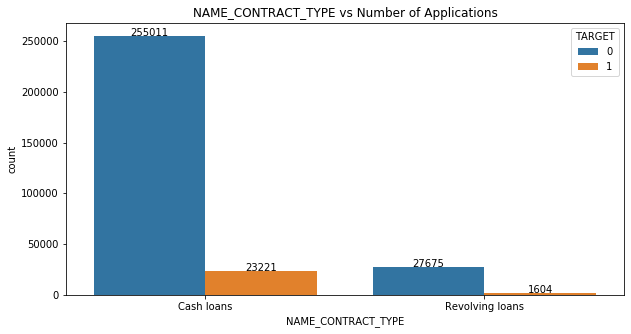


##### Client's with All other cases (Target=0)
* Out of 'All other cases', 90.21% have taken 'Cash Loans' and 9.79% have taken 'Revolving Loans'

##### Client's with Payment Difficulties (Target=1)
* Out of all 'Client's with payment difficulties', 93.54% have taken 'Cash Loans' and 6.46% have taken 'Revolving Loans'


```python
# function for numerical variable univariate analysis

def num_univariate_analysis(column_name,scale='linear') : 
    # boxplot for column vs target
    plt.figure(figsize=(8,6))
    ax = sns.boxplot(x='TARGET', y = column_name, data = application_data)
    title = column_name+' vs Target'
    ax.set(title=title)
    if scale == 'log' :
        plt.yscale('log')
        ax.set(ylabel=column_name + '(Log Scale)')
    # summary statistic
    print('All Other Cases (TARGET : 0)')
    print(application_data0[column_name].describe(),'\n')
    print('Clients with Payment Difficulties (TARGET : 1)')
    print(application_data1[column_name].describe())

```


```python
# AMT_CREDIT 
num_univariate_analysis('AMT_CREDIT')
```

    All Other Cases (TARGET : 0)
    count     282,686.00
    mean      602,648.28
    std       406,845.91
    min        45,000.00
    25%       270,000.00
    50%       517,788.00
    75%       810,000.00
    max     4,050,000.00
    Name: AMT_CREDIT, dtype: float64 
    
    Clients with Payment Difficulties (TARGET : 1)
    count      24,825.00
    mean      557,778.53
    std       346,433.24
    min        45,000.00
    25%       284,400.00
    50%       497,520.00
    75%       733,315.50
    max     4,027,680.00
    Name: AMT_CREDIT, dtype: float64


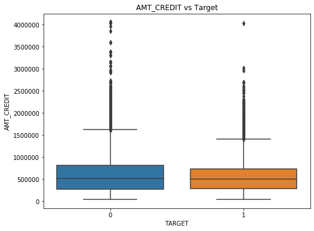


#### Amount of credit 
* The median amount of credit taken by Clients having payment difficulties' is almost same as 'All other cases'. 
* You could notice that the IQR of Target 1 is less than Target 0, which implies that more proportion of client's with payment difficulties take credit amounts centered around the median amount than 'All other cases'
* Comparing the outliers of Target 1 and 0, we could see that Clients with payment difficulties favour lower amount of credit than all other cases. Conversly, people with higher amount of credit have are more probably to fall in the category 'All other cases' than 'Clients with Payment Difficulties' 


```python
#AMT_ANNUITY
num_univariate_analysis('AMT_ANNUITY','log')
```

    All Other Cases (TARGET : 0)
    count   282,674.00
    mean     27,163.62
    std      14,658.31
    min       1,615.50
    25%      16,456.50
    50%      24,876.00
    75%      34,749.00
    max     258,025.50
    Name: AMT_ANNUITY, dtype: float64 
    
    Clients with Payment Difficulties (TARGET : 1)
    count    24,825.00
    mean     26,481.74
    std      12,450.68
    min       2,722.50
    25%      17,361.00
    50%      25,263.00
    75%      32,976.00
    max     149,211.00
    Name: AMT_ANNUITY, dtype: float64


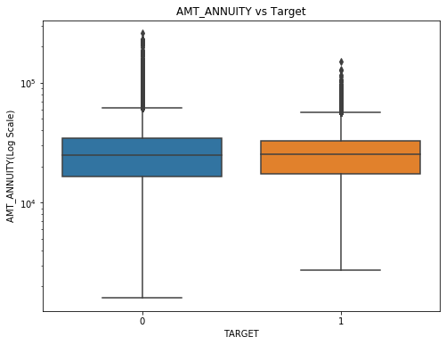


#### Amount of Annuity
* There is not much difference in Amount of Annuity between Clients with Payment Difficulties and All other cases. 
* The median and mean are around the same. 
* However, Clients with Payment difficulties have annuity amounts which are less dispersed than All other cases.  


```python
#AMT_GOODS_PRICE
num_univariate_analysis('AMT_GOODS_PRICE')
```

    All Other Cases (TARGET : 0)
    count     282,429.00
    mean      542,736.80
    std       373,785.49
    min        40,500.00
    25%       238,500.00
    50%       450,000.00
    75%       688,500.00
    max     4,050,000.00
    Name: AMT_GOODS_PRICE, dtype: float64 
    
    Clients with Payment Difficulties (TARGET : 1)
    count      24,804.00
    mean      488,972.41
    std       311,636.50
    min        45,000.00
    25%       238,500.00
    50%       450,000.00
    75%       675,000.00
    max     3,600,000.00
    Name: AMT_GOODS_PRICE, dtype: float64


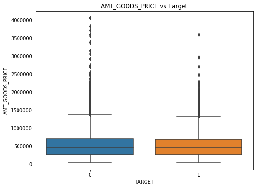


#### Goods Price Amount
* With respect to ```AMT_GOODS_PRICE```, there is no significant difference between Clients with Payment difficulties and All another Cases.


```python
#REGION_RATING_CLIENT_W_CITY
cat_univariate_analysis('REGION_RATING_CLIENT_W_CITY')
```

    TARGET 0
     [1, 2, 3]
    Categories (3, int64): [1, 2, 3] 
    
    TARGET 1
     [2, 3, 1]
    Categories (3, int64): [2, 3, 1] 
    
    All Other Cases (TARGET : 0)
    +----+-------------------------------+---------+-----------+--------------------+----------------------+
    |    |   REGION_RATING_CLIENT_W_CITY |   Count |   Percent |   Cumulative Count |   Cumulative Percent |
    |----+-------------------------------+---------+-----------+--------------------+----------------------|
    |  0 |                             2 |  211314 |  0.747522 |             211314 |             0.747522 |
    |  1 |                             3 |   38859 |  0.137463 |             250173 |             0.884985 |
    |  2 |                             1 |   32513 |  0.115015 |             282686 |             1        |
    +----+-------------------------------+---------+-----------+--------------------+----------------------+ 
    
    Clients with Payment Difficulties (TARGET : 1)
    +----+-------------------------------+---------+-----------+--------------------+----------------------+
    |    |   REGION_RATING_CLIENT_W_CITY |   Count |   Percent |   Cumulative Count |   Cumulative Percent |
    |----+-------------------------------+---------+-----------+--------------------+----------------------|
    |  0 |                             2 |   18170 | 0.731923  |              18170 |             0.731923 |
    |  1 |                             3 |    5001 | 0.20145   |              23171 |             0.933374 |
    |  2 |                             1 |    1654 | 0.0666264 |              24825 |             1        |
    +----+-------------------------------+---------+-----------+--------------------+----------------------+ 
    


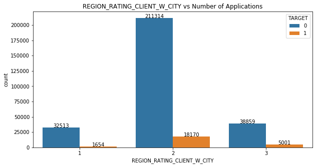


#### Bank City Rating 
The bank has rated cities into three categories [1,2,3]
* Among 'All other cases' , 74.7% belong to category 2 cities followed by 13.7% in category 3 cities and 11.5% in category 1 cities.
* 73.1% of Clients with Payment difficulties belong to cities of category 2 followed by 20.1% belonging to category 3 and 6.6% in category 1  

One can see that there are higher cases of Payment Difficulties in category 2 cities (20.1%) compared to All other cases (13.7%). Also , there are less cases of Payment difficulties in city category 1 (6.6%) compared to All other cases (11.5%)


```python
#EXT_SOURCE_2
num_univariate_analysis('EXT_SOURCE_2')
```

    All Other Cases (TARGET : 0)
    count   282,078.00
    mean          0.52
    std           0.19
    min           0.00
    25%           0.41
    50%           0.57
    75%           0.67
    max           0.85
    Name: EXT_SOURCE_2, dtype: float64 
    
    Clients with Payment Difficulties (TARGET : 1)
    count   24,773.00
    mean         0.41
    std          0.21
    min          0.00
    25%          0.24
    50%          0.44
    75%          0.59
    max          0.81
    Name: EXT_SOURCE_2, dtype: float64


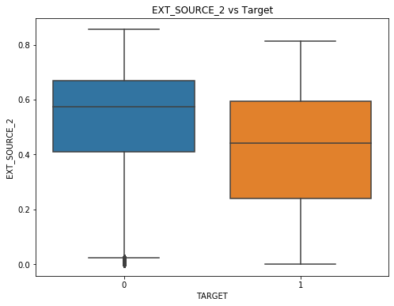


#### Client Credit Rating By External Source - 2 
* The median credit rating of clients with Payment difficulties (0.44) is less than those with all other cases (0.57)
* We can say that there is higher probability of client with less credit rating to have payment difficulties. 
* Further, there are some outliers in 'All other cases'. These could be clients with no credit history and hence their credit ratings are marked as zero.  


```python
#EXT_SOURCE_3
num_univariate_analysis('EXT_SOURCE_3')
```

    All Other Cases (TARGET : 0)
    count   227,398.00
    mean          0.52
    std           0.19
    min           0.00
    25%           0.39
    50%           0.55
    75%           0.67
    max           0.89
    Name: EXT_SOURCE_3, dtype: float64 
    
    Clients with Payment Difficulties (TARGET : 1)
    count   19,148.00
    mean         0.39
    std          0.21
    min          0.00
    25%          0.22
    50%          0.38
    75%          0.55
    max          0.90
    Name: EXT_SOURCE_3, dtype: float64


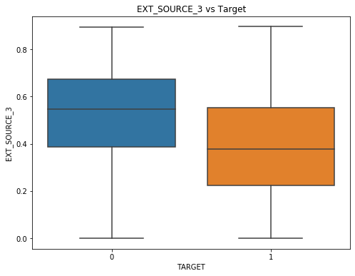


#### Client Credit Rating By External Source - 3
* The median credit rating of clients with Payment difficulties (0.38) is less than those with all other cases (0.55)
* We can say that there is higher probability of client with less credit rating to have payment difficulties. 
 


```python
#CODE_GENDER
cat_univariate_analysis('CODE_GENDER')
```

    TARGET 0
     [F, M, NaN]
    Categories (2, object): [F, M] 
    
    TARGET 1
     [M, F]
    Categories (2, object): [M, F] 
    
    All Other Cases (TARGET : 0)
    +----+---------------+---------+-----------+--------------------+----------------------+
    |    | CODE_GENDER   |   Count |   Percent |   Cumulative Count |   Cumulative Percent |
    |----+---------------+---------+-----------+--------------------+----------------------|
    |  0 | F             |  188278 |  0.666042 |             188278 |             0.666042 |
    |  1 | M             |   94404 |  0.333958 |             282682 |             1        |
    +----+---------------+---------+-----------+--------------------+----------------------+ 
    
    Clients with Payment Difficulties (TARGET : 1)
    +----+---------------+---------+-----------+--------------------+----------------------+
    |    | CODE_GENDER   |   Count |   Percent |   Cumulative Count |   Cumulative Percent |
    |----+---------------+---------+-----------+--------------------+----------------------|
    |  0 | F             |   14170 |  0.570796 |              14170 |             0.570796 |
    |  1 | M             |   10655 |  0.429204 |              24825 |             1        |
    +----+---------------+---------+-----------+--------------------+----------------------+ 
    


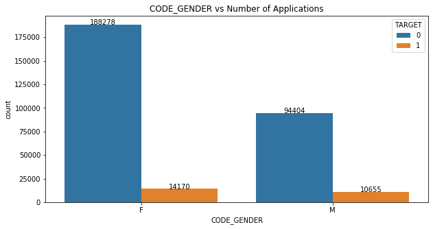


```python
print(application_data['CODE_GENDER'].value_counts(),'\n')
print('Proportion of Females (Target 0) :', round(100*188278/202448,2))
print('Proportion of Females (Target 1) :', round(100*14170/202448,2))
```

    F    202448
    M    105059
    Name: CODE_GENDER, dtype: int64 
    
    Proportion of Females (Target 0) : 93.0
    Proportion of Females (Target 1) : 7.0


```python
print('Proportion of Males (Target 0) :', round(100*94404/105059,2))
print('Proportion of Males (Target 1) :', round(100*10655/105059,2))
```

    Proportion of Males (Target 0) : 89.86
    Proportion of Males (Target 1) : 10.14


#### Gender 
* There are very high proportion of Female applicants (65.8%)
* Only 7% of total female applicants have payment difficulties compared to 10% of total male applications. 
* It is possible that female applicants are safer borrowers than male.


```python
def cat_proportions(column_name) : 
    values = application_data[column_name].unique()
    values = values.to_numpy()
    values.tolist()
    data0 = application_data0[column_name].value_counts().to_dict()
    data1 = application_data1[column_name].value_counts().to_dict()
    data = application_data[column_name].value_counts().to_dict()
    

    for i in values : 
        if i in data0 and i in data1 and i in data : 
            print('Proportion of '+ str(i) + ' in Target 0 : ', round(data0[i]*100/data[i],2))
            print('Proportion of '+ str(i) + ' in Target 1 : ', round(data1[i]*100/data[i],2),'\n' )
```


```python
# FLAG_OWN_CAR
cat_univariate_analysis('FLAG_OWN_CAR')
cat_proportions('FLAG_OWN_CAR')
```

    TARGET 0
     [N, Y]
    Categories (2, object): [N, Y] 
    
    TARGET 1
     [N, Y]
    Categories (2, object): [N, Y] 
    
    All Other Cases (TARGET : 0)
    +----+----------------+---------+-----------+--------------------+----------------------+
    |    | FLAG_OWN_CAR   |   Count |   Percent |   Cumulative Count |   Cumulative Percent |
    |----+----------------+---------+-----------+--------------------+----------------------|
    |  0 | N              |  185675 |  0.656824 |             185675 |             0.656824 |
    |  1 | Y              |   97011 |  0.343176 |             282686 |             1        |
    +----+----------------+---------+-----------+--------------------+----------------------+ 
    
    Clients with Payment Difficulties (TARGET : 1)
    +----+----------------+---------+-----------+--------------------+----------------------+
    |    | FLAG_OWN_CAR   |   Count |   Percent |   Cumulative Count |   Cumulative Percent |
    |----+----------------+---------+-----------+--------------------+----------------------|
    |  0 | N              |   17249 |  0.694824 |              17249 |             0.694824 |
    |  1 | Y              |    7576 |  0.305176 |              24825 |             1        |
    +----+----------------+---------+-----------+--------------------+----------------------+ 
    
    Proportion of N in Target 0 :  91.5
    Proportion of N in Target 1 :  8.5 
    
    Proportion of Y in Target 0 :  92.76
    Proportion of Y in Target 1 :  7.24 
    


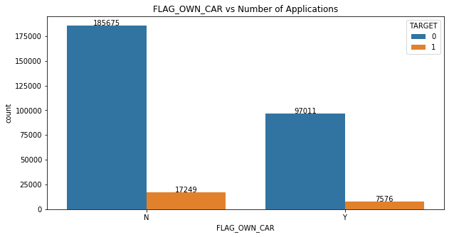


```python
application_data['FLAG_OWN_CAR'].value_counts(normalize=True)
```


    N   0.66
    Y   0.34
    Name: FLAG_OWN_CAR, dtype: float64


#### Owning A Car 
* 34% of total customers own a car 
* Among customers who own a car, 92.76% belong to 'All other cases' category and 7.24% have payment difficulties. 
--------
* Among customers with Payment difficulties, 30.5% own a car
* In 'All Other Cases', 34.3% own a car

* Customers having cars lower probability of having Payment Difficulties. 
    * Customers owning cars in 'Clients with Payment difficulties ' : 8.5%
    * Customers owning cars in 'Clients with Payment difficulties '  7.24 


```python
# FLAG_OWN_REALTY
cat_univariate_analysis('FLAG_OWN_REALTY')
cat_proportions('FLAG_OWN_REALTY')
```

    TARGET 0
     [N, Y]
    Categories (2, object): [N, Y] 
    
    TARGET 1
     [Y, N]
    Categories (2, object): [Y, N] 
    
    All Other Cases (TARGET : 0)
    +----+-------------------+---------+-----------+--------------------+----------------------+
    |    | FLAG_OWN_REALTY   |   Count |   Percent |   Cumulative Count |   Cumulative Percent |
    |----+-------------------+---------+-----------+--------------------+----------------------|
    |  0 | Y                 |  196329 |  0.694513 |             196329 |             0.694513 |
    |  1 | N                 |   86357 |  0.305487 |             282686 |             1        |
    +----+-------------------+---------+-----------+--------------------+----------------------+ 
    
    Clients with Payment Difficulties (TARGET : 1)
    +----+-------------------+---------+-----------+--------------------+----------------------+
    |    | FLAG_OWN_REALTY   |   Count |   Percent |   Cumulative Count |   Cumulative Percent |
    |----+-------------------+---------+-----------+--------------------+----------------------|
    |  0 | Y                 |   16983 |  0.684109 |              16983 |             0.684109 |
    |  1 | N                 |    7842 |  0.315891 |              24825 |             1        |
    +----+-------------------+---------+-----------+--------------------+----------------------+ 
    
    Proportion of Y in Target 0 :  92.04
    Proportion of Y in Target 1 :  7.96 
    
    Proportion of N in Target 0 :  91.68
    Proportion of N in Target 1 :  8.32 
    


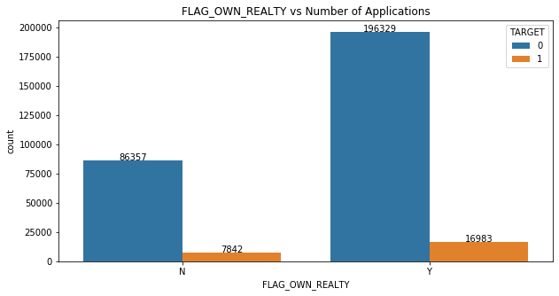


#### Owning Realty
* In Overall population of clients, 69.36% of people own real estate.
* In that group of people owning the real estate, 7.96% of people are having payment difficulties and the rest 92.04% belong to 'other cases'.
----
* In Overall population of clients, 30.63% of people do not own Realestate.
* In that group of people not owning the real estate, 8.32% of people are having payment difficulties and the rest 91.68% belong to 'other cases'.

**On closer comparision of above observations, we can infer that people who do not own Real-estate seem more likely to face payment difficulties than compared to the group of people owning the Real-estate.**


```python
#NAME_EDUCATION_TYPE

cat_univariate_analysis('NAME_EDUCATION_TYPE')
plt.xticks(rotation=90)
cat_proportions('NAME_EDUCATION_TYPE')
```

    TARGET 0
     [Higher education, Secondary / secondary special, Incomplete higher, Lower secondary, Academic degree]
    Categories (5, object): [Higher education, Secondary / secondary special, Incomplete higher, Lower secondary, Academic degree] 
    
    TARGET 1
     [Secondary / secondary special, Incomplete higher, Higher education, Lower secondary, Academic degree]
    Categories (5, object): [Secondary / secondary special, Incomplete higher, Higher education, Lower secondary, Academic degree] 
    
    All Other Cases (TARGET : 0)
    +----+-------------------------------+---------+-------------+--------------------+----------------------+
    |    | NAME_EDUCATION_TYPE           |   Count |     Percent |   Cumulative Count |   Cumulative Percent |
    |----+-------------------------------+---------+-------------+--------------------+----------------------|
    |  0 | Secondary / secondary special |  198867 | 0.703491    |             198867 |             0.703491 |
    |  1 | Higher education              |   70854 | 0.250646    |             269721 |             0.954136 |
    |  2 | Incomplete higher             |    9405 | 0.0332701   |             279126 |             0.987407 |
    |  3 | Lower secondary               |    3399 | 0.0120239   |             282525 |             0.99943  |
    |  4 | Academic degree               |     161 | 0.000569537 |             282686 |             1        |
    +----+-------------------------------+---------+-------------+--------------------+----------------------+ 
    
    Clients with Payment Difficulties (TARGET : 1)
    +----+-------------------------------+---------+-------------+--------------------+----------------------+
    |    | NAME_EDUCATION_TYPE           |   Count |     Percent |   Cumulative Count |   Cumulative Percent |
    |----+-------------------------------+---------+-------------+--------------------+----------------------|
    |  0 | Secondary / secondary special |   19524 | 0.786465    |              19524 |             0.786465 |
    |  1 | Higher education              |    4009 | 0.16149     |              23533 |             0.947956 |
    |  2 | Incomplete higher             |     872 | 0.0351259   |              24405 |             0.983082 |
    |  3 | Lower secondary               |     417 | 0.0167976   |              24822 |             0.999879 |
    |  4 | Academic degree               |       3 | 0.000120846 |              24825 |             1        |
    +----+-------------------------------+---------+-------------+--------------------+----------------------+ 
    
    Proportion of Secondary / secondary special in Target 0 :  91.06
    Proportion of Secondary / secondary special in Target 1 :  8.94 
    
    Proportion of Higher education in Target 0 :  94.64
    Proportion of Higher education in Target 1 :  5.36 
    
    Proportion of Incomplete higher in Target 0 :  91.52
    Proportion of Incomplete higher in Target 1 :  8.48 
    
    Proportion of Lower secondary in Target 0 :  89.07
    Proportion of Lower secondary in Target 1 :  10.93 
    
    Proportion of Academic degree in Target 0 :  98.17
    Proportion of Academic degree in Target 1 :  1.83 
    


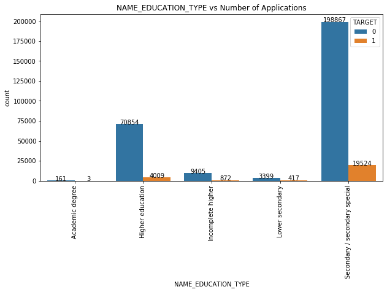


#### Highest Education

* 1.24% of the applicants are having education type of 'Lower secondary'
* Out of that 1.24%, 10.93% of them are likely to face Payment difficulties.
-------
* 71% of the applicants are having education type of 'Secodary/seconday special' .
* Out of that 71%, 8.93% of them are likely to face Payment difficulties.
------
* 3.34% of the applicants are having education type of 'Incomplete higher'.
* Out of that 3.34%, 8.48% of them are likely to face Payment difficulties.
------
* 24.34% of the applicants are having education type of 'Higher education'.
* Out of that 24.34%, 5.36% of them are likely to face Payment difficulties.
------
* 0.05% of the applicants are having education type of 'Academic degree'.
* Out of that 0.05%, 1.83% of them are likely to face Payment difficulties.

**We can clearly infer from the above observations that higher the education, lesser is the risk of payment difficulties.**


```python
#NAME_FAMILY_STATUS

cat_univariate_analysis('NAME_FAMILY_STATUS')
plt.xticks(rotation=90)
cat_proportions('NAME_FAMILY_STATUS')
```

    TARGET 0
     [Married, Single / not married, Civil marriage, Widow, Separated, NaN]
    Categories (5, object): [Married, Single / not married, Civil marriage, Widow, Separated] 
    
    TARGET 1
     [Single / not married, Widow, Married, Civil marriage, Separated]
    Categories (5, object): [Single / not married, Widow, Married, Civil marriage, Separated] 
    
    All Other Cases (TARGET : 0)
    +----+----------------------+---------+-----------+--------------------+----------------------+
    |    | NAME_FAMILY_STATUS   |   Count |   Percent |   Cumulative Count |   Cumulative Percent |
    |----+----------------------+---------+-----------+--------------------+----------------------|
    |  0 | Married              |  181582 | 0.64235   |             181582 |             0.64235  |
    |  1 | Single / not married |   40987 | 0.144992  |             222569 |             0.787342 |
    |  2 | Civil marriage       |   26814 | 0.094855  |             249383 |             0.882197 |
    |  3 | Separated            |   18150 | 0.064206  |             267533 |             0.946403 |
    |  4 | Widow                |   15151 | 0.0535969 |             282684 |             1        |
    +----+----------------------+---------+-----------+--------------------+----------------------+ 
    
    Clients with Payment Difficulties (TARGET : 1)
    +----+----------------------+---------+-----------+--------------------+----------------------+
    |    | NAME_FAMILY_STATUS   |   Count |   Percent |   Cumulative Count |   Cumulative Percent |
    |----+----------------------+---------+-----------+--------------------+----------------------|
    |  0 | Married              |   14850 | 0.598187  |              14850 |             0.598187 |
    |  1 | Single / not married |    4457 | 0.179537  |              19307 |             0.777724 |
    |  2 | Civil marriage       |    2961 | 0.119275  |              22268 |             0.896999 |
    |  3 | Separated            |    1620 | 0.0652568 |              23888 |             0.962256 |
    |  4 | Widow                |     937 | 0.0377442 |              24825 |             1        |
    +----+----------------------+---------+-----------+--------------------+----------------------+ 
    
    Proportion of Single / not married in Target 0 :  90.19
    Proportion of Single / not married in Target 1 :  9.81 
    
    Proportion of Married in Target 0 :  92.44
    Proportion of Married in Target 1 :  7.56 
    
    Proportion of Civil marriage in Target 0 :  90.06
    Proportion of Civil marriage in Target 1 :  9.94 
    
    Proportion of Widow in Target 0 :  94.18
    Proportion of Widow in Target 1 :  5.82 
    
    Proportion of Separated in Target 0 :  91.81
    Proportion of Separated in Target 1 :  8.19 
    


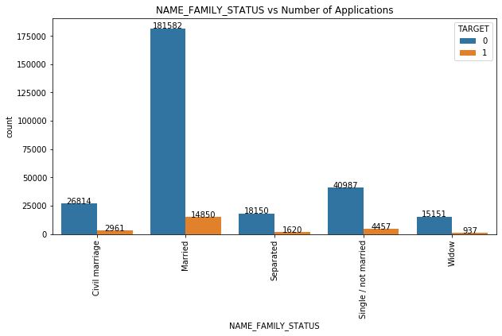


#### Marital Status
* 5.2% of applicants have their family status as'Widow'
* Out of that 5.2%, 5.82% of them are likely to face Payment difficulties.
--------
* 63.87% of applicants have their family status as'Married'
* Out of that 63.87%, 7.56% of them are likely to face Payment difficulties.
-----
* 6.42% of applicants have their family status as'Seperated'
* Out of that 6.42%, 8.19% of them are likely to face Payment difficulties.
----
* 14.77% of applicants have their family status as'Single / not married'
* Out of that 14.77%, 9.81% of them are likely to face Payment difficulties.
----
* 9.68% of applicants have their family status as'Civil marriage'
* Out of that 9.68%, 9.94% of them are likely to face Payment difficulties.

**Based on the above obervations, we can infer that the applicants with NAME_FAMILY_STATUS as seperated or single or  have higher risk of payment difficulties compared to that of Widow and Married.**

**For the purpose of this analysis, civil marriage and married are treated equal. They might be merged into the one category**


```python
#NAME_HOUSING_TYPE
cat_univariate_analysis('NAME_HOUSING_TYPE',figsize=(10,5))
plt.xticks(rotation=90)
cat_proportions('NAME_HOUSING_TYPE')
```

    TARGET 0
     [House / apartment, Rented apartment, With parents, Municipal apartment, Office apartment, Co-op apartment]
    Categories (6, object): [House / apartment, Rented apartment, With parents, Municipal apartment, Office apartment, Co-op apartment] 
    
    TARGET 1
     [House / apartment, With parents, Municipal apartment, Rented apartment, Office apartment, Co-op apartment]
    Categories (6, object): [House / apartment, With parents, Municipal apartment, Rented apartment, Office apartment, Co-op apartment] 
    
    All Other Cases (TARGET : 0)
    +----+---------------------+---------+------------+--------------------+----------------------+
    |    | NAME_HOUSING_TYPE   |   Count |    Percent |   Cumulative Count |   Cumulative Percent |
    |----+---------------------+---------+------------+--------------------+----------------------|
    |  0 | House / apartment   |  251596 | 0.890019   |             251596 |             0.890019 |
    |  1 | With parents        |   13104 | 0.0463553  |             264700 |             0.936375 |
    |  2 | Municipal apartment |   10228 | 0.0361815  |             274928 |             0.972556 |
    |  3 | Rented apartment    |    4280 | 0.0151405  |             279208 |             0.987697 |
    |  4 | Office apartment    |    2445 | 0.00864917 |             281653 |             0.996346 |
    |  5 | Co-op apartment     |    1033 | 0.00365423 |             282686 |             1        |
    +----+---------------------+---------+------------+--------------------+----------------------+ 
    
    Clients with Payment Difficulties (TARGET : 1)
    +----+---------------------+---------+-----------+--------------------+----------------------+
    |    | NAME_HOUSING_TYPE   |   Count |   Percent |   Cumulative Count |   Cumulative Percent |
    |----+---------------------+---------+-----------+--------------------+----------------------|
    |  0 | House / apartment   |   21272 | 0.856878  |              21272 |             0.856878 |
    |  1 | With parents        |    1736 | 0.0699295 |              23008 |             0.926808 |
    |  2 | Municipal apartment |     955 | 0.0384693 |              23963 |             0.965277 |
    |  3 | Rented apartment    |     601 | 0.0242095 |              24564 |             0.989486 |
    |  4 | Office apartment    |     172 | 0.0069285 |              24736 |             0.996415 |
    |  5 | Co-op apartment     |      89 | 0.0035851 |              24825 |             1        |
    +----+---------------------+---------+-----------+--------------------+----------------------+ 
    
    Proportion of House / apartment in Target 0 :  92.2
    Proportion of House / apartment in Target 1 :  7.8 
    
    Proportion of Rented apartment in Target 0 :  87.69
    Proportion of Rented apartment in Target 1 :  12.31 
    
    Proportion of With parents in Target 0 :  88.3
    Proportion of With parents in Target 1 :  11.7 
    
    Proportion of Municipal apartment in Target 0 :  91.46
    Proportion of Municipal apartment in Target 1 :  8.54 
    
    Proportion of Office apartment in Target 0 :  93.43
    Proportion of Office apartment in Target 1 :  6.57 
    
    Proportion of Co-op apartment in Target 0 :  92.07
    Proportion of Co-op apartment in Target 1 :  7.93 
    


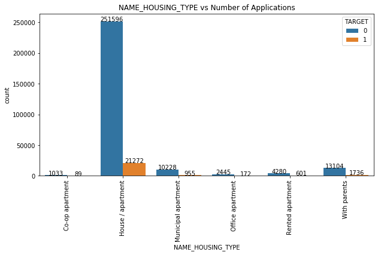


#### Housing Type

* 0.85% of applicants have their housing type as'Office apartment'
* Out of that 0.85%, 6.57% of them are likely to face Payment difficulties.
---------------
* 88.73% of applicants have their housing type as'House/ apartment'
* Out of that 88.73%, 7.8% of them are likely to face Payment difficulties.
----------
* 0.36% of applicants have their housing type as'Co-op apartment'
* Out of that 0.36%, 7.93% of them are likely to face Payment difficulties.
-----
* 3.63% of applicants have their housing type as'Municipal apartment'
* Out of that 3.63%, 8.54% of them are likely to face Payment difficulties.
-----------------
* 4.82% of applicants have their housing type as'with parents'
* Out of that 4.82%, 11.7% of them are likely to face Payment difficulties.
----
* 1.58% of applicants have their housing type as'Rented apartment'
* Out of that 1.58%, 12.31% of them are likely to face Payment difficulties.

**Based on the above obervations, we can infer that the applicants with NAME_HOUSING_TYPE as 'Municipal apartment' or 'with parents' or 'Rented apartment ' have higher risk of payment difficulties compared to that of other housing types.**


```python
#AMT_INCOME_CAT
cat_univariate_analysis('AMT_INCOME_CAT',figsize=(20,5))
plt.xticks(rotation=90)
cat_proportions('AMT_INCOME_CAT')
```

    posx and posy should be finite values


    TARGET 0
     [250000-275000, 50000-75000, 125000-150000, 100000-125000, 75000-100000, ..., 325000-350000, 375000-400000, 400000-425000, 450000-475000, 475000-500000]
    Length: 20
    Categories (20, object): [25000-50000 < 50000-75000 < 75000-100000 < 100000-125000 ... 425000-450000 < 450000-475000 < 475000-500000 < 500000 and above] 
    
    TARGET 1
     [200000-225000, 100000-125000, 125000-150000, 75000-100000, 300000-325000, ..., 225000-250000, 375000-400000, 325000-350000, 450000-475000, 475000-500000]
    Length: 20
    Categories (20, object): [25000-50000 < 50000-75000 < 75000-100000 < 100000-125000 ... 425000-450000 < 450000-475000 < 475000-500000 < 500000 and above] 
    
    All Other Cases (TARGET : 0)
    +----+------------------+---------+-------------+--------------------+----------------------+
    |    | AMT_INCOME_CAT   |   Count |     Percent |   Cumulative Count |   Cumulative Percent |
    |----+------------------+---------+-------------+--------------------+----------------------|
    |  0 | 125000-150000    |   43837 | 0.155073    |              43837 |             0.155073 |
    |  1 | 100000-125000    |   39860 | 0.141005    |              83697 |             0.296078 |
    |  2 | 200000-225000    |   37595 | 0.132992    |             121292 |             0.42907  |
    |  3 | 75000-100000     |   36450 | 0.128942    |             157742 |             0.558011 |
    |  4 | 150000-175000    |   31685 | 0.112085    |             189427 |             0.670097 |
    |  5 | 175000-200000    |   27190 | 0.0961845   |             216617 |             0.766281 |
    |  6 | 50000-75000      |   17849 | 0.0631407   |             234466 |             0.829422 |
    |  7 | 250000-275000    |   11846 | 0.0419052   |             246312 |             0.871327 |
    |  8 | 225000-250000    |    6814 | 0.0241045   |             253126 |             0.895432 |
    |  9 | 300000-325000    |    6342 | 0.0224348   |             259468 |             0.917866 |
    | 10 | 350000-375000    |    4282 | 0.0151475   |             263750 |             0.933014 |
    | 11 | 25000-50000      |    4174 | 0.0147655   |             267924 |             0.94778  |
    | 12 | 275000-300000    |    4000 | 0.01415     |             271924 |             0.961929 |
    | 13 | 425000-450000    |    2933 | 0.0103755   |             274857 |             0.972305 |
    | 14 | 500000 and above |    2556 | 0.00904183  |             277413 |             0.981347 |
    | 15 | 325000-350000    |    1987 | 0.007029    |             279400 |             0.988376 |
    | 16 | 400000-425000    |    1696 | 0.00599959  |             281096 |             0.994375 |
    | 17 | 375000-400000    |    1180 | 0.00417424  |             282276 |             0.99855  |
    | 18 | 475000-500000    |     296 | 0.0010471   |             282572 |             0.999597 |
    | 19 | 450000-475000    |     114 | 0.000403274 |             282686 |             1        |
    +----+------------------+---------+-------------+--------------------+----------------------+ 
    
    Clients with Payment Difficulties (TARGET : 1)
    +----+------------------+---------+-------------+--------------------+----------------------+
    |    | AMT_INCOME_CAT   |   Count |     Percent |   Cumulative Count |   Cumulative Percent |
    |----+------------------+---------+-------------+--------------------+----------------------|
    |  0 | 125000-150000    |    4053 | 0.163263    |               4053 |             0.163263 |
    |  1 | 100000-125000    |    3841 | 0.154723    |               7894 |             0.317986 |
    |  2 | 75000-100000     |    3356 | 0.135186    |              11250 |             0.453172 |
    |  3 | 200000-225000    |    3202 | 0.128983    |              14452 |             0.582155 |
    |  4 | 150000-175000    |    2978 | 0.11996     |              17430 |             0.702115 |
    |  5 | 175000-200000    |    2454 | 0.098852    |              19884 |             0.800967 |
    |  6 | 50000-75000      |    1526 | 0.0614703   |              21410 |             0.862437 |
    |  7 | 250000-275000    |     887 | 0.0357301   |              22297 |             0.898167 |
    |  8 | 225000-250000    |     526 | 0.0211883   |              22823 |             0.919355 |
    |  9 | 300000-325000    |     410 | 0.0165156   |              23233 |             0.935871 |
    | 10 | 25000-50000      |     343 | 0.0138167   |              23576 |             0.949688 |
    | 11 | 275000-300000    |     306 | 0.0123263   |              23882 |             0.962014 |
    | 12 | 350000-375000    |     255 | 0.0102719   |              24137 |             0.972286 |
    | 13 | 425000-450000    |     180 | 0.00725076  |              24317 |             0.979537 |
    | 14 | 500000 and above |     146 | 0.00588117  |              24463 |             0.985418 |
    | 15 | 325000-350000    |     135 | 0.00543807  |              24598 |             0.990856 |
    | 16 | 400000-425000    |     115 | 0.00463243  |              24713 |             0.995488 |
    | 17 | 375000-400000    |      85 | 0.00342397  |              24798 |             0.998912 |
    | 18 | 475000-500000    |      16 | 0.000644512 |              24814 |             0.999557 |
    | 19 | 450000-475000    |      11 | 0.000443102 |              24825 |             1        |
    +----+------------------+---------+-------------+--------------------+----------------------+ 
    
    Proportion of 200000-225000 in Target 0 :  92.15
    Proportion of 200000-225000 in Target 1 :  7.85 
    
    Proportion of 250000-275000 in Target 0 :  93.03
    Proportion of 250000-275000 in Target 1 :  6.97 
    
    Proportion of 50000-75000 in Target 0 :  92.12
    Proportion of 50000-75000 in Target 1 :  7.88 
    
    Proportion of 125000-150000 in Target 0 :  91.54
    Proportion of 125000-150000 in Target 1 :  8.46 
    
    Proportion of 100000-125000 in Target 0 :  91.21
    Proportion of 100000-125000 in Target 1 :  8.79 
    
    Proportion of 75000-100000 in Target 0 :  91.57
    Proportion of 75000-100000 in Target 1 :  8.43 
    
    Proportion of 150000-175000 in Target 0 :  91.41
    Proportion of 150000-175000 in Target 1 :  8.59 
    
    Proportion of 350000-375000 in Target 0 :  94.38
    Proportion of 350000-375000 in Target 1 :  5.62 
    
    Proportion of 25000-50000 in Target 0 :  92.41
    Proportion of 25000-50000 in Target 1 :  7.59 
    
    Proportion of 175000-200000 in Target 0 :  91.72
    Proportion of 175000-200000 in Target 1 :  8.28 
    
    Proportion of 425000-450000 in Target 0 :  94.22
    Proportion of 425000-450000 in Target 1 :  5.78 
    
    Proportion of 275000-300000 in Target 0 :  92.89
    Proportion of 275000-300000 in Target 1 :  7.11 
    
    Proportion of 500000 and above in Target 0 :  94.6
    Proportion of 500000 and above in Target 1 :  5.4 
    
    Proportion of 300000-325000 in Target 0 :  93.93
    Proportion of 300000-325000 in Target 1 :  6.07 
    
    Proportion of 225000-250000 in Target 0 :  92.83
    Proportion of 225000-250000 in Target 1 :  7.17 
    
    Proportion of 325000-350000 in Target 0 :  93.64
    Proportion of 325000-350000 in Target 1 :  6.36 
    
    Proportion of 375000-400000 in Target 0 :  93.28
    Proportion of 375000-400000 in Target 1 :  6.72 
    
    Proportion of 400000-425000 in Target 0 :  93.65
    Proportion of 400000-425000 in Target 1 :  6.35 
    
    Proportion of 450000-475000 in Target 0 :  91.2
    Proportion of 450000-475000 in Target 1 :  8.8 
    
    Proportion of 475000-500000 in Target 0 :  94.87
    Proportion of 475000-500000 in Target 1 :  5.13 
    


    posx and posy should be finite values
    posx and posy should be finite values
    posx and posy should be finite values


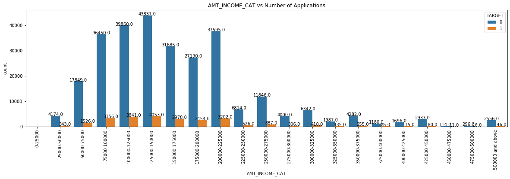


```python
# We will calculate the pecentage of "Clients with Payment difficulties" for every income category.
t0=application_data0['AMT_INCOME_CAT'].value_counts()
t1=application_data1['AMT_INCOME_CAT'].value_counts()
prop = 100*t1/(t1+t0)
print(tabulate(pd.DataFrame(prop), headers=['AMT_INCOME_CAT','PERCENTAGE'], tablefmt='psql'))
```

    +------------------+--------------+
    | AMT_INCOME_CAT   |   PERCENTAGE |
    |------------------+--------------|
    | 0-25000          |    nan       |
    | 25000-50000      |      7.59354 |
    | 50000-75000      |      7.87613 |
    | 75000-100000     |      8.43089 |
    | 100000-125000    |      8.78927 |
    | 125000-150000    |      8.46314 |
    | 150000-175000    |      8.59129 |
    | 175000-200000    |      8.27824 |
    | 200000-225000    |      7.84862 |
    | 225000-250000    |      7.16621 |
    | 250000-275000    |      6.96615 |
    | 275000-300000    |      7.10636 |
    | 300000-325000    |      6.07227 |
    | 325000-350000    |      6.36192 |
    | 350000-375000    |      5.62045 |
    | 375000-400000    |      6.71937 |
    | 400000-425000    |      6.35008 |
    | 425000-450000    |      5.7822  |
    | 450000-475000    |      8.8     |
    | 475000-500000    |      5.12821 |
    | 500000 and above |      5.4034  |
    +------------------+--------------+


#### Income Category
* By the above table of 'AMT_INCOME_CAT' vs 'percentage of customers with payment difficulties' in that range, we can infer that as the income increases, applicant is less likely to face payment difficulties(except in exceptional cases, such as 450000 - 475000).


```python
#CNT_CHILDREN
#Lets convert this into a categorical variable
application_data['CNT_CHILDREN']=application_data['CNT_CHILDREN'].astype('category')
application_data0['CNT_CHILDREN']=application_data0['CNT_CHILDREN'].astype('category')
application_data1['CNT_CHILDREN']=application_data1['CNT_CHILDREN'].astype('category')
```


```python
#CNT_CHILDREN
cat_univariate_analysis('CNT_CHILDREN',figsize=(20,5))
column_name='CNT_CHILDREN'
cat_proportions('CNT_CHILDREN')
# values = application_data[column_name].unique()
# values=values.dropna()
# values = values.to_numpy()
# values.tolist()
# data0 = application_data0[column_name].value_counts().to_dict()
# data1 = application_data1[column_name].value_counts().to_dict()
# data = application_data[column_name].value_counts().to_dict()

# for i in values[:7]: 
#     print('Proportion of '+ str(i) + ' in Target 0 : ', round(data0[i]*100/data[i],2))
#     print('Proportion of '+ str(i) + ' in Target 1 : ', round(data1[i]*100/data[i],2),'\n' )
```

    TARGET 0
     [0, 1, 2, 3, 4, ..., 8, 12, 10, 19, 14]
    Length: 13
    Categories (13, int64): [0, 1, 2, 3, ..., 12, 10, 19, 14] 
    
    TARGET 1
     [0, 1, 3, 2, 4, 5, 9, 11, 6]
    Categories (9, int64): [0, 1, 3, 2, ..., 5, 9, 11, 6] 
    
    All Other Cases (TARGET : 0)
    +----+----------------+---------+-------------+--------------------+----------------------+
    |    |   CNT_CHILDREN |   Count |     Percent |   Cumulative Count |   Cumulative Percent |
    |----+----------------+---------+-------------+--------------------+----------------------|
    |  0 |              0 |  198762 | 0.703119    |             198762 |             0.703119 |
    |  1 |              1 |   55665 | 0.196915    |             254427 |             0.900034 |
    |  2 |              2 |   24416 | 0.0863715   |             278843 |             0.986405 |
    |  3 |              3 |    3359 | 0.0118824   |             282202 |             0.998288 |
    |  4 |              4 |     374 | 0.00132302  |             282576 |             0.999611 |
    |  5 |              5 |      77 | 0.000272387 |             282653 |             0.999883 |
    |  6 |              6 |      15 | 5.30624e-05 |             282668 |             0.999936 |
    |  7 |              7 |       7 | 2.47625e-05 |             282675 |             0.999961 |
    |  8 |             14 |       3 | 1.06125e-05 |             282678 |             0.999972 |
    |  9 |             19 |       2 | 7.07499e-06 |             282680 |             0.999979 |
    | 10 |             12 |       2 | 7.07499e-06 |             282682 |             0.999986 |
    | 11 |             10 |       2 | 7.07499e-06 |             282684 |             0.999993 |
    | 12 |              8 |       2 | 7.07499e-06 |             282686 |             1        |
    +----+----------------+---------+-------------+--------------------+----------------------+ 
    
    Clients with Payment Difficulties (TARGET : 1)
    +----+----------------+---------+-------------+--------------------+----------------------+
    |    |   CNT_CHILDREN |   Count |     Percent |   Cumulative Count |   Cumulative Percent |
    |----+----------------+---------+-------------+--------------------+----------------------|
    |  0 |              0 |   16609 | 0.669043    |              16609 |             0.669043 |
    |  1 |              1 |    5454 | 0.219698    |              22063 |             0.888741 |
    |  2 |              2 |    2333 | 0.0939778   |              24396 |             0.982719 |
    |  3 |              3 |     358 | 0.0144209   |              24754 |             0.99714  |
    |  4 |              4 |      55 | 0.00221551  |              24809 |             0.999355 |
    |  5 |              5 |       7 | 0.000281974 |              24816 |             0.999637 |
    |  6 |              6 |       6 | 0.000241692 |              24822 |             0.999879 |
    |  7 |              9 |       2 | 8.05639e-05 |              24824 |             0.99996  |
    |  8 |             11 |       1 | 4.0282e-05  |              24825 |             1        |
    +----+----------------+---------+-------------+--------------------+----------------------+ 
    
    Proportion of 0 in Target 0 :  92.29
    Proportion of 0 in Target 1 :  7.71 
    
    Proportion of 1 in Target 0 :  91.08
    Proportion of 1 in Target 1 :  8.92 
    
    Proportion of 2 in Target 0 :  91.28
    Proportion of 2 in Target 1 :  8.72 
    
    Proportion of 3 in Target 0 :  90.37
    Proportion of 3 in Target 1 :  9.63 
    
    Proportion of 4 in Target 0 :  87.18
    Proportion of 4 in Target 1 :  12.82 
    
    Proportion of 5 in Target 0 :  91.67
    Proportion of 5 in Target 1 :  8.33 
    
    Proportion of 6 in Target 0 :  71.43
    Proportion of 6 in Target 1 :  28.57 
    


    posx and posy should be finite values
    posx and posy should be finite values
    posx and posy should be finite values
    posx and posy should be finite values
    posx and posy should be finite values
    posx and posy should be finite values
    posx and posy should be finite values
    posx and posy should be finite values
    posx and posy should be finite values
    posx and posy should be finite values
    posx and posy should be finite values
    posx and posy should be finite values
    posx and posy should be finite values
    posx and posy should be finite values
    posx and posy should be finite values
    posx and posy should be finite values


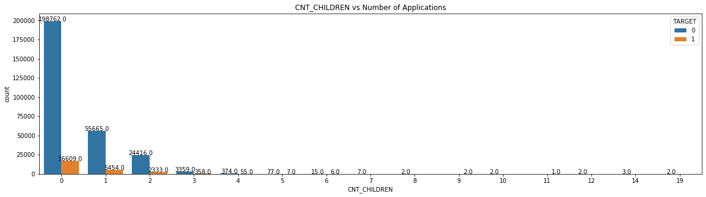


```python
# Calculating the pecentage of "Clients with Payment difficulties" for every income category.
t0=application_data0['CNT_CHILDREN'].value_counts()
t1=application_data1['CNT_CHILDREN'].value_counts()
prop = 100*t1/(t1+t0)

print(tabulate(pd.DataFrame(prop), headers=['No of Children','Percentage'], tablefmt='psql'))
```

    +------------------+--------------+
    |   No of Children |   Percentage |
    |------------------+--------------|
    |                0 |      7.71181 |
    |                1 |      8.92358 |
    |                2 |      8.72182 |
    |                3 |      9.63142 |
    |                4 |     12.8205  |
    |                5 |      8.33333 |
    |                6 |     28.5714  |
    |                7 |    nan       |
    |                8 |    nan       |
    |                9 |    nan       |
    |               10 |    nan       |
    |               11 |    nan       |
    |               12 |    nan       |
    |               14 |    nan       |
    |               19 |    nan       |
    +------------------+--------------+


#### Number of Children
* By looking at the plot and above table, we can clearly infer that starting from 0 to 6, applicants having 0 children have lowest risk of facing payment dificulties. With the increase in number of children, the risk of payment difficulties also increase.  
* Above 6, there might be some data quality issues. We can even expect that this is error while taking the data from thr applicants, because the numericals above 6 are not practical in most of the cases. 
* If the CNT_CHILDREN > 6 is true, then there is 0 probabilty that the applicant might face the payment difficulties.


```python
#CNT_FAM_MEMBERS
cat_univariate_analysis('CNT_FAM_MEMBERS',figsize=(20,5))
cat_proportions('CNT_FAM_MEMBERS')
```

    posx and posy should be finite values
    posx and posy should be finite values


    TARGET 0
     [2.00, 1.00, 3.00, 4.00, 5.00, ..., 14.00, 12.00, 20.00, 15.00, 16.00]
    Length: 16
    Categories (15, float64): [2.00, 1.00, 3.00, 4.00, ..., 12.00, 20.00, 15.00, 16.00] 
    
    TARGET 1
     [1.00, 2.00, 5.00, 3.00, 4.00, ..., 7.00, 10.00, 13.00, 8.00, 11.00]
    Length: 11
    Categories (11, float64): [1.00, 2.00, 5.00, 3.00, ..., 10.00, 13.00, 8.00, 11.00] 
    
    All Other Cases (TARGET : 0)
    +----+-------------------+---------+-------------+--------------------+----------------------+
    |    |   CNT_FAM_MEMBERS |   Count |     Percent |   Cumulative Count |   Cumulative Percent |
    |----+-------------------+---------+-------------+--------------------+----------------------|
    |  0 |                 2 |  146348 | 0.517709    |             146348 |             0.517709 |
    |  1 |                 1 |   62172 | 0.219935    |             208520 |             0.737643 |
    |  2 |                 3 |   47993 | 0.169776    |             256513 |             0.90742  |
    |  3 |                 4 |   22561 | 0.07981     |             279074 |             0.98723  |
    |  4 |                 5 |    3151 | 0.0111467   |             282225 |             0.998376 |
    |  5 |                 6 |     353 | 0.00124874  |             282578 |             0.999625 |
    |  6 |                 7 |      75 | 0.000265314 |             282653 |             0.99989  |
    |  7 |                 8 |      14 | 4.95253e-05 |             282667 |             0.99994  |
    |  8 |                 9 |       6 | 2.12251e-05 |             282673 |             0.999961 |
    |  9 |                20 |       2 | 7.07504e-06 |             282675 |             0.999968 |
    | 10 |                16 |       2 | 7.07504e-06 |             282677 |             0.999975 |
    | 11 |                14 |       2 | 7.07504e-06 |             282679 |             0.999982 |
    | 12 |                12 |       2 | 7.07504e-06 |             282681 |             0.999989 |
    | 13 |                10 |       2 | 7.07504e-06 |             282683 |             0.999996 |
    | 14 |                15 |       1 | 3.53752e-06 |             282684 |             1        |
    +----+-------------------+---------+-------------+--------------------+----------------------+ 
    
    Clients with Payment Difficulties (TARGET : 1)
    +----+-------------------+---------+-------------+--------------------+----------------------+
    |    |   CNT_FAM_MEMBERS |   Count |     Percent |   Cumulative Count |   Cumulative Percent |
    |----+-------------------+---------+-------------+--------------------+----------------------|
    |  0 |                 2 |   12009 | 0.483746    |              12009 |             0.483746 |
    |  1 |                 1 |    5675 | 0.2286      |              17684 |             0.712346 |
    |  2 |                 3 |    4608 | 0.185619    |              22292 |             0.897966 |
    |  3 |                 4 |    2136 | 0.0860423   |              24428 |             0.984008 |
    |  4 |                 5 |     327 | 0.0131722   |              24755 |             0.99718  |
    |  5 |                 6 |      55 | 0.00221551  |              24810 |             0.999396 |
    |  6 |                 8 |       6 | 0.000241692 |              24816 |             0.999637 |
    |  7 |                 7 |       6 | 0.000241692 |              24822 |             0.999879 |
    |  8 |                13 |       1 | 4.0282e-05  |              24823 |             0.999919 |
    |  9 |                11 |       1 | 4.0282e-05  |              24824 |             0.99996  |
    | 10 |                10 |       1 | 4.0282e-05  |              24825 |             1        |
    +----+-------------------+---------+-------------+--------------------+----------------------+ 
    
    Proportion of 1.0 in Target 0 :  91.64
    Proportion of 1.0 in Target 1 :  8.36 
    
    Proportion of 2.0 in Target 0 :  92.42
    Proportion of 2.0 in Target 1 :  7.58 
    
    Proportion of 3.0 in Target 0 :  91.24
    Proportion of 3.0 in Target 1 :  8.76 
    
    Proportion of 4.0 in Target 0 :  91.35
    Proportion of 4.0 in Target 1 :  8.65 
    
    Proportion of 5.0 in Target 0 :  90.6
    Proportion of 5.0 in Target 1 :  9.4 
    
    Proportion of 6.0 in Target 0 :  86.52
    Proportion of 6.0 in Target 1 :  13.48 
    
    Proportion of 9.0 in Target 0 :  100.0
    Proportion of 9.0 in Target 1 :  0.0 
    
    Proportion of 7.0 in Target 0 :  92.59
    Proportion of 7.0 in Target 1 :  7.41 
    
    Proportion of 8.0 in Target 0 :  70.0
    Proportion of 8.0 in Target 1 :  30.0 
    
    Proportion of 10.0 in Target 0 :  66.67
    Proportion of 10.0 in Target 1 :  33.33 
    
    Proportion of 13.0 in Target 0 :  0.0
    Proportion of 13.0 in Target 1 :  100.0 
    
    Proportion of 14.0 in Target 0 :  100.0
    Proportion of 14.0 in Target 1 :  0.0 
    
    Proportion of 12.0 in Target 0 :  100.0
    Proportion of 12.0 in Target 1 :  0.0 
    
    Proportion of 20.0 in Target 0 :  100.0
    Proportion of 20.0 in Target 1 :  0.0 
    
    Proportion of 15.0 in Target 0 :  100.0
    Proportion of 15.0 in Target 1 :  0.0 
    
    Proportion of 16.0 in Target 0 :  100.0
    Proportion of 16.0 in Target 1 :  0.0 
    
    Proportion of 11.0 in Target 0 :  0.0
    Proportion of 11.0 in Target 1 :  100.0 
    


    posx and posy should be finite values
    posx and posy should be finite values
    posx and posy should be finite values
    posx and posy should be finite values
    posx and posy should be finite values
    posx and posy should be finite values
    posx and posy should be finite values
    posx and posy should be finite values
    posx and posy should be finite values
    posx and posy should be finite values
    posx and posy should be finite values
    posx and posy should be finite values
    posx and posy should be finite values
    posx and posy should be finite values


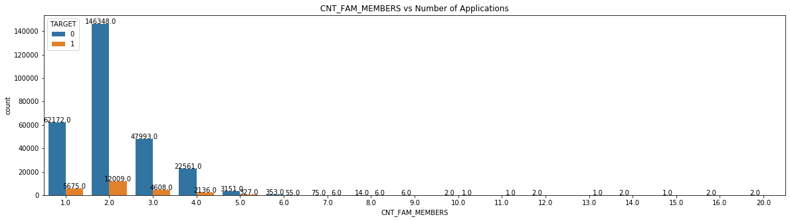


#### Number of Family members
* When we look at the plot and proportions above, we can clearly infer that increase in family members is directly proportional to increase in risk of facing payment difficulties. 
* Above 6, we cant infer because there were not enough applicant samples.


```python
#DAYS_EMPLOYED.
num_univariate_analysis('DAYS_EMPLOYED','log')
```

    All Other Cases (TARGET : 0)
    count   282,686.00
    mean     69,668.81
    std     140,983.36
    min           0.00
    25%         967.00
    50%       2,304.00
    75%       6,074.00
    max     365,243.00
    Name: DAYS_EMPLOYED, dtype: float64 
    
    Clients with Payment Difficulties (TARGET : 1)
    count    24,825.00
    mean     45,587.32
    std     118,303.30
    min           0.00
    25%         677.00
    50%       1,458.00
    75%       3,280.00
    max     365,243.00
    Name: DAYS_EMPLOYED, dtype: float64


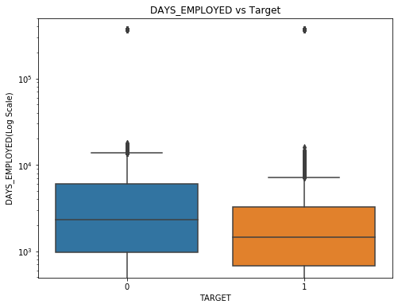


#### Number of Days Employed
* If we observe the above box plot, we can clearly notice the outliers, so lets concentrate on median.
* The applicants with payment difficulties have lesser median and IQR compared to "all other cases". So, greater the DAYS_EMPLOYED, lesser is the risk of payment difficulties.


```python
#NAME_INCOME_TYPE
cat_univariate_analysis('NAME_INCOME_TYPE',figsize=(15,5))
plt.xticks(rotation=90)
cat_proportions('NAME_INCOME_TYPE')
```

    posx and posy should be finite values
    posx and posy should be finite values


    TARGET 0
     [State servant, Working, Commercial associate, Pensioner, Unemployed, Student, Businessman, Maternity leave]
    Categories (8, object): [State servant, Working, Commercial associate, Pensioner, Unemployed, Student, Businessman, Maternity leave] 
    
    TARGET 1
     [Working, Commercial associate, Pensioner, State servant, Unemployed, Maternity leave]
    Categories (6, object): [Working, Commercial associate, Pensioner, State servant, Unemployed, Maternity leave] 
    
    All Other Cases (TARGET : 0)
    +----+----------------------+---------+-------------+--------------------+----------------------+
    |    | NAME_INCOME_TYPE     |   Count |     Percent |   Cumulative Count |   Cumulative Percent |
    |----+----------------------+---------+-------------+--------------------+----------------------|
    |  0 | Working              |  143550 | 0.507807    |             143550 |             0.507807 |
    |  1 | Commercial associate |   66257 | 0.234384    |             209807 |             0.742191 |
    |  2 | Pensioner            |   52380 | 0.185294    |             262187 |             0.927485 |
    |  3 | State servant        |   20454 | 0.0723559   |             282641 |             0.999841 |
    |  4 | Student              |      18 | 6.36749e-05 |             282659 |             0.999904 |
    |  5 | Unemployed           |      14 | 4.95249e-05 |             282673 |             0.999954 |
    |  6 | Businessman          |      10 | 3.53749e-05 |             282683 |             0.999989 |
    |  7 | Maternity leave      |       3 | 1.06125e-05 |             282686 |             1        |
    +----+----------------------+---------+-------------+--------------------+----------------------+ 
    
    Clients with Payment Difficulties (TARGET : 1)
    +----+----------------------+---------+-------------+--------------------+----------------------+
    |    | NAME_INCOME_TYPE     |   Count |     Percent |   Cumulative Count |   Cumulative Percent |
    |----+----------------------+---------+-------------+--------------------+----------------------|
    |  0 | Working              |   15224 | 0.613253    |              15224 |             0.613253 |
    |  1 | Commercial associate |    5360 | 0.215911    |              20584 |             0.829164 |
    |  2 | Pensioner            |    2982 | 0.120121    |              23566 |             0.949285 |
    |  3 | State servant        |    1249 | 0.0503122   |              24815 |             0.999597 |
    |  4 | Unemployed           |       8 | 0.000322256 |              24823 |             0.999919 |
    |  5 | Maternity leave      |       2 | 8.05639e-05 |              24825 |             1        |
    +----+----------------------+---------+-------------+--------------------+----------------------+ 
    
    Proportion of Working in Target 0 :  90.41
    Proportion of Working in Target 1 :  9.59 
    
    Proportion of State servant in Target 0 :  94.25
    Proportion of State servant in Target 1 :  5.75 
    
    Proportion of Commercial associate in Target 0 :  92.52
    Proportion of Commercial associate in Target 1 :  7.48 
    
    Proportion of Pensioner in Target 0 :  94.61
    Proportion of Pensioner in Target 1 :  5.39 
    
    Proportion of Unemployed in Target 0 :  63.64
    Proportion of Unemployed in Target 1 :  36.36 
    
    Proportion of Student in Target 0 :  100.0
    Proportion of Student in Target 1 :  0.0 
    
    Proportion of Businessman in Target 0 :  100.0
    Proportion of Businessman in Target 1 :  0.0 
    
    Proportion of Maternity leave in Target 0 :  60.0
    Proportion of Maternity leave in Target 1 :  40.0 
    


    posx and posy should be finite values
    posx and posy should be finite values


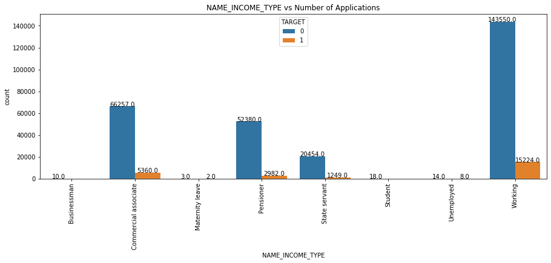


#### Income type
* 52% of applicants have their NAME_INCOME_TYPE as'Working'.
* Out of that 52%, 9.59% of them are likely to face Payment difficulties.
-----------
* 23% of applicants have their NAME_INCOME_TYPE as'Commercial associate'
* Out of that 23%, 7.48% of them are likely to face Payment difficulties.
-----------
* 7% of applicants have their NAME_INCOME_TYPE as'State servant'
* Out of that 7%, 5.75% of them are likely to face Payment difficulties.
----
* 18% of applicants have their NAME_INCOME_TYPE as'Pensioner'
* Out of that 18%, 5.39% of them are likely to face Payment difficulties.

**From the above Graph and proportions, we can infer that Pensioners and state servants have lower risk of facing payment difficulties compared to the Working and Commercial associates.**

**Unemployed,Student,Businessman and Maternity leave cannot be inferred because of the reason that they are not well populated.**


```python
#DAYS_LAST_PHONE_CHANGE
application_data['DAYS_LAST_PHONE_CHANGE'] = np.abs(application_data['DAYS_LAST_PHONE_CHANGE'])
application_data0['DAYS_LAST_PHONE_CHANGE'] = np.abs(application_data0['DAYS_LAST_PHONE_CHANGE'])
application_data1['DAYS_LAST_PHONE_CHANGE'] = np.abs(application_data1['DAYS_LAST_PHONE_CHANGE'])
num_univariate_analysis('DAYS_LAST_PHONE_CHANGE')
```

    All Other Cases (TARGET : 0)
    count   282,685.00
    mean        976.39
    std         831.21
    min           0.00
    25%         281.00
    50%         776.00
    75%       1,586.00
    max       4,292.00
    Name: DAYS_LAST_PHONE_CHANGE, dtype: float64 
    
    Clients with Payment Difficulties (TARGET : 1)
    count   24,825.00
    mean       808.80
    std        758.09
    min          0.00
    25%        194.00
    50%        594.00
    75%      1,301.00
    max      4,070.00
    Name: DAYS_LAST_PHONE_CHANGE, dtype: float64


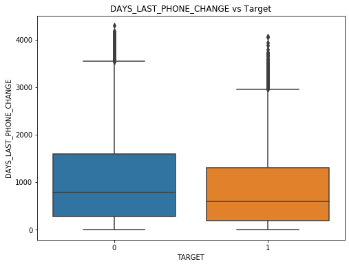


#### Days Since Phone Number Was Changed.
* From the above boxplot, we can clearly notice that the median for 'all other cases' is 776 days and the median for 'Clients with payment difficulties' is 594 days. 
* By this, we can clearly infer that,lesser the days since last phone change, greater is the risk of payment difficulties


```python
#FLAG_CONT_MOBILE
cat_univariate_analysis('FLAG_CONT_MOBILE',figsize=(15,5))
cat_proportions('FLAG_CONT_MOBILE')
```

    TARGET 0
     [1, 0]
    Categories (2, int64): [1, 0] 
    
    TARGET 1
     [1, 0]
    Categories (2, int64): [1, 0] 
    
    All Other Cases (TARGET : 0)
    +----+--------------------+---------+------------+--------------------+----------------------+
    |    |   FLAG_CONT_MOBILE |   Count |    Percent |   Cumulative Count |   Cumulative Percent |
    |----+--------------------+---------+------------+--------------------+----------------------|
    |  0 |                  1 |  282157 | 0.998129   |             282157 |             0.998129 |
    |  1 |                  0 |     529 | 0.00187133 |             282686 |             1        |
    +----+--------------------+---------+------------+--------------------+----------------------+ 
    
    Clients with Payment Difficulties (TARGET : 1)
    +----+--------------------+---------+------------+--------------------+----------------------+
    |    |   FLAG_CONT_MOBILE |   Count |    Percent |   Cumulative Count |   Cumulative Percent |
    |----+--------------------+---------+------------+--------------------+----------------------|
    |  0 |                  1 |   24780 | 0.998187   |              24780 |             0.998187 |
    |  1 |                  0 |      45 | 0.00181269 |              24825 |             1        |
    +----+--------------------+---------+------------+--------------------+----------------------+ 
    
    Proportion of 1 in Target 0 :  91.93
    Proportion of 1 in Target 1 :  8.07 
    
    Proportion of 0 in Target 0 :  92.16
    Proportion of 0 in Target 1 :  7.84 
    


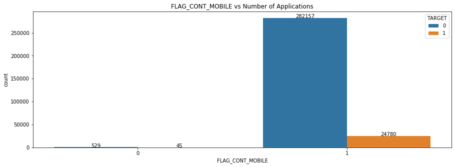


#### Flag Whether Mobile Phone Was Reachable
* From the above plot, we can observe that 0.18% applicants mobile numbers were not reachable.
* From the people whose mobiles numbers were reachable, 8.07% of them are likely to face Payment difficulties, whereas the people whose mobile numbers were'nt reachable, 7.84% of them are likely to face Payment difficulties.

**From these we cannot infer a relationship between FLAG_CONT_MOBILE and TARGET variable.**


```python
#FLAG_EMAIL.
cat_univariate_analysis('FLAG_EMAIL',figsize=(15,5))
cat_proportions('FLAG_EMAIL')
```

    TARGET 0
     [0, 1]
    Categories (2, int64): [0, 1] 
    
    TARGET 1
     [0, 1]
    Categories (2, int64): [0, 1] 
    
    All Other Cases (TARGET : 0)
    +----+--------------+---------+-----------+--------------------+----------------------+
    |    |   FLAG_EMAIL |   Count |   Percent |   Cumulative Count |   Cumulative Percent |
    |----+--------------+---------+-----------+--------------------+----------------------|
    |  0 |            0 |  266618 | 0.94316   |             266618 |              0.94316 |
    |  1 |            1 |   16068 | 0.0568405 |             282686 |              1       |
    +----+--------------+---------+-----------+--------------------+----------------------+ 
    
    Clients with Payment Difficulties (TARGET : 1)
    +----+--------------+---------+-----------+--------------------+----------------------+
    |    |   FLAG_EMAIL |   Count |   Percent |   Cumulative Count |   Cumulative Percent |
    |----+--------------+---------+-----------+--------------------+----------------------|
    |  0 |            0 |   23451 | 0.944653  |              23451 |             0.944653 |
    |  1 |            1 |    1374 | 0.0553474 |              24825 |             1        |
    +----+--------------+---------+-----------+--------------------+----------------------+ 
    
    Proportion of 0 in Target 0 :  91.92
    Proportion of 0 in Target 1 :  8.08 
    
    Proportion of 1 in Target 0 :  92.12
    Proportion of 1 in Target 1 :  7.88 
    


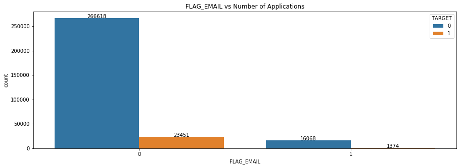


#### Whether E-mail Was Provided
* From the above plot and proportions, we can clearly see that 94.3% of applicants have not given the E-mail address.
* Out of 94.3%, 8.08% are likely to have payment difficulties.
------------
* From the above plot and proportions, we can clearly see that 5.7% of applicants have provided the E-mail address.
* Out of 5.7%, 7.88% are likely to have paymenr difficulties.

**From these we cannot infer a relationship between FLAG_EMAIL and TARGET variable because they stand in similar grounds.**


```python
#FLAG_MOBIL
cat_univariate_analysis('FLAG_MOBIL',figsize=(15,5))
cat_proportions('FLAG_MOBIL')
```

    TARGET 0
     [1, 0]
    Categories (2, int64): [1, 0] 
    
    TARGET 1
     [1]
    Categories (1, int64): [1] 
    
    All Other Cases (TARGET : 0)
    +----+--------------+---------+-------------+--------------------+----------------------+
    |    |   FLAG_MOBIL |   Count |     Percent |   Cumulative Count |   Cumulative Percent |
    |----+--------------+---------+-------------+--------------------+----------------------|
    |  0 |            1 |  282685 | 0.999996    |             282685 |             0.999996 |
    |  1 |            0 |       1 | 3.53749e-06 |             282686 |             1        |
    +----+--------------+---------+-------------+--------------------+----------------------+ 
    
    Clients with Payment Difficulties (TARGET : 1)
    +----+--------------+---------+-----------+--------------------+----------------------+
    |    |   FLAG_MOBIL |   Count |   Percent |   Cumulative Count |   Cumulative Percent |
    |----+--------------+---------+-----------+--------------------+----------------------|
    |  0 |            1 |   24825 |         1 |              24825 |                    1 |
    +----+--------------+---------+-----------+--------------------+----------------------+ 
    


    posx and posy should be finite values
    posx and posy should be finite values


    Proportion of 1 in Target 0 :  91.93
    Proportion of 1 in Target 1 :  8.07 
    
    Proportion of 0 in Target 0 :  100.0
    Proportion of 0 in Target 1 :  0.0 
    


#### Mobile Number
* 99.9% of them have given their mobile numbers. Out of those 99%, 8.07% have payment difficulties.
* There is only one applicant who failed to provide the mobile number, since this number is small and negligible, we cannot infer using this data.


```python
#LIVE_CITY_NOT_WORK_CITY
cat_univariate_analysis('LIVE_CITY_NOT_WORK_CITY',figsize=(15,5))
cat_proportions('LIVE_CITY_NOT_WORK_CITY')
```

    TARGET 0
     [0, 1]
    Categories (2, int64): [0, 1] 
    
    TARGET 1
     [0, 1]
    Categories (2, int64): [0, 1] 
    
    All Other Cases (TARGET : 0)
    +----+---------------------------+---------+-----------+--------------------+----------------------+
    |    |   LIVE_CITY_NOT_WORK_CITY |   Count |   Percent |   Cumulative Count |   Cumulative Percent |
    |----+---------------------------+---------+-----------+--------------------+----------------------|
    |  0 |                         0 |  232974 |  0.824144 |             232974 |             0.824144 |
    |  1 |                         1 |   49712 |  0.175856 |             282686 |             1        |
    +----+---------------------------+---------+-----------+--------------------+----------------------+ 
    
    Clients with Payment Difficulties (TARGET : 1)
    +----+---------------------------+---------+-----------+--------------------+----------------------+
    |    |   LIVE_CITY_NOT_WORK_CITY |   Count |   Percent |   Cumulative Count |   Cumulative Percent |
    |----+---------------------------+---------+-----------+--------------------+----------------------|
    |  0 |                         0 |   19322 |  0.778328 |              19322 |             0.778328 |
    |  1 |                         1 |    5503 |  0.221672 |              24825 |             1        |
    +----+---------------------------+---------+-----------+--------------------+----------------------+ 
    
    Proportion of 0 in Target 0 :  92.34
    Proportion of 0 in Target 1 :  7.66 
    
    Proportion of 1 in Target 0 :  90.03
    Proportion of 1 in Target 1 :  9.97 
    


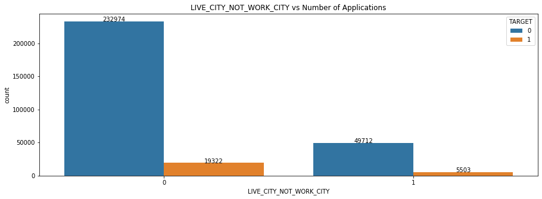


#### Contact Address vs Work Address
* From the above plot and proportions, we can clearly notice that 82% of them live and work in same city.
* Out of that 82%, 7.66% of applicants likely to have payment difficulties.
-------
* From the above plot and proportions, we can clearly notice that 17% of them donot live and work in same city.
* Out of that 17%, 9.97% of applicants have payment difficulties.

**By this, we can clearly infer that, applicants that live and work in same city are at less risk of payment difficulties.**


```python
#REG_CITY_NOT_LIVE_CITY.
cat_univariate_analysis('REG_CITY_NOT_LIVE_CITY',figsize=(15,5))
cat_proportions('REG_CITY_NOT_LIVE_CITY')
```

    TARGET 0
     [0, 1]
    Categories (2, int64): [0, 1] 
    
    TARGET 1
     [0, 1]
    Categories (2, int64): [0, 1] 
    
    All Other Cases (TARGET : 0)
    +----+--------------------------+---------+-----------+--------------------+----------------------+
    |    |   REG_CITY_NOT_LIVE_CITY |   Count |   Percent |   Cumulative Count |   Cumulative Percent |
    |----+--------------------------+---------+-----------+--------------------+----------------------|
    |  0 |                        0 |  261586 | 0.925359  |             261586 |             0.925359 |
    |  1 |                        1 |   21100 | 0.0746411 |             282686 |             1        |
    +----+--------------------------+---------+-----------+--------------------+----------------------+ 
    
    Clients with Payment Difficulties (TARGET : 1)
    +----+--------------------------+---------+-----------+--------------------+----------------------+
    |    |   REG_CITY_NOT_LIVE_CITY |   Count |   Percent |   Cumulative Count |   Cumulative Percent |
    |----+--------------------------+---------+-----------+--------------------+----------------------|
    |  0 |                        0 |   21886 |  0.881611 |              21886 |             0.881611 |
    |  1 |                        1 |    2939 |  0.118389 |              24825 |             1        |
    +----+--------------------------+---------+-----------+--------------------+----------------------+ 
    
    Proportion of 0 in Target 0 :  92.28
    Proportion of 0 in Target 1 :  7.72 
    
    Proportion of 1 in Target 0 :  87.77
    Proportion of 1 in Target 1 :  12.23 
    


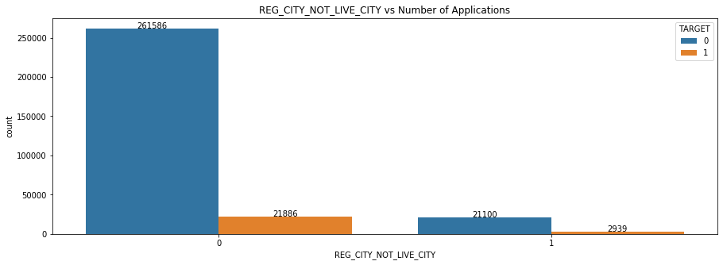


#### Permanent Address vs Contact Address
* From the above plot and proportions,92% of the applicant's permanent and contact address are same.
* Out of that 92%, 7.72% of applicants likely to have payment difficulties.
-------
* From the above plot and proportions, 8% of the applicant's permanent and contact address are not same.
* Out of that 8%, 12.23% of applicants likely to have payment difficulties.

**By this, we can infer that, applicants that same permanent and contact address are likely to have less risk of payment difficulties.**


```python
#REG_CITY_NOT_WORK_CITY.
cat_univariate_analysis('REG_CITY_NOT_WORK_CITY',figsize=(15,5))
cat_proportions('REG_CITY_NOT_WORK_CITY')
```

    TARGET 0
     [0, 1]
    Categories (2, int64): [0, 1] 
    
    TARGET 1
     [0, 1]
    Categories (2, int64): [0, 1] 
    
    All Other Cases (TARGET : 0)
    +----+--------------------------+---------+-----------+--------------------+----------------------+
    |    |   REG_CITY_NOT_WORK_CITY |   Count |   Percent |   Cumulative Count |   Cumulative Percent |
    |----+--------------------------+---------+-----------+--------------------+----------------------|
    |  0 |                        0 |  219339 |   0.77591 |             219339 |              0.77591 |
    |  1 |                        1 |   63347 |   0.22409 |             282686 |              1       |
    +----+--------------------------+---------+-----------+--------------------+----------------------+ 
    
    Clients with Payment Difficulties (TARGET : 1)
    +----+--------------------------+---------+-----------+--------------------+----------------------+
    |    |   REG_CITY_NOT_WORK_CITY |   Count |   Percent |   Cumulative Count |   Cumulative Percent |
    |----+--------------------------+---------+-----------+--------------------+----------------------|
    |  0 |                        0 |   17305 |   0.69708 |              17305 |              0.69708 |
    |  1 |                        1 |    7520 |   0.30292 |              24825 |              1       |
    +----+--------------------------+---------+-----------+--------------------+----------------------+ 
    
    Proportion of 0 in Target 0 :  92.69
    Proportion of 0 in Target 1 :  7.31 
    
    Proportion of 1 in Target 0 :  89.39
    Proportion of 1 in Target 1 :  10.61 
    


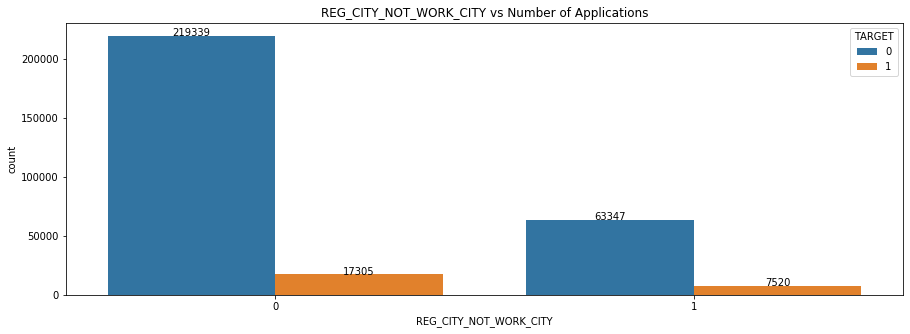


#### Permanent Address vs Work Address
* From the above plot and proportions, we can notice that 77% of applicants permanent address and work address are same. Coming to other side, 23% of applicants permanent address and work address are not same.

* Looking at the proportions of "Clients with payment difficulties" on both sides, we can infer that the applicants whose permanent adress and work adress matches are less likely to have payment difficulties.

## Bivariate Analysis 


```python
#AMT_ANNUITY, AMT_INCOME_TOTAL vs TARGET
column_names = ['AMT_INCOME_CAT','AMT_ANNUITY']
plt.figure(figsize=(16,8))
sns.barplot(x = column_names[0],y = column_names[1],hue='TARGET',data = application_data)
plt.title(column_names[0] + ' vs '+ column_names[1] + ' vs Target')
plt.xticks(rotation=90);
```


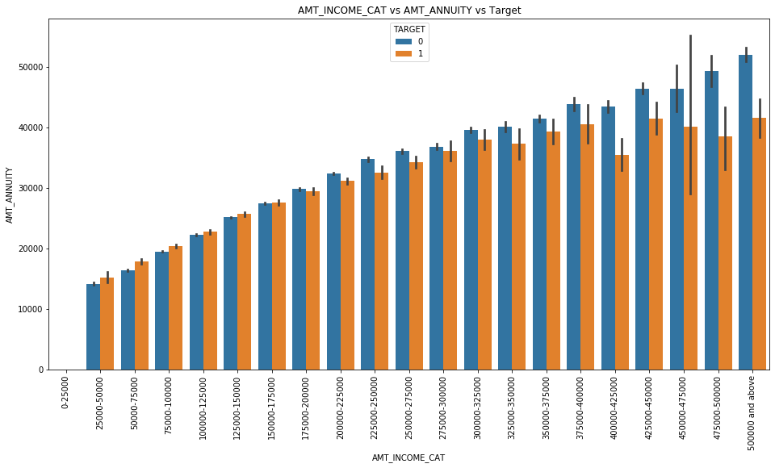


```python
plt.figure(figsize=(16,8))
# sns.catplot(x = column_names[0],y =column_names[1],hue='TARGET',data = application_data, kind='violin',height=8,aspect=4);
sns.violinplot(x = 'AMT_INCOME_CAT',y='AMT_ANNUITY',hue='TARGET',data = application_data,split=True, inner="quartile")
plt.title(column_names[0] + ' vs '+ column_names[1] + ' vs Target')
plt.xticks(rotation=90);
```


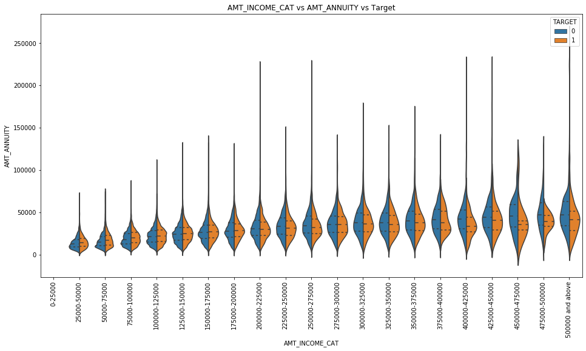


#### Income and Annuity
* Both plots show a gradual increase in the amount of annuity with increase in income. 
* Also, as the income increases there are higher number of outliers i.e the propensity to take on very high annuities compared to most customers in the same income range.
* It can be seen that in low income ranges, the median no of "Clients with Payment difficulties' is slightly higher. 
* And the in high income ranges,the median no of "Clients with Payment difficulties' is slightly lower.

**Income Range and Annuity have a mild correlation with Payment difficulties**


```python
#AMT_CREDIT, AMT_GOODS_PRICE vs TARGET
column_names = ['AMT_CREDIT', 'AMT_GOODS_PRICE']
fig,ax = plt.subplots(1,2)
fig.set_figheight(8)
fig.set_figwidth(15)

ax[0].set(title = column_names[0] + ' vs '+ column_names[1] + ' vs Target');
sns.scatterplot(x=column_names[0],y=column_names[1],hue='TARGET',data=application_data, alpha=0.8,ax=ax[0])
plt.xticks(rotation=90);

plt.title(column_names[0] + ' vs '+ column_names[1] + ' vs Target for AMT_GOODS_PRICE < 1000000');
sns.scatterplot(x=column_names[0],y=column_names[1],hue='TARGET',data=application_data[application_data['AMT_GOODS_PRICE'] <=1000000], alpha=0.8,ax=ax[1])
plt.xticks(rotation=90);

```


#### Credit Amount and Price of Credit Goods
* There is an overall linear relationship between Credit Amount and Price of Credit Goods. 
* Notice that more clients with payment difficulties are the ones who have borrowed lesser money for lesser priced goods. 
* And most outliers do not have payment difficulties. 

**Lower Credit Amount and Lower Price of Credit Goods have higher cases of Payment difficulties**


```python
#NAME_CONTRACT_TYPE vs REGION_RATING_CLIENT_W_CITY vs TARGET

column_names = ['NAME_CONTRACT_TYPE','REGION_RATING_CLIENT_W_CITY']
application_data.groupby(column_names)['TARGET'].value_counts(normalize=True)

```


    NAME_CONTRACT_TYPE  REGION_RATING_CLIENT_W_CITY  TARGET
    Cash loans          1                            0        0.95
                                                     1        0.05
                        2                            0        0.92
                                                     1        0.08
                        3                            0        0.88
                                                     1        0.12
    Revolving loans     1                            0        0.97
                                                     1        0.03
                        2                            0        0.94
                                                     1        0.06
                        3                            0        0.93
                                                     1        0.07
    Name: TARGET, dtype: float64


```python

```


```python
sns.catplot(x='REGION_RATING_CLIENT_W_CITY', hue='TARGET', col="NAME_CONTRACT_TYPE", kind="count", data=application_data);
```


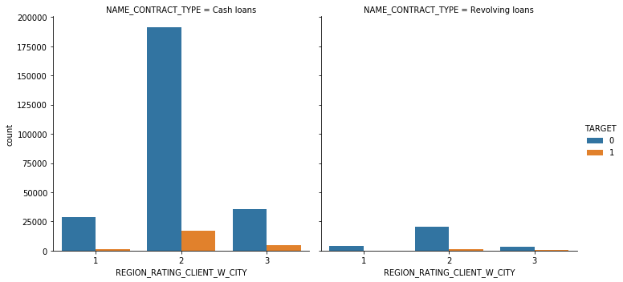


#### Type of Loan and City Rating 
* In cash loans, Category 3 Cities have **7%** more probability of payment difficulties than Category 1 Cities.
* In Revolving loans, Category 3 Cities have **4%** more probability of payment difficulties than Category 1 Cities.  

Although this just confirms correlation between the City Rating and default, now we know that **city rating has a higher impact on Cash Loans than Revolving Loans**


```python
# EXT_SOURCE_2 vs EXT_SOURCE_3 vs TARGET
creditScores = ['EXT_SOURCE_2','EXT_SOURCE_3']
plt.figure(figsize=[8,8])
sns.scatterplot(x=creditScores[0],y = creditScores[1], hue='TARGET',data = application_data, alpha=0.5);
plt.title(creditScores[0] + ' vs '+ creditScores[1]+ ' vs '+ 'TARGET');
```


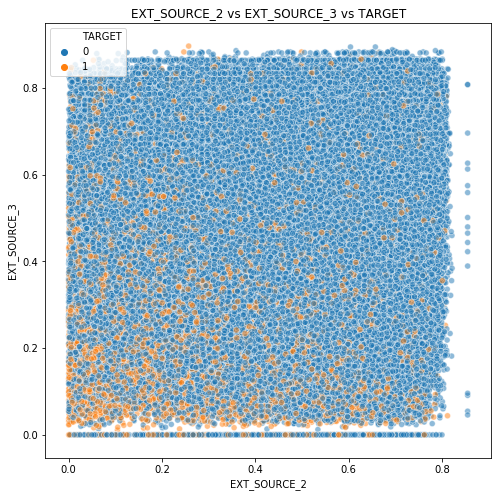


#### Credit Rating
* Checking Credit Ratings from two different sources confirms that trend of customers with lower credit ratings have a higher default rate. 


```python
#FLAG_OWN_CAR vs FLAG_OWN_REALTY vs TARGET
application_data.groupby(['FLAG_OWN_CAR','FLAG_OWN_REALTY'])['TARGET'].value_counts(normalize=True)
```


    FLAG_OWN_CAR  FLAG_OWN_REALTY  TARGET
    N             N                0        0.91
                                   1        0.09
                  Y                0        0.92
                                   1        0.08
    Y             N                0        0.93
                                   1        0.07
                  Y                0        0.93
                                   1        0.07
    Name: TARGET, dtype: float64


#### Owning A Car & Realty
From the above table , we see that customers with no car or realty have a high probability of default (9%), followed by customers who don't have a car but own realty (8%)  
**Since there's not much difference posed by owning a car or realty vs not owning them, we cannot infer any trend in default using these variables**


```python
#CODE_GENDER vs NAME_FAMILY_STATUS vs TARGET

# For the sake of this analysis since Civil marriage and Married are same, clubbing them into married category
application_data['NAME_FAMILY_STATUS'].replace('Civil marriage','Married', inplace=True)

ax = sns.catplot(x='NAME_FAMILY_STATUS', hue='TARGET', col="CODE_GENDER", kind="count", data=application_data, height = 5, aspect=2);
```


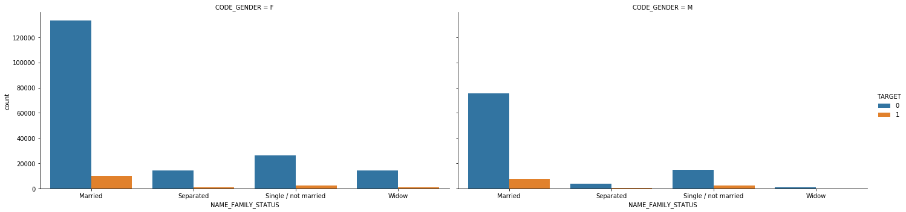


```python
# classification over both categories
pd.DataFrame(application_data.groupby(['CODE_GENDER','NAME_FAMILY_STATUS'])['TARGET'].value_counts(normalize=True))
```


<div>
<style scoped>
    .dataframe tbody tr th:only-of-type {
        vertical-align: middle;
    }

    .dataframe tbody tr th {
        vertical-align: top;
    }

    .dataframe thead th {
        text-align: right;
    }
</style>
<table border="1" class="dataframe">
  <thead>
    <tr style="text-align: right;">
      <th></th>
      <th></th>
      <th></th>
      <th>TARGET</th>
    </tr>
    <tr>
      <th>CODE_GENDER</th>
      <th>NAME_FAMILY_STATUS</th>
      <th>TARGET</th>
      <th></th>
    </tr>
  </thead>
  <tbody>
    <tr>
      <th rowspan="8" valign="top">F</th>
      <th rowspan="2" valign="top">Married</th>
      <th>0</th>
      <td>0.93</td>
    </tr>
    <tr>
      <th>1</th>
      <td>0.07</td>
    </tr>
    <tr>
      <th rowspan="2" valign="top">Separated</th>
      <th>0</th>
      <td>0.93</td>
    </tr>
    <tr>
      <th>1</th>
      <td>0.07</td>
    </tr>
    <tr>
      <th rowspan="2" valign="top">Single / not married</th>
      <th>0</th>
      <td>0.92</td>
    </tr>
    <tr>
      <th>1</th>
      <td>0.08</td>
    </tr>
    <tr>
      <th rowspan="2" valign="top">Widow</th>
      <th>0</th>
      <td>0.95</td>
    </tr>
    <tr>
      <th>1</th>
      <td>0.05</td>
    </tr>
    <tr>
      <th rowspan="8" valign="top">M</th>
      <th rowspan="2" valign="top">Married</th>
      <th>0</th>
      <td>0.91</td>
    </tr>
    <tr>
      <th>1</th>
      <td>0.09</td>
    </tr>
    <tr>
      <th rowspan="2" valign="top">Separated</th>
      <th>0</th>
      <td>0.87</td>
    </tr>
    <tr>
      <th>1</th>
      <td>0.13</td>
    </tr>
    <tr>
      <th rowspan="2" valign="top">Single / not married</th>
      <th>0</th>
      <td>0.87</td>
    </tr>
    <tr>
      <th>1</th>
      <td>0.13</td>
    </tr>
    <tr>
      <th rowspan="2" valign="top">Widow</th>
      <th>0</th>
      <td>0.88</td>
    </tr>
    <tr>
      <th>1</th>
      <td>0.12</td>
    </tr>
  </tbody>
</table>
</div>


```python
application_data.groupby(['CODE_GENDER','NAME_FAMILY_STATUS'])['TARGET'].value_counts(normalize=True)\
.unstack()\
   .plot( 
    layout=(2,2),
    figsize=(8,6), kind='barh', stacked=True);


```


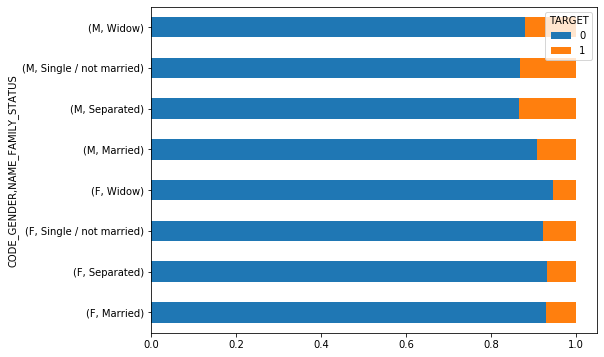


#### Gender & Marital Status 
* Looking at the above values, customers most attractive to the bank by likelihood of default,  are    
'Female Widows' > 'Married Females' = 'Separated Females' > 'Single Females' > 'Married Males' > 'Male Widowers' > 'Single Males' = 'Separated Males'  

**The bank may focus their marketing campaigns on converting applications of Female Widows, Married Females, Separated Females**  
**May note that the dataset is skewed towards Females than Males** 


```python
# NAME_HOUSING_TYPE vs NAME_INCOME_TYPE vs TARGET
income_housing = pd.DataFrame(application_data.groupby(['NAME_HOUSING_TYPE','NAME_INCOME_TYPE'])['TARGET'].value_counts(normalize=True))
income_housing.columns = ['Normalized Count']
income_housing 
```


<div>
<style scoped>
    .dataframe tbody tr th:only-of-type {
        vertical-align: middle;
    }

    .dataframe tbody tr th {
        vertical-align: top;
    }

    .dataframe thead th {
        text-align: right;
    }
</style>
<table border="1" class="dataframe">
  <thead>
    <tr style="text-align: right;">
      <th></th>
      <th></th>
      <th></th>
      <th>Normalized Count</th>
    </tr>
    <tr>
      <th>NAME_HOUSING_TYPE</th>
      <th>NAME_INCOME_TYPE</th>
      <th>TARGET</th>
      <th></th>
    </tr>
  </thead>
  <tbody>
    <tr>
      <th rowspan="8" valign="top">Co-op apartment</th>
      <th rowspan="2" valign="top">Commercial associate</th>
      <th>0</th>
      <td>0.91</td>
    </tr>
    <tr>
      <th>1</th>
      <td>0.09</td>
    </tr>
    <tr>
      <th rowspan="2" valign="top">Pensioner</th>
      <th>0</th>
      <td>0.96</td>
    </tr>
    <tr>
      <th>1</th>
      <td>0.04</td>
    </tr>
    <tr>
      <th rowspan="2" valign="top">State servant</th>
      <th>0</th>
      <td>0.99</td>
    </tr>
    <tr>
      <th>1</th>
      <td>0.01</td>
    </tr>
    <tr>
      <th rowspan="2" valign="top">Working</th>
      <th>0</th>
      <td>0.91</td>
    </tr>
    <tr>
      <th>1</th>
      <td>0.09</td>
    </tr>
    <tr>
      <th rowspan="14" valign="top">House / apartment</th>
      <th>Businessman</th>
      <th>0</th>
      <td>1.00</td>
    </tr>
    <tr>
      <th rowspan="2" valign="top">Commercial associate</th>
      <th>0</th>
      <td>0.93</td>
    </tr>
    <tr>
      <th>1</th>
      <td>0.07</td>
    </tr>
    <tr>
      <th rowspan="2" valign="top">Maternity leave</th>
      <th>0</th>
      <td>0.60</td>
    </tr>
    <tr>
      <th>1</th>
      <td>0.40</td>
    </tr>
    <tr>
      <th rowspan="2" valign="top">Pensioner</th>
      <th>0</th>
      <td>0.95</td>
    </tr>
    <tr>
      <th>1</th>
      <td>0.05</td>
    </tr>
    <tr>
      <th rowspan="2" valign="top">State servant</th>
      <th>0</th>
      <td>0.94</td>
    </tr>
    <tr>
      <th>1</th>
      <td>0.06</td>
    </tr>
    <tr>
      <th>Student</th>
      <th>0</th>
      <td>1.00</td>
    </tr>
    <tr>
      <th rowspan="2" valign="top">Unemployed</th>
      <th>0</th>
      <td>0.65</td>
    </tr>
    <tr>
      <th>1</th>
      <td>0.35</td>
    </tr>
    <tr>
      <th rowspan="2" valign="top">Working</th>
      <th>0</th>
      <td>0.91</td>
    </tr>
    <tr>
      <th>1</th>
      <td>0.09</td>
    </tr>
    <tr>
      <th rowspan="9" valign="top">Municipal apartment</th>
      <th rowspan="2" valign="top">Commercial associate</th>
      <th>0</th>
      <td>0.92</td>
    </tr>
    <tr>
      <th>1</th>
      <td>0.08</td>
    </tr>
    <tr>
      <th rowspan="2" valign="top">Pensioner</th>
      <th>0</th>
      <td>0.93</td>
    </tr>
    <tr>
      <th>1</th>
      <td>0.07</td>
    </tr>
    <tr>
      <th rowspan="2" valign="top">State servant</th>
      <th>0</th>
      <td>0.94</td>
    </tr>
    <tr>
      <th>1</th>
      <td>0.06</td>
    </tr>
    <tr>
      <th>Unemployed</th>
      <th>1</th>
      <td>1.00</td>
    </tr>
    <tr>
      <th rowspan="2" valign="top">Working</th>
      <th>0</th>
      <td>0.90</td>
    </tr>
    <tr>
      <th>1</th>
      <td>0.10</td>
    </tr>
    <tr>
      <th rowspan="9" valign="top">Office apartment</th>
      <th rowspan="2" valign="top">Commercial associate</th>
      <th>0</th>
      <td>0.93</td>
    </tr>
    <tr>
      <th>1</th>
      <td>0.07</td>
    </tr>
    <tr>
      <th rowspan="2" valign="top">Pensioner</th>
      <th>0</th>
      <td>0.94</td>
    </tr>
    <tr>
      <th>1</th>
      <td>0.06</td>
    </tr>
    <tr>
      <th rowspan="2" valign="top">State servant</th>
      <th>0</th>
      <td>0.96</td>
    </tr>
    <tr>
      <th>1</th>
      <td>0.04</td>
    </tr>
    <tr>
      <th>Student</th>
      <th>0</th>
      <td>1.00</td>
    </tr>
    <tr>
      <th rowspan="2" valign="top">Working</th>
      <th>0</th>
      <td>0.92</td>
    </tr>
    <tr>
      <th>1</th>
      <td>0.08</td>
    </tr>
    <tr>
      <th rowspan="10" valign="top">Rented apartment</th>
      <th rowspan="2" valign="top">Commercial associate</th>
      <th>0</th>
      <td>0.88</td>
    </tr>
    <tr>
      <th>1</th>
      <td>0.12</td>
    </tr>
    <tr>
      <th rowspan="2" valign="top">Pensioner</th>
      <th>0</th>
      <td>0.93</td>
    </tr>
    <tr>
      <th>1</th>
      <td>0.07</td>
    </tr>
    <tr>
      <th rowspan="2" valign="top">State servant</th>
      <th>0</th>
      <td>0.93</td>
    </tr>
    <tr>
      <th>1</th>
      <td>0.07</td>
    </tr>
    <tr>
      <th>Student</th>
      <th>0</th>
      <td>1.00</td>
    </tr>
    <tr>
      <th>Unemployed</th>
      <th>0</th>
      <td>1.00</td>
    </tr>
    <tr>
      <th rowspan="2" valign="top">Working</th>
      <th>0</th>
      <td>0.86</td>
    </tr>
    <tr>
      <th>1</th>
      <td>0.14</td>
    </tr>
    <tr>
      <th rowspan="11" valign="top">With parents</th>
      <th rowspan="2" valign="top">Commercial associate</th>
      <th>0</th>
      <td>0.90</td>
    </tr>
    <tr>
      <th>1</th>
      <td>0.10</td>
    </tr>
    <tr>
      <th rowspan="2" valign="top">Pensioner</th>
      <th>0</th>
      <td>0.95</td>
    </tr>
    <tr>
      <th>1</th>
      <td>0.05</td>
    </tr>
    <tr>
      <th rowspan="2" valign="top">State servant</th>
      <th>0</th>
      <td>0.91</td>
    </tr>
    <tr>
      <th>1</th>
      <td>0.09</td>
    </tr>
    <tr>
      <th>Student</th>
      <th>0</th>
      <td>1.00</td>
    </tr>
    <tr>
      <th rowspan="2" valign="top">Unemployed</th>
      <th>0</th>
      <td>0.67</td>
    </tr>
    <tr>
      <th>1</th>
      <td>0.33</td>
    </tr>
    <tr>
      <th rowspan="2" valign="top">Working</th>
      <th>0</th>
      <td>0.87</td>
    </tr>
    <tr>
      <th>1</th>
      <td>0.13</td>
    </tr>
  </tbody>
</table>
</div>


```python
application_data.groupby(['NAME_HOUSING_TYPE','NAME_INCOME_TYPE'])['TARGET'].value_counts(normalize=True)\
.unstack()\
   .plot( 
    layout=(2,2),
    figsize=(8,6), kind='barh', stacked=True);
```


```python
income_housing[np.in1d(income_housing.index.get_level_values(2), 1)].sort_values(by='Normalized Count', ascending=True)
```


<div>
<style scoped>
    .dataframe tbody tr th:only-of-type {
        vertical-align: middle;
    }

    .dataframe tbody tr th {
        vertical-align: top;
    }

    .dataframe thead th {
        text-align: right;
    }
</style>
<table border="1" class="dataframe">
  <thead>
    <tr style="text-align: right;">
      <th></th>
      <th></th>
      <th></th>
      <th>Normalized Count</th>
    </tr>
    <tr>
      <th>NAME_HOUSING_TYPE</th>
      <th>NAME_INCOME_TYPE</th>
      <th>TARGET</th>
      <th></th>
    </tr>
  </thead>
  <tbody>
    <tr>
      <th>Co-op apartment</th>
      <th>State servant</th>
      <th>1</th>
      <td>0.01</td>
    </tr>
    <tr>
      <th>Office apartment</th>
      <th>State servant</th>
      <th>1</th>
      <td>0.04</td>
    </tr>
    <tr>
      <th>Co-op apartment</th>
      <th>Pensioner</th>
      <th>1</th>
      <td>0.04</td>
    </tr>
    <tr>
      <th>With parents</th>
      <th>Pensioner</th>
      <th>1</th>
      <td>0.05</td>
    </tr>
    <tr>
      <th rowspan="2" valign="top">House / apartment</th>
      <th>Pensioner</th>
      <th>1</th>
      <td>0.05</td>
    </tr>
    <tr>
      <th>State servant</th>
      <th>1</th>
      <td>0.06</td>
    </tr>
    <tr>
      <th>Office apartment</th>
      <th>Pensioner</th>
      <th>1</th>
      <td>0.06</td>
    </tr>
    <tr>
      <th>Municipal apartment</th>
      <th>State servant</th>
      <th>1</th>
      <td>0.06</td>
    </tr>
    <tr>
      <th>Rented apartment</th>
      <th>State servant</th>
      <th>1</th>
      <td>0.07</td>
    </tr>
    <tr>
      <th>Municipal apartment</th>
      <th>Pensioner</th>
      <th>1</th>
      <td>0.07</td>
    </tr>
    <tr>
      <th>Rented apartment</th>
      <th>Pensioner</th>
      <th>1</th>
      <td>0.07</td>
    </tr>
    <tr>
      <th>House / apartment</th>
      <th>Commercial associate</th>
      <th>1</th>
      <td>0.07</td>
    </tr>
    <tr>
      <th rowspan="2" valign="top">Office apartment</th>
      <th>Commercial associate</th>
      <th>1</th>
      <td>0.07</td>
    </tr>
    <tr>
      <th>Working</th>
      <th>1</th>
      <td>0.08</td>
    </tr>
    <tr>
      <th>Municipal apartment</th>
      <th>Commercial associate</th>
      <th>1</th>
      <td>0.08</td>
    </tr>
    <tr>
      <th rowspan="2" valign="top">Co-op apartment</th>
      <th>Commercial associate</th>
      <th>1</th>
      <td>0.09</td>
    </tr>
    <tr>
      <th>Working</th>
      <th>1</th>
      <td>0.09</td>
    </tr>
    <tr>
      <th>House / apartment</th>
      <th>Working</th>
      <th>1</th>
      <td>0.09</td>
    </tr>
    <tr>
      <th rowspan="2" valign="top">With parents</th>
      <th>State servant</th>
      <th>1</th>
      <td>0.09</td>
    </tr>
    <tr>
      <th>Commercial associate</th>
      <th>1</th>
      <td>0.10</td>
    </tr>
    <tr>
      <th>Municipal apartment</th>
      <th>Working</th>
      <th>1</th>
      <td>0.10</td>
    </tr>
    <tr>
      <th>Rented apartment</th>
      <th>Commercial associate</th>
      <th>1</th>
      <td>0.12</td>
    </tr>
    <tr>
      <th>With parents</th>
      <th>Working</th>
      <th>1</th>
      <td>0.13</td>
    </tr>
    <tr>
      <th>Rented apartment</th>
      <th>Working</th>
      <th>1</th>
      <td>0.14</td>
    </tr>
    <tr>
      <th>With parents</th>
      <th>Unemployed</th>
      <th>1</th>
      <td>0.33</td>
    </tr>
    <tr>
      <th rowspan="2" valign="top">House / apartment</th>
      <th>Unemployed</th>
      <th>1</th>
      <td>0.35</td>
    </tr>
    <tr>
      <th>Maternity leave</th>
      <th>1</th>
      <td>0.40</td>
    </tr>
    <tr>
      <th>Municipal apartment</th>
      <th>Unemployed</th>
      <th>1</th>
      <td>1.00</td>
    </tr>
  </tbody>
</table>
</div>


#### Housing Type & Income Type
* The above tables list the categories in the order of least likelihood  of Payment difficulties 
* The top 5 categories are : 
    * State servant living in Co-op apartment
    * State servant living in Office apartment
    * Pensioner living in Co-op apartment
    * Pensioner living With parents 
    * Pensioner living in House / apartment  
    
**The bank may focus their marketing campaigns on converting applications of the above categories**  
**Pensioner living With parents category doesn't seem right and may be further checked if it's an anomaly**   


```python
#FLAG_EMAIL vs FLAG_MOBIL vs TARGET
pd.DataFrame(application_data.groupby(['FLAG_EMAIL','FLAG_MOBIL'])['TARGET'].value_counts(normalize=True))\
.unstack()\
   .plot( 
    layout=(2,2),
    figsize=(8,6), kind='barh', stacked=True);


```


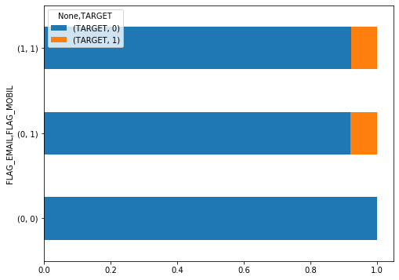


```python
pd.DataFrame(application_data.groupby(['FLAG_EMAIL','FLAG_MOBIL'])['TARGET'].value_counts())
```


<div>
<style scoped>
    .dataframe tbody tr th:only-of-type {
        vertical-align: middle;
    }

    .dataframe tbody tr th {
        vertical-align: top;
    }

    .dataframe thead th {
        text-align: right;
    }
</style>
<table border="1" class="dataframe">
  <thead>
    <tr style="text-align: right;">
      <th></th>
      <th></th>
      <th></th>
      <th>TARGET</th>
    </tr>
    <tr>
      <th>FLAG_EMAIL</th>
      <th>FLAG_MOBIL</th>
      <th>TARGET</th>
      <th></th>
    </tr>
  </thead>
  <tbody>
    <tr>
      <th rowspan="3" valign="top">0</th>
      <th>0</th>
      <th>0</th>
      <td>1</td>
    </tr>
    <tr>
      <th rowspan="2" valign="top">1</th>
      <th>0</th>
      <td>266617</td>
    </tr>
    <tr>
      <th>1</th>
      <td>23451</td>
    </tr>
    <tr>
      <th rowspan="2" valign="top">1</th>
      <th rowspan="2" valign="top">1</th>
      <th>0</th>
      <td>16068</td>
    </tr>
    <tr>
      <th>1</th>
      <td>1374</td>
    </tr>
  </tbody>
</table>
</div>


#### Email & Mobile Information
* 8% of customers who have not provided Email but have provided a Mobile Number have had payment difficulties 
* Similarly 8% of customers who provided both Email and Mobile Number have had payment difficulties  

**Hence we cannot infer any conclusive trend in payment difficulties using these variables**


```python
# DAYS_LAST_PHONE_CHANGE vs FLAG_CONT_MOBILE vs TARGET

sns.barplot(x = 'FLAG_CONT_MOBILE', y= 'DAYS_LAST_PHONE_CHANGE', hue='TARGET',data = application_data)
plt.title("FLAG_CONT_MOBILE vs DAYS_LAST_PHONE_CHANGE vs TARGET")
```


    Text(0.5, 1.0, 'FLAG_CONT_MOBILE vs DAYS_LAST_PHONE_CHANGE vs TARGET')


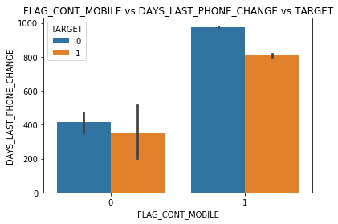


```python
sns.violinplot(x = 'FLAG_CONT_MOBILE', y= 'DAYS_LAST_PHONE_CHANGE', hue='TARGET', split=True, data = application_data,inner="quartile", height=5, aspect=1)
plt.title("FLAG_CONT_MOBILE vs DAYS_LAST_PHONE_CHANGE vs TARGET")
```


    Text(0.5, 1.0, 'FLAG_CONT_MOBILE vs DAYS_LAST_PHONE_CHANGE vs TARGET')


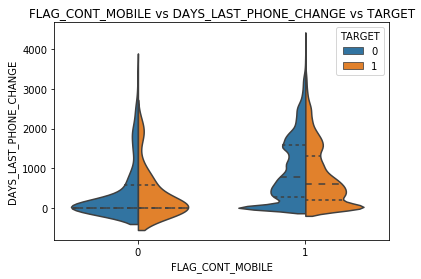


#### Days Since Phone Number Changed & Whether was Phone was Reachable
* Notice that the number of clients with reachable phones is higher than unreachable phones. (~900 days vs ~350 days)
* Among clients with reachable phones, Clients with Payment difficulties have median newer phone numbers than All other cases. (See violin plot for FLAG_CONT_MOBILE = 1 ) 
* Among clients with unreachable phones, the difference is less (~50 days vs ~ 200 days). In fact, the median age of phone number is same for defaulters and others.  

**We could conclude that clients with reachable and older phone numbers are better borrowers than other categories.When the phone is unreachable, last date of phone number change doesn't matter.**


```python
application_data['DAYS_EMPLOYED'].plot.hist()
```


    <matplotlib.axes._subplots.AxesSubplot at 0x7fcb4dd5a350>


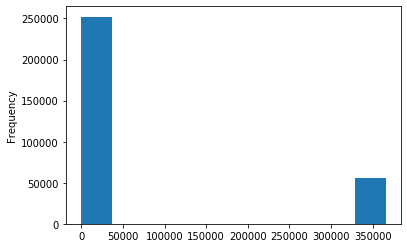


```python
#DAYS_EMPLOYED & NAME_EDUCATION_TYPE vs TARGET
fig,ax = plt.subplots(1,2)
fig.set_figheight(5)
fig.set_figwidth(15)

fig.suptitle(t="DAYS_EMPLOYED & NAME_EDUCATION_TYPE vs TARGET");
ax[0].tick_params(axis='x',rotation=90)
sns.barplot(x = 'NAME_EDUCATION_TYPE', y= 'DAYS_EMPLOYED', hue='TARGET',data = application_data,ax=ax[0])

ax[1].tick_params(axis='x',rotation=90)
# ax[1].set_yscale('log')
sns.violinplot(x = 'NAME_EDUCATION_TYPE', y= 'DAYS_EMPLOYED', hue='TARGET', split=True, data = application_data,inner="quartile", height=5, aspect=1, ax=ax[1])
#sns.swarmplot(x = 'NAME_EDUCATION_TYPE', y= 'DAYS_EMPLOYED', hue='TARGET', data = application_data, ax=ax[1])

```


    <matplotlib.axes._subplots.AxesSubplot at 0x7fcb2d648790>


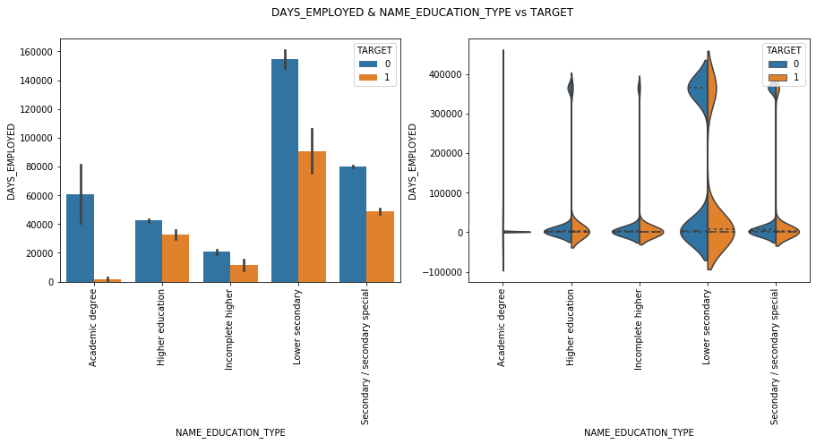


#### Employment Period & Education 
* The barplot between Days Employed and Education clearly shows that the clients holding an Academic Degree and having held employment for a long time have very low probability of default (difference between Target 0 , 1 of ~60000)
* Among clients with Secondary education, there are two groups, ones who are recently employed and others with long term employment. The recently employed clients in this category have equal probability to default or not. But the clients long term employment have lower probability to default. 

**The bank may place emphasis on education and employment period. Higher education and long term employment are good indicators of no default.Further clients with secondary education are far more attractive borrowers when they have held long term employment than otherwise**


```python
#CNT_CHILDREN & CNT_FAM_MEMBERS vs TARGET
subset = application_data[['CNT_CHILDREN','CNT_FAM_MEMBERS','TARGET']] 
subset = subset.dropna().astype('int')
childrenvsFamily = pd.pivot_table(index='CNT_CHILDREN', columns = 'CNT_FAM_MEMBERS',aggfunc=np.mean,data=subset)
childrenvsFamily
```


<div>
<style scoped>
    .dataframe tbody tr th:only-of-type {
        vertical-align: middle;
    }

    .dataframe tbody tr th {
        vertical-align: top;
    }

    .dataframe thead tr th {
        text-align: left;
    }

    .dataframe thead tr:last-of-type th {
        text-align: right;
    }
</style>
<table border="1" class="dataframe">
  <thead>
    <tr>
      <th></th>
      <th colspan="17" halign="left">TARGET</th>
    </tr>
    <tr>
      <th>CNT_FAM_MEMBERS</th>
      <th>1</th>
      <th>2</th>
      <th>3</th>
      <th>4</th>
      <th>5</th>
      <th>6</th>
      <th>7</th>
      <th>8</th>
      <th>9</th>
      <th>10</th>
      <th>11</th>
      <th>12</th>
      <th>13</th>
      <th>14</th>
      <th>15</th>
      <th>16</th>
      <th>20</th>
    </tr>
    <tr>
      <th>CNT_CHILDREN</th>
      <th></th>
      <th></th>
      <th></th>
      <th></th>
      <th></th>
      <th></th>
      <th></th>
      <th></th>
      <th></th>
      <th></th>
      <th></th>
      <th></th>
      <th></th>
      <th></th>
      <th></th>
      <th></th>
      <th></th>
    </tr>
  </thead>
  <tbody>
    <tr>
      <th>0</th>
      <td>0.08</td>
      <td>0.07</td>
      <td>nan</td>
      <td>nan</td>
      <td>nan</td>
      <td>nan</td>
      <td>nan</td>
      <td>nan</td>
      <td>nan</td>
      <td>nan</td>
      <td>nan</td>
      <td>nan</td>
      <td>nan</td>
      <td>nan</td>
      <td>nan</td>
      <td>nan</td>
      <td>nan</td>
    </tr>
    <tr>
      <th>1</th>
      <td>nan</td>
      <td>0.10</td>
      <td>0.09</td>
      <td>nan</td>
      <td>nan</td>
      <td>nan</td>
      <td>nan</td>
      <td>nan</td>
      <td>nan</td>
      <td>nan</td>
      <td>nan</td>
      <td>nan</td>
      <td>nan</td>
      <td>nan</td>
      <td>nan</td>
      <td>nan</td>
      <td>nan</td>
    </tr>
    <tr>
      <th>2</th>
      <td>nan</td>
      <td>nan</td>
      <td>0.10</td>
      <td>0.09</td>
      <td>nan</td>
      <td>nan</td>
      <td>nan</td>
      <td>nan</td>
      <td>nan</td>
      <td>nan</td>
      <td>nan</td>
      <td>nan</td>
      <td>nan</td>
      <td>nan</td>
      <td>nan</td>
      <td>nan</td>
      <td>nan</td>
    </tr>
    <tr>
      <th>3</th>
      <td>nan</td>
      <td>nan</td>
      <td>nan</td>
      <td>0.12</td>
      <td>0.09</td>
      <td>nan</td>
      <td>nan</td>
      <td>nan</td>
      <td>nan</td>
      <td>nan</td>
      <td>nan</td>
      <td>nan</td>
      <td>nan</td>
      <td>nan</td>
      <td>nan</td>
      <td>nan</td>
      <td>nan</td>
    </tr>
    <tr>
      <th>4</th>
      <td>nan</td>
      <td>nan</td>
      <td>nan</td>
      <td>nan</td>
      <td>0.04</td>
      <td>0.13</td>
      <td>nan</td>
      <td>nan</td>
      <td>nan</td>
      <td>nan</td>
      <td>nan</td>
      <td>nan</td>
      <td>nan</td>
      <td>nan</td>
      <td>nan</td>
      <td>nan</td>
      <td>nan</td>
    </tr>
    <tr>
      <th>5</th>
      <td>nan</td>
      <td>nan</td>
      <td>nan</td>
      <td>nan</td>
      <td>nan</td>
      <td>0.20</td>
      <td>0.08</td>
      <td>nan</td>
      <td>nan</td>
      <td>nan</td>
      <td>nan</td>
      <td>nan</td>
      <td>nan</td>
      <td>nan</td>
      <td>nan</td>
      <td>nan</td>
      <td>nan</td>
    </tr>
    <tr>
      <th>6</th>
      <td>nan</td>
      <td>nan</td>
      <td>nan</td>
      <td>nan</td>
      <td>nan</td>
      <td>nan</td>
      <td>0.00</td>
      <td>0.32</td>
      <td>nan</td>
      <td>nan</td>
      <td>nan</td>
      <td>nan</td>
      <td>nan</td>
      <td>nan</td>
      <td>nan</td>
      <td>nan</td>
      <td>nan</td>
    </tr>
    <tr>
      <th>7</th>
      <td>nan</td>
      <td>nan</td>
      <td>nan</td>
      <td>nan</td>
      <td>nan</td>
      <td>nan</td>
      <td>nan</td>
      <td>0.00</td>
      <td>0.00</td>
      <td>nan</td>
      <td>nan</td>
      <td>nan</td>
      <td>nan</td>
      <td>nan</td>
      <td>nan</td>
      <td>nan</td>
      <td>nan</td>
    </tr>
    <tr>
      <th>8</th>
      <td>nan</td>
      <td>nan</td>
      <td>nan</td>
      <td>nan</td>
      <td>nan</td>
      <td>nan</td>
      <td>nan</td>
      <td>nan</td>
      <td>nan</td>
      <td>0.00</td>
      <td>nan</td>
      <td>nan</td>
      <td>nan</td>
      <td>nan</td>
      <td>nan</td>
      <td>nan</td>
      <td>nan</td>
    </tr>
    <tr>
      <th>9</th>
      <td>nan</td>
      <td>nan</td>
      <td>nan</td>
      <td>nan</td>
      <td>nan</td>
      <td>nan</td>
      <td>nan</td>
      <td>nan</td>
      <td>nan</td>
      <td>1.00</td>
      <td>1.00</td>
      <td>nan</td>
      <td>nan</td>
      <td>nan</td>
      <td>nan</td>
      <td>nan</td>
      <td>nan</td>
    </tr>
    <tr>
      <th>10</th>
      <td>nan</td>
      <td>nan</td>
      <td>nan</td>
      <td>nan</td>
      <td>nan</td>
      <td>nan</td>
      <td>nan</td>
      <td>nan</td>
      <td>nan</td>
      <td>nan</td>
      <td>nan</td>
      <td>0.00</td>
      <td>nan</td>
      <td>nan</td>
      <td>nan</td>
      <td>nan</td>
      <td>nan</td>
    </tr>
    <tr>
      <th>11</th>
      <td>nan</td>
      <td>nan</td>
      <td>nan</td>
      <td>nan</td>
      <td>nan</td>
      <td>nan</td>
      <td>nan</td>
      <td>nan</td>
      <td>nan</td>
      <td>nan</td>
      <td>nan</td>
      <td>nan</td>
      <td>1.00</td>
      <td>nan</td>
      <td>nan</td>
      <td>nan</td>
      <td>nan</td>
    </tr>
    <tr>
      <th>12</th>
      <td>nan</td>
      <td>nan</td>
      <td>nan</td>
      <td>nan</td>
      <td>nan</td>
      <td>nan</td>
      <td>nan</td>
      <td>nan</td>
      <td>nan</td>
      <td>nan</td>
      <td>nan</td>
      <td>nan</td>
      <td>nan</td>
      <td>0.00</td>
      <td>nan</td>
      <td>nan</td>
      <td>nan</td>
    </tr>
    <tr>
      <th>14</th>
      <td>nan</td>
      <td>nan</td>
      <td>nan</td>
      <td>nan</td>
      <td>nan</td>
      <td>nan</td>
      <td>nan</td>
      <td>nan</td>
      <td>nan</td>
      <td>nan</td>
      <td>nan</td>
      <td>nan</td>
      <td>nan</td>
      <td>nan</td>
      <td>0.00</td>
      <td>0.00</td>
      <td>nan</td>
    </tr>
    <tr>
      <th>19</th>
      <td>nan</td>
      <td>nan</td>
      <td>nan</td>
      <td>nan</td>
      <td>nan</td>
      <td>nan</td>
      <td>nan</td>
      <td>nan</td>
      <td>nan</td>
      <td>nan</td>
      <td>nan</td>
      <td>nan</td>
      <td>nan</td>
      <td>nan</td>
      <td>nan</td>
      <td>nan</td>
      <td>0.00</td>
    </tr>
  </tbody>
</table>
</div>


#### Children & Family Members
* These variables are chosen to verify the amplified liabilities of clients having both more children and more family members. 
* The most attractive sub-categories are the clients with 1 or 2 family members and 0 children. 
* This is followed by clients having 1 or 2 children with 3 or 4 family members. 

Note that more than 5 children is deemed an error. This needs further analysis    
**Small families with less children has low risk of default**


```python
# NAME_EDUCATION_TYPE vs AMT_INCOME_TOTAL vs TARGET 

plt.figure(figsize=(10,8))
sns.violinplot(x = 'NAME_EDUCATION_TYPE', y= 'AMT_INCOME_TOTAL', hue='TARGET', split=True, data = application_data,inner="quartile", height=5, aspect=3)
plt.yscale('log')
plt.xticks(rotation=90);

```


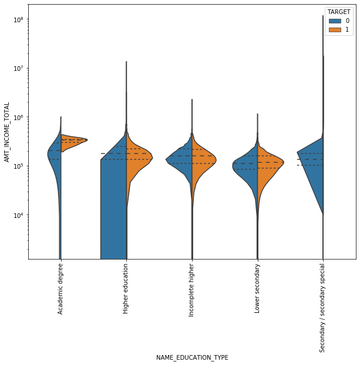


#### Type of Income vs Amount of Income 
* For the same average income across income types, clients with Secondary Education have the lowest probability of default. 
* Among clients with an Academic Degree, median income of clients with payment difficulties is higher than all other cases. 
* Among clients with Higher Education, Incomplete Higher Education and Lower Secondary education, the median income has no correlation with risk of default. 


```python
#'NAME_INCOME_TYPE vs NAME_EDUCATION_TYPE'
subset = application_data[['NAME_INCOME_TYPE','NAME_EDUCATION_TYPE','TARGET']] 
subset = subset.dropna()
subset['TARGET'] = subset['TARGET'].astype('int')
# pivot table for percentage of default for education type vs income type
incomeTypevsEdu = pd.pivot_table(index='NAME_EDUCATION_TYPE', columns = 'NAME_INCOME_TYPE',aggfunc=[np.mean],data=subset)
incomeTypevsEdu
```


<div>
<style scoped>
    .dataframe tbody tr th:only-of-type {
        vertical-align: middle;
    }

    .dataframe tbody tr th {
        vertical-align: top;
    }

    .dataframe thead tr th {
        text-align: left;
    }

    .dataframe thead tr:last-of-type th {
        text-align: right;
    }
</style>
<table border="1" class="dataframe">
  <thead>
    <tr>
      <th></th>
      <th colspan="8" halign="left">mean</th>
    </tr>
    <tr>
      <th></th>
      <th colspan="8" halign="left">TARGET</th>
    </tr>
    <tr>
      <th>NAME_INCOME_TYPE</th>
      <th>Businessman</th>
      <th>Commercial associate</th>
      <th>Maternity leave</th>
      <th>Pensioner</th>
      <th>State servant</th>
      <th>Student</th>
      <th>Unemployed</th>
      <th>Working</th>
    </tr>
    <tr>
      <th>NAME_EDUCATION_TYPE</th>
      <th></th>
      <th></th>
      <th></th>
      <th></th>
      <th></th>
      <th></th>
      <th></th>
      <th></th>
    </tr>
  </thead>
  <tbody>
    <tr>
      <th>Academic degree</th>
      <td>nan</td>
      <td>0.02</td>
      <td>nan</td>
      <td>0.00</td>
      <td>0.00</td>
      <td>nan</td>
      <td>nan</td>
      <td>0.03</td>
    </tr>
    <tr>
      <th>Higher education</th>
      <td>0.00</td>
      <td>0.05</td>
      <td>0.00</td>
      <td>0.04</td>
      <td>0.04</td>
      <td>0.00</td>
      <td>0.00</td>
      <td>0.06</td>
    </tr>
    <tr>
      <th>Incomplete higher</th>
      <td>nan</td>
      <td>0.08</td>
      <td>nan</td>
      <td>0.04</td>
      <td>0.07</td>
      <td>0.00</td>
      <td>0.33</td>
      <td>0.09</td>
    </tr>
    <tr>
      <th>Lower secondary</th>
      <td>nan</td>
      <td>0.12</td>
      <td>nan</td>
      <td>0.07</td>
      <td>0.08</td>
      <td>nan</td>
      <td>nan</td>
      <td>0.15</td>
    </tr>
    <tr>
      <th>Secondary / secondary special</th>
      <td>nan</td>
      <td>0.09</td>
      <td>1.00</td>
      <td>0.06</td>
      <td>0.07</td>
      <td>0.00</td>
      <td>0.54</td>
      <td>0.11</td>
    </tr>
  </tbody>
</table>
</div>


```python
# pivot table of the count of defaults for education type vs income type
pd.pivot_table(index='NAME_EDUCATION_TYPE', columns = 'NAME_INCOME_TYPE',aggfunc='count',data=subset)
```


<div>
<style scoped>
    .dataframe tbody tr th:only-of-type {
        vertical-align: middle;
    }

    .dataframe tbody tr th {
        vertical-align: top;
    }

    .dataframe thead tr th {
        text-align: left;
    }

    .dataframe thead tr:last-of-type th {
        text-align: right;
    }
</style>
<table border="1" class="dataframe">
  <thead>
    <tr>
      <th></th>
      <th colspan="8" halign="left">TARGET</th>
    </tr>
    <tr>
      <th>NAME_INCOME_TYPE</th>
      <th>Businessman</th>
      <th>Commercial associate</th>
      <th>Maternity leave</th>
      <th>Pensioner</th>
      <th>State servant</th>
      <th>Student</th>
      <th>Unemployed</th>
      <th>Working</th>
    </tr>
    <tr>
      <th>NAME_EDUCATION_TYPE</th>
      <th></th>
      <th></th>
      <th></th>
      <th></th>
      <th></th>
      <th></th>
      <th></th>
      <th></th>
    </tr>
  </thead>
  <tbody>
    <tr>
      <th>Academic degree</th>
      <td>nan</td>
      <td>43.00</td>
      <td>nan</td>
      <td>26.00</td>
      <td>23.00</td>
      <td>nan</td>
      <td>nan</td>
      <td>72.00</td>
    </tr>
    <tr>
      <th>Higher education</th>
      <td>10.00</td>
      <td>24,025.00</td>
      <td>3.00</td>
      <td>8,188.00</td>
      <td>8,863.00</td>
      <td>6.00</td>
      <td>6.00</td>
      <td>33,762.00</td>
    </tr>
    <tr>
      <th>Incomplete higher</th>
      <td>nan</td>
      <td>3,400.00</td>
      <td>nan</td>
      <td>518.00</td>
      <td>770.00</td>
      <td>1.00</td>
      <td>3.00</td>
      <td>5,585.00</td>
    </tr>
    <tr>
      <th>Lower secondary</th>
      <td>nan</td>
      <td>460.00</td>
      <td>nan</td>
      <td>1,529.00</td>
      <td>102.00</td>
      <td>nan</td>
      <td>nan</td>
      <td>1,725.00</td>
    </tr>
    <tr>
      <th>Secondary / secondary special</th>
      <td>nan</td>
      <td>43,689.00</td>
      <td>2.00</td>
      <td>45,101.00</td>
      <td>11,945.00</td>
      <td>11.00</td>
      <td>13.00</td>
      <td>117,630.00</td>
    </tr>
  </tbody>
</table>
</div>


#### Education Type & Income Type
* From the above pivot tables we could say that clients with Academic Degree have the least default risk.
* The highest volume of applications are from clients with Secondary education. Among them, the least default risk is posed by Pensioners. 
* The next highest in terms of volume of applications is from clients with Higher Education. Among these, the least risk is posed by Pensioners and State Servants.   
* Note that there's not enough application from Businessmen with Higher Education to conclusively say they have very low risk of default. 
* Highest default risk is posed by Unemployed clients. Among them unemployed clients with Secondary Education have the higest risk of default.


```python
sns.violinplot(x = 'NAME_INCOME_TYPE', y= 'AMT_INCOME_TOTAL', hue='TARGET', split=True, data = application_data,inner="quartile", height=5, aspect=3)
plt.yscale('log')
plt.xticks(rotation=90);
```


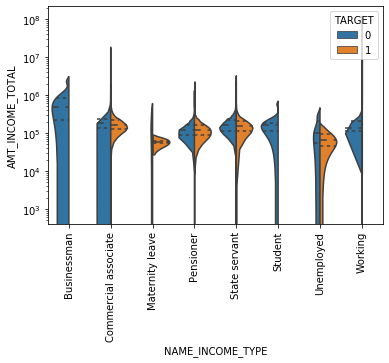


## Correlation Analysis

#### Correlation For Target : 0 


```python
# function to correlate variables
def correlation(dataframe) : 
    cor0=dataframe[columnsForAnalysis].corr()
    type(cor0)
    cor0.where(np.triu(np.ones(cor0.shape),k=1).astype(np.bool))
    cor0=cor0.unstack().reset_index()
    cor0.columns=['VAR1','VAR2','CORR']
    cor0.dropna(subset=['CORR'], inplace=True)
    cor0.CORR=round(cor0['CORR'],2)
    cor0.CORR=cor0.CORR.abs()
    cor0.sort_values(by=['CORR'],ascending=False)
    cor0=cor0[~(cor0['VAR1']==cor0['VAR2'])]
    return pd.DataFrame(cor0.sort_values(by=['CORR'],ascending=False))
```


```python
# Correlation for Target : 0 
# Absolute values are reported 
pd.set_option('precision', 2)
cor_0 = correlation(application_data0)
cor_0.style.background_gradient(cmap='GnBu').hide_index()
```


<style  type="text/css" >
    #T_4e1e1514_b4b0_11ea_b9b3_88e9fe4e6667row0_col2 {
            background-color:  #084081;
            color:  #f1f1f1;
        }    #T_4e1e1514_b4b0_11ea_b9b3_88e9fe4e6667row1_col2 {
            background-color:  #084081;
            color:  #f1f1f1;
        }    #T_4e1e1514_b4b0_11ea_b9b3_88e9fe4e6667row2_col2 {
            background-color:  #2081b8;
            color:  #000000;
        }    #T_4e1e1514_b4b0_11ea_b9b3_88e9fe4e6667row3_col2 {
            background-color:  #2081b8;
            color:  #000000;
        }    #T_4e1e1514_b4b0_11ea_b9b3_88e9fe4e6667row4_col2 {
            background-color:  #2283ba;
            color:  #000000;
        }    #T_4e1e1514_b4b0_11ea_b9b3_88e9fe4e6667row5_col2 {
            background-color:  #2283ba;
            color:  #000000;
        }    #T_4e1e1514_b4b0_11ea_b9b3_88e9fe4e6667row6_col2 {
            background-color:  #4bb0d1;
            color:  #000000;
        }    #T_4e1e1514_b4b0_11ea_b9b3_88e9fe4e6667row7_col2 {
            background-color:  #4bb0d1;
            color:  #000000;
        }    #T_4e1e1514_b4b0_11ea_b9b3_88e9fe4e6667row8_col2 {
            background-color:  #97d6bb;
            color:  #000000;
        }    #T_4e1e1514_b4b0_11ea_b9b3_88e9fe4e6667row9_col2 {
            background-color:  #97d6bb;
            color:  #000000;
        }    #T_4e1e1514_b4b0_11ea_b9b3_88e9fe4e6667row10_col2 {
            background-color:  #aedfb8;
            color:  #000000;
        }    #T_4e1e1514_b4b0_11ea_b9b3_88e9fe4e6667row11_col2 {
            background-color:  #aedfb8;
            color:  #000000;
        }    #T_4e1e1514_b4b0_11ea_b9b3_88e9fe4e6667row12_col2 {
            background-color:  #b2e1b9;
            color:  #000000;
        }    #T_4e1e1514_b4b0_11ea_b9b3_88e9fe4e6667row13_col2 {
            background-color:  #b2e1b9;
            color:  #000000;
        }    #T_4e1e1514_b4b0_11ea_b9b3_88e9fe4e6667row14_col2 {
            background-color:  #d4eece;
            color:  #000000;
        }    #T_4e1e1514_b4b0_11ea_b9b3_88e9fe4e6667row15_col2 {
            background-color:  #d4eece;
            color:  #000000;
        }    #T_4e1e1514_b4b0_11ea_b9b3_88e9fe4e6667row16_col2 {
            background-color:  #d5efcf;
            color:  #000000;
        }    #T_4e1e1514_b4b0_11ea_b9b3_88e9fe4e6667row17_col2 {
            background-color:  #d5efcf;
            color:  #000000;
        }    #T_4e1e1514_b4b0_11ea_b9b3_88e9fe4e6667row18_col2 {
            background-color:  #ddf2d8;
            color:  #000000;
        }    #T_4e1e1514_b4b0_11ea_b9b3_88e9fe4e6667row19_col2 {
            background-color:  #ddf2d8;
            color:  #000000;
        }    #T_4e1e1514_b4b0_11ea_b9b3_88e9fe4e6667row20_col2 {
            background-color:  #ddf2d8;
            color:  #000000;
        }    #T_4e1e1514_b4b0_11ea_b9b3_88e9fe4e6667row21_col2 {
            background-color:  #ddf2d8;
            color:  #000000;
        }    #T_4e1e1514_b4b0_11ea_b9b3_88e9fe4e6667row22_col2 {
            background-color:  #ddf2d8;
            color:  #000000;
        }    #T_4e1e1514_b4b0_11ea_b9b3_88e9fe4e6667row23_col2 {
            background-color:  #ddf2d8;
            color:  #000000;
        }    #T_4e1e1514_b4b0_11ea_b9b3_88e9fe4e6667row24_col2 {
            background-color:  #dff3da;
            color:  #000000;
        }    #T_4e1e1514_b4b0_11ea_b9b3_88e9fe4e6667row25_col2 {
            background-color:  #dff3da;
            color:  #000000;
        }    #T_4e1e1514_b4b0_11ea_b9b3_88e9fe4e6667row26_col2 {
            background-color:  #dff3da;
            color:  #000000;
        }    #T_4e1e1514_b4b0_11ea_b9b3_88e9fe4e6667row27_col2 {
            background-color:  #dff3da;
            color:  #000000;
        }    #T_4e1e1514_b4b0_11ea_b9b3_88e9fe4e6667row28_col2 {
            background-color:  #e3f4de;
            color:  #000000;
        }    #T_4e1e1514_b4b0_11ea_b9b3_88e9fe4e6667row29_col2 {
            background-color:  #e3f4de;
            color:  #000000;
        }    #T_4e1e1514_b4b0_11ea_b9b3_88e9fe4e6667row30_col2 {
            background-color:  #e5f5e0;
            color:  #000000;
        }    #T_4e1e1514_b4b0_11ea_b9b3_88e9fe4e6667row31_col2 {
            background-color:  #e5f5e0;
            color:  #000000;
        }    #T_4e1e1514_b4b0_11ea_b9b3_88e9fe4e6667row32_col2 {
            background-color:  #e9f6e3;
            color:  #000000;
        }    #T_4e1e1514_b4b0_11ea_b9b3_88e9fe4e6667row33_col2 {
            background-color:  #e9f6e3;
            color:  #000000;
        }    #T_4e1e1514_b4b0_11ea_b9b3_88e9fe4e6667row34_col2 {
            background-color:  #e9f6e3;
            color:  #000000;
        }    #T_4e1e1514_b4b0_11ea_b9b3_88e9fe4e6667row35_col2 {
            background-color:  #e9f6e3;
            color:  #000000;
        }    #T_4e1e1514_b4b0_11ea_b9b3_88e9fe4e6667row36_col2 {
            background-color:  #e9f6e3;
            color:  #000000;
        }    #T_4e1e1514_b4b0_11ea_b9b3_88e9fe4e6667row37_col2 {
            background-color:  #e9f6e3;
            color:  #000000;
        }    #T_4e1e1514_b4b0_11ea_b9b3_88e9fe4e6667row38_col2 {
            background-color:  #eaf7e4;
            color:  #000000;
        }    #T_4e1e1514_b4b0_11ea_b9b3_88e9fe4e6667row39_col2 {
            background-color:  #eaf7e4;
            color:  #000000;
        }    #T_4e1e1514_b4b0_11ea_b9b3_88e9fe4e6667row40_col2 {
            background-color:  #eaf7e4;
            color:  #000000;
        }    #T_4e1e1514_b4b0_11ea_b9b3_88e9fe4e6667row41_col2 {
            background-color:  #eaf7e4;
            color:  #000000;
        }    #T_4e1e1514_b4b0_11ea_b9b3_88e9fe4e6667row42_col2 {
            background-color:  #eaf7e4;
            color:  #000000;
        }    #T_4e1e1514_b4b0_11ea_b9b3_88e9fe4e6667row43_col2 {
            background-color:  #eaf7e4;
            color:  #000000;
        }    #T_4e1e1514_b4b0_11ea_b9b3_88e9fe4e6667row44_col2 {
            background-color:  #eaf7e4;
            color:  #000000;
        }    #T_4e1e1514_b4b0_11ea_b9b3_88e9fe4e6667row45_col2 {
            background-color:  #eaf7e4;
            color:  #000000;
        }    #T_4e1e1514_b4b0_11ea_b9b3_88e9fe4e6667row46_col2 {
            background-color:  #eaf7e4;
            color:  #000000;
        }    #T_4e1e1514_b4b0_11ea_b9b3_88e9fe4e6667row47_col2 {
            background-color:  #eaf7e4;
            color:  #000000;
        }    #T_4e1e1514_b4b0_11ea_b9b3_88e9fe4e6667row48_col2 {
            background-color:  #eaf7e4;
            color:  #000000;
        }    #T_4e1e1514_b4b0_11ea_b9b3_88e9fe4e6667row49_col2 {
            background-color:  #eaf7e4;
            color:  #000000;
        }    #T_4e1e1514_b4b0_11ea_b9b3_88e9fe4e6667row50_col2 {
            background-color:  #ecf8e6;
            color:  #000000;
        }    #T_4e1e1514_b4b0_11ea_b9b3_88e9fe4e6667row51_col2 {
            background-color:  #ecf8e6;
            color:  #000000;
        }    #T_4e1e1514_b4b0_11ea_b9b3_88e9fe4e6667row52_col2 {
            background-color:  #ecf8e6;
            color:  #000000;
        }    #T_4e1e1514_b4b0_11ea_b9b3_88e9fe4e6667row53_col2 {
            background-color:  #ecf8e6;
            color:  #000000;
        }    #T_4e1e1514_b4b0_11ea_b9b3_88e9fe4e6667row54_col2 {
            background-color:  #eef9e8;
            color:  #000000;
        }    #T_4e1e1514_b4b0_11ea_b9b3_88e9fe4e6667row55_col2 {
            background-color:  #eef9e8;
            color:  #000000;
        }    #T_4e1e1514_b4b0_11ea_b9b3_88e9fe4e6667row56_col2 {
            background-color:  #f0f9e9;
            color:  #000000;
        }    #T_4e1e1514_b4b0_11ea_b9b3_88e9fe4e6667row57_col2 {
            background-color:  #f0f9e9;
            color:  #000000;
        }    #T_4e1e1514_b4b0_11ea_b9b3_88e9fe4e6667row58_col2 {
            background-color:  #f0f9e9;
            color:  #000000;
        }    #T_4e1e1514_b4b0_11ea_b9b3_88e9fe4e6667row59_col2 {
            background-color:  #f0f9e9;
            color:  #000000;
        }    #T_4e1e1514_b4b0_11ea_b9b3_88e9fe4e6667row60_col2 {
            background-color:  #f0f9e9;
            color:  #000000;
        }    #T_4e1e1514_b4b0_11ea_b9b3_88e9fe4e6667row61_col2 {
            background-color:  #f0f9e9;
            color:  #000000;
        }    #T_4e1e1514_b4b0_11ea_b9b3_88e9fe4e6667row62_col2 {
            background-color:  #f0f9e9;
            color:  #000000;
        }    #T_4e1e1514_b4b0_11ea_b9b3_88e9fe4e6667row63_col2 {
            background-color:  #f0f9e9;
            color:  #000000;
        }    #T_4e1e1514_b4b0_11ea_b9b3_88e9fe4e6667row64_col2 {
            background-color:  #f2faeb;
            color:  #000000;
        }    #T_4e1e1514_b4b0_11ea_b9b3_88e9fe4e6667row65_col2 {
            background-color:  #f2faeb;
            color:  #000000;
        }    #T_4e1e1514_b4b0_11ea_b9b3_88e9fe4e6667row66_col2 {
            background-color:  #f2faeb;
            color:  #000000;
        }    #T_4e1e1514_b4b0_11ea_b9b3_88e9fe4e6667row67_col2 {
            background-color:  #f2faeb;
            color:  #000000;
        }    #T_4e1e1514_b4b0_11ea_b9b3_88e9fe4e6667row68_col2 {
            background-color:  #f3fbed;
            color:  #000000;
        }    #T_4e1e1514_b4b0_11ea_b9b3_88e9fe4e6667row69_col2 {
            background-color:  #f3fbed;
            color:  #000000;
        }    #T_4e1e1514_b4b0_11ea_b9b3_88e9fe4e6667row70_col2 {
            background-color:  #f6fbef;
            color:  #000000;
        }    #T_4e1e1514_b4b0_11ea_b9b3_88e9fe4e6667row71_col2 {
            background-color:  #f6fbef;
            color:  #000000;
        }    #T_4e1e1514_b4b0_11ea_b9b3_88e9fe4e6667row72_col2 {
            background-color:  #f7fcf0;
            color:  #000000;
        }    #T_4e1e1514_b4b0_11ea_b9b3_88e9fe4e6667row73_col2 {
            background-color:  #f7fcf0;
            color:  #000000;
        }    #T_4e1e1514_b4b0_11ea_b9b3_88e9fe4e6667row74_col2 {
            background-color:  #f7fcf0;
            color:  #000000;
        }    #T_4e1e1514_b4b0_11ea_b9b3_88e9fe4e6667row75_col2 {
            background-color:  #f7fcf0;
            color:  #000000;
        }    #T_4e1e1514_b4b0_11ea_b9b3_88e9fe4e6667row76_col2 {
            background-color:  #f7fcf0;
            color:  #000000;
        }    #T_4e1e1514_b4b0_11ea_b9b3_88e9fe4e6667row77_col2 {
            background-color:  #f7fcf0;
            color:  #000000;
        }    #T_4e1e1514_b4b0_11ea_b9b3_88e9fe4e6667row78_col2 {
            background-color:  #f7fcf0;
            color:  #000000;
        }    #T_4e1e1514_b4b0_11ea_b9b3_88e9fe4e6667row79_col2 {
            background-color:  #f7fcf0;
            color:  #000000;
        }    #T_4e1e1514_b4b0_11ea_b9b3_88e9fe4e6667row80_col2 {
            background-color:  #f7fcf0;
            color:  #000000;
        }    #T_4e1e1514_b4b0_11ea_b9b3_88e9fe4e6667row81_col2 {
            background-color:  #f7fcf0;
            color:  #000000;
        }    #T_4e1e1514_b4b0_11ea_b9b3_88e9fe4e6667row82_col2 {
            background-color:  #f7fcf0;
            color:  #000000;
        }    #T_4e1e1514_b4b0_11ea_b9b3_88e9fe4e6667row83_col2 {
            background-color:  #f7fcf0;
            color:  #000000;
        }    #T_4e1e1514_b4b0_11ea_b9b3_88e9fe4e6667row84_col2 {
            background-color:  #f7fcf0;
            color:  #000000;
        }    #T_4e1e1514_b4b0_11ea_b9b3_88e9fe4e6667row85_col2 {
            background-color:  #f7fcf0;
            color:  #000000;
        }    #T_4e1e1514_b4b0_11ea_b9b3_88e9fe4e6667row86_col2 {
            background-color:  #f7fcf0;
            color:  #000000;
        }    #T_4e1e1514_b4b0_11ea_b9b3_88e9fe4e6667row87_col2 {
            background-color:  #f7fcf0;
            color:  #000000;
        }    #T_4e1e1514_b4b0_11ea_b9b3_88e9fe4e6667row88_col2 {
            background-color:  #f7fcf0;
            color:  #000000;
        }    #T_4e1e1514_b4b0_11ea_b9b3_88e9fe4e6667row89_col2 {
            background-color:  #f7fcf0;
            color:  #000000;
        }</style><table id="T_4e1e1514_b4b0_11ea_b9b3_88e9fe4e6667" ><thead>    <tr>        <th class="col_heading level0 col0" >VAR1</th>        <th class="col_heading level0 col1" >VAR2</th>        <th class="col_heading level0 col2" >CORR</th>    </tr></thead><tbody>
                <tr>
                                <td id="T_4e1e1514_b4b0_11ea_b9b3_88e9fe4e6667row0_col0" class="data row0 col0" >AMT_GOODS_PRICE</td>
                        <td id="T_4e1e1514_b4b0_11ea_b9b3_88e9fe4e6667row0_col1" class="data row0 col1" >AMT_CREDIT</td>
                        <td id="T_4e1e1514_b4b0_11ea_b9b3_88e9fe4e6667row0_col2" class="data row0 col2" >0.99</td>
            </tr>
            <tr>
                                <td id="T_4e1e1514_b4b0_11ea_b9b3_88e9fe4e6667row1_col0" class="data row1 col0" >AMT_CREDIT</td>
                        <td id="T_4e1e1514_b4b0_11ea_b9b3_88e9fe4e6667row1_col1" class="data row1 col1" >AMT_GOODS_PRICE</td>
                        <td id="T_4e1e1514_b4b0_11ea_b9b3_88e9fe4e6667row1_col2" class="data row1 col2" >0.99</td>
            </tr>
            <tr>
                                <td id="T_4e1e1514_b4b0_11ea_b9b3_88e9fe4e6667row2_col0" class="data row2 col0" >AMT_GOODS_PRICE</td>
                        <td id="T_4e1e1514_b4b0_11ea_b9b3_88e9fe4e6667row2_col1" class="data row2 col1" >AMT_ANNUITY</td>
                        <td id="T_4e1e1514_b4b0_11ea_b9b3_88e9fe4e6667row2_col2" class="data row2 col2" >0.78</td>
            </tr>
            <tr>
                                <td id="T_4e1e1514_b4b0_11ea_b9b3_88e9fe4e6667row3_col0" class="data row3 col0" >AMT_ANNUITY</td>
                        <td id="T_4e1e1514_b4b0_11ea_b9b3_88e9fe4e6667row3_col1" class="data row3 col1" >AMT_GOODS_PRICE</td>
                        <td id="T_4e1e1514_b4b0_11ea_b9b3_88e9fe4e6667row3_col2" class="data row3 col2" >0.78</td>
            </tr>
            <tr>
                                <td id="T_4e1e1514_b4b0_11ea_b9b3_88e9fe4e6667row4_col0" class="data row4 col0" >AMT_ANNUITY</td>
                        <td id="T_4e1e1514_b4b0_11ea_b9b3_88e9fe4e6667row4_col1" class="data row4 col1" >AMT_CREDIT</td>
                        <td id="T_4e1e1514_b4b0_11ea_b9b3_88e9fe4e6667row4_col2" class="data row4 col2" >0.77</td>
            </tr>
            <tr>
                                <td id="T_4e1e1514_b4b0_11ea_b9b3_88e9fe4e6667row5_col0" class="data row5 col0" >AMT_CREDIT</td>
                        <td id="T_4e1e1514_b4b0_11ea_b9b3_88e9fe4e6667row5_col1" class="data row5 col1" >AMT_ANNUITY</td>
                        <td id="T_4e1e1514_b4b0_11ea_b9b3_88e9fe4e6667row5_col2" class="data row5 col2" >0.77</td>
            </tr>
            <tr>
                                <td id="T_4e1e1514_b4b0_11ea_b9b3_88e9fe4e6667row6_col0" class="data row6 col0" >AGE_YEARS</td>
                        <td id="T_4e1e1514_b4b0_11ea_b9b3_88e9fe4e6667row6_col1" class="data row6 col1" >DAYS_EMPLOYED</td>
                        <td id="T_4e1e1514_b4b0_11ea_b9b3_88e9fe4e6667row6_col2" class="data row6 col2" >0.63</td>
            </tr>
            <tr>
                                <td id="T_4e1e1514_b4b0_11ea_b9b3_88e9fe4e6667row7_col0" class="data row7 col0" >DAYS_EMPLOYED</td>
                        <td id="T_4e1e1514_b4b0_11ea_b9b3_88e9fe4e6667row7_col1" class="data row7 col1" >AGE_YEARS</td>
                        <td id="T_4e1e1514_b4b0_11ea_b9b3_88e9fe4e6667row7_col2" class="data row7 col2" >0.63</td>
            </tr>
            <tr>
                                <td id="T_4e1e1514_b4b0_11ea_b9b3_88e9fe4e6667row8_col0" class="data row8 col0" >AMT_ANNUITY</td>
                        <td id="T_4e1e1514_b4b0_11ea_b9b3_88e9fe4e6667row8_col1" class="data row8 col1" >AMT_INCOME_TOTAL</td>
                        <td id="T_4e1e1514_b4b0_11ea_b9b3_88e9fe4e6667row8_col2" class="data row8 col2" >0.42</td>
            </tr>
            <tr>
                                <td id="T_4e1e1514_b4b0_11ea_b9b3_88e9fe4e6667row9_col0" class="data row9 col0" >AMT_INCOME_TOTAL</td>
                        <td id="T_4e1e1514_b4b0_11ea_b9b3_88e9fe4e6667row9_col1" class="data row9 col1" >AMT_ANNUITY</td>
                        <td id="T_4e1e1514_b4b0_11ea_b9b3_88e9fe4e6667row9_col2" class="data row9 col2" >0.42</td>
            </tr>
            <tr>
                                <td id="T_4e1e1514_b4b0_11ea_b9b3_88e9fe4e6667row10_col0" class="data row10 col0" >AMT_GOODS_PRICE</td>
                        <td id="T_4e1e1514_b4b0_11ea_b9b3_88e9fe4e6667row10_col1" class="data row10 col1" >AMT_INCOME_TOTAL</td>
                        <td id="T_4e1e1514_b4b0_11ea_b9b3_88e9fe4e6667row10_col2" class="data row10 col2" >0.35</td>
            </tr>
            <tr>
                                <td id="T_4e1e1514_b4b0_11ea_b9b3_88e9fe4e6667row11_col0" class="data row11 col0" >AMT_INCOME_TOTAL</td>
                        <td id="T_4e1e1514_b4b0_11ea_b9b3_88e9fe4e6667row11_col1" class="data row11 col1" >AMT_GOODS_PRICE</td>
                        <td id="T_4e1e1514_b4b0_11ea_b9b3_88e9fe4e6667row11_col2" class="data row11 col2" >0.35</td>
            </tr>
            <tr>
                                <td id="T_4e1e1514_b4b0_11ea_b9b3_88e9fe4e6667row12_col0" class="data row12 col0" >AMT_INCOME_TOTAL</td>
                        <td id="T_4e1e1514_b4b0_11ea_b9b3_88e9fe4e6667row12_col1" class="data row12 col1" >AMT_CREDIT</td>
                        <td id="T_4e1e1514_b4b0_11ea_b9b3_88e9fe4e6667row12_col2" class="data row12 col2" >0.34</td>
            </tr>
            <tr>
                                <td id="T_4e1e1514_b4b0_11ea_b9b3_88e9fe4e6667row13_col0" class="data row13 col0" >AMT_CREDIT</td>
                        <td id="T_4e1e1514_b4b0_11ea_b9b3_88e9fe4e6667row13_col1" class="data row13 col1" >AMT_INCOME_TOTAL</td>
                        <td id="T_4e1e1514_b4b0_11ea_b9b3_88e9fe4e6667row13_col2" class="data row13 col2" >0.34</td>
            </tr>
            <tr>
                                <td id="T_4e1e1514_b4b0_11ea_b9b3_88e9fe4e6667row14_col0" class="data row14 col0" >AGE_YEARS</td>
                        <td id="T_4e1e1514_b4b0_11ea_b9b3_88e9fe4e6667row14_col1" class="data row14 col1" >EXT_SOURCE_3</td>
                        <td id="T_4e1e1514_b4b0_11ea_b9b3_88e9fe4e6667row14_col2" class="data row14 col2" >0.20</td>
            </tr>
            <tr>
                                <td id="T_4e1e1514_b4b0_11ea_b9b3_88e9fe4e6667row15_col0" class="data row15 col0" >EXT_SOURCE_3</td>
                        <td id="T_4e1e1514_b4b0_11ea_b9b3_88e9fe4e6667row15_col1" class="data row15 col1" >AGE_YEARS</td>
                        <td id="T_4e1e1514_b4b0_11ea_b9b3_88e9fe4e6667row15_col2" class="data row15 col2" >0.20</td>
            </tr>
            <tr>
                                <td id="T_4e1e1514_b4b0_11ea_b9b3_88e9fe4e6667row16_col0" class="data row16 col0" >DAYS_LAST_PHONE_CHANGE</td>
                        <td id="T_4e1e1514_b4b0_11ea_b9b3_88e9fe4e6667row16_col1" class="data row16 col1" >EXT_SOURCE_2</td>
                        <td id="T_4e1e1514_b4b0_11ea_b9b3_88e9fe4e6667row16_col2" class="data row16 col2" >0.19</td>
            </tr>
            <tr>
                                <td id="T_4e1e1514_b4b0_11ea_b9b3_88e9fe4e6667row17_col0" class="data row17 col0" >EXT_SOURCE_2</td>
                        <td id="T_4e1e1514_b4b0_11ea_b9b3_88e9fe4e6667row17_col1" class="data row17 col1" >DAYS_LAST_PHONE_CHANGE</td>
                        <td id="T_4e1e1514_b4b0_11ea_b9b3_88e9fe4e6667row17_col2" class="data row17 col2" >0.19</td>
            </tr>
            <tr>
                                <td id="T_4e1e1514_b4b0_11ea_b9b3_88e9fe4e6667row18_col0" class="data row18 col0" >DAYS_EMPLOYED</td>
                        <td id="T_4e1e1514_b4b0_11ea_b9b3_88e9fe4e6667row18_col1" class="data row18 col1" >AMT_INCOME_TOTAL</td>
                        <td id="T_4e1e1514_b4b0_11ea_b9b3_88e9fe4e6667row18_col2" class="data row18 col2" >0.14</td>
            </tr>
            <tr>
                                <td id="T_4e1e1514_b4b0_11ea_b9b3_88e9fe4e6667row19_col0" class="data row19 col0" >EXT_SOURCE_2</td>
                        <td id="T_4e1e1514_b4b0_11ea_b9b3_88e9fe4e6667row19_col1" class="data row19 col1" >AMT_INCOME_TOTAL</td>
                        <td id="T_4e1e1514_b4b0_11ea_b9b3_88e9fe4e6667row19_col2" class="data row19 col2" >0.14</td>
            </tr>
            <tr>
                                <td id="T_4e1e1514_b4b0_11ea_b9b3_88e9fe4e6667row20_col0" class="data row20 col0" >EXT_SOURCE_2</td>
                        <td id="T_4e1e1514_b4b0_11ea_b9b3_88e9fe4e6667row20_col1" class="data row20 col1" >AMT_GOODS_PRICE</td>
                        <td id="T_4e1e1514_b4b0_11ea_b9b3_88e9fe4e6667row20_col2" class="data row20 col2" >0.14</td>
            </tr>
            <tr>
                                <td id="T_4e1e1514_b4b0_11ea_b9b3_88e9fe4e6667row21_col0" class="data row21 col0" >AMT_INCOME_TOTAL</td>
                        <td id="T_4e1e1514_b4b0_11ea_b9b3_88e9fe4e6667row21_col1" class="data row21 col1" >EXT_SOURCE_2</td>
                        <td id="T_4e1e1514_b4b0_11ea_b9b3_88e9fe4e6667row21_col2" class="data row21 col2" >0.14</td>
            </tr>
            <tr>
                                <td id="T_4e1e1514_b4b0_11ea_b9b3_88e9fe4e6667row22_col0" class="data row22 col0" >AMT_INCOME_TOTAL</td>
                        <td id="T_4e1e1514_b4b0_11ea_b9b3_88e9fe4e6667row22_col1" class="data row22 col1" >DAYS_EMPLOYED</td>
                        <td id="T_4e1e1514_b4b0_11ea_b9b3_88e9fe4e6667row22_col2" class="data row22 col2" >0.14</td>
            </tr>
            <tr>
                                <td id="T_4e1e1514_b4b0_11ea_b9b3_88e9fe4e6667row23_col0" class="data row23 col0" >AMT_GOODS_PRICE</td>
                        <td id="T_4e1e1514_b4b0_11ea_b9b3_88e9fe4e6667row23_col1" class="data row23 col1" >EXT_SOURCE_2</td>
                        <td id="T_4e1e1514_b4b0_11ea_b9b3_88e9fe4e6667row23_col2" class="data row23 col2" >0.14</td>
            </tr>
            <tr>
                                <td id="T_4e1e1514_b4b0_11ea_b9b3_88e9fe4e6667row24_col0" class="data row24 col0" >AMT_ANNUITY</td>
                        <td id="T_4e1e1514_b4b0_11ea_b9b3_88e9fe4e6667row24_col1" class="data row24 col1" >EXT_SOURCE_2</td>
                        <td id="T_4e1e1514_b4b0_11ea_b9b3_88e9fe4e6667row24_col2" class="data row24 col2" >0.13</td>
            </tr>
            <tr>
                                <td id="T_4e1e1514_b4b0_11ea_b9b3_88e9fe4e6667row25_col0" class="data row25 col0" >EXT_SOURCE_2</td>
                        <td id="T_4e1e1514_b4b0_11ea_b9b3_88e9fe4e6667row25_col1" class="data row25 col1" >AMT_ANNUITY</td>
                        <td id="T_4e1e1514_b4b0_11ea_b9b3_88e9fe4e6667row25_col2" class="data row25 col2" >0.13</td>
            </tr>
            <tr>
                                <td id="T_4e1e1514_b4b0_11ea_b9b3_88e9fe4e6667row26_col0" class="data row26 col0" >AMT_CREDIT</td>
                        <td id="T_4e1e1514_b4b0_11ea_b9b3_88e9fe4e6667row26_col1" class="data row26 col1" >EXT_SOURCE_2</td>
                        <td id="T_4e1e1514_b4b0_11ea_b9b3_88e9fe4e6667row26_col2" class="data row26 col2" >0.13</td>
            </tr>
            <tr>
                                <td id="T_4e1e1514_b4b0_11ea_b9b3_88e9fe4e6667row27_col0" class="data row27 col0" >EXT_SOURCE_2</td>
                        <td id="T_4e1e1514_b4b0_11ea_b9b3_88e9fe4e6667row27_col1" class="data row27 col1" >AMT_CREDIT</td>
                        <td id="T_4e1e1514_b4b0_11ea_b9b3_88e9fe4e6667row27_col2" class="data row27 col2" >0.13</td>
            </tr>
            <tr>
                                <td id="T_4e1e1514_b4b0_11ea_b9b3_88e9fe4e6667row28_col0" class="data row28 col0" >DAYS_EMPLOYED</td>
                        <td id="T_4e1e1514_b4b0_11ea_b9b3_88e9fe4e6667row28_col1" class="data row28 col1" >EXT_SOURCE_3</td>
                        <td id="T_4e1e1514_b4b0_11ea_b9b3_88e9fe4e6667row28_col2" class="data row28 col2" >0.11</td>
            </tr>
            <tr>
                                <td id="T_4e1e1514_b4b0_11ea_b9b3_88e9fe4e6667row29_col0" class="data row29 col0" >EXT_SOURCE_3</td>
                        <td id="T_4e1e1514_b4b0_11ea_b9b3_88e9fe4e6667row29_col1" class="data row29 col1" >DAYS_EMPLOYED</td>
                        <td id="T_4e1e1514_b4b0_11ea_b9b3_88e9fe4e6667row29_col2" class="data row29 col2" >0.11</td>
            </tr>
            <tr>
                                <td id="T_4e1e1514_b4b0_11ea_b9b3_88e9fe4e6667row30_col0" class="data row30 col0" >DAYS_EMPLOYED</td>
                        <td id="T_4e1e1514_b4b0_11ea_b9b3_88e9fe4e6667row30_col1" class="data row30 col1" >AMT_ANNUITY</td>
                        <td id="T_4e1e1514_b4b0_11ea_b9b3_88e9fe4e6667row30_col2" class="data row30 col2" >0.10</td>
            </tr>
            <tr>
                                <td id="T_4e1e1514_b4b0_11ea_b9b3_88e9fe4e6667row31_col0" class="data row31 col0" >AMT_ANNUITY</td>
                        <td id="T_4e1e1514_b4b0_11ea_b9b3_88e9fe4e6667row31_col1" class="data row31 col1" >DAYS_EMPLOYED</td>
                        <td id="T_4e1e1514_b4b0_11ea_b9b3_88e9fe4e6667row31_col2" class="data row31 col2" >0.10</td>
            </tr>
            <tr>
                                <td id="T_4e1e1514_b4b0_11ea_b9b3_88e9fe4e6667row32_col0" class="data row32 col0" >EXT_SOURCE_2</td>
                        <td id="T_4e1e1514_b4b0_11ea_b9b3_88e9fe4e6667row32_col1" class="data row32 col1" >AGE_YEARS</td>
                        <td id="T_4e1e1514_b4b0_11ea_b9b3_88e9fe4e6667row32_col2" class="data row32 col2" >0.08</td>
            </tr>
            <tr>
                                <td id="T_4e1e1514_b4b0_11ea_b9b3_88e9fe4e6667row33_col0" class="data row33 col0" >EXT_SOURCE_2</td>
                        <td id="T_4e1e1514_b4b0_11ea_b9b3_88e9fe4e6667row33_col1" class="data row33 col1" >EXT_SOURCE_3</td>
                        <td id="T_4e1e1514_b4b0_11ea_b9b3_88e9fe4e6667row33_col2" class="data row33 col2" >0.08</td>
            </tr>
            <tr>
                                <td id="T_4e1e1514_b4b0_11ea_b9b3_88e9fe4e6667row34_col0" class="data row34 col0" >EXT_SOURCE_3</td>
                        <td id="T_4e1e1514_b4b0_11ea_b9b3_88e9fe4e6667row34_col1" class="data row34 col1" >EXT_SOURCE_2</td>
                        <td id="T_4e1e1514_b4b0_11ea_b9b3_88e9fe4e6667row34_col2" class="data row34 col2" >0.08</td>
            </tr>
            <tr>
                                <td id="T_4e1e1514_b4b0_11ea_b9b3_88e9fe4e6667row35_col0" class="data row35 col0" >AGE_YEARS</td>
                        <td id="T_4e1e1514_b4b0_11ea_b9b3_88e9fe4e6667row35_col1" class="data row35 col1" >DAYS_LAST_PHONE_CHANGE</td>
                        <td id="T_4e1e1514_b4b0_11ea_b9b3_88e9fe4e6667row35_col2" class="data row35 col2" >0.08</td>
            </tr>
            <tr>
                                <td id="T_4e1e1514_b4b0_11ea_b9b3_88e9fe4e6667row36_col0" class="data row36 col0" >AGE_YEARS</td>
                        <td id="T_4e1e1514_b4b0_11ea_b9b3_88e9fe4e6667row36_col1" class="data row36 col1" >EXT_SOURCE_2</td>
                        <td id="T_4e1e1514_b4b0_11ea_b9b3_88e9fe4e6667row36_col2" class="data row36 col2" >0.08</td>
            </tr>
            <tr>
                                <td id="T_4e1e1514_b4b0_11ea_b9b3_88e9fe4e6667row37_col0" class="data row37 col0" >DAYS_LAST_PHONE_CHANGE</td>
                        <td id="T_4e1e1514_b4b0_11ea_b9b3_88e9fe4e6667row37_col1" class="data row37 col1" >AGE_YEARS</td>
                        <td id="T_4e1e1514_b4b0_11ea_b9b3_88e9fe4e6667row37_col2" class="data row37 col2" >0.08</td>
            </tr>
            <tr>
                                <td id="T_4e1e1514_b4b0_11ea_b9b3_88e9fe4e6667row38_col0" class="data row38 col0" >DAYS_LAST_PHONE_CHANGE</td>
                        <td id="T_4e1e1514_b4b0_11ea_b9b3_88e9fe4e6667row38_col1" class="data row38 col1" >AMT_GOODS_PRICE</td>
                        <td id="T_4e1e1514_b4b0_11ea_b9b3_88e9fe4e6667row38_col2" class="data row38 col2" >0.07</td>
            </tr>
            <tr>
                                <td id="T_4e1e1514_b4b0_11ea_b9b3_88e9fe4e6667row39_col0" class="data row39 col0" >DAYS_EMPLOYED</td>
                        <td id="T_4e1e1514_b4b0_11ea_b9b3_88e9fe4e6667row39_col1" class="data row39 col1" >AMT_CREDIT</td>
                        <td id="T_4e1e1514_b4b0_11ea_b9b3_88e9fe4e6667row39_col2" class="data row39 col2" >0.07</td>
            </tr>
            <tr>
                                <td id="T_4e1e1514_b4b0_11ea_b9b3_88e9fe4e6667row40_col0" class="data row40 col0" >EXT_SOURCE_3</td>
                        <td id="T_4e1e1514_b4b0_11ea_b9b3_88e9fe4e6667row40_col1" class="data row40 col1" >DAYS_LAST_PHONE_CHANGE</td>
                        <td id="T_4e1e1514_b4b0_11ea_b9b3_88e9fe4e6667row40_col2" class="data row40 col2" >0.07</td>
            </tr>
            <tr>
                                <td id="T_4e1e1514_b4b0_11ea_b9b3_88e9fe4e6667row41_col0" class="data row41 col0" >EXT_SOURCE_3</td>
                        <td id="T_4e1e1514_b4b0_11ea_b9b3_88e9fe4e6667row41_col1" class="data row41 col1" >AMT_INCOME_TOTAL</td>
                        <td id="T_4e1e1514_b4b0_11ea_b9b3_88e9fe4e6667row41_col2" class="data row41 col2" >0.07</td>
            </tr>
            <tr>
                                <td id="T_4e1e1514_b4b0_11ea_b9b3_88e9fe4e6667row42_col0" class="data row42 col0" >AMT_INCOME_TOTAL</td>
                        <td id="T_4e1e1514_b4b0_11ea_b9b3_88e9fe4e6667row42_col1" class="data row42 col1" >EXT_SOURCE_3</td>
                        <td id="T_4e1e1514_b4b0_11ea_b9b3_88e9fe4e6667row42_col2" class="data row42 col2" >0.07</td>
            </tr>
            <tr>
                                <td id="T_4e1e1514_b4b0_11ea_b9b3_88e9fe4e6667row43_col0" class="data row43 col0" >AMT_CREDIT</td>
                        <td id="T_4e1e1514_b4b0_11ea_b9b3_88e9fe4e6667row43_col1" class="data row43 col1" >DAYS_EMPLOYED</td>
                        <td id="T_4e1e1514_b4b0_11ea_b9b3_88e9fe4e6667row43_col2" class="data row43 col2" >0.07</td>
            </tr>
            <tr>
                                <td id="T_4e1e1514_b4b0_11ea_b9b3_88e9fe4e6667row44_col0" class="data row44 col0" >DAYS_EMPLOYED</td>
                        <td id="T_4e1e1514_b4b0_11ea_b9b3_88e9fe4e6667row44_col1" class="data row44 col1" >AMT_GOODS_PRICE</td>
                        <td id="T_4e1e1514_b4b0_11ea_b9b3_88e9fe4e6667row44_col2" class="data row44 col2" >0.07</td>
            </tr>
            <tr>
                                <td id="T_4e1e1514_b4b0_11ea_b9b3_88e9fe4e6667row45_col0" class="data row45 col0" >AMT_CREDIT</td>
                        <td id="T_4e1e1514_b4b0_11ea_b9b3_88e9fe4e6667row45_col1" class="data row45 col1" >DAYS_LAST_PHONE_CHANGE</td>
                        <td id="T_4e1e1514_b4b0_11ea_b9b3_88e9fe4e6667row45_col2" class="data row45 col2" >0.07</td>
            </tr>
            <tr>
                                <td id="T_4e1e1514_b4b0_11ea_b9b3_88e9fe4e6667row46_col0" class="data row46 col0" >DAYS_LAST_PHONE_CHANGE</td>
                        <td id="T_4e1e1514_b4b0_11ea_b9b3_88e9fe4e6667row46_col1" class="data row46 col1" >AMT_CREDIT</td>
                        <td id="T_4e1e1514_b4b0_11ea_b9b3_88e9fe4e6667row46_col2" class="data row46 col2" >0.07</td>
            </tr>
            <tr>
                                <td id="T_4e1e1514_b4b0_11ea_b9b3_88e9fe4e6667row47_col0" class="data row47 col0" >AMT_GOODS_PRICE</td>
                        <td id="T_4e1e1514_b4b0_11ea_b9b3_88e9fe4e6667row47_col1" class="data row47 col1" >DAYS_LAST_PHONE_CHANGE</td>
                        <td id="T_4e1e1514_b4b0_11ea_b9b3_88e9fe4e6667row47_col2" class="data row47 col2" >0.07</td>
            </tr>
            <tr>
                                <td id="T_4e1e1514_b4b0_11ea_b9b3_88e9fe4e6667row48_col0" class="data row48 col0" >AMT_GOODS_PRICE</td>
                        <td id="T_4e1e1514_b4b0_11ea_b9b3_88e9fe4e6667row48_col1" class="data row48 col1" >DAYS_EMPLOYED</td>
                        <td id="T_4e1e1514_b4b0_11ea_b9b3_88e9fe4e6667row48_col2" class="data row48 col2" >0.07</td>
            </tr>
            <tr>
                                <td id="T_4e1e1514_b4b0_11ea_b9b3_88e9fe4e6667row49_col0" class="data row49 col0" >DAYS_LAST_PHONE_CHANGE</td>
                        <td id="T_4e1e1514_b4b0_11ea_b9b3_88e9fe4e6667row49_col1" class="data row49 col1" >EXT_SOURCE_3</td>
                        <td id="T_4e1e1514_b4b0_11ea_b9b3_88e9fe4e6667row49_col2" class="data row49 col2" >0.07</td>
            </tr>
            <tr>
                                <td id="T_4e1e1514_b4b0_11ea_b9b3_88e9fe4e6667row50_col0" class="data row50 col0" >AGE_YEARS</td>
                        <td id="T_4e1e1514_b4b0_11ea_b9b3_88e9fe4e6667row50_col1" class="data row50 col1" >AMT_INCOME_TOTAL</td>
                        <td id="T_4e1e1514_b4b0_11ea_b9b3_88e9fe4e6667row50_col2" class="data row50 col2" >0.06</td>
            </tr>
            <tr>
                                <td id="T_4e1e1514_b4b0_11ea_b9b3_88e9fe4e6667row51_col0" class="data row51 col0" >AMT_ANNUITY</td>
                        <td id="T_4e1e1514_b4b0_11ea_b9b3_88e9fe4e6667row51_col1" class="data row51 col1" >DAYS_LAST_PHONE_CHANGE</td>
                        <td id="T_4e1e1514_b4b0_11ea_b9b3_88e9fe4e6667row51_col2" class="data row51 col2" >0.06</td>
            </tr>
            <tr>
                                <td id="T_4e1e1514_b4b0_11ea_b9b3_88e9fe4e6667row52_col0" class="data row52 col0" >DAYS_LAST_PHONE_CHANGE</td>
                        <td id="T_4e1e1514_b4b0_11ea_b9b3_88e9fe4e6667row52_col1" class="data row52 col1" >AMT_ANNUITY</td>
                        <td id="T_4e1e1514_b4b0_11ea_b9b3_88e9fe4e6667row52_col2" class="data row52 col2" >0.06</td>
            </tr>
            <tr>
                                <td id="T_4e1e1514_b4b0_11ea_b9b3_88e9fe4e6667row53_col0" class="data row53 col0" >AMT_INCOME_TOTAL</td>
                        <td id="T_4e1e1514_b4b0_11ea_b9b3_88e9fe4e6667row53_col1" class="data row53 col1" >AGE_YEARS</td>
                        <td id="T_4e1e1514_b4b0_11ea_b9b3_88e9fe4e6667row53_col2" class="data row53 col2" >0.06</td>
            </tr>
            <tr>
                                <td id="T_4e1e1514_b4b0_11ea_b9b3_88e9fe4e6667row54_col0" class="data row54 col0" >AMT_CREDIT</td>
                        <td id="T_4e1e1514_b4b0_11ea_b9b3_88e9fe4e6667row54_col1" class="data row54 col1" >AGE_YEARS</td>
                        <td id="T_4e1e1514_b4b0_11ea_b9b3_88e9fe4e6667row54_col2" class="data row54 col2" >0.05</td>
            </tr>
            <tr>
                                <td id="T_4e1e1514_b4b0_11ea_b9b3_88e9fe4e6667row55_col0" class="data row55 col0" >AGE_YEARS</td>
                        <td id="T_4e1e1514_b4b0_11ea_b9b3_88e9fe4e6667row55_col1" class="data row55 col1" >AMT_CREDIT</td>
                        <td id="T_4e1e1514_b4b0_11ea_b9b3_88e9fe4e6667row55_col2" class="data row55 col2" >0.05</td>
            </tr>
            <tr>
                                <td id="T_4e1e1514_b4b0_11ea_b9b3_88e9fe4e6667row56_col0" class="data row56 col0" >AGE_YEARS</td>
                        <td id="T_4e1e1514_b4b0_11ea_b9b3_88e9fe4e6667row56_col1" class="data row56 col1" >AMT_GOODS_PRICE</td>
                        <td id="T_4e1e1514_b4b0_11ea_b9b3_88e9fe4e6667row56_col2" class="data row56 col2" >0.04</td>
            </tr>
            <tr>
                                <td id="T_4e1e1514_b4b0_11ea_b9b3_88e9fe4e6667row57_col0" class="data row57 col0" >EXT_SOURCE_3</td>
                        <td id="T_4e1e1514_b4b0_11ea_b9b3_88e9fe4e6667row57_col1" class="data row57 col1" >AMT_GOODS_PRICE</td>
                        <td id="T_4e1e1514_b4b0_11ea_b9b3_88e9fe4e6667row57_col2" class="data row57 col2" >0.04</td>
            </tr>
            <tr>
                                <td id="T_4e1e1514_b4b0_11ea_b9b3_88e9fe4e6667row58_col0" class="data row58 col0" >EXT_SOURCE_3</td>
                        <td id="T_4e1e1514_b4b0_11ea_b9b3_88e9fe4e6667row58_col1" class="data row58 col1" >AMT_CREDIT</td>
                        <td id="T_4e1e1514_b4b0_11ea_b9b3_88e9fe4e6667row58_col2" class="data row58 col2" >0.04</td>
            </tr>
            <tr>
                                <td id="T_4e1e1514_b4b0_11ea_b9b3_88e9fe4e6667row59_col0" class="data row59 col0" >DAYS_LAST_PHONE_CHANGE</td>
                        <td id="T_4e1e1514_b4b0_11ea_b9b3_88e9fe4e6667row59_col1" class="data row59 col1" >AMT_INCOME_TOTAL</td>
                        <td id="T_4e1e1514_b4b0_11ea_b9b3_88e9fe4e6667row59_col2" class="data row59 col2" >0.04</td>
            </tr>
            <tr>
                                <td id="T_4e1e1514_b4b0_11ea_b9b3_88e9fe4e6667row60_col0" class="data row60 col0" >AMT_INCOME_TOTAL</td>
                        <td id="T_4e1e1514_b4b0_11ea_b9b3_88e9fe4e6667row60_col1" class="data row60 col1" >DAYS_LAST_PHONE_CHANGE</td>
                        <td id="T_4e1e1514_b4b0_11ea_b9b3_88e9fe4e6667row60_col2" class="data row60 col2" >0.04</td>
            </tr>
            <tr>
                                <td id="T_4e1e1514_b4b0_11ea_b9b3_88e9fe4e6667row61_col0" class="data row61 col0" >AMT_GOODS_PRICE</td>
                        <td id="T_4e1e1514_b4b0_11ea_b9b3_88e9fe4e6667row61_col1" class="data row61 col1" >EXT_SOURCE_3</td>
                        <td id="T_4e1e1514_b4b0_11ea_b9b3_88e9fe4e6667row61_col2" class="data row61 col2" >0.04</td>
            </tr>
            <tr>
                                <td id="T_4e1e1514_b4b0_11ea_b9b3_88e9fe4e6667row62_col0" class="data row62 col0" >AMT_CREDIT</td>
                        <td id="T_4e1e1514_b4b0_11ea_b9b3_88e9fe4e6667row62_col1" class="data row62 col1" >EXT_SOURCE_3</td>
                        <td id="T_4e1e1514_b4b0_11ea_b9b3_88e9fe4e6667row62_col2" class="data row62 col2" >0.04</td>
            </tr>
            <tr>
                                <td id="T_4e1e1514_b4b0_11ea_b9b3_88e9fe4e6667row63_col0" class="data row63 col0" >AMT_GOODS_PRICE</td>
                        <td id="T_4e1e1514_b4b0_11ea_b9b3_88e9fe4e6667row63_col1" class="data row63 col1" >AGE_YEARS</td>
                        <td id="T_4e1e1514_b4b0_11ea_b9b3_88e9fe4e6667row63_col2" class="data row63 col2" >0.04</td>
            </tr>
            <tr>
                                <td id="T_4e1e1514_b4b0_11ea_b9b3_88e9fe4e6667row64_col0" class="data row64 col0" >EXT_SOURCE_2</td>
                        <td id="T_4e1e1514_b4b0_11ea_b9b3_88e9fe4e6667row64_col1" class="data row64 col1" >DAYS_EMPLOYED</td>
                        <td id="T_4e1e1514_b4b0_11ea_b9b3_88e9fe4e6667row64_col2" class="data row64 col2" >0.03</td>
            </tr>
            <tr>
                                <td id="T_4e1e1514_b4b0_11ea_b9b3_88e9fe4e6667row65_col0" class="data row65 col0" >EXT_SOURCE_3</td>
                        <td id="T_4e1e1514_b4b0_11ea_b9b3_88e9fe4e6667row65_col1" class="data row65 col1" >AMT_ANNUITY</td>
                        <td id="T_4e1e1514_b4b0_11ea_b9b3_88e9fe4e6667row65_col2" class="data row65 col2" >0.03</td>
            </tr>
            <tr>
                                <td id="T_4e1e1514_b4b0_11ea_b9b3_88e9fe4e6667row66_col0" class="data row66 col0" >DAYS_EMPLOYED</td>
                        <td id="T_4e1e1514_b4b0_11ea_b9b3_88e9fe4e6667row66_col1" class="data row66 col1" >EXT_SOURCE_2</td>
                        <td id="T_4e1e1514_b4b0_11ea_b9b3_88e9fe4e6667row66_col2" class="data row66 col2" >0.03</td>
            </tr>
            <tr>
                                <td id="T_4e1e1514_b4b0_11ea_b9b3_88e9fe4e6667row67_col0" class="data row67 col0" >AMT_ANNUITY</td>
                        <td id="T_4e1e1514_b4b0_11ea_b9b3_88e9fe4e6667row67_col1" class="data row67 col1" >EXT_SOURCE_3</td>
                        <td id="T_4e1e1514_b4b0_11ea_b9b3_88e9fe4e6667row67_col2" class="data row67 col2" >0.03</td>
            </tr>
            <tr>
                                <td id="T_4e1e1514_b4b0_11ea_b9b3_88e9fe4e6667row68_col0" class="data row68 col0" >DAYS_LAST_PHONE_CHANGE</td>
                        <td id="T_4e1e1514_b4b0_11ea_b9b3_88e9fe4e6667row68_col1" class="data row68 col1" >DAYS_EMPLOYED</td>
                        <td id="T_4e1e1514_b4b0_11ea_b9b3_88e9fe4e6667row68_col2" class="data row68 col2" >0.02</td>
            </tr>
            <tr>
                                <td id="T_4e1e1514_b4b0_11ea_b9b3_88e9fe4e6667row69_col0" class="data row69 col0" >DAYS_EMPLOYED</td>
                        <td id="T_4e1e1514_b4b0_11ea_b9b3_88e9fe4e6667row69_col1" class="data row69 col1" >DAYS_LAST_PHONE_CHANGE</td>
                        <td id="T_4e1e1514_b4b0_11ea_b9b3_88e9fe4e6667row69_col2" class="data row69 col2" >0.02</td>
            </tr>
            <tr>
                                <td id="T_4e1e1514_b4b0_11ea_b9b3_88e9fe4e6667row70_col0" class="data row70 col0" >AMT_ANNUITY</td>
                        <td id="T_4e1e1514_b4b0_11ea_b9b3_88e9fe4e6667row70_col1" class="data row70 col1" >AGE_YEARS</td>
                        <td id="T_4e1e1514_b4b0_11ea_b9b3_88e9fe4e6667row70_col2" class="data row70 col2" >0.01</td>
            </tr>
            <tr>
                                <td id="T_4e1e1514_b4b0_11ea_b9b3_88e9fe4e6667row71_col0" class="data row71 col0" >AGE_YEARS</td>
                        <td id="T_4e1e1514_b4b0_11ea_b9b3_88e9fe4e6667row71_col1" class="data row71 col1" >AMT_ANNUITY</td>
                        <td id="T_4e1e1514_b4b0_11ea_b9b3_88e9fe4e6667row71_col2" class="data row71 col2" >0.01</td>
            </tr>
            <tr>
                                <td id="T_4e1e1514_b4b0_11ea_b9b3_88e9fe4e6667row72_col0" class="data row72 col0" >AGE_YEARS</td>
                        <td id="T_4e1e1514_b4b0_11ea_b9b3_88e9fe4e6667row72_col1" class="data row72 col1" >SK_ID_CURR</td>
                        <td id="T_4e1e1514_b4b0_11ea_b9b3_88e9fe4e6667row72_col2" class="data row72 col2" >0.00</td>
            </tr>
            <tr>
                                <td id="T_4e1e1514_b4b0_11ea_b9b3_88e9fe4e6667row73_col0" class="data row73 col0" >SK_ID_CURR</td>
                        <td id="T_4e1e1514_b4b0_11ea_b9b3_88e9fe4e6667row73_col1" class="data row73 col1" >AMT_INCOME_TOTAL</td>
                        <td id="T_4e1e1514_b4b0_11ea_b9b3_88e9fe4e6667row73_col2" class="data row73 col2" >0.00</td>
            </tr>
            <tr>
                                <td id="T_4e1e1514_b4b0_11ea_b9b3_88e9fe4e6667row74_col0" class="data row74 col0" >DAYS_LAST_PHONE_CHANGE</td>
                        <td id="T_4e1e1514_b4b0_11ea_b9b3_88e9fe4e6667row74_col1" class="data row74 col1" >SK_ID_CURR</td>
                        <td id="T_4e1e1514_b4b0_11ea_b9b3_88e9fe4e6667row74_col2" class="data row74 col2" >0.00</td>
            </tr>
            <tr>
                                <td id="T_4e1e1514_b4b0_11ea_b9b3_88e9fe4e6667row75_col0" class="data row75 col0" >EXT_SOURCE_3</td>
                        <td id="T_4e1e1514_b4b0_11ea_b9b3_88e9fe4e6667row75_col1" class="data row75 col1" >SK_ID_CURR</td>
                        <td id="T_4e1e1514_b4b0_11ea_b9b3_88e9fe4e6667row75_col2" class="data row75 col2" >0.00</td>
            </tr>
            <tr>
                                <td id="T_4e1e1514_b4b0_11ea_b9b3_88e9fe4e6667row76_col0" class="data row76 col0" >EXT_SOURCE_2</td>
                        <td id="T_4e1e1514_b4b0_11ea_b9b3_88e9fe4e6667row76_col1" class="data row76 col1" >SK_ID_CURR</td>
                        <td id="T_4e1e1514_b4b0_11ea_b9b3_88e9fe4e6667row76_col2" class="data row76 col2" >0.00</td>
            </tr>
            <tr>
                                <td id="T_4e1e1514_b4b0_11ea_b9b3_88e9fe4e6667row77_col0" class="data row77 col0" >SK_ID_CURR</td>
                        <td id="T_4e1e1514_b4b0_11ea_b9b3_88e9fe4e6667row77_col1" class="data row77 col1" >AMT_CREDIT</td>
                        <td id="T_4e1e1514_b4b0_11ea_b9b3_88e9fe4e6667row77_col2" class="data row77 col2" >0.00</td>
            </tr>
            <tr>
                                <td id="T_4e1e1514_b4b0_11ea_b9b3_88e9fe4e6667row78_col0" class="data row78 col0" >AMT_GOODS_PRICE</td>
                        <td id="T_4e1e1514_b4b0_11ea_b9b3_88e9fe4e6667row78_col1" class="data row78 col1" >SK_ID_CURR</td>
                        <td id="T_4e1e1514_b4b0_11ea_b9b3_88e9fe4e6667row78_col2" class="data row78 col2" >0.00</td>
            </tr>
            <tr>
                                <td id="T_4e1e1514_b4b0_11ea_b9b3_88e9fe4e6667row79_col0" class="data row79 col0" >AMT_ANNUITY</td>
                        <td id="T_4e1e1514_b4b0_11ea_b9b3_88e9fe4e6667row79_col1" class="data row79 col1" >SK_ID_CURR</td>
                        <td id="T_4e1e1514_b4b0_11ea_b9b3_88e9fe4e6667row79_col2" class="data row79 col2" >0.00</td>
            </tr>
            <tr>
                                <td id="T_4e1e1514_b4b0_11ea_b9b3_88e9fe4e6667row80_col0" class="data row80 col0" >AMT_CREDIT</td>
                        <td id="T_4e1e1514_b4b0_11ea_b9b3_88e9fe4e6667row80_col1" class="data row80 col1" >SK_ID_CURR</td>
                        <td id="T_4e1e1514_b4b0_11ea_b9b3_88e9fe4e6667row80_col2" class="data row80 col2" >0.00</td>
            </tr>
            <tr>
                                <td id="T_4e1e1514_b4b0_11ea_b9b3_88e9fe4e6667row81_col0" class="data row81 col0" >AMT_INCOME_TOTAL</td>
                        <td id="T_4e1e1514_b4b0_11ea_b9b3_88e9fe4e6667row81_col1" class="data row81 col1" >SK_ID_CURR</td>
                        <td id="T_4e1e1514_b4b0_11ea_b9b3_88e9fe4e6667row81_col2" class="data row81 col2" >0.00</td>
            </tr>
            <tr>
                                <td id="T_4e1e1514_b4b0_11ea_b9b3_88e9fe4e6667row82_col0" class="data row82 col0" >SK_ID_CURR</td>
                        <td id="T_4e1e1514_b4b0_11ea_b9b3_88e9fe4e6667row82_col1" class="data row82 col1" >AGE_YEARS</td>
                        <td id="T_4e1e1514_b4b0_11ea_b9b3_88e9fe4e6667row82_col2" class="data row82 col2" >0.00</td>
            </tr>
            <tr>
                                <td id="T_4e1e1514_b4b0_11ea_b9b3_88e9fe4e6667row83_col0" class="data row83 col0" >SK_ID_CURR</td>
                        <td id="T_4e1e1514_b4b0_11ea_b9b3_88e9fe4e6667row83_col1" class="data row83 col1" >DAYS_LAST_PHONE_CHANGE</td>
                        <td id="T_4e1e1514_b4b0_11ea_b9b3_88e9fe4e6667row83_col2" class="data row83 col2" >0.00</td>
            </tr>
            <tr>
                                <td id="T_4e1e1514_b4b0_11ea_b9b3_88e9fe4e6667row84_col0" class="data row84 col0" >SK_ID_CURR</td>
                        <td id="T_4e1e1514_b4b0_11ea_b9b3_88e9fe4e6667row84_col1" class="data row84 col1" >EXT_SOURCE_3</td>
                        <td id="T_4e1e1514_b4b0_11ea_b9b3_88e9fe4e6667row84_col2" class="data row84 col2" >0.00</td>
            </tr>
            <tr>
                                <td id="T_4e1e1514_b4b0_11ea_b9b3_88e9fe4e6667row85_col0" class="data row85 col0" >SK_ID_CURR</td>
                        <td id="T_4e1e1514_b4b0_11ea_b9b3_88e9fe4e6667row85_col1" class="data row85 col1" >EXT_SOURCE_2</td>
                        <td id="T_4e1e1514_b4b0_11ea_b9b3_88e9fe4e6667row85_col2" class="data row85 col2" >0.00</td>
            </tr>
            <tr>
                                <td id="T_4e1e1514_b4b0_11ea_b9b3_88e9fe4e6667row86_col0" class="data row86 col0" >SK_ID_CURR</td>
                        <td id="T_4e1e1514_b4b0_11ea_b9b3_88e9fe4e6667row86_col1" class="data row86 col1" >DAYS_EMPLOYED</td>
                        <td id="T_4e1e1514_b4b0_11ea_b9b3_88e9fe4e6667row86_col2" class="data row86 col2" >0.00</td>
            </tr>
            <tr>
                                <td id="T_4e1e1514_b4b0_11ea_b9b3_88e9fe4e6667row87_col0" class="data row87 col0" >SK_ID_CURR</td>
                        <td id="T_4e1e1514_b4b0_11ea_b9b3_88e9fe4e6667row87_col1" class="data row87 col1" >AMT_GOODS_PRICE</td>
                        <td id="T_4e1e1514_b4b0_11ea_b9b3_88e9fe4e6667row87_col2" class="data row87 col2" >0.00</td>
            </tr>
            <tr>
                                <td id="T_4e1e1514_b4b0_11ea_b9b3_88e9fe4e6667row88_col0" class="data row88 col0" >SK_ID_CURR</td>
                        <td id="T_4e1e1514_b4b0_11ea_b9b3_88e9fe4e6667row88_col1" class="data row88 col1" >AMT_ANNUITY</td>
                        <td id="T_4e1e1514_b4b0_11ea_b9b3_88e9fe4e6667row88_col2" class="data row88 col2" >0.00</td>
            </tr>
            <tr>
                                <td id="T_4e1e1514_b4b0_11ea_b9b3_88e9fe4e6667row89_col0" class="data row89 col0" >DAYS_EMPLOYED</td>
                        <td id="T_4e1e1514_b4b0_11ea_b9b3_88e9fe4e6667row89_col1" class="data row89 col1" >SK_ID_CURR</td>
                        <td id="T_4e1e1514_b4b0_11ea_b9b3_88e9fe4e6667row89_col2" class="data row89 col2" >0.00</td>
            </tr>
    </tbody></table>


### Top 10 correlations for Target : 0 are 

* AMT_GOODS_PRICE &  AMT_CREDIT 
* AMT_GOODS_PRICE &  AMT_ANNUITY
* AMT_ANNUITY &  AMT_CREDIT 
* AGE_YEARS &  DAYS_EMPLOYED 
* AMT_ANNUITY &  AMT_INCOME_TOTAL
* AMT_GOODS_PRICE &  AMT_INCOME_TOTAL
* AMT_INCOME_TOTAL &  AMT_CREDIT
* AGE_YEARS &  EXT_SOURCE_3
* DAYS_LAST_PHONE_CHANGE &  EXT_SOURCE_2
* DAYS_EMPLOYED &  AMT_INCOME_TOTAL


#### Correlation For Target : 1


```python
# Correlation for Target : 1 
# Absolute values are reported 
pd.set_option('precision', 2)
cor_1 = correlation(application_data1)
cor_1.style.background_gradient(cmap='GnBu').hide_index()
```


<style  type="text/css" >
    #T_4e28cce8_b4b0_11ea_b9b3_88e9fe4e6667row0_col2 {
            background-color:  #084081;
            color:  #f1f1f1;
        }    #T_4e28cce8_b4b0_11ea_b9b3_88e9fe4e6667row1_col2 {
            background-color:  #084081;
            color:  #f1f1f1;
        }    #T_4e28cce8_b4b0_11ea_b9b3_88e9fe4e6667row2_col2 {
            background-color:  #2788bc;
            color:  #000000;
        }    #T_4e28cce8_b4b0_11ea_b9b3_88e9fe4e6667row3_col2 {
            background-color:  #2788bc;
            color:  #000000;
        }    #T_4e28cce8_b4b0_11ea_b9b3_88e9fe4e6667row4_col2 {
            background-color:  #2788bc;
            color:  #000000;
        }    #T_4e28cce8_b4b0_11ea_b9b3_88e9fe4e6667row5_col2 {
            background-color:  #2788bc;
            color:  #000000;
        }    #T_4e28cce8_b4b0_11ea_b9b3_88e9fe4e6667row6_col2 {
            background-color:  #5abacf;
            color:  #000000;
        }    #T_4e28cce8_b4b0_11ea_b9b3_88e9fe4e6667row7_col2 {
            background-color:  #5abacf;
            color:  #000000;
        }    #T_4e28cce8_b4b0_11ea_b9b3_88e9fe4e6667row8_col2 {
            background-color:  #d2edcc;
            color:  #000000;
        }    #T_4e28cce8_b4b0_11ea_b9b3_88e9fe4e6667row9_col2 {
            background-color:  #d2edcc;
            color:  #000000;
        }    #T_4e28cce8_b4b0_11ea_b9b3_88e9fe4e6667row10_col2 {
            background-color:  #d8f0d3;
            color:  #000000;
        }    #T_4e28cce8_b4b0_11ea_b9b3_88e9fe4e6667row11_col2 {
            background-color:  #d8f0d3;
            color:  #000000;
        }    #T_4e28cce8_b4b0_11ea_b9b3_88e9fe4e6667row12_col2 {
            background-color:  #ddf2d8;
            color:  #000000;
        }    #T_4e28cce8_b4b0_11ea_b9b3_88e9fe4e6667row13_col2 {
            background-color:  #ddf2d8;
            color:  #000000;
        }    #T_4e28cce8_b4b0_11ea_b9b3_88e9fe4e6667row14_col2 {
            background-color:  #ddf2d8;
            color:  #000000;
        }    #T_4e28cce8_b4b0_11ea_b9b3_88e9fe4e6667row15_col2 {
            background-color:  #ddf2d8;
            color:  #000000;
        }    #T_4e28cce8_b4b0_11ea_b9b3_88e9fe4e6667row16_col2 {
            background-color:  #dff3da;
            color:  #000000;
        }    #T_4e28cce8_b4b0_11ea_b9b3_88e9fe4e6667row17_col2 {
            background-color:  #dff3da;
            color:  #000000;
        }    #T_4e28cce8_b4b0_11ea_b9b3_88e9fe4e6667row18_col2 {
            background-color:  #e1f3dc;
            color:  #000000;
        }    #T_4e28cce8_b4b0_11ea_b9b3_88e9fe4e6667row19_col2 {
            background-color:  #e1f3dc;
            color:  #000000;
        }    #T_4e28cce8_b4b0_11ea_b9b3_88e9fe4e6667row20_col2 {
            background-color:  #e1f3dc;
            color:  #000000;
        }    #T_4e28cce8_b4b0_11ea_b9b3_88e9fe4e6667row21_col2 {
            background-color:  #e1f3dc;
            color:  #000000;
        }    #T_4e28cce8_b4b0_11ea_b9b3_88e9fe4e6667row22_col2 {
            background-color:  #e1f3dc;
            color:  #000000;
        }    #T_4e28cce8_b4b0_11ea_b9b3_88e9fe4e6667row23_col2 {
            background-color:  #e1f3dc;
            color:  #000000;
        }    #T_4e28cce8_b4b0_11ea_b9b3_88e9fe4e6667row24_col2 {
            background-color:  #e3f4de;
            color:  #000000;
        }    #T_4e28cce8_b4b0_11ea_b9b3_88e9fe4e6667row25_col2 {
            background-color:  #e3f4de;
            color:  #000000;
        }    #T_4e28cce8_b4b0_11ea_b9b3_88e9fe4e6667row26_col2 {
            background-color:  #e3f4de;
            color:  #000000;
        }    #T_4e28cce8_b4b0_11ea_b9b3_88e9fe4e6667row27_col2 {
            background-color:  #e3f4de;
            color:  #000000;
        }    #T_4e28cce8_b4b0_11ea_b9b3_88e9fe4e6667row28_col2 {
            background-color:  #e3f4de;
            color:  #000000;
        }    #T_4e28cce8_b4b0_11ea_b9b3_88e9fe4e6667row29_col2 {
            background-color:  #e3f4de;
            color:  #000000;
        }    #T_4e28cce8_b4b0_11ea_b9b3_88e9fe4e6667row30_col2 {
            background-color:  #e4f5df;
            color:  #000000;
        }    #T_4e28cce8_b4b0_11ea_b9b3_88e9fe4e6667row31_col2 {
            background-color:  #e4f5df;
            color:  #000000;
        }    #T_4e28cce8_b4b0_11ea_b9b3_88e9fe4e6667row32_col2 {
            background-color:  #e9f6e3;
            color:  #000000;
        }    #T_4e28cce8_b4b0_11ea_b9b3_88e9fe4e6667row33_col2 {
            background-color:  #e9f6e3;
            color:  #000000;
        }    #T_4e28cce8_b4b0_11ea_b9b3_88e9fe4e6667row34_col2 {
            background-color:  #e9f6e3;
            color:  #000000;
        }    #T_4e28cce8_b4b0_11ea_b9b3_88e9fe4e6667row35_col2 {
            background-color:  #e9f6e3;
            color:  #000000;
        }    #T_4e28cce8_b4b0_11ea_b9b3_88e9fe4e6667row36_col2 {
            background-color:  #e9f6e3;
            color:  #000000;
        }    #T_4e28cce8_b4b0_11ea_b9b3_88e9fe4e6667row37_col2 {
            background-color:  #e9f6e3;
            color:  #000000;
        }    #T_4e28cce8_b4b0_11ea_b9b3_88e9fe4e6667row38_col2 {
            background-color:  #e9f6e3;
            color:  #000000;
        }    #T_4e28cce8_b4b0_11ea_b9b3_88e9fe4e6667row39_col2 {
            background-color:  #e9f6e3;
            color:  #000000;
        }    #T_4e28cce8_b4b0_11ea_b9b3_88e9fe4e6667row40_col2 {
            background-color:  #e9f6e3;
            color:  #000000;
        }    #T_4e28cce8_b4b0_11ea_b9b3_88e9fe4e6667row41_col2 {
            background-color:  #e9f6e3;
            color:  #000000;
        }    #T_4e28cce8_b4b0_11ea_b9b3_88e9fe4e6667row42_col2 {
            background-color:  #eaf7e4;
            color:  #000000;
        }    #T_4e28cce8_b4b0_11ea_b9b3_88e9fe4e6667row43_col2 {
            background-color:  #eaf7e4;
            color:  #000000;
        }    #T_4e28cce8_b4b0_11ea_b9b3_88e9fe4e6667row44_col2 {
            background-color:  #eef8e7;
            color:  #000000;
        }    #T_4e28cce8_b4b0_11ea_b9b3_88e9fe4e6667row45_col2 {
            background-color:  #eef8e7;
            color:  #000000;
        }    #T_4e28cce8_b4b0_11ea_b9b3_88e9fe4e6667row46_col2 {
            background-color:  #f0f9e9;
            color:  #000000;
        }    #T_4e28cce8_b4b0_11ea_b9b3_88e9fe4e6667row47_col2 {
            background-color:  #f0f9e9;
            color:  #000000;
        }    #T_4e28cce8_b4b0_11ea_b9b3_88e9fe4e6667row48_col2 {
            background-color:  #f0f9e9;
            color:  #000000;
        }    #T_4e28cce8_b4b0_11ea_b9b3_88e9fe4e6667row49_col2 {
            background-color:  #f0f9e9;
            color:  #000000;
        }    #T_4e28cce8_b4b0_11ea_b9b3_88e9fe4e6667row50_col2 {
            background-color:  #f0f9e9;
            color:  #000000;
        }    #T_4e28cce8_b4b0_11ea_b9b3_88e9fe4e6667row51_col2 {
            background-color:  #f0f9e9;
            color:  #000000;
        }    #T_4e28cce8_b4b0_11ea_b9b3_88e9fe4e6667row52_col2 {
            background-color:  #f3fbed;
            color:  #000000;
        }    #T_4e28cce8_b4b0_11ea_b9b3_88e9fe4e6667row53_col2 {
            background-color:  #f3fbed;
            color:  #000000;
        }    #T_4e28cce8_b4b0_11ea_b9b3_88e9fe4e6667row54_col2 {
            background-color:  #f6fbef;
            color:  #000000;
        }    #T_4e28cce8_b4b0_11ea_b9b3_88e9fe4e6667row55_col2 {
            background-color:  #f6fbef;
            color:  #000000;
        }    #T_4e28cce8_b4b0_11ea_b9b3_88e9fe4e6667row56_col2 {
            background-color:  #f6fbef;
            color:  #000000;
        }    #T_4e28cce8_b4b0_11ea_b9b3_88e9fe4e6667row57_col2 {
            background-color:  #f6fbef;
            color:  #000000;
        }    #T_4e28cce8_b4b0_11ea_b9b3_88e9fe4e6667row58_col2 {
            background-color:  #f6fbef;
            color:  #000000;
        }    #T_4e28cce8_b4b0_11ea_b9b3_88e9fe4e6667row59_col2 {
            background-color:  #f6fbef;
            color:  #000000;
        }    #T_4e28cce8_b4b0_11ea_b9b3_88e9fe4e6667row60_col2 {
            background-color:  #f6fbef;
            color:  #000000;
        }    #T_4e28cce8_b4b0_11ea_b9b3_88e9fe4e6667row61_col2 {
            background-color:  #f6fbef;
            color:  #000000;
        }    #T_4e28cce8_b4b0_11ea_b9b3_88e9fe4e6667row62_col2 {
            background-color:  #f6fbef;
            color:  #000000;
        }    #T_4e28cce8_b4b0_11ea_b9b3_88e9fe4e6667row63_col2 {
            background-color:  #f6fbef;
            color:  #000000;
        }    #T_4e28cce8_b4b0_11ea_b9b3_88e9fe4e6667row64_col2 {
            background-color:  #f6fbef;
            color:  #000000;
        }    #T_4e28cce8_b4b0_11ea_b9b3_88e9fe4e6667row65_col2 {
            background-color:  #f6fbef;
            color:  #000000;
        }    #T_4e28cce8_b4b0_11ea_b9b3_88e9fe4e6667row66_col2 {
            background-color:  #f6fbef;
            color:  #000000;
        }    #T_4e28cce8_b4b0_11ea_b9b3_88e9fe4e6667row67_col2 {
            background-color:  #f6fbef;
            color:  #000000;
        }    #T_4e28cce8_b4b0_11ea_b9b3_88e9fe4e6667row68_col2 {
            background-color:  #f6fbef;
            color:  #000000;
        }    #T_4e28cce8_b4b0_11ea_b9b3_88e9fe4e6667row69_col2 {
            background-color:  #f6fbef;
            color:  #000000;
        }    #T_4e28cce8_b4b0_11ea_b9b3_88e9fe4e6667row70_col2 {
            background-color:  #f6fbef;
            color:  #000000;
        }    #T_4e28cce8_b4b0_11ea_b9b3_88e9fe4e6667row71_col2 {
            background-color:  #f6fbef;
            color:  #000000;
        }    #T_4e28cce8_b4b0_11ea_b9b3_88e9fe4e6667row72_col2 {
            background-color:  #f7fcf0;
            color:  #000000;
        }    #T_4e28cce8_b4b0_11ea_b9b3_88e9fe4e6667row73_col2 {
            background-color:  #f7fcf0;
            color:  #000000;
        }    #T_4e28cce8_b4b0_11ea_b9b3_88e9fe4e6667row74_col2 {
            background-color:  #f7fcf0;
            color:  #000000;
        }    #T_4e28cce8_b4b0_11ea_b9b3_88e9fe4e6667row75_col2 {
            background-color:  #f7fcf0;
            color:  #000000;
        }    #T_4e28cce8_b4b0_11ea_b9b3_88e9fe4e6667row76_col2 {
            background-color:  #f7fcf0;
            color:  #000000;
        }    #T_4e28cce8_b4b0_11ea_b9b3_88e9fe4e6667row77_col2 {
            background-color:  #f7fcf0;
            color:  #000000;
        }    #T_4e28cce8_b4b0_11ea_b9b3_88e9fe4e6667row78_col2 {
            background-color:  #f7fcf0;
            color:  #000000;
        }    #T_4e28cce8_b4b0_11ea_b9b3_88e9fe4e6667row79_col2 {
            background-color:  #f7fcf0;
            color:  #000000;
        }    #T_4e28cce8_b4b0_11ea_b9b3_88e9fe4e6667row80_col2 {
            background-color:  #f7fcf0;
            color:  #000000;
        }    #T_4e28cce8_b4b0_11ea_b9b3_88e9fe4e6667row81_col2 {
            background-color:  #f7fcf0;
            color:  #000000;
        }    #T_4e28cce8_b4b0_11ea_b9b3_88e9fe4e6667row82_col2 {
            background-color:  #f7fcf0;
            color:  #000000;
        }    #T_4e28cce8_b4b0_11ea_b9b3_88e9fe4e6667row83_col2 {
            background-color:  #f7fcf0;
            color:  #000000;
        }    #T_4e28cce8_b4b0_11ea_b9b3_88e9fe4e6667row84_col2 {
            background-color:  #f7fcf0;
            color:  #000000;
        }    #T_4e28cce8_b4b0_11ea_b9b3_88e9fe4e6667row85_col2 {
            background-color:  #f7fcf0;
            color:  #000000;
        }    #T_4e28cce8_b4b0_11ea_b9b3_88e9fe4e6667row86_col2 {
            background-color:  #f7fcf0;
            color:  #000000;
        }    #T_4e28cce8_b4b0_11ea_b9b3_88e9fe4e6667row87_col2 {
            background-color:  #f7fcf0;
            color:  #000000;
        }    #T_4e28cce8_b4b0_11ea_b9b3_88e9fe4e6667row88_col2 {
            background-color:  #f7fcf0;
            color:  #000000;
        }    #T_4e28cce8_b4b0_11ea_b9b3_88e9fe4e6667row89_col2 {
            background-color:  #f7fcf0;
            color:  #000000;
        }</style><table id="T_4e28cce8_b4b0_11ea_b9b3_88e9fe4e6667" ><thead>    <tr>        <th class="col_heading level0 col0" >VAR1</th>        <th class="col_heading level0 col1" >VAR2</th>        <th class="col_heading level0 col2" >CORR</th>    </tr></thead><tbody>
                <tr>
                                <td id="T_4e28cce8_b4b0_11ea_b9b3_88e9fe4e6667row0_col0" class="data row0 col0" >AMT_GOODS_PRICE</td>
                        <td id="T_4e28cce8_b4b0_11ea_b9b3_88e9fe4e6667row0_col1" class="data row0 col1" >AMT_CREDIT</td>
                        <td id="T_4e28cce8_b4b0_11ea_b9b3_88e9fe4e6667row0_col2" class="data row0 col2" >0.98</td>
            </tr>
            <tr>
                                <td id="T_4e28cce8_b4b0_11ea_b9b3_88e9fe4e6667row1_col0" class="data row1 col0" >AMT_CREDIT</td>
                        <td id="T_4e28cce8_b4b0_11ea_b9b3_88e9fe4e6667row1_col1" class="data row1 col1" >AMT_GOODS_PRICE</td>
                        <td id="T_4e28cce8_b4b0_11ea_b9b3_88e9fe4e6667row1_col2" class="data row1 col2" >0.98</td>
            </tr>
            <tr>
                                <td id="T_4e28cce8_b4b0_11ea_b9b3_88e9fe4e6667row2_col0" class="data row2 col0" >AMT_CREDIT</td>
                        <td id="T_4e28cce8_b4b0_11ea_b9b3_88e9fe4e6667row2_col1" class="data row2 col1" >AMT_ANNUITY</td>
                        <td id="T_4e28cce8_b4b0_11ea_b9b3_88e9fe4e6667row2_col2" class="data row2 col2" >0.75</td>
            </tr>
            <tr>
                                <td id="T_4e28cce8_b4b0_11ea_b9b3_88e9fe4e6667row3_col0" class="data row3 col0" >AMT_ANNUITY</td>
                        <td id="T_4e28cce8_b4b0_11ea_b9b3_88e9fe4e6667row3_col1" class="data row3 col1" >AMT_GOODS_PRICE</td>
                        <td id="T_4e28cce8_b4b0_11ea_b9b3_88e9fe4e6667row3_col2" class="data row3 col2" >0.75</td>
            </tr>
            <tr>
                                <td id="T_4e28cce8_b4b0_11ea_b9b3_88e9fe4e6667row4_col0" class="data row4 col0" >AMT_ANNUITY</td>
                        <td id="T_4e28cce8_b4b0_11ea_b9b3_88e9fe4e6667row4_col1" class="data row4 col1" >AMT_CREDIT</td>
                        <td id="T_4e28cce8_b4b0_11ea_b9b3_88e9fe4e6667row4_col2" class="data row4 col2" >0.75</td>
            </tr>
            <tr>
                                <td id="T_4e28cce8_b4b0_11ea_b9b3_88e9fe4e6667row5_col0" class="data row5 col0" >AMT_GOODS_PRICE</td>
                        <td id="T_4e28cce8_b4b0_11ea_b9b3_88e9fe4e6667row5_col1" class="data row5 col1" >AMT_ANNUITY</td>
                        <td id="T_4e28cce8_b4b0_11ea_b9b3_88e9fe4e6667row5_col2" class="data row5 col2" >0.75</td>
            </tr>
            <tr>
                                <td id="T_4e28cce8_b4b0_11ea_b9b3_88e9fe4e6667row6_col0" class="data row6 col0" >AGE_YEARS</td>
                        <td id="T_4e28cce8_b4b0_11ea_b9b3_88e9fe4e6667row6_col1" class="data row6 col1" >DAYS_EMPLOYED</td>
                        <td id="T_4e28cce8_b4b0_11ea_b9b3_88e9fe4e6667row6_col2" class="data row6 col2" >0.58</td>
            </tr>
            <tr>
                                <td id="T_4e28cce8_b4b0_11ea_b9b3_88e9fe4e6667row7_col0" class="data row7 col0" >DAYS_EMPLOYED</td>
                        <td id="T_4e28cce8_b4b0_11ea_b9b3_88e9fe4e6667row7_col1" class="data row7 col1" >AGE_YEARS</td>
                        <td id="T_4e28cce8_b4b0_11ea_b9b3_88e9fe4e6667row7_col2" class="data row7 col2" >0.58</td>
            </tr>
            <tr>
                                <td id="T_4e28cce8_b4b0_11ea_b9b3_88e9fe4e6667row8_col0" class="data row8 col0" >EXT_SOURCE_2</td>
                        <td id="T_4e28cce8_b4b0_11ea_b9b3_88e9fe4e6667row8_col1" class="data row8 col1" >DAYS_LAST_PHONE_CHANGE</td>
                        <td id="T_4e28cce8_b4b0_11ea_b9b3_88e9fe4e6667row8_col2" class="data row8 col2" >0.21</td>
            </tr>
            <tr>
                                <td id="T_4e28cce8_b4b0_11ea_b9b3_88e9fe4e6667row9_col0" class="data row9 col0" >DAYS_LAST_PHONE_CHANGE</td>
                        <td id="T_4e28cce8_b4b0_11ea_b9b3_88e9fe4e6667row9_col1" class="data row9 col1" >EXT_SOURCE_2</td>
                        <td id="T_4e28cce8_b4b0_11ea_b9b3_88e9fe4e6667row9_col2" class="data row9 col2" >0.21</td>
            </tr>
            <tr>
                                <td id="T_4e28cce8_b4b0_11ea_b9b3_88e9fe4e6667row10_col0" class="data row10 col0" >EXT_SOURCE_3</td>
                        <td id="T_4e28cce8_b4b0_11ea_b9b3_88e9fe4e6667row10_col1" class="data row10 col1" >AGE_YEARS</td>
                        <td id="T_4e28cce8_b4b0_11ea_b9b3_88e9fe4e6667row10_col2" class="data row10 col2" >0.17</td>
            </tr>
            <tr>
                                <td id="T_4e28cce8_b4b0_11ea_b9b3_88e9fe4e6667row11_col0" class="data row11 col0" >AGE_YEARS</td>
                        <td id="T_4e28cce8_b4b0_11ea_b9b3_88e9fe4e6667row11_col1" class="data row11 col1" >EXT_SOURCE_3</td>
                        <td id="T_4e28cce8_b4b0_11ea_b9b3_88e9fe4e6667row11_col2" class="data row11 col2" >0.17</td>
            </tr>
            <tr>
                                <td id="T_4e28cce8_b4b0_11ea_b9b3_88e9fe4e6667row12_col0" class="data row12 col0" >AGE_YEARS</td>
                        <td id="T_4e28cce8_b4b0_11ea_b9b3_88e9fe4e6667row12_col1" class="data row12 col1" >AMT_GOODS_PRICE</td>
                        <td id="T_4e28cce8_b4b0_11ea_b9b3_88e9fe4e6667row12_col2" class="data row12 col2" >0.14</td>
            </tr>
            <tr>
                                <td id="T_4e28cce8_b4b0_11ea_b9b3_88e9fe4e6667row13_col0" class="data row13 col0" >AGE_YEARS</td>
                        <td id="T_4e28cce8_b4b0_11ea_b9b3_88e9fe4e6667row13_col1" class="data row13 col1" >AMT_CREDIT</td>
                        <td id="T_4e28cce8_b4b0_11ea_b9b3_88e9fe4e6667row13_col2" class="data row13 col2" >0.14</td>
            </tr>
            <tr>
                                <td id="T_4e28cce8_b4b0_11ea_b9b3_88e9fe4e6667row14_col0" class="data row14 col0" >AMT_GOODS_PRICE</td>
                        <td id="T_4e28cce8_b4b0_11ea_b9b3_88e9fe4e6667row14_col1" class="data row14 col1" >AGE_YEARS</td>
                        <td id="T_4e28cce8_b4b0_11ea_b9b3_88e9fe4e6667row14_col2" class="data row14 col2" >0.14</td>
            </tr>
            <tr>
                                <td id="T_4e28cce8_b4b0_11ea_b9b3_88e9fe4e6667row15_col0" class="data row15 col0" >AMT_CREDIT</td>
                        <td id="T_4e28cce8_b4b0_11ea_b9b3_88e9fe4e6667row15_col1" class="data row15 col1" >AGE_YEARS</td>
                        <td id="T_4e28cce8_b4b0_11ea_b9b3_88e9fe4e6667row15_col2" class="data row15 col2" >0.14</td>
            </tr>
            <tr>
                                <td id="T_4e28cce8_b4b0_11ea_b9b3_88e9fe4e6667row16_col0" class="data row16 col0" >AMT_GOODS_PRICE</td>
                        <td id="T_4e28cce8_b4b0_11ea_b9b3_88e9fe4e6667row16_col1" class="data row16 col1" >EXT_SOURCE_2</td>
                        <td id="T_4e28cce8_b4b0_11ea_b9b3_88e9fe4e6667row16_col2" class="data row16 col2" >0.13</td>
            </tr>
            <tr>
                                <td id="T_4e28cce8_b4b0_11ea_b9b3_88e9fe4e6667row17_col0" class="data row17 col0" >EXT_SOURCE_2</td>
                        <td id="T_4e28cce8_b4b0_11ea_b9b3_88e9fe4e6667row17_col1" class="data row17 col1" >AMT_GOODS_PRICE</td>
                        <td id="T_4e28cce8_b4b0_11ea_b9b3_88e9fe4e6667row17_col2" class="data row17 col2" >0.13</td>
            </tr>
            <tr>
                                <td id="T_4e28cce8_b4b0_11ea_b9b3_88e9fe4e6667row18_col0" class="data row18 col0" >AMT_CREDIT</td>
                        <td id="T_4e28cce8_b4b0_11ea_b9b3_88e9fe4e6667row18_col1" class="data row18 col1" >EXT_SOURCE_2</td>
                        <td id="T_4e28cce8_b4b0_11ea_b9b3_88e9fe4e6667row18_col2" class="data row18 col2" >0.12</td>
            </tr>
            <tr>
                                <td id="T_4e28cce8_b4b0_11ea_b9b3_88e9fe4e6667row19_col0" class="data row19 col0" >EXT_SOURCE_2</td>
                        <td id="T_4e28cce8_b4b0_11ea_b9b3_88e9fe4e6667row19_col1" class="data row19 col1" >AMT_ANNUITY</td>
                        <td id="T_4e28cce8_b4b0_11ea_b9b3_88e9fe4e6667row19_col2" class="data row19 col2" >0.12</td>
            </tr>
            <tr>
                                <td id="T_4e28cce8_b4b0_11ea_b9b3_88e9fe4e6667row20_col0" class="data row20 col0" >AMT_ANNUITY</td>
                        <td id="T_4e28cce8_b4b0_11ea_b9b3_88e9fe4e6667row20_col1" class="data row20 col1" >EXT_SOURCE_2</td>
                        <td id="T_4e28cce8_b4b0_11ea_b9b3_88e9fe4e6667row20_col2" class="data row20 col2" >0.12</td>
            </tr>
            <tr>
                                <td id="T_4e28cce8_b4b0_11ea_b9b3_88e9fe4e6667row21_col0" class="data row21 col0" >DAYS_LAST_PHONE_CHANGE</td>
                        <td id="T_4e28cce8_b4b0_11ea_b9b3_88e9fe4e6667row21_col1" class="data row21 col1" >AMT_GOODS_PRICE</td>
                        <td id="T_4e28cce8_b4b0_11ea_b9b3_88e9fe4e6667row21_col2" class="data row21 col2" >0.12</td>
            </tr>
            <tr>
                                <td id="T_4e28cce8_b4b0_11ea_b9b3_88e9fe4e6667row22_col0" class="data row22 col0" >AMT_GOODS_PRICE</td>
                        <td id="T_4e28cce8_b4b0_11ea_b9b3_88e9fe4e6667row22_col1" class="data row22 col1" >DAYS_LAST_PHONE_CHANGE</td>
                        <td id="T_4e28cce8_b4b0_11ea_b9b3_88e9fe4e6667row22_col2" class="data row22 col2" >0.12</td>
            </tr>
            <tr>
                                <td id="T_4e28cce8_b4b0_11ea_b9b3_88e9fe4e6667row23_col0" class="data row23 col0" >EXT_SOURCE_2</td>
                        <td id="T_4e28cce8_b4b0_11ea_b9b3_88e9fe4e6667row23_col1" class="data row23 col1" >AMT_CREDIT</td>
                        <td id="T_4e28cce8_b4b0_11ea_b9b3_88e9fe4e6667row23_col2" class="data row23 col2" >0.12</td>
            </tr>
            <tr>
                                <td id="T_4e28cce8_b4b0_11ea_b9b3_88e9fe4e6667row24_col0" class="data row24 col0" >EXT_SOURCE_2</td>
                        <td id="T_4e28cce8_b4b0_11ea_b9b3_88e9fe4e6667row24_col1" class="data row24 col1" >AGE_YEARS</td>
                        <td id="T_4e28cce8_b4b0_11ea_b9b3_88e9fe4e6667row24_col2" class="data row24 col2" >0.11</td>
            </tr>
            <tr>
                                <td id="T_4e28cce8_b4b0_11ea_b9b3_88e9fe4e6667row25_col0" class="data row25 col0" >AGE_YEARS</td>
                        <td id="T_4e28cce8_b4b0_11ea_b9b3_88e9fe4e6667row25_col1" class="data row25 col1" >DAYS_LAST_PHONE_CHANGE</td>
                        <td id="T_4e28cce8_b4b0_11ea_b9b3_88e9fe4e6667row25_col2" class="data row25 col2" >0.11</td>
            </tr>
            <tr>
                                <td id="T_4e28cce8_b4b0_11ea_b9b3_88e9fe4e6667row26_col0" class="data row26 col0" >AMT_CREDIT</td>
                        <td id="T_4e28cce8_b4b0_11ea_b9b3_88e9fe4e6667row26_col1" class="data row26 col1" >DAYS_LAST_PHONE_CHANGE</td>
                        <td id="T_4e28cce8_b4b0_11ea_b9b3_88e9fe4e6667row26_col2" class="data row26 col2" >0.11</td>
            </tr>
            <tr>
                                <td id="T_4e28cce8_b4b0_11ea_b9b3_88e9fe4e6667row27_col0" class="data row27 col0" >DAYS_LAST_PHONE_CHANGE</td>
                        <td id="T_4e28cce8_b4b0_11ea_b9b3_88e9fe4e6667row27_col1" class="data row27 col1" >AMT_CREDIT</td>
                        <td id="T_4e28cce8_b4b0_11ea_b9b3_88e9fe4e6667row27_col2" class="data row27 col2" >0.11</td>
            </tr>
            <tr>
                                <td id="T_4e28cce8_b4b0_11ea_b9b3_88e9fe4e6667row28_col0" class="data row28 col0" >DAYS_LAST_PHONE_CHANGE</td>
                        <td id="T_4e28cce8_b4b0_11ea_b9b3_88e9fe4e6667row28_col1" class="data row28 col1" >AGE_YEARS</td>
                        <td id="T_4e28cce8_b4b0_11ea_b9b3_88e9fe4e6667row28_col2" class="data row28 col2" >0.11</td>
            </tr>
            <tr>
                                <td id="T_4e28cce8_b4b0_11ea_b9b3_88e9fe4e6667row29_col0" class="data row29 col0" >AGE_YEARS</td>
                        <td id="T_4e28cce8_b4b0_11ea_b9b3_88e9fe4e6667row29_col1" class="data row29 col1" >EXT_SOURCE_2</td>
                        <td id="T_4e28cce8_b4b0_11ea_b9b3_88e9fe4e6667row29_col2" class="data row29 col2" >0.11</td>
            </tr>
            <tr>
                                <td id="T_4e28cce8_b4b0_11ea_b9b3_88e9fe4e6667row30_col0" class="data row30 col0" >DAYS_EMPLOYED</td>
                        <td id="T_4e28cce8_b4b0_11ea_b9b3_88e9fe4e6667row30_col1" class="data row30 col1" >EXT_SOURCE_3</td>
                        <td id="T_4e28cce8_b4b0_11ea_b9b3_88e9fe4e6667row30_col2" class="data row30 col2" >0.10</td>
            </tr>
            <tr>
                                <td id="T_4e28cce8_b4b0_11ea_b9b3_88e9fe4e6667row31_col0" class="data row31 col0" >EXT_SOURCE_3</td>
                        <td id="T_4e28cce8_b4b0_11ea_b9b3_88e9fe4e6667row31_col1" class="data row31 col1" >DAYS_EMPLOYED</td>
                        <td id="T_4e28cce8_b4b0_11ea_b9b3_88e9fe4e6667row31_col2" class="data row31 col2" >0.10</td>
            </tr>
            <tr>
                                <td id="T_4e28cce8_b4b0_11ea_b9b3_88e9fe4e6667row32_col0" class="data row32 col0" >AMT_ANNUITY</td>
                        <td id="T_4e28cce8_b4b0_11ea_b9b3_88e9fe4e6667row32_col1" class="data row32 col1" >DAYS_EMPLOYED</td>
                        <td id="T_4e28cce8_b4b0_11ea_b9b3_88e9fe4e6667row32_col2" class="data row32 col2" >0.08</td>
            </tr>
            <tr>
                                <td id="T_4e28cce8_b4b0_11ea_b9b3_88e9fe4e6667row33_col0" class="data row33 col0" >EXT_SOURCE_2</td>
                        <td id="T_4e28cce8_b4b0_11ea_b9b3_88e9fe4e6667row33_col1" class="data row33 col1" >EXT_SOURCE_3</td>
                        <td id="T_4e28cce8_b4b0_11ea_b9b3_88e9fe4e6667row33_col2" class="data row33 col2" >0.08</td>
            </tr>
            <tr>
                                <td id="T_4e28cce8_b4b0_11ea_b9b3_88e9fe4e6667row34_col0" class="data row34 col0" >AMT_ANNUITY</td>
                        <td id="T_4e28cce8_b4b0_11ea_b9b3_88e9fe4e6667row34_col1" class="data row34 col1" >DAYS_LAST_PHONE_CHANGE</td>
                        <td id="T_4e28cce8_b4b0_11ea_b9b3_88e9fe4e6667row34_col2" class="data row34 col2" >0.08</td>
            </tr>
            <tr>
                                <td id="T_4e28cce8_b4b0_11ea_b9b3_88e9fe4e6667row35_col0" class="data row35 col0" >EXT_SOURCE_3</td>
                        <td id="T_4e28cce8_b4b0_11ea_b9b3_88e9fe4e6667row35_col1" class="data row35 col1" >AMT_CREDIT</td>
                        <td id="T_4e28cce8_b4b0_11ea_b9b3_88e9fe4e6667row35_col2" class="data row35 col2" >0.08</td>
            </tr>
            <tr>
                                <td id="T_4e28cce8_b4b0_11ea_b9b3_88e9fe4e6667row36_col0" class="data row36 col0" >EXT_SOURCE_3</td>
                        <td id="T_4e28cce8_b4b0_11ea_b9b3_88e9fe4e6667row36_col1" class="data row36 col1" >AMT_GOODS_PRICE</td>
                        <td id="T_4e28cce8_b4b0_11ea_b9b3_88e9fe4e6667row36_col2" class="data row36 col2" >0.08</td>
            </tr>
            <tr>
                                <td id="T_4e28cce8_b4b0_11ea_b9b3_88e9fe4e6667row37_col0" class="data row37 col0" >DAYS_LAST_PHONE_CHANGE</td>
                        <td id="T_4e28cce8_b4b0_11ea_b9b3_88e9fe4e6667row37_col1" class="data row37 col1" >AMT_ANNUITY</td>
                        <td id="T_4e28cce8_b4b0_11ea_b9b3_88e9fe4e6667row37_col2" class="data row37 col2" >0.08</td>
            </tr>
            <tr>
                                <td id="T_4e28cce8_b4b0_11ea_b9b3_88e9fe4e6667row38_col0" class="data row38 col0" >AMT_CREDIT</td>
                        <td id="T_4e28cce8_b4b0_11ea_b9b3_88e9fe4e6667row38_col1" class="data row38 col1" >EXT_SOURCE_3</td>
                        <td id="T_4e28cce8_b4b0_11ea_b9b3_88e9fe4e6667row38_col2" class="data row38 col2" >0.08</td>
            </tr>
            <tr>
                                <td id="T_4e28cce8_b4b0_11ea_b9b3_88e9fe4e6667row39_col0" class="data row39 col0" >EXT_SOURCE_3</td>
                        <td id="T_4e28cce8_b4b0_11ea_b9b3_88e9fe4e6667row39_col1" class="data row39 col1" >EXT_SOURCE_2</td>
                        <td id="T_4e28cce8_b4b0_11ea_b9b3_88e9fe4e6667row39_col2" class="data row39 col2" >0.08</td>
            </tr>
            <tr>
                                <td id="T_4e28cce8_b4b0_11ea_b9b3_88e9fe4e6667row40_col0" class="data row40 col0" >AMT_GOODS_PRICE</td>
                        <td id="T_4e28cce8_b4b0_11ea_b9b3_88e9fe4e6667row40_col1" class="data row40 col1" >EXT_SOURCE_3</td>
                        <td id="T_4e28cce8_b4b0_11ea_b9b3_88e9fe4e6667row40_col2" class="data row40 col2" >0.08</td>
            </tr>
            <tr>
                                <td id="T_4e28cce8_b4b0_11ea_b9b3_88e9fe4e6667row41_col0" class="data row41 col0" >DAYS_EMPLOYED</td>
                        <td id="T_4e28cce8_b4b0_11ea_b9b3_88e9fe4e6667row41_col1" class="data row41 col1" >AMT_ANNUITY</td>
                        <td id="T_4e28cce8_b4b0_11ea_b9b3_88e9fe4e6667row41_col2" class="data row41 col2" >0.08</td>
            </tr>
            <tr>
                                <td id="T_4e28cce8_b4b0_11ea_b9b3_88e9fe4e6667row42_col0" class="data row42 col0" >EXT_SOURCE_3</td>
                        <td id="T_4e28cce8_b4b0_11ea_b9b3_88e9fe4e6667row42_col1" class="data row42 col1" >DAYS_LAST_PHONE_CHANGE</td>
                        <td id="T_4e28cce8_b4b0_11ea_b9b3_88e9fe4e6667row42_col2" class="data row42 col2" >0.07</td>
            </tr>
            <tr>
                                <td id="T_4e28cce8_b4b0_11ea_b9b3_88e9fe4e6667row43_col0" class="data row43 col0" >DAYS_LAST_PHONE_CHANGE</td>
                        <td id="T_4e28cce8_b4b0_11ea_b9b3_88e9fe4e6667row43_col1" class="data row43 col1" >EXT_SOURCE_3</td>
                        <td id="T_4e28cce8_b4b0_11ea_b9b3_88e9fe4e6667row43_col2" class="data row43 col2" >0.07</td>
            </tr>
            <tr>
                                <td id="T_4e28cce8_b4b0_11ea_b9b3_88e9fe4e6667row44_col0" class="data row44 col0" >AMT_ANNUITY</td>
                        <td id="T_4e28cce8_b4b0_11ea_b9b3_88e9fe4e6667row44_col1" class="data row44 col1" >AMT_INCOME_TOTAL</td>
                        <td id="T_4e28cce8_b4b0_11ea_b9b3_88e9fe4e6667row44_col2" class="data row44 col2" >0.05</td>
            </tr>
            <tr>
                                <td id="T_4e28cce8_b4b0_11ea_b9b3_88e9fe4e6667row45_col0" class="data row45 col0" >AMT_INCOME_TOTAL</td>
                        <td id="T_4e28cce8_b4b0_11ea_b9b3_88e9fe4e6667row45_col1" class="data row45 col1" >AMT_ANNUITY</td>
                        <td id="T_4e28cce8_b4b0_11ea_b9b3_88e9fe4e6667row45_col2" class="data row45 col2" >0.05</td>
            </tr>
            <tr>
                                <td id="T_4e28cce8_b4b0_11ea_b9b3_88e9fe4e6667row46_col0" class="data row46 col0" >AMT_INCOME_TOTAL</td>
                        <td id="T_4e28cce8_b4b0_11ea_b9b3_88e9fe4e6667row46_col1" class="data row46 col1" >AMT_CREDIT</td>
                        <td id="T_4e28cce8_b4b0_11ea_b9b3_88e9fe4e6667row46_col2" class="data row46 col2" >0.04</td>
            </tr>
            <tr>
                                <td id="T_4e28cce8_b4b0_11ea_b9b3_88e9fe4e6667row47_col0" class="data row47 col0" >EXT_SOURCE_3</td>
                        <td id="T_4e28cce8_b4b0_11ea_b9b3_88e9fe4e6667row47_col1" class="data row47 col1" >AMT_ANNUITY</td>
                        <td id="T_4e28cce8_b4b0_11ea_b9b3_88e9fe4e6667row47_col2" class="data row47 col2" >0.04</td>
            </tr>
            <tr>
                                <td id="T_4e28cce8_b4b0_11ea_b9b3_88e9fe4e6667row48_col0" class="data row48 col0" >AMT_GOODS_PRICE</td>
                        <td id="T_4e28cce8_b4b0_11ea_b9b3_88e9fe4e6667row48_col1" class="data row48 col1" >AMT_INCOME_TOTAL</td>
                        <td id="T_4e28cce8_b4b0_11ea_b9b3_88e9fe4e6667row48_col2" class="data row48 col2" >0.04</td>
            </tr>
            <tr>
                                <td id="T_4e28cce8_b4b0_11ea_b9b3_88e9fe4e6667row49_col0" class="data row49 col0" >AMT_ANNUITY</td>
                        <td id="T_4e28cce8_b4b0_11ea_b9b3_88e9fe4e6667row49_col1" class="data row49 col1" >EXT_SOURCE_3</td>
                        <td id="T_4e28cce8_b4b0_11ea_b9b3_88e9fe4e6667row49_col2" class="data row49 col2" >0.04</td>
            </tr>
            <tr>
                                <td id="T_4e28cce8_b4b0_11ea_b9b3_88e9fe4e6667row50_col0" class="data row50 col0" >AMT_CREDIT</td>
                        <td id="T_4e28cce8_b4b0_11ea_b9b3_88e9fe4e6667row50_col1" class="data row50 col1" >AMT_INCOME_TOTAL</td>
                        <td id="T_4e28cce8_b4b0_11ea_b9b3_88e9fe4e6667row50_col2" class="data row50 col2" >0.04</td>
            </tr>
            <tr>
                                <td id="T_4e28cce8_b4b0_11ea_b9b3_88e9fe4e6667row51_col0" class="data row51 col0" >AMT_INCOME_TOTAL</td>
                        <td id="T_4e28cce8_b4b0_11ea_b9b3_88e9fe4e6667row51_col1" class="data row51 col1" >AMT_GOODS_PRICE</td>
                        <td id="T_4e28cce8_b4b0_11ea_b9b3_88e9fe4e6667row51_col2" class="data row51 col2" >0.04</td>
            </tr>
            <tr>
                                <td id="T_4e28cce8_b4b0_11ea_b9b3_88e9fe4e6667row52_col0" class="data row52 col0" >EXT_SOURCE_3</td>
                        <td id="T_4e28cce8_b4b0_11ea_b9b3_88e9fe4e6667row52_col1" class="data row52 col1" >AMT_INCOME_TOTAL</td>
                        <td id="T_4e28cce8_b4b0_11ea_b9b3_88e9fe4e6667row52_col2" class="data row52 col2" >0.02</td>
            </tr>
            <tr>
                                <td id="T_4e28cce8_b4b0_11ea_b9b3_88e9fe4e6667row53_col0" class="data row53 col0" >AMT_INCOME_TOTAL</td>
                        <td id="T_4e28cce8_b4b0_11ea_b9b3_88e9fe4e6667row53_col1" class="data row53 col1" >EXT_SOURCE_3</td>
                        <td id="T_4e28cce8_b4b0_11ea_b9b3_88e9fe4e6667row53_col2" class="data row53 col2" >0.02</td>
            </tr>
            <tr>
                                <td id="T_4e28cce8_b4b0_11ea_b9b3_88e9fe4e6667row54_col0" class="data row54 col0" >EXT_SOURCE_3</td>
                        <td id="T_4e28cce8_b4b0_11ea_b9b3_88e9fe4e6667row54_col1" class="data row54 col1" >SK_ID_CURR</td>
                        <td id="T_4e28cce8_b4b0_11ea_b9b3_88e9fe4e6667row54_col2" class="data row54 col2" >0.01</td>
            </tr>
            <tr>
                                <td id="T_4e28cce8_b4b0_11ea_b9b3_88e9fe4e6667row55_col0" class="data row55 col0" >AGE_YEARS</td>
                        <td id="T_4e28cce8_b4b0_11ea_b9b3_88e9fe4e6667row55_col1" class="data row55 col1" >AMT_ANNUITY</td>
                        <td id="T_4e28cce8_b4b0_11ea_b9b3_88e9fe4e6667row55_col2" class="data row55 col2" >0.01</td>
            </tr>
            <tr>
                                <td id="T_4e28cce8_b4b0_11ea_b9b3_88e9fe4e6667row56_col0" class="data row56 col0" >SK_ID_CURR</td>
                        <td id="T_4e28cce8_b4b0_11ea_b9b3_88e9fe4e6667row56_col1" class="data row56 col1" >AMT_INCOME_TOTAL</td>
                        <td id="T_4e28cce8_b4b0_11ea_b9b3_88e9fe4e6667row56_col2" class="data row56 col2" >0.01</td>
            </tr>
            <tr>
                                <td id="T_4e28cce8_b4b0_11ea_b9b3_88e9fe4e6667row57_col0" class="data row57 col0" >EXT_SOURCE_2</td>
                        <td id="T_4e28cce8_b4b0_11ea_b9b3_88e9fe4e6667row57_col1" class="data row57 col1" >AMT_INCOME_TOTAL</td>
                        <td id="T_4e28cce8_b4b0_11ea_b9b3_88e9fe4e6667row57_col2" class="data row57 col2" >0.01</td>
            </tr>
            <tr>
                                <td id="T_4e28cce8_b4b0_11ea_b9b3_88e9fe4e6667row58_col0" class="data row58 col0" >AMT_ANNUITY</td>
                        <td id="T_4e28cce8_b4b0_11ea_b9b3_88e9fe4e6667row58_col1" class="data row58 col1" >AGE_YEARS</td>
                        <td id="T_4e28cce8_b4b0_11ea_b9b3_88e9fe4e6667row58_col2" class="data row58 col2" >0.01</td>
            </tr>
            <tr>
                                <td id="T_4e28cce8_b4b0_11ea_b9b3_88e9fe4e6667row59_col0" class="data row59 col0" >SK_ID_CURR</td>
                        <td id="T_4e28cce8_b4b0_11ea_b9b3_88e9fe4e6667row59_col1" class="data row59 col1" >AMT_ANNUITY</td>
                        <td id="T_4e28cce8_b4b0_11ea_b9b3_88e9fe4e6667row59_col2" class="data row59 col2" >0.01</td>
            </tr>
            <tr>
                                <td id="T_4e28cce8_b4b0_11ea_b9b3_88e9fe4e6667row60_col0" class="data row60 col0" >SK_ID_CURR</td>
                        <td id="T_4e28cce8_b4b0_11ea_b9b3_88e9fe4e6667row60_col1" class="data row60 col1" >DAYS_EMPLOYED</td>
                        <td id="T_4e28cce8_b4b0_11ea_b9b3_88e9fe4e6667row60_col2" class="data row60 col2" >0.01</td>
            </tr>
            <tr>
                                <td id="T_4e28cce8_b4b0_11ea_b9b3_88e9fe4e6667row61_col0" class="data row61 col0" >SK_ID_CURR</td>
                        <td id="T_4e28cce8_b4b0_11ea_b9b3_88e9fe4e6667row61_col1" class="data row61 col1" >EXT_SOURCE_2</td>
                        <td id="T_4e28cce8_b4b0_11ea_b9b3_88e9fe4e6667row61_col2" class="data row61 col2" >0.01</td>
            </tr>
            <tr>
                                <td id="T_4e28cce8_b4b0_11ea_b9b3_88e9fe4e6667row62_col0" class="data row62 col0" >SK_ID_CURR</td>
                        <td id="T_4e28cce8_b4b0_11ea_b9b3_88e9fe4e6667row62_col1" class="data row62 col1" >EXT_SOURCE_3</td>
                        <td id="T_4e28cce8_b4b0_11ea_b9b3_88e9fe4e6667row62_col2" class="data row62 col2" >0.01</td>
            </tr>
            <tr>
                                <td id="T_4e28cce8_b4b0_11ea_b9b3_88e9fe4e6667row63_col0" class="data row63 col0" >AMT_INCOME_TOTAL</td>
                        <td id="T_4e28cce8_b4b0_11ea_b9b3_88e9fe4e6667row63_col1" class="data row63 col1" >SK_ID_CURR</td>
                        <td id="T_4e28cce8_b4b0_11ea_b9b3_88e9fe4e6667row63_col2" class="data row63 col2" >0.01</td>
            </tr>
            <tr>
                                <td id="T_4e28cce8_b4b0_11ea_b9b3_88e9fe4e6667row64_col0" class="data row64 col0" >AMT_INCOME_TOTAL</td>
                        <td id="T_4e28cce8_b4b0_11ea_b9b3_88e9fe4e6667row64_col1" class="data row64 col1" >DAYS_EMPLOYED</td>
                        <td id="T_4e28cce8_b4b0_11ea_b9b3_88e9fe4e6667row64_col2" class="data row64 col2" >0.01</td>
            </tr>
            <tr>
                                <td id="T_4e28cce8_b4b0_11ea_b9b3_88e9fe4e6667row65_col0" class="data row65 col0" >AMT_INCOME_TOTAL</td>
                        <td id="T_4e28cce8_b4b0_11ea_b9b3_88e9fe4e6667row65_col1" class="data row65 col1" >EXT_SOURCE_2</td>
                        <td id="T_4e28cce8_b4b0_11ea_b9b3_88e9fe4e6667row65_col2" class="data row65 col2" >0.01</td>
            </tr>
            <tr>
                                <td id="T_4e28cce8_b4b0_11ea_b9b3_88e9fe4e6667row66_col0" class="data row66 col0" >EXT_SOURCE_2</td>
                        <td id="T_4e28cce8_b4b0_11ea_b9b3_88e9fe4e6667row66_col1" class="data row66 col1" >SK_ID_CURR</td>
                        <td id="T_4e28cce8_b4b0_11ea_b9b3_88e9fe4e6667row66_col2" class="data row66 col2" >0.01</td>
            </tr>
            <tr>
                                <td id="T_4e28cce8_b4b0_11ea_b9b3_88e9fe4e6667row67_col0" class="data row67 col0" >AMT_ANNUITY</td>
                        <td id="T_4e28cce8_b4b0_11ea_b9b3_88e9fe4e6667row67_col1" class="data row67 col1" >SK_ID_CURR</td>
                        <td id="T_4e28cce8_b4b0_11ea_b9b3_88e9fe4e6667row67_col2" class="data row67 col2" >0.01</td>
            </tr>
            <tr>
                                <td id="T_4e28cce8_b4b0_11ea_b9b3_88e9fe4e6667row68_col0" class="data row68 col0" >DAYS_EMPLOYED</td>
                        <td id="T_4e28cce8_b4b0_11ea_b9b3_88e9fe4e6667row68_col1" class="data row68 col1" >SK_ID_CURR</td>
                        <td id="T_4e28cce8_b4b0_11ea_b9b3_88e9fe4e6667row68_col2" class="data row68 col2" >0.01</td>
            </tr>
            <tr>
                                <td id="T_4e28cce8_b4b0_11ea_b9b3_88e9fe4e6667row69_col0" class="data row69 col0" >AMT_GOODS_PRICE</td>
                        <td id="T_4e28cce8_b4b0_11ea_b9b3_88e9fe4e6667row69_col1" class="data row69 col1" >DAYS_EMPLOYED</td>
                        <td id="T_4e28cce8_b4b0_11ea_b9b3_88e9fe4e6667row69_col2" class="data row69 col2" >0.01</td>
            </tr>
            <tr>
                                <td id="T_4e28cce8_b4b0_11ea_b9b3_88e9fe4e6667row70_col0" class="data row70 col0" >DAYS_EMPLOYED</td>
                        <td id="T_4e28cce8_b4b0_11ea_b9b3_88e9fe4e6667row70_col1" class="data row70 col1" >AMT_GOODS_PRICE</td>
                        <td id="T_4e28cce8_b4b0_11ea_b9b3_88e9fe4e6667row70_col2" class="data row70 col2" >0.01</td>
            </tr>
            <tr>
                                <td id="T_4e28cce8_b4b0_11ea_b9b3_88e9fe4e6667row71_col0" class="data row71 col0" >DAYS_EMPLOYED</td>
                        <td id="T_4e28cce8_b4b0_11ea_b9b3_88e9fe4e6667row71_col1" class="data row71 col1" >AMT_INCOME_TOTAL</td>
                        <td id="T_4e28cce8_b4b0_11ea_b9b3_88e9fe4e6667row71_col2" class="data row71 col2" >0.01</td>
            </tr>
            <tr>
                                <td id="T_4e28cce8_b4b0_11ea_b9b3_88e9fe4e6667row72_col0" class="data row72 col0" >AMT_GOODS_PRICE</td>
                        <td id="T_4e28cce8_b4b0_11ea_b9b3_88e9fe4e6667row72_col1" class="data row72 col1" >SK_ID_CURR</td>
                        <td id="T_4e28cce8_b4b0_11ea_b9b3_88e9fe4e6667row72_col2" class="data row72 col2" >0.00</td>
            </tr>
            <tr>
                                <td id="T_4e28cce8_b4b0_11ea_b9b3_88e9fe4e6667row73_col0" class="data row73 col0" >AGE_YEARS</td>
                        <td id="T_4e28cce8_b4b0_11ea_b9b3_88e9fe4e6667row73_col1" class="data row73 col1" >SK_ID_CURR</td>
                        <td id="T_4e28cce8_b4b0_11ea_b9b3_88e9fe4e6667row73_col2" class="data row73 col2" >0.00</td>
            </tr>
            <tr>
                                <td id="T_4e28cce8_b4b0_11ea_b9b3_88e9fe4e6667row74_col0" class="data row74 col0" >EXT_SOURCE_2</td>
                        <td id="T_4e28cce8_b4b0_11ea_b9b3_88e9fe4e6667row74_col1" class="data row74 col1" >DAYS_EMPLOYED</td>
                        <td id="T_4e28cce8_b4b0_11ea_b9b3_88e9fe4e6667row74_col2" class="data row74 col2" >0.00</td>
            </tr>
            <tr>
                                <td id="T_4e28cce8_b4b0_11ea_b9b3_88e9fe4e6667row75_col0" class="data row75 col0" >SK_ID_CURR</td>
                        <td id="T_4e28cce8_b4b0_11ea_b9b3_88e9fe4e6667row75_col1" class="data row75 col1" >AMT_GOODS_PRICE</td>
                        <td id="T_4e28cce8_b4b0_11ea_b9b3_88e9fe4e6667row75_col2" class="data row75 col2" >0.00</td>
            </tr>
            <tr>
                                <td id="T_4e28cce8_b4b0_11ea_b9b3_88e9fe4e6667row76_col0" class="data row76 col0" >DAYS_EMPLOYED</td>
                        <td id="T_4e28cce8_b4b0_11ea_b9b3_88e9fe4e6667row76_col1" class="data row76 col1" >DAYS_LAST_PHONE_CHANGE</td>
                        <td id="T_4e28cce8_b4b0_11ea_b9b3_88e9fe4e6667row76_col2" class="data row76 col2" >0.00</td>
            </tr>
            <tr>
                                <td id="T_4e28cce8_b4b0_11ea_b9b3_88e9fe4e6667row77_col0" class="data row77 col0" >DAYS_EMPLOYED</td>
                        <td id="T_4e28cce8_b4b0_11ea_b9b3_88e9fe4e6667row77_col1" class="data row77 col1" >EXT_SOURCE_2</td>
                        <td id="T_4e28cce8_b4b0_11ea_b9b3_88e9fe4e6667row77_col2" class="data row77 col2" >0.00</td>
            </tr>
            <tr>
                                <td id="T_4e28cce8_b4b0_11ea_b9b3_88e9fe4e6667row78_col0" class="data row78 col0" >SK_ID_CURR</td>
                        <td id="T_4e28cce8_b4b0_11ea_b9b3_88e9fe4e6667row78_col1" class="data row78 col1" >DAYS_LAST_PHONE_CHANGE</td>
                        <td id="T_4e28cce8_b4b0_11ea_b9b3_88e9fe4e6667row78_col2" class="data row78 col2" >0.00</td>
            </tr>
            <tr>
                                <td id="T_4e28cce8_b4b0_11ea_b9b3_88e9fe4e6667row79_col0" class="data row79 col0" >AGE_YEARS</td>
                        <td id="T_4e28cce8_b4b0_11ea_b9b3_88e9fe4e6667row79_col1" class="data row79 col1" >AMT_INCOME_TOTAL</td>
                        <td id="T_4e28cce8_b4b0_11ea_b9b3_88e9fe4e6667row79_col2" class="data row79 col2" >0.00</td>
            </tr>
            <tr>
                                <td id="T_4e28cce8_b4b0_11ea_b9b3_88e9fe4e6667row80_col0" class="data row80 col0" >DAYS_EMPLOYED</td>
                        <td id="T_4e28cce8_b4b0_11ea_b9b3_88e9fe4e6667row80_col1" class="data row80 col1" >AMT_CREDIT</td>
                        <td id="T_4e28cce8_b4b0_11ea_b9b3_88e9fe4e6667row80_col2" class="data row80 col2" >0.00</td>
            </tr>
            <tr>
                                <td id="T_4e28cce8_b4b0_11ea_b9b3_88e9fe4e6667row81_col0" class="data row81 col0" >SK_ID_CURR</td>
                        <td id="T_4e28cce8_b4b0_11ea_b9b3_88e9fe4e6667row81_col1" class="data row81 col1" >AGE_YEARS</td>
                        <td id="T_4e28cce8_b4b0_11ea_b9b3_88e9fe4e6667row81_col2" class="data row81 col2" >0.00</td>
            </tr>
            <tr>
                                <td id="T_4e28cce8_b4b0_11ea_b9b3_88e9fe4e6667row82_col0" class="data row82 col0" >AMT_CREDIT</td>
                        <td id="T_4e28cce8_b4b0_11ea_b9b3_88e9fe4e6667row82_col1" class="data row82 col1" >DAYS_EMPLOYED</td>
                        <td id="T_4e28cce8_b4b0_11ea_b9b3_88e9fe4e6667row82_col2" class="data row82 col2" >0.00</td>
            </tr>
            <tr>
                                <td id="T_4e28cce8_b4b0_11ea_b9b3_88e9fe4e6667row83_col0" class="data row83 col0" >DAYS_LAST_PHONE_CHANGE</td>
                        <td id="T_4e28cce8_b4b0_11ea_b9b3_88e9fe4e6667row83_col1" class="data row83 col1" >DAYS_EMPLOYED</td>
                        <td id="T_4e28cce8_b4b0_11ea_b9b3_88e9fe4e6667row83_col2" class="data row83 col2" >0.00</td>
            </tr>
            <tr>
                                <td id="T_4e28cce8_b4b0_11ea_b9b3_88e9fe4e6667row84_col0" class="data row84 col0" >SK_ID_CURR</td>
                        <td id="T_4e28cce8_b4b0_11ea_b9b3_88e9fe4e6667row84_col1" class="data row84 col1" >AMT_CREDIT</td>
                        <td id="T_4e28cce8_b4b0_11ea_b9b3_88e9fe4e6667row84_col2" class="data row84 col2" >0.00</td>
            </tr>
            <tr>
                                <td id="T_4e28cce8_b4b0_11ea_b9b3_88e9fe4e6667row85_col0" class="data row85 col0" >AMT_INCOME_TOTAL</td>
                        <td id="T_4e28cce8_b4b0_11ea_b9b3_88e9fe4e6667row85_col1" class="data row85 col1" >DAYS_LAST_PHONE_CHANGE</td>
                        <td id="T_4e28cce8_b4b0_11ea_b9b3_88e9fe4e6667row85_col2" class="data row85 col2" >0.00</td>
            </tr>
            <tr>
                                <td id="T_4e28cce8_b4b0_11ea_b9b3_88e9fe4e6667row86_col0" class="data row86 col0" >AMT_INCOME_TOTAL</td>
                        <td id="T_4e28cce8_b4b0_11ea_b9b3_88e9fe4e6667row86_col1" class="data row86 col1" >AGE_YEARS</td>
                        <td id="T_4e28cce8_b4b0_11ea_b9b3_88e9fe4e6667row86_col2" class="data row86 col2" >0.00</td>
            </tr>
            <tr>
                                <td id="T_4e28cce8_b4b0_11ea_b9b3_88e9fe4e6667row87_col0" class="data row87 col0" >DAYS_LAST_PHONE_CHANGE</td>
                        <td id="T_4e28cce8_b4b0_11ea_b9b3_88e9fe4e6667row87_col1" class="data row87 col1" >SK_ID_CURR</td>
                        <td id="T_4e28cce8_b4b0_11ea_b9b3_88e9fe4e6667row87_col2" class="data row87 col2" >0.00</td>
            </tr>
            <tr>
                                <td id="T_4e28cce8_b4b0_11ea_b9b3_88e9fe4e6667row88_col0" class="data row88 col0" >AMT_CREDIT</td>
                        <td id="T_4e28cce8_b4b0_11ea_b9b3_88e9fe4e6667row88_col1" class="data row88 col1" >SK_ID_CURR</td>
                        <td id="T_4e28cce8_b4b0_11ea_b9b3_88e9fe4e6667row88_col2" class="data row88 col2" >0.00</td>
            </tr>
            <tr>
                                <td id="T_4e28cce8_b4b0_11ea_b9b3_88e9fe4e6667row89_col0" class="data row89 col0" >DAYS_LAST_PHONE_CHANGE</td>
                        <td id="T_4e28cce8_b4b0_11ea_b9b3_88e9fe4e6667row89_col1" class="data row89 col1" >AMT_INCOME_TOTAL</td>
                        <td id="T_4e28cce8_b4b0_11ea_b9b3_88e9fe4e6667row89_col2" class="data row89 col2" >0.00</td>
            </tr>
    </tbody></table>


### Top 10 correlations for Target 1 are : 
* AMT_GOODS_PRICE & AMT_CREDIT
* AMT_CREDIT & AMT_ANNUITY
* AMT_ANNUITY & AMT_GOODS_PRICE
* AGE_YEARS & DAYS_EMPLOYED
* EXT_SOURCE_2 & DAYS_LAST_PHONE_CHANGE
* EXT_SOURCE_3 & AGE_YEARS
* AGE_YEARS & AMT_GOODS_PRICE
* AGE_YEARS & AMT_CREDIT
* AMT_GOODS_PRICE & EXT_SOURCE_2
* AMT_CREDIT & EXT_SOURCE_2


## Kindly open the second IPython notebook for Merged Data Analysis
