```python
#importing required Libraries.
import numpy as np
import pandas as pd
import matplotlib.pyplot as plt
import seaborn as sns
%matplotlib inline

import sidetable
from tabulate import tabulate

import warnings
warnings.filterwarnings('ignore')
```

## The following code is carried over from Analysis of Application Data for the purpose of Merging it with Previous Application Data 
**[Skip to Merged Data Analysis](#Analysis)**


```python
#setting max number of columns to be displayed to 100, to get a better view.
pd.set_option('display.max_columns',100)
pd.set_option('display.max_rows',100)
```


```python
application_data=pd.read_csv('application_data.csv')
```


```python
#Finding the columns that have more than or equal to 50% null values and storing it to columns_to_drop.
columns_to_drop=application_data.columns[100*application_data.isnull().sum()/len(application_data)>=50]
```


```python
#dropping the columns where the null values are >= 50%.
application_data.drop(labels=columns_to_drop,axis=1,inplace=True)
```


```python
# Checking for Disguised Missing Values
def cat_value_counts(column_name) : 
    print(tabulate(pd.DataFrame(application_data.stb.freq([column_name])), headers='keys', tablefmt='psql'))
    print(pd.DataFrame(application_data[column_name]).stb.missing(),'\n\n\n')

```


```python
#Replacing XAN with np.nan in Gender column : 
application_data['CODE_GENDER'] = application_data['CODE_GENDER'].replace('XNA',np.nan)

```


```python
columns_to_convert = ['DAYS_BIRTH','DAYS_EMPLOYED','DAYS_REGISTRATION','DAYS_ID_PUBLISH']
application_data[columns_to_convert] = application_data[columns_to_convert].abs()
```


```python
# Adding a new column "AGE_YEARS" using 'DAYS_BIRTH' with age in years
def days_to_years(x) : 
    if x < 0 : 
        x = -1*x 
    return x//365
application_data['AGE_YEARS'] = application_data['DAYS_BIRTH'].apply(days_to_years)
```


```python
# AMT_INCOME_TOTAL - binning continuous variables
min_income = int(application_data['AMT_INCOME_TOTAL'].min())
max_income = int(application_data['AMT_INCOME_TOTAL'].max())


bins = [0,25000,50000,75000,100000,125000,150000,175000,200000,225000,250000,275000,300000,325000,350000,375000,400000,425000,450000,475000,500000,10000000000]
intervals = ['0-25000', '25000-50000','50000-75000','75000-100000','100000-125000', '125000-150000', '150000-175000','175000-200000',
       '200000-225000','225000-250000','250000-275000','275000-300000','300000-325000','325000-350000','350000-375000',
       '375000-400000','400000-425000','425000-450000','450000-475000','475000-500000','500000 and above']

application_data['AMT_INCOME_CAT']=pd.cut(application_data['AMT_INCOME_TOTAL'],bins,labels=intervals)

```


```python
#AMT_CREDIT
bins = [0,150000,200000,250000,300000,350000,400000,450000,500000,550000,600000,650000,700000,750000,800000,850000,900000,1000000000]
intervals = ['0-150000', '150000-200000','200000-250000', '250000-300000', '300000-350000', '350000-400000','400000-450000',
        '450000-500000','500000-550000','550000-600000','600000-650000','650000-700000','700000-750000','750000-800000',
        '800000-850000','850000-900000','900000 and above']

application_data['AMT_CREDIT_RANGE']=pd.cut(application_data['AMT_CREDIT'],bins=bins,labels=intervals)
application_data['AMT_CREDIT_RANGE'] = application_data['AMT_CREDIT_RANGE'].astype('category')

```


```python
columnsForAnalysis = ['SK_ID_CURR', 'TARGET', 'NAME_CONTRACT_TYPE', 'CODE_GENDER',
       'FLAG_OWN_CAR', 'FLAG_OWN_REALTY', 'CNT_CHILDREN', 'AMT_INCOME_TOTAL',
       'AMT_CREDIT', 'AMT_ANNUITY', 'AMT_GOODS_PRICE',
       'NAME_INCOME_TYPE', 'NAME_EDUCATION_TYPE', 'NAME_FAMILY_STATUS',
       'NAME_HOUSING_TYPE',
       'DAYS_EMPLOYED','FLAG_MOBIL', 'FLAG_CONT_MOBILE',
       'FLAG_EMAIL', 'OCCUPATION_TYPE', 'CNT_FAM_MEMBERS',
       'REGION_RATING_CLIENT_W_CITY',
                      'REG_CITY_NOT_LIVE_CITY',
       'REG_CITY_NOT_WORK_CITY', 'LIVE_CITY_NOT_WORK_CITY',
       'ORGANIZATIOdN_TYPE', 'EXT_SOURCE_2', 'EXT_SOURCE_3',
        'DAYS_LAST_PHONE_CHANGE' ,'AGE_YEARS', 'AMT_INCOME_CAT',
       'AMT_CREDIT_RANGE']
```

# Analysis

## Loading Previous Application Data


```python
prev_data = pd.read_csv('./previous_application.csv')
```

## Merging with Previous Application Data


```python
# selecting columns from application Data : 
application_data_columns = '''AMT_ANNUITY
AMT_INCOME_TOTAL
AMT_CREDIT
AMT_GOODS_PRICE
NAME_CONTRACT_TYPE
CODE_GENDER
NAME_INCOME_TYPE
DAYS_EMPLOYED
NAME_EDUCATION_TYPE
SK_ID_CURR
AGE_YEARS
AMT_INCOME_CAT
AMT_CREDIT_RANGE
'''
application_data_columns = application_data_columns.splitlines()
selected_application_data = application_data[application_data_columns]
```


```python
# selecting columns from Previous application Data : 
prev_application_data_columns = '''AMT_ANNUITY
AMT_APPLICATION
AMT_CREDIT
AMT_GOODS_PRICE
CHANNEL_TYPE
CODE_REJECT_REASON
DAYS_DECISION
NAME_CASH_LOAN_PURPOSE
NAME_CLIENT_TYPE
NAME_CONTRACT_STATUS
NAME_CONTRACT_TYPE
NAME_GOODS_CATEGORY
NAME_PORTFOLIO
NAME_PRODUCT_TYPE
NAME_YIELD_GROUP
PRODUCT_COMBINATION
SK_ID_CURR
SK_ID_PREV
'''
prev_application_data_columns = prev_application_data_columns.splitlines()
selected_prev_data = prev_data[prev_application_data_columns]
```


```python
# merging data , adding suffix _prev and _curr
merged_data = pd.merge(left=selected_application_data,right=selected_prev_data,on='SK_ID_CURR',how='inner',suffixes=('_curr','_prev'))
```


```python
merged_data.info()
```

    <class 'pandas.core.frame.DataFrame'>
    Int64Index: 1413701 entries, 0 to 1413700
    Data columns (total 30 columns):
     #   Column                   Non-Null Count    Dtype   
    ---  ------                   --------------    -----   
     0   AMT_ANNUITY_curr         1413608 non-null  float64 
     1   AMT_INCOME_TOTAL         1413701 non-null  float64 
     2   AMT_CREDIT_curr          1413701 non-null  float64 
     3   AMT_GOODS_PRICE_curr     1412493 non-null  float64 
     4   NAME_CONTRACT_TYPE_curr  1413701 non-null  object  
     5   CODE_GENDER              1413646 non-null  object  
     6   NAME_INCOME_TYPE         1413701 non-null  object  
     7   DAYS_EMPLOYED            1413701 non-null  float64 
     8   NAME_EDUCATION_TYPE      1413701 non-null  object  
     9   SK_ID_CURR               1413701 non-null  int64   
     10  AGE_YEARS                1413701 non-null  float64 
     11  AMT_INCOME_CAT           1413701 non-null  category
     12  AMT_CREDIT_RANGE         1413701 non-null  category
     13  AMT_ANNUITY_prev         1106483 non-null  float64 
     14  AMT_APPLICATION          1413701 non-null  float64 
     15  AMT_CREDIT_prev          1413700 non-null  float64 
     16  AMT_GOODS_PRICE_prev     1094176 non-null  float64 
     17  CHANNEL_TYPE             1413701 non-null  object  
     18  CODE_REJECT_REASON       1413701 non-null  object  
     19  DAYS_DECISION            1413701 non-null  int64   
     20  NAME_CASH_LOAN_PURPOSE   1413701 non-null  object  
     21  NAME_CLIENT_TYPE         1413701 non-null  object  
     22  NAME_CONTRACT_STATUS     1413701 non-null  object  
     23  NAME_CONTRACT_TYPE_prev  1413701 non-null  object  
     24  NAME_GOODS_CATEGORY      1413701 non-null  object  
     25  NAME_PORTFOLIO           1413701 non-null  object  
     26  NAME_PRODUCT_TYPE        1413701 non-null  object  
     27  NAME_YIELD_GROUP         1413701 non-null  object  
     28  PRODUCT_COMBINATION      1413388 non-null  object  
     29  SK_ID_PREV               1413701 non-null  int64   
    dtypes: category(2), float64(10), int64(3), object(15)
    memory usage: 315.5+ MB


#### The Target Variable for analysis is ```NAME_CONTRACT_STATUS```


```python
merged_data.dtypes
```


    AMT_ANNUITY_curr            float64
    AMT_INCOME_TOTAL            float64
    AMT_CREDIT_curr             float64
    AMT_GOODS_PRICE_curr        float64
    NAME_CONTRACT_TYPE_curr      object
    CODE_GENDER                  object
    NAME_INCOME_TYPE             object
    DAYS_EMPLOYED               float64
    NAME_EDUCATION_TYPE          object
    SK_ID_CURR                    int64
    AGE_YEARS                   float64
    AMT_INCOME_CAT             category
    AMT_CREDIT_RANGE           category
    AMT_ANNUITY_prev            float64
    AMT_APPLICATION             float64
    AMT_CREDIT_prev             float64
    AMT_GOODS_PRICE_prev        float64
    CHANNEL_TYPE                 object
    CODE_REJECT_REASON           object
    DAYS_DECISION                 int64
    NAME_CASH_LOAN_PURPOSE       object
    NAME_CLIENT_TYPE             object
    NAME_CONTRACT_STATUS         object
    NAME_CONTRACT_TYPE_prev      object
    NAME_GOODS_CATEGORY          object
    NAME_PORTFOLIO               object
    NAME_PRODUCT_TYPE            object
    NAME_YIELD_GROUP             object
    PRODUCT_COMBINATION          object
    SK_ID_PREV                    int64
    dtype: object


### Merged Data - Data Quality Checks


```python
# replacing disguised missing values 'XAP', 'XNA'
for column in merged_data.columns : 
    if merged_data[column].dtype == 'object' or merged_data[column].dtype.name == 'category' : 
        merged_data[column].replace({'XAP' : np.nan, 'XNA' : np.nan}, inplace=True)
```


```python
#Finding Percentage of Missing values in each and every column
def color_red(value):
    '''
      Colors elements in a dateframe
      green if nulls <50% and red if
      >=50%.
    '''
    if value >=50:
        color = 'red'
    elif value <50:
        color = 'green'

    return 'color: %s' % color
pd.set_option('precision', 4)
missing_data = np.round(100*merged_data.isnull().sum()/len(merged_data),2)
missing_data = pd.DataFrame(data={'Column Name' :missing_data.index, 'Null Percentage' : missing_data.values})
missing_data.style.applymap(color_red,subset=['Null Percentage'])
```


<style  type="text/css" >
    #T_be95e1e2_b4b4_11ea_85ee_88e9fe4e6667row0_col1 {
            color:  green;
        }    #T_be95e1e2_b4b4_11ea_85ee_88e9fe4e6667row1_col1 {
            color:  green;
        }    #T_be95e1e2_b4b4_11ea_85ee_88e9fe4e6667row2_col1 {
            color:  green;
        }    #T_be95e1e2_b4b4_11ea_85ee_88e9fe4e6667row3_col1 {
            color:  green;
        }    #T_be95e1e2_b4b4_11ea_85ee_88e9fe4e6667row4_col1 {
            color:  green;
        }    #T_be95e1e2_b4b4_11ea_85ee_88e9fe4e6667row5_col1 {
            color:  green;
        }    #T_be95e1e2_b4b4_11ea_85ee_88e9fe4e6667row6_col1 {
            color:  green;
        }    #T_be95e1e2_b4b4_11ea_85ee_88e9fe4e6667row7_col1 {
            color:  green;
        }    #T_be95e1e2_b4b4_11ea_85ee_88e9fe4e6667row8_col1 {
            color:  green;
        }    #T_be95e1e2_b4b4_11ea_85ee_88e9fe4e6667row9_col1 {
            color:  green;
        }    #T_be95e1e2_b4b4_11ea_85ee_88e9fe4e6667row10_col1 {
            color:  green;
        }    #T_be95e1e2_b4b4_11ea_85ee_88e9fe4e6667row11_col1 {
            color:  green;
        }    #T_be95e1e2_b4b4_11ea_85ee_88e9fe4e6667row12_col1 {
            color:  green;
        }    #T_be95e1e2_b4b4_11ea_85ee_88e9fe4e6667row13_col1 {
            color:  green;
        }    #T_be95e1e2_b4b4_11ea_85ee_88e9fe4e6667row14_col1 {
            color:  green;
        }    #T_be95e1e2_b4b4_11ea_85ee_88e9fe4e6667row15_col1 {
            color:  green;
        }    #T_be95e1e2_b4b4_11ea_85ee_88e9fe4e6667row16_col1 {
            color:  green;
        }    #T_be95e1e2_b4b4_11ea_85ee_88e9fe4e6667row17_col1 {
            color:  green;
        }    #T_be95e1e2_b4b4_11ea_85ee_88e9fe4e6667row18_col1 {
            color:  red;
        }    #T_be95e1e2_b4b4_11ea_85ee_88e9fe4e6667row19_col1 {
            color:  green;
        }    #T_be95e1e2_b4b4_11ea_85ee_88e9fe4e6667row20_col1 {
            color:  red;
        }    #T_be95e1e2_b4b4_11ea_85ee_88e9fe4e6667row21_col1 {
            color:  green;
        }    #T_be95e1e2_b4b4_11ea_85ee_88e9fe4e6667row22_col1 {
            color:  green;
        }    #T_be95e1e2_b4b4_11ea_85ee_88e9fe4e6667row23_col1 {
            color:  green;
        }    #T_be95e1e2_b4b4_11ea_85ee_88e9fe4e6667row24_col1 {
            color:  red;
        }    #T_be95e1e2_b4b4_11ea_85ee_88e9fe4e6667row25_col1 {
            color:  green;
        }    #T_be95e1e2_b4b4_11ea_85ee_88e9fe4e6667row26_col1 {
            color:  red;
        }    #T_be95e1e2_b4b4_11ea_85ee_88e9fe4e6667row27_col1 {
            color:  green;
        }    #T_be95e1e2_b4b4_11ea_85ee_88e9fe4e6667row28_col1 {
            color:  green;
        }    #T_be95e1e2_b4b4_11ea_85ee_88e9fe4e6667row29_col1 {
            color:  green;
        }</style><table id="T_be95e1e2_b4b4_11ea_85ee_88e9fe4e6667" ><thead>    <tr>        <th class="blank level0" ></th>        <th class="col_heading level0 col0" >Column Name</th>        <th class="col_heading level0 col1" >Null Percentage</th>    </tr></thead><tbody>
                <tr>
                        <th id="T_be95e1e2_b4b4_11ea_85ee_88e9fe4e6667level0_row0" class="row_heading level0 row0" >0</th>
                        <td id="T_be95e1e2_b4b4_11ea_85ee_88e9fe4e6667row0_col0" class="data row0 col0" >AMT_ANNUITY_curr</td>
                        <td id="T_be95e1e2_b4b4_11ea_85ee_88e9fe4e6667row0_col1" class="data row0 col1" >0.0100</td>
            </tr>
            <tr>
                        <th id="T_be95e1e2_b4b4_11ea_85ee_88e9fe4e6667level0_row1" class="row_heading level0 row1" >1</th>
                        <td id="T_be95e1e2_b4b4_11ea_85ee_88e9fe4e6667row1_col0" class="data row1 col0" >AMT_INCOME_TOTAL</td>
                        <td id="T_be95e1e2_b4b4_11ea_85ee_88e9fe4e6667row1_col1" class="data row1 col1" >0.0000</td>
            </tr>
            <tr>
                        <th id="T_be95e1e2_b4b4_11ea_85ee_88e9fe4e6667level0_row2" class="row_heading level0 row2" >2</th>
                        <td id="T_be95e1e2_b4b4_11ea_85ee_88e9fe4e6667row2_col0" class="data row2 col0" >AMT_CREDIT_curr</td>
                        <td id="T_be95e1e2_b4b4_11ea_85ee_88e9fe4e6667row2_col1" class="data row2 col1" >0.0000</td>
            </tr>
            <tr>
                        <th id="T_be95e1e2_b4b4_11ea_85ee_88e9fe4e6667level0_row3" class="row_heading level0 row3" >3</th>
                        <td id="T_be95e1e2_b4b4_11ea_85ee_88e9fe4e6667row3_col0" class="data row3 col0" >AMT_GOODS_PRICE_curr</td>
                        <td id="T_be95e1e2_b4b4_11ea_85ee_88e9fe4e6667row3_col1" class="data row3 col1" >0.0900</td>
            </tr>
            <tr>
                        <th id="T_be95e1e2_b4b4_11ea_85ee_88e9fe4e6667level0_row4" class="row_heading level0 row4" >4</th>
                        <td id="T_be95e1e2_b4b4_11ea_85ee_88e9fe4e6667row4_col0" class="data row4 col0" >NAME_CONTRACT_TYPE_curr</td>
                        <td id="T_be95e1e2_b4b4_11ea_85ee_88e9fe4e6667row4_col1" class="data row4 col1" >0.0000</td>
            </tr>
            <tr>
                        <th id="T_be95e1e2_b4b4_11ea_85ee_88e9fe4e6667level0_row5" class="row_heading level0 row5" >5</th>
                        <td id="T_be95e1e2_b4b4_11ea_85ee_88e9fe4e6667row5_col0" class="data row5 col0" >CODE_GENDER</td>
                        <td id="T_be95e1e2_b4b4_11ea_85ee_88e9fe4e6667row5_col1" class="data row5 col1" >0.0000</td>
            </tr>
            <tr>
                        <th id="T_be95e1e2_b4b4_11ea_85ee_88e9fe4e6667level0_row6" class="row_heading level0 row6" >6</th>
                        <td id="T_be95e1e2_b4b4_11ea_85ee_88e9fe4e6667row6_col0" class="data row6 col0" >NAME_INCOME_TYPE</td>
                        <td id="T_be95e1e2_b4b4_11ea_85ee_88e9fe4e6667row6_col1" class="data row6 col1" >0.0000</td>
            </tr>
            <tr>
                        <th id="T_be95e1e2_b4b4_11ea_85ee_88e9fe4e6667level0_row7" class="row_heading level0 row7" >7</th>
                        <td id="T_be95e1e2_b4b4_11ea_85ee_88e9fe4e6667row7_col0" class="data row7 col0" >DAYS_EMPLOYED</td>
                        <td id="T_be95e1e2_b4b4_11ea_85ee_88e9fe4e6667row7_col1" class="data row7 col1" >0.0000</td>
            </tr>
            <tr>
                        <th id="T_be95e1e2_b4b4_11ea_85ee_88e9fe4e6667level0_row8" class="row_heading level0 row8" >8</th>
                        <td id="T_be95e1e2_b4b4_11ea_85ee_88e9fe4e6667row8_col0" class="data row8 col0" >NAME_EDUCATION_TYPE</td>
                        <td id="T_be95e1e2_b4b4_11ea_85ee_88e9fe4e6667row8_col1" class="data row8 col1" >0.0000</td>
            </tr>
            <tr>
                        <th id="T_be95e1e2_b4b4_11ea_85ee_88e9fe4e6667level0_row9" class="row_heading level0 row9" >9</th>
                        <td id="T_be95e1e2_b4b4_11ea_85ee_88e9fe4e6667row9_col0" class="data row9 col0" >SK_ID_CURR</td>
                        <td id="T_be95e1e2_b4b4_11ea_85ee_88e9fe4e6667row9_col1" class="data row9 col1" >0.0000</td>
            </tr>
            <tr>
                        <th id="T_be95e1e2_b4b4_11ea_85ee_88e9fe4e6667level0_row10" class="row_heading level0 row10" >10</th>
                        <td id="T_be95e1e2_b4b4_11ea_85ee_88e9fe4e6667row10_col0" class="data row10 col0" >AGE_YEARS</td>
                        <td id="T_be95e1e2_b4b4_11ea_85ee_88e9fe4e6667row10_col1" class="data row10 col1" >0.0000</td>
            </tr>
            <tr>
                        <th id="T_be95e1e2_b4b4_11ea_85ee_88e9fe4e6667level0_row11" class="row_heading level0 row11" >11</th>
                        <td id="T_be95e1e2_b4b4_11ea_85ee_88e9fe4e6667row11_col0" class="data row11 col0" >AMT_INCOME_CAT</td>
                        <td id="T_be95e1e2_b4b4_11ea_85ee_88e9fe4e6667row11_col1" class="data row11 col1" >0.0000</td>
            </tr>
            <tr>
                        <th id="T_be95e1e2_b4b4_11ea_85ee_88e9fe4e6667level0_row12" class="row_heading level0 row12" >12</th>
                        <td id="T_be95e1e2_b4b4_11ea_85ee_88e9fe4e6667row12_col0" class="data row12 col0" >AMT_CREDIT_RANGE</td>
                        <td id="T_be95e1e2_b4b4_11ea_85ee_88e9fe4e6667row12_col1" class="data row12 col1" >0.0000</td>
            </tr>
            <tr>
                        <th id="T_be95e1e2_b4b4_11ea_85ee_88e9fe4e6667level0_row13" class="row_heading level0 row13" >13</th>
                        <td id="T_be95e1e2_b4b4_11ea_85ee_88e9fe4e6667row13_col0" class="data row13 col0" >AMT_ANNUITY_prev</td>
                        <td id="T_be95e1e2_b4b4_11ea_85ee_88e9fe4e6667row13_col1" class="data row13 col1" >21.7300</td>
            </tr>
            <tr>
                        <th id="T_be95e1e2_b4b4_11ea_85ee_88e9fe4e6667level0_row14" class="row_heading level0 row14" >14</th>
                        <td id="T_be95e1e2_b4b4_11ea_85ee_88e9fe4e6667row14_col0" class="data row14 col0" >AMT_APPLICATION</td>
                        <td id="T_be95e1e2_b4b4_11ea_85ee_88e9fe4e6667row14_col1" class="data row14 col1" >0.0000</td>
            </tr>
            <tr>
                        <th id="T_be95e1e2_b4b4_11ea_85ee_88e9fe4e6667level0_row15" class="row_heading level0 row15" >15</th>
                        <td id="T_be95e1e2_b4b4_11ea_85ee_88e9fe4e6667row15_col0" class="data row15 col0" >AMT_CREDIT_prev</td>
                        <td id="T_be95e1e2_b4b4_11ea_85ee_88e9fe4e6667row15_col1" class="data row15 col1" >0.0000</td>
            </tr>
            <tr>
                        <th id="T_be95e1e2_b4b4_11ea_85ee_88e9fe4e6667level0_row16" class="row_heading level0 row16" >16</th>
                        <td id="T_be95e1e2_b4b4_11ea_85ee_88e9fe4e6667row16_col0" class="data row16 col0" >AMT_GOODS_PRICE_prev</td>
                        <td id="T_be95e1e2_b4b4_11ea_85ee_88e9fe4e6667row16_col1" class="data row16 col1" >22.6000</td>
            </tr>
            <tr>
                        <th id="T_be95e1e2_b4b4_11ea_85ee_88e9fe4e6667level0_row17" class="row_heading level0 row17" >17</th>
                        <td id="T_be95e1e2_b4b4_11ea_85ee_88e9fe4e6667row17_col0" class="data row17 col0" >CHANNEL_TYPE</td>
                        <td id="T_be95e1e2_b4b4_11ea_85ee_88e9fe4e6667row17_col1" class="data row17 col1" >0.0000</td>
            </tr>
            <tr>
                        <th id="T_be95e1e2_b4b4_11ea_85ee_88e9fe4e6667level0_row18" class="row_heading level0 row18" >18</th>
                        <td id="T_be95e1e2_b4b4_11ea_85ee_88e9fe4e6667row18_col0" class="data row18 col0" >CODE_REJECT_REASON</td>
                        <td id="T_be95e1e2_b4b4_11ea_85ee_88e9fe4e6667row18_col1" class="data row18 col1" >81.3400</td>
            </tr>
            <tr>
                        <th id="T_be95e1e2_b4b4_11ea_85ee_88e9fe4e6667level0_row19" class="row_heading level0 row19" >19</th>
                        <td id="T_be95e1e2_b4b4_11ea_85ee_88e9fe4e6667row19_col0" class="data row19 col0" >DAYS_DECISION</td>
                        <td id="T_be95e1e2_b4b4_11ea_85ee_88e9fe4e6667row19_col1" class="data row19 col1" >0.0000</td>
            </tr>
            <tr>
                        <th id="T_be95e1e2_b4b4_11ea_85ee_88e9fe4e6667level0_row20" class="row_heading level0 row20" >20</th>
                        <td id="T_be95e1e2_b4b4_11ea_85ee_88e9fe4e6667row20_col0" class="data row20 col0" >NAME_CASH_LOAN_PURPOSE</td>
                        <td id="T_be95e1e2_b4b4_11ea_85ee_88e9fe4e6667row20_col1" class="data row20 col1" >95.8000</td>
            </tr>
            <tr>
                        <th id="T_be95e1e2_b4b4_11ea_85ee_88e9fe4e6667level0_row21" class="row_heading level0 row21" >21</th>
                        <td id="T_be95e1e2_b4b4_11ea_85ee_88e9fe4e6667row21_col0" class="data row21 col0" >NAME_CLIENT_TYPE</td>
                        <td id="T_be95e1e2_b4b4_11ea_85ee_88e9fe4e6667row21_col1" class="data row21 col1" >0.1100</td>
            </tr>
            <tr>
                        <th id="T_be95e1e2_b4b4_11ea_85ee_88e9fe4e6667level0_row22" class="row_heading level0 row22" >22</th>
                        <td id="T_be95e1e2_b4b4_11ea_85ee_88e9fe4e6667row22_col0" class="data row22 col0" >NAME_CONTRACT_STATUS</td>
                        <td id="T_be95e1e2_b4b4_11ea_85ee_88e9fe4e6667row22_col1" class="data row22 col1" >0.0000</td>
            </tr>
            <tr>
                        <th id="T_be95e1e2_b4b4_11ea_85ee_88e9fe4e6667level0_row23" class="row_heading level0 row23" >23</th>
                        <td id="T_be95e1e2_b4b4_11ea_85ee_88e9fe4e6667row23_col0" class="data row23 col0" >NAME_CONTRACT_TYPE_prev</td>
                        <td id="T_be95e1e2_b4b4_11ea_85ee_88e9fe4e6667row23_col1" class="data row23 col1" >0.0200</td>
            </tr>
            <tr>
                        <th id="T_be95e1e2_b4b4_11ea_85ee_88e9fe4e6667level0_row24" class="row_heading level0 row24" >24</th>
                        <td id="T_be95e1e2_b4b4_11ea_85ee_88e9fe4e6667row24_col0" class="data row24 col0" >NAME_GOODS_CATEGORY</td>
                        <td id="T_be95e1e2_b4b4_11ea_85ee_88e9fe4e6667row24_col1" class="data row24 col1" >56.3900</td>
            </tr>
            <tr>
                        <th id="T_be95e1e2_b4b4_11ea_85ee_88e9fe4e6667level0_row25" class="row_heading level0 row25" >25</th>
                        <td id="T_be95e1e2_b4b4_11ea_85ee_88e9fe4e6667row25_col0" class="data row25 col0" >NAME_PORTFOLIO</td>
                        <td id="T_be95e1e2_b4b4_11ea_85ee_88e9fe4e6667row25_col1" class="data row25 col1" >21.7300</td>
            </tr>
            <tr>
                        <th id="T_be95e1e2_b4b4_11ea_85ee_88e9fe4e6667level0_row26" class="row_heading level0 row26" >26</th>
                        <td id="T_be95e1e2_b4b4_11ea_85ee_88e9fe4e6667row26_col0" class="data row26 col0" >NAME_PRODUCT_TYPE</td>
                        <td id="T_be95e1e2_b4b4_11ea_85ee_88e9fe4e6667row26_col1" class="data row26 col1" >63.6700</td>
            </tr>
            <tr>
                        <th id="T_be95e1e2_b4b4_11ea_85ee_88e9fe4e6667level0_row27" class="row_heading level0 row27" >27</th>
                        <td id="T_be95e1e2_b4b4_11ea_85ee_88e9fe4e6667row27_col0" class="data row27 col0" >NAME_YIELD_GROUP</td>
                        <td id="T_be95e1e2_b4b4_11ea_85ee_88e9fe4e6667row27_col1" class="data row27 col1" >30.3600</td>
            </tr>
            <tr>
                        <th id="T_be95e1e2_b4b4_11ea_85ee_88e9fe4e6667level0_row28" class="row_heading level0 row28" >28</th>
                        <td id="T_be95e1e2_b4b4_11ea_85ee_88e9fe4e6667row28_col0" class="data row28 col0" >PRODUCT_COMBINATION</td>
                        <td id="T_be95e1e2_b4b4_11ea_85ee_88e9fe4e6667row28_col1" class="data row28 col1" >0.0200</td>
            </tr>
            <tr>
                        <th id="T_be95e1e2_b4b4_11ea_85ee_88e9fe4e6667level0_row29" class="row_heading level0 row29" >29</th>
                        <td id="T_be95e1e2_b4b4_11ea_85ee_88e9fe4e6667row29_col0" class="data row29 col0" >SK_ID_PREV</td>
                        <td id="T_be95e1e2_b4b4_11ea_85ee_88e9fe4e6667row29_col1" class="data row29 col1" >0.0000</td>
            </tr>
    </tbody></table>


Columns 'CODE_REJECT_REASON', 'NAME_CASH_LOAN_PURPOSE', 'NAME_GOODS_CATEGORY','NAME_PRODUCT_TYPE' have null values >=50%


```python
# dropping columns with high null values 
null_info = pd.DataFrame(100*merged_data.isnull().sum()/len(merged_data))
null_info.columns = ['Null Percentage']
high_nulls = null_info[null_info['Null Percentage'] >= 50].index
print(high_nulls)
merged_data = merged_data.drop(columns=high_nulls)
```

    Index(['CODE_REJECT_REASON', 'NAME_CASH_LOAN_PURPOSE', 'NAME_GOODS_CATEGORY',
           'NAME_PRODUCT_TYPE'],
          dtype='object')


```python
# remaining columns 
merged_data.columns
```


    Index(['AMT_ANNUITY_curr', 'AMT_INCOME_TOTAL', 'AMT_CREDIT_curr',
           'AMT_GOODS_PRICE_curr', 'NAME_CONTRACT_TYPE_curr', 'CODE_GENDER',
           'NAME_INCOME_TYPE', 'DAYS_EMPLOYED', 'NAME_EDUCATION_TYPE',
           'SK_ID_CURR', 'AGE_YEARS', 'AMT_INCOME_CAT', 'AMT_CREDIT_RANGE',
           'AMT_ANNUITY_prev', 'AMT_APPLICATION', 'AMT_CREDIT_prev',
           'AMT_GOODS_PRICE_prev', 'CHANNEL_TYPE', 'DAYS_DECISION',
           'NAME_CLIENT_TYPE', 'NAME_CONTRACT_STATUS', 'NAME_CONTRACT_TYPE_prev',
           'NAME_PORTFOLIO', 'NAME_YIELD_GROUP', 'PRODUCT_COMBINATION',
           'SK_ID_PREV'],
          dtype='object')


```python
# taking absolute values of days of processsing 
merged_data['DAYS_DECISION'] = merged_data['DAYS_DECISION'].abs()
```

### Merged Data - Imputation Consideration


```python
#Finding the best values to impute below columns that have <=13% of null values

#Finding columns with <= 13% missing columns

null_info = pd.DataFrame(100*merged_data.isnull().sum()/len(merged_data))
null_info.columns = ['Null Percentage']
null_info[(null_info['Null Percentage'] > 0) & (null_info['Null Percentage'] <=0.13)]
```


<div>
<style scoped>
    .dataframe tbody tr th:only-of-type {
        vertical-align: middle;
    }

    .dataframe tbody tr th {
        vertical-align: top;
    }

    .dataframe thead th {
        text-align: right;
    }
</style>
<table border="1" class="dataframe">
  <thead>
    <tr style="text-align: right;">
      <th></th>
      <th>Null Percentage</th>
    </tr>
  </thead>
  <tbody>
    <tr>
      <th>AMT_ANNUITY_curr</th>
      <td>0.01</td>
    </tr>
    <tr>
      <th>AMT_GOODS_PRICE_curr</th>
      <td>0.09</td>
    </tr>
    <tr>
      <th>CODE_GENDER</th>
      <td>0.00</td>
    </tr>
    <tr>
      <th>AMT_CREDIT_prev</th>
      <td>0.00</td>
    </tr>
    <tr>
      <th>NAME_CLIENT_TYPE</th>
      <td>0.11</td>
    </tr>
    <tr>
      <th>NAME_CONTRACT_TYPE_prev</th>
      <td>0.02</td>
    </tr>
    <tr>
      <th>PRODUCT_COMBINATION</th>
      <td>0.02</td>
    </tr>
  </tbody>
</table>
</div>


### Merged Data - Columns To Impute

We have chosen the following columns to consider the best value to impute the missing values with

* AMT_CREDIT_prev
* PRODUCT_COMBINATION   
* NAME_CLIENT_TYPE
* NAME_CONTRACT_TYPE_prev

Note that other columns were already examined in analysis of application_data.csv

#### AMT_CREDIT_prev Imputation


```python
# Boxplot to check for outliers
merged_data['AMT_CREDIT_prev'].plot.box()
plt.title('\n Box Plot of AMT_CREDIT_prev')

# Calculating Quantiles
print('Quantile\tAMT_CREDIT_prev')
merged_data['AMT_CREDIT_prev'].quantile([0.5,0.8,0.85,0.90,0.95,1])
```

    Quantile	AMT_CREDIT_prev


    0.50      80,595.00
    0.80     270,000.00
    0.85     382,500.00
    0.90     533,160.00
    0.95     893,398.50
    1.00   4,509,688.50
    Name: AMT_CREDIT_prev, dtype: float64


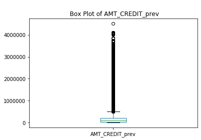


From the above box plot of ```AMT_CREDIT_prev``` , there are a lot of outliers.   
Calculating Quantiles confirms the same. There is a huge jump from 95 percetile to max value.   
Hence, **Median:80595.00** is the best value to impute the missing values.  

#### PRODUCT_COMBINATION Imputation


```python
print('Data type of PRODUCT_COMBINATION : ',merged_data['PRODUCT_COMBINATION'].dtype,'\n\n')
print('Category\tNormalized Count\n\n',merged_data['PRODUCT_COMBINATION'].value_counts(normalize=True))
data = merged_data['PRODUCT_COMBINATION'].value_counts(normalize=True)
plt.bar(data.index,data.values)
# data.hist()
plt.xticks(rotation=90)
plt.ylabel('Normalized Value Counts')
plt.title('\nPRODUCT_COMBINATION');
```

    Data type of PRODUCT_COMBINATION :  object 
    
    
    Category	Normalized Count
    
     Cash                             0.17
    POS household with interest      0.16
    POS mobile with interest         0.14
    Cash X-Sell: middle              0.08
    Cash X-Sell: low                 0.08
    Card Street                      0.07
    POS industry with interest       0.06
    POS household without interest   0.05
    Card X-Sell                      0.05
    Cash Street: high                0.04
    Cash X-Sell: high                0.04
    Cash Street: middle              0.02
    Cash Street: low                 0.02
    POS other with interest          0.01
    POS mobile without interest      0.01
    POS industry without interest    0.01
    POS others without interest      0.00
    Name: PRODUCT_COMBINATION, dtype: float64


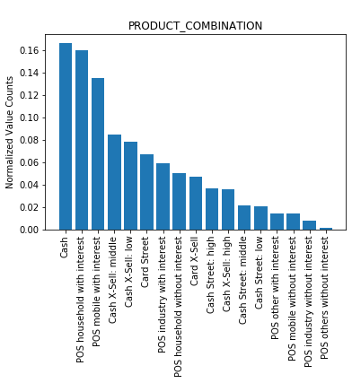


```PRODUCT_COMBINATION``` is a categorical variable.   
The best metric to impute missing values is Mode of the data.   
From the above plot, 'Cash' is the Mode  

Hence, **Cash** is the best value to impute the missing values.

#### NAME_CLIENT_TYPE Imputation


```python
#NAME_CLIENT_TYPE
print('Data type of NAME_CLIENT_TYPE : ',merged_data['NAME_CLIENT_TYPE'].dtype,'\n\n')
print('Category\tNormalized Count\n\n',merged_data['NAME_CLIENT_TYPE'].value_counts(normalize=True))
data = merged_data['NAME_CLIENT_TYPE'].value_counts(normalize=True)
plt.bar(data.index,data.values)
# data.hist()
plt.xticks(rotation=90)
plt.ylabel('Normalized Value Counts')
plt.title('\nNAME_CLIENT_TYPE');
```

    Data type of NAME_CLIENT_TYPE :  object 
    
    
    Category	Normalized Count
    
     Repeater    0.73
    New         0.18
    Refreshed   0.08
    Name: NAME_CLIENT_TYPE, dtype: float64


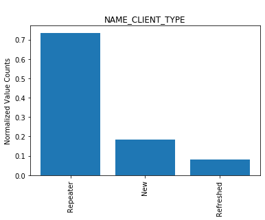


```NAME_CLIENT_TYPE``` is a categorical variable.   
The best metric to impute missing values is Mode of the data.   
From the above plot, 'Repeater' is the Mode  

Hence, **'Repeater'** is the best value to impute the missing values.

#### NAME_CONTRACT_TYPE_prev Imputation 


```python
print('Data type of NAME_CONTRACT_TYPE_prev : ',merged_data['NAME_CONTRACT_TYPE_prev'].dtype,'\n\n')
print('Category\tNormalized Count\n\n',merged_data['NAME_CONTRACT_TYPE_prev'].value_counts(normalize=True))
data = merged_data['NAME_CONTRACT_TYPE_prev'].value_counts(normalize=True)
plt.bar(data.index,data.values)
# data.hist()
plt.xticks(rotation=90)
plt.ylabel('Normalized Value Counts')
plt.title('\nNAME_CONTRACT_TYPE_prev');
```

    Data type of NAME_CONTRACT_TYPE_prev :  object 
    
    
    Category	Normalized Count
    
     Cash loans        0.44
    Consumer loans    0.44
    Revolving loans   0.11
    Name: NAME_CONTRACT_TYPE_prev, dtype: float64


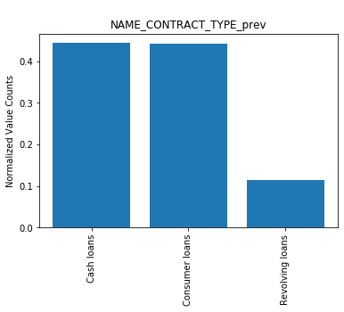


```NAME_CONTRACT_TYPE_prev``` is a categorical variable.   
The best metric to impute missing values is Mode of the data.   
From the above plot, this is a bimodal distribution.It has two modes : 'Cash Loans' and 'Consumer Loans'  
**The best value for imputation needs domain knowledge**

### Merged Data - Splitting Datasets wrt ```NAME_CONTRACT_STATUS```


```python
# unique categories 
merged_data['NAME_CONTRACT_STATUS'].unique()
```


    array(['Approved', 'Canceled', 'Refused', 'Unused offer'], dtype=object)


```python
# splitting into four data frames wrt to NAME_CONTRACT_STATUS

merged_a = merged_data[merged_data['NAME_CONTRACT_STATUS'] == 'Approved']
merged_c = merged_data[merged_data['NAME_CONTRACT_STATUS'] == 'Canceled']
merged_r = merged_data[merged_data['NAME_CONTRACT_STATUS'] == 'Refused']
merged_u = merged_data[merged_data['NAME_CONTRACT_STATUS'] == 'Unused offer']
```

### Merged Data - Data Imbalance 


```python
column_name = 'NAME_CONTRACT_STATUS'
print(tabulate(pd.DataFrame(merged_data.stb.freq([column_name])), headers='keys', tablefmt='psql'))
print(pd.DataFrame(merged_data[column_name]).stb.missing(),'\n')
```

    +----+------------------------+---------+-----------+--------------------+----------------------+
    |    | NAME_CONTRACT_STATUS   |   Count |   Percent |   Cumulative Count |   Cumulative Percent |
    |----+------------------------+---------+-----------+--------------------+----------------------|
    |  0 | Approved               |  886099 | 0.626794  |             886099 |             0.626794 |
    |  1 | Canceled               |  259441 | 0.183519  |            1145540 |             0.810313 |
    |  2 | Refused                |  245390 | 0.17358   |            1390930 |             0.983893 |
    |  3 | Unused offer           |   22771 | 0.0161074 |            1413701 |             1        |
    +----+------------------------+---------+-----------+--------------------+----------------------+
                          Missing    Total  Percent
    NAME_CONTRACT_STATUS        0  1413701     0.00 
    


The above percentages show that not all cases are equally represented and that **there is definite Data Imbalance** 

### Merged Data - Columns Selection for Analysis


```python
merged_col_for_analysis = '''
AMT_ANNUITY_prev
AMT_APPLICATION
AMT_CREDIT_prev
AMT_GOODS_PRICE_prev
CHANNEL_TYPE
CODE_REJECT_REASON
DAYS_DECISION
NAME_CASH_LOAN_PURPOSE
NAME_CLIENT_TYPE
NAME_CONTRACT_TYPE_prev
NAME_GOODS_CATEGORY
NAME_PORTFOLIO
NAME_PRODUCT_TYPE
NAME_YIELD_GROUP
PRODUCT_COMBINATION'''
merged_col_for_analysis = merged_col_for_analysis.splitlines()
```

### Merged Data - Checking for Outliers 

#### Checking for outliers in the following numerical columns 
* AMT_ANNUITY_prev
* AMT_APPLICATION
* AMT_CREDIT_prev
* AMT_GOODS_PRICE_prev
* DAYS_DECISION


```python
# taking absolute values of days decision
merged_data['DAYS_DECISION'] = merged_data['DAYS_DECISION'].abs()
merged_data['DAYS_DECISION'].describe()
```


    count   1,413,701.00
    mean          880.37
    std           783.54
    min             1.00
    25%           271.00
    50%           582.00
    75%         1,313.00
    max         2,922.00
    Name: DAYS_DECISION, dtype: float64


```python
# Box plots of the above numerical variables 
merged_outlier_check_col = [
    'AMT_ANNUITY_prev',
'AMT_APPLICATION',
'AMT_CREDIT_prev',
'AMT_GOODS_PRICE_prev',
'DAYS_DECISION'
]

fig,ax = plt.subplots(3,2)
fig.set_figheight(15)
fig.set_figwidth(15)
ax[0,0].set_yscale('log')
ax[0,1].set_yscale('log')
ax[1,0].set_yscale('log')
ax[1,1].set_yscale('log')

ax[0,0].set(ylabel ='Annuity in Log Scale')
ax[0,1].set(ylabel ='Application Amount in Log Scale')
ax[1,0].set(ylabel ='Credit Amount in Log Scale')
ax[1,1].set(ylabel ='Goods Price in Log Scale')
ax[2,0].set(ylabel ='Processing Days')

merged_data[merged_outlier_check_col[0]].plot.box(ax=ax[0,0],);
merged_data[merged_outlier_check_col[1]].plot.box(ax=ax[0,1]);
merged_data[merged_outlier_check_col[2]].plot.box(ax=ax[1,0]);
merged_data[merged_outlier_check_col[3]].plot.box(ax=ax[1,1]);

merged_data[merged_outlier_check_col[4]].plot.box(ax=ax[2,0]); 
ax[2,1].axis('off')
print('Box Plots of' + ' '.join(merged_outlier_check_col) +'\n')
```

    Box Plots ofAMT_ANNUITY_prev AMT_APPLICATION AMT_CREDIT_prev AMT_GOODS_PRICE_prev DAYS_DECISION
    


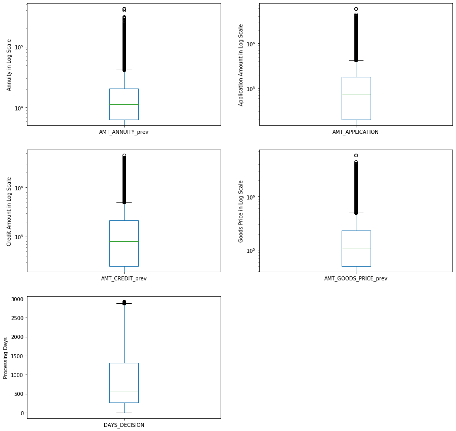


```python
# quantiles for outlier checks
pd.options.display.float_format = '{:,.2f}'.format
for col in merged_outlier_check_col : 
    print(col,'\n',merged_data[col].quantile([0.5,0.8,0.85,0.90,0.95,1]),'\n\n')
```

    AMT_ANNUITY_prev 
     0.50    11,223.76
    0.80    23,390.64
    0.85    27,683.37
    0.90    34,423.11
    0.95    45,205.61
    1.00   418,058.15
    Name: AMT_ANNUITY_prev, dtype: float64 
    
    
    AMT_APPLICATION 
     0.50      70,870.50
    0.80     225,000.00
    0.85     318,978.00
    0.90     450,000.00
    0.95     805,500.00
    1.00   5,850,000.00
    Name: AMT_APPLICATION, dtype: float64 
    
    
    AMT_CREDIT_prev 
     0.50      80,595.00
    0.80     270,000.00
    0.85     382,500.00
    0.90     533,160.00
    0.95     893,398.50
    1.00   4,509,688.50
    Name: AMT_CREDIT_prev, dtype: float64 
    
    
    AMT_GOODS_PRICE_prev 
     0.50     110,245.50
    0.80     315,000.00
    0.85     450,000.00
    0.90     585,000.00
    0.95     900,000.00
    1.00   5,850,000.00
    Name: AMT_GOODS_PRICE_prev, dtype: float64 
    
    
    DAYS_DECISION 
     0.50     582.00
    0.80   1,566.00
    0.85   1,896.00
    0.90   2,257.00
    0.95   2,555.00
    1.00   2,922.00
    Name: DAYS_DECISION, dtype: float64 
    
    


#### Outliers in Numerical Columns 
From the above box plots and quantile calculations, we see that  
```AMT_ANNUITY_prev``` , ```AMT_APPLICATION```, ```AMT_CREDIT_prev```, ```AMT_GOODS_PRICE_prev```,```DAYS_DECISION```
have many outliers. These outliers could be capped by the corresponding 95th percentile values. 

### Merged Data - Binning Continuous Variables


```python
#AMT_CREDIT_prev
min_credit = int(merged_data['AMT_CREDIT_prev'].min())
max_credit = int(merged_data['AMT_CREDIT_prev'].max())

bins = [0,25000,50000,75000,100000,125000,150000,175000,200000,225000,250000,275000,300000,325000,350000,375000,400000,425000,450000,475000,500000,10000000000]
intervals = ['0-25000', '25000-50000','50000-75000','75000-100000','100000-125000', '125000-150000', '150000-175000','175000-200000',
       '200000-225000','225000-250000','250000-275000','275000-300000','300000-325000','325000-350000','350000-375000',
       '375000-400000','400000-425000','425000-450000','450000-475000','475000-500000','500000 and above']

merged_data['AMT_CREDIT_prev_cat']=pd.cut(merged_data['AMT_CREDIT_prev'],bins,labels=intervals)
print('Credit Range [Prev]\t Count')
print(merged_data['AMT_CREDIT_prev_cat'].value_counts())

credit_cat = merged_data['AMT_CREDIT_prev_cat'].value_counts()
plt.hist(credit_cat)
# (merged_data['AMT_CREDIT_prev_cat'].dropna()).plot.hist()

plt.title('\n Previous Credit Amount vs No of Applications')
plt.xticks(rotation=90);
```

    Credit Range [Prev]	 Count
    25000-50000         198605
    500000 and above    153535
    50000-75000         131378
    75000-100000        108912
    100000-125000        82194
    0-25000              77801
    125000-150000        77666
    150000-175000        48738
    175000-200000        42564
    200000-225000        42167
    250000-275000        30652
    425000-450000        24617
    225000-250000        24428
    275000-300000        18649
    300000-325000        13501
    325000-350000        13185
    350000-375000        11851
    475000-500000        10725
    375000-400000         9594
    400000-425000         8654
    450000-475000         7707
    Name: AMT_CREDIT_prev_cat, dtype: int64


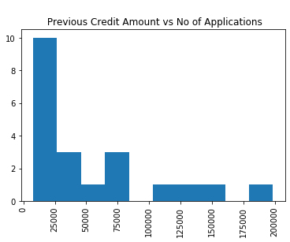


```python
#AMT_APPLICATION
min_app_amt = int(merged_data['AMT_APPLICATION'].min())
max_app_amt = int(merged_data['AMT_APPLICATION'].max())


bins = [0,25000,50000,75000,100000,125000,150000,175000,200000,225000,250000,275000,300000,325000,350000,375000,400000,425000,450000,475000,500000,10000000000]
intervals = ['0-25000', '25000-50000','50000-75000','75000-100000','100000-125000', '125000-150000', '150000-175000','175000-200000',
       '200000-225000','225000-250000','250000-275000','275000-300000','300000-325000','325000-350000','350000-375000',
       '375000-400000','400000-425000','425000-450000','450000-475000','475000-500000','500000 and above']

merged_data['AMT_APPLICATION_cat']=pd.cut(merged_data['AMT_APPLICATION'],bins,labels=intervals)
print('AMT_APPLICATION [Prev]\t Count')
print(merged_data['AMT_APPLICATION_cat'].value_counts())

credit_cat = merged_data['AMT_APPLICATION_cat'].value_counts()
plt.hist(merged_data['AMT_APPLICATION_cat'].dropna())

plt.title('\n Application Amount vs No of Applications')
plt.xticks(rotation=90);
```

    AMT_APPLICATION [Prev]	 Count
    25000-50000         202958
    50000-75000         130287
    500000 and above    123697
    75000-100000        113475
    125000-150000        83960
    100000-125000        78973
    0-25000              65680
    200000-225000        54749
    175000-200000        40177
    150000-175000        36621
    425000-450000        36186
    225000-250000        24346
    250000-275000        23775
    300000-325000        14191
    325000-350000        12260
    350000-375000        11913
    450000-475000        10196
    275000-300000         8354
    400000-425000         7223
    475000-500000         4865
    375000-400000         4513
    Name: AMT_APPLICATION_cat, dtype: int64


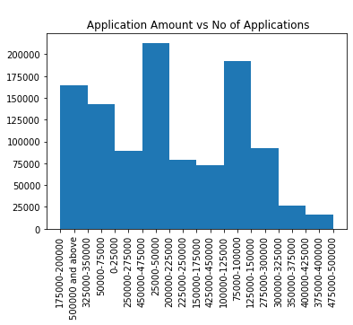


## Merged Data : Analysis

### Merged Data : Univariate Analysis


```python
# function for categorical variable univariate analysis

def merged_cat_univariate_analysis(column_name,figsize=(10,5)) : 
    # print unique values
    print('Approved\n', merged_a[column_name].unique(),'\n')
    print('Canceled\n',merged_c[column_name].unique(),'\n')
    print('Refused\n',merged_r[column_name].unique(),'\n')
    print('Unused offer\n',merged_u[column_name].unique(),'\n')
    
    # column vs target count plot
    plt.figure(figsize=figsize)
    ax = sns.countplot(x=column_name,hue='NAME_CONTRACT_STATUS',data=merged_data)
    title = column_name + ' vs Number of Applications'
    ax.set(title= title)
    for p in ax.patches:
        height = p.get_height()
        ax.text(p.get_x()+p.get_width()/2,
                height + 10,
                format(height),
                ha="center")
    # Percentages 
    print('Approved\n', merged_a[column_name].unique(),'\n')
    print(tabulate(pd.DataFrame(merged_a.stb.freq([column_name])), headers='keys', tablefmt='psql'),'\n')
    print('Canceled\n',merged_c[column_name].unique(),'\n')
    print(tabulate(pd.DataFrame(merged_c.stb.freq([column_name])), headers='keys', tablefmt='psql'),'\n')
    print('Refused\n',merged_r[column_name].unique(),'\n')
    print(tabulate(pd.DataFrame(merged_r.stb.freq([column_name])), headers='keys', tablefmt='psql'),'\n')
    print('Unused offer\n',merged_u[column_name].unique(),'\n')
    print(tabulate(pd.DataFrame(merged_u.stb.freq([column_name])), headers='keys', tablefmt='psql'),'\n')
```


```python
# function for numerical variable univariate analysis

def merged_num_univariate_analysis(column_name,scale='linear') : 
    # boxplot for column vs target
    plt.figure(figsize=(8,6))
    ax = sns.boxplot(x='NAME_CONTRACT_STATUS', y = column_name, data = merged_data)
    title = column_name+' vs NAME_CONTRACT_STATUS'
    ax.set(title=title)
    if scale == 'log' :
        plt.yscale('log')
        ax.set(ylabel=column_name + '(Log Scale)')
    # summary statistic
    print('Approved\n', merged_a[column_name].describe(),'\n')
    print('Canceled\n',merged_c[column_name].describe(),'\n')
    print('Refused\n',merged_r[column_name].describe(),'\n')
    print('Unused offer\n',merged_u[column_name].describe(),'\n')
```


```python
# function to calculate the proportion of applications in a category compared to total applications
def merged_cat_proportions(column_name) : 
    values = merged_data[column_name].unique()
    values=values.dropna()
    values = values.to_numpy()
    values.tolist()
    data_a = merged_a[column_name].value_counts().to_dict()
    data_c = merged_c[column_name].value_counts().to_dict()
    data_r = merged_r[column_name].value_counts().to_dict()
    data_u = merged_u[column_name].value_counts().to_dict()
    data = merged_data[column_name].value_counts().to_dict()

    for i in values : 
        if data_a[i] != np.nan and data_c[i] != np.nan and data_r[i] != np.nan and data_u[i] != np.nan and data[i] != np.nan:
            print('Proportion of '+ str(i) + ' Approved : ', round(data_a[i]*100/data[i],2),'\n')
            print('Proportion of '+ str(i) + ' Cancelled : ', round(data_c[i]*100/data[i],2),'\n')
            print('Proportion of '+ str(i) + ' Refused : ', round(data_r[i]*100/data[i],2),'\n')
            print('Proportion of '+ str(i) + ' Unused Offer : ', round(data_u[i]*100/data[i],2),'\n')
```


```python
#AMT_ANNUITY_prev
merged_num_univariate_analysis('AMT_ANNUITY_prev',scale='log')
```

    Approved
     count   886,092.00
    mean     14,612.96
    std      13,746.23
    min           0.00
    25%       5,874.24
    50%      10,286.39
    75%      18,144.04
    max     393,868.66
    Name: AMT_ANNUITY_prev, dtype: float64 
    
    Canceled
     count     8,760.00
    mean     30,189.94
    std      18,436.44
    min       1,324.31
    25%      16,966.99
    50%      26,424.09
    75%      39,481.53
    max     218,713.55
    Name: AMT_ANNUITY_prev, dtype: float64 
    
    Refused
     count   210,848.00
    mean     20,406.65
    std      17,137.06
    min           0.00
    25%       8,416.93
    50%      15,461.06
    75%      27,716.05
    max     418,058.15
    Name: AMT_ANNUITY_prev, dtype: float64 
    
    Unused offer
     count      783.00
    mean    10,192.88
    std      4,728.62
    min        758.92
    25%      6,331.95
    50%     10,021.32
    75%     14,538.53
    max     35,258.94
    Name: AMT_ANNUITY_prev, dtype: float64 
    


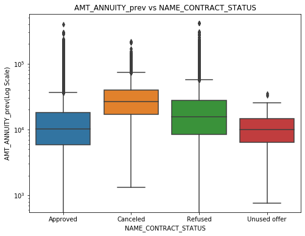


#### Amount Annuity Previous
* Since all the above categories in the plot are having outliers, we will look at the median to make the inferences.
* Median of "Approved" category is 10,286.39. Approved and Unused offer are having similar patterns.


```python
#AMT_APPLICATION
merged_num_univariate_analysis('AMT_APPLICATION',scale='log')
```

    Approved
     count     886,099.00
    mean      179,499.20
    std       254,071.95
    min             0.00
    25%        45,000.00
    50%        90,000.00
    75%       191,306.25
    max     5,850,000.00
    Name: AMT_APPLICATION, dtype: float64 
    
    Canceled
     count     259,441.00
    mean       23,267.79
    std       155,690.92
    min             0.00
    25%             0.00
    50%             0.00
    75%             0.00
    max     3,600,000.00
    Name: AMT_APPLICATION, dtype: float64 
    
    Refused
     count     245,390.00
    mean      330,345.15
    std       433,570.20
    min             0.00
    25%        45,000.00
    50%       157,500.00
    75%       450,000.00
    max     4,455,000.00
    Name: AMT_APPLICATION, dtype: float64 
    
    Unused offer
     count      22,771.00
    mean       69,736.51
    std        65,649.21
    min             0.00
    25%        34,197.75
    50%        57,780.00
    75%        89,955.00
    max     3,511,305.00
    Name: AMT_APPLICATION, dtype: float64 
    


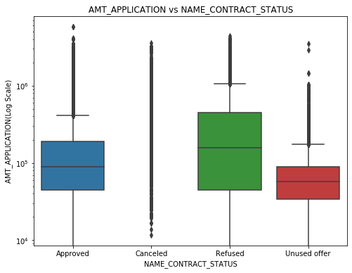


#### Amount In Previous Application
* Since all the above categories in plot have outliers, we will infer using median.
* The median of "Approved" category is 90,000. Anything above that has high risk of refusal.
* Looking at "Canceled" category, all ranges of amounts faced calcellation.
* Most of the "Unused offer" category is below the median value of "Approved category".


```python
# AMT_CREDIT_prev
merged_num_univariate_analysis('AMT_CREDIT_prev',scale='log')
```

    Approved
     count     886,098.00
    mean      201,625.61
    std       275,852.27
    min             0.00
    25%        47,479.50
    50%       101,153.25
    75%       225,000.00
    max     4,509,688.50
    Name: AMT_CREDIT_prev, dtype: float64 
    
    Canceled
     count     259,441.00
    mean       24,784.71
    std       165,068.20
    min             0.00
    25%             0.00
    50%             0.00
    75%             0.00
    max     3,847,104.00
    Name: AMT_CREDIT_prev, dtype: float64 
    
    Refused
     count     245,390.00
    mean      370,460.07
    std       470,121.52
    min             0.00
    25%        59,175.00
    50%       180,000.00
    75%       493,150.50
    max     4,104,351.00
    Name: AMT_CREDIT_prev, dtype: float64 
    
    Unused offer
     count      22,771.00
    mean       69,753.58
    std        65,663.89
    min             0.00
    25%        34,219.80
    50%        57,780.00
    75%        89,955.00
    max     3,511,305.00
    Name: AMT_CREDIT_prev, dtype: float64 
    


#### Final Credit Amount
* Since all the above categories in plot have outliers, we will infer using median.
* The median of "Approved" category is  101,153.25. Anything above that has high risk of refusal.
* Amount below 101,153.25 are more likely to get approved.
* Looking at "Canceled" category, all ranges of amounts faced calcellation.
* Most of the "Unused offer" category is below the median value of "Approved category".


```python
#AMT_GOODS_PRICE_prev
merged_num_univariate_analysis('AMT_GOODS_PRICE_prev',scale='log')
```

    Approved
     count     848,577.00
    mean      187,436.21
    std       256,747.40
    min             0.00
    25%        46,170.00
    50%        95,208.48
    75%       202,500.00
    max     5,850,000.00
    Name: AMT_GOODS_PRICE_prev, dtype: float64 
    
    Canceled
     count       8,964.00
    mean      673,429.16
    std       513,562.76
    min             0.00
    25%       270,000.00
    50%       454,500.00
    75%       900,000.00
    max     3,600,000.00
    Name: AMT_GOODS_PRICE_prev, dtype: float64 
    
    Refused
     count     213,868.00
    mean      379,200.31
    std       444,129.93
    min             0.00
    25%        90,000.00
    50%       225,000.00
    75%       454,500.00
    max     4,455,000.00
    Name: AMT_GOODS_PRICE_prev, dtype: float64 
    
    Unused offer
     count      22,767.00
    mean       69,748.76
    std        65,648.46
    min             0.00
    25%        34,231.39
    50%        57,780.00
    75%        89,955.00
    max     3,511,305.00
    Name: AMT_GOODS_PRICE_prev, dtype: float64 
    


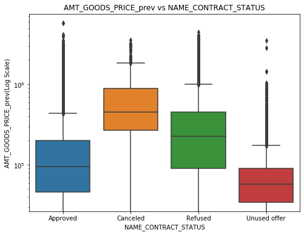


#### Goods Price
* since all the categories have outliers, we will consider median to infer.
* Median of "Approved" Category is 95,208.48. Any amount above this have high risk of getting refused or being calcelled.


```python
#CHANNEL_TYPE
merged_cat_univariate_analysis('CHANNEL_TYPE',figsize=(20,6))
plt.xticks(rotation=90)
```

    Approved
     ['Stone' 'Credit and cash offices' 'Country-wide' 'Regional / Local'
     'AP+ (Cash loan)' 'Contact center' 'Channel of corporate sales'
     'Car dealer'] 
    
    Canceled
     ['Credit and cash offices' 'AP+ (Cash loan)' 'Contact center'
     'Country-wide' 'Channel of corporate sales' 'Regional / Local' 'Stone'
     'Car dealer'] 
    
    Refused
     ['Credit and cash offices' 'AP+ (Cash loan)' 'Stone' 'Country-wide'
     'Contact center' 'Channel of corporate sales' 'Regional / Local'
     'Car dealer'] 
    
    Unused offer
     ['Stone' 'Country-wide' 'Regional / Local' 'Credit and cash offices'
     'AP+ (Cash loan)'] 
    
    Approved
     ['Stone' 'Credit and cash offices' 'Country-wide' 'Regional / Local'
     'AP+ (Cash loan)' 'Contact center' 'Channel of corporate sales'
     'Car dealer'] 
    
    +----+----------------------------+---------+-------------+--------------------+----------------------+
    |    | CHANNEL_TYPE               |   Count |     Percent |   Cumulative Count |   Cumulative Percent |
    |----+----------------------------+---------+-------------+--------------------+----------------------|
    |  0 | Country-wide               |  344456 | 0.388733    |             344456 |             0.388733 |
    |  1 | Credit and cash offices    |  244475 | 0.2759      |             588931 |             0.664633 |
    |  2 | Stone                      |  163654 | 0.18469     |             752585 |             0.849324 |
    |  3 | Regional / Local           |   82265 | 0.0928395   |             834850 |             0.942163 |
    |  4 | AP+ (Cash loan)            |   27062 | 0.0305406   |             861912 |             0.972704 |
    |  5 | Contact center             |   21604 | 0.024381    |             883516 |             0.997085 |
    |  6 | Channel of corporate sales |    2319 | 0.00261709  |             885835 |             0.999702 |
    |  7 | Car dealer                 |     264 | 0.000297935 |             886099 |             1        |
    +----+----------------------------+---------+-------------+--------------------+----------------------+ 
    
    Canceled
     ['Credit and cash offices' 'AP+ (Cash loan)' 'Contact center'
     'Country-wide' 'Channel of corporate sales' 'Regional / Local' 'Stone'
     'Car dealer'] 
    
    +----+----------------------------+---------+-------------+--------------------+----------------------+
    |    | CHANNEL_TYPE               |   Count |     Percent |   Cumulative Count |   Cumulative Percent |
    |----+----------------------------+---------+-------------+--------------------+----------------------|
    |  0 | Credit and cash offices    |  229905 | 0.886155    |             229905 |             0.886155 |
    |  1 | Contact center             |   24459 | 0.0942758   |             254364 |             0.980431 |
    |  2 | AP+ (Cash loan)            |    3227 | 0.0124383   |             257591 |             0.992869 |
    |  3 | Country-wide               |    1555 | 0.00599366  |             259146 |             0.998863 |
    |  4 | Channel of corporate sales |     119 | 0.000458678 |             259265 |             0.999322 |
    |  5 | Regional / Local           |      85 | 0.000327627 |             259350 |             0.999649 |
    |  6 | Stone                      |      58 | 0.000223558 |             259408 |             0.999873 |
    |  7 | Car dealer                 |      33 | 0.000127197 |             259441 |             1        |
    +----+----------------------------+---------+-------------+--------------------+----------------------+ 
    
    Refused
     ['Credit and cash offices' 'AP+ (Cash loan)' 'Stone' 'Country-wide'
     'Contact center' 'Channel of corporate sales' 'Regional / Local'
     'Car dealer'] 
    
    +----+----------------------------+---------+-------------+--------------------+----------------------+
    |    | CHANNEL_TYPE               |   Count |     Percent |   Cumulative Count |   Cumulative Percent |
    |----+----------------------------+---------+-------------+--------------------+----------------------|
    |  0 | Credit and cash offices    |  125535 | 0.511573    |             125535 |             0.511573 |
    |  1 | Country-wide               |   56101 | 0.22862     |             181636 |             0.740193 |
    |  2 | AP+ (Cash loan)            |   19330 | 0.0787726   |             200966 |             0.818966 |
    |  3 | Stone                      |   18996 | 0.0774115   |             219962 |             0.896377 |
    |  4 | Contact center             |   12828 | 0.052276    |             232790 |             0.948653 |
    |  5 | Regional / Local           |    9533 | 0.0388484   |             242323 |             0.987502 |
    |  6 | Channel of corporate sales |    2958 | 0.0120543   |             245281 |             0.999556 |
    |  7 | Car dealer                 |     109 | 0.000444191 |             245390 |             1        |
    +----+----------------------------+---------+-------------+--------------------+----------------------+ 
    
    Unused offer
     ['Stone' 'Country-wide' 'Regional / Local' 'Credit and cash offices'
     'AP+ (Cash loan)'] 
    
    +----+-------------------------+---------+-------------+--------------------+----------------------+
    |    | CHANNEL_TYPE            |   Count |     Percent |   Cumulative Count |   Cumulative Percent |
    |----+-------------------------+---------+-------------+--------------------+----------------------|
    |  0 | Country-wide            |   20950 | 0.92003     |              20950 |             0.92003  |
    |  1 | Stone                   |     800 | 0.0351324   |              21750 |             0.955162 |
    |  2 | Regional / Local        |     589 | 0.0258662   |              22339 |             0.981029 |
    |  3 | Credit and cash offices |     427 | 0.0187519   |              22766 |             0.99978  |
    |  4 | AP+ (Cash loan)         |       5 | 0.000219578 |              22771 |             1        |
    +----+-------------------------+---------+-------------+--------------------+----------------------+ 
    


    (array([0, 1, 2, 3, 4, 5, 6, 7]), <a list of 8 Text xticklabel objects>)


    posx and posy should be finite values
    posx and posy should be finite values
    posx and posy should be finite values
    posx and posy should be finite values
    posx and posy should be finite values
    posx and posy should be finite values


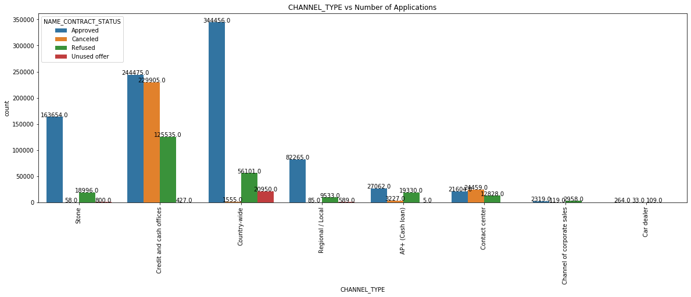


#### Channel Type
* Credit and cash offices are playing a vital role in pipe-lining the loan applications. 
* Country_wide has highest rate of Loan Approvals.
* 75% of Loans are getting approved in (Country_wide + Credit and cash offices + Stone).


```python
#DAYS_DECISION
merged_num_univariate_analysis('DAYS_DECISION')
```

    Approved
     count   886,099.00
    mean      1,098.43
    std         793.39
    min           1.00
    25%         454.00
    50%         856.00
    75%       1,643.00
    max       2,922.00
    Name: DAYS_DECISION, dtype: float64 
    
    Canceled
     count   259,441.00
    mean        221.51
    std         135.74
    min           2.00
    25%         128.00
    50%         217.00
    75%         305.00
    max       2,842.00
    Name: DAYS_DECISION, dtype: float64 
    
    Refused
     count   245,390.00
    mean        789.08
    std         755.78
    min           2.00
    25%         248.00
    50%         462.00
    75%       1,102.00
    max       2,922.00
    Name: DAYS_DECISION, dtype: float64 
    
    Unused offer
     count   22,771.00
    mean       885.12
    std        607.17
    min          4.00
    25%        362.00
    50%        769.00
    75%      1,348.00
    max      2,516.00
    Name: DAYS_DECISION, dtype: float64 
    


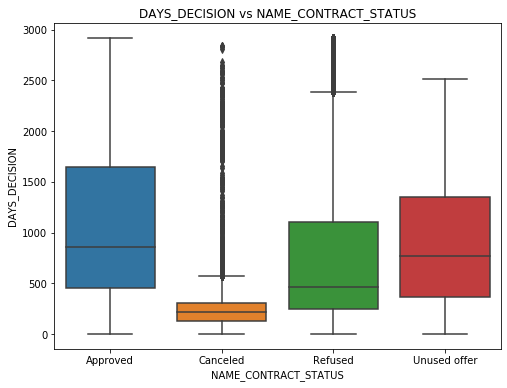


#### Days From Previous Application Decision Relative To Current Application
* Since "Approved" category doesnt have outliers, we will use mean to infer.
* Mean of "Approved" category is 1,098.43. Any applicant with number of days below 1,098.43 is less likely to get Approved.


```python
#NAME_CLIENT_TYPE
merged_cat_univariate_analysis('NAME_CLIENT_TYPE')
```

    Approved
     ['New' 'Repeater' 'Refreshed' nan] 
    
    Canceled
     ['Repeater' nan 'Refreshed' 'New'] 
    
    Refused
     ['Repeater' 'Refreshed' nan 'New'] 
    
    Unused offer
     ['Repeater' 'Refreshed' 'New' nan] 
    
    Approved
     ['New' 'Repeater' 'Refreshed' nan] 
    
    +----+--------------------+---------+-----------+--------------------+----------------------+
    |    | NAME_CLIENT_TYPE   |   Count |   Percent |   Cumulative Count |   Cumulative Percent |
    |----+--------------------+---------+-----------+--------------------+----------------------|
    |  0 | Repeater           |  560378 | 0.632721  |             560378 |             0.632721 |
    |  1 | New                |  242395 | 0.273687  |             802773 |             0.906408 |
    |  2 | Refreshed          |   82891 | 0.0935919 |             885664 |             1        |
    +----+--------------------+---------+-----------+--------------------+----------------------+ 
    
    Canceled
     ['Repeater' nan 'Refreshed' 'New'] 
    
    +----+--------------------+---------+-----------+--------------------+----------------------+
    |    | NAME_CLIENT_TYPE   |   Count |   Percent |   Cumulative Count |   Cumulative Percent |
    |----+--------------------+---------+-----------+--------------------+----------------------|
    |  0 | Repeater           |  239618 | 0.926447  |             239618 |             0.926447 |
    |  1 | Refreshed          |   16104 | 0.0622637 |             255722 |             0.98871  |
    |  2 | New                |    2920 | 0.0112897 |             258642 |             1        |
    +----+--------------------+---------+-----------+--------------------+----------------------+ 
    
    Refused
     ['Repeater' 'Refreshed' nan 'New'] 
    
    +----+--------------------+---------+-----------+--------------------+----------------------+
    |    | NAME_CLIENT_TYPE   |   Count |   Percent |   Cumulative Count |   Cumulative Percent |
    |----+--------------------+---------+-----------+--------------------+----------------------|
    |  0 | Repeater           |  220215 | 0.898433  |             220215 |             0.898433 |
    |  1 | Refreshed          |   12537 | 0.0511485 |             232752 |             0.949582 |
    |  2 | New                |   12358 | 0.0504182 |             245110 |             1        |
    +----+--------------------+---------+-----------+--------------------+----------------------+ 
    
    Unused offer
     ['Repeater' 'Refreshed' 'New' nan] 
    
    +----+--------------------+---------+-----------+--------------------+----------------------+
    |    | NAME_CLIENT_TYPE   |   Count |   Percent |   Cumulative Count |   Cumulative Percent |
    |----+--------------------+---------+-----------+--------------------+----------------------|
    |  0 | Repeater           |   17471 | 0.768226  |              17471 |             0.768226 |
    |  1 | Refreshed          |    3404 | 0.149679  |              20875 |             0.917905 |
    |  2 | New                |    1867 | 0.0820948 |              22742 |             1        |
    +----+--------------------+---------+-----------+--------------------+----------------------+ 
    


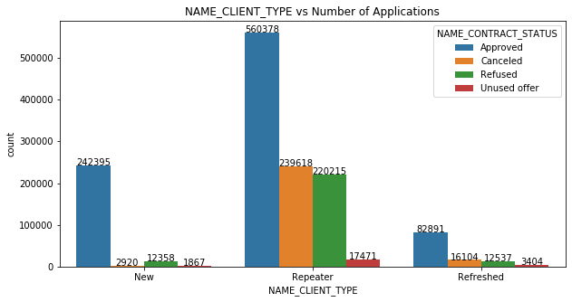


#### Client Type (New/Refreshed/Repeater)
* From the above plot, most of the applications belong to "Repeater" Category.
* 54% of Applications from "Repeater" category are approved.
* 93% of Applications from "New" category are approved.
* 72% of Applications from "Refreshed" category are approved.

**Overall, applications from "New" category are more likely to get approved.**


```python
#NAME_CONTRACT_TYPE_prev
merged_cat_univariate_analysis('NAME_CONTRACT_TYPE_prev')
```

    Approved
     ['Consumer loans' 'Cash loans' 'Revolving loans'] 
    
    Canceled
     ['Revolving loans' 'Cash loans' 'Consumer loans' nan] 
    
    Refused
     ['Cash loans' 'Consumer loans' 'Revolving loans' nan] 
    
    Unused offer
     ['Consumer loans' 'Cash loans' 'Revolving loans'] 
    
    Approved
     ['Consumer loans' 'Cash loans' 'Revolving loans'] 
    
    +----+---------------------------+---------+-----------+--------------------+----------------------+
    |    | NAME_CONTRACT_TYPE_prev   |   Count |   Percent |   Cumulative Count |   Cumulative Percent |
    |----+---------------------------+---------+-----------+--------------------+----------------------|
    |  0 | Consumer loans            |  537310 | 0.606377  |             537310 |             0.606377 |
    |  1 | Cash loans                |  266381 | 0.300622  |             803691 |             0.906999 |
    |  2 | Revolving loans           |   82408 | 0.0930009 |             886099 |             1        |
    +----+---------------------------+---------+-----------+--------------------+----------------------+ 
    
    Canceled
     ['Revolving loans' 'Cash loans' 'Consumer loans' nan] 
    
    +----+---------------------------+---------+------------+--------------------+----------------------+
    |    | NAME_CONTRACT_TYPE_prev   |   Count |    Percent |   Cumulative Count |   Cumulative Percent |
    |----+---------------------------+---------+------------+--------------------+----------------------|
    |  0 | Cash loans                |  220383 | 0.850384   |             220383 |             0.850384 |
    |  1 | Revolving loans           |   37445 | 0.144488   |             257828 |             0.994872 |
    |  2 | Consumer loans            |    1329 | 0.00512817 |             259157 |             1        |
    +----+---------------------------+---------+------------+--------------------+----------------------+ 
    
    Refused
     ['Cash loans' 'Consumer loans' 'Revolving loans' nan] 
    
    +----+---------------------------+---------+-----------+--------------------+----------------------+
    |    | NAME_CONTRACT_TYPE_prev   |   Count |   Percent |   Cumulative Count |   Cumulative Percent |
    |----+---------------------------+---------+-----------+--------------------+----------------------|
    |  0 | Cash loans                |  139568 |  0.568827 |             139568 |             0.568827 |
    |  1 | Consumer loans            |   64282 |  0.261989 |             203850 |             0.830817 |
    |  2 | Revolving loans           |   41511 |  0.169183 |             245361 |             1        |
    +----+---------------------------+---------+-----------+--------------------+----------------------+ 
    
    Unused offer
     ['Consumer loans' 'Cash loans' 'Revolving loans'] 
    
    +----+---------------------------+---------+-------------+--------------------+----------------------+
    |    | NAME_CONTRACT_TYPE_prev   |   Count |     Percent |   Cumulative Count |   Cumulative Percent |
    |----+---------------------------+---------+-------------+--------------------+----------------------|
    |  0 | Consumer loans            |   22335 | 0.980853    |              22335 |             0.980853 |
    |  1 | Cash loans                |     432 | 0.0189715   |              22767 |             0.999824 |
    |  2 | Revolving loans           |       4 | 0.000175662 |              22771 |             1        |
    +----+---------------------------+---------+-------------+--------------------+----------------------+ 
    


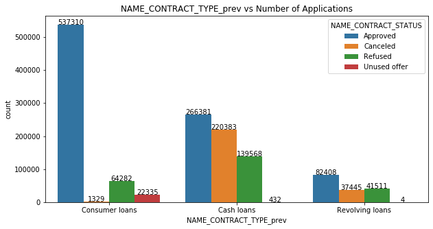


#### Previous Contract Type
* Majority of Contract Type if "Cash loans".
* 86% of Consumer loans are more likely to get Approved.
* 42% of Cash loans are more likely to get Approved.
* 51% of Revolving loans are more likely to get Approved.

** Approval rate is very high in Consumer loans**


```python
#NAME_PORTFOLIO
merged_cat_univariate_analysis('NAME_PORTFOLIO')
```

    Approved
     ['POS' 'Cash' 'Cards' 'Cars' nan] 
    
    Canceled
     [nan 'Cash' 'Cards' 'POS' 'Cars'] 
    
    Refused
     ['Cash' nan 'POS' 'Cards' 'Cars'] 
    
    Unused offer
     [nan 'POS' 'Cards'] 
    


    posx and posy should be finite values
    posx and posy should be finite values


    Approved
     ['POS' 'Cash' 'Cards' 'Cars' nan] 
    
    +----+------------------+---------+------------+--------------------+----------------------+
    |    | NAME_PORTFOLIO   |   Count |    Percent |   Cumulative Count |   Cumulative Percent |
    |----+------------------+---------+------------+--------------------+----------------------|
    |  0 | POS              |  537069 | 0.606107   |             537069 |             0.606107 |
    |  1 | Cash             |  266378 | 0.30062    |             803447 |             0.906727 |
    |  2 | Cards            |   82408 | 0.0930012  |             885855 |             0.999728 |
    |  3 | Cars             |     241 | 0.00027198 |             886096 |             1        |
    +----+------------------+---------+------------+--------------------+----------------------+ 
    
    Canceled
     [nan 'Cash' 'Cards' 'POS' 'Cars'] 
    
    +----+------------------+---------+------------+--------------------+----------------------+
    |    | NAME_PORTFOLIO   |   Count |    Percent |   Cumulative Count |   Cumulative Percent |
    |----+------------------+---------+------------+--------------------+----------------------|
    |  0 | Cash             |    8183 | 0.934132   |               8183 |             0.934132 |
    |  1 | Cards            |     417 | 0.0476027  |               8600 |             0.981735 |
    |  2 | POS              |     127 | 0.0144977  |               8727 |             0.996233 |
    |  3 | Cars             |      33 | 0.00376712 |               8760 |             1        |
    +----+------------------+---------+------------+--------------------+----------------------+ 
    
    Refused
     ['Cash' nan 'POS' 'Cards' 'Cars'] 
    
    +----+------------------+---------+-------------+--------------------+----------------------+
    |    | NAME_PORTFOLIO   |   Count |     Percent |   Cumulative Count |   Cumulative Percent |
    |----+------------------+---------+-------------+--------------------+----------------------|
    |  0 | Cash             |  117102 | 0.555383    |             117102 |             0.555383 |
    |  1 | POS              |   54482 | 0.258393    |             171584 |             0.813777 |
    |  2 | Cards            |   39159 | 0.185721    |             210743 |             0.999497 |
    |  3 | Cars             |     106 | 0.000502729 |             210849 |             1        |
    +----+------------------+---------+-------------+--------------------+----------------------+ 
    
    Unused offer
     [nan 'POS' 'Cards'] 
    
    +----+------------------+---------+------------+--------------------+----------------------+
    |    | NAME_PORTFOLIO   |   Count |    Percent |   Cumulative Count |   Cumulative Percent |
    |----+------------------+---------+------------+--------------------+----------------------|
    |  0 | POS              |     782 | 0.998723   |                782 |             0.998723 |
    |  1 | Cards            |       1 | 0.00127714 |                783 |             1        |
    +----+------------------+---------+------------+--------------------+----------------------+ 
    


    posx and posy should be finite values
    posx and posy should be finite values


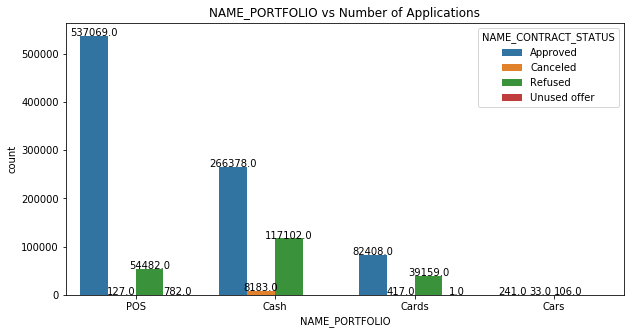


#### Name Portfolio
* Majority of the loans come under "POS" category.
* Percentage of loans approved in each category POS>CASH>CARDS>CARS -- 91%>68%>67%>63%.


```python
#NAME_YIELD_GROUP
merged_cat_univariate_analysis('NAME_YIELD_GROUP')
```

    Approved
     ['low_normal' 'middle' 'high' nan 'low_action'] 
    
    Canceled
     [nan 'low_normal' 'middle' 'high' 'low_action'] 
    
    Refused
     ['low_normal' nan 'high' 'low_action' 'middle'] 
    
    Unused offer
     [nan 'low_normal' 'middle' 'high'] 
    


    posx and posy should be finite values


    Approved
     ['low_normal' 'middle' 'high' nan 'low_action'] 
    
    +----+--------------------+---------+-----------+--------------------+----------------------+
    |    | NAME_YIELD_GROUP   |   Count |   Percent |   Cumulative Count |   Cumulative Percent |
    |----+--------------------+---------+-----------+--------------------+----------------------|
    |  0 | middle             |  273331 | 0.340096  |             273331 |             0.340096 |
    |  1 | high               |  258996 | 0.322259  |             532327 |             0.662355 |
    |  2 | low_normal         |  210731 | 0.262205  |             743058 |             0.92456  |
    |  3 | low_action         |   60630 | 0.0754397 |             803688 |             1        |
    +----+--------------------+---------+-----------+--------------------+----------------------+ 
    
    Canceled
     [nan 'low_normal' 'middle' 'high' 'low_action'] 
    
    +----+--------------------+---------+-----------+--------------------+----------------------+
    |    | NAME_YIELD_GROUP   |   Count |   Percent |   Cumulative Count |   Cumulative Percent |
    |----+--------------------+---------+-----------+--------------------+----------------------|
    |  0 | low_normal         |    4087 | 0.489872  |               4087 |             0.489872 |
    |  1 | middle             |    2629 | 0.315114  |               6716 |             0.804986 |
    |  2 | low_action         |     821 | 0.0984058 |               7537 |             0.903392 |
    |  3 | high               |     806 | 0.0966079 |               8343 |             1        |
    +----+--------------------+---------+-----------+--------------------+----------------------+ 
    
    Refused
     ['low_normal' nan 'high' 'low_action' 'middle'] 
    
    +----+--------------------+---------+-----------+--------------------+----------------------+
    |    | NAME_YIELD_GROUP   |   Count |   Percent |   Cumulative Count |   Cumulative Percent |
    |----+--------------------+---------+-----------+--------------------+----------------------|
    |  0 | low_normal         |   59510 | 0.346613  |              59510 |             0.346613 |
    |  1 | middle             |   48847 | 0.284507  |             108357 |             0.63112  |
    |  2 | high               |   46197 | 0.269072  |             154554 |             0.900192 |
    |  3 | low_action         |   17136 | 0.0998078 |             171690 |             1        |
    +----+--------------------+---------+-----------+--------------------+----------------------+ 
    
    Unused offer
     [nan 'low_normal' 'middle' 'high'] 
    
    +----+--------------------+---------+-----------+--------------------+----------------------+
    |    | NAME_YIELD_GROUP   |   Count |   Percent |   Cumulative Count |   Cumulative Percent |
    |----+--------------------+---------+-----------+--------------------+----------------------|
    |  0 | low_normal         |     556 | 0.710997  |                556 |             0.710997 |
    |  1 | middle             |     164 | 0.209719  |                720 |             0.920716 |
    |  2 | high               |      62 | 0.0792839 |                782 |             1        |
    +----+--------------------+---------+-----------+--------------------+----------------------+ 
    


    posx and posy should be finite values


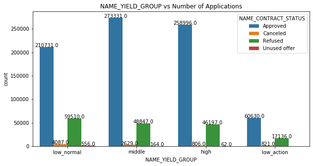


#### Grouped Interest Rate
* Major applicants come under "middle" Catrgory.
* Approval percentage of "low_normal" and "low_action" is similar (77%).
* Loarge number of loans are approved in "middle" category (85%).

## Bivariate Analysis


```python
merged_data.columns
```


    Index(['AMT_ANNUITY_curr', 'AMT_INCOME_TOTAL', 'AMT_CREDIT_curr',
           'AMT_GOODS_PRICE_curr', 'NAME_CONTRACT_TYPE_curr', 'CODE_GENDER',
           'NAME_INCOME_TYPE', 'DAYS_EMPLOYED', 'NAME_EDUCATION_TYPE',
           'SK_ID_CURR', 'AGE_YEARS', 'AMT_INCOME_CAT', 'AMT_CREDIT_RANGE',
           'AMT_ANNUITY_prev', 'AMT_APPLICATION', 'AMT_CREDIT_prev',
           'AMT_GOODS_PRICE_prev', 'CHANNEL_TYPE', 'DAYS_DECISION',
           'NAME_CLIENT_TYPE', 'NAME_CONTRACT_STATUS', 'NAME_CONTRACT_TYPE_prev',
           'NAME_PORTFOLIO', 'NAME_YIELD_GROUP', 'PRODUCT_COMBINATION',
           'SK_ID_PREV', 'AMT_CREDIT_prev_cat', 'AMT_APPLICATION_cat'],
          dtype='object')


```python
# AMT_ANNUITY_prev vs AMT_INCOME_CAT vs NAME_CONTRACT_STATUS
plt.figure(figsize=[20,12])
plt.title('Annuity Amount vs Income Category vs Loan Application Results')
sns.barplot(x='AMT_ANNUITY_prev', y = 'AMT_INCOME_CAT', hue='NAME_CONTRACT_STATUS', data=merged_data)

```


    <matplotlib.axes._subplots.AxesSubplot at 0x7f96d6b8bb50>


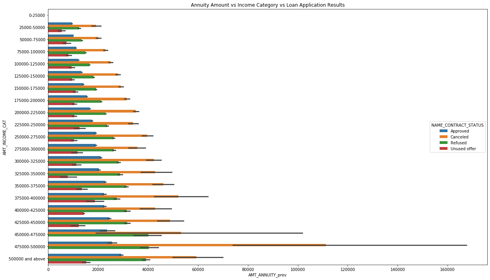


#### Amount of Annuity & Income Category
* Loans with higher annuity are approved for clients with higher income. 
* Loan refusals follow the opposite trend
* 450000 - 475000 has higher rate of cancellations compared to the adjacent income ranges. 

**Further analysis of income range 450000 - 475000 might bring the bank high income low risk loans (with possible high annuities)**  


```python
# AMT_CREDIT_prev - AMT_APPLICATION vs NAME_YIELD_GROUP vs NAME_CONTRACT_STATUS

merged_data['AMT_DIFF'] = merged_data['AMT_CREDIT_prev'] - merged_data['AMT_APPLICATION']
plt.figure(figsize=[8,8])
plt.title('Difference between Approved Loan and Applied Loan vs Interest Rate Category vs Loan Application Results')
sns.barplot(y='NAME_YIELD_GROUP', x = 'AMT_DIFF', hue='NAME_CONTRACT_STATUS', data=merged_data)
```


    <matplotlib.axes._subplots.AxesSubplot at 0x7f961e049810>


#### Difference between Approved Loan and Applied Loan & Interest Rate Category
* It can be seen that a huge proportion of low interest category loans are being refused by the bank
* And only high interest rate loans are unused by the clients. 
* Among all interest categories, only 'low_normal' has higher refusals compared to client cancellations. 


```python
# DAYS_DECISION vs NAME_CONTRACT_TYPE vs NAME_CONTRACT_STATUS
plt.figure(figsize=[8,8])
plt.title('Processing Time vs Client Type vs Loan Application Results')
sns.barplot(y='NAME_CONTRACT_TYPE_prev', x = 'DAYS_DECISION', hue='NAME_CONTRACT_STATUS', data=merged_data)
```


    <matplotlib.axes._subplots.AxesSubplot at 0x7f95f29d0a50>


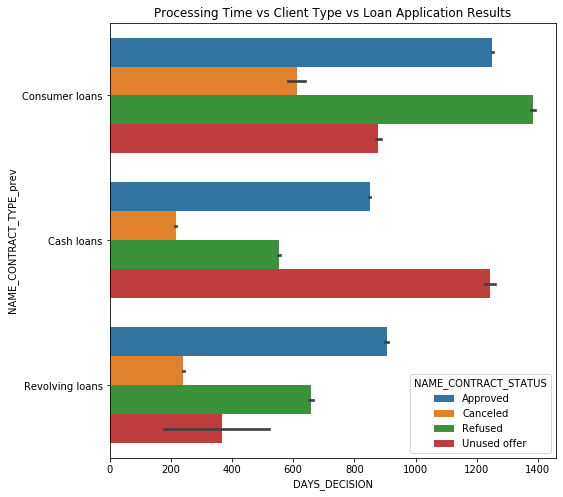


#### Processing Time & Loan Type 
* Consumer Loans have the longest decision period followed by cash loans followed by Revolving Loans , which makes business sense. 
* A huge proportion of consumer loans are being cancelled by the client because of relatively high processing time. 
* Cash loans that take longer to process are more unused than other loans. 

**The bank should expedite the process of approving cash loans and Consumer Loans** 


```python
# NAME_PORTFOLIO vs NAME_YIELD_GROUP vs NAME_CONTRACT_STATUS
#merged_data.groupby(['NAME_PORTFOLIO','NAME_YIELD_GROUP'])['NAME_CONTRACT_STATUS'].value_counts(normalize=True).plot.bar()
merged_data.groupby(['NAME_PORTFOLIO','NAME_YIELD_GROUP'])['NAME_CONTRACT_STATUS'].value_counts(normalize=True)\
.unstack()\
   .plot( 
    layout=(2,2),
    figsize=(8,6), kind='barh', stacked=True);

```


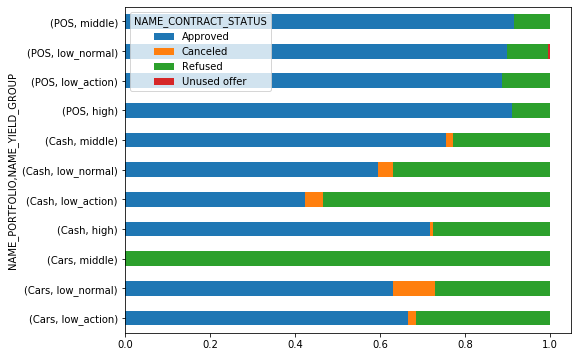


#### Portfolio & Interest Rate 
* From the above plot, we can see that POS loans are approved irrespective of interest rate. That is POS loans are popular among clients irrespective of interest rate. 
* Car loans at medium interest rate are mostly refused by the bank
* Highest cancellation rates are found in car loans offered at low interest rates. 

This could be further correlated with the difference in approved amount and applied amount to gather useful insights


```python
#AMT_CREDIT_prev & DAYS_EMPLOYED vs NAME_CONTRACT_STATUS

plt.figure(figsize=[10,8])
plt.xticks(rotation=45)
sns.barplot(y='DAYS_EMPLOYED', x = 'NAME_EDUCATION_TYPE', hue='NAME_CONTRACT_STATUS', data=merged_data)

plt.yscale('log')
```


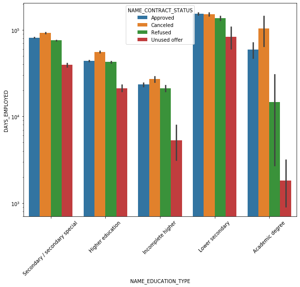


#### Education & Days Employed
* There are very low unused offers among clients with an Academic degree and recent employment 


```python
merged_data.columns
```


    Index(['AMT_ANNUITY_curr', 'AMT_INCOME_TOTAL', 'AMT_CREDIT_curr',
           'AMT_GOODS_PRICE_curr', 'NAME_CONTRACT_TYPE_curr', 'CODE_GENDER',
           'NAME_INCOME_TYPE', 'DAYS_EMPLOYED', 'NAME_EDUCATION_TYPE',
           'SK_ID_CURR', 'AGE_YEARS', 'AMT_INCOME_CAT', 'AMT_CREDIT_RANGE',
           'AMT_ANNUITY_prev', 'AMT_APPLICATION', 'AMT_CREDIT_prev',
           'AMT_GOODS_PRICE_prev', 'CHANNEL_TYPE', 'DAYS_DECISION',
           'NAME_CLIENT_TYPE', 'NAME_CONTRACT_STATUS', 'NAME_CONTRACT_TYPE_prev',
           'NAME_PORTFOLIO', 'NAME_YIELD_GROUP', 'PRODUCT_COMBINATION',
           'SK_ID_PREV', 'AMT_CREDIT_prev_cat', 'AMT_APPLICATION_cat', 'AMT_DIFF'],
          dtype='object')


```python
#### NAME_EDUCATION_TYPE vs NAME_CLIENT_TYPE vs NAME_CONTRACT_STATUS
merged_data.groupby(['NAME_EDUCATION_TYPE','NAME_CLIENT_TYPE'])['NAME_CONTRACT_STATUS'].value_counts(normalize=True)\
.unstack()\
   .plot( 
    layout=(2,2),
    figsize=(8,6), kind='barh', stacked=True);
```


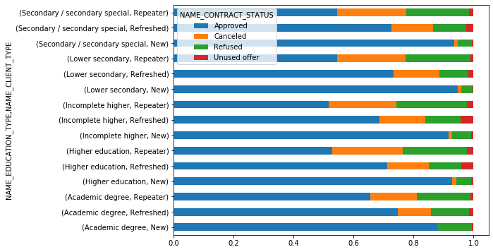


#### Education & Client Type 
* New customers with Lower Secondary education are the most approved borrowers and they almost always take the loan offer. 
* New customers with Academic degree come a close second in approval rate. 
* Among repeat customers, Academic Degree holding customers have the highest approval rate.
* 'Refreshed' customers have a uniform approval rate across all education types. 
* Refereshed customers with Incomplete higher education have the maximum unused offers
* Repeat customers have a uniform cancellation rate that's higher than New and Refreshed customers

**Bank should look into the reasons why Repeat customers who are cancelling their offers. It could also focus on loans catered to academic degree holders who are first time customers** 


```python
#CODE_GENDER vs CHANNEL_TYPE vs NAME_CONTRACT_STATUS

merged_data.groupby(['NAME_INCOME_TYPE','CODE_GENDER'])['NAME_CONTRACT_STATUS'].value_counts(normalize=True)\
.unstack()\
   .plot( 
    layout=(2,2),
    figsize=(8,6), kind='barh', stacked=True);
```


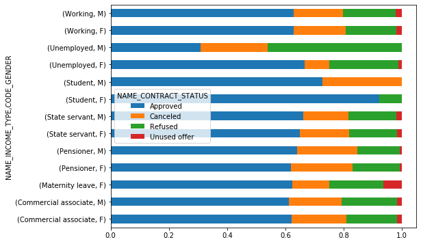


#### Gender & Channel Type 
* There is a mark difference in loan approval rates of Male and Female students. 
* Also, unemployed Females have a much lower rejection rate than Unemployed males. 

## Correlation Analysis 


```python
def correlation(dataframe) : 
    cor0=dataframe.corr()
    type(cor0)
    cor0.where(np.triu(np.ones(cor0.shape),k=1).astype(np.bool))
    cor0=cor0.unstack().reset_index()
    cor0.columns=['VAR1','VAR2','CORR']
    cor0.dropna(subset=['CORR'], inplace=True)
    cor0.CORR=round(cor0['CORR'],2)
    cor0.CORR=cor0.CORR.abs()
    cor0.sort_values(by=['CORR'],ascending=False)
    cor0=cor0[~(cor0['VAR1']==cor0['VAR2'])]
    return pd.DataFrame(cor0.sort_values(by=['CORR'],ascending=False))
```

#### Correlation for 'Approved' Loans 


```python
# Correlation for Approved
# Absolute values are reported 
pd.set_option('precision', 2)
cor_0 = correlation(merged_a)
cor_0.style.background_gradient(cmap='GnBu').hide_index()
```


<style  type="text/css" >
    #T_e5b6d9ca_b4b4_11ea_85ee_88e9fe4e6667row0_col2 {
            background-color:  #084081;
            color:  #f1f1f1;
        }    #T_e5b6d9ca_b4b4_11ea_85ee_88e9fe4e6667row1_col2 {
            background-color:  #084081;
            color:  #f1f1f1;
        }    #T_e5b6d9ca_b4b4_11ea_85ee_88e9fe4e6667row2_col2 {
            background-color:  #084384;
            color:  #f1f1f1;
        }    #T_e5b6d9ca_b4b4_11ea_85ee_88e9fe4e6667row3_col2 {
            background-color:  #084384;
            color:  #f1f1f1;
        }    #T_e5b6d9ca_b4b4_11ea_85ee_88e9fe4e6667row4_col2 {
            background-color:  #084384;
            color:  #f1f1f1;
        }    #T_e5b6d9ca_b4b4_11ea_85ee_88e9fe4e6667row5_col2 {
            background-color:  #084384;
            color:  #f1f1f1;
        }    #T_e5b6d9ca_b4b4_11ea_85ee_88e9fe4e6667row6_col2 {
            background-color:  #084d8e;
            color:  #f1f1f1;
        }    #T_e5b6d9ca_b4b4_11ea_85ee_88e9fe4e6667row7_col2 {
            background-color:  #084d8e;
            color:  #f1f1f1;
        }    #T_e5b6d9ca_b4b4_11ea_85ee_88e9fe4e6667row8_col2 {
            background-color:  #1475b2;
            color:  #f1f1f1;
        }    #T_e5b6d9ca_b4b4_11ea_85ee_88e9fe4e6667row9_col2 {
            background-color:  #1475b2;
            color:  #f1f1f1;
        }    #T_e5b6d9ca_b4b4_11ea_85ee_88e9fe4e6667row10_col2 {
            background-color:  #1475b2;
            color:  #f1f1f1;
        }    #T_e5b6d9ca_b4b4_11ea_85ee_88e9fe4e6667row11_col2 {
            background-color:  #1475b2;
            color:  #f1f1f1;
        }    #T_e5b6d9ca_b4b4_11ea_85ee_88e9fe4e6667row12_col2 {
            background-color:  #1a7ab5;
            color:  #000000;
        }    #T_e5b6d9ca_b4b4_11ea_85ee_88e9fe4e6667row13_col2 {
            background-color:  #1a7ab5;
            color:  #000000;
        }    #T_e5b6d9ca_b4b4_11ea_85ee_88e9fe4e6667row14_col2 {
            background-color:  #2586bb;
            color:  #000000;
        }    #T_e5b6d9ca_b4b4_11ea_85ee_88e9fe4e6667row15_col2 {
            background-color:  #2586bb;
            color:  #000000;
        }    #T_e5b6d9ca_b4b4_11ea_85ee_88e9fe4e6667row16_col2 {
            background-color:  #2889bc;
            color:  #000000;
        }    #T_e5b6d9ca_b4b4_11ea_85ee_88e9fe4e6667row17_col2 {
            background-color:  #2889bc;
            color:  #000000;
        }    #T_e5b6d9ca_b4b4_11ea_85ee_88e9fe4e6667row18_col2 {
            background-color:  #4aafd1;
            color:  #000000;
        }    #T_e5b6d9ca_b4b4_11ea_85ee_88e9fe4e6667row19_col2 {
            background-color:  #4aafd1;
            color:  #000000;
        }    #T_e5b6d9ca_b4b4_11ea_85ee_88e9fe4e6667row20_col2 {
            background-color:  #c6e9c2;
            color:  #000000;
        }    #T_e5b6d9ca_b4b4_11ea_85ee_88e9fe4e6667row21_col2 {
            background-color:  #c6e9c2;
            color:  #000000;
        }    #T_e5b6d9ca_b4b4_11ea_85ee_88e9fe4e6667row22_col2 {
            background-color:  #c6e9c2;
            color:  #000000;
        }    #T_e5b6d9ca_b4b4_11ea_85ee_88e9fe4e6667row23_col2 {
            background-color:  #c6e9c2;
            color:  #000000;
        }    #T_e5b6d9ca_b4b4_11ea_85ee_88e9fe4e6667row24_col2 {
            background-color:  #c9eac4;
            color:  #000000;
        }    #T_e5b6d9ca_b4b4_11ea_85ee_88e9fe4e6667row25_col2 {
            background-color:  #c9eac4;
            color:  #000000;
        }    #T_e5b6d9ca_b4b4_11ea_85ee_88e9fe4e6667row26_col2 {
            background-color:  #c9eac4;
            color:  #000000;
        }    #T_e5b6d9ca_b4b4_11ea_85ee_88e9fe4e6667row27_col2 {
            background-color:  #c9eac4;
            color:  #000000;
        }    #T_e5b6d9ca_b4b4_11ea_85ee_88e9fe4e6667row28_col2 {
            background-color:  #d4eece;
            color:  #000000;
        }    #T_e5b6d9ca_b4b4_11ea_85ee_88e9fe4e6667row29_col2 {
            background-color:  #d4eece;
            color:  #000000;
        }    #T_e5b6d9ca_b4b4_11ea_85ee_88e9fe4e6667row30_col2 {
            background-color:  #d4eece;
            color:  #000000;
        }    #T_e5b6d9ca_b4b4_11ea_85ee_88e9fe4e6667row31_col2 {
            background-color:  #d4eece;
            color:  #000000;
        }    #T_e5b6d9ca_b4b4_11ea_85ee_88e9fe4e6667row32_col2 {
            background-color:  #dbf1d5;
            color:  #000000;
        }    #T_e5b6d9ca_b4b4_11ea_85ee_88e9fe4e6667row33_col2 {
            background-color:  #dbf1d5;
            color:  #000000;
        }    #T_e5b6d9ca_b4b4_11ea_85ee_88e9fe4e6667row34_col2 {
            background-color:  #dbf1d5;
            color:  #000000;
        }    #T_e5b6d9ca_b4b4_11ea_85ee_88e9fe4e6667row35_col2 {
            background-color:  #dbf1d5;
            color:  #000000;
        }    #T_e5b6d9ca_b4b4_11ea_85ee_88e9fe4e6667row36_col2 {
            background-color:  #dcf1d7;
            color:  #000000;
        }    #T_e5b6d9ca_b4b4_11ea_85ee_88e9fe4e6667row37_col2 {
            background-color:  #dcf1d7;
            color:  #000000;
        }    #T_e5b6d9ca_b4b4_11ea_85ee_88e9fe4e6667row38_col2 {
            background-color:  #dcf1d7;
            color:  #000000;
        }    #T_e5b6d9ca_b4b4_11ea_85ee_88e9fe4e6667row39_col2 {
            background-color:  #dcf1d7;
            color:  #000000;
        }    #T_e5b6d9ca_b4b4_11ea_85ee_88e9fe4e6667row40_col2 {
            background-color:  #dff3da;
            color:  #000000;
        }    #T_e5b6d9ca_b4b4_11ea_85ee_88e9fe4e6667row41_col2 {
            background-color:  #dff3da;
            color:  #000000;
        }    #T_e5b6d9ca_b4b4_11ea_85ee_88e9fe4e6667row42_col2 {
            background-color:  #dff3da;
            color:  #000000;
        }    #T_e5b6d9ca_b4b4_11ea_85ee_88e9fe4e6667row43_col2 {
            background-color:  #dff3da;
            color:  #000000;
        }    #T_e5b6d9ca_b4b4_11ea_85ee_88e9fe4e6667row44_col2 {
            background-color:  #dff3da;
            color:  #000000;
        }    #T_e5b6d9ca_b4b4_11ea_85ee_88e9fe4e6667row45_col2 {
            background-color:  #dff3da;
            color:  #000000;
        }    #T_e5b6d9ca_b4b4_11ea_85ee_88e9fe4e6667row46_col2 {
            background-color:  #dff3da;
            color:  #000000;
        }    #T_e5b6d9ca_b4b4_11ea_85ee_88e9fe4e6667row47_col2 {
            background-color:  #dff3da;
            color:  #000000;
        }    #T_e5b6d9ca_b4b4_11ea_85ee_88e9fe4e6667row48_col2 {
            background-color:  #dff3da;
            color:  #000000;
        }    #T_e5b6d9ca_b4b4_11ea_85ee_88e9fe4e6667row49_col2 {
            background-color:  #dff3da;
            color:  #000000;
        }    #T_e5b6d9ca_b4b4_11ea_85ee_88e9fe4e6667row50_col2 {
            background-color:  #e1f4dc;
            color:  #000000;
        }    #T_e5b6d9ca_b4b4_11ea_85ee_88e9fe4e6667row51_col2 {
            background-color:  #e1f4dc;
            color:  #000000;
        }    #T_e5b6d9ca_b4b4_11ea_85ee_88e9fe4e6667row52_col2 {
            background-color:  #e1f4dc;
            color:  #000000;
        }    #T_e5b6d9ca_b4b4_11ea_85ee_88e9fe4e6667row53_col2 {
            background-color:  #e1f4dc;
            color:  #000000;
        }    #T_e5b6d9ca_b4b4_11ea_85ee_88e9fe4e6667row54_col2 {
            background-color:  #e1f4dc;
            color:  #000000;
        }    #T_e5b6d9ca_b4b4_11ea_85ee_88e9fe4e6667row55_col2 {
            background-color:  #e1f4dc;
            color:  #000000;
        }    #T_e5b6d9ca_b4b4_11ea_85ee_88e9fe4e6667row56_col2 {
            background-color:  #e1f4dc;
            color:  #000000;
        }    #T_e5b6d9ca_b4b4_11ea_85ee_88e9fe4e6667row57_col2 {
            background-color:  #e1f4dc;
            color:  #000000;
        }    #T_e5b6d9ca_b4b4_11ea_85ee_88e9fe4e6667row58_col2 {
            background-color:  #e1f4dc;
            color:  #000000;
        }    #T_e5b6d9ca_b4b4_11ea_85ee_88e9fe4e6667row59_col2 {
            background-color:  #e1f4dc;
            color:  #000000;
        }    #T_e5b6d9ca_b4b4_11ea_85ee_88e9fe4e6667row60_col2 {
            background-color:  #e1f4dc;
            color:  #000000;
        }    #T_e5b6d9ca_b4b4_11ea_85ee_88e9fe4e6667row61_col2 {
            background-color:  #e1f4dc;
            color:  #000000;
        }    #T_e5b6d9ca_b4b4_11ea_85ee_88e9fe4e6667row62_col2 {
            background-color:  #e1f4dc;
            color:  #000000;
        }    #T_e5b6d9ca_b4b4_11ea_85ee_88e9fe4e6667row63_col2 {
            background-color:  #e1f4dc;
            color:  #000000;
        }    #T_e5b6d9ca_b4b4_11ea_85ee_88e9fe4e6667row64_col2 {
            background-color:  #e3f4de;
            color:  #000000;
        }    #T_e5b6d9ca_b4b4_11ea_85ee_88e9fe4e6667row65_col2 {
            background-color:  #e3f4de;
            color:  #000000;
        }    #T_e5b6d9ca_b4b4_11ea_85ee_88e9fe4e6667row66_col2 {
            background-color:  #e3f4de;
            color:  #000000;
        }    #T_e5b6d9ca_b4b4_11ea_85ee_88e9fe4e6667row67_col2 {
            background-color:  #e3f4de;
            color:  #000000;
        }    #T_e5b6d9ca_b4b4_11ea_85ee_88e9fe4e6667row68_col2 {
            background-color:  #e6f6e1;
            color:  #000000;
        }    #T_e5b6d9ca_b4b4_11ea_85ee_88e9fe4e6667row69_col2 {
            background-color:  #e6f6e1;
            color:  #000000;
        }    #T_e5b6d9ca_b4b4_11ea_85ee_88e9fe4e6667row70_col2 {
            background-color:  #e9f6e3;
            color:  #000000;
        }    #T_e5b6d9ca_b4b4_11ea_85ee_88e9fe4e6667row71_col2 {
            background-color:  #e9f6e3;
            color:  #000000;
        }    #T_e5b6d9ca_b4b4_11ea_85ee_88e9fe4e6667row72_col2 {
            background-color:  #e9f6e3;
            color:  #000000;
        }    #T_e5b6d9ca_b4b4_11ea_85ee_88e9fe4e6667row73_col2 {
            background-color:  #e9f6e3;
            color:  #000000;
        }    #T_e5b6d9ca_b4b4_11ea_85ee_88e9fe4e6667row74_col2 {
            background-color:  #e9f6e3;
            color:  #000000;
        }    #T_e5b6d9ca_b4b4_11ea_85ee_88e9fe4e6667row75_col2 {
            background-color:  #e9f6e3;
            color:  #000000;
        }    #T_e5b6d9ca_b4b4_11ea_85ee_88e9fe4e6667row76_col2 {
            background-color:  #ebf7e5;
            color:  #000000;
        }    #T_e5b6d9ca_b4b4_11ea_85ee_88e9fe4e6667row77_col2 {
            background-color:  #ebf7e5;
            color:  #000000;
        }    #T_e5b6d9ca_b4b4_11ea_85ee_88e9fe4e6667row78_col2 {
            background-color:  #ebf7e5;
            color:  #000000;
        }    #T_e5b6d9ca_b4b4_11ea_85ee_88e9fe4e6667row79_col2 {
            background-color:  #ebf7e5;
            color:  #000000;
        }    #T_e5b6d9ca_b4b4_11ea_85ee_88e9fe4e6667row80_col2 {
            background-color:  #ebf7e5;
            color:  #000000;
        }    #T_e5b6d9ca_b4b4_11ea_85ee_88e9fe4e6667row81_col2 {
            background-color:  #ebf7e5;
            color:  #000000;
        }    #T_e5b6d9ca_b4b4_11ea_85ee_88e9fe4e6667row82_col2 {
            background-color:  #ecf8e6;
            color:  #000000;
        }    #T_e5b6d9ca_b4b4_11ea_85ee_88e9fe4e6667row83_col2 {
            background-color:  #ecf8e6;
            color:  #000000;
        }    #T_e5b6d9ca_b4b4_11ea_85ee_88e9fe4e6667row84_col2 {
            background-color:  #ecf8e6;
            color:  #000000;
        }    #T_e5b6d9ca_b4b4_11ea_85ee_88e9fe4e6667row85_col2 {
            background-color:  #ecf8e6;
            color:  #000000;
        }    #T_e5b6d9ca_b4b4_11ea_85ee_88e9fe4e6667row86_col2 {
            background-color:  #ecf8e6;
            color:  #000000;
        }    #T_e5b6d9ca_b4b4_11ea_85ee_88e9fe4e6667row87_col2 {
            background-color:  #ecf8e6;
            color:  #000000;
        }    #T_e5b6d9ca_b4b4_11ea_85ee_88e9fe4e6667row88_col2 {
            background-color:  #f0f9e9;
            color:  #000000;
        }    #T_e5b6d9ca_b4b4_11ea_85ee_88e9fe4e6667row89_col2 {
            background-color:  #f0f9e9;
            color:  #000000;
        }    #T_e5b6d9ca_b4b4_11ea_85ee_88e9fe4e6667row90_col2 {
            background-color:  #f0f9e9;
            color:  #000000;
        }    #T_e5b6d9ca_b4b4_11ea_85ee_88e9fe4e6667row91_col2 {
            background-color:  #f0f9e9;
            color:  #000000;
        }    #T_e5b6d9ca_b4b4_11ea_85ee_88e9fe4e6667row92_col2 {
            background-color:  #f0f9e9;
            color:  #000000;
        }    #T_e5b6d9ca_b4b4_11ea_85ee_88e9fe4e6667row93_col2 {
            background-color:  #f0f9e9;
            color:  #000000;
        }    #T_e5b6d9ca_b4b4_11ea_85ee_88e9fe4e6667row94_col2 {
            background-color:  #f0f9e9;
            color:  #000000;
        }    #T_e5b6d9ca_b4b4_11ea_85ee_88e9fe4e6667row95_col2 {
            background-color:  #f0f9e9;
            color:  #000000;
        }    #T_e5b6d9ca_b4b4_11ea_85ee_88e9fe4e6667row96_col2 {
            background-color:  #f2faeb;
            color:  #000000;
        }    #T_e5b6d9ca_b4b4_11ea_85ee_88e9fe4e6667row97_col2 {
            background-color:  #f2faeb;
            color:  #000000;
        }    #T_e5b6d9ca_b4b4_11ea_85ee_88e9fe4e6667row98_col2 {
            background-color:  #f2faeb;
            color:  #000000;
        }    #T_e5b6d9ca_b4b4_11ea_85ee_88e9fe4e6667row99_col2 {
            background-color:  #f2faeb;
            color:  #000000;
        }    #T_e5b6d9ca_b4b4_11ea_85ee_88e9fe4e6667row100_col2 {
            background-color:  #f2faeb;
            color:  #000000;
        }    #T_e5b6d9ca_b4b4_11ea_85ee_88e9fe4e6667row101_col2 {
            background-color:  #f2faeb;
            color:  #000000;
        }    #T_e5b6d9ca_b4b4_11ea_85ee_88e9fe4e6667row102_col2 {
            background-color:  #f2faeb;
            color:  #000000;
        }    #T_e5b6d9ca_b4b4_11ea_85ee_88e9fe4e6667row103_col2 {
            background-color:  #f2faeb;
            color:  #000000;
        }    #T_e5b6d9ca_b4b4_11ea_85ee_88e9fe4e6667row104_col2 {
            background-color:  #f6fbef;
            color:  #000000;
        }    #T_e5b6d9ca_b4b4_11ea_85ee_88e9fe4e6667row105_col2 {
            background-color:  #f6fbef;
            color:  #000000;
        }    #T_e5b6d9ca_b4b4_11ea_85ee_88e9fe4e6667row106_col2 {
            background-color:  #f6fbef;
            color:  #000000;
        }    #T_e5b6d9ca_b4b4_11ea_85ee_88e9fe4e6667row107_col2 {
            background-color:  #f6fbef;
            color:  #000000;
        }    #T_e5b6d9ca_b4b4_11ea_85ee_88e9fe4e6667row108_col2 {
            background-color:  #f6fbef;
            color:  #000000;
        }    #T_e5b6d9ca_b4b4_11ea_85ee_88e9fe4e6667row109_col2 {
            background-color:  #f6fbef;
            color:  #000000;
        }    #T_e5b6d9ca_b4b4_11ea_85ee_88e9fe4e6667row110_col2 {
            background-color:  #f7fcf0;
            color:  #000000;
        }    #T_e5b6d9ca_b4b4_11ea_85ee_88e9fe4e6667row111_col2 {
            background-color:  #f7fcf0;
            color:  #000000;
        }    #T_e5b6d9ca_b4b4_11ea_85ee_88e9fe4e6667row112_col2 {
            background-color:  #f7fcf0;
            color:  #000000;
        }    #T_e5b6d9ca_b4b4_11ea_85ee_88e9fe4e6667row113_col2 {
            background-color:  #f7fcf0;
            color:  #000000;
        }    #T_e5b6d9ca_b4b4_11ea_85ee_88e9fe4e6667row114_col2 {
            background-color:  #f7fcf0;
            color:  #000000;
        }    #T_e5b6d9ca_b4b4_11ea_85ee_88e9fe4e6667row115_col2 {
            background-color:  #f7fcf0;
            color:  #000000;
        }    #T_e5b6d9ca_b4b4_11ea_85ee_88e9fe4e6667row116_col2 {
            background-color:  #f7fcf0;
            color:  #000000;
        }    #T_e5b6d9ca_b4b4_11ea_85ee_88e9fe4e6667row117_col2 {
            background-color:  #f7fcf0;
            color:  #000000;
        }    #T_e5b6d9ca_b4b4_11ea_85ee_88e9fe4e6667row118_col2 {
            background-color:  #f7fcf0;
            color:  #000000;
        }    #T_e5b6d9ca_b4b4_11ea_85ee_88e9fe4e6667row119_col2 {
            background-color:  #f7fcf0;
            color:  #000000;
        }    #T_e5b6d9ca_b4b4_11ea_85ee_88e9fe4e6667row120_col2 {
            background-color:  #f7fcf0;
            color:  #000000;
        }    #T_e5b6d9ca_b4b4_11ea_85ee_88e9fe4e6667row121_col2 {
            background-color:  #f7fcf0;
            color:  #000000;
        }    #T_e5b6d9ca_b4b4_11ea_85ee_88e9fe4e6667row122_col2 {
            background-color:  #f7fcf0;
            color:  #000000;
        }    #T_e5b6d9ca_b4b4_11ea_85ee_88e9fe4e6667row123_col2 {
            background-color:  #f7fcf0;
            color:  #000000;
        }    #T_e5b6d9ca_b4b4_11ea_85ee_88e9fe4e6667row124_col2 {
            background-color:  #f7fcf0;
            color:  #000000;
        }    #T_e5b6d9ca_b4b4_11ea_85ee_88e9fe4e6667row125_col2 {
            background-color:  #f7fcf0;
            color:  #000000;
        }    #T_e5b6d9ca_b4b4_11ea_85ee_88e9fe4e6667row126_col2 {
            background-color:  #f7fcf0;
            color:  #000000;
        }    #T_e5b6d9ca_b4b4_11ea_85ee_88e9fe4e6667row127_col2 {
            background-color:  #f7fcf0;
            color:  #000000;
        }    #T_e5b6d9ca_b4b4_11ea_85ee_88e9fe4e6667row128_col2 {
            background-color:  #f7fcf0;
            color:  #000000;
        }    #T_e5b6d9ca_b4b4_11ea_85ee_88e9fe4e6667row129_col2 {
            background-color:  #f7fcf0;
            color:  #000000;
        }    #T_e5b6d9ca_b4b4_11ea_85ee_88e9fe4e6667row130_col2 {
            background-color:  #f7fcf0;
            color:  #000000;
        }    #T_e5b6d9ca_b4b4_11ea_85ee_88e9fe4e6667row131_col2 {
            background-color:  #f7fcf0;
            color:  #000000;
        }    #T_e5b6d9ca_b4b4_11ea_85ee_88e9fe4e6667row132_col2 {
            background-color:  #f7fcf0;
            color:  #000000;
        }    #T_e5b6d9ca_b4b4_11ea_85ee_88e9fe4e6667row133_col2 {
            background-color:  #f7fcf0;
            color:  #000000;
        }    #T_e5b6d9ca_b4b4_11ea_85ee_88e9fe4e6667row134_col2 {
            background-color:  #f7fcf0;
            color:  #000000;
        }    #T_e5b6d9ca_b4b4_11ea_85ee_88e9fe4e6667row135_col2 {
            background-color:  #f7fcf0;
            color:  #000000;
        }    #T_e5b6d9ca_b4b4_11ea_85ee_88e9fe4e6667row136_col2 {
            background-color:  #f7fcf0;
            color:  #000000;
        }    #T_e5b6d9ca_b4b4_11ea_85ee_88e9fe4e6667row137_col2 {
            background-color:  #f7fcf0;
            color:  #000000;
        }    #T_e5b6d9ca_b4b4_11ea_85ee_88e9fe4e6667row138_col2 {
            background-color:  #f7fcf0;
            color:  #000000;
        }    #T_e5b6d9ca_b4b4_11ea_85ee_88e9fe4e6667row139_col2 {
            background-color:  #f7fcf0;
            color:  #000000;
        }    #T_e5b6d9ca_b4b4_11ea_85ee_88e9fe4e6667row140_col2 {
            background-color:  #f7fcf0;
            color:  #000000;
        }    #T_e5b6d9ca_b4b4_11ea_85ee_88e9fe4e6667row141_col2 {
            background-color:  #f7fcf0;
            color:  #000000;
        }    #T_e5b6d9ca_b4b4_11ea_85ee_88e9fe4e6667row142_col2 {
            background-color:  #f7fcf0;
            color:  #000000;
        }    #T_e5b6d9ca_b4b4_11ea_85ee_88e9fe4e6667row143_col2 {
            background-color:  #f7fcf0;
            color:  #000000;
        }    #T_e5b6d9ca_b4b4_11ea_85ee_88e9fe4e6667row144_col2 {
            background-color:  #f7fcf0;
            color:  #000000;
        }    #T_e5b6d9ca_b4b4_11ea_85ee_88e9fe4e6667row145_col2 {
            background-color:  #f7fcf0;
            color:  #000000;
        }    #T_e5b6d9ca_b4b4_11ea_85ee_88e9fe4e6667row146_col2 {
            background-color:  #f7fcf0;
            color:  #000000;
        }    #T_e5b6d9ca_b4b4_11ea_85ee_88e9fe4e6667row147_col2 {
            background-color:  #f7fcf0;
            color:  #000000;
        }    #T_e5b6d9ca_b4b4_11ea_85ee_88e9fe4e6667row148_col2 {
            background-color:  #f7fcf0;
            color:  #000000;
        }    #T_e5b6d9ca_b4b4_11ea_85ee_88e9fe4e6667row149_col2 {
            background-color:  #f7fcf0;
            color:  #000000;
        }    #T_e5b6d9ca_b4b4_11ea_85ee_88e9fe4e6667row150_col2 {
            background-color:  #f7fcf0;
            color:  #000000;
        }    #T_e5b6d9ca_b4b4_11ea_85ee_88e9fe4e6667row151_col2 {
            background-color:  #f7fcf0;
            color:  #000000;
        }    #T_e5b6d9ca_b4b4_11ea_85ee_88e9fe4e6667row152_col2 {
            background-color:  #f7fcf0;
            color:  #000000;
        }    #T_e5b6d9ca_b4b4_11ea_85ee_88e9fe4e6667row153_col2 {
            background-color:  #f7fcf0;
            color:  #000000;
        }    #T_e5b6d9ca_b4b4_11ea_85ee_88e9fe4e6667row154_col2 {
            background-color:  #f7fcf0;
            color:  #000000;
        }    #T_e5b6d9ca_b4b4_11ea_85ee_88e9fe4e6667row155_col2 {
            background-color:  #f7fcf0;
            color:  #000000;
        }</style><table id="T_e5b6d9ca_b4b4_11ea_85ee_88e9fe4e6667" ><thead>    <tr>        <th class="col_heading level0 col0" >VAR1</th>        <th class="col_heading level0 col1" >VAR2</th>        <th class="col_heading level0 col2" >CORR</th>    </tr></thead><tbody>
                <tr>
                                <td id="T_e5b6d9ca_b4b4_11ea_85ee_88e9fe4e6667row0_col0" class="data row0 col0" >AMT_APPLICATION</td>
                        <td id="T_e5b6d9ca_b4b4_11ea_85ee_88e9fe4e6667row0_col1" class="data row0 col1" >AMT_GOODS_PRICE_prev</td>
                        <td id="T_e5b6d9ca_b4b4_11ea_85ee_88e9fe4e6667row0_col2" class="data row0 col2" >1.00</td>
            </tr>
            <tr>
                                <td id="T_e5b6d9ca_b4b4_11ea_85ee_88e9fe4e6667row1_col0" class="data row1 col0" >AMT_GOODS_PRICE_prev</td>
                        <td id="T_e5b6d9ca_b4b4_11ea_85ee_88e9fe4e6667row1_col1" class="data row1 col1" >AMT_APPLICATION</td>
                        <td id="T_e5b6d9ca_b4b4_11ea_85ee_88e9fe4e6667row1_col2" class="data row1 col2" >1.00</td>
            </tr>
            <tr>
                                <td id="T_e5b6d9ca_b4b4_11ea_85ee_88e9fe4e6667row2_col0" class="data row2 col0" >AMT_CREDIT_curr</td>
                        <td id="T_e5b6d9ca_b4b4_11ea_85ee_88e9fe4e6667row2_col1" class="data row2 col1" >AMT_GOODS_PRICE_curr</td>
                        <td id="T_e5b6d9ca_b4b4_11ea_85ee_88e9fe4e6667row2_col2" class="data row2 col2" >0.99</td>
            </tr>
            <tr>
                                <td id="T_e5b6d9ca_b4b4_11ea_85ee_88e9fe4e6667row3_col0" class="data row3 col0" >AMT_CREDIT_prev</td>
                        <td id="T_e5b6d9ca_b4b4_11ea_85ee_88e9fe4e6667row3_col1" class="data row3 col1" >AMT_GOODS_PRICE_prev</td>
                        <td id="T_e5b6d9ca_b4b4_11ea_85ee_88e9fe4e6667row3_col2" class="data row3 col2" >0.99</td>
            </tr>
            <tr>
                                <td id="T_e5b6d9ca_b4b4_11ea_85ee_88e9fe4e6667row4_col0" class="data row4 col0" >AMT_GOODS_PRICE_curr</td>
                        <td id="T_e5b6d9ca_b4b4_11ea_85ee_88e9fe4e6667row4_col1" class="data row4 col1" >AMT_CREDIT_curr</td>
                        <td id="T_e5b6d9ca_b4b4_11ea_85ee_88e9fe4e6667row4_col2" class="data row4 col2" >0.99</td>
            </tr>
            <tr>
                                <td id="T_e5b6d9ca_b4b4_11ea_85ee_88e9fe4e6667row5_col0" class="data row5 col0" >AMT_GOODS_PRICE_prev</td>
                        <td id="T_e5b6d9ca_b4b4_11ea_85ee_88e9fe4e6667row5_col1" class="data row5 col1" >AMT_CREDIT_prev</td>
                        <td id="T_e5b6d9ca_b4b4_11ea_85ee_88e9fe4e6667row5_col2" class="data row5 col2" >0.99</td>
            </tr>
            <tr>
                                <td id="T_e5b6d9ca_b4b4_11ea_85ee_88e9fe4e6667row6_col0" class="data row6 col0" >AMT_APPLICATION</td>
                        <td id="T_e5b6d9ca_b4b4_11ea_85ee_88e9fe4e6667row6_col1" class="data row6 col1" >AMT_CREDIT_prev</td>
                        <td id="T_e5b6d9ca_b4b4_11ea_85ee_88e9fe4e6667row6_col2" class="data row6 col2" >0.96</td>
            </tr>
            <tr>
                                <td id="T_e5b6d9ca_b4b4_11ea_85ee_88e9fe4e6667row7_col0" class="data row7 col0" >AMT_CREDIT_prev</td>
                        <td id="T_e5b6d9ca_b4b4_11ea_85ee_88e9fe4e6667row7_col1" class="data row7 col1" >AMT_APPLICATION</td>
                        <td id="T_e5b6d9ca_b4b4_11ea_85ee_88e9fe4e6667row7_col2" class="data row7 col2" >0.96</td>
            </tr>
            <tr>
                                <td id="T_e5b6d9ca_b4b4_11ea_85ee_88e9fe4e6667row8_col0" class="data row8 col0" >AMT_ANNUITY_prev</td>
                        <td id="T_e5b6d9ca_b4b4_11ea_85ee_88e9fe4e6667row8_col1" class="data row8 col1" >AMT_GOODS_PRICE_prev</td>
                        <td id="T_e5b6d9ca_b4b4_11ea_85ee_88e9fe4e6667row8_col2" class="data row8 col2" >0.83</td>
            </tr>
            <tr>
                                <td id="T_e5b6d9ca_b4b4_11ea_85ee_88e9fe4e6667row9_col0" class="data row9 col0" >AMT_ANNUITY_prev</td>
                        <td id="T_e5b6d9ca_b4b4_11ea_85ee_88e9fe4e6667row9_col1" class="data row9 col1" >AMT_CREDIT_prev</td>
                        <td id="T_e5b6d9ca_b4b4_11ea_85ee_88e9fe4e6667row9_col2" class="data row9 col2" >0.83</td>
            </tr>
            <tr>
                                <td id="T_e5b6d9ca_b4b4_11ea_85ee_88e9fe4e6667row10_col0" class="data row10 col0" >AMT_GOODS_PRICE_prev</td>
                        <td id="T_e5b6d9ca_b4b4_11ea_85ee_88e9fe4e6667row10_col1" class="data row10 col1" >AMT_ANNUITY_prev</td>
                        <td id="T_e5b6d9ca_b4b4_11ea_85ee_88e9fe4e6667row10_col2" class="data row10 col2" >0.83</td>
            </tr>
            <tr>
                                <td id="T_e5b6d9ca_b4b4_11ea_85ee_88e9fe4e6667row11_col0" class="data row11 col0" >AMT_CREDIT_prev</td>
                        <td id="T_e5b6d9ca_b4b4_11ea_85ee_88e9fe4e6667row11_col1" class="data row11 col1" >AMT_ANNUITY_prev</td>
                        <td id="T_e5b6d9ca_b4b4_11ea_85ee_88e9fe4e6667row11_col2" class="data row11 col2" >0.83</td>
            </tr>
            <tr>
                                <td id="T_e5b6d9ca_b4b4_11ea_85ee_88e9fe4e6667row12_col0" class="data row12 col0" >AMT_APPLICATION</td>
                        <td id="T_e5b6d9ca_b4b4_11ea_85ee_88e9fe4e6667row12_col1" class="data row12 col1" >AMT_ANNUITY_prev</td>
                        <td id="T_e5b6d9ca_b4b4_11ea_85ee_88e9fe4e6667row12_col2" class="data row12 col2" >0.81</td>
            </tr>
            <tr>
                                <td id="T_e5b6d9ca_b4b4_11ea_85ee_88e9fe4e6667row13_col0" class="data row13 col0" >AMT_ANNUITY_prev</td>
                        <td id="T_e5b6d9ca_b4b4_11ea_85ee_88e9fe4e6667row13_col1" class="data row13 col1" >AMT_APPLICATION</td>
                        <td id="T_e5b6d9ca_b4b4_11ea_85ee_88e9fe4e6667row13_col2" class="data row13 col2" >0.81</td>
            </tr>
            <tr>
                                <td id="T_e5b6d9ca_b4b4_11ea_85ee_88e9fe4e6667row14_col0" class="data row14 col0" >AMT_GOODS_PRICE_curr</td>
                        <td id="T_e5b6d9ca_b4b4_11ea_85ee_88e9fe4e6667row14_col1" class="data row14 col1" >AMT_ANNUITY_curr</td>
                        <td id="T_e5b6d9ca_b4b4_11ea_85ee_88e9fe4e6667row14_col2" class="data row14 col2" >0.77</td>
            </tr>
            <tr>
                                <td id="T_e5b6d9ca_b4b4_11ea_85ee_88e9fe4e6667row15_col0" class="data row15 col0" >AMT_ANNUITY_curr</td>
                        <td id="T_e5b6d9ca_b4b4_11ea_85ee_88e9fe4e6667row15_col1" class="data row15 col1" >AMT_GOODS_PRICE_curr</td>
                        <td id="T_e5b6d9ca_b4b4_11ea_85ee_88e9fe4e6667row15_col2" class="data row15 col2" >0.77</td>
            </tr>
            <tr>
                                <td id="T_e5b6d9ca_b4b4_11ea_85ee_88e9fe4e6667row16_col0" class="data row16 col0" >AMT_CREDIT_curr</td>
                        <td id="T_e5b6d9ca_b4b4_11ea_85ee_88e9fe4e6667row16_col1" class="data row16 col1" >AMT_ANNUITY_curr</td>
                        <td id="T_e5b6d9ca_b4b4_11ea_85ee_88e9fe4e6667row16_col2" class="data row16 col2" >0.76</td>
            </tr>
            <tr>
                                <td id="T_e5b6d9ca_b4b4_11ea_85ee_88e9fe4e6667row17_col0" class="data row17 col0" >AMT_ANNUITY_curr</td>
                        <td id="T_e5b6d9ca_b4b4_11ea_85ee_88e9fe4e6667row17_col1" class="data row17 col1" >AMT_CREDIT_curr</td>
                        <td id="T_e5b6d9ca_b4b4_11ea_85ee_88e9fe4e6667row17_col2" class="data row17 col2" >0.76</td>
            </tr>
            <tr>
                                <td id="T_e5b6d9ca_b4b4_11ea_85ee_88e9fe4e6667row18_col0" class="data row18 col0" >DAYS_EMPLOYED</td>
                        <td id="T_e5b6d9ca_b4b4_11ea_85ee_88e9fe4e6667row18_col1" class="data row18 col1" >AGE_YEARS</td>
                        <td id="T_e5b6d9ca_b4b4_11ea_85ee_88e9fe4e6667row18_col2" class="data row18 col2" >0.64</td>
            </tr>
            <tr>
                                <td id="T_e5b6d9ca_b4b4_11ea_85ee_88e9fe4e6667row19_col0" class="data row19 col0" >AGE_YEARS</td>
                        <td id="T_e5b6d9ca_b4b4_11ea_85ee_88e9fe4e6667row19_col1" class="data row19 col1" >DAYS_EMPLOYED</td>
                        <td id="T_e5b6d9ca_b4b4_11ea_85ee_88e9fe4e6667row19_col2" class="data row19 col2" >0.64</td>
            </tr>
            <tr>
                                <td id="T_e5b6d9ca_b4b4_11ea_85ee_88e9fe4e6667row20_col0" class="data row20 col0" >DAYS_DECISION</td>
                        <td id="T_e5b6d9ca_b4b4_11ea_85ee_88e9fe4e6667row20_col1" class="data row20 col1" >AMT_CREDIT_prev</td>
                        <td id="T_e5b6d9ca_b4b4_11ea_85ee_88e9fe4e6667row20_col2" class="data row20 col2" >0.27</td>
            </tr>
            <tr>
                                <td id="T_e5b6d9ca_b4b4_11ea_85ee_88e9fe4e6667row21_col0" class="data row21 col0" >AMT_CREDIT_prev</td>
                        <td id="T_e5b6d9ca_b4b4_11ea_85ee_88e9fe4e6667row21_col1" class="data row21 col1" >DAYS_DECISION</td>
                        <td id="T_e5b6d9ca_b4b4_11ea_85ee_88e9fe4e6667row21_col2" class="data row21 col2" >0.27</td>
            </tr>
            <tr>
                                <td id="T_e5b6d9ca_b4b4_11ea_85ee_88e9fe4e6667row22_col0" class="data row22 col0" >AMT_APPLICATION</td>
                        <td id="T_e5b6d9ca_b4b4_11ea_85ee_88e9fe4e6667row22_col1" class="data row22 col1" >DAYS_DECISION</td>
                        <td id="T_e5b6d9ca_b4b4_11ea_85ee_88e9fe4e6667row22_col2" class="data row22 col2" >0.27</td>
            </tr>
            <tr>
                                <td id="T_e5b6d9ca_b4b4_11ea_85ee_88e9fe4e6667row23_col0" class="data row23 col0" >DAYS_DECISION</td>
                        <td id="T_e5b6d9ca_b4b4_11ea_85ee_88e9fe4e6667row23_col1" class="data row23 col1" >AMT_APPLICATION</td>
                        <td id="T_e5b6d9ca_b4b4_11ea_85ee_88e9fe4e6667row23_col2" class="data row23 col2" >0.27</td>
            </tr>
            <tr>
                                <td id="T_e5b6d9ca_b4b4_11ea_85ee_88e9fe4e6667row24_col0" class="data row24 col0" >AMT_ANNUITY_prev</td>
                        <td id="T_e5b6d9ca_b4b4_11ea_85ee_88e9fe4e6667row24_col1" class="data row24 col1" >DAYS_DECISION</td>
                        <td id="T_e5b6d9ca_b4b4_11ea_85ee_88e9fe4e6667row24_col2" class="data row24 col2" >0.26</td>
            </tr>
            <tr>
                                <td id="T_e5b6d9ca_b4b4_11ea_85ee_88e9fe4e6667row25_col0" class="data row25 col0" >DAYS_DECISION</td>
                        <td id="T_e5b6d9ca_b4b4_11ea_85ee_88e9fe4e6667row25_col1" class="data row25 col1" >AMT_ANNUITY_prev</td>
                        <td id="T_e5b6d9ca_b4b4_11ea_85ee_88e9fe4e6667row25_col2" class="data row25 col2" >0.26</td>
            </tr>
            <tr>
                                <td id="T_e5b6d9ca_b4b4_11ea_85ee_88e9fe4e6667row26_col0" class="data row26 col0" >AMT_GOODS_PRICE_prev</td>
                        <td id="T_e5b6d9ca_b4b4_11ea_85ee_88e9fe4e6667row26_col1" class="data row26 col1" >DAYS_DECISION</td>
                        <td id="T_e5b6d9ca_b4b4_11ea_85ee_88e9fe4e6667row26_col2" class="data row26 col2" >0.26</td>
            </tr>
            <tr>
                                <td id="T_e5b6d9ca_b4b4_11ea_85ee_88e9fe4e6667row27_col0" class="data row27 col0" >DAYS_DECISION</td>
                        <td id="T_e5b6d9ca_b4b4_11ea_85ee_88e9fe4e6667row27_col1" class="data row27 col1" >AMT_GOODS_PRICE_prev</td>
                        <td id="T_e5b6d9ca_b4b4_11ea_85ee_88e9fe4e6667row27_col2" class="data row27 col2" >0.26</td>
            </tr>
            <tr>
                                <td id="T_e5b6d9ca_b4b4_11ea_85ee_88e9fe4e6667row28_col0" class="data row28 col0" >AMT_ANNUITY_curr</td>
                        <td id="T_e5b6d9ca_b4b4_11ea_85ee_88e9fe4e6667row28_col1" class="data row28 col1" >AMT_INCOME_TOTAL</td>
                        <td id="T_e5b6d9ca_b4b4_11ea_85ee_88e9fe4e6667row28_col2" class="data row28 col2" >0.20</td>
            </tr>
            <tr>
                                <td id="T_e5b6d9ca_b4b4_11ea_85ee_88e9fe4e6667row29_col0" class="data row29 col0" >AMT_ANNUITY_prev</td>
                        <td id="T_e5b6d9ca_b4b4_11ea_85ee_88e9fe4e6667row29_col1" class="data row29 col1" >AMT_ANNUITY_curr</td>
                        <td id="T_e5b6d9ca_b4b4_11ea_85ee_88e9fe4e6667row29_col2" class="data row29 col2" >0.20</td>
            </tr>
            <tr>
                                <td id="T_e5b6d9ca_b4b4_11ea_85ee_88e9fe4e6667row30_col0" class="data row30 col0" >AMT_ANNUITY_curr</td>
                        <td id="T_e5b6d9ca_b4b4_11ea_85ee_88e9fe4e6667row30_col1" class="data row30 col1" >AMT_ANNUITY_prev</td>
                        <td id="T_e5b6d9ca_b4b4_11ea_85ee_88e9fe4e6667row30_col2" class="data row30 col2" >0.20</td>
            </tr>
            <tr>
                                <td id="T_e5b6d9ca_b4b4_11ea_85ee_88e9fe4e6667row31_col0" class="data row31 col0" >AMT_INCOME_TOTAL</td>
                        <td id="T_e5b6d9ca_b4b4_11ea_85ee_88e9fe4e6667row31_col1" class="data row31 col1" >AMT_ANNUITY_curr</td>
                        <td id="T_e5b6d9ca_b4b4_11ea_85ee_88e9fe4e6667row31_col2" class="data row31 col2" >0.20</td>
            </tr>
            <tr>
                                <td id="T_e5b6d9ca_b4b4_11ea_85ee_88e9fe4e6667row32_col0" class="data row32 col0" >AMT_GOODS_PRICE_curr</td>
                        <td id="T_e5b6d9ca_b4b4_11ea_85ee_88e9fe4e6667row32_col1" class="data row32 col1" >AMT_INCOME_TOTAL</td>
                        <td id="T_e5b6d9ca_b4b4_11ea_85ee_88e9fe4e6667row32_col2" class="data row32 col2" >0.16</td>
            </tr>
            <tr>
                                <td id="T_e5b6d9ca_b4b4_11ea_85ee_88e9fe4e6667row33_col0" class="data row33 col0" >AMT_INCOME_TOTAL</td>
                        <td id="T_e5b6d9ca_b4b4_11ea_85ee_88e9fe4e6667row33_col1" class="data row33 col1" >AMT_CREDIT_curr</td>
                        <td id="T_e5b6d9ca_b4b4_11ea_85ee_88e9fe4e6667row33_col2" class="data row33 col2" >0.16</td>
            </tr>
            <tr>
                                <td id="T_e5b6d9ca_b4b4_11ea_85ee_88e9fe4e6667row34_col0" class="data row34 col0" >AMT_INCOME_TOTAL</td>
                        <td id="T_e5b6d9ca_b4b4_11ea_85ee_88e9fe4e6667row34_col1" class="data row34 col1" >AMT_GOODS_PRICE_curr</td>
                        <td id="T_e5b6d9ca_b4b4_11ea_85ee_88e9fe4e6667row34_col2" class="data row34 col2" >0.16</td>
            </tr>
            <tr>
                                <td id="T_e5b6d9ca_b4b4_11ea_85ee_88e9fe4e6667row35_col0" class="data row35 col0" >AMT_CREDIT_curr</td>
                        <td id="T_e5b6d9ca_b4b4_11ea_85ee_88e9fe4e6667row35_col1" class="data row35 col1" >AMT_INCOME_TOTAL</td>
                        <td id="T_e5b6d9ca_b4b4_11ea_85ee_88e9fe4e6667row35_col2" class="data row35 col2" >0.16</td>
            </tr>
            <tr>
                                <td id="T_e5b6d9ca_b4b4_11ea_85ee_88e9fe4e6667row36_col0" class="data row36 col0" >AMT_ANNUITY_prev</td>
                        <td id="T_e5b6d9ca_b4b4_11ea_85ee_88e9fe4e6667row36_col1" class="data row36 col1" >AMT_CREDIT_curr</td>
                        <td id="T_e5b6d9ca_b4b4_11ea_85ee_88e9fe4e6667row36_col2" class="data row36 col2" >0.15</td>
            </tr>
            <tr>
                                <td id="T_e5b6d9ca_b4b4_11ea_85ee_88e9fe4e6667row37_col0" class="data row37 col0" >AMT_CREDIT_curr</td>
                        <td id="T_e5b6d9ca_b4b4_11ea_85ee_88e9fe4e6667row37_col1" class="data row37 col1" >AMT_ANNUITY_prev</td>
                        <td id="T_e5b6d9ca_b4b4_11ea_85ee_88e9fe4e6667row37_col2" class="data row37 col2" >0.15</td>
            </tr>
            <tr>
                                <td id="T_e5b6d9ca_b4b4_11ea_85ee_88e9fe4e6667row38_col0" class="data row38 col0" >AMT_GOODS_PRICE_curr</td>
                        <td id="T_e5b6d9ca_b4b4_11ea_85ee_88e9fe4e6667row38_col1" class="data row38 col1" >AMT_ANNUITY_prev</td>
                        <td id="T_e5b6d9ca_b4b4_11ea_85ee_88e9fe4e6667row38_col2" class="data row38 col2" >0.15</td>
            </tr>
            <tr>
                                <td id="T_e5b6d9ca_b4b4_11ea_85ee_88e9fe4e6667row39_col0" class="data row39 col0" >AMT_ANNUITY_prev</td>
                        <td id="T_e5b6d9ca_b4b4_11ea_85ee_88e9fe4e6667row39_col1" class="data row39 col1" >AMT_GOODS_PRICE_curr</td>
                        <td id="T_e5b6d9ca_b4b4_11ea_85ee_88e9fe4e6667row39_col2" class="data row39 col2" >0.15</td>
            </tr>
            <tr>
                                <td id="T_e5b6d9ca_b4b4_11ea_85ee_88e9fe4e6667row40_col0" class="data row40 col0" >AMT_APPLICATION</td>
                        <td id="T_e5b6d9ca_b4b4_11ea_85ee_88e9fe4e6667row40_col1" class="data row40 col1" >AMT_ANNUITY_curr</td>
                        <td id="T_e5b6d9ca_b4b4_11ea_85ee_88e9fe4e6667row40_col2" class="data row40 col2" >0.13</td>
            </tr>
            <tr>
                                <td id="T_e5b6d9ca_b4b4_11ea_85ee_88e9fe4e6667row41_col0" class="data row41 col0" >AMT_GOODS_PRICE_curr</td>
                        <td id="T_e5b6d9ca_b4b4_11ea_85ee_88e9fe4e6667row41_col1" class="data row41 col1" >AMT_GOODS_PRICE_prev</td>
                        <td id="T_e5b6d9ca_b4b4_11ea_85ee_88e9fe4e6667row41_col2" class="data row41 col2" >0.13</td>
            </tr>
            <tr>
                                <td id="T_e5b6d9ca_b4b4_11ea_85ee_88e9fe4e6667row42_col0" class="data row42 col0" >AMT_APPLICATION</td>
                        <td id="T_e5b6d9ca_b4b4_11ea_85ee_88e9fe4e6667row42_col1" class="data row42 col1" >AMT_GOODS_PRICE_curr</td>
                        <td id="T_e5b6d9ca_b4b4_11ea_85ee_88e9fe4e6667row42_col2" class="data row42 col2" >0.13</td>
            </tr>
            <tr>
                                <td id="T_e5b6d9ca_b4b4_11ea_85ee_88e9fe4e6667row43_col0" class="data row43 col0" >AMT_ANNUITY_curr</td>
                        <td id="T_e5b6d9ca_b4b4_11ea_85ee_88e9fe4e6667row43_col1" class="data row43 col1" >AMT_APPLICATION</td>
                        <td id="T_e5b6d9ca_b4b4_11ea_85ee_88e9fe4e6667row43_col2" class="data row43 col2" >0.13</td>
            </tr>
            <tr>
                                <td id="T_e5b6d9ca_b4b4_11ea_85ee_88e9fe4e6667row44_col0" class="data row44 col0" >AMT_GOODS_PRICE_curr</td>
                        <td id="T_e5b6d9ca_b4b4_11ea_85ee_88e9fe4e6667row44_col1" class="data row44 col1" >AMT_APPLICATION</td>
                        <td id="T_e5b6d9ca_b4b4_11ea_85ee_88e9fe4e6667row44_col2" class="data row44 col2" >0.13</td>
            </tr>
            <tr>
                                <td id="T_e5b6d9ca_b4b4_11ea_85ee_88e9fe4e6667row45_col0" class="data row45 col0" >AMT_GOODS_PRICE_prev</td>
                        <td id="T_e5b6d9ca_b4b4_11ea_85ee_88e9fe4e6667row45_col1" class="data row45 col1" >AMT_GOODS_PRICE_curr</td>
                        <td id="T_e5b6d9ca_b4b4_11ea_85ee_88e9fe4e6667row45_col2" class="data row45 col2" >0.13</td>
            </tr>
            <tr>
                                <td id="T_e5b6d9ca_b4b4_11ea_85ee_88e9fe4e6667row46_col0" class="data row46 col0" >AMT_ANNUITY_curr</td>
                        <td id="T_e5b6d9ca_b4b4_11ea_85ee_88e9fe4e6667row46_col1" class="data row46 col1" >AMT_GOODS_PRICE_prev</td>
                        <td id="T_e5b6d9ca_b4b4_11ea_85ee_88e9fe4e6667row46_col2" class="data row46 col2" >0.13</td>
            </tr>
            <tr>
                                <td id="T_e5b6d9ca_b4b4_11ea_85ee_88e9fe4e6667row47_col0" class="data row47 col0" >AMT_GOODS_PRICE_prev</td>
                        <td id="T_e5b6d9ca_b4b4_11ea_85ee_88e9fe4e6667row47_col1" class="data row47 col1" >AMT_CREDIT_curr</td>
                        <td id="T_e5b6d9ca_b4b4_11ea_85ee_88e9fe4e6667row47_col2" class="data row47 col2" >0.13</td>
            </tr>
            <tr>
                                <td id="T_e5b6d9ca_b4b4_11ea_85ee_88e9fe4e6667row48_col0" class="data row48 col0" >AMT_GOODS_PRICE_prev</td>
                        <td id="T_e5b6d9ca_b4b4_11ea_85ee_88e9fe4e6667row48_col1" class="data row48 col1" >AMT_ANNUITY_curr</td>
                        <td id="T_e5b6d9ca_b4b4_11ea_85ee_88e9fe4e6667row48_col2" class="data row48 col2" >0.13</td>
            </tr>
            <tr>
                                <td id="T_e5b6d9ca_b4b4_11ea_85ee_88e9fe4e6667row49_col0" class="data row49 col0" >AMT_CREDIT_curr</td>
                        <td id="T_e5b6d9ca_b4b4_11ea_85ee_88e9fe4e6667row49_col1" class="data row49 col1" >AMT_GOODS_PRICE_prev</td>
                        <td id="T_e5b6d9ca_b4b4_11ea_85ee_88e9fe4e6667row49_col2" class="data row49 col2" >0.13</td>
            </tr>
            <tr>
                                <td id="T_e5b6d9ca_b4b4_11ea_85ee_88e9fe4e6667row50_col0" class="data row50 col0" >AMT_GOODS_PRICE_curr</td>
                        <td id="T_e5b6d9ca_b4b4_11ea_85ee_88e9fe4e6667row50_col1" class="data row50 col1" >AMT_CREDIT_prev</td>
                        <td id="T_e5b6d9ca_b4b4_11ea_85ee_88e9fe4e6667row50_col2" class="data row50 col2" >0.12</td>
            </tr>
            <tr>
                                <td id="T_e5b6d9ca_b4b4_11ea_85ee_88e9fe4e6667row51_col0" class="data row51 col0" >AMT_CREDIT_prev</td>
                        <td id="T_e5b6d9ca_b4b4_11ea_85ee_88e9fe4e6667row51_col1" class="data row51 col1" >AMT_ANNUITY_curr</td>
                        <td id="T_e5b6d9ca_b4b4_11ea_85ee_88e9fe4e6667row51_col2" class="data row51 col2" >0.12</td>
            </tr>
            <tr>
                                <td id="T_e5b6d9ca_b4b4_11ea_85ee_88e9fe4e6667row52_col0" class="data row52 col0" >AGE_YEARS</td>
                        <td id="T_e5b6d9ca_b4b4_11ea_85ee_88e9fe4e6667row52_col1" class="data row52 col1" >AMT_APPLICATION</td>
                        <td id="T_e5b6d9ca_b4b4_11ea_85ee_88e9fe4e6667row52_col2" class="data row52 col2" >0.12</td>
            </tr>
            <tr>
                                <td id="T_e5b6d9ca_b4b4_11ea_85ee_88e9fe4e6667row53_col0" class="data row53 col0" >AGE_YEARS</td>
                        <td id="T_e5b6d9ca_b4b4_11ea_85ee_88e9fe4e6667row53_col1" class="data row53 col1" >AMT_CREDIT_prev</td>
                        <td id="T_e5b6d9ca_b4b4_11ea_85ee_88e9fe4e6667row53_col2" class="data row53 col2" >0.12</td>
            </tr>
            <tr>
                                <td id="T_e5b6d9ca_b4b4_11ea_85ee_88e9fe4e6667row54_col0" class="data row54 col0" >AGE_YEARS</td>
                        <td id="T_e5b6d9ca_b4b4_11ea_85ee_88e9fe4e6667row54_col1" class="data row54 col1" >AMT_GOODS_PRICE_prev</td>
                        <td id="T_e5b6d9ca_b4b4_11ea_85ee_88e9fe4e6667row54_col2" class="data row54 col2" >0.12</td>
            </tr>
            <tr>
                                <td id="T_e5b6d9ca_b4b4_11ea_85ee_88e9fe4e6667row55_col0" class="data row55 col0" >AMT_GOODS_PRICE_prev</td>
                        <td id="T_e5b6d9ca_b4b4_11ea_85ee_88e9fe4e6667row55_col1" class="data row55 col1" >AGE_YEARS</td>
                        <td id="T_e5b6d9ca_b4b4_11ea_85ee_88e9fe4e6667row55_col2" class="data row55 col2" >0.12</td>
            </tr>
            <tr>
                                <td id="T_e5b6d9ca_b4b4_11ea_85ee_88e9fe4e6667row56_col0" class="data row56 col0" >AMT_CREDIT_curr</td>
                        <td id="T_e5b6d9ca_b4b4_11ea_85ee_88e9fe4e6667row56_col1" class="data row56 col1" >AMT_APPLICATION</td>
                        <td id="T_e5b6d9ca_b4b4_11ea_85ee_88e9fe4e6667row56_col2" class="data row56 col2" >0.12</td>
            </tr>
            <tr>
                                <td id="T_e5b6d9ca_b4b4_11ea_85ee_88e9fe4e6667row57_col0" class="data row57 col0" >AMT_CREDIT_curr</td>
                        <td id="T_e5b6d9ca_b4b4_11ea_85ee_88e9fe4e6667row57_col1" class="data row57 col1" >AMT_CREDIT_prev</td>
                        <td id="T_e5b6d9ca_b4b4_11ea_85ee_88e9fe4e6667row57_col2" class="data row57 col2" >0.12</td>
            </tr>
            <tr>
                                <td id="T_e5b6d9ca_b4b4_11ea_85ee_88e9fe4e6667row58_col0" class="data row58 col0" >AMT_APPLICATION</td>
                        <td id="T_e5b6d9ca_b4b4_11ea_85ee_88e9fe4e6667row58_col1" class="data row58 col1" >AMT_CREDIT_curr</td>
                        <td id="T_e5b6d9ca_b4b4_11ea_85ee_88e9fe4e6667row58_col2" class="data row58 col2" >0.12</td>
            </tr>
            <tr>
                                <td id="T_e5b6d9ca_b4b4_11ea_85ee_88e9fe4e6667row59_col0" class="data row59 col0" >AMT_CREDIT_prev</td>
                        <td id="T_e5b6d9ca_b4b4_11ea_85ee_88e9fe4e6667row59_col1" class="data row59 col1" >AGE_YEARS</td>
                        <td id="T_e5b6d9ca_b4b4_11ea_85ee_88e9fe4e6667row59_col2" class="data row59 col2" >0.12</td>
            </tr>
            <tr>
                                <td id="T_e5b6d9ca_b4b4_11ea_85ee_88e9fe4e6667row60_col0" class="data row60 col0" >AMT_APPLICATION</td>
                        <td id="T_e5b6d9ca_b4b4_11ea_85ee_88e9fe4e6667row60_col1" class="data row60 col1" >AGE_YEARS</td>
                        <td id="T_e5b6d9ca_b4b4_11ea_85ee_88e9fe4e6667row60_col2" class="data row60 col2" >0.12</td>
            </tr>
            <tr>
                                <td id="T_e5b6d9ca_b4b4_11ea_85ee_88e9fe4e6667row61_col0" class="data row61 col0" >AMT_CREDIT_prev</td>
                        <td id="T_e5b6d9ca_b4b4_11ea_85ee_88e9fe4e6667row61_col1" class="data row61 col1" >AMT_GOODS_PRICE_curr</td>
                        <td id="T_e5b6d9ca_b4b4_11ea_85ee_88e9fe4e6667row61_col2" class="data row61 col2" >0.12</td>
            </tr>
            <tr>
                                <td id="T_e5b6d9ca_b4b4_11ea_85ee_88e9fe4e6667row62_col0" class="data row62 col0" >AMT_CREDIT_prev</td>
                        <td id="T_e5b6d9ca_b4b4_11ea_85ee_88e9fe4e6667row62_col1" class="data row62 col1" >AMT_CREDIT_curr</td>
                        <td id="T_e5b6d9ca_b4b4_11ea_85ee_88e9fe4e6667row62_col2" class="data row62 col2" >0.12</td>
            </tr>
            <tr>
                                <td id="T_e5b6d9ca_b4b4_11ea_85ee_88e9fe4e6667row63_col0" class="data row63 col0" >AMT_ANNUITY_curr</td>
                        <td id="T_e5b6d9ca_b4b4_11ea_85ee_88e9fe4e6667row63_col1" class="data row63 col1" >AMT_CREDIT_prev</td>
                        <td id="T_e5b6d9ca_b4b4_11ea_85ee_88e9fe4e6667row63_col2" class="data row63 col2" >0.12</td>
            </tr>
            <tr>
                                <td id="T_e5b6d9ca_b4b4_11ea_85ee_88e9fe4e6667row64_col0" class="data row64 col0" >AMT_ANNUITY_curr</td>
                        <td id="T_e5b6d9ca_b4b4_11ea_85ee_88e9fe4e6667row64_col1" class="data row64 col1" >DAYS_EMPLOYED</td>
                        <td id="T_e5b6d9ca_b4b4_11ea_85ee_88e9fe4e6667row64_col2" class="data row64 col2" >0.11</td>
            </tr>
            <tr>
                                <td id="T_e5b6d9ca_b4b4_11ea_85ee_88e9fe4e6667row65_col0" class="data row65 col0" >AMT_ANNUITY_prev</td>
                        <td id="T_e5b6d9ca_b4b4_11ea_85ee_88e9fe4e6667row65_col1" class="data row65 col1" >AMT_INCOME_TOTAL</td>
                        <td id="T_e5b6d9ca_b4b4_11ea_85ee_88e9fe4e6667row65_col2" class="data row65 col2" >0.11</td>
            </tr>
            <tr>
                                <td id="T_e5b6d9ca_b4b4_11ea_85ee_88e9fe4e6667row66_col0" class="data row66 col0" >DAYS_EMPLOYED</td>
                        <td id="T_e5b6d9ca_b4b4_11ea_85ee_88e9fe4e6667row66_col1" class="data row66 col1" >AMT_ANNUITY_curr</td>
                        <td id="T_e5b6d9ca_b4b4_11ea_85ee_88e9fe4e6667row66_col2" class="data row66 col2" >0.11</td>
            </tr>
            <tr>
                                <td id="T_e5b6d9ca_b4b4_11ea_85ee_88e9fe4e6667row67_col0" class="data row67 col0" >AMT_INCOME_TOTAL</td>
                        <td id="T_e5b6d9ca_b4b4_11ea_85ee_88e9fe4e6667row67_col1" class="data row67 col1" >AMT_ANNUITY_prev</td>
                        <td id="T_e5b6d9ca_b4b4_11ea_85ee_88e9fe4e6667row67_col2" class="data row67 col2" >0.11</td>
            </tr>
            <tr>
                                <td id="T_e5b6d9ca_b4b4_11ea_85ee_88e9fe4e6667row68_col0" class="data row68 col0" >AMT_ANNUITY_prev</td>
                        <td id="T_e5b6d9ca_b4b4_11ea_85ee_88e9fe4e6667row68_col1" class="data row68 col1" >AGE_YEARS</td>
                        <td id="T_e5b6d9ca_b4b4_11ea_85ee_88e9fe4e6667row68_col2" class="data row68 col2" >0.09</td>
            </tr>
            <tr>
                                <td id="T_e5b6d9ca_b4b4_11ea_85ee_88e9fe4e6667row69_col0" class="data row69 col0" >AGE_YEARS</td>
                        <td id="T_e5b6d9ca_b4b4_11ea_85ee_88e9fe4e6667row69_col1" class="data row69 col1" >AMT_ANNUITY_prev</td>
                        <td id="T_e5b6d9ca_b4b4_11ea_85ee_88e9fe4e6667row69_col2" class="data row69 col2" >0.09</td>
            </tr>
            <tr>
                                <td id="T_e5b6d9ca_b4b4_11ea_85ee_88e9fe4e6667row70_col0" class="data row70 col0" >AMT_INCOME_TOTAL</td>
                        <td id="T_e5b6d9ca_b4b4_11ea_85ee_88e9fe4e6667row70_col1" class="data row70 col1" >AMT_APPLICATION</td>
                        <td id="T_e5b6d9ca_b4b4_11ea_85ee_88e9fe4e6667row70_col2" class="data row70 col2" >0.08</td>
            </tr>
            <tr>
                                <td id="T_e5b6d9ca_b4b4_11ea_85ee_88e9fe4e6667row71_col0" class="data row71 col0" >AMT_APPLICATION</td>
                        <td id="T_e5b6d9ca_b4b4_11ea_85ee_88e9fe4e6667row71_col1" class="data row71 col1" >AMT_INCOME_TOTAL</td>
                        <td id="T_e5b6d9ca_b4b4_11ea_85ee_88e9fe4e6667row71_col2" class="data row71 col2" >0.08</td>
            </tr>
            <tr>
                                <td id="T_e5b6d9ca_b4b4_11ea_85ee_88e9fe4e6667row72_col0" class="data row72 col0" >AMT_INCOME_TOTAL</td>
                        <td id="T_e5b6d9ca_b4b4_11ea_85ee_88e9fe4e6667row72_col1" class="data row72 col1" >AMT_GOODS_PRICE_prev</td>
                        <td id="T_e5b6d9ca_b4b4_11ea_85ee_88e9fe4e6667row72_col2" class="data row72 col2" >0.08</td>
            </tr>
            <tr>
                                <td id="T_e5b6d9ca_b4b4_11ea_85ee_88e9fe4e6667row73_col0" class="data row73 col0" >AMT_GOODS_PRICE_prev</td>
                        <td id="T_e5b6d9ca_b4b4_11ea_85ee_88e9fe4e6667row73_col1" class="data row73 col1" >AMT_INCOME_TOTAL</td>
                        <td id="T_e5b6d9ca_b4b4_11ea_85ee_88e9fe4e6667row73_col2" class="data row73 col2" >0.08</td>
            </tr>
            <tr>
                                <td id="T_e5b6d9ca_b4b4_11ea_85ee_88e9fe4e6667row74_col0" class="data row74 col0" >AMT_CREDIT_prev</td>
                        <td id="T_e5b6d9ca_b4b4_11ea_85ee_88e9fe4e6667row74_col1" class="data row74 col1" >AMT_INCOME_TOTAL</td>
                        <td id="T_e5b6d9ca_b4b4_11ea_85ee_88e9fe4e6667row74_col2" class="data row74 col2" >0.08</td>
            </tr>
            <tr>
                                <td id="T_e5b6d9ca_b4b4_11ea_85ee_88e9fe4e6667row75_col0" class="data row75 col0" >AMT_INCOME_TOTAL</td>
                        <td id="T_e5b6d9ca_b4b4_11ea_85ee_88e9fe4e6667row75_col1" class="data row75 col1" >AMT_CREDIT_prev</td>
                        <td id="T_e5b6d9ca_b4b4_11ea_85ee_88e9fe4e6667row75_col2" class="data row75 col2" >0.08</td>
            </tr>
            <tr>
                                <td id="T_e5b6d9ca_b4b4_11ea_85ee_88e9fe4e6667row76_col0" class="data row76 col0" >AMT_CREDIT_curr</td>
                        <td id="T_e5b6d9ca_b4b4_11ea_85ee_88e9fe4e6667row76_col1" class="data row76 col1" >DAYS_EMPLOYED</td>
                        <td id="T_e5b6d9ca_b4b4_11ea_85ee_88e9fe4e6667row76_col2" class="data row76 col2" >0.07</td>
            </tr>
            <tr>
                                <td id="T_e5b6d9ca_b4b4_11ea_85ee_88e9fe4e6667row77_col0" class="data row77 col0" >AMT_INCOME_TOTAL</td>
                        <td id="T_e5b6d9ca_b4b4_11ea_85ee_88e9fe4e6667row77_col1" class="data row77 col1" >DAYS_EMPLOYED</td>
                        <td id="T_e5b6d9ca_b4b4_11ea_85ee_88e9fe4e6667row77_col2" class="data row77 col2" >0.07</td>
            </tr>
            <tr>
                                <td id="T_e5b6d9ca_b4b4_11ea_85ee_88e9fe4e6667row78_col0" class="data row78 col0" >AMT_GOODS_PRICE_curr</td>
                        <td id="T_e5b6d9ca_b4b4_11ea_85ee_88e9fe4e6667row78_col1" class="data row78 col1" >DAYS_EMPLOYED</td>
                        <td id="T_e5b6d9ca_b4b4_11ea_85ee_88e9fe4e6667row78_col2" class="data row78 col2" >0.07</td>
            </tr>
            <tr>
                                <td id="T_e5b6d9ca_b4b4_11ea_85ee_88e9fe4e6667row79_col0" class="data row79 col0" >DAYS_EMPLOYED</td>
                        <td id="T_e5b6d9ca_b4b4_11ea_85ee_88e9fe4e6667row79_col1" class="data row79 col1" >AMT_INCOME_TOTAL</td>
                        <td id="T_e5b6d9ca_b4b4_11ea_85ee_88e9fe4e6667row79_col2" class="data row79 col2" >0.07</td>
            </tr>
            <tr>
                                <td id="T_e5b6d9ca_b4b4_11ea_85ee_88e9fe4e6667row80_col0" class="data row80 col0" >DAYS_EMPLOYED</td>
                        <td id="T_e5b6d9ca_b4b4_11ea_85ee_88e9fe4e6667row80_col1" class="data row80 col1" >AMT_CREDIT_curr</td>
                        <td id="T_e5b6d9ca_b4b4_11ea_85ee_88e9fe4e6667row80_col2" class="data row80 col2" >0.07</td>
            </tr>
            <tr>
                                <td id="T_e5b6d9ca_b4b4_11ea_85ee_88e9fe4e6667row81_col0" class="data row81 col0" >DAYS_EMPLOYED</td>
                        <td id="T_e5b6d9ca_b4b4_11ea_85ee_88e9fe4e6667row81_col1" class="data row81 col1" >AMT_GOODS_PRICE_curr</td>
                        <td id="T_e5b6d9ca_b4b4_11ea_85ee_88e9fe4e6667row81_col2" class="data row81 col2" >0.07</td>
            </tr>
            <tr>
                                <td id="T_e5b6d9ca_b4b4_11ea_85ee_88e9fe4e6667row82_col0" class="data row82 col0" >AMT_CREDIT_curr</td>
                        <td id="T_e5b6d9ca_b4b4_11ea_85ee_88e9fe4e6667row82_col1" class="data row82 col1" >DAYS_DECISION</td>
                        <td id="T_e5b6d9ca_b4b4_11ea_85ee_88e9fe4e6667row82_col2" class="data row82 col2" >0.06</td>
            </tr>
            <tr>
                                <td id="T_e5b6d9ca_b4b4_11ea_85ee_88e9fe4e6667row83_col0" class="data row83 col0" >DAYS_DECISION</td>
                        <td id="T_e5b6d9ca_b4b4_11ea_85ee_88e9fe4e6667row83_col1" class="data row83 col1" >AMT_CREDIT_curr</td>
                        <td id="T_e5b6d9ca_b4b4_11ea_85ee_88e9fe4e6667row83_col2" class="data row83 col2" >0.06</td>
            </tr>
            <tr>
                                <td id="T_e5b6d9ca_b4b4_11ea_85ee_88e9fe4e6667row84_col0" class="data row84 col0" >AMT_GOODS_PRICE_curr</td>
                        <td id="T_e5b6d9ca_b4b4_11ea_85ee_88e9fe4e6667row84_col1" class="data row84 col1" >DAYS_DECISION</td>
                        <td id="T_e5b6d9ca_b4b4_11ea_85ee_88e9fe4e6667row84_col2" class="data row84 col2" >0.06</td>
            </tr>
            <tr>
                                <td id="T_e5b6d9ca_b4b4_11ea_85ee_88e9fe4e6667row85_col0" class="data row85 col0" >DAYS_DECISION</td>
                        <td id="T_e5b6d9ca_b4b4_11ea_85ee_88e9fe4e6667row85_col1" class="data row85 col1" >AMT_GOODS_PRICE_curr</td>
                        <td id="T_e5b6d9ca_b4b4_11ea_85ee_88e9fe4e6667row85_col2" class="data row85 col2" >0.06</td>
            </tr>
            <tr>
                                <td id="T_e5b6d9ca_b4b4_11ea_85ee_88e9fe4e6667row86_col0" class="data row86 col0" >DAYS_DECISION</td>
                        <td id="T_e5b6d9ca_b4b4_11ea_85ee_88e9fe4e6667row86_col1" class="data row86 col1" >AGE_YEARS</td>
                        <td id="T_e5b6d9ca_b4b4_11ea_85ee_88e9fe4e6667row86_col2" class="data row86 col2" >0.06</td>
            </tr>
            <tr>
                                <td id="T_e5b6d9ca_b4b4_11ea_85ee_88e9fe4e6667row87_col0" class="data row87 col0" >AGE_YEARS</td>
                        <td id="T_e5b6d9ca_b4b4_11ea_85ee_88e9fe4e6667row87_col1" class="data row87 col1" >DAYS_DECISION</td>
                        <td id="T_e5b6d9ca_b4b4_11ea_85ee_88e9fe4e6667row87_col2" class="data row87 col2" >0.06</td>
            </tr>
            <tr>
                                <td id="T_e5b6d9ca_b4b4_11ea_85ee_88e9fe4e6667row88_col0" class="data row88 col0" >DAYS_EMPLOYED</td>
                        <td id="T_e5b6d9ca_b4b4_11ea_85ee_88e9fe4e6667row88_col1" class="data row88 col1" >AMT_APPLICATION</td>
                        <td id="T_e5b6d9ca_b4b4_11ea_85ee_88e9fe4e6667row88_col2" class="data row88 col2" >0.04</td>
            </tr>
            <tr>
                                <td id="T_e5b6d9ca_b4b4_11ea_85ee_88e9fe4e6667row89_col0" class="data row89 col0" >AMT_GOODS_PRICE_prev</td>
                        <td id="T_e5b6d9ca_b4b4_11ea_85ee_88e9fe4e6667row89_col1" class="data row89 col1" >DAYS_EMPLOYED</td>
                        <td id="T_e5b6d9ca_b4b4_11ea_85ee_88e9fe4e6667row89_col2" class="data row89 col2" >0.04</td>
            </tr>
            <tr>
                                <td id="T_e5b6d9ca_b4b4_11ea_85ee_88e9fe4e6667row90_col0" class="data row90 col0" >AMT_ANNUITY_curr</td>
                        <td id="T_e5b6d9ca_b4b4_11ea_85ee_88e9fe4e6667row90_col1" class="data row90 col1" >AGE_YEARS</td>
                        <td id="T_e5b6d9ca_b4b4_11ea_85ee_88e9fe4e6667row90_col2" class="data row90 col2" >0.04</td>
            </tr>
            <tr>
                                <td id="T_e5b6d9ca_b4b4_11ea_85ee_88e9fe4e6667row91_col0" class="data row91 col0" >AMT_ANNUITY_curr</td>
                        <td id="T_e5b6d9ca_b4b4_11ea_85ee_88e9fe4e6667row91_col1" class="data row91 col1" >DAYS_DECISION</td>
                        <td id="T_e5b6d9ca_b4b4_11ea_85ee_88e9fe4e6667row91_col2" class="data row91 col2" >0.04</td>
            </tr>
            <tr>
                                <td id="T_e5b6d9ca_b4b4_11ea_85ee_88e9fe4e6667row92_col0" class="data row92 col0" >AGE_YEARS</td>
                        <td id="T_e5b6d9ca_b4b4_11ea_85ee_88e9fe4e6667row92_col1" class="data row92 col1" >AMT_ANNUITY_curr</td>
                        <td id="T_e5b6d9ca_b4b4_11ea_85ee_88e9fe4e6667row92_col2" class="data row92 col2" >0.04</td>
            </tr>
            <tr>
                                <td id="T_e5b6d9ca_b4b4_11ea_85ee_88e9fe4e6667row93_col0" class="data row93 col0" >DAYS_EMPLOYED</td>
                        <td id="T_e5b6d9ca_b4b4_11ea_85ee_88e9fe4e6667row93_col1" class="data row93 col1" >AMT_GOODS_PRICE_prev</td>
                        <td id="T_e5b6d9ca_b4b4_11ea_85ee_88e9fe4e6667row93_col2" class="data row93 col2" >0.04</td>
            </tr>
            <tr>
                                <td id="T_e5b6d9ca_b4b4_11ea_85ee_88e9fe4e6667row94_col0" class="data row94 col0" >AMT_APPLICATION</td>
                        <td id="T_e5b6d9ca_b4b4_11ea_85ee_88e9fe4e6667row94_col1" class="data row94 col1" >DAYS_EMPLOYED</td>
                        <td id="T_e5b6d9ca_b4b4_11ea_85ee_88e9fe4e6667row94_col2" class="data row94 col2" >0.04</td>
            </tr>
            <tr>
                                <td id="T_e5b6d9ca_b4b4_11ea_85ee_88e9fe4e6667row95_col0" class="data row95 col0" >DAYS_DECISION</td>
                        <td id="T_e5b6d9ca_b4b4_11ea_85ee_88e9fe4e6667row95_col1" class="data row95 col1" >AMT_ANNUITY_curr</td>
                        <td id="T_e5b6d9ca_b4b4_11ea_85ee_88e9fe4e6667row95_col2" class="data row95 col2" >0.04</td>
            </tr>
            <tr>
                                <td id="T_e5b6d9ca_b4b4_11ea_85ee_88e9fe4e6667row96_col0" class="data row96 col0" >AMT_CREDIT_prev</td>
                        <td id="T_e5b6d9ca_b4b4_11ea_85ee_88e9fe4e6667row96_col1" class="data row96 col1" >DAYS_EMPLOYED</td>
                        <td id="T_e5b6d9ca_b4b4_11ea_85ee_88e9fe4e6667row96_col2" class="data row96 col2" >0.03</td>
            </tr>
            <tr>
                                <td id="T_e5b6d9ca_b4b4_11ea_85ee_88e9fe4e6667row97_col0" class="data row97 col0" >AGE_YEARS</td>
                        <td id="T_e5b6d9ca_b4b4_11ea_85ee_88e9fe4e6667row97_col1" class="data row97 col1" >AMT_GOODS_PRICE_curr</td>
                        <td id="T_e5b6d9ca_b4b4_11ea_85ee_88e9fe4e6667row97_col2" class="data row97 col2" >0.03</td>
            </tr>
            <tr>
                                <td id="T_e5b6d9ca_b4b4_11ea_85ee_88e9fe4e6667row98_col0" class="data row98 col0" >AGE_YEARS</td>
                        <td id="T_e5b6d9ca_b4b4_11ea_85ee_88e9fe4e6667row98_col1" class="data row98 col1" >AMT_CREDIT_curr</td>
                        <td id="T_e5b6d9ca_b4b4_11ea_85ee_88e9fe4e6667row98_col2" class="data row98 col2" >0.03</td>
            </tr>
            <tr>
                                <td id="T_e5b6d9ca_b4b4_11ea_85ee_88e9fe4e6667row99_col0" class="data row99 col0" >AGE_YEARS</td>
                        <td id="T_e5b6d9ca_b4b4_11ea_85ee_88e9fe4e6667row99_col1" class="data row99 col1" >AMT_INCOME_TOTAL</td>
                        <td id="T_e5b6d9ca_b4b4_11ea_85ee_88e9fe4e6667row99_col2" class="data row99 col2" >0.03</td>
            </tr>
            <tr>
                                <td id="T_e5b6d9ca_b4b4_11ea_85ee_88e9fe4e6667row100_col0" class="data row100 col0" >AMT_INCOME_TOTAL</td>
                        <td id="T_e5b6d9ca_b4b4_11ea_85ee_88e9fe4e6667row100_col1" class="data row100 col1" >AGE_YEARS</td>
                        <td id="T_e5b6d9ca_b4b4_11ea_85ee_88e9fe4e6667row100_col2" class="data row100 col2" >0.03</td>
            </tr>
            <tr>
                                <td id="T_e5b6d9ca_b4b4_11ea_85ee_88e9fe4e6667row101_col0" class="data row101 col0" >AMT_GOODS_PRICE_curr</td>
                        <td id="T_e5b6d9ca_b4b4_11ea_85ee_88e9fe4e6667row101_col1" class="data row101 col1" >AGE_YEARS</td>
                        <td id="T_e5b6d9ca_b4b4_11ea_85ee_88e9fe4e6667row101_col2" class="data row101 col2" >0.03</td>
            </tr>
            <tr>
                                <td id="T_e5b6d9ca_b4b4_11ea_85ee_88e9fe4e6667row102_col0" class="data row102 col0" >DAYS_EMPLOYED</td>
                        <td id="T_e5b6d9ca_b4b4_11ea_85ee_88e9fe4e6667row102_col1" class="data row102 col1" >AMT_CREDIT_prev</td>
                        <td id="T_e5b6d9ca_b4b4_11ea_85ee_88e9fe4e6667row102_col2" class="data row102 col2" >0.03</td>
            </tr>
            <tr>
                                <td id="T_e5b6d9ca_b4b4_11ea_85ee_88e9fe4e6667row103_col0" class="data row103 col0" >AMT_CREDIT_curr</td>
                        <td id="T_e5b6d9ca_b4b4_11ea_85ee_88e9fe4e6667row103_col1" class="data row103 col1" >AGE_YEARS</td>
                        <td id="T_e5b6d9ca_b4b4_11ea_85ee_88e9fe4e6667row103_col2" class="data row103 col2" >0.03</td>
            </tr>
            <tr>
                                <td id="T_e5b6d9ca_b4b4_11ea_85ee_88e9fe4e6667row104_col0" class="data row104 col0" >SK_ID_PREV</td>
                        <td id="T_e5b6d9ca_b4b4_11ea_85ee_88e9fe4e6667row104_col1" class="data row104 col1" >AMT_ANNUITY_prev</td>
                        <td id="T_e5b6d9ca_b4b4_11ea_85ee_88e9fe4e6667row104_col2" class="data row104 col2" >0.01</td>
            </tr>
            <tr>
                                <td id="T_e5b6d9ca_b4b4_11ea_85ee_88e9fe4e6667row105_col0" class="data row105 col0" >SK_ID_PREV</td>
                        <td id="T_e5b6d9ca_b4b4_11ea_85ee_88e9fe4e6667row105_col1" class="data row105 col1" >AMT_GOODS_PRICE_prev</td>
                        <td id="T_e5b6d9ca_b4b4_11ea_85ee_88e9fe4e6667row105_col2" class="data row105 col2" >0.01</td>
            </tr>
            <tr>
                                <td id="T_e5b6d9ca_b4b4_11ea_85ee_88e9fe4e6667row106_col0" class="data row106 col0" >SK_ID_PREV</td>
                        <td id="T_e5b6d9ca_b4b4_11ea_85ee_88e9fe4e6667row106_col1" class="data row106 col1" >AMT_CREDIT_prev</td>
                        <td id="T_e5b6d9ca_b4b4_11ea_85ee_88e9fe4e6667row106_col2" class="data row106 col2" >0.01</td>
            </tr>
            <tr>
                                <td id="T_e5b6d9ca_b4b4_11ea_85ee_88e9fe4e6667row107_col0" class="data row107 col0" >AMT_CREDIT_prev</td>
                        <td id="T_e5b6d9ca_b4b4_11ea_85ee_88e9fe4e6667row107_col1" class="data row107 col1" >SK_ID_PREV</td>
                        <td id="T_e5b6d9ca_b4b4_11ea_85ee_88e9fe4e6667row107_col2" class="data row107 col2" >0.01</td>
            </tr>
            <tr>
                                <td id="T_e5b6d9ca_b4b4_11ea_85ee_88e9fe4e6667row108_col0" class="data row108 col0" >AMT_ANNUITY_prev</td>
                        <td id="T_e5b6d9ca_b4b4_11ea_85ee_88e9fe4e6667row108_col1" class="data row108 col1" >SK_ID_PREV</td>
                        <td id="T_e5b6d9ca_b4b4_11ea_85ee_88e9fe4e6667row108_col2" class="data row108 col2" >0.01</td>
            </tr>
            <tr>
                                <td id="T_e5b6d9ca_b4b4_11ea_85ee_88e9fe4e6667row109_col0" class="data row109 col0" >AMT_GOODS_PRICE_prev</td>
                        <td id="T_e5b6d9ca_b4b4_11ea_85ee_88e9fe4e6667row109_col1" class="data row109 col1" >SK_ID_PREV</td>
                        <td id="T_e5b6d9ca_b4b4_11ea_85ee_88e9fe4e6667row109_col2" class="data row109 col2" >0.01</td>
            </tr>
            <tr>
                                <td id="T_e5b6d9ca_b4b4_11ea_85ee_88e9fe4e6667row110_col0" class="data row110 col0" >SK_ID_PREV</td>
                        <td id="T_e5b6d9ca_b4b4_11ea_85ee_88e9fe4e6667row110_col1" class="data row110 col1" >AMT_ANNUITY_curr</td>
                        <td id="T_e5b6d9ca_b4b4_11ea_85ee_88e9fe4e6667row110_col2" class="data row110 col2" >0.00</td>
            </tr>
            <tr>
                                <td id="T_e5b6d9ca_b4b4_11ea_85ee_88e9fe4e6667row111_col0" class="data row111 col0" >AMT_INCOME_TOTAL</td>
                        <td id="T_e5b6d9ca_b4b4_11ea_85ee_88e9fe4e6667row111_col1" class="data row111 col1" >SK_ID_CURR</td>
                        <td id="T_e5b6d9ca_b4b4_11ea_85ee_88e9fe4e6667row111_col2" class="data row111 col2" >0.00</td>
            </tr>
            <tr>
                                <td id="T_e5b6d9ca_b4b4_11ea_85ee_88e9fe4e6667row112_col0" class="data row112 col0" >SK_ID_PREV</td>
                        <td id="T_e5b6d9ca_b4b4_11ea_85ee_88e9fe4e6667row112_col1" class="data row112 col1" >AGE_YEARS</td>
                        <td id="T_e5b6d9ca_b4b4_11ea_85ee_88e9fe4e6667row112_col2" class="data row112 col2" >0.00</td>
            </tr>
            <tr>
                                <td id="T_e5b6d9ca_b4b4_11ea_85ee_88e9fe4e6667row113_col0" class="data row113 col0" >DAYS_DECISION</td>
                        <td id="T_e5b6d9ca_b4b4_11ea_85ee_88e9fe4e6667row113_col1" class="data row113 col1" >AMT_INCOME_TOTAL</td>
                        <td id="T_e5b6d9ca_b4b4_11ea_85ee_88e9fe4e6667row113_col2" class="data row113 col2" >0.00</td>
            </tr>
            <tr>
                                <td id="T_e5b6d9ca_b4b4_11ea_85ee_88e9fe4e6667row114_col0" class="data row114 col0" >SK_ID_PREV</td>
                        <td id="T_e5b6d9ca_b4b4_11ea_85ee_88e9fe4e6667row114_col1" class="data row114 col1" >AMT_APPLICATION</td>
                        <td id="T_e5b6d9ca_b4b4_11ea_85ee_88e9fe4e6667row114_col2" class="data row114 col2" >0.00</td>
            </tr>
            <tr>
                                <td id="T_e5b6d9ca_b4b4_11ea_85ee_88e9fe4e6667row115_col0" class="data row115 col0" >DAYS_DECISION</td>
                        <td id="T_e5b6d9ca_b4b4_11ea_85ee_88e9fe4e6667row115_col1" class="data row115 col1" >SK_ID_PREV</td>
                        <td id="T_e5b6d9ca_b4b4_11ea_85ee_88e9fe4e6667row115_col2" class="data row115 col2" >0.00</td>
            </tr>
            <tr>
                                <td id="T_e5b6d9ca_b4b4_11ea_85ee_88e9fe4e6667row116_col0" class="data row116 col0" >SK_ID_PREV</td>
                        <td id="T_e5b6d9ca_b4b4_11ea_85ee_88e9fe4e6667row116_col1" class="data row116 col1" >SK_ID_CURR</td>
                        <td id="T_e5b6d9ca_b4b4_11ea_85ee_88e9fe4e6667row116_col2" class="data row116 col2" >0.00</td>
            </tr>
            <tr>
                                <td id="T_e5b6d9ca_b4b4_11ea_85ee_88e9fe4e6667row117_col0" class="data row117 col0" >SK_ID_PREV</td>
                        <td id="T_e5b6d9ca_b4b4_11ea_85ee_88e9fe4e6667row117_col1" class="data row117 col1" >DAYS_EMPLOYED</td>
                        <td id="T_e5b6d9ca_b4b4_11ea_85ee_88e9fe4e6667row117_col2" class="data row117 col2" >0.00</td>
            </tr>
            <tr>
                                <td id="T_e5b6d9ca_b4b4_11ea_85ee_88e9fe4e6667row118_col0" class="data row118 col0" >SK_ID_PREV</td>
                        <td id="T_e5b6d9ca_b4b4_11ea_85ee_88e9fe4e6667row118_col1" class="data row118 col1" >AMT_GOODS_PRICE_curr</td>
                        <td id="T_e5b6d9ca_b4b4_11ea_85ee_88e9fe4e6667row118_col2" class="data row118 col2" >0.00</td>
            </tr>
            <tr>
                                <td id="T_e5b6d9ca_b4b4_11ea_85ee_88e9fe4e6667row119_col0" class="data row119 col0" >DAYS_DECISION</td>
                        <td id="T_e5b6d9ca_b4b4_11ea_85ee_88e9fe4e6667row119_col1" class="data row119 col1" >DAYS_EMPLOYED</td>
                        <td id="T_e5b6d9ca_b4b4_11ea_85ee_88e9fe4e6667row119_col2" class="data row119 col2" >0.00</td>
            </tr>
            <tr>
                                <td id="T_e5b6d9ca_b4b4_11ea_85ee_88e9fe4e6667row120_col0" class="data row120 col0" >DAYS_DECISION</td>
                        <td id="T_e5b6d9ca_b4b4_11ea_85ee_88e9fe4e6667row120_col1" class="data row120 col1" >SK_ID_CURR</td>
                        <td id="T_e5b6d9ca_b4b4_11ea_85ee_88e9fe4e6667row120_col2" class="data row120 col2" >0.00</td>
            </tr>
            <tr>
                                <td id="T_e5b6d9ca_b4b4_11ea_85ee_88e9fe4e6667row121_col0" class="data row121 col0" >SK_ID_PREV</td>
                        <td id="T_e5b6d9ca_b4b4_11ea_85ee_88e9fe4e6667row121_col1" class="data row121 col1" >AMT_CREDIT_curr</td>
                        <td id="T_e5b6d9ca_b4b4_11ea_85ee_88e9fe4e6667row121_col2" class="data row121 col2" >0.00</td>
            </tr>
            <tr>
                                <td id="T_e5b6d9ca_b4b4_11ea_85ee_88e9fe4e6667row122_col0" class="data row122 col0" >SK_ID_PREV</td>
                        <td id="T_e5b6d9ca_b4b4_11ea_85ee_88e9fe4e6667row122_col1" class="data row122 col1" >AMT_INCOME_TOTAL</td>
                        <td id="T_e5b6d9ca_b4b4_11ea_85ee_88e9fe4e6667row122_col2" class="data row122 col2" >0.00</td>
            </tr>
            <tr>
                                <td id="T_e5b6d9ca_b4b4_11ea_85ee_88e9fe4e6667row123_col0" class="data row123 col0" >AMT_ANNUITY_curr</td>
                        <td id="T_e5b6d9ca_b4b4_11ea_85ee_88e9fe4e6667row123_col1" class="data row123 col1" >SK_ID_PREV</td>
                        <td id="T_e5b6d9ca_b4b4_11ea_85ee_88e9fe4e6667row123_col2" class="data row123 col2" >0.00</td>
            </tr>
            <tr>
                                <td id="T_e5b6d9ca_b4b4_11ea_85ee_88e9fe4e6667row124_col0" class="data row124 col0" >AMT_ANNUITY_curr</td>
                        <td id="T_e5b6d9ca_b4b4_11ea_85ee_88e9fe4e6667row124_col1" class="data row124 col1" >SK_ID_CURR</td>
                        <td id="T_e5b6d9ca_b4b4_11ea_85ee_88e9fe4e6667row124_col2" class="data row124 col2" >0.00</td>
            </tr>
            <tr>
                                <td id="T_e5b6d9ca_b4b4_11ea_85ee_88e9fe4e6667row125_col0" class="data row125 col0" >SK_ID_CURR</td>
                        <td id="T_e5b6d9ca_b4b4_11ea_85ee_88e9fe4e6667row125_col1" class="data row125 col1" >DAYS_DECISION</td>
                        <td id="T_e5b6d9ca_b4b4_11ea_85ee_88e9fe4e6667row125_col2" class="data row125 col2" >0.00</td>
            </tr>
            <tr>
                                <td id="T_e5b6d9ca_b4b4_11ea_85ee_88e9fe4e6667row126_col0" class="data row126 col0" >AMT_CREDIT_prev</td>
                        <td id="T_e5b6d9ca_b4b4_11ea_85ee_88e9fe4e6667row126_col1" class="data row126 col1" >SK_ID_CURR</td>
                        <td id="T_e5b6d9ca_b4b4_11ea_85ee_88e9fe4e6667row126_col2" class="data row126 col2" >0.00</td>
            </tr>
            <tr>
                                <td id="T_e5b6d9ca_b4b4_11ea_85ee_88e9fe4e6667row127_col0" class="data row127 col0" >AMT_GOODS_PRICE_prev</td>
                        <td id="T_e5b6d9ca_b4b4_11ea_85ee_88e9fe4e6667row127_col1" class="data row127 col1" >SK_ID_CURR</td>
                        <td id="T_e5b6d9ca_b4b4_11ea_85ee_88e9fe4e6667row127_col2" class="data row127 col2" >0.00</td>
            </tr>
            <tr>
                                <td id="T_e5b6d9ca_b4b4_11ea_85ee_88e9fe4e6667row128_col0" class="data row128 col0" >AMT_ANNUITY_prev</td>
                        <td id="T_e5b6d9ca_b4b4_11ea_85ee_88e9fe4e6667row128_col1" class="data row128 col1" >SK_ID_CURR</td>
                        <td id="T_e5b6d9ca_b4b4_11ea_85ee_88e9fe4e6667row128_col2" class="data row128 col2" >0.00</td>
            </tr>
            <tr>
                                <td id="T_e5b6d9ca_b4b4_11ea_85ee_88e9fe4e6667row129_col0" class="data row129 col0" >SK_ID_CURR</td>
                        <td id="T_e5b6d9ca_b4b4_11ea_85ee_88e9fe4e6667row129_col1" class="data row129 col1" >AMT_GOODS_PRICE_prev</td>
                        <td id="T_e5b6d9ca_b4b4_11ea_85ee_88e9fe4e6667row129_col2" class="data row129 col2" >0.00</td>
            </tr>
            <tr>
                                <td id="T_e5b6d9ca_b4b4_11ea_85ee_88e9fe4e6667row130_col0" class="data row130 col0" >AGE_YEARS</td>
                        <td id="T_e5b6d9ca_b4b4_11ea_85ee_88e9fe4e6667row130_col1" class="data row130 col1" >SK_ID_CURR</td>
                        <td id="T_e5b6d9ca_b4b4_11ea_85ee_88e9fe4e6667row130_col2" class="data row130 col2" >0.00</td>
            </tr>
            <tr>
                                <td id="T_e5b6d9ca_b4b4_11ea_85ee_88e9fe4e6667row131_col0" class="data row131 col0" >SK_ID_CURR</td>
                        <td id="T_e5b6d9ca_b4b4_11ea_85ee_88e9fe4e6667row131_col1" class="data row131 col1" >AMT_CREDIT_prev</td>
                        <td id="T_e5b6d9ca_b4b4_11ea_85ee_88e9fe4e6667row131_col2" class="data row131 col2" >0.00</td>
            </tr>
            <tr>
                                <td id="T_e5b6d9ca_b4b4_11ea_85ee_88e9fe4e6667row132_col0" class="data row132 col0" >SK_ID_CURR</td>
                        <td id="T_e5b6d9ca_b4b4_11ea_85ee_88e9fe4e6667row132_col1" class="data row132 col1" >AMT_APPLICATION</td>
                        <td id="T_e5b6d9ca_b4b4_11ea_85ee_88e9fe4e6667row132_col2" class="data row132 col2" >0.00</td>
            </tr>
            <tr>
                                <td id="T_e5b6d9ca_b4b4_11ea_85ee_88e9fe4e6667row133_col0" class="data row133 col0" >SK_ID_CURR</td>
                        <td id="T_e5b6d9ca_b4b4_11ea_85ee_88e9fe4e6667row133_col1" class="data row133 col1" >AMT_ANNUITY_prev</td>
                        <td id="T_e5b6d9ca_b4b4_11ea_85ee_88e9fe4e6667row133_col2" class="data row133 col2" >0.00</td>
            </tr>
            <tr>
                                <td id="T_e5b6d9ca_b4b4_11ea_85ee_88e9fe4e6667row134_col0" class="data row134 col0" >SK_ID_CURR</td>
                        <td id="T_e5b6d9ca_b4b4_11ea_85ee_88e9fe4e6667row134_col1" class="data row134 col1" >AGE_YEARS</td>
                        <td id="T_e5b6d9ca_b4b4_11ea_85ee_88e9fe4e6667row134_col2" class="data row134 col2" >0.00</td>
            </tr>
            <tr>
                                <td id="T_e5b6d9ca_b4b4_11ea_85ee_88e9fe4e6667row135_col0" class="data row135 col0" >AGE_YEARS</td>
                        <td id="T_e5b6d9ca_b4b4_11ea_85ee_88e9fe4e6667row135_col1" class="data row135 col1" >SK_ID_PREV</td>
                        <td id="T_e5b6d9ca_b4b4_11ea_85ee_88e9fe4e6667row135_col2" class="data row135 col2" >0.00</td>
            </tr>
            <tr>
                                <td id="T_e5b6d9ca_b4b4_11ea_85ee_88e9fe4e6667row136_col0" class="data row136 col0" >SK_ID_CURR</td>
                        <td id="T_e5b6d9ca_b4b4_11ea_85ee_88e9fe4e6667row136_col1" class="data row136 col1" >DAYS_EMPLOYED</td>
                        <td id="T_e5b6d9ca_b4b4_11ea_85ee_88e9fe4e6667row136_col2" class="data row136 col2" >0.00</td>
            </tr>
            <tr>
                                <td id="T_e5b6d9ca_b4b4_11ea_85ee_88e9fe4e6667row137_col0" class="data row137 col0" >SK_ID_CURR</td>
                        <td id="T_e5b6d9ca_b4b4_11ea_85ee_88e9fe4e6667row137_col1" class="data row137 col1" >AMT_GOODS_PRICE_curr</td>
                        <td id="T_e5b6d9ca_b4b4_11ea_85ee_88e9fe4e6667row137_col2" class="data row137 col2" >0.00</td>
            </tr>
            <tr>
                                <td id="T_e5b6d9ca_b4b4_11ea_85ee_88e9fe4e6667row138_col0" class="data row138 col0" >SK_ID_CURR</td>
                        <td id="T_e5b6d9ca_b4b4_11ea_85ee_88e9fe4e6667row138_col1" class="data row138 col1" >AMT_CREDIT_curr</td>
                        <td id="T_e5b6d9ca_b4b4_11ea_85ee_88e9fe4e6667row138_col2" class="data row138 col2" >0.00</td>
            </tr>
            <tr>
                                <td id="T_e5b6d9ca_b4b4_11ea_85ee_88e9fe4e6667row139_col0" class="data row139 col0" >SK_ID_CURR</td>
                        <td id="T_e5b6d9ca_b4b4_11ea_85ee_88e9fe4e6667row139_col1" class="data row139 col1" >AMT_INCOME_TOTAL</td>
                        <td id="T_e5b6d9ca_b4b4_11ea_85ee_88e9fe4e6667row139_col2" class="data row139 col2" >0.00</td>
            </tr>
            <tr>
                                <td id="T_e5b6d9ca_b4b4_11ea_85ee_88e9fe4e6667row140_col0" class="data row140 col0" >AMT_ANNUITY_prev</td>
                        <td id="T_e5b6d9ca_b4b4_11ea_85ee_88e9fe4e6667row140_col1" class="data row140 col1" >DAYS_EMPLOYED</td>
                        <td id="T_e5b6d9ca_b4b4_11ea_85ee_88e9fe4e6667row140_col2" class="data row140 col2" >0.00</td>
            </tr>
            <tr>
                                <td id="T_e5b6d9ca_b4b4_11ea_85ee_88e9fe4e6667row141_col0" class="data row141 col0" >SK_ID_CURR</td>
                        <td id="T_e5b6d9ca_b4b4_11ea_85ee_88e9fe4e6667row141_col1" class="data row141 col1" >AMT_ANNUITY_curr</td>
                        <td id="T_e5b6d9ca_b4b4_11ea_85ee_88e9fe4e6667row141_col2" class="data row141 col2" >0.00</td>
            </tr>
            <tr>
                                <td id="T_e5b6d9ca_b4b4_11ea_85ee_88e9fe4e6667row142_col0" class="data row142 col0" >AMT_INCOME_TOTAL</td>
                        <td id="T_e5b6d9ca_b4b4_11ea_85ee_88e9fe4e6667row142_col1" class="data row142 col1" >DAYS_DECISION</td>
                        <td id="T_e5b6d9ca_b4b4_11ea_85ee_88e9fe4e6667row142_col2" class="data row142 col2" >0.00</td>
            </tr>
            <tr>
                                <td id="T_e5b6d9ca_b4b4_11ea_85ee_88e9fe4e6667row143_col0" class="data row143 col0" >DAYS_EMPLOYED</td>
                        <td id="T_e5b6d9ca_b4b4_11ea_85ee_88e9fe4e6667row143_col1" class="data row143 col1" >SK_ID_PREV</td>
                        <td id="T_e5b6d9ca_b4b4_11ea_85ee_88e9fe4e6667row143_col2" class="data row143 col2" >0.00</td>
            </tr>
            <tr>
                                <td id="T_e5b6d9ca_b4b4_11ea_85ee_88e9fe4e6667row144_col0" class="data row144 col0" >DAYS_EMPLOYED</td>
                        <td id="T_e5b6d9ca_b4b4_11ea_85ee_88e9fe4e6667row144_col1" class="data row144 col1" >DAYS_DECISION</td>
                        <td id="T_e5b6d9ca_b4b4_11ea_85ee_88e9fe4e6667row144_col2" class="data row144 col2" >0.00</td>
            </tr>
            <tr>
                                <td id="T_e5b6d9ca_b4b4_11ea_85ee_88e9fe4e6667row145_col0" class="data row145 col0" >DAYS_EMPLOYED</td>
                        <td id="T_e5b6d9ca_b4b4_11ea_85ee_88e9fe4e6667row145_col1" class="data row145 col1" >AMT_ANNUITY_prev</td>
                        <td id="T_e5b6d9ca_b4b4_11ea_85ee_88e9fe4e6667row145_col2" class="data row145 col2" >0.00</td>
            </tr>
            <tr>
                                <td id="T_e5b6d9ca_b4b4_11ea_85ee_88e9fe4e6667row146_col0" class="data row146 col0" >DAYS_EMPLOYED</td>
                        <td id="T_e5b6d9ca_b4b4_11ea_85ee_88e9fe4e6667row146_col1" class="data row146 col1" >SK_ID_CURR</td>
                        <td id="T_e5b6d9ca_b4b4_11ea_85ee_88e9fe4e6667row146_col2" class="data row146 col2" >0.00</td>
            </tr>
            <tr>
                                <td id="T_e5b6d9ca_b4b4_11ea_85ee_88e9fe4e6667row147_col0" class="data row147 col0" >AMT_APPLICATION</td>
                        <td id="T_e5b6d9ca_b4b4_11ea_85ee_88e9fe4e6667row147_col1" class="data row147 col1" >SK_ID_CURR</td>
                        <td id="T_e5b6d9ca_b4b4_11ea_85ee_88e9fe4e6667row147_col2" class="data row147 col2" >0.00</td>
            </tr>
            <tr>
                                <td id="T_e5b6d9ca_b4b4_11ea_85ee_88e9fe4e6667row148_col0" class="data row148 col0" >AMT_GOODS_PRICE_curr</td>
                        <td id="T_e5b6d9ca_b4b4_11ea_85ee_88e9fe4e6667row148_col1" class="data row148 col1" >SK_ID_PREV</td>
                        <td id="T_e5b6d9ca_b4b4_11ea_85ee_88e9fe4e6667row148_col2" class="data row148 col2" >0.00</td>
            </tr>
            <tr>
                                <td id="T_e5b6d9ca_b4b4_11ea_85ee_88e9fe4e6667row149_col0" class="data row149 col0" >AMT_APPLICATION</td>
                        <td id="T_e5b6d9ca_b4b4_11ea_85ee_88e9fe4e6667row149_col1" class="data row149 col1" >SK_ID_PREV</td>
                        <td id="T_e5b6d9ca_b4b4_11ea_85ee_88e9fe4e6667row149_col2" class="data row149 col2" >0.00</td>
            </tr>
            <tr>
                                <td id="T_e5b6d9ca_b4b4_11ea_85ee_88e9fe4e6667row150_col0" class="data row150 col0" >AMT_GOODS_PRICE_curr</td>
                        <td id="T_e5b6d9ca_b4b4_11ea_85ee_88e9fe4e6667row150_col1" class="data row150 col1" >SK_ID_CURR</td>
                        <td id="T_e5b6d9ca_b4b4_11ea_85ee_88e9fe4e6667row150_col2" class="data row150 col2" >0.00</td>
            </tr>
            <tr>
                                <td id="T_e5b6d9ca_b4b4_11ea_85ee_88e9fe4e6667row151_col0" class="data row151 col0" >SK_ID_CURR</td>
                        <td id="T_e5b6d9ca_b4b4_11ea_85ee_88e9fe4e6667row151_col1" class="data row151 col1" >SK_ID_PREV</td>
                        <td id="T_e5b6d9ca_b4b4_11ea_85ee_88e9fe4e6667row151_col2" class="data row151 col2" >0.00</td>
            </tr>
            <tr>
                                <td id="T_e5b6d9ca_b4b4_11ea_85ee_88e9fe4e6667row152_col0" class="data row152 col0" >AMT_CREDIT_curr</td>
                        <td id="T_e5b6d9ca_b4b4_11ea_85ee_88e9fe4e6667row152_col1" class="data row152 col1" >SK_ID_PREV</td>
                        <td id="T_e5b6d9ca_b4b4_11ea_85ee_88e9fe4e6667row152_col2" class="data row152 col2" >0.00</td>
            </tr>
            <tr>
                                <td id="T_e5b6d9ca_b4b4_11ea_85ee_88e9fe4e6667row153_col0" class="data row153 col0" >AMT_CREDIT_curr</td>
                        <td id="T_e5b6d9ca_b4b4_11ea_85ee_88e9fe4e6667row153_col1" class="data row153 col1" >SK_ID_CURR</td>
                        <td id="T_e5b6d9ca_b4b4_11ea_85ee_88e9fe4e6667row153_col2" class="data row153 col2" >0.00</td>
            </tr>
            <tr>
                                <td id="T_e5b6d9ca_b4b4_11ea_85ee_88e9fe4e6667row154_col0" class="data row154 col0" >AMT_INCOME_TOTAL</td>
                        <td id="T_e5b6d9ca_b4b4_11ea_85ee_88e9fe4e6667row154_col1" class="data row154 col1" >SK_ID_PREV</td>
                        <td id="T_e5b6d9ca_b4b4_11ea_85ee_88e9fe4e6667row154_col2" class="data row154 col2" >0.00</td>
            </tr>
            <tr>
                                <td id="T_e5b6d9ca_b4b4_11ea_85ee_88e9fe4e6667row155_col0" class="data row155 col0" >SK_ID_PREV</td>
                        <td id="T_e5b6d9ca_b4b4_11ea_85ee_88e9fe4e6667row155_col1" class="data row155 col1" >DAYS_DECISION</td>
                        <td id="T_e5b6d9ca_b4b4_11ea_85ee_88e9fe4e6667row155_col2" class="data row155 col2" >0.00</td>
            </tr>
    </tbody></table>


#### Correlation for 'Cancelled' Loans


```python
# Correlation for Cancelled
# Absolute values are reported 
pd.set_option('precision', 2)
cor_0 = correlation(merged_c)
cor_0.style.background_gradient(cmap='GnBu').hide_index()
```


<style  type="text/css" >
    #T_e5d4716a_b4b4_11ea_85ee_88e9fe4e6667row0_col2 {
            background-color:  #084081;
            color:  #f1f1f1;
        }    #T_e5d4716a_b4b4_11ea_85ee_88e9fe4e6667row1_col2 {
            background-color:  #084081;
            color:  #f1f1f1;
        }    #T_e5d4716a_b4b4_11ea_85ee_88e9fe4e6667row2_col2 {
            background-color:  #084081;
            color:  #f1f1f1;
        }    #T_e5d4716a_b4b4_11ea_85ee_88e9fe4e6667row3_col2 {
            background-color:  #084081;
            color:  #f1f1f1;
        }    #T_e5d4716a_b4b4_11ea_85ee_88e9fe4e6667row4_col2 {
            background-color:  #084384;
            color:  #f1f1f1;
        }    #T_e5d4716a_b4b4_11ea_85ee_88e9fe4e6667row5_col2 {
            background-color:  #084384;
            color:  #f1f1f1;
        }    #T_e5d4716a_b4b4_11ea_85ee_88e9fe4e6667row6_col2 {
            background-color:  #084384;
            color:  #f1f1f1;
        }    #T_e5d4716a_b4b4_11ea_85ee_88e9fe4e6667row7_col2 {
            background-color:  #084384;
            color:  #f1f1f1;
        }    #T_e5d4716a_b4b4_11ea_85ee_88e9fe4e6667row8_col2 {
            background-color:  #1f80b8;
            color:  #000000;
        }    #T_e5d4716a_b4b4_11ea_85ee_88e9fe4e6667row9_col2 {
            background-color:  #1f80b8;
            color:  #000000;
        }    #T_e5d4716a_b4b4_11ea_85ee_88e9fe4e6667row10_col2 {
            background-color:  #1f80b8;
            color:  #000000;
        }    #T_e5d4716a_b4b4_11ea_85ee_88e9fe4e6667row11_col2 {
            background-color:  #1f80b8;
            color:  #000000;
        }    #T_e5d4716a_b4b4_11ea_85ee_88e9fe4e6667row12_col2 {
            background-color:  #1f80b8;
            color:  #000000;
        }    #T_e5d4716a_b4b4_11ea_85ee_88e9fe4e6667row13_col2 {
            background-color:  #1f80b8;
            color:  #000000;
        }    #T_e5d4716a_b4b4_11ea_85ee_88e9fe4e6667row14_col2 {
            background-color:  #2889bc;
            color:  #000000;
        }    #T_e5d4716a_b4b4_11ea_85ee_88e9fe4e6667row15_col2 {
            background-color:  #2889bc;
            color:  #000000;
        }    #T_e5d4716a_b4b4_11ea_85ee_88e9fe4e6667row16_col2 {
            background-color:  #2a8bbe;
            color:  #000000;
        }    #T_e5d4716a_b4b4_11ea_85ee_88e9fe4e6667row17_col2 {
            background-color:  #2a8bbe;
            color:  #000000;
        }    #T_e5d4716a_b4b4_11ea_85ee_88e9fe4e6667row18_col2 {
            background-color:  #4aafd1;
            color:  #000000;
        }    #T_e5d4716a_b4b4_11ea_85ee_88e9fe4e6667row19_col2 {
            background-color:  #4aafd1;
            color:  #000000;
        }    #T_e5d4716a_b4b4_11ea_85ee_88e9fe4e6667row20_col2 {
            background-color:  #9fdab8;
            color:  #000000;
        }    #T_e5d4716a_b4b4_11ea_85ee_88e9fe4e6667row21_col2 {
            background-color:  #9fdab8;
            color:  #000000;
        }    #T_e5d4716a_b4b4_11ea_85ee_88e9fe4e6667row22_col2 {
            background-color:  #a3dbb7;
            color:  #000000;
        }    #T_e5d4716a_b4b4_11ea_85ee_88e9fe4e6667row23_col2 {
            background-color:  #a3dbb7;
            color:  #000000;
        }    #T_e5d4716a_b4b4_11ea_85ee_88e9fe4e6667row24_col2 {
            background-color:  #aadeb6;
            color:  #000000;
        }    #T_e5d4716a_b4b4_11ea_85ee_88e9fe4e6667row25_col2 {
            background-color:  #aadeb6;
            color:  #000000;
        }    #T_e5d4716a_b4b4_11ea_85ee_88e9fe4e6667row26_col2 {
            background-color:  #acdfb7;
            color:  #000000;
        }    #T_e5d4716a_b4b4_11ea_85ee_88e9fe4e6667row27_col2 {
            background-color:  #acdfb7;
            color:  #000000;
        }    #T_e5d4716a_b4b4_11ea_85ee_88e9fe4e6667row28_col2 {
            background-color:  #afe0b8;
            color:  #000000;
        }    #T_e5d4716a_b4b4_11ea_85ee_88e9fe4e6667row29_col2 {
            background-color:  #afe0b8;
            color:  #000000;
        }    #T_e5d4716a_b4b4_11ea_85ee_88e9fe4e6667row30_col2 {
            background-color:  #b5e2bb;
            color:  #000000;
        }    #T_e5d4716a_b4b4_11ea_85ee_88e9fe4e6667row31_col2 {
            background-color:  #b5e2bb;
            color:  #000000;
        }    #T_e5d4716a_b4b4_11ea_85ee_88e9fe4e6667row32_col2 {
            background-color:  #b5e2bb;
            color:  #000000;
        }    #T_e5d4716a_b4b4_11ea_85ee_88e9fe4e6667row33_col2 {
            background-color:  #b5e2bb;
            color:  #000000;
        }    #T_e5d4716a_b4b4_11ea_85ee_88e9fe4e6667row34_col2 {
            background-color:  #b9e3bc;
            color:  #000000;
        }    #T_e5d4716a_b4b4_11ea_85ee_88e9fe4e6667row35_col2 {
            background-color:  #b9e3bc;
            color:  #000000;
        }    #T_e5d4716a_b4b4_11ea_85ee_88e9fe4e6667row36_col2 {
            background-color:  #b9e3bc;
            color:  #000000;
        }    #T_e5d4716a_b4b4_11ea_85ee_88e9fe4e6667row37_col2 {
            background-color:  #b9e3bc;
            color:  #000000;
        }    #T_e5d4716a_b4b4_11ea_85ee_88e9fe4e6667row38_col2 {
            background-color:  #c0e6c0;
            color:  #000000;
        }    #T_e5d4716a_b4b4_11ea_85ee_88e9fe4e6667row39_col2 {
            background-color:  #c0e6c0;
            color:  #000000;
        }    #T_e5d4716a_b4b4_11ea_85ee_88e9fe4e6667row40_col2 {
            background-color:  #c4e8c1;
            color:  #000000;
        }    #T_e5d4716a_b4b4_11ea_85ee_88e9fe4e6667row41_col2 {
            background-color:  #c4e8c1;
            color:  #000000;
        }    #T_e5d4716a_b4b4_11ea_85ee_88e9fe4e6667row42_col2 {
            background-color:  #dff3da;
            color:  #000000;
        }    #T_e5d4716a_b4b4_11ea_85ee_88e9fe4e6667row43_col2 {
            background-color:  #dff3da;
            color:  #000000;
        }    #T_e5d4716a_b4b4_11ea_85ee_88e9fe4e6667row44_col2 {
            background-color:  #e5f5e0;
            color:  #000000;
        }    #T_e5d4716a_b4b4_11ea_85ee_88e9fe4e6667row45_col2 {
            background-color:  #e5f5e0;
            color:  #000000;
        }    #T_e5d4716a_b4b4_11ea_85ee_88e9fe4e6667row46_col2 {
            background-color:  #e5f5e0;
            color:  #000000;
        }    #T_e5d4716a_b4b4_11ea_85ee_88e9fe4e6667row47_col2 {
            background-color:  #e5f5e0;
            color:  #000000;
        }    #T_e5d4716a_b4b4_11ea_85ee_88e9fe4e6667row48_col2 {
            background-color:  #e9f6e3;
            color:  #000000;
        }    #T_e5d4716a_b4b4_11ea_85ee_88e9fe4e6667row49_col2 {
            background-color:  #e9f6e3;
            color:  #000000;
        }    #T_e5d4716a_b4b4_11ea_85ee_88e9fe4e6667row50_col2 {
            background-color:  #ebf7e5;
            color:  #000000;
        }    #T_e5d4716a_b4b4_11ea_85ee_88e9fe4e6667row51_col2 {
            background-color:  #ebf7e5;
            color:  #000000;
        }    #T_e5d4716a_b4b4_11ea_85ee_88e9fe4e6667row52_col2 {
            background-color:  #ebf7e5;
            color:  #000000;
        }    #T_e5d4716a_b4b4_11ea_85ee_88e9fe4e6667row53_col2 {
            background-color:  #ebf7e5;
            color:  #000000;
        }    #T_e5d4716a_b4b4_11ea_85ee_88e9fe4e6667row54_col2 {
            background-color:  #ebf7e5;
            color:  #000000;
        }    #T_e5d4716a_b4b4_11ea_85ee_88e9fe4e6667row55_col2 {
            background-color:  #ebf7e5;
            color:  #000000;
        }    #T_e5d4716a_b4b4_11ea_85ee_88e9fe4e6667row56_col2 {
            background-color:  #ebf7e5;
            color:  #000000;
        }    #T_e5d4716a_b4b4_11ea_85ee_88e9fe4e6667row57_col2 {
            background-color:  #ebf7e5;
            color:  #000000;
        }    #T_e5d4716a_b4b4_11ea_85ee_88e9fe4e6667row58_col2 {
            background-color:  #ebf7e5;
            color:  #000000;
        }    #T_e5d4716a_b4b4_11ea_85ee_88e9fe4e6667row59_col2 {
            background-color:  #ebf7e5;
            color:  #000000;
        }    #T_e5d4716a_b4b4_11ea_85ee_88e9fe4e6667row60_col2 {
            background-color:  #ebf7e5;
            color:  #000000;
        }    #T_e5d4716a_b4b4_11ea_85ee_88e9fe4e6667row61_col2 {
            background-color:  #ebf7e5;
            color:  #000000;
        }    #T_e5d4716a_b4b4_11ea_85ee_88e9fe4e6667row62_col2 {
            background-color:  #eef9e8;
            color:  #000000;
        }    #T_e5d4716a_b4b4_11ea_85ee_88e9fe4e6667row63_col2 {
            background-color:  #eef9e8;
            color:  #000000;
        }    #T_e5d4716a_b4b4_11ea_85ee_88e9fe4e6667row64_col2 {
            background-color:  #eef9e8;
            color:  #000000;
        }    #T_e5d4716a_b4b4_11ea_85ee_88e9fe4e6667row65_col2 {
            background-color:  #eef9e8;
            color:  #000000;
        }    #T_e5d4716a_b4b4_11ea_85ee_88e9fe4e6667row66_col2 {
            background-color:  #eef9e8;
            color:  #000000;
        }    #T_e5d4716a_b4b4_11ea_85ee_88e9fe4e6667row67_col2 {
            background-color:  #eef9e8;
            color:  #000000;
        }    #T_e5d4716a_b4b4_11ea_85ee_88e9fe4e6667row68_col2 {
            background-color:  #eef9e8;
            color:  #000000;
        }    #T_e5d4716a_b4b4_11ea_85ee_88e9fe4e6667row69_col2 {
            background-color:  #eef9e8;
            color:  #000000;
        }    #T_e5d4716a_b4b4_11ea_85ee_88e9fe4e6667row70_col2 {
            background-color:  #eef9e8;
            color:  #000000;
        }    #T_e5d4716a_b4b4_11ea_85ee_88e9fe4e6667row71_col2 {
            background-color:  #eef9e8;
            color:  #000000;
        }    #T_e5d4716a_b4b4_11ea_85ee_88e9fe4e6667row72_col2 {
            background-color:  #eef9e8;
            color:  #000000;
        }    #T_e5d4716a_b4b4_11ea_85ee_88e9fe4e6667row73_col2 {
            background-color:  #eef9e8;
            color:  #000000;
        }    #T_e5d4716a_b4b4_11ea_85ee_88e9fe4e6667row74_col2 {
            background-color:  #eef9e8;
            color:  #000000;
        }    #T_e5d4716a_b4b4_11ea_85ee_88e9fe4e6667row75_col2 {
            background-color:  #eef9e8;
            color:  #000000;
        }    #T_e5d4716a_b4b4_11ea_85ee_88e9fe4e6667row76_col2 {
            background-color:  #f0f9e9;
            color:  #000000;
        }    #T_e5d4716a_b4b4_11ea_85ee_88e9fe4e6667row77_col2 {
            background-color:  #f0f9e9;
            color:  #000000;
        }    #T_e5d4716a_b4b4_11ea_85ee_88e9fe4e6667row78_col2 {
            background-color:  #f0f9e9;
            color:  #000000;
        }    #T_e5d4716a_b4b4_11ea_85ee_88e9fe4e6667row79_col2 {
            background-color:  #f0f9e9;
            color:  #000000;
        }    #T_e5d4716a_b4b4_11ea_85ee_88e9fe4e6667row80_col2 {
            background-color:  #f0f9e9;
            color:  #000000;
        }    #T_e5d4716a_b4b4_11ea_85ee_88e9fe4e6667row81_col2 {
            background-color:  #f0f9e9;
            color:  #000000;
        }    #T_e5d4716a_b4b4_11ea_85ee_88e9fe4e6667row82_col2 {
            background-color:  #f0f9e9;
            color:  #000000;
        }    #T_e5d4716a_b4b4_11ea_85ee_88e9fe4e6667row83_col2 {
            background-color:  #f0f9e9;
            color:  #000000;
        }    #T_e5d4716a_b4b4_11ea_85ee_88e9fe4e6667row84_col2 {
            background-color:  #f0f9e9;
            color:  #000000;
        }    #T_e5d4716a_b4b4_11ea_85ee_88e9fe4e6667row85_col2 {
            background-color:  #f0f9e9;
            color:  #000000;
        }    #T_e5d4716a_b4b4_11ea_85ee_88e9fe4e6667row86_col2 {
            background-color:  #f2faeb;
            color:  #000000;
        }    #T_e5d4716a_b4b4_11ea_85ee_88e9fe4e6667row87_col2 {
            background-color:  #f2faeb;
            color:  #000000;
        }    #T_e5d4716a_b4b4_11ea_85ee_88e9fe4e6667row88_col2 {
            background-color:  #f2faeb;
            color:  #000000;
        }    #T_e5d4716a_b4b4_11ea_85ee_88e9fe4e6667row89_col2 {
            background-color:  #f2faeb;
            color:  #000000;
        }    #T_e5d4716a_b4b4_11ea_85ee_88e9fe4e6667row90_col2 {
            background-color:  #f3fbed;
            color:  #000000;
        }    #T_e5d4716a_b4b4_11ea_85ee_88e9fe4e6667row91_col2 {
            background-color:  #f3fbed;
            color:  #000000;
        }    #T_e5d4716a_b4b4_11ea_85ee_88e9fe4e6667row92_col2 {
            background-color:  #f3fbed;
            color:  #000000;
        }    #T_e5d4716a_b4b4_11ea_85ee_88e9fe4e6667row93_col2 {
            background-color:  #f3fbed;
            color:  #000000;
        }    #T_e5d4716a_b4b4_11ea_85ee_88e9fe4e6667row94_col2 {
            background-color:  #f3fbed;
            color:  #000000;
        }    #T_e5d4716a_b4b4_11ea_85ee_88e9fe4e6667row95_col2 {
            background-color:  #f3fbed;
            color:  #000000;
        }    #T_e5d4716a_b4b4_11ea_85ee_88e9fe4e6667row96_col2 {
            background-color:  #f3fbed;
            color:  #000000;
        }    #T_e5d4716a_b4b4_11ea_85ee_88e9fe4e6667row97_col2 {
            background-color:  #f3fbed;
            color:  #000000;
        }    #T_e5d4716a_b4b4_11ea_85ee_88e9fe4e6667row98_col2 {
            background-color:  #f6fbef;
            color:  #000000;
        }    #T_e5d4716a_b4b4_11ea_85ee_88e9fe4e6667row99_col2 {
            background-color:  #f6fbef;
            color:  #000000;
        }    #T_e5d4716a_b4b4_11ea_85ee_88e9fe4e6667row100_col2 {
            background-color:  #f6fbef;
            color:  #000000;
        }    #T_e5d4716a_b4b4_11ea_85ee_88e9fe4e6667row101_col2 {
            background-color:  #f6fbef;
            color:  #000000;
        }    #T_e5d4716a_b4b4_11ea_85ee_88e9fe4e6667row102_col2 {
            background-color:  #f6fbef;
            color:  #000000;
        }    #T_e5d4716a_b4b4_11ea_85ee_88e9fe4e6667row103_col2 {
            background-color:  #f6fbef;
            color:  #000000;
        }    #T_e5d4716a_b4b4_11ea_85ee_88e9fe4e6667row104_col2 {
            background-color:  #f6fbef;
            color:  #000000;
        }    #T_e5d4716a_b4b4_11ea_85ee_88e9fe4e6667row105_col2 {
            background-color:  #f6fbef;
            color:  #000000;
        }    #T_e5d4716a_b4b4_11ea_85ee_88e9fe4e6667row106_col2 {
            background-color:  #f6fbef;
            color:  #000000;
        }    #T_e5d4716a_b4b4_11ea_85ee_88e9fe4e6667row107_col2 {
            background-color:  #f6fbef;
            color:  #000000;
        }    #T_e5d4716a_b4b4_11ea_85ee_88e9fe4e6667row108_col2 {
            background-color:  #f6fbef;
            color:  #000000;
        }    #T_e5d4716a_b4b4_11ea_85ee_88e9fe4e6667row109_col2 {
            background-color:  #f6fbef;
            color:  #000000;
        }    #T_e5d4716a_b4b4_11ea_85ee_88e9fe4e6667row110_col2 {
            background-color:  #f6fbef;
            color:  #000000;
        }    #T_e5d4716a_b4b4_11ea_85ee_88e9fe4e6667row111_col2 {
            background-color:  #f6fbef;
            color:  #000000;
        }    #T_e5d4716a_b4b4_11ea_85ee_88e9fe4e6667row112_col2 {
            background-color:  #f7fcf0;
            color:  #000000;
        }    #T_e5d4716a_b4b4_11ea_85ee_88e9fe4e6667row113_col2 {
            background-color:  #f7fcf0;
            color:  #000000;
        }    #T_e5d4716a_b4b4_11ea_85ee_88e9fe4e6667row114_col2 {
            background-color:  #f7fcf0;
            color:  #000000;
        }    #T_e5d4716a_b4b4_11ea_85ee_88e9fe4e6667row115_col2 {
            background-color:  #f7fcf0;
            color:  #000000;
        }    #T_e5d4716a_b4b4_11ea_85ee_88e9fe4e6667row116_col2 {
            background-color:  #f7fcf0;
            color:  #000000;
        }    #T_e5d4716a_b4b4_11ea_85ee_88e9fe4e6667row117_col2 {
            background-color:  #f7fcf0;
            color:  #000000;
        }    #T_e5d4716a_b4b4_11ea_85ee_88e9fe4e6667row118_col2 {
            background-color:  #f7fcf0;
            color:  #000000;
        }    #T_e5d4716a_b4b4_11ea_85ee_88e9fe4e6667row119_col2 {
            background-color:  #f7fcf0;
            color:  #000000;
        }    #T_e5d4716a_b4b4_11ea_85ee_88e9fe4e6667row120_col2 {
            background-color:  #f7fcf0;
            color:  #000000;
        }    #T_e5d4716a_b4b4_11ea_85ee_88e9fe4e6667row121_col2 {
            background-color:  #f7fcf0;
            color:  #000000;
        }    #T_e5d4716a_b4b4_11ea_85ee_88e9fe4e6667row122_col2 {
            background-color:  #f7fcf0;
            color:  #000000;
        }    #T_e5d4716a_b4b4_11ea_85ee_88e9fe4e6667row123_col2 {
            background-color:  #f7fcf0;
            color:  #000000;
        }    #T_e5d4716a_b4b4_11ea_85ee_88e9fe4e6667row124_col2 {
            background-color:  #f7fcf0;
            color:  #000000;
        }    #T_e5d4716a_b4b4_11ea_85ee_88e9fe4e6667row125_col2 {
            background-color:  #f7fcf0;
            color:  #000000;
        }    #T_e5d4716a_b4b4_11ea_85ee_88e9fe4e6667row126_col2 {
            background-color:  #f7fcf0;
            color:  #000000;
        }    #T_e5d4716a_b4b4_11ea_85ee_88e9fe4e6667row127_col2 {
            background-color:  #f7fcf0;
            color:  #000000;
        }    #T_e5d4716a_b4b4_11ea_85ee_88e9fe4e6667row128_col2 {
            background-color:  #f7fcf0;
            color:  #000000;
        }    #T_e5d4716a_b4b4_11ea_85ee_88e9fe4e6667row129_col2 {
            background-color:  #f7fcf0;
            color:  #000000;
        }    #T_e5d4716a_b4b4_11ea_85ee_88e9fe4e6667row130_col2 {
            background-color:  #f7fcf0;
            color:  #000000;
        }    #T_e5d4716a_b4b4_11ea_85ee_88e9fe4e6667row131_col2 {
            background-color:  #f7fcf0;
            color:  #000000;
        }    #T_e5d4716a_b4b4_11ea_85ee_88e9fe4e6667row132_col2 {
            background-color:  #f7fcf0;
            color:  #000000;
        }    #T_e5d4716a_b4b4_11ea_85ee_88e9fe4e6667row133_col2 {
            background-color:  #f7fcf0;
            color:  #000000;
        }    #T_e5d4716a_b4b4_11ea_85ee_88e9fe4e6667row134_col2 {
            background-color:  #f7fcf0;
            color:  #000000;
        }    #T_e5d4716a_b4b4_11ea_85ee_88e9fe4e6667row135_col2 {
            background-color:  #f7fcf0;
            color:  #000000;
        }    #T_e5d4716a_b4b4_11ea_85ee_88e9fe4e6667row136_col2 {
            background-color:  #f7fcf0;
            color:  #000000;
        }    #T_e5d4716a_b4b4_11ea_85ee_88e9fe4e6667row137_col2 {
            background-color:  #f7fcf0;
            color:  #000000;
        }    #T_e5d4716a_b4b4_11ea_85ee_88e9fe4e6667row138_col2 {
            background-color:  #f7fcf0;
            color:  #000000;
        }    #T_e5d4716a_b4b4_11ea_85ee_88e9fe4e6667row139_col2 {
            background-color:  #f7fcf0;
            color:  #000000;
        }    #T_e5d4716a_b4b4_11ea_85ee_88e9fe4e6667row140_col2 {
            background-color:  #f7fcf0;
            color:  #000000;
        }    #T_e5d4716a_b4b4_11ea_85ee_88e9fe4e6667row141_col2 {
            background-color:  #f7fcf0;
            color:  #000000;
        }    #T_e5d4716a_b4b4_11ea_85ee_88e9fe4e6667row142_col2 {
            background-color:  #f7fcf0;
            color:  #000000;
        }    #T_e5d4716a_b4b4_11ea_85ee_88e9fe4e6667row143_col2 {
            background-color:  #f7fcf0;
            color:  #000000;
        }    #T_e5d4716a_b4b4_11ea_85ee_88e9fe4e6667row144_col2 {
            background-color:  #f7fcf0;
            color:  #000000;
        }    #T_e5d4716a_b4b4_11ea_85ee_88e9fe4e6667row145_col2 {
            background-color:  #f7fcf0;
            color:  #000000;
        }    #T_e5d4716a_b4b4_11ea_85ee_88e9fe4e6667row146_col2 {
            background-color:  #f7fcf0;
            color:  #000000;
        }    #T_e5d4716a_b4b4_11ea_85ee_88e9fe4e6667row147_col2 {
            background-color:  #f7fcf0;
            color:  #000000;
        }    #T_e5d4716a_b4b4_11ea_85ee_88e9fe4e6667row148_col2 {
            background-color:  #f7fcf0;
            color:  #000000;
        }    #T_e5d4716a_b4b4_11ea_85ee_88e9fe4e6667row149_col2 {
            background-color:  #f7fcf0;
            color:  #000000;
        }    #T_e5d4716a_b4b4_11ea_85ee_88e9fe4e6667row150_col2 {
            background-color:  #f7fcf0;
            color:  #000000;
        }    #T_e5d4716a_b4b4_11ea_85ee_88e9fe4e6667row151_col2 {
            background-color:  #f7fcf0;
            color:  #000000;
        }    #T_e5d4716a_b4b4_11ea_85ee_88e9fe4e6667row152_col2 {
            background-color:  #f7fcf0;
            color:  #000000;
        }    #T_e5d4716a_b4b4_11ea_85ee_88e9fe4e6667row153_col2 {
            background-color:  #f7fcf0;
            color:  #000000;
        }    #T_e5d4716a_b4b4_11ea_85ee_88e9fe4e6667row154_col2 {
            background-color:  #f7fcf0;
            color:  #000000;
        }    #T_e5d4716a_b4b4_11ea_85ee_88e9fe4e6667row155_col2 {
            background-color:  #f7fcf0;
            color:  #000000;
        }</style><table id="T_e5d4716a_b4b4_11ea_85ee_88e9fe4e6667" ><thead>    <tr>        <th class="col_heading level0 col0" >VAR1</th>        <th class="col_heading level0 col1" >VAR2</th>        <th class="col_heading level0 col2" >CORR</th>    </tr></thead><tbody>
                <tr>
                                <td id="T_e5d4716a_b4b4_11ea_85ee_88e9fe4e6667row0_col0" class="data row0 col0" >AMT_APPLICATION</td>
                        <td id="T_e5d4716a_b4b4_11ea_85ee_88e9fe4e6667row0_col1" class="data row0 col1" >AMT_GOODS_PRICE_prev</td>
                        <td id="T_e5d4716a_b4b4_11ea_85ee_88e9fe4e6667row0_col2" class="data row0 col2" >1.00</td>
            </tr>
            <tr>
                                <td id="T_e5d4716a_b4b4_11ea_85ee_88e9fe4e6667row1_col0" class="data row1 col0" >AMT_APPLICATION</td>
                        <td id="T_e5d4716a_b4b4_11ea_85ee_88e9fe4e6667row1_col1" class="data row1 col1" >AMT_CREDIT_prev</td>
                        <td id="T_e5d4716a_b4b4_11ea_85ee_88e9fe4e6667row1_col2" class="data row1 col2" >1.00</td>
            </tr>
            <tr>
                                <td id="T_e5d4716a_b4b4_11ea_85ee_88e9fe4e6667row2_col0" class="data row2 col0" >AMT_CREDIT_prev</td>
                        <td id="T_e5d4716a_b4b4_11ea_85ee_88e9fe4e6667row2_col1" class="data row2 col1" >AMT_APPLICATION</td>
                        <td id="T_e5d4716a_b4b4_11ea_85ee_88e9fe4e6667row2_col2" class="data row2 col2" >1.00</td>
            </tr>
            <tr>
                                <td id="T_e5d4716a_b4b4_11ea_85ee_88e9fe4e6667row3_col0" class="data row3 col0" >AMT_GOODS_PRICE_prev</td>
                        <td id="T_e5d4716a_b4b4_11ea_85ee_88e9fe4e6667row3_col1" class="data row3 col1" >AMT_APPLICATION</td>
                        <td id="T_e5d4716a_b4b4_11ea_85ee_88e9fe4e6667row3_col2" class="data row3 col2" >1.00</td>
            </tr>
            <tr>
                                <td id="T_e5d4716a_b4b4_11ea_85ee_88e9fe4e6667row4_col0" class="data row4 col0" >AMT_GOODS_PRICE_curr</td>
                        <td id="T_e5d4716a_b4b4_11ea_85ee_88e9fe4e6667row4_col1" class="data row4 col1" >AMT_CREDIT_curr</td>
                        <td id="T_e5d4716a_b4b4_11ea_85ee_88e9fe4e6667row4_col2" class="data row4 col2" >0.99</td>
            </tr>
            <tr>
                                <td id="T_e5d4716a_b4b4_11ea_85ee_88e9fe4e6667row5_col0" class="data row5 col0" >AMT_CREDIT_prev</td>
                        <td id="T_e5d4716a_b4b4_11ea_85ee_88e9fe4e6667row5_col1" class="data row5 col1" >AMT_GOODS_PRICE_prev</td>
                        <td id="T_e5d4716a_b4b4_11ea_85ee_88e9fe4e6667row5_col2" class="data row5 col2" >0.99</td>
            </tr>
            <tr>
                                <td id="T_e5d4716a_b4b4_11ea_85ee_88e9fe4e6667row6_col0" class="data row6 col0" >AMT_CREDIT_curr</td>
                        <td id="T_e5d4716a_b4b4_11ea_85ee_88e9fe4e6667row6_col1" class="data row6 col1" >AMT_GOODS_PRICE_curr</td>
                        <td id="T_e5d4716a_b4b4_11ea_85ee_88e9fe4e6667row6_col2" class="data row6 col2" >0.99</td>
            </tr>
            <tr>
                                <td id="T_e5d4716a_b4b4_11ea_85ee_88e9fe4e6667row7_col0" class="data row7 col0" >AMT_GOODS_PRICE_prev</td>
                        <td id="T_e5d4716a_b4b4_11ea_85ee_88e9fe4e6667row7_col1" class="data row7 col1" >AMT_CREDIT_prev</td>
                        <td id="T_e5d4716a_b4b4_11ea_85ee_88e9fe4e6667row7_col2" class="data row7 col2" >0.99</td>
            </tr>
            <tr>
                                <td id="T_e5d4716a_b4b4_11ea_85ee_88e9fe4e6667row8_col0" class="data row8 col0" >AMT_ANNUITY_prev</td>
                        <td id="T_e5d4716a_b4b4_11ea_85ee_88e9fe4e6667row8_col1" class="data row8 col1" >AMT_CREDIT_prev</td>
                        <td id="T_e5d4716a_b4b4_11ea_85ee_88e9fe4e6667row8_col2" class="data row8 col2" >0.79</td>
            </tr>
            <tr>
                                <td id="T_e5d4716a_b4b4_11ea_85ee_88e9fe4e6667row9_col0" class="data row9 col0" >AMT_ANNUITY_prev</td>
                        <td id="T_e5d4716a_b4b4_11ea_85ee_88e9fe4e6667row9_col1" class="data row9 col1" >AMT_GOODS_PRICE_prev</td>
                        <td id="T_e5d4716a_b4b4_11ea_85ee_88e9fe4e6667row9_col2" class="data row9 col2" >0.79</td>
            </tr>
            <tr>
                                <td id="T_e5d4716a_b4b4_11ea_85ee_88e9fe4e6667row10_col0" class="data row10 col0" >AMT_APPLICATION</td>
                        <td id="T_e5d4716a_b4b4_11ea_85ee_88e9fe4e6667row10_col1" class="data row10 col1" >AMT_ANNUITY_prev</td>
                        <td id="T_e5d4716a_b4b4_11ea_85ee_88e9fe4e6667row10_col2" class="data row10 col2" >0.79</td>
            </tr>
            <tr>
                                <td id="T_e5d4716a_b4b4_11ea_85ee_88e9fe4e6667row11_col0" class="data row11 col0" >AMT_GOODS_PRICE_prev</td>
                        <td id="T_e5d4716a_b4b4_11ea_85ee_88e9fe4e6667row11_col1" class="data row11 col1" >AMT_ANNUITY_prev</td>
                        <td id="T_e5d4716a_b4b4_11ea_85ee_88e9fe4e6667row11_col2" class="data row11 col2" >0.79</td>
            </tr>
            <tr>
                                <td id="T_e5d4716a_b4b4_11ea_85ee_88e9fe4e6667row12_col0" class="data row12 col0" >AMT_CREDIT_prev</td>
                        <td id="T_e5d4716a_b4b4_11ea_85ee_88e9fe4e6667row12_col1" class="data row12 col1" >AMT_ANNUITY_prev</td>
                        <td id="T_e5d4716a_b4b4_11ea_85ee_88e9fe4e6667row12_col2" class="data row12 col2" >0.79</td>
            </tr>
            <tr>
                                <td id="T_e5d4716a_b4b4_11ea_85ee_88e9fe4e6667row13_col0" class="data row13 col0" >AMT_ANNUITY_prev</td>
                        <td id="T_e5d4716a_b4b4_11ea_85ee_88e9fe4e6667row13_col1" class="data row13 col1" >AMT_APPLICATION</td>
                        <td id="T_e5d4716a_b4b4_11ea_85ee_88e9fe4e6667row13_col2" class="data row13 col2" >0.79</td>
            </tr>
            <tr>
                                <td id="T_e5d4716a_b4b4_11ea_85ee_88e9fe4e6667row14_col0" class="data row14 col0" >AMT_GOODS_PRICE_curr</td>
                        <td id="T_e5d4716a_b4b4_11ea_85ee_88e9fe4e6667row14_col1" class="data row14 col1" >AMT_ANNUITY_curr</td>
                        <td id="T_e5d4716a_b4b4_11ea_85ee_88e9fe4e6667row14_col2" class="data row14 col2" >0.76</td>
            </tr>
            <tr>
                                <td id="T_e5d4716a_b4b4_11ea_85ee_88e9fe4e6667row15_col0" class="data row15 col0" >AMT_ANNUITY_curr</td>
                        <td id="T_e5d4716a_b4b4_11ea_85ee_88e9fe4e6667row15_col1" class="data row15 col1" >AMT_GOODS_PRICE_curr</td>
                        <td id="T_e5d4716a_b4b4_11ea_85ee_88e9fe4e6667row15_col2" class="data row15 col2" >0.76</td>
            </tr>
            <tr>
                                <td id="T_e5d4716a_b4b4_11ea_85ee_88e9fe4e6667row16_col0" class="data row16 col0" >AMT_ANNUITY_curr</td>
                        <td id="T_e5d4716a_b4b4_11ea_85ee_88e9fe4e6667row16_col1" class="data row16 col1" >AMT_CREDIT_curr</td>
                        <td id="T_e5d4716a_b4b4_11ea_85ee_88e9fe4e6667row16_col2" class="data row16 col2" >0.75</td>
            </tr>
            <tr>
                                <td id="T_e5d4716a_b4b4_11ea_85ee_88e9fe4e6667row17_col0" class="data row17 col0" >AMT_CREDIT_curr</td>
                        <td id="T_e5d4716a_b4b4_11ea_85ee_88e9fe4e6667row17_col1" class="data row17 col1" >AMT_ANNUITY_curr</td>
                        <td id="T_e5d4716a_b4b4_11ea_85ee_88e9fe4e6667row17_col2" class="data row17 col2" >0.75</td>
            </tr>
            <tr>
                                <td id="T_e5d4716a_b4b4_11ea_85ee_88e9fe4e6667row18_col0" class="data row18 col0" >AGE_YEARS</td>
                        <td id="T_e5d4716a_b4b4_11ea_85ee_88e9fe4e6667row18_col1" class="data row18 col1" >DAYS_EMPLOYED</td>
                        <td id="T_e5d4716a_b4b4_11ea_85ee_88e9fe4e6667row18_col2" class="data row18 col2" >0.64</td>
            </tr>
            <tr>
                                <td id="T_e5d4716a_b4b4_11ea_85ee_88e9fe4e6667row19_col0" class="data row19 col0" >DAYS_EMPLOYED</td>
                        <td id="T_e5d4716a_b4b4_11ea_85ee_88e9fe4e6667row19_col1" class="data row19 col1" >AGE_YEARS</td>
                        <td id="T_e5d4716a_b4b4_11ea_85ee_88e9fe4e6667row19_col2" class="data row19 col2" >0.64</td>
            </tr>
            <tr>
                                <td id="T_e5d4716a_b4b4_11ea_85ee_88e9fe4e6667row20_col0" class="data row20 col0" >AMT_ANNUITY_curr</td>
                        <td id="T_e5d4716a_b4b4_11ea_85ee_88e9fe4e6667row20_col1" class="data row20 col1" >AMT_INCOME_TOTAL</td>
                        <td id="T_e5d4716a_b4b4_11ea_85ee_88e9fe4e6667row20_col2" class="data row20 col2" >0.40</td>
            </tr>
            <tr>
                                <td id="T_e5d4716a_b4b4_11ea_85ee_88e9fe4e6667row21_col0" class="data row21 col0" >AMT_INCOME_TOTAL</td>
                        <td id="T_e5d4716a_b4b4_11ea_85ee_88e9fe4e6667row21_col1" class="data row21 col1" >AMT_ANNUITY_curr</td>
                        <td id="T_e5d4716a_b4b4_11ea_85ee_88e9fe4e6667row21_col2" class="data row21 col2" >0.40</td>
            </tr>
            <tr>
                                <td id="T_e5d4716a_b4b4_11ea_85ee_88e9fe4e6667row22_col0" class="data row22 col0" >AMT_ANNUITY_curr</td>
                        <td id="T_e5d4716a_b4b4_11ea_85ee_88e9fe4e6667row22_col1" class="data row22 col1" >AMT_ANNUITY_prev</td>
                        <td id="T_e5d4716a_b4b4_11ea_85ee_88e9fe4e6667row22_col2" class="data row22 col2" >0.39</td>
            </tr>
            <tr>
                                <td id="T_e5d4716a_b4b4_11ea_85ee_88e9fe4e6667row23_col0" class="data row23 col0" >AMT_ANNUITY_prev</td>
                        <td id="T_e5d4716a_b4b4_11ea_85ee_88e9fe4e6667row23_col1" class="data row23 col1" >AMT_ANNUITY_curr</td>
                        <td id="T_e5d4716a_b4b4_11ea_85ee_88e9fe4e6667row23_col2" class="data row23 col2" >0.39</td>
            </tr>
            <tr>
                                <td id="T_e5d4716a_b4b4_11ea_85ee_88e9fe4e6667row24_col0" class="data row24 col0" >AMT_INCOME_TOTAL</td>
                        <td id="T_e5d4716a_b4b4_11ea_85ee_88e9fe4e6667row24_col1" class="data row24 col1" >AMT_ANNUITY_prev</td>
                        <td id="T_e5d4716a_b4b4_11ea_85ee_88e9fe4e6667row24_col2" class="data row24 col2" >0.37</td>
            </tr>
            <tr>
                                <td id="T_e5d4716a_b4b4_11ea_85ee_88e9fe4e6667row25_col0" class="data row25 col0" >AMT_ANNUITY_prev</td>
                        <td id="T_e5d4716a_b4b4_11ea_85ee_88e9fe4e6667row25_col1" class="data row25 col1" >AMT_INCOME_TOTAL</td>
                        <td id="T_e5d4716a_b4b4_11ea_85ee_88e9fe4e6667row25_col2" class="data row25 col2" >0.37</td>
            </tr>
            <tr>
                                <td id="T_e5d4716a_b4b4_11ea_85ee_88e9fe4e6667row26_col0" class="data row26 col0" >AMT_GOODS_PRICE_curr</td>
                        <td id="T_e5d4716a_b4b4_11ea_85ee_88e9fe4e6667row26_col1" class="data row26 col1" >AMT_GOODS_PRICE_prev</td>
                        <td id="T_e5d4716a_b4b4_11ea_85ee_88e9fe4e6667row26_col2" class="data row26 col2" >0.36</td>
            </tr>
            <tr>
                                <td id="T_e5d4716a_b4b4_11ea_85ee_88e9fe4e6667row27_col0" class="data row27 col0" >AMT_GOODS_PRICE_prev</td>
                        <td id="T_e5d4716a_b4b4_11ea_85ee_88e9fe4e6667row27_col1" class="data row27 col1" >AMT_GOODS_PRICE_curr</td>
                        <td id="T_e5d4716a_b4b4_11ea_85ee_88e9fe4e6667row27_col2" class="data row27 col2" >0.36</td>
            </tr>
            <tr>
                                <td id="T_e5d4716a_b4b4_11ea_85ee_88e9fe4e6667row28_col0" class="data row28 col0" >AMT_GOODS_PRICE_prev</td>
                        <td id="T_e5d4716a_b4b4_11ea_85ee_88e9fe4e6667row28_col1" class="data row28 col1" >AMT_CREDIT_curr</td>
                        <td id="T_e5d4716a_b4b4_11ea_85ee_88e9fe4e6667row28_col2" class="data row28 col2" >0.35</td>
            </tr>
            <tr>
                                <td id="T_e5d4716a_b4b4_11ea_85ee_88e9fe4e6667row29_col0" class="data row29 col0" >AMT_CREDIT_curr</td>
                        <td id="T_e5d4716a_b4b4_11ea_85ee_88e9fe4e6667row29_col1" class="data row29 col1" >AMT_GOODS_PRICE_prev</td>
                        <td id="T_e5d4716a_b4b4_11ea_85ee_88e9fe4e6667row29_col2" class="data row29 col2" >0.35</td>
            </tr>
            <tr>
                                <td id="T_e5d4716a_b4b4_11ea_85ee_88e9fe4e6667row30_col0" class="data row30 col0" >AMT_GOODS_PRICE_curr</td>
                        <td id="T_e5d4716a_b4b4_11ea_85ee_88e9fe4e6667row30_col1" class="data row30 col1" >AMT_ANNUITY_prev</td>
                        <td id="T_e5d4716a_b4b4_11ea_85ee_88e9fe4e6667row30_col2" class="data row30 col2" >0.33</td>
            </tr>
            <tr>
                                <td id="T_e5d4716a_b4b4_11ea_85ee_88e9fe4e6667row31_col0" class="data row31 col0" >AMT_ANNUITY_prev</td>
                        <td id="T_e5d4716a_b4b4_11ea_85ee_88e9fe4e6667row31_col1" class="data row31 col1" >AMT_GOODS_PRICE_curr</td>
                        <td id="T_e5d4716a_b4b4_11ea_85ee_88e9fe4e6667row31_col2" class="data row31 col2" >0.33</td>
            </tr>
            <tr>
                                <td id="T_e5d4716a_b4b4_11ea_85ee_88e9fe4e6667row32_col0" class="data row32 col0" >AMT_ANNUITY_prev</td>
                        <td id="T_e5d4716a_b4b4_11ea_85ee_88e9fe4e6667row32_col1" class="data row32 col1" >AMT_CREDIT_curr</td>
                        <td id="T_e5d4716a_b4b4_11ea_85ee_88e9fe4e6667row32_col2" class="data row32 col2" >0.33</td>
            </tr>
            <tr>
                                <td id="T_e5d4716a_b4b4_11ea_85ee_88e9fe4e6667row33_col0" class="data row33 col0" >AMT_CREDIT_curr</td>
                        <td id="T_e5d4716a_b4b4_11ea_85ee_88e9fe4e6667row33_col1" class="data row33 col1" >AMT_ANNUITY_prev</td>
                        <td id="T_e5d4716a_b4b4_11ea_85ee_88e9fe4e6667row33_col2" class="data row33 col2" >0.33</td>
            </tr>
            <tr>
                                <td id="T_e5d4716a_b4b4_11ea_85ee_88e9fe4e6667row34_col0" class="data row34 col0" >AMT_INCOME_TOTAL</td>
                        <td id="T_e5d4716a_b4b4_11ea_85ee_88e9fe4e6667row34_col1" class="data row34 col1" >AMT_CREDIT_curr</td>
                        <td id="T_e5d4716a_b4b4_11ea_85ee_88e9fe4e6667row34_col2" class="data row34 col2" >0.32</td>
            </tr>
            <tr>
                                <td id="T_e5d4716a_b4b4_11ea_85ee_88e9fe4e6667row35_col0" class="data row35 col0" >AMT_INCOME_TOTAL</td>
                        <td id="T_e5d4716a_b4b4_11ea_85ee_88e9fe4e6667row35_col1" class="data row35 col1" >AMT_GOODS_PRICE_curr</td>
                        <td id="T_e5d4716a_b4b4_11ea_85ee_88e9fe4e6667row35_col2" class="data row35 col2" >0.32</td>
            </tr>
            <tr>
                                <td id="T_e5d4716a_b4b4_11ea_85ee_88e9fe4e6667row36_col0" class="data row36 col0" >AMT_CREDIT_curr</td>
                        <td id="T_e5d4716a_b4b4_11ea_85ee_88e9fe4e6667row36_col1" class="data row36 col1" >AMT_INCOME_TOTAL</td>
                        <td id="T_e5d4716a_b4b4_11ea_85ee_88e9fe4e6667row36_col2" class="data row36 col2" >0.32</td>
            </tr>
            <tr>
                                <td id="T_e5d4716a_b4b4_11ea_85ee_88e9fe4e6667row37_col0" class="data row37 col0" >AMT_GOODS_PRICE_curr</td>
                        <td id="T_e5d4716a_b4b4_11ea_85ee_88e9fe4e6667row37_col1" class="data row37 col1" >AMT_INCOME_TOTAL</td>
                        <td id="T_e5d4716a_b4b4_11ea_85ee_88e9fe4e6667row37_col2" class="data row37 col2" >0.32</td>
            </tr>
            <tr>
                                <td id="T_e5d4716a_b4b4_11ea_85ee_88e9fe4e6667row38_col0" class="data row38 col0" >AMT_ANNUITY_curr</td>
                        <td id="T_e5d4716a_b4b4_11ea_85ee_88e9fe4e6667row38_col1" class="data row38 col1" >AMT_GOODS_PRICE_prev</td>
                        <td id="T_e5d4716a_b4b4_11ea_85ee_88e9fe4e6667row38_col2" class="data row38 col2" >0.29</td>
            </tr>
            <tr>
                                <td id="T_e5d4716a_b4b4_11ea_85ee_88e9fe4e6667row39_col0" class="data row39 col0" >AMT_GOODS_PRICE_prev</td>
                        <td id="T_e5d4716a_b4b4_11ea_85ee_88e9fe4e6667row39_col1" class="data row39 col1" >AMT_ANNUITY_curr</td>
                        <td id="T_e5d4716a_b4b4_11ea_85ee_88e9fe4e6667row39_col2" class="data row39 col2" >0.29</td>
            </tr>
            <tr>
                                <td id="T_e5d4716a_b4b4_11ea_85ee_88e9fe4e6667row40_col0" class="data row40 col0" >AMT_GOODS_PRICE_prev</td>
                        <td id="T_e5d4716a_b4b4_11ea_85ee_88e9fe4e6667row40_col1" class="data row40 col1" >AMT_INCOME_TOTAL</td>
                        <td id="T_e5d4716a_b4b4_11ea_85ee_88e9fe4e6667row40_col2" class="data row40 col2" >0.28</td>
            </tr>
            <tr>
                                <td id="T_e5d4716a_b4b4_11ea_85ee_88e9fe4e6667row41_col0" class="data row41 col0" >AMT_INCOME_TOTAL</td>
                        <td id="T_e5d4716a_b4b4_11ea_85ee_88e9fe4e6667row41_col1" class="data row41 col1" >AMT_GOODS_PRICE_prev</td>
                        <td id="T_e5d4716a_b4b4_11ea_85ee_88e9fe4e6667row41_col2" class="data row41 col2" >0.28</td>
            </tr>
            <tr>
                                <td id="T_e5d4716a_b4b4_11ea_85ee_88e9fe4e6667row42_col0" class="data row42 col0" >AMT_INCOME_TOTAL</td>
                        <td id="T_e5d4716a_b4b4_11ea_85ee_88e9fe4e6667row42_col1" class="data row42 col1" >DAYS_EMPLOYED</td>
                        <td id="T_e5d4716a_b4b4_11ea_85ee_88e9fe4e6667row42_col2" class="data row42 col2" >0.13</td>
            </tr>
            <tr>
                                <td id="T_e5d4716a_b4b4_11ea_85ee_88e9fe4e6667row43_col0" class="data row43 col0" >DAYS_EMPLOYED</td>
                        <td id="T_e5d4716a_b4b4_11ea_85ee_88e9fe4e6667row43_col1" class="data row43 col1" >AMT_INCOME_TOTAL</td>
                        <td id="T_e5d4716a_b4b4_11ea_85ee_88e9fe4e6667row43_col2" class="data row43 col2" >0.13</td>
            </tr>
            <tr>
                                <td id="T_e5d4716a_b4b4_11ea_85ee_88e9fe4e6667row44_col0" class="data row44 col0" >AMT_ANNUITY_prev</td>
                        <td id="T_e5d4716a_b4b4_11ea_85ee_88e9fe4e6667row44_col1" class="data row44 col1" >DAYS_EMPLOYED</td>
                        <td id="T_e5d4716a_b4b4_11ea_85ee_88e9fe4e6667row44_col2" class="data row44 col2" >0.10</td>
            </tr>
            <tr>
                                <td id="T_e5d4716a_b4b4_11ea_85ee_88e9fe4e6667row45_col0" class="data row45 col0" >AMT_ANNUITY_curr</td>
                        <td id="T_e5d4716a_b4b4_11ea_85ee_88e9fe4e6667row45_col1" class="data row45 col1" >DAYS_EMPLOYED</td>
                        <td id="T_e5d4716a_b4b4_11ea_85ee_88e9fe4e6667row45_col2" class="data row45 col2" >0.10</td>
            </tr>
            <tr>
                                <td id="T_e5d4716a_b4b4_11ea_85ee_88e9fe4e6667row46_col0" class="data row46 col0" >DAYS_EMPLOYED</td>
                        <td id="T_e5d4716a_b4b4_11ea_85ee_88e9fe4e6667row46_col1" class="data row46 col1" >AMT_ANNUITY_curr</td>
                        <td id="T_e5d4716a_b4b4_11ea_85ee_88e9fe4e6667row46_col2" class="data row46 col2" >0.10</td>
            </tr>
            <tr>
                                <td id="T_e5d4716a_b4b4_11ea_85ee_88e9fe4e6667row47_col0" class="data row47 col0" >DAYS_EMPLOYED</td>
                        <td id="T_e5d4716a_b4b4_11ea_85ee_88e9fe4e6667row47_col1" class="data row47 col1" >AMT_ANNUITY_prev</td>
                        <td id="T_e5d4716a_b4b4_11ea_85ee_88e9fe4e6667row47_col2" class="data row47 col2" >0.10</td>
            </tr>
            <tr>
                                <td id="T_e5d4716a_b4b4_11ea_85ee_88e9fe4e6667row48_col0" class="data row48 col0" >AMT_APPLICATION</td>
                        <td id="T_e5d4716a_b4b4_11ea_85ee_88e9fe4e6667row48_col1" class="data row48 col1" >DAYS_DECISION</td>
                        <td id="T_e5d4716a_b4b4_11ea_85ee_88e9fe4e6667row48_col2" class="data row48 col2" >0.08</td>
            </tr>
            <tr>
                                <td id="T_e5d4716a_b4b4_11ea_85ee_88e9fe4e6667row49_col0" class="data row49 col0" >DAYS_DECISION</td>
                        <td id="T_e5d4716a_b4b4_11ea_85ee_88e9fe4e6667row49_col1" class="data row49 col1" >AMT_APPLICATION</td>
                        <td id="T_e5d4716a_b4b4_11ea_85ee_88e9fe4e6667row49_col2" class="data row49 col2" >0.08</td>
            </tr>
            <tr>
                                <td id="T_e5d4716a_b4b4_11ea_85ee_88e9fe4e6667row50_col0" class="data row50 col0" >AMT_CREDIT_curr</td>
                        <td id="T_e5d4716a_b4b4_11ea_85ee_88e9fe4e6667row50_col1" class="data row50 col1" >AMT_APPLICATION</td>
                        <td id="T_e5d4716a_b4b4_11ea_85ee_88e9fe4e6667row50_col2" class="data row50 col2" >0.07</td>
            </tr>
            <tr>
                                <td id="T_e5d4716a_b4b4_11ea_85ee_88e9fe4e6667row51_col0" class="data row51 col0" >DAYS_DECISION</td>
                        <td id="T_e5d4716a_b4b4_11ea_85ee_88e9fe4e6667row51_col1" class="data row51 col1" >AMT_CREDIT_prev</td>
                        <td id="T_e5d4716a_b4b4_11ea_85ee_88e9fe4e6667row51_col2" class="data row51 col2" >0.07</td>
            </tr>
            <tr>
                                <td id="T_e5d4716a_b4b4_11ea_85ee_88e9fe4e6667row52_col0" class="data row52 col0" >AMT_APPLICATION</td>
                        <td id="T_e5d4716a_b4b4_11ea_85ee_88e9fe4e6667row52_col1" class="data row52 col1" >AMT_CREDIT_curr</td>
                        <td id="T_e5d4716a_b4b4_11ea_85ee_88e9fe4e6667row52_col2" class="data row52 col2" >0.07</td>
            </tr>
            <tr>
                                <td id="T_e5d4716a_b4b4_11ea_85ee_88e9fe4e6667row53_col0" class="data row53 col0" >AMT_APPLICATION</td>
                        <td id="T_e5d4716a_b4b4_11ea_85ee_88e9fe4e6667row53_col1" class="data row53 col1" >AMT_GOODS_PRICE_curr</td>
                        <td id="T_e5d4716a_b4b4_11ea_85ee_88e9fe4e6667row53_col2" class="data row53 col2" >0.07</td>
            </tr>
            <tr>
                                <td id="T_e5d4716a_b4b4_11ea_85ee_88e9fe4e6667row54_col0" class="data row54 col0" >AMT_GOODS_PRICE_prev</td>
                        <td id="T_e5d4716a_b4b4_11ea_85ee_88e9fe4e6667row54_col1" class="data row54 col1" >AGE_YEARS</td>
                        <td id="T_e5d4716a_b4b4_11ea_85ee_88e9fe4e6667row54_col2" class="data row54 col2" >0.07</td>
            </tr>
            <tr>
                                <td id="T_e5d4716a_b4b4_11ea_85ee_88e9fe4e6667row55_col0" class="data row55 col0" >AGE_YEARS</td>
                        <td id="T_e5d4716a_b4b4_11ea_85ee_88e9fe4e6667row55_col1" class="data row55 col1" >AMT_GOODS_PRICE_prev</td>
                        <td id="T_e5d4716a_b4b4_11ea_85ee_88e9fe4e6667row55_col2" class="data row55 col2" >0.07</td>
            </tr>
            <tr>
                                <td id="T_e5d4716a_b4b4_11ea_85ee_88e9fe4e6667row56_col0" class="data row56 col0" >AMT_CREDIT_prev</td>
                        <td id="T_e5d4716a_b4b4_11ea_85ee_88e9fe4e6667row56_col1" class="data row56 col1" >AMT_CREDIT_curr</td>
                        <td id="T_e5d4716a_b4b4_11ea_85ee_88e9fe4e6667row56_col2" class="data row56 col2" >0.07</td>
            </tr>
            <tr>
                                <td id="T_e5d4716a_b4b4_11ea_85ee_88e9fe4e6667row57_col0" class="data row57 col0" >AMT_CREDIT_prev</td>
                        <td id="T_e5d4716a_b4b4_11ea_85ee_88e9fe4e6667row57_col1" class="data row57 col1" >AMT_GOODS_PRICE_curr</td>
                        <td id="T_e5d4716a_b4b4_11ea_85ee_88e9fe4e6667row57_col2" class="data row57 col2" >0.07</td>
            </tr>
            <tr>
                                <td id="T_e5d4716a_b4b4_11ea_85ee_88e9fe4e6667row58_col0" class="data row58 col0" >AMT_CREDIT_prev</td>
                        <td id="T_e5d4716a_b4b4_11ea_85ee_88e9fe4e6667row58_col1" class="data row58 col1" >DAYS_DECISION</td>
                        <td id="T_e5d4716a_b4b4_11ea_85ee_88e9fe4e6667row58_col2" class="data row58 col2" >0.07</td>
            </tr>
            <tr>
                                <td id="T_e5d4716a_b4b4_11ea_85ee_88e9fe4e6667row59_col0" class="data row59 col0" >AMT_GOODS_PRICE_curr</td>
                        <td id="T_e5d4716a_b4b4_11ea_85ee_88e9fe4e6667row59_col1" class="data row59 col1" >AMT_CREDIT_prev</td>
                        <td id="T_e5d4716a_b4b4_11ea_85ee_88e9fe4e6667row59_col2" class="data row59 col2" >0.07</td>
            </tr>
            <tr>
                                <td id="T_e5d4716a_b4b4_11ea_85ee_88e9fe4e6667row60_col0" class="data row60 col0" >AMT_GOODS_PRICE_curr</td>
                        <td id="T_e5d4716a_b4b4_11ea_85ee_88e9fe4e6667row60_col1" class="data row60 col1" >AMT_APPLICATION</td>
                        <td id="T_e5d4716a_b4b4_11ea_85ee_88e9fe4e6667row60_col2" class="data row60 col2" >0.07</td>
            </tr>
            <tr>
                                <td id="T_e5d4716a_b4b4_11ea_85ee_88e9fe4e6667row61_col0" class="data row61 col0" >AMT_CREDIT_curr</td>
                        <td id="T_e5d4716a_b4b4_11ea_85ee_88e9fe4e6667row61_col1" class="data row61 col1" >AMT_CREDIT_prev</td>
                        <td id="T_e5d4716a_b4b4_11ea_85ee_88e9fe4e6667row61_col2" class="data row61 col2" >0.07</td>
            </tr>
            <tr>
                                <td id="T_e5d4716a_b4b4_11ea_85ee_88e9fe4e6667row62_col0" class="data row62 col0" >AGE_YEARS</td>
                        <td id="T_e5d4716a_b4b4_11ea_85ee_88e9fe4e6667row62_col1" class="data row62 col1" >AMT_GOODS_PRICE_curr</td>
                        <td id="T_e5d4716a_b4b4_11ea_85ee_88e9fe4e6667row62_col2" class="data row62 col2" >0.05</td>
            </tr>
            <tr>
                                <td id="T_e5d4716a_b4b4_11ea_85ee_88e9fe4e6667row63_col0" class="data row63 col0" >AMT_ANNUITY_curr</td>
                        <td id="T_e5d4716a_b4b4_11ea_85ee_88e9fe4e6667row63_col1" class="data row63 col1" >DAYS_DECISION</td>
                        <td id="T_e5d4716a_b4b4_11ea_85ee_88e9fe4e6667row63_col2" class="data row63 col2" >0.05</td>
            </tr>
            <tr>
                                <td id="T_e5d4716a_b4b4_11ea_85ee_88e9fe4e6667row64_col0" class="data row64 col0" >AMT_CREDIT_prev</td>
                        <td id="T_e5d4716a_b4b4_11ea_85ee_88e9fe4e6667row64_col1" class="data row64 col1" >AMT_ANNUITY_curr</td>
                        <td id="T_e5d4716a_b4b4_11ea_85ee_88e9fe4e6667row64_col2" class="data row64 col2" >0.05</td>
            </tr>
            <tr>
                                <td id="T_e5d4716a_b4b4_11ea_85ee_88e9fe4e6667row65_col0" class="data row65 col0" >AMT_GOODS_PRICE_prev</td>
                        <td id="T_e5d4716a_b4b4_11ea_85ee_88e9fe4e6667row65_col1" class="data row65 col1" >DAYS_EMPLOYED</td>
                        <td id="T_e5d4716a_b4b4_11ea_85ee_88e9fe4e6667row65_col2" class="data row65 col2" >0.05</td>
            </tr>
            <tr>
                                <td id="T_e5d4716a_b4b4_11ea_85ee_88e9fe4e6667row66_col0" class="data row66 col0" >AMT_APPLICATION</td>
                        <td id="T_e5d4716a_b4b4_11ea_85ee_88e9fe4e6667row66_col1" class="data row66 col1" >AMT_ANNUITY_curr</td>
                        <td id="T_e5d4716a_b4b4_11ea_85ee_88e9fe4e6667row66_col2" class="data row66 col2" >0.05</td>
            </tr>
            <tr>
                                <td id="T_e5d4716a_b4b4_11ea_85ee_88e9fe4e6667row67_col0" class="data row67 col0" >AMT_ANNUITY_curr</td>
                        <td id="T_e5d4716a_b4b4_11ea_85ee_88e9fe4e6667row67_col1" class="data row67 col1" >AMT_CREDIT_prev</td>
                        <td id="T_e5d4716a_b4b4_11ea_85ee_88e9fe4e6667row67_col2" class="data row67 col2" >0.05</td>
            </tr>
            <tr>
                                <td id="T_e5d4716a_b4b4_11ea_85ee_88e9fe4e6667row68_col0" class="data row68 col0" >AMT_ANNUITY_curr</td>
                        <td id="T_e5d4716a_b4b4_11ea_85ee_88e9fe4e6667row68_col1" class="data row68 col1" >AMT_APPLICATION</td>
                        <td id="T_e5d4716a_b4b4_11ea_85ee_88e9fe4e6667row68_col2" class="data row68 col2" >0.05</td>
            </tr>
            <tr>
                                <td id="T_e5d4716a_b4b4_11ea_85ee_88e9fe4e6667row69_col0" class="data row69 col0" >AMT_CREDIT_curr</td>
                        <td id="T_e5d4716a_b4b4_11ea_85ee_88e9fe4e6667row69_col1" class="data row69 col1" >DAYS_EMPLOYED</td>
                        <td id="T_e5d4716a_b4b4_11ea_85ee_88e9fe4e6667row69_col2" class="data row69 col2" >0.05</td>
            </tr>
            <tr>
                                <td id="T_e5d4716a_b4b4_11ea_85ee_88e9fe4e6667row70_col0" class="data row70 col0" >DAYS_DECISION</td>
                        <td id="T_e5d4716a_b4b4_11ea_85ee_88e9fe4e6667row70_col1" class="data row70 col1" >AMT_ANNUITY_curr</td>
                        <td id="T_e5d4716a_b4b4_11ea_85ee_88e9fe4e6667row70_col2" class="data row70 col2" >0.05</td>
            </tr>
            <tr>
                                <td id="T_e5d4716a_b4b4_11ea_85ee_88e9fe4e6667row71_col0" class="data row71 col0" >AMT_GOODS_PRICE_curr</td>
                        <td id="T_e5d4716a_b4b4_11ea_85ee_88e9fe4e6667row71_col1" class="data row71 col1" >AGE_YEARS</td>
                        <td id="T_e5d4716a_b4b4_11ea_85ee_88e9fe4e6667row71_col2" class="data row71 col2" >0.05</td>
            </tr>
            <tr>
                                <td id="T_e5d4716a_b4b4_11ea_85ee_88e9fe4e6667row72_col0" class="data row72 col0" >DAYS_EMPLOYED</td>
                        <td id="T_e5d4716a_b4b4_11ea_85ee_88e9fe4e6667row72_col1" class="data row72 col1" >AMT_CREDIT_curr</td>
                        <td id="T_e5d4716a_b4b4_11ea_85ee_88e9fe4e6667row72_col2" class="data row72 col2" >0.05</td>
            </tr>
            <tr>
                                <td id="T_e5d4716a_b4b4_11ea_85ee_88e9fe4e6667row73_col0" class="data row73 col0" >AMT_CREDIT_curr</td>
                        <td id="T_e5d4716a_b4b4_11ea_85ee_88e9fe4e6667row73_col1" class="data row73 col1" >DAYS_DECISION</td>
                        <td id="T_e5d4716a_b4b4_11ea_85ee_88e9fe4e6667row73_col2" class="data row73 col2" >0.05</td>
            </tr>
            <tr>
                                <td id="T_e5d4716a_b4b4_11ea_85ee_88e9fe4e6667row74_col0" class="data row74 col0" >DAYS_DECISION</td>
                        <td id="T_e5d4716a_b4b4_11ea_85ee_88e9fe4e6667row74_col1" class="data row74 col1" >AMT_CREDIT_curr</td>
                        <td id="T_e5d4716a_b4b4_11ea_85ee_88e9fe4e6667row74_col2" class="data row74 col2" >0.05</td>
            </tr>
            <tr>
                                <td id="T_e5d4716a_b4b4_11ea_85ee_88e9fe4e6667row75_col0" class="data row75 col0" >DAYS_EMPLOYED</td>
                        <td id="T_e5d4716a_b4b4_11ea_85ee_88e9fe4e6667row75_col1" class="data row75 col1" >AMT_GOODS_PRICE_prev</td>
                        <td id="T_e5d4716a_b4b4_11ea_85ee_88e9fe4e6667row75_col2" class="data row75 col2" >0.05</td>
            </tr>
            <tr>
                                <td id="T_e5d4716a_b4b4_11ea_85ee_88e9fe4e6667row76_col0" class="data row76 col0" >AMT_CREDIT_curr</td>
                        <td id="T_e5d4716a_b4b4_11ea_85ee_88e9fe4e6667row76_col1" class="data row76 col1" >AGE_YEARS</td>
                        <td id="T_e5d4716a_b4b4_11ea_85ee_88e9fe4e6667row76_col2" class="data row76 col2" >0.04</td>
            </tr>
            <tr>
                                <td id="T_e5d4716a_b4b4_11ea_85ee_88e9fe4e6667row77_col0" class="data row77 col0" >AMT_INCOME_TOTAL</td>
                        <td id="T_e5d4716a_b4b4_11ea_85ee_88e9fe4e6667row77_col1" class="data row77 col1" >AGE_YEARS</td>
                        <td id="T_e5d4716a_b4b4_11ea_85ee_88e9fe4e6667row77_col2" class="data row77 col2" >0.04</td>
            </tr>
            <tr>
                                <td id="T_e5d4716a_b4b4_11ea_85ee_88e9fe4e6667row78_col0" class="data row78 col0" >DAYS_EMPLOYED</td>
                        <td id="T_e5d4716a_b4b4_11ea_85ee_88e9fe4e6667row78_col1" class="data row78 col1" >AMT_GOODS_PRICE_curr</td>
                        <td id="T_e5d4716a_b4b4_11ea_85ee_88e9fe4e6667row78_col2" class="data row78 col2" >0.04</td>
            </tr>
            <tr>
                                <td id="T_e5d4716a_b4b4_11ea_85ee_88e9fe4e6667row79_col0" class="data row79 col0" >DAYS_DECISION</td>
                        <td id="T_e5d4716a_b4b4_11ea_85ee_88e9fe4e6667row79_col1" class="data row79 col1" >AMT_GOODS_PRICE_prev</td>
                        <td id="T_e5d4716a_b4b4_11ea_85ee_88e9fe4e6667row79_col2" class="data row79 col2" >0.04</td>
            </tr>
            <tr>
                                <td id="T_e5d4716a_b4b4_11ea_85ee_88e9fe4e6667row80_col0" class="data row80 col0" >AGE_YEARS</td>
                        <td id="T_e5d4716a_b4b4_11ea_85ee_88e9fe4e6667row80_col1" class="data row80 col1" >AMT_INCOME_TOTAL</td>
                        <td id="T_e5d4716a_b4b4_11ea_85ee_88e9fe4e6667row80_col2" class="data row80 col2" >0.04</td>
            </tr>
            <tr>
                                <td id="T_e5d4716a_b4b4_11ea_85ee_88e9fe4e6667row81_col0" class="data row81 col0" >AMT_GOODS_PRICE_prev</td>
                        <td id="T_e5d4716a_b4b4_11ea_85ee_88e9fe4e6667row81_col1" class="data row81 col1" >DAYS_DECISION</td>
                        <td id="T_e5d4716a_b4b4_11ea_85ee_88e9fe4e6667row81_col2" class="data row81 col2" >0.04</td>
            </tr>
            <tr>
                                <td id="T_e5d4716a_b4b4_11ea_85ee_88e9fe4e6667row82_col0" class="data row82 col0" >AMT_GOODS_PRICE_curr</td>
                        <td id="T_e5d4716a_b4b4_11ea_85ee_88e9fe4e6667row82_col1" class="data row82 col1" >DAYS_DECISION</td>
                        <td id="T_e5d4716a_b4b4_11ea_85ee_88e9fe4e6667row82_col2" class="data row82 col2" >0.04</td>
            </tr>
            <tr>
                                <td id="T_e5d4716a_b4b4_11ea_85ee_88e9fe4e6667row83_col0" class="data row83 col0" >AMT_GOODS_PRICE_curr</td>
                        <td id="T_e5d4716a_b4b4_11ea_85ee_88e9fe4e6667row83_col1" class="data row83 col1" >DAYS_EMPLOYED</td>
                        <td id="T_e5d4716a_b4b4_11ea_85ee_88e9fe4e6667row83_col2" class="data row83 col2" >0.04</td>
            </tr>
            <tr>
                                <td id="T_e5d4716a_b4b4_11ea_85ee_88e9fe4e6667row84_col0" class="data row84 col0" >DAYS_DECISION</td>
                        <td id="T_e5d4716a_b4b4_11ea_85ee_88e9fe4e6667row84_col1" class="data row84 col1" >AMT_GOODS_PRICE_curr</td>
                        <td id="T_e5d4716a_b4b4_11ea_85ee_88e9fe4e6667row84_col2" class="data row84 col2" >0.04</td>
            </tr>
            <tr>
                                <td id="T_e5d4716a_b4b4_11ea_85ee_88e9fe4e6667row85_col0" class="data row85 col0" >AGE_YEARS</td>
                        <td id="T_e5d4716a_b4b4_11ea_85ee_88e9fe4e6667row85_col1" class="data row85 col1" >AMT_CREDIT_curr</td>
                        <td id="T_e5d4716a_b4b4_11ea_85ee_88e9fe4e6667row85_col2" class="data row85 col2" >0.04</td>
            </tr>
            <tr>
                                <td id="T_e5d4716a_b4b4_11ea_85ee_88e9fe4e6667row86_col0" class="data row86 col0" >AMT_ANNUITY_curr</td>
                        <td id="T_e5d4716a_b4b4_11ea_85ee_88e9fe4e6667row86_col1" class="data row86 col1" >AGE_YEARS</td>
                        <td id="T_e5d4716a_b4b4_11ea_85ee_88e9fe4e6667row86_col2" class="data row86 col2" >0.03</td>
            </tr>
            <tr>
                                <td id="T_e5d4716a_b4b4_11ea_85ee_88e9fe4e6667row87_col0" class="data row87 col0" >AMT_INCOME_TOTAL</td>
                        <td id="T_e5d4716a_b4b4_11ea_85ee_88e9fe4e6667row87_col1" class="data row87 col1" >DAYS_DECISION</td>
                        <td id="T_e5d4716a_b4b4_11ea_85ee_88e9fe4e6667row87_col2" class="data row87 col2" >0.03</td>
            </tr>
            <tr>
                                <td id="T_e5d4716a_b4b4_11ea_85ee_88e9fe4e6667row88_col0" class="data row88 col0" >DAYS_DECISION</td>
                        <td id="T_e5d4716a_b4b4_11ea_85ee_88e9fe4e6667row88_col1" class="data row88 col1" >AMT_INCOME_TOTAL</td>
                        <td id="T_e5d4716a_b4b4_11ea_85ee_88e9fe4e6667row88_col2" class="data row88 col2" >0.03</td>
            </tr>
            <tr>
                                <td id="T_e5d4716a_b4b4_11ea_85ee_88e9fe4e6667row89_col0" class="data row89 col0" >AGE_YEARS</td>
                        <td id="T_e5d4716a_b4b4_11ea_85ee_88e9fe4e6667row89_col1" class="data row89 col1" >AMT_ANNUITY_curr</td>
                        <td id="T_e5d4716a_b4b4_11ea_85ee_88e9fe4e6667row89_col2" class="data row89 col2" >0.03</td>
            </tr>
            <tr>
                                <td id="T_e5d4716a_b4b4_11ea_85ee_88e9fe4e6667row90_col0" class="data row90 col0" >AMT_CREDIT_prev</td>
                        <td id="T_e5d4716a_b4b4_11ea_85ee_88e9fe4e6667row90_col1" class="data row90 col1" >DAYS_EMPLOYED</td>
                        <td id="T_e5d4716a_b4b4_11ea_85ee_88e9fe4e6667row90_col2" class="data row90 col2" >0.02</td>
            </tr>
            <tr>
                                <td id="T_e5d4716a_b4b4_11ea_85ee_88e9fe4e6667row91_col0" class="data row91 col0" >AMT_CREDIT_prev</td>
                        <td id="T_e5d4716a_b4b4_11ea_85ee_88e9fe4e6667row91_col1" class="data row91 col1" >AMT_INCOME_TOTAL</td>
                        <td id="T_e5d4716a_b4b4_11ea_85ee_88e9fe4e6667row91_col2" class="data row91 col2" >0.02</td>
            </tr>
            <tr>
                                <td id="T_e5d4716a_b4b4_11ea_85ee_88e9fe4e6667row92_col0" class="data row92 col0" >DAYS_EMPLOYED</td>
                        <td id="T_e5d4716a_b4b4_11ea_85ee_88e9fe4e6667row92_col1" class="data row92 col1" >AMT_APPLICATION</td>
                        <td id="T_e5d4716a_b4b4_11ea_85ee_88e9fe4e6667row92_col2" class="data row92 col2" >0.02</td>
            </tr>
            <tr>
                                <td id="T_e5d4716a_b4b4_11ea_85ee_88e9fe4e6667row93_col0" class="data row93 col0" >DAYS_EMPLOYED</td>
                        <td id="T_e5d4716a_b4b4_11ea_85ee_88e9fe4e6667row93_col1" class="data row93 col1" >AMT_CREDIT_prev</td>
                        <td id="T_e5d4716a_b4b4_11ea_85ee_88e9fe4e6667row93_col2" class="data row93 col2" >0.02</td>
            </tr>
            <tr>
                                <td id="T_e5d4716a_b4b4_11ea_85ee_88e9fe4e6667row94_col0" class="data row94 col0" >AMT_APPLICATION</td>
                        <td id="T_e5d4716a_b4b4_11ea_85ee_88e9fe4e6667row94_col1" class="data row94 col1" >DAYS_EMPLOYED</td>
                        <td id="T_e5d4716a_b4b4_11ea_85ee_88e9fe4e6667row94_col2" class="data row94 col2" >0.02</td>
            </tr>
            <tr>
                                <td id="T_e5d4716a_b4b4_11ea_85ee_88e9fe4e6667row95_col0" class="data row95 col0" >AMT_APPLICATION</td>
                        <td id="T_e5d4716a_b4b4_11ea_85ee_88e9fe4e6667row95_col1" class="data row95 col1" >AMT_INCOME_TOTAL</td>
                        <td id="T_e5d4716a_b4b4_11ea_85ee_88e9fe4e6667row95_col2" class="data row95 col2" >0.02</td>
            </tr>
            <tr>
                                <td id="T_e5d4716a_b4b4_11ea_85ee_88e9fe4e6667row96_col0" class="data row96 col0" >AMT_INCOME_TOTAL</td>
                        <td id="T_e5d4716a_b4b4_11ea_85ee_88e9fe4e6667row96_col1" class="data row96 col1" >AMT_APPLICATION</td>
                        <td id="T_e5d4716a_b4b4_11ea_85ee_88e9fe4e6667row96_col2" class="data row96 col2" >0.02</td>
            </tr>
            <tr>
                                <td id="T_e5d4716a_b4b4_11ea_85ee_88e9fe4e6667row97_col0" class="data row97 col0" >AMT_INCOME_TOTAL</td>
                        <td id="T_e5d4716a_b4b4_11ea_85ee_88e9fe4e6667row97_col1" class="data row97 col1" >AMT_CREDIT_prev</td>
                        <td id="T_e5d4716a_b4b4_11ea_85ee_88e9fe4e6667row97_col2" class="data row97 col2" >0.02</td>
            </tr>
            <tr>
                                <td id="T_e5d4716a_b4b4_11ea_85ee_88e9fe4e6667row98_col0" class="data row98 col0" >AMT_ANNUITY_prev</td>
                        <td id="T_e5d4716a_b4b4_11ea_85ee_88e9fe4e6667row98_col1" class="data row98 col1" >SK_ID_PREV</td>
                        <td id="T_e5d4716a_b4b4_11ea_85ee_88e9fe4e6667row98_col2" class="data row98 col2" >0.01</td>
            </tr>
            <tr>
                                <td id="T_e5d4716a_b4b4_11ea_85ee_88e9fe4e6667row99_col0" class="data row99 col0" >AMT_APPLICATION</td>
                        <td id="T_e5d4716a_b4b4_11ea_85ee_88e9fe4e6667row99_col1" class="data row99 col1" >SK_ID_PREV</td>
                        <td id="T_e5d4716a_b4b4_11ea_85ee_88e9fe4e6667row99_col2" class="data row99 col2" >0.01</td>
            </tr>
            <tr>
                                <td id="T_e5d4716a_b4b4_11ea_85ee_88e9fe4e6667row100_col0" class="data row100 col0" >DAYS_DECISION</td>
                        <td id="T_e5d4716a_b4b4_11ea_85ee_88e9fe4e6667row100_col1" class="data row100 col1" >DAYS_EMPLOYED</td>
                        <td id="T_e5d4716a_b4b4_11ea_85ee_88e9fe4e6667row100_col2" class="data row100 col2" >0.01</td>
            </tr>
            <tr>
                                <td id="T_e5d4716a_b4b4_11ea_85ee_88e9fe4e6667row101_col0" class="data row101 col0" >AMT_CREDIT_prev</td>
                        <td id="T_e5d4716a_b4b4_11ea_85ee_88e9fe4e6667row101_col1" class="data row101 col1" >SK_ID_PREV</td>
                        <td id="T_e5d4716a_b4b4_11ea_85ee_88e9fe4e6667row101_col2" class="data row101 col2" >0.01</td>
            </tr>
            <tr>
                                <td id="T_e5d4716a_b4b4_11ea_85ee_88e9fe4e6667row102_col0" class="data row102 col0" >AMT_GOODS_PRICE_prev</td>
                        <td id="T_e5d4716a_b4b4_11ea_85ee_88e9fe4e6667row102_col1" class="data row102 col1" >SK_ID_PREV</td>
                        <td id="T_e5d4716a_b4b4_11ea_85ee_88e9fe4e6667row102_col2" class="data row102 col2" >0.01</td>
            </tr>
            <tr>
                                <td id="T_e5d4716a_b4b4_11ea_85ee_88e9fe4e6667row103_col0" class="data row103 col0" >SK_ID_PREV</td>
                        <td id="T_e5d4716a_b4b4_11ea_85ee_88e9fe4e6667row103_col1" class="data row103 col1" >AMT_GOODS_PRICE_prev</td>
                        <td id="T_e5d4716a_b4b4_11ea_85ee_88e9fe4e6667row103_col2" class="data row103 col2" >0.01</td>
            </tr>
            <tr>
                                <td id="T_e5d4716a_b4b4_11ea_85ee_88e9fe4e6667row104_col0" class="data row104 col0" >AGE_YEARS</td>
                        <td id="T_e5d4716a_b4b4_11ea_85ee_88e9fe4e6667row104_col1" class="data row104 col1" >SK_ID_PREV</td>
                        <td id="T_e5d4716a_b4b4_11ea_85ee_88e9fe4e6667row104_col2" class="data row104 col2" >0.01</td>
            </tr>
            <tr>
                                <td id="T_e5d4716a_b4b4_11ea_85ee_88e9fe4e6667row105_col0" class="data row105 col0" >SK_ID_PREV</td>
                        <td id="T_e5d4716a_b4b4_11ea_85ee_88e9fe4e6667row105_col1" class="data row105 col1" >AGE_YEARS</td>
                        <td id="T_e5d4716a_b4b4_11ea_85ee_88e9fe4e6667row105_col2" class="data row105 col2" >0.01</td>
            </tr>
            <tr>
                                <td id="T_e5d4716a_b4b4_11ea_85ee_88e9fe4e6667row106_col0" class="data row106 col0" >AMT_ANNUITY_prev</td>
                        <td id="T_e5d4716a_b4b4_11ea_85ee_88e9fe4e6667row106_col1" class="data row106 col1" >DAYS_DECISION</td>
                        <td id="T_e5d4716a_b4b4_11ea_85ee_88e9fe4e6667row106_col2" class="data row106 col2" >0.01</td>
            </tr>
            <tr>
                                <td id="T_e5d4716a_b4b4_11ea_85ee_88e9fe4e6667row107_col0" class="data row107 col0" >SK_ID_PREV</td>
                        <td id="T_e5d4716a_b4b4_11ea_85ee_88e9fe4e6667row107_col1" class="data row107 col1" >AMT_ANNUITY_prev</td>
                        <td id="T_e5d4716a_b4b4_11ea_85ee_88e9fe4e6667row107_col2" class="data row107 col2" >0.01</td>
            </tr>
            <tr>
                                <td id="T_e5d4716a_b4b4_11ea_85ee_88e9fe4e6667row108_col0" class="data row108 col0" >DAYS_DECISION</td>
                        <td id="T_e5d4716a_b4b4_11ea_85ee_88e9fe4e6667row108_col1" class="data row108 col1" >AMT_ANNUITY_prev</td>
                        <td id="T_e5d4716a_b4b4_11ea_85ee_88e9fe4e6667row108_col2" class="data row108 col2" >0.01</td>
            </tr>
            <tr>
                                <td id="T_e5d4716a_b4b4_11ea_85ee_88e9fe4e6667row109_col0" class="data row109 col0" >SK_ID_PREV</td>
                        <td id="T_e5d4716a_b4b4_11ea_85ee_88e9fe4e6667row109_col1" class="data row109 col1" >AMT_CREDIT_prev</td>
                        <td id="T_e5d4716a_b4b4_11ea_85ee_88e9fe4e6667row109_col2" class="data row109 col2" >0.01</td>
            </tr>
            <tr>
                                <td id="T_e5d4716a_b4b4_11ea_85ee_88e9fe4e6667row110_col0" class="data row110 col0" >DAYS_EMPLOYED</td>
                        <td id="T_e5d4716a_b4b4_11ea_85ee_88e9fe4e6667row110_col1" class="data row110 col1" >DAYS_DECISION</td>
                        <td id="T_e5d4716a_b4b4_11ea_85ee_88e9fe4e6667row110_col2" class="data row110 col2" >0.01</td>
            </tr>
            <tr>
                                <td id="T_e5d4716a_b4b4_11ea_85ee_88e9fe4e6667row111_col0" class="data row111 col0" >SK_ID_PREV</td>
                        <td id="T_e5d4716a_b4b4_11ea_85ee_88e9fe4e6667row111_col1" class="data row111 col1" >AMT_APPLICATION</td>
                        <td id="T_e5d4716a_b4b4_11ea_85ee_88e9fe4e6667row111_col2" class="data row111 col2" >0.01</td>
            </tr>
            <tr>
                                <td id="T_e5d4716a_b4b4_11ea_85ee_88e9fe4e6667row112_col0" class="data row112 col0" >DAYS_DECISION</td>
                        <td id="T_e5d4716a_b4b4_11ea_85ee_88e9fe4e6667row112_col1" class="data row112 col1" >AGE_YEARS</td>
                        <td id="T_e5d4716a_b4b4_11ea_85ee_88e9fe4e6667row112_col2" class="data row112 col2" >0.00</td>
            </tr>
            <tr>
                                <td id="T_e5d4716a_b4b4_11ea_85ee_88e9fe4e6667row113_col0" class="data row113 col0" >SK_ID_PREV</td>
                        <td id="T_e5d4716a_b4b4_11ea_85ee_88e9fe4e6667row113_col1" class="data row113 col1" >SK_ID_CURR</td>
                        <td id="T_e5d4716a_b4b4_11ea_85ee_88e9fe4e6667row113_col2" class="data row113 col2" >0.00</td>
            </tr>
            <tr>
                                <td id="T_e5d4716a_b4b4_11ea_85ee_88e9fe4e6667row114_col0" class="data row114 col0" >SK_ID_PREV</td>
                        <td id="T_e5d4716a_b4b4_11ea_85ee_88e9fe4e6667row114_col1" class="data row114 col1" >AMT_CREDIT_curr</td>
                        <td id="T_e5d4716a_b4b4_11ea_85ee_88e9fe4e6667row114_col2" class="data row114 col2" >0.00</td>
            </tr>
            <tr>
                                <td id="T_e5d4716a_b4b4_11ea_85ee_88e9fe4e6667row115_col0" class="data row115 col0" >DAYS_DECISION</td>
                        <td id="T_e5d4716a_b4b4_11ea_85ee_88e9fe4e6667row115_col1" class="data row115 col1" >SK_ID_CURR</td>
                        <td id="T_e5d4716a_b4b4_11ea_85ee_88e9fe4e6667row115_col2" class="data row115 col2" >0.00</td>
            </tr>
            <tr>
                                <td id="T_e5d4716a_b4b4_11ea_85ee_88e9fe4e6667row116_col0" class="data row116 col0" >SK_ID_PREV</td>
                        <td id="T_e5d4716a_b4b4_11ea_85ee_88e9fe4e6667row116_col1" class="data row116 col1" >AMT_GOODS_PRICE_curr</td>
                        <td id="T_e5d4716a_b4b4_11ea_85ee_88e9fe4e6667row116_col2" class="data row116 col2" >0.00</td>
            </tr>
            <tr>
                                <td id="T_e5d4716a_b4b4_11ea_85ee_88e9fe4e6667row117_col0" class="data row117 col0" >SK_ID_PREV</td>
                        <td id="T_e5d4716a_b4b4_11ea_85ee_88e9fe4e6667row117_col1" class="data row117 col1" >DAYS_EMPLOYED</td>
                        <td id="T_e5d4716a_b4b4_11ea_85ee_88e9fe4e6667row117_col2" class="data row117 col2" >0.00</td>
            </tr>
            <tr>
                                <td id="T_e5d4716a_b4b4_11ea_85ee_88e9fe4e6667row118_col0" class="data row118 col0" >AMT_GOODS_PRICE_prev</td>
                        <td id="T_e5d4716a_b4b4_11ea_85ee_88e9fe4e6667row118_col1" class="data row118 col1" >SK_ID_CURR</td>
                        <td id="T_e5d4716a_b4b4_11ea_85ee_88e9fe4e6667row118_col2" class="data row118 col2" >0.00</td>
            </tr>
            <tr>
                                <td id="T_e5d4716a_b4b4_11ea_85ee_88e9fe4e6667row119_col0" class="data row119 col0" >SK_ID_PREV</td>
                        <td id="T_e5d4716a_b4b4_11ea_85ee_88e9fe4e6667row119_col1" class="data row119 col1" >AMT_INCOME_TOTAL</td>
                        <td id="T_e5d4716a_b4b4_11ea_85ee_88e9fe4e6667row119_col2" class="data row119 col2" >0.00</td>
            </tr>
            <tr>
                                <td id="T_e5d4716a_b4b4_11ea_85ee_88e9fe4e6667row120_col0" class="data row120 col0" >SK_ID_PREV</td>
                        <td id="T_e5d4716a_b4b4_11ea_85ee_88e9fe4e6667row120_col1" class="data row120 col1" >AMT_ANNUITY_curr</td>
                        <td id="T_e5d4716a_b4b4_11ea_85ee_88e9fe4e6667row120_col2" class="data row120 col2" >0.00</td>
            </tr>
            <tr>
                                <td id="T_e5d4716a_b4b4_11ea_85ee_88e9fe4e6667row121_col0" class="data row121 col0" >DAYS_DECISION</td>
                        <td id="T_e5d4716a_b4b4_11ea_85ee_88e9fe4e6667row121_col1" class="data row121 col1" >SK_ID_PREV</td>
                        <td id="T_e5d4716a_b4b4_11ea_85ee_88e9fe4e6667row121_col2" class="data row121 col2" >0.00</td>
            </tr>
            <tr>
                                <td id="T_e5d4716a_b4b4_11ea_85ee_88e9fe4e6667row122_col0" class="data row122 col0" >AGE_YEARS</td>
                        <td id="T_e5d4716a_b4b4_11ea_85ee_88e9fe4e6667row122_col1" class="data row122 col1" >AMT_ANNUITY_prev</td>
                        <td id="T_e5d4716a_b4b4_11ea_85ee_88e9fe4e6667row122_col2" class="data row122 col2" >0.00</td>
            </tr>
            <tr>
                                <td id="T_e5d4716a_b4b4_11ea_85ee_88e9fe4e6667row123_col0" class="data row123 col0" >AMT_CREDIT_prev</td>
                        <td id="T_e5d4716a_b4b4_11ea_85ee_88e9fe4e6667row123_col1" class="data row123 col1" >AGE_YEARS</td>
                        <td id="T_e5d4716a_b4b4_11ea_85ee_88e9fe4e6667row123_col2" class="data row123 col2" >0.00</td>
            </tr>
            <tr>
                                <td id="T_e5d4716a_b4b4_11ea_85ee_88e9fe4e6667row124_col0" class="data row124 col0" >SK_ID_CURR</td>
                        <td id="T_e5d4716a_b4b4_11ea_85ee_88e9fe4e6667row124_col1" class="data row124 col1" >DAYS_EMPLOYED</td>
                        <td id="T_e5d4716a_b4b4_11ea_85ee_88e9fe4e6667row124_col2" class="data row124 col2" >0.00</td>
            </tr>
            <tr>
                                <td id="T_e5d4716a_b4b4_11ea_85ee_88e9fe4e6667row125_col0" class="data row125 col0" >AMT_ANNUITY_curr</td>
                        <td id="T_e5d4716a_b4b4_11ea_85ee_88e9fe4e6667row125_col1" class="data row125 col1" >SK_ID_CURR</td>
                        <td id="T_e5d4716a_b4b4_11ea_85ee_88e9fe4e6667row125_col2" class="data row125 col2" >0.00</td>
            </tr>
            <tr>
                                <td id="T_e5d4716a_b4b4_11ea_85ee_88e9fe4e6667row126_col0" class="data row126 col0" >AMT_ANNUITY_curr</td>
                        <td id="T_e5d4716a_b4b4_11ea_85ee_88e9fe4e6667row126_col1" class="data row126 col1" >SK_ID_PREV</td>
                        <td id="T_e5d4716a_b4b4_11ea_85ee_88e9fe4e6667row126_col2" class="data row126 col2" >0.00</td>
            </tr>
            <tr>
                                <td id="T_e5d4716a_b4b4_11ea_85ee_88e9fe4e6667row127_col0" class="data row127 col0" >AMT_INCOME_TOTAL</td>
                        <td id="T_e5d4716a_b4b4_11ea_85ee_88e9fe4e6667row127_col1" class="data row127 col1" >SK_ID_CURR</td>
                        <td id="T_e5d4716a_b4b4_11ea_85ee_88e9fe4e6667row127_col2" class="data row127 col2" >0.00</td>
            </tr>
            <tr>
                                <td id="T_e5d4716a_b4b4_11ea_85ee_88e9fe4e6667row128_col0" class="data row128 col0" >AMT_INCOME_TOTAL</td>
                        <td id="T_e5d4716a_b4b4_11ea_85ee_88e9fe4e6667row128_col1" class="data row128 col1" >SK_ID_PREV</td>
                        <td id="T_e5d4716a_b4b4_11ea_85ee_88e9fe4e6667row128_col2" class="data row128 col2" >0.00</td>
            </tr>
            <tr>
                                <td id="T_e5d4716a_b4b4_11ea_85ee_88e9fe4e6667row129_col0" class="data row129 col0" >AMT_CREDIT_curr</td>
                        <td id="T_e5d4716a_b4b4_11ea_85ee_88e9fe4e6667row129_col1" class="data row129 col1" >SK_ID_CURR</td>
                        <td id="T_e5d4716a_b4b4_11ea_85ee_88e9fe4e6667row129_col2" class="data row129 col2" >0.00</td>
            </tr>
            <tr>
                                <td id="T_e5d4716a_b4b4_11ea_85ee_88e9fe4e6667row130_col0" class="data row130 col0" >AMT_CREDIT_curr</td>
                        <td id="T_e5d4716a_b4b4_11ea_85ee_88e9fe4e6667row130_col1" class="data row130 col1" >SK_ID_PREV</td>
                        <td id="T_e5d4716a_b4b4_11ea_85ee_88e9fe4e6667row130_col2" class="data row130 col2" >0.00</td>
            </tr>
            <tr>
                                <td id="T_e5d4716a_b4b4_11ea_85ee_88e9fe4e6667row131_col0" class="data row131 col0" >AMT_GOODS_PRICE_curr</td>
                        <td id="T_e5d4716a_b4b4_11ea_85ee_88e9fe4e6667row131_col1" class="data row131 col1" >SK_ID_CURR</td>
                        <td id="T_e5d4716a_b4b4_11ea_85ee_88e9fe4e6667row131_col2" class="data row131 col2" >0.00</td>
            </tr>
            <tr>
                                <td id="T_e5d4716a_b4b4_11ea_85ee_88e9fe4e6667row132_col0" class="data row132 col0" >AMT_GOODS_PRICE_curr</td>
                        <td id="T_e5d4716a_b4b4_11ea_85ee_88e9fe4e6667row132_col1" class="data row132 col1" >SK_ID_PREV</td>
                        <td id="T_e5d4716a_b4b4_11ea_85ee_88e9fe4e6667row132_col2" class="data row132 col2" >0.00</td>
            </tr>
            <tr>
                                <td id="T_e5d4716a_b4b4_11ea_85ee_88e9fe4e6667row133_col0" class="data row133 col0" >DAYS_EMPLOYED</td>
                        <td id="T_e5d4716a_b4b4_11ea_85ee_88e9fe4e6667row133_col1" class="data row133 col1" >SK_ID_CURR</td>
                        <td id="T_e5d4716a_b4b4_11ea_85ee_88e9fe4e6667row133_col2" class="data row133 col2" >0.00</td>
            </tr>
            <tr>
                                <td id="T_e5d4716a_b4b4_11ea_85ee_88e9fe4e6667row134_col0" class="data row134 col0" >DAYS_EMPLOYED</td>
                        <td id="T_e5d4716a_b4b4_11ea_85ee_88e9fe4e6667row134_col1" class="data row134 col1" >SK_ID_PREV</td>
                        <td id="T_e5d4716a_b4b4_11ea_85ee_88e9fe4e6667row134_col2" class="data row134 col2" >0.00</td>
            </tr>
            <tr>
                                <td id="T_e5d4716a_b4b4_11ea_85ee_88e9fe4e6667row135_col0" class="data row135 col0" >SK_ID_CURR</td>
                        <td id="T_e5d4716a_b4b4_11ea_85ee_88e9fe4e6667row135_col1" class="data row135 col1" >AMT_ANNUITY_curr</td>
                        <td id="T_e5d4716a_b4b4_11ea_85ee_88e9fe4e6667row135_col2" class="data row135 col2" >0.00</td>
            </tr>
            <tr>
                                <td id="T_e5d4716a_b4b4_11ea_85ee_88e9fe4e6667row136_col0" class="data row136 col0" >SK_ID_CURR</td>
                        <td id="T_e5d4716a_b4b4_11ea_85ee_88e9fe4e6667row136_col1" class="data row136 col1" >AMT_INCOME_TOTAL</td>
                        <td id="T_e5d4716a_b4b4_11ea_85ee_88e9fe4e6667row136_col2" class="data row136 col2" >0.00</td>
            </tr>
            <tr>
                                <td id="T_e5d4716a_b4b4_11ea_85ee_88e9fe4e6667row137_col0" class="data row137 col0" >SK_ID_CURR</td>
                        <td id="T_e5d4716a_b4b4_11ea_85ee_88e9fe4e6667row137_col1" class="data row137 col1" >AMT_CREDIT_curr</td>
                        <td id="T_e5d4716a_b4b4_11ea_85ee_88e9fe4e6667row137_col2" class="data row137 col2" >0.00</td>
            </tr>
            <tr>
                                <td id="T_e5d4716a_b4b4_11ea_85ee_88e9fe4e6667row138_col0" class="data row138 col0" >SK_ID_CURR</td>
                        <td id="T_e5d4716a_b4b4_11ea_85ee_88e9fe4e6667row138_col1" class="data row138 col1" >AMT_GOODS_PRICE_curr</td>
                        <td id="T_e5d4716a_b4b4_11ea_85ee_88e9fe4e6667row138_col2" class="data row138 col2" >0.00</td>
            </tr>
            <tr>
                                <td id="T_e5d4716a_b4b4_11ea_85ee_88e9fe4e6667row139_col0" class="data row139 col0" >SK_ID_CURR</td>
                        <td id="T_e5d4716a_b4b4_11ea_85ee_88e9fe4e6667row139_col1" class="data row139 col1" >AGE_YEARS</td>
                        <td id="T_e5d4716a_b4b4_11ea_85ee_88e9fe4e6667row139_col2" class="data row139 col2" >0.00</td>
            </tr>
            <tr>
                                <td id="T_e5d4716a_b4b4_11ea_85ee_88e9fe4e6667row140_col0" class="data row140 col0" >AMT_CREDIT_prev</td>
                        <td id="T_e5d4716a_b4b4_11ea_85ee_88e9fe4e6667row140_col1" class="data row140 col1" >SK_ID_CURR</td>
                        <td id="T_e5d4716a_b4b4_11ea_85ee_88e9fe4e6667row140_col2" class="data row140 col2" >0.00</td>
            </tr>
            <tr>
                                <td id="T_e5d4716a_b4b4_11ea_85ee_88e9fe4e6667row141_col0" class="data row141 col0" >SK_ID_CURR</td>
                        <td id="T_e5d4716a_b4b4_11ea_85ee_88e9fe4e6667row141_col1" class="data row141 col1" >AMT_ANNUITY_prev</td>
                        <td id="T_e5d4716a_b4b4_11ea_85ee_88e9fe4e6667row141_col2" class="data row141 col2" >0.00</td>
            </tr>
            <tr>
                                <td id="T_e5d4716a_b4b4_11ea_85ee_88e9fe4e6667row142_col0" class="data row142 col0" >SK_ID_CURR</td>
                        <td id="T_e5d4716a_b4b4_11ea_85ee_88e9fe4e6667row142_col1" class="data row142 col1" >AMT_APPLICATION</td>
                        <td id="T_e5d4716a_b4b4_11ea_85ee_88e9fe4e6667row142_col2" class="data row142 col2" >0.00</td>
            </tr>
            <tr>
                                <td id="T_e5d4716a_b4b4_11ea_85ee_88e9fe4e6667row143_col0" class="data row143 col0" >SK_ID_CURR</td>
                        <td id="T_e5d4716a_b4b4_11ea_85ee_88e9fe4e6667row143_col1" class="data row143 col1" >AMT_CREDIT_prev</td>
                        <td id="T_e5d4716a_b4b4_11ea_85ee_88e9fe4e6667row143_col2" class="data row143 col2" >0.00</td>
            </tr>
            <tr>
                                <td id="T_e5d4716a_b4b4_11ea_85ee_88e9fe4e6667row144_col0" class="data row144 col0" >SK_ID_CURR</td>
                        <td id="T_e5d4716a_b4b4_11ea_85ee_88e9fe4e6667row144_col1" class="data row144 col1" >AMT_GOODS_PRICE_prev</td>
                        <td id="T_e5d4716a_b4b4_11ea_85ee_88e9fe4e6667row144_col2" class="data row144 col2" >0.00</td>
            </tr>
            <tr>
                                <td id="T_e5d4716a_b4b4_11ea_85ee_88e9fe4e6667row145_col0" class="data row145 col0" >SK_ID_CURR</td>
                        <td id="T_e5d4716a_b4b4_11ea_85ee_88e9fe4e6667row145_col1" class="data row145 col1" >DAYS_DECISION</td>
                        <td id="T_e5d4716a_b4b4_11ea_85ee_88e9fe4e6667row145_col2" class="data row145 col2" >0.00</td>
            </tr>
            <tr>
                                <td id="T_e5d4716a_b4b4_11ea_85ee_88e9fe4e6667row146_col0" class="data row146 col0" >SK_ID_CURR</td>
                        <td id="T_e5d4716a_b4b4_11ea_85ee_88e9fe4e6667row146_col1" class="data row146 col1" >SK_ID_PREV</td>
                        <td id="T_e5d4716a_b4b4_11ea_85ee_88e9fe4e6667row146_col2" class="data row146 col2" >0.00</td>
            </tr>
            <tr>
                                <td id="T_e5d4716a_b4b4_11ea_85ee_88e9fe4e6667row147_col0" class="data row147 col0" >AGE_YEARS</td>
                        <td id="T_e5d4716a_b4b4_11ea_85ee_88e9fe4e6667row147_col1" class="data row147 col1" >SK_ID_CURR</td>
                        <td id="T_e5d4716a_b4b4_11ea_85ee_88e9fe4e6667row147_col2" class="data row147 col2" >0.00</td>
            </tr>
            <tr>
                                <td id="T_e5d4716a_b4b4_11ea_85ee_88e9fe4e6667row148_col0" class="data row148 col0" >AGE_YEARS</td>
                        <td id="T_e5d4716a_b4b4_11ea_85ee_88e9fe4e6667row148_col1" class="data row148 col1" >AMT_APPLICATION</td>
                        <td id="T_e5d4716a_b4b4_11ea_85ee_88e9fe4e6667row148_col2" class="data row148 col2" >0.00</td>
            </tr>
            <tr>
                                <td id="T_e5d4716a_b4b4_11ea_85ee_88e9fe4e6667row149_col0" class="data row149 col0" >AGE_YEARS</td>
                        <td id="T_e5d4716a_b4b4_11ea_85ee_88e9fe4e6667row149_col1" class="data row149 col1" >AMT_CREDIT_prev</td>
                        <td id="T_e5d4716a_b4b4_11ea_85ee_88e9fe4e6667row149_col2" class="data row149 col2" >0.00</td>
            </tr>
            <tr>
                                <td id="T_e5d4716a_b4b4_11ea_85ee_88e9fe4e6667row150_col0" class="data row150 col0" >AGE_YEARS</td>
                        <td id="T_e5d4716a_b4b4_11ea_85ee_88e9fe4e6667row150_col1" class="data row150 col1" >DAYS_DECISION</td>
                        <td id="T_e5d4716a_b4b4_11ea_85ee_88e9fe4e6667row150_col2" class="data row150 col2" >0.00</td>
            </tr>
            <tr>
                                <td id="T_e5d4716a_b4b4_11ea_85ee_88e9fe4e6667row151_col0" class="data row151 col0" >AMT_ANNUITY_prev</td>
                        <td id="T_e5d4716a_b4b4_11ea_85ee_88e9fe4e6667row151_col1" class="data row151 col1" >SK_ID_CURR</td>
                        <td id="T_e5d4716a_b4b4_11ea_85ee_88e9fe4e6667row151_col2" class="data row151 col2" >0.00</td>
            </tr>
            <tr>
                                <td id="T_e5d4716a_b4b4_11ea_85ee_88e9fe4e6667row152_col0" class="data row152 col0" >AMT_ANNUITY_prev</td>
                        <td id="T_e5d4716a_b4b4_11ea_85ee_88e9fe4e6667row152_col1" class="data row152 col1" >AGE_YEARS</td>
                        <td id="T_e5d4716a_b4b4_11ea_85ee_88e9fe4e6667row152_col2" class="data row152 col2" >0.00</td>
            </tr>
            <tr>
                                <td id="T_e5d4716a_b4b4_11ea_85ee_88e9fe4e6667row153_col0" class="data row153 col0" >AMT_APPLICATION</td>
                        <td id="T_e5d4716a_b4b4_11ea_85ee_88e9fe4e6667row153_col1" class="data row153 col1" >SK_ID_CURR</td>
                        <td id="T_e5d4716a_b4b4_11ea_85ee_88e9fe4e6667row153_col2" class="data row153 col2" >0.00</td>
            </tr>
            <tr>
                                <td id="T_e5d4716a_b4b4_11ea_85ee_88e9fe4e6667row154_col0" class="data row154 col0" >AMT_APPLICATION</td>
                        <td id="T_e5d4716a_b4b4_11ea_85ee_88e9fe4e6667row154_col1" class="data row154 col1" >AGE_YEARS</td>
                        <td id="T_e5d4716a_b4b4_11ea_85ee_88e9fe4e6667row154_col2" class="data row154 col2" >0.00</td>
            </tr>
            <tr>
                                <td id="T_e5d4716a_b4b4_11ea_85ee_88e9fe4e6667row155_col0" class="data row155 col0" >SK_ID_PREV</td>
                        <td id="T_e5d4716a_b4b4_11ea_85ee_88e9fe4e6667row155_col1" class="data row155 col1" >DAYS_DECISION</td>
                        <td id="T_e5d4716a_b4b4_11ea_85ee_88e9fe4e6667row155_col2" class="data row155 col2" >0.00</td>
            </tr>
    </tbody></table>


#### Correlation for 'Refused' Loans


```python
# Correlation for Refused
# Absolute values are reported 
pd.set_option('precision', 2)
cor_0 = correlation(merged_r)
cor_0.style.background_gradient(cmap='GnBu').hide_index()
```


<style  type="text/css" >
    #T_e5ee49d2_b4b4_11ea_85ee_88e9fe4e6667row0_col2 {
            background-color:  #084081;
            color:  #f1f1f1;
        }    #T_e5ee49d2_b4b4_11ea_85ee_88e9fe4e6667row1_col2 {
            background-color:  #084081;
            color:  #f1f1f1;
        }    #T_e5ee49d2_b4b4_11ea_85ee_88e9fe4e6667row2_col2 {
            background-color:  #084384;
            color:  #f1f1f1;
        }    #T_e5ee49d2_b4b4_11ea_85ee_88e9fe4e6667row3_col2 {
            background-color:  #084384;
            color:  #f1f1f1;
        }    #T_e5ee49d2_b4b4_11ea_85ee_88e9fe4e6667row4_col2 {
            background-color:  #084384;
            color:  #f1f1f1;
        }    #T_e5ee49d2_b4b4_11ea_85ee_88e9fe4e6667row5_col2 {
            background-color:  #084384;
            color:  #f1f1f1;
        }    #T_e5ee49d2_b4b4_11ea_85ee_88e9fe4e6667row6_col2 {
            background-color:  #084688;
            color:  #f1f1f1;
        }    #T_e5ee49d2_b4b4_11ea_85ee_88e9fe4e6667row7_col2 {
            background-color:  #084688;
            color:  #f1f1f1;
        }    #T_e5ee49d2_b4b4_11ea_85ee_88e9fe4e6667row8_col2 {
            background-color:  #1475b2;
            color:  #f1f1f1;
        }    #T_e5ee49d2_b4b4_11ea_85ee_88e9fe4e6667row9_col2 {
            background-color:  #1475b2;
            color:  #f1f1f1;
        }    #T_e5ee49d2_b4b4_11ea_85ee_88e9fe4e6667row10_col2 {
            background-color:  #1878b4;
            color:  #f1f1f1;
        }    #T_e5ee49d2_b4b4_11ea_85ee_88e9fe4e6667row11_col2 {
            background-color:  #1878b4;
            color:  #f1f1f1;
        }    #T_e5ee49d2_b4b4_11ea_85ee_88e9fe4e6667row12_col2 {
            background-color:  #1878b4;
            color:  #f1f1f1;
        }    #T_e5ee49d2_b4b4_11ea_85ee_88e9fe4e6667row13_col2 {
            background-color:  #1878b4;
            color:  #f1f1f1;
        }    #T_e5ee49d2_b4b4_11ea_85ee_88e9fe4e6667row14_col2 {
            background-color:  #2a8bbe;
            color:  #000000;
        }    #T_e5ee49d2_b4b4_11ea_85ee_88e9fe4e6667row15_col2 {
            background-color:  #2a8bbe;
            color:  #000000;
        }    #T_e5ee49d2_b4b4_11ea_85ee_88e9fe4e6667row16_col2 {
            background-color:  #2d8fbf;
            color:  #000000;
        }    #T_e5ee49d2_b4b4_11ea_85ee_88e9fe4e6667row17_col2 {
            background-color:  #2d8fbf;
            color:  #000000;
        }    #T_e5ee49d2_b4b4_11ea_85ee_88e9fe4e6667row18_col2 {
            background-color:  #53b6d1;
            color:  #000000;
        }    #T_e5ee49d2_b4b4_11ea_85ee_88e9fe4e6667row19_col2 {
            background-color:  #53b6d1;
            color:  #000000;
        }    #T_e5ee49d2_b4b4_11ea_85ee_88e9fe4e6667row20_col2 {
            background-color:  #98d7ba;
            color:  #000000;
        }    #T_e5ee49d2_b4b4_11ea_85ee_88e9fe4e6667row21_col2 {
            background-color:  #98d7ba;
            color:  #000000;
        }    #T_e5ee49d2_b4b4_11ea_85ee_88e9fe4e6667row22_col2 {
            background-color:  #afe0b8;
            color:  #000000;
        }    #T_e5ee49d2_b4b4_11ea_85ee_88e9fe4e6667row23_col2 {
            background-color:  #afe0b8;
            color:  #000000;
        }    #T_e5ee49d2_b4b4_11ea_85ee_88e9fe4e6667row24_col2 {
            background-color:  #b2e1b9;
            color:  #000000;
        }    #T_e5ee49d2_b4b4_11ea_85ee_88e9fe4e6667row25_col2 {
            background-color:  #b2e1b9;
            color:  #000000;
        }    #T_e5ee49d2_b4b4_11ea_85ee_88e9fe4e6667row26_col2 {
            background-color:  #b2e1b9;
            color:  #000000;
        }    #T_e5ee49d2_b4b4_11ea_85ee_88e9fe4e6667row27_col2 {
            background-color:  #b2e1b9;
            color:  #000000;
        }    #T_e5ee49d2_b4b4_11ea_85ee_88e9fe4e6667row28_col2 {
            background-color:  #c0e6c0;
            color:  #000000;
        }    #T_e5ee49d2_b4b4_11ea_85ee_88e9fe4e6667row29_col2 {
            background-color:  #c0e6c0;
            color:  #000000;
        }    #T_e5ee49d2_b4b4_11ea_85ee_88e9fe4e6667row30_col2 {
            background-color:  #c6e9c2;
            color:  #000000;
        }    #T_e5ee49d2_b4b4_11ea_85ee_88e9fe4e6667row31_col2 {
            background-color:  #c6e9c2;
            color:  #000000;
        }    #T_e5ee49d2_b4b4_11ea_85ee_88e9fe4e6667row32_col2 {
            background-color:  #c6e9c2;
            color:  #000000;
        }    #T_e5ee49d2_b4b4_11ea_85ee_88e9fe4e6667row33_col2 {
            background-color:  #c6e9c2;
            color:  #000000;
        }    #T_e5ee49d2_b4b4_11ea_85ee_88e9fe4e6667row34_col2 {
            background-color:  #c9eac4;
            color:  #000000;
        }    #T_e5ee49d2_b4b4_11ea_85ee_88e9fe4e6667row35_col2 {
            background-color:  #c9eac4;
            color:  #000000;
        }    #T_e5ee49d2_b4b4_11ea_85ee_88e9fe4e6667row36_col2 {
            background-color:  #d1edca;
            color:  #000000;
        }    #T_e5ee49d2_b4b4_11ea_85ee_88e9fe4e6667row37_col2 {
            background-color:  #d1edca;
            color:  #000000;
        }    #T_e5ee49d2_b4b4_11ea_85ee_88e9fe4e6667row38_col2 {
            background-color:  #d1edca;
            color:  #000000;
        }    #T_e5ee49d2_b4b4_11ea_85ee_88e9fe4e6667row39_col2 {
            background-color:  #d1edca;
            color:  #000000;
        }    #T_e5ee49d2_b4b4_11ea_85ee_88e9fe4e6667row40_col2 {
            background-color:  #d3eecc;
            color:  #000000;
        }    #T_e5ee49d2_b4b4_11ea_85ee_88e9fe4e6667row41_col2 {
            background-color:  #d3eecc;
            color:  #000000;
        }    #T_e5ee49d2_b4b4_11ea_85ee_88e9fe4e6667row42_col2 {
            background-color:  #d4eece;
            color:  #000000;
        }    #T_e5ee49d2_b4b4_11ea_85ee_88e9fe4e6667row43_col2 {
            background-color:  #d4eece;
            color:  #000000;
        }    #T_e5ee49d2_b4b4_11ea_85ee_88e9fe4e6667row44_col2 {
            background-color:  #d4eece;
            color:  #000000;
        }    #T_e5ee49d2_b4b4_11ea_85ee_88e9fe4e6667row45_col2 {
            background-color:  #d4eece;
            color:  #000000;
        }    #T_e5ee49d2_b4b4_11ea_85ee_88e9fe4e6667row46_col2 {
            background-color:  #d4eece;
            color:  #000000;
        }    #T_e5ee49d2_b4b4_11ea_85ee_88e9fe4e6667row47_col2 {
            background-color:  #d4eece;
            color:  #000000;
        }    #T_e5ee49d2_b4b4_11ea_85ee_88e9fe4e6667row48_col2 {
            background-color:  #d4eece;
            color:  #000000;
        }    #T_e5ee49d2_b4b4_11ea_85ee_88e9fe4e6667row49_col2 {
            background-color:  #d4eece;
            color:  #000000;
        }    #T_e5ee49d2_b4b4_11ea_85ee_88e9fe4e6667row50_col2 {
            background-color:  #d4eece;
            color:  #000000;
        }    #T_e5ee49d2_b4b4_11ea_85ee_88e9fe4e6667row51_col2 {
            background-color:  #d4eece;
            color:  #000000;
        }    #T_e5ee49d2_b4b4_11ea_85ee_88e9fe4e6667row52_col2 {
            background-color:  #d4eece;
            color:  #000000;
        }    #T_e5ee49d2_b4b4_11ea_85ee_88e9fe4e6667row53_col2 {
            background-color:  #d4eece;
            color:  #000000;
        }    #T_e5ee49d2_b4b4_11ea_85ee_88e9fe4e6667row54_col2 {
            background-color:  #d6efd0;
            color:  #000000;
        }    #T_e5ee49d2_b4b4_11ea_85ee_88e9fe4e6667row55_col2 {
            background-color:  #d6efd0;
            color:  #000000;
        }    #T_e5ee49d2_b4b4_11ea_85ee_88e9fe4e6667row56_col2 {
            background-color:  #d6efd0;
            color:  #000000;
        }    #T_e5ee49d2_b4b4_11ea_85ee_88e9fe4e6667row57_col2 {
            background-color:  #d6efd0;
            color:  #000000;
        }    #T_e5ee49d2_b4b4_11ea_85ee_88e9fe4e6667row58_col2 {
            background-color:  #d6efd0;
            color:  #000000;
        }    #T_e5ee49d2_b4b4_11ea_85ee_88e9fe4e6667row59_col2 {
            background-color:  #d6efd0;
            color:  #000000;
        }    #T_e5ee49d2_b4b4_11ea_85ee_88e9fe4e6667row60_col2 {
            background-color:  #d9f0d3;
            color:  #000000;
        }    #T_e5ee49d2_b4b4_11ea_85ee_88e9fe4e6667row61_col2 {
            background-color:  #d9f0d3;
            color:  #000000;
        }    #T_e5ee49d2_b4b4_11ea_85ee_88e9fe4e6667row62_col2 {
            background-color:  #dbf1d5;
            color:  #000000;
        }    #T_e5ee49d2_b4b4_11ea_85ee_88e9fe4e6667row63_col2 {
            background-color:  #dbf1d5;
            color:  #000000;
        }    #T_e5ee49d2_b4b4_11ea_85ee_88e9fe4e6667row64_col2 {
            background-color:  #dbf1d5;
            color:  #000000;
        }    #T_e5ee49d2_b4b4_11ea_85ee_88e9fe4e6667row65_col2 {
            background-color:  #dbf1d5;
            color:  #000000;
        }    #T_e5ee49d2_b4b4_11ea_85ee_88e9fe4e6667row66_col2 {
            background-color:  #e1f4dc;
            color:  #000000;
        }    #T_e5ee49d2_b4b4_11ea_85ee_88e9fe4e6667row67_col2 {
            background-color:  #e1f4dc;
            color:  #000000;
        }    #T_e5ee49d2_b4b4_11ea_85ee_88e9fe4e6667row68_col2 {
            background-color:  #e1f4dc;
            color:  #000000;
        }    #T_e5ee49d2_b4b4_11ea_85ee_88e9fe4e6667row69_col2 {
            background-color:  #e1f4dc;
            color:  #000000;
        }    #T_e5ee49d2_b4b4_11ea_85ee_88e9fe4e6667row70_col2 {
            background-color:  #e5f5e0;
            color:  #000000;
        }    #T_e5ee49d2_b4b4_11ea_85ee_88e9fe4e6667row71_col2 {
            background-color:  #e5f5e0;
            color:  #000000;
        }    #T_e5ee49d2_b4b4_11ea_85ee_88e9fe4e6667row72_col2 {
            background-color:  #e5f5e0;
            color:  #000000;
        }    #T_e5ee49d2_b4b4_11ea_85ee_88e9fe4e6667row73_col2 {
            background-color:  #e5f5e0;
            color:  #000000;
        }    #T_e5ee49d2_b4b4_11ea_85ee_88e9fe4e6667row74_col2 {
            background-color:  #e5f5e0;
            color:  #000000;
        }    #T_e5ee49d2_b4b4_11ea_85ee_88e9fe4e6667row75_col2 {
            background-color:  #e5f5e0;
            color:  #000000;
        }    #T_e5ee49d2_b4b4_11ea_85ee_88e9fe4e6667row76_col2 {
            background-color:  #e5f5e0;
            color:  #000000;
        }    #T_e5ee49d2_b4b4_11ea_85ee_88e9fe4e6667row77_col2 {
            background-color:  #e5f5e0;
            color:  #000000;
        }    #T_e5ee49d2_b4b4_11ea_85ee_88e9fe4e6667row78_col2 {
            background-color:  #e5f5e0;
            color:  #000000;
        }    #T_e5ee49d2_b4b4_11ea_85ee_88e9fe4e6667row79_col2 {
            background-color:  #e5f5e0;
            color:  #000000;
        }    #T_e5ee49d2_b4b4_11ea_85ee_88e9fe4e6667row80_col2 {
            background-color:  #e6f6e1;
            color:  #000000;
        }    #T_e5ee49d2_b4b4_11ea_85ee_88e9fe4e6667row81_col2 {
            background-color:  #e6f6e1;
            color:  #000000;
        }    #T_e5ee49d2_b4b4_11ea_85ee_88e9fe4e6667row82_col2 {
            background-color:  #e6f6e1;
            color:  #000000;
        }    #T_e5ee49d2_b4b4_11ea_85ee_88e9fe4e6667row83_col2 {
            background-color:  #e6f6e1;
            color:  #000000;
        }    #T_e5ee49d2_b4b4_11ea_85ee_88e9fe4e6667row84_col2 {
            background-color:  #e6f6e1;
            color:  #000000;
        }    #T_e5ee49d2_b4b4_11ea_85ee_88e9fe4e6667row85_col2 {
            background-color:  #e6f6e1;
            color:  #000000;
        }    #T_e5ee49d2_b4b4_11ea_85ee_88e9fe4e6667row86_col2 {
            background-color:  #ecf8e6;
            color:  #000000;
        }    #T_e5ee49d2_b4b4_11ea_85ee_88e9fe4e6667row87_col2 {
            background-color:  #ecf8e6;
            color:  #000000;
        }    #T_e5ee49d2_b4b4_11ea_85ee_88e9fe4e6667row88_col2 {
            background-color:  #f2faeb;
            color:  #000000;
        }    #T_e5ee49d2_b4b4_11ea_85ee_88e9fe4e6667row89_col2 {
            background-color:  #f2faeb;
            color:  #000000;
        }    #T_e5ee49d2_b4b4_11ea_85ee_88e9fe4e6667row90_col2 {
            background-color:  #f3fbed;
            color:  #000000;
        }    #T_e5ee49d2_b4b4_11ea_85ee_88e9fe4e6667row91_col2 {
            background-color:  #f3fbed;
            color:  #000000;
        }    #T_e5ee49d2_b4b4_11ea_85ee_88e9fe4e6667row92_col2 {
            background-color:  #f3fbed;
            color:  #000000;
        }    #T_e5ee49d2_b4b4_11ea_85ee_88e9fe4e6667row93_col2 {
            background-color:  #f3fbed;
            color:  #000000;
        }    #T_e5ee49d2_b4b4_11ea_85ee_88e9fe4e6667row94_col2 {
            background-color:  #f3fbed;
            color:  #000000;
        }    #T_e5ee49d2_b4b4_11ea_85ee_88e9fe4e6667row95_col2 {
            background-color:  #f3fbed;
            color:  #000000;
        }    #T_e5ee49d2_b4b4_11ea_85ee_88e9fe4e6667row96_col2 {
            background-color:  #f3fbed;
            color:  #000000;
        }    #T_e5ee49d2_b4b4_11ea_85ee_88e9fe4e6667row97_col2 {
            background-color:  #f3fbed;
            color:  #000000;
        }    #T_e5ee49d2_b4b4_11ea_85ee_88e9fe4e6667row98_col2 {
            background-color:  #f6fbef;
            color:  #000000;
        }    #T_e5ee49d2_b4b4_11ea_85ee_88e9fe4e6667row99_col2 {
            background-color:  #f6fbef;
            color:  #000000;
        }    #T_e5ee49d2_b4b4_11ea_85ee_88e9fe4e6667row100_col2 {
            background-color:  #f6fbef;
            color:  #000000;
        }    #T_e5ee49d2_b4b4_11ea_85ee_88e9fe4e6667row101_col2 {
            background-color:  #f6fbef;
            color:  #000000;
        }    #T_e5ee49d2_b4b4_11ea_85ee_88e9fe4e6667row102_col2 {
            background-color:  #f6fbef;
            color:  #000000;
        }    #T_e5ee49d2_b4b4_11ea_85ee_88e9fe4e6667row103_col2 {
            background-color:  #f6fbef;
            color:  #000000;
        }    #T_e5ee49d2_b4b4_11ea_85ee_88e9fe4e6667row104_col2 {
            background-color:  #f7fcf0;
            color:  #000000;
        }    #T_e5ee49d2_b4b4_11ea_85ee_88e9fe4e6667row105_col2 {
            background-color:  #f7fcf0;
            color:  #000000;
        }    #T_e5ee49d2_b4b4_11ea_85ee_88e9fe4e6667row106_col2 {
            background-color:  #f7fcf0;
            color:  #000000;
        }    #T_e5ee49d2_b4b4_11ea_85ee_88e9fe4e6667row107_col2 {
            background-color:  #f7fcf0;
            color:  #000000;
        }    #T_e5ee49d2_b4b4_11ea_85ee_88e9fe4e6667row108_col2 {
            background-color:  #f7fcf0;
            color:  #000000;
        }    #T_e5ee49d2_b4b4_11ea_85ee_88e9fe4e6667row109_col2 {
            background-color:  #f7fcf0;
            color:  #000000;
        }    #T_e5ee49d2_b4b4_11ea_85ee_88e9fe4e6667row110_col2 {
            background-color:  #f7fcf0;
            color:  #000000;
        }    #T_e5ee49d2_b4b4_11ea_85ee_88e9fe4e6667row111_col2 {
            background-color:  #f7fcf0;
            color:  #000000;
        }    #T_e5ee49d2_b4b4_11ea_85ee_88e9fe4e6667row112_col2 {
            background-color:  #f7fcf0;
            color:  #000000;
        }    #T_e5ee49d2_b4b4_11ea_85ee_88e9fe4e6667row113_col2 {
            background-color:  #f7fcf0;
            color:  #000000;
        }    #T_e5ee49d2_b4b4_11ea_85ee_88e9fe4e6667row114_col2 {
            background-color:  #f7fcf0;
            color:  #000000;
        }    #T_e5ee49d2_b4b4_11ea_85ee_88e9fe4e6667row115_col2 {
            background-color:  #f7fcf0;
            color:  #000000;
        }    #T_e5ee49d2_b4b4_11ea_85ee_88e9fe4e6667row116_col2 {
            background-color:  #f7fcf0;
            color:  #000000;
        }    #T_e5ee49d2_b4b4_11ea_85ee_88e9fe4e6667row117_col2 {
            background-color:  #f7fcf0;
            color:  #000000;
        }    #T_e5ee49d2_b4b4_11ea_85ee_88e9fe4e6667row118_col2 {
            background-color:  #f7fcf0;
            color:  #000000;
        }    #T_e5ee49d2_b4b4_11ea_85ee_88e9fe4e6667row119_col2 {
            background-color:  #f7fcf0;
            color:  #000000;
        }    #T_e5ee49d2_b4b4_11ea_85ee_88e9fe4e6667row120_col2 {
            background-color:  #f7fcf0;
            color:  #000000;
        }    #T_e5ee49d2_b4b4_11ea_85ee_88e9fe4e6667row121_col2 {
            background-color:  #f7fcf0;
            color:  #000000;
        }    #T_e5ee49d2_b4b4_11ea_85ee_88e9fe4e6667row122_col2 {
            background-color:  #f7fcf0;
            color:  #000000;
        }    #T_e5ee49d2_b4b4_11ea_85ee_88e9fe4e6667row123_col2 {
            background-color:  #f7fcf0;
            color:  #000000;
        }    #T_e5ee49d2_b4b4_11ea_85ee_88e9fe4e6667row124_col2 {
            background-color:  #f7fcf0;
            color:  #000000;
        }    #T_e5ee49d2_b4b4_11ea_85ee_88e9fe4e6667row125_col2 {
            background-color:  #f7fcf0;
            color:  #000000;
        }    #T_e5ee49d2_b4b4_11ea_85ee_88e9fe4e6667row126_col2 {
            background-color:  #f7fcf0;
            color:  #000000;
        }    #T_e5ee49d2_b4b4_11ea_85ee_88e9fe4e6667row127_col2 {
            background-color:  #f7fcf0;
            color:  #000000;
        }    #T_e5ee49d2_b4b4_11ea_85ee_88e9fe4e6667row128_col2 {
            background-color:  #f7fcf0;
            color:  #000000;
        }    #T_e5ee49d2_b4b4_11ea_85ee_88e9fe4e6667row129_col2 {
            background-color:  #f7fcf0;
            color:  #000000;
        }    #T_e5ee49d2_b4b4_11ea_85ee_88e9fe4e6667row130_col2 {
            background-color:  #f7fcf0;
            color:  #000000;
        }    #T_e5ee49d2_b4b4_11ea_85ee_88e9fe4e6667row131_col2 {
            background-color:  #f7fcf0;
            color:  #000000;
        }    #T_e5ee49d2_b4b4_11ea_85ee_88e9fe4e6667row132_col2 {
            background-color:  #f7fcf0;
            color:  #000000;
        }    #T_e5ee49d2_b4b4_11ea_85ee_88e9fe4e6667row133_col2 {
            background-color:  #f7fcf0;
            color:  #000000;
        }    #T_e5ee49d2_b4b4_11ea_85ee_88e9fe4e6667row134_col2 {
            background-color:  #f7fcf0;
            color:  #000000;
        }    #T_e5ee49d2_b4b4_11ea_85ee_88e9fe4e6667row135_col2 {
            background-color:  #f7fcf0;
            color:  #000000;
        }    #T_e5ee49d2_b4b4_11ea_85ee_88e9fe4e6667row136_col2 {
            background-color:  #f7fcf0;
            color:  #000000;
        }    #T_e5ee49d2_b4b4_11ea_85ee_88e9fe4e6667row137_col2 {
            background-color:  #f7fcf0;
            color:  #000000;
        }    #T_e5ee49d2_b4b4_11ea_85ee_88e9fe4e6667row138_col2 {
            background-color:  #f7fcf0;
            color:  #000000;
        }    #T_e5ee49d2_b4b4_11ea_85ee_88e9fe4e6667row139_col2 {
            background-color:  #f7fcf0;
            color:  #000000;
        }    #T_e5ee49d2_b4b4_11ea_85ee_88e9fe4e6667row140_col2 {
            background-color:  #f7fcf0;
            color:  #000000;
        }    #T_e5ee49d2_b4b4_11ea_85ee_88e9fe4e6667row141_col2 {
            background-color:  #f7fcf0;
            color:  #000000;
        }    #T_e5ee49d2_b4b4_11ea_85ee_88e9fe4e6667row142_col2 {
            background-color:  #f7fcf0;
            color:  #000000;
        }    #T_e5ee49d2_b4b4_11ea_85ee_88e9fe4e6667row143_col2 {
            background-color:  #f7fcf0;
            color:  #000000;
        }    #T_e5ee49d2_b4b4_11ea_85ee_88e9fe4e6667row144_col2 {
            background-color:  #f7fcf0;
            color:  #000000;
        }    #T_e5ee49d2_b4b4_11ea_85ee_88e9fe4e6667row145_col2 {
            background-color:  #f7fcf0;
            color:  #000000;
        }    #T_e5ee49d2_b4b4_11ea_85ee_88e9fe4e6667row146_col2 {
            background-color:  #f7fcf0;
            color:  #000000;
        }    #T_e5ee49d2_b4b4_11ea_85ee_88e9fe4e6667row147_col2 {
            background-color:  #f7fcf0;
            color:  #000000;
        }    #T_e5ee49d2_b4b4_11ea_85ee_88e9fe4e6667row148_col2 {
            background-color:  #f7fcf0;
            color:  #000000;
        }    #T_e5ee49d2_b4b4_11ea_85ee_88e9fe4e6667row149_col2 {
            background-color:  #f7fcf0;
            color:  #000000;
        }    #T_e5ee49d2_b4b4_11ea_85ee_88e9fe4e6667row150_col2 {
            background-color:  #f7fcf0;
            color:  #000000;
        }    #T_e5ee49d2_b4b4_11ea_85ee_88e9fe4e6667row151_col2 {
            background-color:  #f7fcf0;
            color:  #000000;
        }    #T_e5ee49d2_b4b4_11ea_85ee_88e9fe4e6667row152_col2 {
            background-color:  #f7fcf0;
            color:  #000000;
        }    #T_e5ee49d2_b4b4_11ea_85ee_88e9fe4e6667row153_col2 {
            background-color:  #f7fcf0;
            color:  #000000;
        }    #T_e5ee49d2_b4b4_11ea_85ee_88e9fe4e6667row154_col2 {
            background-color:  #f7fcf0;
            color:  #000000;
        }    #T_e5ee49d2_b4b4_11ea_85ee_88e9fe4e6667row155_col2 {
            background-color:  #f7fcf0;
            color:  #000000;
        }</style><table id="T_e5ee49d2_b4b4_11ea_85ee_88e9fe4e6667" ><thead>    <tr>        <th class="col_heading level0 col0" >VAR1</th>        <th class="col_heading level0 col1" >VAR2</th>        <th class="col_heading level0 col2" >CORR</th>    </tr></thead><tbody>
                <tr>
                                <td id="T_e5ee49d2_b4b4_11ea_85ee_88e9fe4e6667row0_col0" class="data row0 col0" >AMT_GOODS_PRICE_prev</td>
                        <td id="T_e5ee49d2_b4b4_11ea_85ee_88e9fe4e6667row0_col1" class="data row0 col1" >AMT_APPLICATION</td>
                        <td id="T_e5ee49d2_b4b4_11ea_85ee_88e9fe4e6667row0_col2" class="data row0 col2" >1.00</td>
            </tr>
            <tr>
                                <td id="T_e5ee49d2_b4b4_11ea_85ee_88e9fe4e6667row1_col0" class="data row1 col0" >AMT_APPLICATION</td>
                        <td id="T_e5ee49d2_b4b4_11ea_85ee_88e9fe4e6667row1_col1" class="data row1 col1" >AMT_GOODS_PRICE_prev</td>
                        <td id="T_e5ee49d2_b4b4_11ea_85ee_88e9fe4e6667row1_col2" class="data row1 col2" >1.00</td>
            </tr>
            <tr>
                                <td id="T_e5ee49d2_b4b4_11ea_85ee_88e9fe4e6667row2_col0" class="data row2 col0" >AMT_GOODS_PRICE_prev</td>
                        <td id="T_e5ee49d2_b4b4_11ea_85ee_88e9fe4e6667row2_col1" class="data row2 col1" >AMT_CREDIT_prev</td>
                        <td id="T_e5ee49d2_b4b4_11ea_85ee_88e9fe4e6667row2_col2" class="data row2 col2" >0.99</td>
            </tr>
            <tr>
                                <td id="T_e5ee49d2_b4b4_11ea_85ee_88e9fe4e6667row3_col0" class="data row3 col0" >AMT_CREDIT_prev</td>
                        <td id="T_e5ee49d2_b4b4_11ea_85ee_88e9fe4e6667row3_col1" class="data row3 col1" >AMT_GOODS_PRICE_prev</td>
                        <td id="T_e5ee49d2_b4b4_11ea_85ee_88e9fe4e6667row3_col2" class="data row3 col2" >0.99</td>
            </tr>
            <tr>
                                <td id="T_e5ee49d2_b4b4_11ea_85ee_88e9fe4e6667row4_col0" class="data row4 col0" >AMT_GOODS_PRICE_curr</td>
                        <td id="T_e5ee49d2_b4b4_11ea_85ee_88e9fe4e6667row4_col1" class="data row4 col1" >AMT_CREDIT_curr</td>
                        <td id="T_e5ee49d2_b4b4_11ea_85ee_88e9fe4e6667row4_col2" class="data row4 col2" >0.99</td>
            </tr>
            <tr>
                                <td id="T_e5ee49d2_b4b4_11ea_85ee_88e9fe4e6667row5_col0" class="data row5 col0" >AMT_CREDIT_curr</td>
                        <td id="T_e5ee49d2_b4b4_11ea_85ee_88e9fe4e6667row5_col1" class="data row5 col1" >AMT_GOODS_PRICE_curr</td>
                        <td id="T_e5ee49d2_b4b4_11ea_85ee_88e9fe4e6667row5_col2" class="data row5 col2" >0.99</td>
            </tr>
            <tr>
                                <td id="T_e5ee49d2_b4b4_11ea_85ee_88e9fe4e6667row6_col0" class="data row6 col0" >AMT_APPLICATION</td>
                        <td id="T_e5ee49d2_b4b4_11ea_85ee_88e9fe4e6667row6_col1" class="data row6 col1" >AMT_CREDIT_prev</td>
                        <td id="T_e5ee49d2_b4b4_11ea_85ee_88e9fe4e6667row6_col2" class="data row6 col2" >0.98</td>
            </tr>
            <tr>
                                <td id="T_e5ee49d2_b4b4_11ea_85ee_88e9fe4e6667row7_col0" class="data row7 col0" >AMT_CREDIT_prev</td>
                        <td id="T_e5ee49d2_b4b4_11ea_85ee_88e9fe4e6667row7_col1" class="data row7 col1" >AMT_APPLICATION</td>
                        <td id="T_e5ee49d2_b4b4_11ea_85ee_88e9fe4e6667row7_col2" class="data row7 col2" >0.98</td>
            </tr>
            <tr>
                                <td id="T_e5ee49d2_b4b4_11ea_85ee_88e9fe4e6667row8_col0" class="data row8 col0" >AMT_ANNUITY_prev</td>
                        <td id="T_e5ee49d2_b4b4_11ea_85ee_88e9fe4e6667row8_col1" class="data row8 col1" >AMT_GOODS_PRICE_prev</td>
                        <td id="T_e5ee49d2_b4b4_11ea_85ee_88e9fe4e6667row8_col2" class="data row8 col2" >0.83</td>
            </tr>
            <tr>
                                <td id="T_e5ee49d2_b4b4_11ea_85ee_88e9fe4e6667row9_col0" class="data row9 col0" >AMT_GOODS_PRICE_prev</td>
                        <td id="T_e5ee49d2_b4b4_11ea_85ee_88e9fe4e6667row9_col1" class="data row9 col1" >AMT_ANNUITY_prev</td>
                        <td id="T_e5ee49d2_b4b4_11ea_85ee_88e9fe4e6667row9_col2" class="data row9 col2" >0.83</td>
            </tr>
            <tr>
                                <td id="T_e5ee49d2_b4b4_11ea_85ee_88e9fe4e6667row10_col0" class="data row10 col0" >AMT_ANNUITY_prev</td>
                        <td id="T_e5ee49d2_b4b4_11ea_85ee_88e9fe4e6667row10_col1" class="data row10 col1" >AMT_CREDIT_prev</td>
                        <td id="T_e5ee49d2_b4b4_11ea_85ee_88e9fe4e6667row10_col2" class="data row10 col2" >0.82</td>
            </tr>
            <tr>
                                <td id="T_e5ee49d2_b4b4_11ea_85ee_88e9fe4e6667row11_col0" class="data row11 col0" >AMT_CREDIT_prev</td>
                        <td id="T_e5ee49d2_b4b4_11ea_85ee_88e9fe4e6667row11_col1" class="data row11 col1" >AMT_ANNUITY_prev</td>
                        <td id="T_e5ee49d2_b4b4_11ea_85ee_88e9fe4e6667row11_col2" class="data row11 col2" >0.82</td>
            </tr>
            <tr>
                                <td id="T_e5ee49d2_b4b4_11ea_85ee_88e9fe4e6667row12_col0" class="data row12 col0" >AMT_ANNUITY_prev</td>
                        <td id="T_e5ee49d2_b4b4_11ea_85ee_88e9fe4e6667row12_col1" class="data row12 col1" >AMT_APPLICATION</td>
                        <td id="T_e5ee49d2_b4b4_11ea_85ee_88e9fe4e6667row12_col2" class="data row12 col2" >0.82</td>
            </tr>
            <tr>
                                <td id="T_e5ee49d2_b4b4_11ea_85ee_88e9fe4e6667row13_col0" class="data row13 col0" >AMT_APPLICATION</td>
                        <td id="T_e5ee49d2_b4b4_11ea_85ee_88e9fe4e6667row13_col1" class="data row13 col1" >AMT_ANNUITY_prev</td>
                        <td id="T_e5ee49d2_b4b4_11ea_85ee_88e9fe4e6667row13_col2" class="data row13 col2" >0.82</td>
            </tr>
            <tr>
                                <td id="T_e5ee49d2_b4b4_11ea_85ee_88e9fe4e6667row14_col0" class="data row14 col0" >AMT_ANNUITY_curr</td>
                        <td id="T_e5ee49d2_b4b4_11ea_85ee_88e9fe4e6667row14_col1" class="data row14 col1" >AMT_GOODS_PRICE_curr</td>
                        <td id="T_e5ee49d2_b4b4_11ea_85ee_88e9fe4e6667row14_col2" class="data row14 col2" >0.75</td>
            </tr>
            <tr>
                                <td id="T_e5ee49d2_b4b4_11ea_85ee_88e9fe4e6667row15_col0" class="data row15 col0" >AMT_GOODS_PRICE_curr</td>
                        <td id="T_e5ee49d2_b4b4_11ea_85ee_88e9fe4e6667row15_col1" class="data row15 col1" >AMT_ANNUITY_curr</td>
                        <td id="T_e5ee49d2_b4b4_11ea_85ee_88e9fe4e6667row15_col2" class="data row15 col2" >0.75</td>
            </tr>
            <tr>
                                <td id="T_e5ee49d2_b4b4_11ea_85ee_88e9fe4e6667row16_col0" class="data row16 col0" >AMT_ANNUITY_curr</td>
                        <td id="T_e5ee49d2_b4b4_11ea_85ee_88e9fe4e6667row16_col1" class="data row16 col1" >AMT_CREDIT_curr</td>
                        <td id="T_e5ee49d2_b4b4_11ea_85ee_88e9fe4e6667row16_col2" class="data row16 col2" >0.74</td>
            </tr>
            <tr>
                                <td id="T_e5ee49d2_b4b4_11ea_85ee_88e9fe4e6667row17_col0" class="data row17 col0" >AMT_CREDIT_curr</td>
                        <td id="T_e5ee49d2_b4b4_11ea_85ee_88e9fe4e6667row17_col1" class="data row17 col1" >AMT_ANNUITY_curr</td>
                        <td id="T_e5ee49d2_b4b4_11ea_85ee_88e9fe4e6667row17_col2" class="data row17 col2" >0.74</td>
            </tr>
            <tr>
                                <td id="T_e5ee49d2_b4b4_11ea_85ee_88e9fe4e6667row18_col0" class="data row18 col0" >AGE_YEARS</td>
                        <td id="T_e5ee49d2_b4b4_11ea_85ee_88e9fe4e6667row18_col1" class="data row18 col1" >DAYS_EMPLOYED</td>
                        <td id="T_e5ee49d2_b4b4_11ea_85ee_88e9fe4e6667row18_col2" class="data row18 col2" >0.61</td>
            </tr>
            <tr>
                                <td id="T_e5ee49d2_b4b4_11ea_85ee_88e9fe4e6667row19_col0" class="data row19 col0" >DAYS_EMPLOYED</td>
                        <td id="T_e5ee49d2_b4b4_11ea_85ee_88e9fe4e6667row19_col1" class="data row19 col1" >AGE_YEARS</td>
                        <td id="T_e5ee49d2_b4b4_11ea_85ee_88e9fe4e6667row19_col2" class="data row19 col2" >0.61</td>
            </tr>
            <tr>
                                <td id="T_e5ee49d2_b4b4_11ea_85ee_88e9fe4e6667row20_col0" class="data row20 col0" >AMT_ANNUITY_curr</td>
                        <td id="T_e5ee49d2_b4b4_11ea_85ee_88e9fe4e6667row20_col1" class="data row20 col1" >AMT_INCOME_TOTAL</td>
                        <td id="T_e5ee49d2_b4b4_11ea_85ee_88e9fe4e6667row20_col2" class="data row20 col2" >0.42</td>
            </tr>
            <tr>
                                <td id="T_e5ee49d2_b4b4_11ea_85ee_88e9fe4e6667row21_col0" class="data row21 col0" >AMT_INCOME_TOTAL</td>
                        <td id="T_e5ee49d2_b4b4_11ea_85ee_88e9fe4e6667row21_col1" class="data row21 col1" >AMT_ANNUITY_curr</td>
                        <td id="T_e5ee49d2_b4b4_11ea_85ee_88e9fe4e6667row21_col2" class="data row21 col2" >0.42</td>
            </tr>
            <tr>
                                <td id="T_e5ee49d2_b4b4_11ea_85ee_88e9fe4e6667row22_col0" class="data row22 col0" >AMT_GOODS_PRICE_curr</td>
                        <td id="T_e5ee49d2_b4b4_11ea_85ee_88e9fe4e6667row22_col1" class="data row22 col1" >AMT_INCOME_TOTAL</td>
                        <td id="T_e5ee49d2_b4b4_11ea_85ee_88e9fe4e6667row22_col2" class="data row22 col2" >0.35</td>
            </tr>
            <tr>
                                <td id="T_e5ee49d2_b4b4_11ea_85ee_88e9fe4e6667row23_col0" class="data row23 col0" >AMT_INCOME_TOTAL</td>
                        <td id="T_e5ee49d2_b4b4_11ea_85ee_88e9fe4e6667row23_col1" class="data row23 col1" >AMT_GOODS_PRICE_curr</td>
                        <td id="T_e5ee49d2_b4b4_11ea_85ee_88e9fe4e6667row23_col2" class="data row23 col2" >0.35</td>
            </tr>
            <tr>
                                <td id="T_e5ee49d2_b4b4_11ea_85ee_88e9fe4e6667row24_col0" class="data row24 col0" >DAYS_DECISION</td>
                        <td id="T_e5ee49d2_b4b4_11ea_85ee_88e9fe4e6667row24_col1" class="data row24 col1" >AMT_GOODS_PRICE_prev</td>
                        <td id="T_e5ee49d2_b4b4_11ea_85ee_88e9fe4e6667row24_col2" class="data row24 col2" >0.34</td>
            </tr>
            <tr>
                                <td id="T_e5ee49d2_b4b4_11ea_85ee_88e9fe4e6667row25_col0" class="data row25 col0" >AMT_INCOME_TOTAL</td>
                        <td id="T_e5ee49d2_b4b4_11ea_85ee_88e9fe4e6667row25_col1" class="data row25 col1" >AMT_CREDIT_curr</td>
                        <td id="T_e5ee49d2_b4b4_11ea_85ee_88e9fe4e6667row25_col2" class="data row25 col2" >0.34</td>
            </tr>
            <tr>
                                <td id="T_e5ee49d2_b4b4_11ea_85ee_88e9fe4e6667row26_col0" class="data row26 col0" >AMT_CREDIT_curr</td>
                        <td id="T_e5ee49d2_b4b4_11ea_85ee_88e9fe4e6667row26_col1" class="data row26 col1" >AMT_INCOME_TOTAL</td>
                        <td id="T_e5ee49d2_b4b4_11ea_85ee_88e9fe4e6667row26_col2" class="data row26 col2" >0.34</td>
            </tr>
            <tr>
                                <td id="T_e5ee49d2_b4b4_11ea_85ee_88e9fe4e6667row27_col0" class="data row27 col0" >AMT_GOODS_PRICE_prev</td>
                        <td id="T_e5ee49d2_b4b4_11ea_85ee_88e9fe4e6667row27_col1" class="data row27 col1" >DAYS_DECISION</td>
                        <td id="T_e5ee49d2_b4b4_11ea_85ee_88e9fe4e6667row27_col2" class="data row27 col2" >0.34</td>
            </tr>
            <tr>
                                <td id="T_e5ee49d2_b4b4_11ea_85ee_88e9fe4e6667row28_col0" class="data row28 col0" >DAYS_DECISION</td>
                        <td id="T_e5ee49d2_b4b4_11ea_85ee_88e9fe4e6667row28_col1" class="data row28 col1" >AMT_ANNUITY_prev</td>
                        <td id="T_e5ee49d2_b4b4_11ea_85ee_88e9fe4e6667row28_col2" class="data row28 col2" >0.29</td>
            </tr>
            <tr>
                                <td id="T_e5ee49d2_b4b4_11ea_85ee_88e9fe4e6667row29_col0" class="data row29 col0" >AMT_ANNUITY_prev</td>
                        <td id="T_e5ee49d2_b4b4_11ea_85ee_88e9fe4e6667row29_col1" class="data row29 col1" >DAYS_DECISION</td>
                        <td id="T_e5ee49d2_b4b4_11ea_85ee_88e9fe4e6667row29_col2" class="data row29 col2" >0.29</td>
            </tr>
            <tr>
                                <td id="T_e5ee49d2_b4b4_11ea_85ee_88e9fe4e6667row30_col0" class="data row30 col0" >DAYS_DECISION</td>
                        <td id="T_e5ee49d2_b4b4_11ea_85ee_88e9fe4e6667row30_col1" class="data row30 col1" >AMT_APPLICATION</td>
                        <td id="T_e5ee49d2_b4b4_11ea_85ee_88e9fe4e6667row30_col2" class="data row30 col2" >0.27</td>
            </tr>
            <tr>
                                <td id="T_e5ee49d2_b4b4_11ea_85ee_88e9fe4e6667row31_col0" class="data row31 col0" >AMT_CREDIT_prev</td>
                        <td id="T_e5ee49d2_b4b4_11ea_85ee_88e9fe4e6667row31_col1" class="data row31 col1" >DAYS_DECISION</td>
                        <td id="T_e5ee49d2_b4b4_11ea_85ee_88e9fe4e6667row31_col2" class="data row31 col2" >0.27</td>
            </tr>
            <tr>
                                <td id="T_e5ee49d2_b4b4_11ea_85ee_88e9fe4e6667row32_col0" class="data row32 col0" >DAYS_DECISION</td>
                        <td id="T_e5ee49d2_b4b4_11ea_85ee_88e9fe4e6667row32_col1" class="data row32 col1" >AMT_CREDIT_prev</td>
                        <td id="T_e5ee49d2_b4b4_11ea_85ee_88e9fe4e6667row32_col2" class="data row32 col2" >0.27</td>
            </tr>
            <tr>
                                <td id="T_e5ee49d2_b4b4_11ea_85ee_88e9fe4e6667row33_col0" class="data row33 col0" >AMT_APPLICATION</td>
                        <td id="T_e5ee49d2_b4b4_11ea_85ee_88e9fe4e6667row33_col1" class="data row33 col1" >DAYS_DECISION</td>
                        <td id="T_e5ee49d2_b4b4_11ea_85ee_88e9fe4e6667row33_col2" class="data row33 col2" >0.27</td>
            </tr>
            <tr>
                                <td id="T_e5ee49d2_b4b4_11ea_85ee_88e9fe4e6667row34_col0" class="data row34 col0" >AMT_INCOME_TOTAL</td>
                        <td id="T_e5ee49d2_b4b4_11ea_85ee_88e9fe4e6667row34_col1" class="data row34 col1" >AMT_ANNUITY_prev</td>
                        <td id="T_e5ee49d2_b4b4_11ea_85ee_88e9fe4e6667row34_col2" class="data row34 col2" >0.26</td>
            </tr>
            <tr>
                                <td id="T_e5ee49d2_b4b4_11ea_85ee_88e9fe4e6667row35_col0" class="data row35 col0" >AMT_ANNUITY_prev</td>
                        <td id="T_e5ee49d2_b4b4_11ea_85ee_88e9fe4e6667row35_col1" class="data row35 col1" >AMT_INCOME_TOTAL</td>
                        <td id="T_e5ee49d2_b4b4_11ea_85ee_88e9fe4e6667row35_col2" class="data row35 col2" >0.26</td>
            </tr>
            <tr>
                                <td id="T_e5ee49d2_b4b4_11ea_85ee_88e9fe4e6667row36_col0" class="data row36 col0" >AMT_ANNUITY_curr</td>
                        <td id="T_e5ee49d2_b4b4_11ea_85ee_88e9fe4e6667row36_col1" class="data row36 col1" >AMT_ANNUITY_prev</td>
                        <td id="T_e5ee49d2_b4b4_11ea_85ee_88e9fe4e6667row36_col2" class="data row36 col2" >0.22</td>
            </tr>
            <tr>
                                <td id="T_e5ee49d2_b4b4_11ea_85ee_88e9fe4e6667row37_col0" class="data row37 col0" >AMT_INCOME_TOTAL</td>
                        <td id="T_e5ee49d2_b4b4_11ea_85ee_88e9fe4e6667row37_col1" class="data row37 col1" >AMT_GOODS_PRICE_prev</td>
                        <td id="T_e5ee49d2_b4b4_11ea_85ee_88e9fe4e6667row37_col2" class="data row37 col2" >0.22</td>
            </tr>
            <tr>
                                <td id="T_e5ee49d2_b4b4_11ea_85ee_88e9fe4e6667row38_col0" class="data row38 col0" >AMT_GOODS_PRICE_prev</td>
                        <td id="T_e5ee49d2_b4b4_11ea_85ee_88e9fe4e6667row38_col1" class="data row38 col1" >AMT_INCOME_TOTAL</td>
                        <td id="T_e5ee49d2_b4b4_11ea_85ee_88e9fe4e6667row38_col2" class="data row38 col2" >0.22</td>
            </tr>
            <tr>
                                <td id="T_e5ee49d2_b4b4_11ea_85ee_88e9fe4e6667row39_col0" class="data row39 col0" >AMT_ANNUITY_prev</td>
                        <td id="T_e5ee49d2_b4b4_11ea_85ee_88e9fe4e6667row39_col1" class="data row39 col1" >AMT_ANNUITY_curr</td>
                        <td id="T_e5ee49d2_b4b4_11ea_85ee_88e9fe4e6667row39_col2" class="data row39 col2" >0.22</td>
            </tr>
            <tr>
                                <td id="T_e5ee49d2_b4b4_11ea_85ee_88e9fe4e6667row40_col0" class="data row40 col0" >AMT_GOODS_PRICE_prev</td>
                        <td id="T_e5ee49d2_b4b4_11ea_85ee_88e9fe4e6667row40_col1" class="data row40 col1" >AMT_GOODS_PRICE_curr</td>
                        <td id="T_e5ee49d2_b4b4_11ea_85ee_88e9fe4e6667row40_col2" class="data row40 col2" >0.21</td>
            </tr>
            <tr>
                                <td id="T_e5ee49d2_b4b4_11ea_85ee_88e9fe4e6667row41_col0" class="data row41 col0" >AMT_GOODS_PRICE_curr</td>
                        <td id="T_e5ee49d2_b4b4_11ea_85ee_88e9fe4e6667row41_col1" class="data row41 col1" >AMT_GOODS_PRICE_prev</td>
                        <td id="T_e5ee49d2_b4b4_11ea_85ee_88e9fe4e6667row41_col2" class="data row41 col2" >0.21</td>
            </tr>
            <tr>
                                <td id="T_e5ee49d2_b4b4_11ea_85ee_88e9fe4e6667row42_col0" class="data row42 col0" >AMT_APPLICATION</td>
                        <td id="T_e5ee49d2_b4b4_11ea_85ee_88e9fe4e6667row42_col1" class="data row42 col1" >AMT_GOODS_PRICE_curr</td>
                        <td id="T_e5ee49d2_b4b4_11ea_85ee_88e9fe4e6667row42_col2" class="data row42 col2" >0.20</td>
            </tr>
            <tr>
                                <td id="T_e5ee49d2_b4b4_11ea_85ee_88e9fe4e6667row43_col0" class="data row43 col0" >AMT_CREDIT_prev</td>
                        <td id="T_e5ee49d2_b4b4_11ea_85ee_88e9fe4e6667row43_col1" class="data row43 col1" >AMT_INCOME_TOTAL</td>
                        <td id="T_e5ee49d2_b4b4_11ea_85ee_88e9fe4e6667row43_col2" class="data row43 col2" >0.20</td>
            </tr>
            <tr>
                                <td id="T_e5ee49d2_b4b4_11ea_85ee_88e9fe4e6667row44_col0" class="data row44 col0" >AMT_CREDIT_curr</td>
                        <td id="T_e5ee49d2_b4b4_11ea_85ee_88e9fe4e6667row44_col1" class="data row44 col1" >AMT_GOODS_PRICE_prev</td>
                        <td id="T_e5ee49d2_b4b4_11ea_85ee_88e9fe4e6667row44_col2" class="data row44 col2" >0.20</td>
            </tr>
            <tr>
                                <td id="T_e5ee49d2_b4b4_11ea_85ee_88e9fe4e6667row45_col0" class="data row45 col0" >AMT_APPLICATION</td>
                        <td id="T_e5ee49d2_b4b4_11ea_85ee_88e9fe4e6667row45_col1" class="data row45 col1" >AMT_INCOME_TOTAL</td>
                        <td id="T_e5ee49d2_b4b4_11ea_85ee_88e9fe4e6667row45_col2" class="data row45 col2" >0.20</td>
            </tr>
            <tr>
                                <td id="T_e5ee49d2_b4b4_11ea_85ee_88e9fe4e6667row46_col0" class="data row46 col0" >AMT_GOODS_PRICE_curr</td>
                        <td id="T_e5ee49d2_b4b4_11ea_85ee_88e9fe4e6667row46_col1" class="data row46 col1" >AMT_APPLICATION</td>
                        <td id="T_e5ee49d2_b4b4_11ea_85ee_88e9fe4e6667row46_col2" class="data row46 col2" >0.20</td>
            </tr>
            <tr>
                                <td id="T_e5ee49d2_b4b4_11ea_85ee_88e9fe4e6667row47_col0" class="data row47 col0" >AMT_GOODS_PRICE_curr</td>
                        <td id="T_e5ee49d2_b4b4_11ea_85ee_88e9fe4e6667row47_col1" class="data row47 col1" >AMT_ANNUITY_prev</td>
                        <td id="T_e5ee49d2_b4b4_11ea_85ee_88e9fe4e6667row47_col2" class="data row47 col2" >0.20</td>
            </tr>
            <tr>
                                <td id="T_e5ee49d2_b4b4_11ea_85ee_88e9fe4e6667row48_col0" class="data row48 col0" >AMT_GOODS_PRICE_prev</td>
                        <td id="T_e5ee49d2_b4b4_11ea_85ee_88e9fe4e6667row48_col1" class="data row48 col1" >AMT_CREDIT_curr</td>
                        <td id="T_e5ee49d2_b4b4_11ea_85ee_88e9fe4e6667row48_col2" class="data row48 col2" >0.20</td>
            </tr>
            <tr>
                                <td id="T_e5ee49d2_b4b4_11ea_85ee_88e9fe4e6667row49_col0" class="data row49 col0" >AMT_INCOME_TOTAL</td>
                        <td id="T_e5ee49d2_b4b4_11ea_85ee_88e9fe4e6667row49_col1" class="data row49 col1" >AMT_APPLICATION</td>
                        <td id="T_e5ee49d2_b4b4_11ea_85ee_88e9fe4e6667row49_col2" class="data row49 col2" >0.20</td>
            </tr>
            <tr>
                                <td id="T_e5ee49d2_b4b4_11ea_85ee_88e9fe4e6667row50_col0" class="data row50 col0" >AMT_INCOME_TOTAL</td>
                        <td id="T_e5ee49d2_b4b4_11ea_85ee_88e9fe4e6667row50_col1" class="data row50 col1" >AMT_CREDIT_prev</td>
                        <td id="T_e5ee49d2_b4b4_11ea_85ee_88e9fe4e6667row50_col2" class="data row50 col2" >0.20</td>
            </tr>
            <tr>
                                <td id="T_e5ee49d2_b4b4_11ea_85ee_88e9fe4e6667row51_col0" class="data row51 col0" >AMT_ANNUITY_prev</td>
                        <td id="T_e5ee49d2_b4b4_11ea_85ee_88e9fe4e6667row51_col1" class="data row51 col1" >AMT_CREDIT_curr</td>
                        <td id="T_e5ee49d2_b4b4_11ea_85ee_88e9fe4e6667row51_col2" class="data row51 col2" >0.20</td>
            </tr>
            <tr>
                                <td id="T_e5ee49d2_b4b4_11ea_85ee_88e9fe4e6667row52_col0" class="data row52 col0" >AMT_CREDIT_curr</td>
                        <td id="T_e5ee49d2_b4b4_11ea_85ee_88e9fe4e6667row52_col1" class="data row52 col1" >AMT_ANNUITY_prev</td>
                        <td id="T_e5ee49d2_b4b4_11ea_85ee_88e9fe4e6667row52_col2" class="data row52 col2" >0.20</td>
            </tr>
            <tr>
                                <td id="T_e5ee49d2_b4b4_11ea_85ee_88e9fe4e6667row53_col0" class="data row53 col0" >AMT_ANNUITY_prev</td>
                        <td id="T_e5ee49d2_b4b4_11ea_85ee_88e9fe4e6667row53_col1" class="data row53 col1" >AMT_GOODS_PRICE_curr</td>
                        <td id="T_e5ee49d2_b4b4_11ea_85ee_88e9fe4e6667row53_col2" class="data row53 col2" >0.20</td>
            </tr>
            <tr>
                                <td id="T_e5ee49d2_b4b4_11ea_85ee_88e9fe4e6667row54_col0" class="data row54 col0" >AMT_APPLICATION</td>
                        <td id="T_e5ee49d2_b4b4_11ea_85ee_88e9fe4e6667row54_col1" class="data row54 col1" >AMT_CREDIT_curr</td>
                        <td id="T_e5ee49d2_b4b4_11ea_85ee_88e9fe4e6667row54_col2" class="data row54 col2" >0.19</td>
            </tr>
            <tr>
                                <td id="T_e5ee49d2_b4b4_11ea_85ee_88e9fe4e6667row55_col0" class="data row55 col0" >AMT_GOODS_PRICE_curr</td>
                        <td id="T_e5ee49d2_b4b4_11ea_85ee_88e9fe4e6667row55_col1" class="data row55 col1" >AMT_CREDIT_prev</td>
                        <td id="T_e5ee49d2_b4b4_11ea_85ee_88e9fe4e6667row55_col2" class="data row55 col2" >0.19</td>
            </tr>
            <tr>
                                <td id="T_e5ee49d2_b4b4_11ea_85ee_88e9fe4e6667row56_col0" class="data row56 col0" >AMT_CREDIT_prev</td>
                        <td id="T_e5ee49d2_b4b4_11ea_85ee_88e9fe4e6667row56_col1" class="data row56 col1" >AMT_GOODS_PRICE_curr</td>
                        <td id="T_e5ee49d2_b4b4_11ea_85ee_88e9fe4e6667row56_col2" class="data row56 col2" >0.19</td>
            </tr>
            <tr>
                                <td id="T_e5ee49d2_b4b4_11ea_85ee_88e9fe4e6667row57_col0" class="data row57 col0" >AMT_CREDIT_curr</td>
                        <td id="T_e5ee49d2_b4b4_11ea_85ee_88e9fe4e6667row57_col1" class="data row57 col1" >AMT_APPLICATION</td>
                        <td id="T_e5ee49d2_b4b4_11ea_85ee_88e9fe4e6667row57_col2" class="data row57 col2" >0.19</td>
            </tr>
            <tr>
                                <td id="T_e5ee49d2_b4b4_11ea_85ee_88e9fe4e6667row58_col0" class="data row58 col0" >AMT_CREDIT_curr</td>
                        <td id="T_e5ee49d2_b4b4_11ea_85ee_88e9fe4e6667row58_col1" class="data row58 col1" >AMT_CREDIT_prev</td>
                        <td id="T_e5ee49d2_b4b4_11ea_85ee_88e9fe4e6667row58_col2" class="data row58 col2" >0.19</td>
            </tr>
            <tr>
                                <td id="T_e5ee49d2_b4b4_11ea_85ee_88e9fe4e6667row59_col0" class="data row59 col0" >AMT_CREDIT_prev</td>
                        <td id="T_e5ee49d2_b4b4_11ea_85ee_88e9fe4e6667row59_col1" class="data row59 col1" >AMT_CREDIT_curr</td>
                        <td id="T_e5ee49d2_b4b4_11ea_85ee_88e9fe4e6667row59_col2" class="data row59 col2" >0.19</td>
            </tr>
            <tr>
                                <td id="T_e5ee49d2_b4b4_11ea_85ee_88e9fe4e6667row60_col0" class="data row60 col0" >AMT_ANNUITY_curr</td>
                        <td id="T_e5ee49d2_b4b4_11ea_85ee_88e9fe4e6667row60_col1" class="data row60 col1" >AMT_GOODS_PRICE_prev</td>
                        <td id="T_e5ee49d2_b4b4_11ea_85ee_88e9fe4e6667row60_col2" class="data row60 col2" >0.17</td>
            </tr>
            <tr>
                                <td id="T_e5ee49d2_b4b4_11ea_85ee_88e9fe4e6667row61_col0" class="data row61 col0" >AMT_GOODS_PRICE_prev</td>
                        <td id="T_e5ee49d2_b4b4_11ea_85ee_88e9fe4e6667row61_col1" class="data row61 col1" >AMT_ANNUITY_curr</td>
                        <td id="T_e5ee49d2_b4b4_11ea_85ee_88e9fe4e6667row61_col2" class="data row61 col2" >0.17</td>
            </tr>
            <tr>
                                <td id="T_e5ee49d2_b4b4_11ea_85ee_88e9fe4e6667row62_col0" class="data row62 col0" >AMT_CREDIT_prev</td>
                        <td id="T_e5ee49d2_b4b4_11ea_85ee_88e9fe4e6667row62_col1" class="data row62 col1" >AMT_ANNUITY_curr</td>
                        <td id="T_e5ee49d2_b4b4_11ea_85ee_88e9fe4e6667row62_col2" class="data row62 col2" >0.16</td>
            </tr>
            <tr>
                                <td id="T_e5ee49d2_b4b4_11ea_85ee_88e9fe4e6667row63_col0" class="data row63 col0" >AMT_APPLICATION</td>
                        <td id="T_e5ee49d2_b4b4_11ea_85ee_88e9fe4e6667row63_col1" class="data row63 col1" >AMT_ANNUITY_curr</td>
                        <td id="T_e5ee49d2_b4b4_11ea_85ee_88e9fe4e6667row63_col2" class="data row63 col2" >0.16</td>
            </tr>
            <tr>
                                <td id="T_e5ee49d2_b4b4_11ea_85ee_88e9fe4e6667row64_col0" class="data row64 col0" >AMT_ANNUITY_curr</td>
                        <td id="T_e5ee49d2_b4b4_11ea_85ee_88e9fe4e6667row64_col1" class="data row64 col1" >AMT_CREDIT_prev</td>
                        <td id="T_e5ee49d2_b4b4_11ea_85ee_88e9fe4e6667row64_col2" class="data row64 col2" >0.16</td>
            </tr>
            <tr>
                                <td id="T_e5ee49d2_b4b4_11ea_85ee_88e9fe4e6667row65_col0" class="data row65 col0" >AMT_ANNUITY_curr</td>
                        <td id="T_e5ee49d2_b4b4_11ea_85ee_88e9fe4e6667row65_col1" class="data row65 col1" >AMT_APPLICATION</td>
                        <td id="T_e5ee49d2_b4b4_11ea_85ee_88e9fe4e6667row65_col2" class="data row65 col2" >0.16</td>
            </tr>
            <tr>
                                <td id="T_e5ee49d2_b4b4_11ea_85ee_88e9fe4e6667row66_col0" class="data row66 col0" >AGE_YEARS</td>
                        <td id="T_e5ee49d2_b4b4_11ea_85ee_88e9fe4e6667row66_col1" class="data row66 col1" >AMT_GOODS_PRICE_prev</td>
                        <td id="T_e5ee49d2_b4b4_11ea_85ee_88e9fe4e6667row66_col2" class="data row66 col2" >0.12</td>
            </tr>
            <tr>
                                <td id="T_e5ee49d2_b4b4_11ea_85ee_88e9fe4e6667row67_col0" class="data row67 col0" >DAYS_EMPLOYED</td>
                        <td id="T_e5ee49d2_b4b4_11ea_85ee_88e9fe4e6667row67_col1" class="data row67 col1" >AMT_INCOME_TOTAL</td>
                        <td id="T_e5ee49d2_b4b4_11ea_85ee_88e9fe4e6667row67_col2" class="data row67 col2" >0.12</td>
            </tr>
            <tr>
                                <td id="T_e5ee49d2_b4b4_11ea_85ee_88e9fe4e6667row68_col0" class="data row68 col0" >AMT_GOODS_PRICE_prev</td>
                        <td id="T_e5ee49d2_b4b4_11ea_85ee_88e9fe4e6667row68_col1" class="data row68 col1" >AGE_YEARS</td>
                        <td id="T_e5ee49d2_b4b4_11ea_85ee_88e9fe4e6667row68_col2" class="data row68 col2" >0.12</td>
            </tr>
            <tr>
                                <td id="T_e5ee49d2_b4b4_11ea_85ee_88e9fe4e6667row69_col0" class="data row69 col0" >AMT_INCOME_TOTAL</td>
                        <td id="T_e5ee49d2_b4b4_11ea_85ee_88e9fe4e6667row69_col1" class="data row69 col1" >DAYS_EMPLOYED</td>
                        <td id="T_e5ee49d2_b4b4_11ea_85ee_88e9fe4e6667row69_col2" class="data row69 col2" >0.12</td>
            </tr>
            <tr>
                                <td id="T_e5ee49d2_b4b4_11ea_85ee_88e9fe4e6667row70_col0" class="data row70 col0" >AMT_APPLICATION</td>
                        <td id="T_e5ee49d2_b4b4_11ea_85ee_88e9fe4e6667row70_col1" class="data row70 col1" >AGE_YEARS</td>
                        <td id="T_e5ee49d2_b4b4_11ea_85ee_88e9fe4e6667row70_col2" class="data row70 col2" >0.10</td>
            </tr>
            <tr>
                                <td id="T_e5ee49d2_b4b4_11ea_85ee_88e9fe4e6667row71_col0" class="data row71 col0" >AMT_CREDIT_prev</td>
                        <td id="T_e5ee49d2_b4b4_11ea_85ee_88e9fe4e6667row71_col1" class="data row71 col1" >AGE_YEARS</td>
                        <td id="T_e5ee49d2_b4b4_11ea_85ee_88e9fe4e6667row71_col2" class="data row71 col2" >0.10</td>
            </tr>
            <tr>
                                <td id="T_e5ee49d2_b4b4_11ea_85ee_88e9fe4e6667row72_col0" class="data row72 col0" >AMT_GOODS_PRICE_curr</td>
                        <td id="T_e5ee49d2_b4b4_11ea_85ee_88e9fe4e6667row72_col1" class="data row72 col1" >DAYS_DECISION</td>
                        <td id="T_e5ee49d2_b4b4_11ea_85ee_88e9fe4e6667row72_col2" class="data row72 col2" >0.10</td>
            </tr>
            <tr>
                                <td id="T_e5ee49d2_b4b4_11ea_85ee_88e9fe4e6667row73_col0" class="data row73 col0" >AMT_CREDIT_curr</td>
                        <td id="T_e5ee49d2_b4b4_11ea_85ee_88e9fe4e6667row73_col1" class="data row73 col1" >AGE_YEARS</td>
                        <td id="T_e5ee49d2_b4b4_11ea_85ee_88e9fe4e6667row73_col2" class="data row73 col2" >0.10</td>
            </tr>
            <tr>
                                <td id="T_e5ee49d2_b4b4_11ea_85ee_88e9fe4e6667row74_col0" class="data row74 col0" >AGE_YEARS</td>
                        <td id="T_e5ee49d2_b4b4_11ea_85ee_88e9fe4e6667row74_col1" class="data row74 col1" >AMT_CREDIT_curr</td>
                        <td id="T_e5ee49d2_b4b4_11ea_85ee_88e9fe4e6667row74_col2" class="data row74 col2" >0.10</td>
            </tr>
            <tr>
                                <td id="T_e5ee49d2_b4b4_11ea_85ee_88e9fe4e6667row75_col0" class="data row75 col0" >AGE_YEARS</td>
                        <td id="T_e5ee49d2_b4b4_11ea_85ee_88e9fe4e6667row75_col1" class="data row75 col1" >AMT_GOODS_PRICE_curr</td>
                        <td id="T_e5ee49d2_b4b4_11ea_85ee_88e9fe4e6667row75_col2" class="data row75 col2" >0.10</td>
            </tr>
            <tr>
                                <td id="T_e5ee49d2_b4b4_11ea_85ee_88e9fe4e6667row76_col0" class="data row76 col0" >DAYS_DECISION</td>
                        <td id="T_e5ee49d2_b4b4_11ea_85ee_88e9fe4e6667row76_col1" class="data row76 col1" >AMT_GOODS_PRICE_curr</td>
                        <td id="T_e5ee49d2_b4b4_11ea_85ee_88e9fe4e6667row76_col2" class="data row76 col2" >0.10</td>
            </tr>
            <tr>
                                <td id="T_e5ee49d2_b4b4_11ea_85ee_88e9fe4e6667row77_col0" class="data row77 col0" >AGE_YEARS</td>
                        <td id="T_e5ee49d2_b4b4_11ea_85ee_88e9fe4e6667row77_col1" class="data row77 col1" >AMT_APPLICATION</td>
                        <td id="T_e5ee49d2_b4b4_11ea_85ee_88e9fe4e6667row77_col2" class="data row77 col2" >0.10</td>
            </tr>
            <tr>
                                <td id="T_e5ee49d2_b4b4_11ea_85ee_88e9fe4e6667row78_col0" class="data row78 col0" >AGE_YEARS</td>
                        <td id="T_e5ee49d2_b4b4_11ea_85ee_88e9fe4e6667row78_col1" class="data row78 col1" >AMT_CREDIT_prev</td>
                        <td id="T_e5ee49d2_b4b4_11ea_85ee_88e9fe4e6667row78_col2" class="data row78 col2" >0.10</td>
            </tr>
            <tr>
                                <td id="T_e5ee49d2_b4b4_11ea_85ee_88e9fe4e6667row79_col0" class="data row79 col0" >AMT_GOODS_PRICE_curr</td>
                        <td id="T_e5ee49d2_b4b4_11ea_85ee_88e9fe4e6667row79_col1" class="data row79 col1" >AGE_YEARS</td>
                        <td id="T_e5ee49d2_b4b4_11ea_85ee_88e9fe4e6667row79_col2" class="data row79 col2" >0.10</td>
            </tr>
            <tr>
                                <td id="T_e5ee49d2_b4b4_11ea_85ee_88e9fe4e6667row80_col0" class="data row80 col0" >AMT_ANNUITY_prev</td>
                        <td id="T_e5ee49d2_b4b4_11ea_85ee_88e9fe4e6667row80_col1" class="data row80 col1" >AGE_YEARS</td>
                        <td id="T_e5ee49d2_b4b4_11ea_85ee_88e9fe4e6667row80_col2" class="data row80 col2" >0.09</td>
            </tr>
            <tr>
                                <td id="T_e5ee49d2_b4b4_11ea_85ee_88e9fe4e6667row81_col0" class="data row81 col0" >DAYS_DECISION</td>
                        <td id="T_e5ee49d2_b4b4_11ea_85ee_88e9fe4e6667row81_col1" class="data row81 col1" >AMT_CREDIT_curr</td>
                        <td id="T_e5ee49d2_b4b4_11ea_85ee_88e9fe4e6667row81_col2" class="data row81 col2" >0.09</td>
            </tr>
            <tr>
                                <td id="T_e5ee49d2_b4b4_11ea_85ee_88e9fe4e6667row82_col0" class="data row82 col0" >AGE_YEARS</td>
                        <td id="T_e5ee49d2_b4b4_11ea_85ee_88e9fe4e6667row82_col1" class="data row82 col1" >AMT_ANNUITY_prev</td>
                        <td id="T_e5ee49d2_b4b4_11ea_85ee_88e9fe4e6667row82_col2" class="data row82 col2" >0.09</td>
            </tr>
            <tr>
                                <td id="T_e5ee49d2_b4b4_11ea_85ee_88e9fe4e6667row83_col0" class="data row83 col0" >DAYS_EMPLOYED</td>
                        <td id="T_e5ee49d2_b4b4_11ea_85ee_88e9fe4e6667row83_col1" class="data row83 col1" >AMT_ANNUITY_curr</td>
                        <td id="T_e5ee49d2_b4b4_11ea_85ee_88e9fe4e6667row83_col2" class="data row83 col2" >0.09</td>
            </tr>
            <tr>
                                <td id="T_e5ee49d2_b4b4_11ea_85ee_88e9fe4e6667row84_col0" class="data row84 col0" >AMT_CREDIT_curr</td>
                        <td id="T_e5ee49d2_b4b4_11ea_85ee_88e9fe4e6667row84_col1" class="data row84 col1" >DAYS_DECISION</td>
                        <td id="T_e5ee49d2_b4b4_11ea_85ee_88e9fe4e6667row84_col2" class="data row84 col2" >0.09</td>
            </tr>
            <tr>
                                <td id="T_e5ee49d2_b4b4_11ea_85ee_88e9fe4e6667row85_col0" class="data row85 col0" >AMT_ANNUITY_curr</td>
                        <td id="T_e5ee49d2_b4b4_11ea_85ee_88e9fe4e6667row85_col1" class="data row85 col1" >DAYS_EMPLOYED</td>
                        <td id="T_e5ee49d2_b4b4_11ea_85ee_88e9fe4e6667row85_col2" class="data row85 col2" >0.09</td>
            </tr>
            <tr>
                                <td id="T_e5ee49d2_b4b4_11ea_85ee_88e9fe4e6667row86_col0" class="data row86 col0" >DAYS_DECISION</td>
                        <td id="T_e5ee49d2_b4b4_11ea_85ee_88e9fe4e6667row86_col1" class="data row86 col1" >AMT_ANNUITY_curr</td>
                        <td id="T_e5ee49d2_b4b4_11ea_85ee_88e9fe4e6667row86_col2" class="data row86 col2" >0.06</td>
            </tr>
            <tr>
                                <td id="T_e5ee49d2_b4b4_11ea_85ee_88e9fe4e6667row87_col0" class="data row87 col0" >AMT_ANNUITY_curr</td>
                        <td id="T_e5ee49d2_b4b4_11ea_85ee_88e9fe4e6667row87_col1" class="data row87 col1" >DAYS_DECISION</td>
                        <td id="T_e5ee49d2_b4b4_11ea_85ee_88e9fe4e6667row87_col2" class="data row87 col2" >0.06</td>
            </tr>
            <tr>
                                <td id="T_e5ee49d2_b4b4_11ea_85ee_88e9fe4e6667row88_col0" class="data row88 col0" >DAYS_EMPLOYED</td>
                        <td id="T_e5ee49d2_b4b4_11ea_85ee_88e9fe4e6667row88_col1" class="data row88 col1" >DAYS_DECISION</td>
                        <td id="T_e5ee49d2_b4b4_11ea_85ee_88e9fe4e6667row88_col2" class="data row88 col2" >0.03</td>
            </tr>
            <tr>
                                <td id="T_e5ee49d2_b4b4_11ea_85ee_88e9fe4e6667row89_col0" class="data row89 col0" >DAYS_DECISION</td>
                        <td id="T_e5ee49d2_b4b4_11ea_85ee_88e9fe4e6667row89_col1" class="data row89 col1" >DAYS_EMPLOYED</td>
                        <td id="T_e5ee49d2_b4b4_11ea_85ee_88e9fe4e6667row89_col2" class="data row89 col2" >0.03</td>
            </tr>
            <tr>
                                <td id="T_e5ee49d2_b4b4_11ea_85ee_88e9fe4e6667row90_col0" class="data row90 col0" >DAYS_EMPLOYED</td>
                        <td id="T_e5ee49d2_b4b4_11ea_85ee_88e9fe4e6667row90_col1" class="data row90 col1" >AMT_ANNUITY_prev</td>
                        <td id="T_e5ee49d2_b4b4_11ea_85ee_88e9fe4e6667row90_col2" class="data row90 col2" >0.02</td>
            </tr>
            <tr>
                                <td id="T_e5ee49d2_b4b4_11ea_85ee_88e9fe4e6667row91_col0" class="data row91 col0" >AGE_YEARS</td>
                        <td id="T_e5ee49d2_b4b4_11ea_85ee_88e9fe4e6667row91_col1" class="data row91 col1" >AMT_INCOME_TOTAL</td>
                        <td id="T_e5ee49d2_b4b4_11ea_85ee_88e9fe4e6667row91_col2" class="data row91 col2" >0.02</td>
            </tr>
            <tr>
                                <td id="T_e5ee49d2_b4b4_11ea_85ee_88e9fe4e6667row92_col0" class="data row92 col0" >DAYS_EMPLOYED</td>
                        <td id="T_e5ee49d2_b4b4_11ea_85ee_88e9fe4e6667row92_col1" class="data row92 col1" >AMT_GOODS_PRICE_curr</td>
                        <td id="T_e5ee49d2_b4b4_11ea_85ee_88e9fe4e6667row92_col2" class="data row92 col2" >0.02</td>
            </tr>
            <tr>
                                <td id="T_e5ee49d2_b4b4_11ea_85ee_88e9fe4e6667row93_col0" class="data row93 col0" >DAYS_EMPLOYED</td>
                        <td id="T_e5ee49d2_b4b4_11ea_85ee_88e9fe4e6667row93_col1" class="data row93 col1" >AMT_CREDIT_curr</td>
                        <td id="T_e5ee49d2_b4b4_11ea_85ee_88e9fe4e6667row93_col2" class="data row93 col2" >0.02</td>
            </tr>
            <tr>
                                <td id="T_e5ee49d2_b4b4_11ea_85ee_88e9fe4e6667row94_col0" class="data row94 col0" >AMT_ANNUITY_prev</td>
                        <td id="T_e5ee49d2_b4b4_11ea_85ee_88e9fe4e6667row94_col1" class="data row94 col1" >DAYS_EMPLOYED</td>
                        <td id="T_e5ee49d2_b4b4_11ea_85ee_88e9fe4e6667row94_col2" class="data row94 col2" >0.02</td>
            </tr>
            <tr>
                                <td id="T_e5ee49d2_b4b4_11ea_85ee_88e9fe4e6667row95_col0" class="data row95 col0" >AMT_INCOME_TOTAL</td>
                        <td id="T_e5ee49d2_b4b4_11ea_85ee_88e9fe4e6667row95_col1" class="data row95 col1" >AGE_YEARS</td>
                        <td id="T_e5ee49d2_b4b4_11ea_85ee_88e9fe4e6667row95_col2" class="data row95 col2" >0.02</td>
            </tr>
            <tr>
                                <td id="T_e5ee49d2_b4b4_11ea_85ee_88e9fe4e6667row96_col0" class="data row96 col0" >AMT_GOODS_PRICE_curr</td>
                        <td id="T_e5ee49d2_b4b4_11ea_85ee_88e9fe4e6667row96_col1" class="data row96 col1" >DAYS_EMPLOYED</td>
                        <td id="T_e5ee49d2_b4b4_11ea_85ee_88e9fe4e6667row96_col2" class="data row96 col2" >0.02</td>
            </tr>
            <tr>
                                <td id="T_e5ee49d2_b4b4_11ea_85ee_88e9fe4e6667row97_col0" class="data row97 col0" >AMT_CREDIT_curr</td>
                        <td id="T_e5ee49d2_b4b4_11ea_85ee_88e9fe4e6667row97_col1" class="data row97 col1" >DAYS_EMPLOYED</td>
                        <td id="T_e5ee49d2_b4b4_11ea_85ee_88e9fe4e6667row97_col2" class="data row97 col2" >0.02</td>
            </tr>
            <tr>
                                <td id="T_e5ee49d2_b4b4_11ea_85ee_88e9fe4e6667row98_col0" class="data row98 col0" >AMT_INCOME_TOTAL</td>
                        <td id="T_e5ee49d2_b4b4_11ea_85ee_88e9fe4e6667row98_col1" class="data row98 col1" >DAYS_DECISION</td>
                        <td id="T_e5ee49d2_b4b4_11ea_85ee_88e9fe4e6667row98_col2" class="data row98 col2" >0.01</td>
            </tr>
            <tr>
                                <td id="T_e5ee49d2_b4b4_11ea_85ee_88e9fe4e6667row99_col0" class="data row99 col0" >SK_ID_PREV</td>
                        <td id="T_e5ee49d2_b4b4_11ea_85ee_88e9fe4e6667row99_col1" class="data row99 col1" >AMT_GOODS_PRICE_prev</td>
                        <td id="T_e5ee49d2_b4b4_11ea_85ee_88e9fe4e6667row99_col2" class="data row99 col2" >0.01</td>
            </tr>
            <tr>
                                <td id="T_e5ee49d2_b4b4_11ea_85ee_88e9fe4e6667row100_col0" class="data row100 col0" >AMT_GOODS_PRICE_prev</td>
                        <td id="T_e5ee49d2_b4b4_11ea_85ee_88e9fe4e6667row100_col1" class="data row100 col1" >SK_ID_PREV</td>
                        <td id="T_e5ee49d2_b4b4_11ea_85ee_88e9fe4e6667row100_col2" class="data row100 col2" >0.01</td>
            </tr>
            <tr>
                                <td id="T_e5ee49d2_b4b4_11ea_85ee_88e9fe4e6667row101_col0" class="data row101 col0" >AGE_YEARS</td>
                        <td id="T_e5ee49d2_b4b4_11ea_85ee_88e9fe4e6667row101_col1" class="data row101 col1" >SK_ID_CURR</td>
                        <td id="T_e5ee49d2_b4b4_11ea_85ee_88e9fe4e6667row101_col2" class="data row101 col2" >0.01</td>
            </tr>
            <tr>
                                <td id="T_e5ee49d2_b4b4_11ea_85ee_88e9fe4e6667row102_col0" class="data row102 col0" >DAYS_DECISION</td>
                        <td id="T_e5ee49d2_b4b4_11ea_85ee_88e9fe4e6667row102_col1" class="data row102 col1" >AMT_INCOME_TOTAL</td>
                        <td id="T_e5ee49d2_b4b4_11ea_85ee_88e9fe4e6667row102_col2" class="data row102 col2" >0.01</td>
            </tr>
            <tr>
                                <td id="T_e5ee49d2_b4b4_11ea_85ee_88e9fe4e6667row103_col0" class="data row103 col0" >SK_ID_CURR</td>
                        <td id="T_e5ee49d2_b4b4_11ea_85ee_88e9fe4e6667row103_col1" class="data row103 col1" >AGE_YEARS</td>
                        <td id="T_e5ee49d2_b4b4_11ea_85ee_88e9fe4e6667row103_col2" class="data row103 col2" >0.01</td>
            </tr>
            <tr>
                                <td id="T_e5ee49d2_b4b4_11ea_85ee_88e9fe4e6667row104_col0" class="data row104 col0" >AMT_INCOME_TOTAL</td>
                        <td id="T_e5ee49d2_b4b4_11ea_85ee_88e9fe4e6667row104_col1" class="data row104 col1" >SK_ID_PREV</td>
                        <td id="T_e5ee49d2_b4b4_11ea_85ee_88e9fe4e6667row104_col2" class="data row104 col2" >0.00</td>
            </tr>
            <tr>
                                <td id="T_e5ee49d2_b4b4_11ea_85ee_88e9fe4e6667row105_col0" class="data row105 col0" >AMT_INCOME_TOTAL</td>
                        <td id="T_e5ee49d2_b4b4_11ea_85ee_88e9fe4e6667row105_col1" class="data row105 col1" >SK_ID_CURR</td>
                        <td id="T_e5ee49d2_b4b4_11ea_85ee_88e9fe4e6667row105_col2" class="data row105 col2" >0.00</td>
            </tr>
            <tr>
                                <td id="T_e5ee49d2_b4b4_11ea_85ee_88e9fe4e6667row106_col0" class="data row106 col0" >AMT_ANNUITY_curr</td>
                        <td id="T_e5ee49d2_b4b4_11ea_85ee_88e9fe4e6667row106_col1" class="data row106 col1" >SK_ID_PREV</td>
                        <td id="T_e5ee49d2_b4b4_11ea_85ee_88e9fe4e6667row106_col2" class="data row106 col2" >0.00</td>
            </tr>
            <tr>
                                <td id="T_e5ee49d2_b4b4_11ea_85ee_88e9fe4e6667row107_col0" class="data row107 col0" >AGE_YEARS</td>
                        <td id="T_e5ee49d2_b4b4_11ea_85ee_88e9fe4e6667row107_col1" class="data row107 col1" >SK_ID_PREV</td>
                        <td id="T_e5ee49d2_b4b4_11ea_85ee_88e9fe4e6667row107_col2" class="data row107 col2" >0.00</td>
            </tr>
            <tr>
                                <td id="T_e5ee49d2_b4b4_11ea_85ee_88e9fe4e6667row108_col0" class="data row108 col0" >DAYS_DECISION</td>
                        <td id="T_e5ee49d2_b4b4_11ea_85ee_88e9fe4e6667row108_col1" class="data row108 col1" >SK_ID_CURR</td>
                        <td id="T_e5ee49d2_b4b4_11ea_85ee_88e9fe4e6667row108_col2" class="data row108 col2" >0.00</td>
            </tr>
            <tr>
                                <td id="T_e5ee49d2_b4b4_11ea_85ee_88e9fe4e6667row109_col0" class="data row109 col0" >SK_ID_PREV</td>
                        <td id="T_e5ee49d2_b4b4_11ea_85ee_88e9fe4e6667row109_col1" class="data row109 col1" >AMT_GOODS_PRICE_curr</td>
                        <td id="T_e5ee49d2_b4b4_11ea_85ee_88e9fe4e6667row109_col2" class="data row109 col2" >0.00</td>
            </tr>
            <tr>
                                <td id="T_e5ee49d2_b4b4_11ea_85ee_88e9fe4e6667row110_col0" class="data row110 col0" >SK_ID_PREV</td>
                        <td id="T_e5ee49d2_b4b4_11ea_85ee_88e9fe4e6667row110_col1" class="data row110 col1" >AMT_CREDIT_prev</td>
                        <td id="T_e5ee49d2_b4b4_11ea_85ee_88e9fe4e6667row110_col2" class="data row110 col2" >0.00</td>
            </tr>
            <tr>
                                <td id="T_e5ee49d2_b4b4_11ea_85ee_88e9fe4e6667row111_col0" class="data row111 col0" >SK_ID_PREV</td>
                        <td id="T_e5ee49d2_b4b4_11ea_85ee_88e9fe4e6667row111_col1" class="data row111 col1" >AMT_APPLICATION</td>
                        <td id="T_e5ee49d2_b4b4_11ea_85ee_88e9fe4e6667row111_col2" class="data row111 col2" >0.00</td>
            </tr>
            <tr>
                                <td id="T_e5ee49d2_b4b4_11ea_85ee_88e9fe4e6667row112_col0" class="data row112 col0" >SK_ID_PREV</td>
                        <td id="T_e5ee49d2_b4b4_11ea_85ee_88e9fe4e6667row112_col1" class="data row112 col1" >AMT_ANNUITY_prev</td>
                        <td id="T_e5ee49d2_b4b4_11ea_85ee_88e9fe4e6667row112_col2" class="data row112 col2" >0.00</td>
            </tr>
            <tr>
                                <td id="T_e5ee49d2_b4b4_11ea_85ee_88e9fe4e6667row113_col0" class="data row113 col0" >SK_ID_PREV</td>
                        <td id="T_e5ee49d2_b4b4_11ea_85ee_88e9fe4e6667row113_col1" class="data row113 col1" >AGE_YEARS</td>
                        <td id="T_e5ee49d2_b4b4_11ea_85ee_88e9fe4e6667row113_col2" class="data row113 col2" >0.00</td>
            </tr>
            <tr>
                                <td id="T_e5ee49d2_b4b4_11ea_85ee_88e9fe4e6667row114_col0" class="data row114 col0" >SK_ID_PREV</td>
                        <td id="T_e5ee49d2_b4b4_11ea_85ee_88e9fe4e6667row114_col1" class="data row114 col1" >SK_ID_CURR</td>
                        <td id="T_e5ee49d2_b4b4_11ea_85ee_88e9fe4e6667row114_col2" class="data row114 col2" >0.00</td>
            </tr>
            <tr>
                                <td id="T_e5ee49d2_b4b4_11ea_85ee_88e9fe4e6667row115_col0" class="data row115 col0" >SK_ID_PREV</td>
                        <td id="T_e5ee49d2_b4b4_11ea_85ee_88e9fe4e6667row115_col1" class="data row115 col1" >DAYS_EMPLOYED</td>
                        <td id="T_e5ee49d2_b4b4_11ea_85ee_88e9fe4e6667row115_col2" class="data row115 col2" >0.00</td>
            </tr>
            <tr>
                                <td id="T_e5ee49d2_b4b4_11ea_85ee_88e9fe4e6667row116_col0" class="data row116 col0" >SK_ID_PREV</td>
                        <td id="T_e5ee49d2_b4b4_11ea_85ee_88e9fe4e6667row116_col1" class="data row116 col1" >AMT_CREDIT_curr</td>
                        <td id="T_e5ee49d2_b4b4_11ea_85ee_88e9fe4e6667row116_col2" class="data row116 col2" >0.00</td>
            </tr>
            <tr>
                                <td id="T_e5ee49d2_b4b4_11ea_85ee_88e9fe4e6667row117_col0" class="data row117 col0" >DAYS_DECISION</td>
                        <td id="T_e5ee49d2_b4b4_11ea_85ee_88e9fe4e6667row117_col1" class="data row117 col1" >AGE_YEARS</td>
                        <td id="T_e5ee49d2_b4b4_11ea_85ee_88e9fe4e6667row117_col2" class="data row117 col2" >0.00</td>
            </tr>
            <tr>
                                <td id="T_e5ee49d2_b4b4_11ea_85ee_88e9fe4e6667row118_col0" class="data row118 col0" >SK_ID_PREV</td>
                        <td id="T_e5ee49d2_b4b4_11ea_85ee_88e9fe4e6667row118_col1" class="data row118 col1" >AMT_INCOME_TOTAL</td>
                        <td id="T_e5ee49d2_b4b4_11ea_85ee_88e9fe4e6667row118_col2" class="data row118 col2" >0.00</td>
            </tr>
            <tr>
                                <td id="T_e5ee49d2_b4b4_11ea_85ee_88e9fe4e6667row119_col0" class="data row119 col0" >SK_ID_PREV</td>
                        <td id="T_e5ee49d2_b4b4_11ea_85ee_88e9fe4e6667row119_col1" class="data row119 col1" >AMT_ANNUITY_curr</td>
                        <td id="T_e5ee49d2_b4b4_11ea_85ee_88e9fe4e6667row119_col2" class="data row119 col2" >0.00</td>
            </tr>
            <tr>
                                <td id="T_e5ee49d2_b4b4_11ea_85ee_88e9fe4e6667row120_col0" class="data row120 col0" >DAYS_DECISION</td>
                        <td id="T_e5ee49d2_b4b4_11ea_85ee_88e9fe4e6667row120_col1" class="data row120 col1" >SK_ID_PREV</td>
                        <td id="T_e5ee49d2_b4b4_11ea_85ee_88e9fe4e6667row120_col2" class="data row120 col2" >0.00</td>
            </tr>
            <tr>
                                <td id="T_e5ee49d2_b4b4_11ea_85ee_88e9fe4e6667row121_col0" class="data row121 col0" >AMT_ANNUITY_curr</td>
                        <td id="T_e5ee49d2_b4b4_11ea_85ee_88e9fe4e6667row121_col1" class="data row121 col1" >SK_ID_CURR</td>
                        <td id="T_e5ee49d2_b4b4_11ea_85ee_88e9fe4e6667row121_col2" class="data row121 col2" >0.00</td>
            </tr>
            <tr>
                                <td id="T_e5ee49d2_b4b4_11ea_85ee_88e9fe4e6667row122_col0" class="data row122 col0" >AMT_ANNUITY_curr</td>
                        <td id="T_e5ee49d2_b4b4_11ea_85ee_88e9fe4e6667row122_col1" class="data row122 col1" >AGE_YEARS</td>
                        <td id="T_e5ee49d2_b4b4_11ea_85ee_88e9fe4e6667row122_col2" class="data row122 col2" >0.00</td>
            </tr>
            <tr>
                                <td id="T_e5ee49d2_b4b4_11ea_85ee_88e9fe4e6667row123_col0" class="data row123 col0" >AMT_GOODS_PRICE_prev</td>
                        <td id="T_e5ee49d2_b4b4_11ea_85ee_88e9fe4e6667row123_col1" class="data row123 col1" >SK_ID_CURR</td>
                        <td id="T_e5ee49d2_b4b4_11ea_85ee_88e9fe4e6667row123_col2" class="data row123 col2" >0.00</td>
            </tr>
            <tr>
                                <td id="T_e5ee49d2_b4b4_11ea_85ee_88e9fe4e6667row124_col0" class="data row124 col0" >AMT_CREDIT_curr</td>
                        <td id="T_e5ee49d2_b4b4_11ea_85ee_88e9fe4e6667row124_col1" class="data row124 col1" >SK_ID_CURR</td>
                        <td id="T_e5ee49d2_b4b4_11ea_85ee_88e9fe4e6667row124_col2" class="data row124 col2" >0.00</td>
            </tr>
            <tr>
                                <td id="T_e5ee49d2_b4b4_11ea_85ee_88e9fe4e6667row125_col0" class="data row125 col0" >AMT_CREDIT_prev</td>
                        <td id="T_e5ee49d2_b4b4_11ea_85ee_88e9fe4e6667row125_col1" class="data row125 col1" >SK_ID_PREV</td>
                        <td id="T_e5ee49d2_b4b4_11ea_85ee_88e9fe4e6667row125_col2" class="data row125 col2" >0.00</td>
            </tr>
            <tr>
                                <td id="T_e5ee49d2_b4b4_11ea_85ee_88e9fe4e6667row126_col0" class="data row126 col0" >AMT_GOODS_PRICE_prev</td>
                        <td id="T_e5ee49d2_b4b4_11ea_85ee_88e9fe4e6667row126_col1" class="data row126 col1" >DAYS_EMPLOYED</td>
                        <td id="T_e5ee49d2_b4b4_11ea_85ee_88e9fe4e6667row126_col2" class="data row126 col2" >0.00</td>
            </tr>
            <tr>
                                <td id="T_e5ee49d2_b4b4_11ea_85ee_88e9fe4e6667row127_col0" class="data row127 col0" >AMT_CREDIT_curr</td>
                        <td id="T_e5ee49d2_b4b4_11ea_85ee_88e9fe4e6667row127_col1" class="data row127 col1" >SK_ID_PREV</td>
                        <td id="T_e5ee49d2_b4b4_11ea_85ee_88e9fe4e6667row127_col2" class="data row127 col2" >0.00</td>
            </tr>
            <tr>
                                <td id="T_e5ee49d2_b4b4_11ea_85ee_88e9fe4e6667row128_col0" class="data row128 col0" >AGE_YEARS</td>
                        <td id="T_e5ee49d2_b4b4_11ea_85ee_88e9fe4e6667row128_col1" class="data row128 col1" >AMT_ANNUITY_curr</td>
                        <td id="T_e5ee49d2_b4b4_11ea_85ee_88e9fe4e6667row128_col2" class="data row128 col2" >0.00</td>
            </tr>
            <tr>
                                <td id="T_e5ee49d2_b4b4_11ea_85ee_88e9fe4e6667row129_col0" class="data row129 col0" >AMT_ANNUITY_prev</td>
                        <td id="T_e5ee49d2_b4b4_11ea_85ee_88e9fe4e6667row129_col1" class="data row129 col1" >SK_ID_CURR</td>
                        <td id="T_e5ee49d2_b4b4_11ea_85ee_88e9fe4e6667row129_col2" class="data row129 col2" >0.00</td>
            </tr>
            <tr>
                                <td id="T_e5ee49d2_b4b4_11ea_85ee_88e9fe4e6667row130_col0" class="data row130 col0" >SK_ID_CURR</td>
                        <td id="T_e5ee49d2_b4b4_11ea_85ee_88e9fe4e6667row130_col1" class="data row130 col1" >SK_ID_PREV</td>
                        <td id="T_e5ee49d2_b4b4_11ea_85ee_88e9fe4e6667row130_col2" class="data row130 col2" >0.00</td>
            </tr>
            <tr>
                                <td id="T_e5ee49d2_b4b4_11ea_85ee_88e9fe4e6667row131_col0" class="data row131 col0" >SK_ID_CURR</td>
                        <td id="T_e5ee49d2_b4b4_11ea_85ee_88e9fe4e6667row131_col1" class="data row131 col1" >DAYS_DECISION</td>
                        <td id="T_e5ee49d2_b4b4_11ea_85ee_88e9fe4e6667row131_col2" class="data row131 col2" >0.00</td>
            </tr>
            <tr>
                                <td id="T_e5ee49d2_b4b4_11ea_85ee_88e9fe4e6667row132_col0" class="data row132 col0" >SK_ID_CURR</td>
                        <td id="T_e5ee49d2_b4b4_11ea_85ee_88e9fe4e6667row132_col1" class="data row132 col1" >AMT_GOODS_PRICE_prev</td>
                        <td id="T_e5ee49d2_b4b4_11ea_85ee_88e9fe4e6667row132_col2" class="data row132 col2" >0.00</td>
            </tr>
            <tr>
                                <td id="T_e5ee49d2_b4b4_11ea_85ee_88e9fe4e6667row133_col0" class="data row133 col0" >SK_ID_CURR</td>
                        <td id="T_e5ee49d2_b4b4_11ea_85ee_88e9fe4e6667row133_col1" class="data row133 col1" >AMT_CREDIT_prev</td>
                        <td id="T_e5ee49d2_b4b4_11ea_85ee_88e9fe4e6667row133_col2" class="data row133 col2" >0.00</td>
            </tr>
            <tr>
                                <td id="T_e5ee49d2_b4b4_11ea_85ee_88e9fe4e6667row134_col0" class="data row134 col0" >SK_ID_CURR</td>
                        <td id="T_e5ee49d2_b4b4_11ea_85ee_88e9fe4e6667row134_col1" class="data row134 col1" >AMT_APPLICATION</td>
                        <td id="T_e5ee49d2_b4b4_11ea_85ee_88e9fe4e6667row134_col2" class="data row134 col2" >0.00</td>
            </tr>
            <tr>
                                <td id="T_e5ee49d2_b4b4_11ea_85ee_88e9fe4e6667row135_col0" class="data row135 col0" >AMT_ANNUITY_prev</td>
                        <td id="T_e5ee49d2_b4b4_11ea_85ee_88e9fe4e6667row135_col1" class="data row135 col1" >SK_ID_PREV</td>
                        <td id="T_e5ee49d2_b4b4_11ea_85ee_88e9fe4e6667row135_col2" class="data row135 col2" >0.00</td>
            </tr>
            <tr>
                                <td id="T_e5ee49d2_b4b4_11ea_85ee_88e9fe4e6667row136_col0" class="data row136 col0" >SK_ID_CURR</td>
                        <td id="T_e5ee49d2_b4b4_11ea_85ee_88e9fe4e6667row136_col1" class="data row136 col1" >AMT_ANNUITY_prev</td>
                        <td id="T_e5ee49d2_b4b4_11ea_85ee_88e9fe4e6667row136_col2" class="data row136 col2" >0.00</td>
            </tr>
            <tr>
                                <td id="T_e5ee49d2_b4b4_11ea_85ee_88e9fe4e6667row137_col0" class="data row137 col0" >SK_ID_CURR</td>
                        <td id="T_e5ee49d2_b4b4_11ea_85ee_88e9fe4e6667row137_col1" class="data row137 col1" >DAYS_EMPLOYED</td>
                        <td id="T_e5ee49d2_b4b4_11ea_85ee_88e9fe4e6667row137_col2" class="data row137 col2" >0.00</td>
            </tr>
            <tr>
                                <td id="T_e5ee49d2_b4b4_11ea_85ee_88e9fe4e6667row138_col0" class="data row138 col0" >SK_ID_CURR</td>
                        <td id="T_e5ee49d2_b4b4_11ea_85ee_88e9fe4e6667row138_col1" class="data row138 col1" >AMT_GOODS_PRICE_curr</td>
                        <td id="T_e5ee49d2_b4b4_11ea_85ee_88e9fe4e6667row138_col2" class="data row138 col2" >0.00</td>
            </tr>
            <tr>
                                <td id="T_e5ee49d2_b4b4_11ea_85ee_88e9fe4e6667row139_col0" class="data row139 col0" >AMT_APPLICATION</td>
                        <td id="T_e5ee49d2_b4b4_11ea_85ee_88e9fe4e6667row139_col1" class="data row139 col1" >DAYS_EMPLOYED</td>
                        <td id="T_e5ee49d2_b4b4_11ea_85ee_88e9fe4e6667row139_col2" class="data row139 col2" >0.00</td>
            </tr>
            <tr>
                                <td id="T_e5ee49d2_b4b4_11ea_85ee_88e9fe4e6667row140_col0" class="data row140 col0" >AMT_APPLICATION</td>
                        <td id="T_e5ee49d2_b4b4_11ea_85ee_88e9fe4e6667row140_col1" class="data row140 col1" >SK_ID_CURR</td>
                        <td id="T_e5ee49d2_b4b4_11ea_85ee_88e9fe4e6667row140_col2" class="data row140 col2" >0.00</td>
            </tr>
            <tr>
                                <td id="T_e5ee49d2_b4b4_11ea_85ee_88e9fe4e6667row141_col0" class="data row141 col0" >SK_ID_CURR</td>
                        <td id="T_e5ee49d2_b4b4_11ea_85ee_88e9fe4e6667row141_col1" class="data row141 col1" >AMT_CREDIT_curr</td>
                        <td id="T_e5ee49d2_b4b4_11ea_85ee_88e9fe4e6667row141_col2" class="data row141 col2" >0.00</td>
            </tr>
            <tr>
                                <td id="T_e5ee49d2_b4b4_11ea_85ee_88e9fe4e6667row142_col0" class="data row142 col0" >SK_ID_CURR</td>
                        <td id="T_e5ee49d2_b4b4_11ea_85ee_88e9fe4e6667row142_col1" class="data row142 col1" >AMT_INCOME_TOTAL</td>
                        <td id="T_e5ee49d2_b4b4_11ea_85ee_88e9fe4e6667row142_col2" class="data row142 col2" >0.00</td>
            </tr>
            <tr>
                                <td id="T_e5ee49d2_b4b4_11ea_85ee_88e9fe4e6667row143_col0" class="data row143 col0" >SK_ID_CURR</td>
                        <td id="T_e5ee49d2_b4b4_11ea_85ee_88e9fe4e6667row143_col1" class="data row143 col1" >AMT_ANNUITY_curr</td>
                        <td id="T_e5ee49d2_b4b4_11ea_85ee_88e9fe4e6667row143_col2" class="data row143 col2" >0.00</td>
            </tr>
            <tr>
                                <td id="T_e5ee49d2_b4b4_11ea_85ee_88e9fe4e6667row144_col0" class="data row144 col0" >DAYS_EMPLOYED</td>
                        <td id="T_e5ee49d2_b4b4_11ea_85ee_88e9fe4e6667row144_col1" class="data row144 col1" >SK_ID_PREV</td>
                        <td id="T_e5ee49d2_b4b4_11ea_85ee_88e9fe4e6667row144_col2" class="data row144 col2" >0.00</td>
            </tr>
            <tr>
                                <td id="T_e5ee49d2_b4b4_11ea_85ee_88e9fe4e6667row145_col0" class="data row145 col0" >AMT_APPLICATION</td>
                        <td id="T_e5ee49d2_b4b4_11ea_85ee_88e9fe4e6667row145_col1" class="data row145 col1" >SK_ID_PREV</td>
                        <td id="T_e5ee49d2_b4b4_11ea_85ee_88e9fe4e6667row145_col2" class="data row145 col2" >0.00</td>
            </tr>
            <tr>
                                <td id="T_e5ee49d2_b4b4_11ea_85ee_88e9fe4e6667row146_col0" class="data row146 col0" >DAYS_EMPLOYED</td>
                        <td id="T_e5ee49d2_b4b4_11ea_85ee_88e9fe4e6667row146_col1" class="data row146 col1" >AMT_GOODS_PRICE_prev</td>
                        <td id="T_e5ee49d2_b4b4_11ea_85ee_88e9fe4e6667row146_col2" class="data row146 col2" >0.00</td>
            </tr>
            <tr>
                                <td id="T_e5ee49d2_b4b4_11ea_85ee_88e9fe4e6667row147_col0" class="data row147 col0" >DAYS_EMPLOYED</td>
                        <td id="T_e5ee49d2_b4b4_11ea_85ee_88e9fe4e6667row147_col1" class="data row147 col1" >AMT_CREDIT_prev</td>
                        <td id="T_e5ee49d2_b4b4_11ea_85ee_88e9fe4e6667row147_col2" class="data row147 col2" >0.00</td>
            </tr>
            <tr>
                                <td id="T_e5ee49d2_b4b4_11ea_85ee_88e9fe4e6667row148_col0" class="data row148 col0" >DAYS_EMPLOYED</td>
                        <td id="T_e5ee49d2_b4b4_11ea_85ee_88e9fe4e6667row148_col1" class="data row148 col1" >AMT_APPLICATION</td>
                        <td id="T_e5ee49d2_b4b4_11ea_85ee_88e9fe4e6667row148_col2" class="data row148 col2" >0.00</td>
            </tr>
            <tr>
                                <td id="T_e5ee49d2_b4b4_11ea_85ee_88e9fe4e6667row149_col0" class="data row149 col0" >AMT_CREDIT_prev</td>
                        <td id="T_e5ee49d2_b4b4_11ea_85ee_88e9fe4e6667row149_col1" class="data row149 col1" >DAYS_EMPLOYED</td>
                        <td id="T_e5ee49d2_b4b4_11ea_85ee_88e9fe4e6667row149_col2" class="data row149 col2" >0.00</td>
            </tr>
            <tr>
                                <td id="T_e5ee49d2_b4b4_11ea_85ee_88e9fe4e6667row150_col0" class="data row150 col0" >AMT_CREDIT_prev</td>
                        <td id="T_e5ee49d2_b4b4_11ea_85ee_88e9fe4e6667row150_col1" class="data row150 col1" >SK_ID_CURR</td>
                        <td id="T_e5ee49d2_b4b4_11ea_85ee_88e9fe4e6667row150_col2" class="data row150 col2" >0.00</td>
            </tr>
            <tr>
                                <td id="T_e5ee49d2_b4b4_11ea_85ee_88e9fe4e6667row151_col0" class="data row151 col0" >DAYS_EMPLOYED</td>
                        <td id="T_e5ee49d2_b4b4_11ea_85ee_88e9fe4e6667row151_col1" class="data row151 col1" >SK_ID_CURR</td>
                        <td id="T_e5ee49d2_b4b4_11ea_85ee_88e9fe4e6667row151_col2" class="data row151 col2" >0.00</td>
            </tr>
            <tr>
                                <td id="T_e5ee49d2_b4b4_11ea_85ee_88e9fe4e6667row152_col0" class="data row152 col0" >AMT_GOODS_PRICE_curr</td>
                        <td id="T_e5ee49d2_b4b4_11ea_85ee_88e9fe4e6667row152_col1" class="data row152 col1" >SK_ID_PREV</td>
                        <td id="T_e5ee49d2_b4b4_11ea_85ee_88e9fe4e6667row152_col2" class="data row152 col2" >0.00</td>
            </tr>
            <tr>
                                <td id="T_e5ee49d2_b4b4_11ea_85ee_88e9fe4e6667row153_col0" class="data row153 col0" >AGE_YEARS</td>
                        <td id="T_e5ee49d2_b4b4_11ea_85ee_88e9fe4e6667row153_col1" class="data row153 col1" >DAYS_DECISION</td>
                        <td id="T_e5ee49d2_b4b4_11ea_85ee_88e9fe4e6667row153_col2" class="data row153 col2" >0.00</td>
            </tr>
            <tr>
                                <td id="T_e5ee49d2_b4b4_11ea_85ee_88e9fe4e6667row154_col0" class="data row154 col0" >AMT_GOODS_PRICE_curr</td>
                        <td id="T_e5ee49d2_b4b4_11ea_85ee_88e9fe4e6667row154_col1" class="data row154 col1" >SK_ID_CURR</td>
                        <td id="T_e5ee49d2_b4b4_11ea_85ee_88e9fe4e6667row154_col2" class="data row154 col2" >0.00</td>
            </tr>
            <tr>
                                <td id="T_e5ee49d2_b4b4_11ea_85ee_88e9fe4e6667row155_col0" class="data row155 col0" >SK_ID_PREV</td>
                        <td id="T_e5ee49d2_b4b4_11ea_85ee_88e9fe4e6667row155_col1" class="data row155 col1" >DAYS_DECISION</td>
                        <td id="T_e5ee49d2_b4b4_11ea_85ee_88e9fe4e6667row155_col2" class="data row155 col2" >0.00</td>
            </tr>
    </tbody></table>


#### Correlation for 'Unused' Loans


```python
# Correlation for Unused Loans
# Absolute values are reported 
pd.set_option('precision', 2)
cor_0 = correlation(merged_u)
cor_0.style.background_gradient(cmap='GnBu').hide_index()
```


<style  type="text/css" >
    #T_e5fe8ec8_b4b4_11ea_85ee_88e9fe4e6667row0_col2 {
            background-color:  #084081;
            color:  #f1f1f1;
        }    #T_e5fe8ec8_b4b4_11ea_85ee_88e9fe4e6667row1_col2 {
            background-color:  #084081;
            color:  #f1f1f1;
        }    #T_e5fe8ec8_b4b4_11ea_85ee_88e9fe4e6667row2_col2 {
            background-color:  #084081;
            color:  #f1f1f1;
        }    #T_e5fe8ec8_b4b4_11ea_85ee_88e9fe4e6667row3_col2 {
            background-color:  #084081;
            color:  #f1f1f1;
        }    #T_e5fe8ec8_b4b4_11ea_85ee_88e9fe4e6667row4_col2 {
            background-color:  #084081;
            color:  #f1f1f1;
        }    #T_e5fe8ec8_b4b4_11ea_85ee_88e9fe4e6667row5_col2 {
            background-color:  #084081;
            color:  #f1f1f1;
        }    #T_e5fe8ec8_b4b4_11ea_85ee_88e9fe4e6667row6_col2 {
            background-color:  #084384;
            color:  #f1f1f1;
        }    #T_e5fe8ec8_b4b4_11ea_85ee_88e9fe4e6667row7_col2 {
            background-color:  #084384;
            color:  #f1f1f1;
        }    #T_e5fe8ec8_b4b4_11ea_85ee_88e9fe4e6667row8_col2 {
            background-color:  #085395;
            color:  #f1f1f1;
        }    #T_e5fe8ec8_b4b4_11ea_85ee_88e9fe4e6667row9_col2 {
            background-color:  #085395;
            color:  #f1f1f1;
        }    #T_e5fe8ec8_b4b4_11ea_85ee_88e9fe4e6667row10_col2 {
            background-color:  #085395;
            color:  #f1f1f1;
        }    #T_e5fe8ec8_b4b4_11ea_85ee_88e9fe4e6667row11_col2 {
            background-color:  #085395;
            color:  #f1f1f1;
        }    #T_e5fe8ec8_b4b4_11ea_85ee_88e9fe4e6667row12_col2 {
            background-color:  #085395;
            color:  #f1f1f1;
        }    #T_e5fe8ec8_b4b4_11ea_85ee_88e9fe4e6667row13_col2 {
            background-color:  #085395;
            color:  #f1f1f1;
        }    #T_e5fe8ec8_b4b4_11ea_85ee_88e9fe4e6667row14_col2 {
            background-color:  #2889bc;
            color:  #000000;
        }    #T_e5fe8ec8_b4b4_11ea_85ee_88e9fe4e6667row15_col2 {
            background-color:  #2889bc;
            color:  #000000;
        }    #T_e5fe8ec8_b4b4_11ea_85ee_88e9fe4e6667row16_col2 {
            background-color:  #2889bc;
            color:  #000000;
        }    #T_e5fe8ec8_b4b4_11ea_85ee_88e9fe4e6667row17_col2 {
            background-color:  #2889bc;
            color:  #000000;
        }    #T_e5fe8ec8_b4b4_11ea_85ee_88e9fe4e6667row18_col2 {
            background-color:  #69c2ca;
            color:  #000000;
        }    #T_e5fe8ec8_b4b4_11ea_85ee_88e9fe4e6667row19_col2 {
            background-color:  #69c2ca;
            color:  #000000;
        }    #T_e5fe8ec8_b4b4_11ea_85ee_88e9fe4e6667row20_col2 {
            background-color:  #d0ecc9;
            color:  #000000;
        }    #T_e5fe8ec8_b4b4_11ea_85ee_88e9fe4e6667row21_col2 {
            background-color:  #d0ecc9;
            color:  #000000;
        }    #T_e5fe8ec8_b4b4_11ea_85ee_88e9fe4e6667row22_col2 {
            background-color:  #d9f0d3;
            color:  #000000;
        }    #T_e5fe8ec8_b4b4_11ea_85ee_88e9fe4e6667row23_col2 {
            background-color:  #d9f0d3;
            color:  #000000;
        }    #T_e5fe8ec8_b4b4_11ea_85ee_88e9fe4e6667row24_col2 {
            background-color:  #dcf1d7;
            color:  #000000;
        }    #T_e5fe8ec8_b4b4_11ea_85ee_88e9fe4e6667row25_col2 {
            background-color:  #dcf1d7;
            color:  #000000;
        }    #T_e5fe8ec8_b4b4_11ea_85ee_88e9fe4e6667row26_col2 {
            background-color:  #e3f4de;
            color:  #000000;
        }    #T_e5fe8ec8_b4b4_11ea_85ee_88e9fe4e6667row27_col2 {
            background-color:  #e3f4de;
            color:  #000000;
        }    #T_e5fe8ec8_b4b4_11ea_85ee_88e9fe4e6667row28_col2 {
            background-color:  #e3f4de;
            color:  #000000;
        }    #T_e5fe8ec8_b4b4_11ea_85ee_88e9fe4e6667row29_col2 {
            background-color:  #e3f4de;
            color:  #000000;
        }    #T_e5fe8ec8_b4b4_11ea_85ee_88e9fe4e6667row30_col2 {
            background-color:  #e3f4de;
            color:  #000000;
        }    #T_e5fe8ec8_b4b4_11ea_85ee_88e9fe4e6667row31_col2 {
            background-color:  #e3f4de;
            color:  #000000;
        }    #T_e5fe8ec8_b4b4_11ea_85ee_88e9fe4e6667row32_col2 {
            background-color:  #e3f4de;
            color:  #000000;
        }    #T_e5fe8ec8_b4b4_11ea_85ee_88e9fe4e6667row33_col2 {
            background-color:  #e3f4de;
            color:  #000000;
        }    #T_e5fe8ec8_b4b4_11ea_85ee_88e9fe4e6667row34_col2 {
            background-color:  #e3f4de;
            color:  #000000;
        }    #T_e5fe8ec8_b4b4_11ea_85ee_88e9fe4e6667row35_col2 {
            background-color:  #e3f4de;
            color:  #000000;
        }    #T_e5fe8ec8_b4b4_11ea_85ee_88e9fe4e6667row36_col2 {
            background-color:  #e3f4de;
            color:  #000000;
        }    #T_e5fe8ec8_b4b4_11ea_85ee_88e9fe4e6667row37_col2 {
            background-color:  #e3f4de;
            color:  #000000;
        }    #T_e5fe8ec8_b4b4_11ea_85ee_88e9fe4e6667row38_col2 {
            background-color:  #e5f5e0;
            color:  #000000;
        }    #T_e5fe8ec8_b4b4_11ea_85ee_88e9fe4e6667row39_col2 {
            background-color:  #e5f5e0;
            color:  #000000;
        }    #T_e5fe8ec8_b4b4_11ea_85ee_88e9fe4e6667row40_col2 {
            background-color:  #e5f5e0;
            color:  #000000;
        }    #T_e5fe8ec8_b4b4_11ea_85ee_88e9fe4e6667row41_col2 {
            background-color:  #e5f5e0;
            color:  #000000;
        }    #T_e5fe8ec8_b4b4_11ea_85ee_88e9fe4e6667row42_col2 {
            background-color:  #e5f5e0;
            color:  #000000;
        }    #T_e5fe8ec8_b4b4_11ea_85ee_88e9fe4e6667row43_col2 {
            background-color:  #e5f5e0;
            color:  #000000;
        }    #T_e5fe8ec8_b4b4_11ea_85ee_88e9fe4e6667row44_col2 {
            background-color:  #e6f6e1;
            color:  #000000;
        }    #T_e5fe8ec8_b4b4_11ea_85ee_88e9fe4e6667row45_col2 {
            background-color:  #e6f6e1;
            color:  #000000;
        }    #T_e5fe8ec8_b4b4_11ea_85ee_88e9fe4e6667row46_col2 {
            background-color:  #e9f6e3;
            color:  #000000;
        }    #T_e5fe8ec8_b4b4_11ea_85ee_88e9fe4e6667row47_col2 {
            background-color:  #e9f6e3;
            color:  #000000;
        }    #T_e5fe8ec8_b4b4_11ea_85ee_88e9fe4e6667row48_col2 {
            background-color:  #ebf7e5;
            color:  #000000;
        }    #T_e5fe8ec8_b4b4_11ea_85ee_88e9fe4e6667row49_col2 {
            background-color:  #ebf7e5;
            color:  #000000;
        }    #T_e5fe8ec8_b4b4_11ea_85ee_88e9fe4e6667row50_col2 {
            background-color:  #ebf7e5;
            color:  #000000;
        }    #T_e5fe8ec8_b4b4_11ea_85ee_88e9fe4e6667row51_col2 {
            background-color:  #ebf7e5;
            color:  #000000;
        }    #T_e5fe8ec8_b4b4_11ea_85ee_88e9fe4e6667row52_col2 {
            background-color:  #ebf7e5;
            color:  #000000;
        }    #T_e5fe8ec8_b4b4_11ea_85ee_88e9fe4e6667row53_col2 {
            background-color:  #ebf7e5;
            color:  #000000;
        }    #T_e5fe8ec8_b4b4_11ea_85ee_88e9fe4e6667row54_col2 {
            background-color:  #ebf7e5;
            color:  #000000;
        }    #T_e5fe8ec8_b4b4_11ea_85ee_88e9fe4e6667row55_col2 {
            background-color:  #ebf7e5;
            color:  #000000;
        }    #T_e5fe8ec8_b4b4_11ea_85ee_88e9fe4e6667row56_col2 {
            background-color:  #ebf7e5;
            color:  #000000;
        }    #T_e5fe8ec8_b4b4_11ea_85ee_88e9fe4e6667row57_col2 {
            background-color:  #ebf7e5;
            color:  #000000;
        }    #T_e5fe8ec8_b4b4_11ea_85ee_88e9fe4e6667row58_col2 {
            background-color:  #ebf7e5;
            color:  #000000;
        }    #T_e5fe8ec8_b4b4_11ea_85ee_88e9fe4e6667row59_col2 {
            background-color:  #ebf7e5;
            color:  #000000;
        }    #T_e5fe8ec8_b4b4_11ea_85ee_88e9fe4e6667row60_col2 {
            background-color:  #eef9e8;
            color:  #000000;
        }    #T_e5fe8ec8_b4b4_11ea_85ee_88e9fe4e6667row61_col2 {
            background-color:  #eef9e8;
            color:  #000000;
        }    #T_e5fe8ec8_b4b4_11ea_85ee_88e9fe4e6667row62_col2 {
            background-color:  #eef9e8;
            color:  #000000;
        }    #T_e5fe8ec8_b4b4_11ea_85ee_88e9fe4e6667row63_col2 {
            background-color:  #eef9e8;
            color:  #000000;
        }    #T_e5fe8ec8_b4b4_11ea_85ee_88e9fe4e6667row64_col2 {
            background-color:  #eef9e8;
            color:  #000000;
        }    #T_e5fe8ec8_b4b4_11ea_85ee_88e9fe4e6667row65_col2 {
            background-color:  #eef9e8;
            color:  #000000;
        }    #T_e5fe8ec8_b4b4_11ea_85ee_88e9fe4e6667row66_col2 {
            background-color:  #eef9e8;
            color:  #000000;
        }    #T_e5fe8ec8_b4b4_11ea_85ee_88e9fe4e6667row67_col2 {
            background-color:  #eef9e8;
            color:  #000000;
        }    #T_e5fe8ec8_b4b4_11ea_85ee_88e9fe4e6667row68_col2 {
            background-color:  #f0f9e9;
            color:  #000000;
        }    #T_e5fe8ec8_b4b4_11ea_85ee_88e9fe4e6667row69_col2 {
            background-color:  #f0f9e9;
            color:  #000000;
        }    #T_e5fe8ec8_b4b4_11ea_85ee_88e9fe4e6667row70_col2 {
            background-color:  #f0f9e9;
            color:  #000000;
        }    #T_e5fe8ec8_b4b4_11ea_85ee_88e9fe4e6667row71_col2 {
            background-color:  #f0f9e9;
            color:  #000000;
        }    #T_e5fe8ec8_b4b4_11ea_85ee_88e9fe4e6667row72_col2 {
            background-color:  #f0f9e9;
            color:  #000000;
        }    #T_e5fe8ec8_b4b4_11ea_85ee_88e9fe4e6667row73_col2 {
            background-color:  #f0f9e9;
            color:  #000000;
        }    #T_e5fe8ec8_b4b4_11ea_85ee_88e9fe4e6667row74_col2 {
            background-color:  #f0f9e9;
            color:  #000000;
        }    #T_e5fe8ec8_b4b4_11ea_85ee_88e9fe4e6667row75_col2 {
            background-color:  #f0f9e9;
            color:  #000000;
        }    #T_e5fe8ec8_b4b4_11ea_85ee_88e9fe4e6667row76_col2 {
            background-color:  #f0f9e9;
            color:  #000000;
        }    #T_e5fe8ec8_b4b4_11ea_85ee_88e9fe4e6667row77_col2 {
            background-color:  #f0f9e9;
            color:  #000000;
        }    #T_e5fe8ec8_b4b4_11ea_85ee_88e9fe4e6667row78_col2 {
            background-color:  #f0f9e9;
            color:  #000000;
        }    #T_e5fe8ec8_b4b4_11ea_85ee_88e9fe4e6667row79_col2 {
            background-color:  #f0f9e9;
            color:  #000000;
        }    #T_e5fe8ec8_b4b4_11ea_85ee_88e9fe4e6667row80_col2 {
            background-color:  #f2faeb;
            color:  #000000;
        }    #T_e5fe8ec8_b4b4_11ea_85ee_88e9fe4e6667row81_col2 {
            background-color:  #f2faeb;
            color:  #000000;
        }    #T_e5fe8ec8_b4b4_11ea_85ee_88e9fe4e6667row82_col2 {
            background-color:  #f2faeb;
            color:  #000000;
        }    #T_e5fe8ec8_b4b4_11ea_85ee_88e9fe4e6667row83_col2 {
            background-color:  #f2faeb;
            color:  #000000;
        }    #T_e5fe8ec8_b4b4_11ea_85ee_88e9fe4e6667row84_col2 {
            background-color:  #f2faeb;
            color:  #000000;
        }    #T_e5fe8ec8_b4b4_11ea_85ee_88e9fe4e6667row85_col2 {
            background-color:  #f2faeb;
            color:  #000000;
        }    #T_e5fe8ec8_b4b4_11ea_85ee_88e9fe4e6667row86_col2 {
            background-color:  #f3fbed;
            color:  #000000;
        }    #T_e5fe8ec8_b4b4_11ea_85ee_88e9fe4e6667row87_col2 {
            background-color:  #f3fbed;
            color:  #000000;
        }    #T_e5fe8ec8_b4b4_11ea_85ee_88e9fe4e6667row88_col2 {
            background-color:  #f3fbed;
            color:  #000000;
        }    #T_e5fe8ec8_b4b4_11ea_85ee_88e9fe4e6667row89_col2 {
            background-color:  #f3fbed;
            color:  #000000;
        }    #T_e5fe8ec8_b4b4_11ea_85ee_88e9fe4e6667row90_col2 {
            background-color:  #f3fbed;
            color:  #000000;
        }    #T_e5fe8ec8_b4b4_11ea_85ee_88e9fe4e6667row91_col2 {
            background-color:  #f3fbed;
            color:  #000000;
        }    #T_e5fe8ec8_b4b4_11ea_85ee_88e9fe4e6667row92_col2 {
            background-color:  #f3fbed;
            color:  #000000;
        }    #T_e5fe8ec8_b4b4_11ea_85ee_88e9fe4e6667row93_col2 {
            background-color:  #f3fbed;
            color:  #000000;
        }    #T_e5fe8ec8_b4b4_11ea_85ee_88e9fe4e6667row94_col2 {
            background-color:  #f3fbed;
            color:  #000000;
        }    #T_e5fe8ec8_b4b4_11ea_85ee_88e9fe4e6667row95_col2 {
            background-color:  #f3fbed;
            color:  #000000;
        }    #T_e5fe8ec8_b4b4_11ea_85ee_88e9fe4e6667row96_col2 {
            background-color:  #f3fbed;
            color:  #000000;
        }    #T_e5fe8ec8_b4b4_11ea_85ee_88e9fe4e6667row97_col2 {
            background-color:  #f3fbed;
            color:  #000000;
        }    #T_e5fe8ec8_b4b4_11ea_85ee_88e9fe4e6667row98_col2 {
            background-color:  #f6fbef;
            color:  #000000;
        }    #T_e5fe8ec8_b4b4_11ea_85ee_88e9fe4e6667row99_col2 {
            background-color:  #f6fbef;
            color:  #000000;
        }    #T_e5fe8ec8_b4b4_11ea_85ee_88e9fe4e6667row100_col2 {
            background-color:  #f6fbef;
            color:  #000000;
        }    #T_e5fe8ec8_b4b4_11ea_85ee_88e9fe4e6667row101_col2 {
            background-color:  #f6fbef;
            color:  #000000;
        }    #T_e5fe8ec8_b4b4_11ea_85ee_88e9fe4e6667row102_col2 {
            background-color:  #f6fbef;
            color:  #000000;
        }    #T_e5fe8ec8_b4b4_11ea_85ee_88e9fe4e6667row103_col2 {
            background-color:  #f6fbef;
            color:  #000000;
        }    #T_e5fe8ec8_b4b4_11ea_85ee_88e9fe4e6667row104_col2 {
            background-color:  #f6fbef;
            color:  #000000;
        }    #T_e5fe8ec8_b4b4_11ea_85ee_88e9fe4e6667row105_col2 {
            background-color:  #f6fbef;
            color:  #000000;
        }    #T_e5fe8ec8_b4b4_11ea_85ee_88e9fe4e6667row106_col2 {
            background-color:  #f6fbef;
            color:  #000000;
        }    #T_e5fe8ec8_b4b4_11ea_85ee_88e9fe4e6667row107_col2 {
            background-color:  #f6fbef;
            color:  #000000;
        }    #T_e5fe8ec8_b4b4_11ea_85ee_88e9fe4e6667row108_col2 {
            background-color:  #f6fbef;
            color:  #000000;
        }    #T_e5fe8ec8_b4b4_11ea_85ee_88e9fe4e6667row109_col2 {
            background-color:  #f6fbef;
            color:  #000000;
        }    #T_e5fe8ec8_b4b4_11ea_85ee_88e9fe4e6667row110_col2 {
            background-color:  #f6fbef;
            color:  #000000;
        }    #T_e5fe8ec8_b4b4_11ea_85ee_88e9fe4e6667row111_col2 {
            background-color:  #f6fbef;
            color:  #000000;
        }    #T_e5fe8ec8_b4b4_11ea_85ee_88e9fe4e6667row112_col2 {
            background-color:  #f6fbef;
            color:  #000000;
        }    #T_e5fe8ec8_b4b4_11ea_85ee_88e9fe4e6667row113_col2 {
            background-color:  #f6fbef;
            color:  #000000;
        }    #T_e5fe8ec8_b4b4_11ea_85ee_88e9fe4e6667row114_col2 {
            background-color:  #f6fbef;
            color:  #000000;
        }    #T_e5fe8ec8_b4b4_11ea_85ee_88e9fe4e6667row115_col2 {
            background-color:  #f6fbef;
            color:  #000000;
        }    #T_e5fe8ec8_b4b4_11ea_85ee_88e9fe4e6667row116_col2 {
            background-color:  #f6fbef;
            color:  #000000;
        }    #T_e5fe8ec8_b4b4_11ea_85ee_88e9fe4e6667row117_col2 {
            background-color:  #f6fbef;
            color:  #000000;
        }    #T_e5fe8ec8_b4b4_11ea_85ee_88e9fe4e6667row118_col2 {
            background-color:  #f6fbef;
            color:  #000000;
        }    #T_e5fe8ec8_b4b4_11ea_85ee_88e9fe4e6667row119_col2 {
            background-color:  #f6fbef;
            color:  #000000;
        }    #T_e5fe8ec8_b4b4_11ea_85ee_88e9fe4e6667row120_col2 {
            background-color:  #f6fbef;
            color:  #000000;
        }    #T_e5fe8ec8_b4b4_11ea_85ee_88e9fe4e6667row121_col2 {
            background-color:  #f6fbef;
            color:  #000000;
        }    #T_e5fe8ec8_b4b4_11ea_85ee_88e9fe4e6667row122_col2 {
            background-color:  #f6fbef;
            color:  #000000;
        }    #T_e5fe8ec8_b4b4_11ea_85ee_88e9fe4e6667row123_col2 {
            background-color:  #f6fbef;
            color:  #000000;
        }    #T_e5fe8ec8_b4b4_11ea_85ee_88e9fe4e6667row124_col2 {
            background-color:  #f6fbef;
            color:  #000000;
        }    #T_e5fe8ec8_b4b4_11ea_85ee_88e9fe4e6667row125_col2 {
            background-color:  #f6fbef;
            color:  #000000;
        }    #T_e5fe8ec8_b4b4_11ea_85ee_88e9fe4e6667row126_col2 {
            background-color:  #f6fbef;
            color:  #000000;
        }    #T_e5fe8ec8_b4b4_11ea_85ee_88e9fe4e6667row127_col2 {
            background-color:  #f6fbef;
            color:  #000000;
        }    #T_e5fe8ec8_b4b4_11ea_85ee_88e9fe4e6667row128_col2 {
            background-color:  #f6fbef;
            color:  #000000;
        }    #T_e5fe8ec8_b4b4_11ea_85ee_88e9fe4e6667row129_col2 {
            background-color:  #f6fbef;
            color:  #000000;
        }    #T_e5fe8ec8_b4b4_11ea_85ee_88e9fe4e6667row130_col2 {
            background-color:  #f6fbef;
            color:  #000000;
        }    #T_e5fe8ec8_b4b4_11ea_85ee_88e9fe4e6667row131_col2 {
            background-color:  #f6fbef;
            color:  #000000;
        }    #T_e5fe8ec8_b4b4_11ea_85ee_88e9fe4e6667row132_col2 {
            background-color:  #f6fbef;
            color:  #000000;
        }    #T_e5fe8ec8_b4b4_11ea_85ee_88e9fe4e6667row133_col2 {
            background-color:  #f6fbef;
            color:  #000000;
        }    #T_e5fe8ec8_b4b4_11ea_85ee_88e9fe4e6667row134_col2 {
            background-color:  #f6fbef;
            color:  #000000;
        }    #T_e5fe8ec8_b4b4_11ea_85ee_88e9fe4e6667row135_col2 {
            background-color:  #f6fbef;
            color:  #000000;
        }    #T_e5fe8ec8_b4b4_11ea_85ee_88e9fe4e6667row136_col2 {
            background-color:  #f7fcf0;
            color:  #000000;
        }    #T_e5fe8ec8_b4b4_11ea_85ee_88e9fe4e6667row137_col2 {
            background-color:  #f7fcf0;
            color:  #000000;
        }    #T_e5fe8ec8_b4b4_11ea_85ee_88e9fe4e6667row138_col2 {
            background-color:  #f7fcf0;
            color:  #000000;
        }    #T_e5fe8ec8_b4b4_11ea_85ee_88e9fe4e6667row139_col2 {
            background-color:  #f7fcf0;
            color:  #000000;
        }    #T_e5fe8ec8_b4b4_11ea_85ee_88e9fe4e6667row140_col2 {
            background-color:  #f7fcf0;
            color:  #000000;
        }    #T_e5fe8ec8_b4b4_11ea_85ee_88e9fe4e6667row141_col2 {
            background-color:  #f7fcf0;
            color:  #000000;
        }    #T_e5fe8ec8_b4b4_11ea_85ee_88e9fe4e6667row142_col2 {
            background-color:  #f7fcf0;
            color:  #000000;
        }    #T_e5fe8ec8_b4b4_11ea_85ee_88e9fe4e6667row143_col2 {
            background-color:  #f7fcf0;
            color:  #000000;
        }    #T_e5fe8ec8_b4b4_11ea_85ee_88e9fe4e6667row144_col2 {
            background-color:  #f7fcf0;
            color:  #000000;
        }    #T_e5fe8ec8_b4b4_11ea_85ee_88e9fe4e6667row145_col2 {
            background-color:  #f7fcf0;
            color:  #000000;
        }    #T_e5fe8ec8_b4b4_11ea_85ee_88e9fe4e6667row146_col2 {
            background-color:  #f7fcf0;
            color:  #000000;
        }    #T_e5fe8ec8_b4b4_11ea_85ee_88e9fe4e6667row147_col2 {
            background-color:  #f7fcf0;
            color:  #000000;
        }    #T_e5fe8ec8_b4b4_11ea_85ee_88e9fe4e6667row148_col2 {
            background-color:  #f7fcf0;
            color:  #000000;
        }    #T_e5fe8ec8_b4b4_11ea_85ee_88e9fe4e6667row149_col2 {
            background-color:  #f7fcf0;
            color:  #000000;
        }    #T_e5fe8ec8_b4b4_11ea_85ee_88e9fe4e6667row150_col2 {
            background-color:  #f7fcf0;
            color:  #000000;
        }    #T_e5fe8ec8_b4b4_11ea_85ee_88e9fe4e6667row151_col2 {
            background-color:  #f7fcf0;
            color:  #000000;
        }    #T_e5fe8ec8_b4b4_11ea_85ee_88e9fe4e6667row152_col2 {
            background-color:  #f7fcf0;
            color:  #000000;
        }    #T_e5fe8ec8_b4b4_11ea_85ee_88e9fe4e6667row153_col2 {
            background-color:  #f7fcf0;
            color:  #000000;
        }    #T_e5fe8ec8_b4b4_11ea_85ee_88e9fe4e6667row154_col2 {
            background-color:  #f7fcf0;
            color:  #000000;
        }    #T_e5fe8ec8_b4b4_11ea_85ee_88e9fe4e6667row155_col2 {
            background-color:  #f7fcf0;
            color:  #000000;
        }</style><table id="T_e5fe8ec8_b4b4_11ea_85ee_88e9fe4e6667" ><thead>    <tr>        <th class="col_heading level0 col0" >VAR1</th>        <th class="col_heading level0 col1" >VAR2</th>        <th class="col_heading level0 col2" >CORR</th>    </tr></thead><tbody>
                <tr>
                                <td id="T_e5fe8ec8_b4b4_11ea_85ee_88e9fe4e6667row0_col0" class="data row0 col0" >AMT_GOODS_PRICE_prev</td>
                        <td id="T_e5fe8ec8_b4b4_11ea_85ee_88e9fe4e6667row0_col1" class="data row0 col1" >AMT_CREDIT_prev</td>
                        <td id="T_e5fe8ec8_b4b4_11ea_85ee_88e9fe4e6667row0_col2" class="data row0 col2" >1.00</td>
            </tr>
            <tr>
                                <td id="T_e5fe8ec8_b4b4_11ea_85ee_88e9fe4e6667row1_col0" class="data row1 col0" >AMT_GOODS_PRICE_prev</td>
                        <td id="T_e5fe8ec8_b4b4_11ea_85ee_88e9fe4e6667row1_col1" class="data row1 col1" >AMT_APPLICATION</td>
                        <td id="T_e5fe8ec8_b4b4_11ea_85ee_88e9fe4e6667row1_col2" class="data row1 col2" >1.00</td>
            </tr>
            <tr>
                                <td id="T_e5fe8ec8_b4b4_11ea_85ee_88e9fe4e6667row2_col0" class="data row2 col0" >AMT_CREDIT_prev</td>
                        <td id="T_e5fe8ec8_b4b4_11ea_85ee_88e9fe4e6667row2_col1" class="data row2 col1" >AMT_APPLICATION</td>
                        <td id="T_e5fe8ec8_b4b4_11ea_85ee_88e9fe4e6667row2_col2" class="data row2 col2" >1.00</td>
            </tr>
            <tr>
                                <td id="T_e5fe8ec8_b4b4_11ea_85ee_88e9fe4e6667row3_col0" class="data row3 col0" >AMT_CREDIT_prev</td>
                        <td id="T_e5fe8ec8_b4b4_11ea_85ee_88e9fe4e6667row3_col1" class="data row3 col1" >AMT_GOODS_PRICE_prev</td>
                        <td id="T_e5fe8ec8_b4b4_11ea_85ee_88e9fe4e6667row3_col2" class="data row3 col2" >1.00</td>
            </tr>
            <tr>
                                <td id="T_e5fe8ec8_b4b4_11ea_85ee_88e9fe4e6667row4_col0" class="data row4 col0" >AMT_APPLICATION</td>
                        <td id="T_e5fe8ec8_b4b4_11ea_85ee_88e9fe4e6667row4_col1" class="data row4 col1" >AMT_CREDIT_prev</td>
                        <td id="T_e5fe8ec8_b4b4_11ea_85ee_88e9fe4e6667row4_col2" class="data row4 col2" >1.00</td>
            </tr>
            <tr>
                                <td id="T_e5fe8ec8_b4b4_11ea_85ee_88e9fe4e6667row5_col0" class="data row5 col0" >AMT_APPLICATION</td>
                        <td id="T_e5fe8ec8_b4b4_11ea_85ee_88e9fe4e6667row5_col1" class="data row5 col1" >AMT_GOODS_PRICE_prev</td>
                        <td id="T_e5fe8ec8_b4b4_11ea_85ee_88e9fe4e6667row5_col2" class="data row5 col2" >1.00</td>
            </tr>
            <tr>
                                <td id="T_e5fe8ec8_b4b4_11ea_85ee_88e9fe4e6667row6_col0" class="data row6 col0" >AMT_CREDIT_curr</td>
                        <td id="T_e5fe8ec8_b4b4_11ea_85ee_88e9fe4e6667row6_col1" class="data row6 col1" >AMT_GOODS_PRICE_curr</td>
                        <td id="T_e5fe8ec8_b4b4_11ea_85ee_88e9fe4e6667row6_col2" class="data row6 col2" >0.99</td>
            </tr>
            <tr>
                                <td id="T_e5fe8ec8_b4b4_11ea_85ee_88e9fe4e6667row7_col0" class="data row7 col0" >AMT_GOODS_PRICE_curr</td>
                        <td id="T_e5fe8ec8_b4b4_11ea_85ee_88e9fe4e6667row7_col1" class="data row7 col1" >AMT_CREDIT_curr</td>
                        <td id="T_e5fe8ec8_b4b4_11ea_85ee_88e9fe4e6667row7_col2" class="data row7 col2" >0.99</td>
            </tr>
            <tr>
                                <td id="T_e5fe8ec8_b4b4_11ea_85ee_88e9fe4e6667row8_col0" class="data row8 col0" >AMT_ANNUITY_prev</td>
                        <td id="T_e5fe8ec8_b4b4_11ea_85ee_88e9fe4e6667row8_col1" class="data row8 col1" >AMT_CREDIT_prev</td>
                        <td id="T_e5fe8ec8_b4b4_11ea_85ee_88e9fe4e6667row8_col2" class="data row8 col2" >0.94</td>
            </tr>
            <tr>
                                <td id="T_e5fe8ec8_b4b4_11ea_85ee_88e9fe4e6667row9_col0" class="data row9 col0" >AMT_CREDIT_prev</td>
                        <td id="T_e5fe8ec8_b4b4_11ea_85ee_88e9fe4e6667row9_col1" class="data row9 col1" >AMT_ANNUITY_prev</td>
                        <td id="T_e5fe8ec8_b4b4_11ea_85ee_88e9fe4e6667row9_col2" class="data row9 col2" >0.94</td>
            </tr>
            <tr>
                                <td id="T_e5fe8ec8_b4b4_11ea_85ee_88e9fe4e6667row10_col0" class="data row10 col0" >AMT_ANNUITY_prev</td>
                        <td id="T_e5fe8ec8_b4b4_11ea_85ee_88e9fe4e6667row10_col1" class="data row10 col1" >AMT_APPLICATION</td>
                        <td id="T_e5fe8ec8_b4b4_11ea_85ee_88e9fe4e6667row10_col2" class="data row10 col2" >0.94</td>
            </tr>
            <tr>
                                <td id="T_e5fe8ec8_b4b4_11ea_85ee_88e9fe4e6667row11_col0" class="data row11 col0" >AMT_GOODS_PRICE_prev</td>
                        <td id="T_e5fe8ec8_b4b4_11ea_85ee_88e9fe4e6667row11_col1" class="data row11 col1" >AMT_ANNUITY_prev</td>
                        <td id="T_e5fe8ec8_b4b4_11ea_85ee_88e9fe4e6667row11_col2" class="data row11 col2" >0.94</td>
            </tr>
            <tr>
                                <td id="T_e5fe8ec8_b4b4_11ea_85ee_88e9fe4e6667row12_col0" class="data row12 col0" >AMT_APPLICATION</td>
                        <td id="T_e5fe8ec8_b4b4_11ea_85ee_88e9fe4e6667row12_col1" class="data row12 col1" >AMT_ANNUITY_prev</td>
                        <td id="T_e5fe8ec8_b4b4_11ea_85ee_88e9fe4e6667row12_col2" class="data row12 col2" >0.94</td>
            </tr>
            <tr>
                                <td id="T_e5fe8ec8_b4b4_11ea_85ee_88e9fe4e6667row13_col0" class="data row13 col0" >AMT_ANNUITY_prev</td>
                        <td id="T_e5fe8ec8_b4b4_11ea_85ee_88e9fe4e6667row13_col1" class="data row13 col1" >AMT_GOODS_PRICE_prev</td>
                        <td id="T_e5fe8ec8_b4b4_11ea_85ee_88e9fe4e6667row13_col2" class="data row13 col2" >0.94</td>
            </tr>
            <tr>
                                <td id="T_e5fe8ec8_b4b4_11ea_85ee_88e9fe4e6667row14_col0" class="data row14 col0" >AMT_GOODS_PRICE_curr</td>
                        <td id="T_e5fe8ec8_b4b4_11ea_85ee_88e9fe4e6667row14_col1" class="data row14 col1" >AMT_ANNUITY_curr</td>
                        <td id="T_e5fe8ec8_b4b4_11ea_85ee_88e9fe4e6667row14_col2" class="data row14 col2" >0.76</td>
            </tr>
            <tr>
                                <td id="T_e5fe8ec8_b4b4_11ea_85ee_88e9fe4e6667row15_col0" class="data row15 col0" >AMT_ANNUITY_curr</td>
                        <td id="T_e5fe8ec8_b4b4_11ea_85ee_88e9fe4e6667row15_col1" class="data row15 col1" >AMT_GOODS_PRICE_curr</td>
                        <td id="T_e5fe8ec8_b4b4_11ea_85ee_88e9fe4e6667row15_col2" class="data row15 col2" >0.76</td>
            </tr>
            <tr>
                                <td id="T_e5fe8ec8_b4b4_11ea_85ee_88e9fe4e6667row16_col0" class="data row16 col0" >AMT_ANNUITY_curr</td>
                        <td id="T_e5fe8ec8_b4b4_11ea_85ee_88e9fe4e6667row16_col1" class="data row16 col1" >AMT_CREDIT_curr</td>
                        <td id="T_e5fe8ec8_b4b4_11ea_85ee_88e9fe4e6667row16_col2" class="data row16 col2" >0.76</td>
            </tr>
            <tr>
                                <td id="T_e5fe8ec8_b4b4_11ea_85ee_88e9fe4e6667row17_col0" class="data row17 col0" >AMT_CREDIT_curr</td>
                        <td id="T_e5fe8ec8_b4b4_11ea_85ee_88e9fe4e6667row17_col1" class="data row17 col1" >AMT_ANNUITY_curr</td>
                        <td id="T_e5fe8ec8_b4b4_11ea_85ee_88e9fe4e6667row17_col2" class="data row17 col2" >0.76</td>
            </tr>
            <tr>
                                <td id="T_e5fe8ec8_b4b4_11ea_85ee_88e9fe4e6667row18_col0" class="data row18 col0" >DAYS_EMPLOYED</td>
                        <td id="T_e5fe8ec8_b4b4_11ea_85ee_88e9fe4e6667row18_col1" class="data row18 col1" >AGE_YEARS</td>
                        <td id="T_e5fe8ec8_b4b4_11ea_85ee_88e9fe4e6667row18_col2" class="data row18 col2" >0.55</td>
            </tr>
            <tr>
                                <td id="T_e5fe8ec8_b4b4_11ea_85ee_88e9fe4e6667row19_col0" class="data row19 col0" >AGE_YEARS</td>
                        <td id="T_e5fe8ec8_b4b4_11ea_85ee_88e9fe4e6667row19_col1" class="data row19 col1" >DAYS_EMPLOYED</td>
                        <td id="T_e5fe8ec8_b4b4_11ea_85ee_88e9fe4e6667row19_col2" class="data row19 col2" >0.55</td>
            </tr>
            <tr>
                                <td id="T_e5fe8ec8_b4b4_11ea_85ee_88e9fe4e6667row20_col0" class="data row20 col0" >AMT_ANNUITY_prev</td>
                        <td id="T_e5fe8ec8_b4b4_11ea_85ee_88e9fe4e6667row20_col1" class="data row20 col1" >AMT_INCOME_TOTAL</td>
                        <td id="T_e5fe8ec8_b4b4_11ea_85ee_88e9fe4e6667row20_col2" class="data row20 col2" >0.23</td>
            </tr>
            <tr>
                                <td id="T_e5fe8ec8_b4b4_11ea_85ee_88e9fe4e6667row21_col0" class="data row21 col0" >AMT_INCOME_TOTAL</td>
                        <td id="T_e5fe8ec8_b4b4_11ea_85ee_88e9fe4e6667row21_col1" class="data row21 col1" >AMT_ANNUITY_prev</td>
                        <td id="T_e5fe8ec8_b4b4_11ea_85ee_88e9fe4e6667row21_col2" class="data row21 col2" >0.23</td>
            </tr>
            <tr>
                                <td id="T_e5fe8ec8_b4b4_11ea_85ee_88e9fe4e6667row22_col0" class="data row22 col0" >AMT_ANNUITY_prev</td>
                        <td id="T_e5fe8ec8_b4b4_11ea_85ee_88e9fe4e6667row22_col1" class="data row22 col1" >AMT_ANNUITY_curr</td>
                        <td id="T_e5fe8ec8_b4b4_11ea_85ee_88e9fe4e6667row22_col2" class="data row22 col2" >0.17</td>
            </tr>
            <tr>
                                <td id="T_e5fe8ec8_b4b4_11ea_85ee_88e9fe4e6667row23_col0" class="data row23 col0" >AMT_ANNUITY_curr</td>
                        <td id="T_e5fe8ec8_b4b4_11ea_85ee_88e9fe4e6667row23_col1" class="data row23 col1" >AMT_ANNUITY_prev</td>
                        <td id="T_e5fe8ec8_b4b4_11ea_85ee_88e9fe4e6667row23_col2" class="data row23 col2" >0.17</td>
            </tr>
            <tr>
                                <td id="T_e5fe8ec8_b4b4_11ea_85ee_88e9fe4e6667row24_col0" class="data row24 col0" >AGE_YEARS</td>
                        <td id="T_e5fe8ec8_b4b4_11ea_85ee_88e9fe4e6667row24_col1" class="data row24 col1" >DAYS_DECISION</td>
                        <td id="T_e5fe8ec8_b4b4_11ea_85ee_88e9fe4e6667row24_col2" class="data row24 col2" >0.15</td>
            </tr>
            <tr>
                                <td id="T_e5fe8ec8_b4b4_11ea_85ee_88e9fe4e6667row25_col0" class="data row25 col0" >DAYS_DECISION</td>
                        <td id="T_e5fe8ec8_b4b4_11ea_85ee_88e9fe4e6667row25_col1" class="data row25 col1" >AGE_YEARS</td>
                        <td id="T_e5fe8ec8_b4b4_11ea_85ee_88e9fe4e6667row25_col2" class="data row25 col2" >0.15</td>
            </tr>
            <tr>
                                <td id="T_e5fe8ec8_b4b4_11ea_85ee_88e9fe4e6667row26_col0" class="data row26 col0" >AMT_ANNUITY_prev</td>
                        <td id="T_e5fe8ec8_b4b4_11ea_85ee_88e9fe4e6667row26_col1" class="data row26 col1" >DAYS_DECISION</td>
                        <td id="T_e5fe8ec8_b4b4_11ea_85ee_88e9fe4e6667row26_col2" class="data row26 col2" >0.11</td>
            </tr>
            <tr>
                                <td id="T_e5fe8ec8_b4b4_11ea_85ee_88e9fe4e6667row27_col0" class="data row27 col0" >AMT_CREDIT_prev</td>
                        <td id="T_e5fe8ec8_b4b4_11ea_85ee_88e9fe4e6667row27_col1" class="data row27 col1" >AMT_ANNUITY_curr</td>
                        <td id="T_e5fe8ec8_b4b4_11ea_85ee_88e9fe4e6667row27_col2" class="data row27 col2" >0.11</td>
            </tr>
            <tr>
                                <td id="T_e5fe8ec8_b4b4_11ea_85ee_88e9fe4e6667row28_col0" class="data row28 col0" >AMT_APPLICATION</td>
                        <td id="T_e5fe8ec8_b4b4_11ea_85ee_88e9fe4e6667row28_col1" class="data row28 col1" >AMT_ANNUITY_curr</td>
                        <td id="T_e5fe8ec8_b4b4_11ea_85ee_88e9fe4e6667row28_col2" class="data row28 col2" >0.11</td>
            </tr>
            <tr>
                                <td id="T_e5fe8ec8_b4b4_11ea_85ee_88e9fe4e6667row29_col0" class="data row29 col0" >AGE_YEARS</td>
                        <td id="T_e5fe8ec8_b4b4_11ea_85ee_88e9fe4e6667row29_col1" class="data row29 col1" >AMT_CREDIT_curr</td>
                        <td id="T_e5fe8ec8_b4b4_11ea_85ee_88e9fe4e6667row29_col2" class="data row29 col2" >0.11</td>
            </tr>
            <tr>
                                <td id="T_e5fe8ec8_b4b4_11ea_85ee_88e9fe4e6667row30_col0" class="data row30 col0" >AMT_GOODS_PRICE_prev</td>
                        <td id="T_e5fe8ec8_b4b4_11ea_85ee_88e9fe4e6667row30_col1" class="data row30 col1" >AMT_ANNUITY_curr</td>
                        <td id="T_e5fe8ec8_b4b4_11ea_85ee_88e9fe4e6667row30_col2" class="data row30 col2" >0.11</td>
            </tr>
            <tr>
                                <td id="T_e5fe8ec8_b4b4_11ea_85ee_88e9fe4e6667row31_col0" class="data row31 col0" >AMT_CREDIT_curr</td>
                        <td id="T_e5fe8ec8_b4b4_11ea_85ee_88e9fe4e6667row31_col1" class="data row31 col1" >AMT_ANNUITY_prev</td>
                        <td id="T_e5fe8ec8_b4b4_11ea_85ee_88e9fe4e6667row31_col2" class="data row31 col2" >0.11</td>
            </tr>
            <tr>
                                <td id="T_e5fe8ec8_b4b4_11ea_85ee_88e9fe4e6667row32_col0" class="data row32 col0" >AMT_CREDIT_curr</td>
                        <td id="T_e5fe8ec8_b4b4_11ea_85ee_88e9fe4e6667row32_col1" class="data row32 col1" >AGE_YEARS</td>
                        <td id="T_e5fe8ec8_b4b4_11ea_85ee_88e9fe4e6667row32_col2" class="data row32 col2" >0.11</td>
            </tr>
            <tr>
                                <td id="T_e5fe8ec8_b4b4_11ea_85ee_88e9fe4e6667row33_col0" class="data row33 col0" >AMT_ANNUITY_prev</td>
                        <td id="T_e5fe8ec8_b4b4_11ea_85ee_88e9fe4e6667row33_col1" class="data row33 col1" >AMT_CREDIT_curr</td>
                        <td id="T_e5fe8ec8_b4b4_11ea_85ee_88e9fe4e6667row33_col2" class="data row33 col2" >0.11</td>
            </tr>
            <tr>
                                <td id="T_e5fe8ec8_b4b4_11ea_85ee_88e9fe4e6667row34_col0" class="data row34 col0" >DAYS_DECISION</td>
                        <td id="T_e5fe8ec8_b4b4_11ea_85ee_88e9fe4e6667row34_col1" class="data row34 col1" >AMT_ANNUITY_prev</td>
                        <td id="T_e5fe8ec8_b4b4_11ea_85ee_88e9fe4e6667row34_col2" class="data row34 col2" >0.11</td>
            </tr>
            <tr>
                                <td id="T_e5fe8ec8_b4b4_11ea_85ee_88e9fe4e6667row35_col0" class="data row35 col0" >AMT_ANNUITY_curr</td>
                        <td id="T_e5fe8ec8_b4b4_11ea_85ee_88e9fe4e6667row35_col1" class="data row35 col1" >AMT_GOODS_PRICE_prev</td>
                        <td id="T_e5fe8ec8_b4b4_11ea_85ee_88e9fe4e6667row35_col2" class="data row35 col2" >0.11</td>
            </tr>
            <tr>
                                <td id="T_e5fe8ec8_b4b4_11ea_85ee_88e9fe4e6667row36_col0" class="data row36 col0" >AMT_ANNUITY_curr</td>
                        <td id="T_e5fe8ec8_b4b4_11ea_85ee_88e9fe4e6667row36_col1" class="data row36 col1" >AMT_CREDIT_prev</td>
                        <td id="T_e5fe8ec8_b4b4_11ea_85ee_88e9fe4e6667row36_col2" class="data row36 col2" >0.11</td>
            </tr>
            <tr>
                                <td id="T_e5fe8ec8_b4b4_11ea_85ee_88e9fe4e6667row37_col0" class="data row37 col0" >AMT_ANNUITY_curr</td>
                        <td id="T_e5fe8ec8_b4b4_11ea_85ee_88e9fe4e6667row37_col1" class="data row37 col1" >AMT_APPLICATION</td>
                        <td id="T_e5fe8ec8_b4b4_11ea_85ee_88e9fe4e6667row37_col2" class="data row37 col2" >0.11</td>
            </tr>
            <tr>
                                <td id="T_e5fe8ec8_b4b4_11ea_85ee_88e9fe4e6667row38_col0" class="data row38 col0" >AMT_GOODS_PRICE_curr</td>
                        <td id="T_e5fe8ec8_b4b4_11ea_85ee_88e9fe4e6667row38_col1" class="data row38 col1" >AMT_ANNUITY_prev</td>
                        <td id="T_e5fe8ec8_b4b4_11ea_85ee_88e9fe4e6667row38_col2" class="data row38 col2" >0.10</td>
            </tr>
            <tr>
                                <td id="T_e5fe8ec8_b4b4_11ea_85ee_88e9fe4e6667row39_col0" class="data row39 col0" >AMT_ANNUITY_prev</td>
                        <td id="T_e5fe8ec8_b4b4_11ea_85ee_88e9fe4e6667row39_col1" class="data row39 col1" >AGE_YEARS</td>
                        <td id="T_e5fe8ec8_b4b4_11ea_85ee_88e9fe4e6667row39_col2" class="data row39 col2" >0.10</td>
            </tr>
            <tr>
                                <td id="T_e5fe8ec8_b4b4_11ea_85ee_88e9fe4e6667row40_col0" class="data row40 col0" >AMT_ANNUITY_prev</td>
                        <td id="T_e5fe8ec8_b4b4_11ea_85ee_88e9fe4e6667row40_col1" class="data row40 col1" >AMT_GOODS_PRICE_curr</td>
                        <td id="T_e5fe8ec8_b4b4_11ea_85ee_88e9fe4e6667row40_col2" class="data row40 col2" >0.10</td>
            </tr>
            <tr>
                                <td id="T_e5fe8ec8_b4b4_11ea_85ee_88e9fe4e6667row41_col0" class="data row41 col0" >AGE_YEARS</td>
                        <td id="T_e5fe8ec8_b4b4_11ea_85ee_88e9fe4e6667row41_col1" class="data row41 col1" >AMT_ANNUITY_prev</td>
                        <td id="T_e5fe8ec8_b4b4_11ea_85ee_88e9fe4e6667row41_col2" class="data row41 col2" >0.10</td>
            </tr>
            <tr>
                                <td id="T_e5fe8ec8_b4b4_11ea_85ee_88e9fe4e6667row42_col0" class="data row42 col0" >AGE_YEARS</td>
                        <td id="T_e5fe8ec8_b4b4_11ea_85ee_88e9fe4e6667row42_col1" class="data row42 col1" >AMT_GOODS_PRICE_curr</td>
                        <td id="T_e5fe8ec8_b4b4_11ea_85ee_88e9fe4e6667row42_col2" class="data row42 col2" >0.10</td>
            </tr>
            <tr>
                                <td id="T_e5fe8ec8_b4b4_11ea_85ee_88e9fe4e6667row43_col0" class="data row43 col0" >AMT_GOODS_PRICE_curr</td>
                        <td id="T_e5fe8ec8_b4b4_11ea_85ee_88e9fe4e6667row43_col1" class="data row43 col1" >AGE_YEARS</td>
                        <td id="T_e5fe8ec8_b4b4_11ea_85ee_88e9fe4e6667row43_col2" class="data row43 col2" >0.10</td>
            </tr>
            <tr>
                                <td id="T_e5fe8ec8_b4b4_11ea_85ee_88e9fe4e6667row44_col0" class="data row44 col0" >DAYS_DECISION</td>
                        <td id="T_e5fe8ec8_b4b4_11ea_85ee_88e9fe4e6667row44_col1" class="data row44 col1" >DAYS_EMPLOYED</td>
                        <td id="T_e5fe8ec8_b4b4_11ea_85ee_88e9fe4e6667row44_col2" class="data row44 col2" >0.09</td>
            </tr>
            <tr>
                                <td id="T_e5fe8ec8_b4b4_11ea_85ee_88e9fe4e6667row45_col0" class="data row45 col0" >DAYS_EMPLOYED</td>
                        <td id="T_e5fe8ec8_b4b4_11ea_85ee_88e9fe4e6667row45_col1" class="data row45 col1" >DAYS_DECISION</td>
                        <td id="T_e5fe8ec8_b4b4_11ea_85ee_88e9fe4e6667row45_col2" class="data row45 col2" >0.09</td>
            </tr>
            <tr>
                                <td id="T_e5fe8ec8_b4b4_11ea_85ee_88e9fe4e6667row46_col0" class="data row46 col0" >AMT_ANNUITY_curr</td>
                        <td id="T_e5fe8ec8_b4b4_11ea_85ee_88e9fe4e6667row46_col1" class="data row46 col1" >DAYS_EMPLOYED</td>
                        <td id="T_e5fe8ec8_b4b4_11ea_85ee_88e9fe4e6667row46_col2" class="data row46 col2" >0.08</td>
            </tr>
            <tr>
                                <td id="T_e5fe8ec8_b4b4_11ea_85ee_88e9fe4e6667row47_col0" class="data row47 col0" >DAYS_EMPLOYED</td>
                        <td id="T_e5fe8ec8_b4b4_11ea_85ee_88e9fe4e6667row47_col1" class="data row47 col1" >AMT_ANNUITY_curr</td>
                        <td id="T_e5fe8ec8_b4b4_11ea_85ee_88e9fe4e6667row47_col2" class="data row47 col2" >0.08</td>
            </tr>
            <tr>
                                <td id="T_e5fe8ec8_b4b4_11ea_85ee_88e9fe4e6667row48_col0" class="data row48 col0" >AMT_GOODS_PRICE_curr</td>
                        <td id="T_e5fe8ec8_b4b4_11ea_85ee_88e9fe4e6667row48_col1" class="data row48 col1" >AMT_APPLICATION</td>
                        <td id="T_e5fe8ec8_b4b4_11ea_85ee_88e9fe4e6667row48_col2" class="data row48 col2" >0.07</td>
            </tr>
            <tr>
                                <td id="T_e5fe8ec8_b4b4_11ea_85ee_88e9fe4e6667row49_col0" class="data row49 col0" >AMT_CREDIT_curr</td>
                        <td id="T_e5fe8ec8_b4b4_11ea_85ee_88e9fe4e6667row49_col1" class="data row49 col1" >AMT_APPLICATION</td>
                        <td id="T_e5fe8ec8_b4b4_11ea_85ee_88e9fe4e6667row49_col2" class="data row49 col2" >0.07</td>
            </tr>
            <tr>
                                <td id="T_e5fe8ec8_b4b4_11ea_85ee_88e9fe4e6667row50_col0" class="data row50 col0" >AMT_GOODS_PRICE_prev</td>
                        <td id="T_e5fe8ec8_b4b4_11ea_85ee_88e9fe4e6667row50_col1" class="data row50 col1" >AMT_GOODS_PRICE_curr</td>
                        <td id="T_e5fe8ec8_b4b4_11ea_85ee_88e9fe4e6667row50_col2" class="data row50 col2" >0.07</td>
            </tr>
            <tr>
                                <td id="T_e5fe8ec8_b4b4_11ea_85ee_88e9fe4e6667row51_col0" class="data row51 col0" >AMT_GOODS_PRICE_prev</td>
                        <td id="T_e5fe8ec8_b4b4_11ea_85ee_88e9fe4e6667row51_col1" class="data row51 col1" >AMT_CREDIT_curr</td>
                        <td id="T_e5fe8ec8_b4b4_11ea_85ee_88e9fe4e6667row51_col2" class="data row51 col2" >0.07</td>
            </tr>
            <tr>
                                <td id="T_e5fe8ec8_b4b4_11ea_85ee_88e9fe4e6667row52_col0" class="data row52 col0" >AMT_GOODS_PRICE_curr</td>
                        <td id="T_e5fe8ec8_b4b4_11ea_85ee_88e9fe4e6667row52_col1" class="data row52 col1" >AMT_CREDIT_prev</td>
                        <td id="T_e5fe8ec8_b4b4_11ea_85ee_88e9fe4e6667row52_col2" class="data row52 col2" >0.07</td>
            </tr>
            <tr>
                                <td id="T_e5fe8ec8_b4b4_11ea_85ee_88e9fe4e6667row53_col0" class="data row53 col0" >AMT_CREDIT_prev</td>
                        <td id="T_e5fe8ec8_b4b4_11ea_85ee_88e9fe4e6667row53_col1" class="data row53 col1" >AMT_GOODS_PRICE_curr</td>
                        <td id="T_e5fe8ec8_b4b4_11ea_85ee_88e9fe4e6667row53_col2" class="data row53 col2" >0.07</td>
            </tr>
            <tr>
                                <td id="T_e5fe8ec8_b4b4_11ea_85ee_88e9fe4e6667row54_col0" class="data row54 col0" >AMT_CREDIT_curr</td>
                        <td id="T_e5fe8ec8_b4b4_11ea_85ee_88e9fe4e6667row54_col1" class="data row54 col1" >AMT_CREDIT_prev</td>
                        <td id="T_e5fe8ec8_b4b4_11ea_85ee_88e9fe4e6667row54_col2" class="data row54 col2" >0.07</td>
            </tr>
            <tr>
                                <td id="T_e5fe8ec8_b4b4_11ea_85ee_88e9fe4e6667row55_col0" class="data row55 col0" >AMT_CREDIT_prev</td>
                        <td id="T_e5fe8ec8_b4b4_11ea_85ee_88e9fe4e6667row55_col1" class="data row55 col1" >AMT_CREDIT_curr</td>
                        <td id="T_e5fe8ec8_b4b4_11ea_85ee_88e9fe4e6667row55_col2" class="data row55 col2" >0.07</td>
            </tr>
            <tr>
                                <td id="T_e5fe8ec8_b4b4_11ea_85ee_88e9fe4e6667row56_col0" class="data row56 col0" >AMT_APPLICATION</td>
                        <td id="T_e5fe8ec8_b4b4_11ea_85ee_88e9fe4e6667row56_col1" class="data row56 col1" >AMT_CREDIT_curr</td>
                        <td id="T_e5fe8ec8_b4b4_11ea_85ee_88e9fe4e6667row56_col2" class="data row56 col2" >0.07</td>
            </tr>
            <tr>
                                <td id="T_e5fe8ec8_b4b4_11ea_85ee_88e9fe4e6667row57_col0" class="data row57 col0" >AMT_APPLICATION</td>
                        <td id="T_e5fe8ec8_b4b4_11ea_85ee_88e9fe4e6667row57_col1" class="data row57 col1" >AMT_GOODS_PRICE_curr</td>
                        <td id="T_e5fe8ec8_b4b4_11ea_85ee_88e9fe4e6667row57_col2" class="data row57 col2" >0.07</td>
            </tr>
            <tr>
                                <td id="T_e5fe8ec8_b4b4_11ea_85ee_88e9fe4e6667row58_col0" class="data row58 col0" >AMT_GOODS_PRICE_curr</td>
                        <td id="T_e5fe8ec8_b4b4_11ea_85ee_88e9fe4e6667row58_col1" class="data row58 col1" >AMT_GOODS_PRICE_prev</td>
                        <td id="T_e5fe8ec8_b4b4_11ea_85ee_88e9fe4e6667row58_col2" class="data row58 col2" >0.07</td>
            </tr>
            <tr>
                                <td id="T_e5fe8ec8_b4b4_11ea_85ee_88e9fe4e6667row59_col0" class="data row59 col0" >AMT_CREDIT_curr</td>
                        <td id="T_e5fe8ec8_b4b4_11ea_85ee_88e9fe4e6667row59_col1" class="data row59 col1" >AMT_GOODS_PRICE_prev</td>
                        <td id="T_e5fe8ec8_b4b4_11ea_85ee_88e9fe4e6667row59_col2" class="data row59 col2" >0.07</td>
            </tr>
            <tr>
                                <td id="T_e5fe8ec8_b4b4_11ea_85ee_88e9fe4e6667row60_col0" class="data row60 col0" >AMT_CREDIT_prev</td>
                        <td id="T_e5fe8ec8_b4b4_11ea_85ee_88e9fe4e6667row60_col1" class="data row60 col1" >DAYS_DECISION</td>
                        <td id="T_e5fe8ec8_b4b4_11ea_85ee_88e9fe4e6667row60_col2" class="data row60 col2" >0.05</td>
            </tr>
            <tr>
                                <td id="T_e5fe8ec8_b4b4_11ea_85ee_88e9fe4e6667row61_col0" class="data row61 col0" >AMT_APPLICATION</td>
                        <td id="T_e5fe8ec8_b4b4_11ea_85ee_88e9fe4e6667row61_col1" class="data row61 col1" >DAYS_DECISION</td>
                        <td id="T_e5fe8ec8_b4b4_11ea_85ee_88e9fe4e6667row61_col2" class="data row61 col2" >0.05</td>
            </tr>
            <tr>
                                <td id="T_e5fe8ec8_b4b4_11ea_85ee_88e9fe4e6667row62_col0" class="data row62 col0" >AMT_GOODS_PRICE_prev</td>
                        <td id="T_e5fe8ec8_b4b4_11ea_85ee_88e9fe4e6667row62_col1" class="data row62 col1" >DAYS_DECISION</td>
                        <td id="T_e5fe8ec8_b4b4_11ea_85ee_88e9fe4e6667row62_col2" class="data row62 col2" >0.05</td>
            </tr>
            <tr>
                                <td id="T_e5fe8ec8_b4b4_11ea_85ee_88e9fe4e6667row63_col0" class="data row63 col0" >DAYS_DECISION</td>
                        <td id="T_e5fe8ec8_b4b4_11ea_85ee_88e9fe4e6667row63_col1" class="data row63 col1" >AMT_APPLICATION</td>
                        <td id="T_e5fe8ec8_b4b4_11ea_85ee_88e9fe4e6667row63_col2" class="data row63 col2" >0.05</td>
            </tr>
            <tr>
                                <td id="T_e5fe8ec8_b4b4_11ea_85ee_88e9fe4e6667row64_col0" class="data row64 col0" >DAYS_DECISION</td>
                        <td id="T_e5fe8ec8_b4b4_11ea_85ee_88e9fe4e6667row64_col1" class="data row64 col1" >AMT_CREDIT_prev</td>
                        <td id="T_e5fe8ec8_b4b4_11ea_85ee_88e9fe4e6667row64_col2" class="data row64 col2" >0.05</td>
            </tr>
            <tr>
                                <td id="T_e5fe8ec8_b4b4_11ea_85ee_88e9fe4e6667row65_col0" class="data row65 col0" >DAYS_DECISION</td>
                        <td id="T_e5fe8ec8_b4b4_11ea_85ee_88e9fe4e6667row65_col1" class="data row65 col1" >AMT_GOODS_PRICE_prev</td>
                        <td id="T_e5fe8ec8_b4b4_11ea_85ee_88e9fe4e6667row65_col2" class="data row65 col2" >0.05</td>
            </tr>
            <tr>
                                <td id="T_e5fe8ec8_b4b4_11ea_85ee_88e9fe4e6667row66_col0" class="data row66 col0" >AMT_ANNUITY_curr</td>
                        <td id="T_e5fe8ec8_b4b4_11ea_85ee_88e9fe4e6667row66_col1" class="data row66 col1" >AMT_INCOME_TOTAL</td>
                        <td id="T_e5fe8ec8_b4b4_11ea_85ee_88e9fe4e6667row66_col2" class="data row66 col2" >0.05</td>
            </tr>
            <tr>
                                <td id="T_e5fe8ec8_b4b4_11ea_85ee_88e9fe4e6667row67_col0" class="data row67 col0" >AMT_INCOME_TOTAL</td>
                        <td id="T_e5fe8ec8_b4b4_11ea_85ee_88e9fe4e6667row67_col1" class="data row67 col1" >AMT_ANNUITY_curr</td>
                        <td id="T_e5fe8ec8_b4b4_11ea_85ee_88e9fe4e6667row67_col2" class="data row67 col2" >0.05</td>
            </tr>
            <tr>
                                <td id="T_e5fe8ec8_b4b4_11ea_85ee_88e9fe4e6667row68_col0" class="data row68 col0" >AMT_CREDIT_curr</td>
                        <td id="T_e5fe8ec8_b4b4_11ea_85ee_88e9fe4e6667row68_col1" class="data row68 col1" >DAYS_EMPLOYED</td>
                        <td id="T_e5fe8ec8_b4b4_11ea_85ee_88e9fe4e6667row68_col2" class="data row68 col2" >0.04</td>
            </tr>
            <tr>
                                <td id="T_e5fe8ec8_b4b4_11ea_85ee_88e9fe4e6667row69_col0" class="data row69 col0" >AMT_GOODS_PRICE_curr</td>
                        <td id="T_e5fe8ec8_b4b4_11ea_85ee_88e9fe4e6667row69_col1" class="data row69 col1" >DAYS_DECISION</td>
                        <td id="T_e5fe8ec8_b4b4_11ea_85ee_88e9fe4e6667row69_col2" class="data row69 col2" >0.04</td>
            </tr>
            <tr>
                                <td id="T_e5fe8ec8_b4b4_11ea_85ee_88e9fe4e6667row70_col0" class="data row70 col0" >AMT_CREDIT_curr</td>
                        <td id="T_e5fe8ec8_b4b4_11ea_85ee_88e9fe4e6667row70_col1" class="data row70 col1" >AMT_INCOME_TOTAL</td>
                        <td id="T_e5fe8ec8_b4b4_11ea_85ee_88e9fe4e6667row70_col2" class="data row70 col2" >0.04</td>
            </tr>
            <tr>
                                <td id="T_e5fe8ec8_b4b4_11ea_85ee_88e9fe4e6667row71_col0" class="data row71 col0" >DAYS_DECISION</td>
                        <td id="T_e5fe8ec8_b4b4_11ea_85ee_88e9fe4e6667row71_col1" class="data row71 col1" >AMT_ANNUITY_curr</td>
                        <td id="T_e5fe8ec8_b4b4_11ea_85ee_88e9fe4e6667row71_col2" class="data row71 col2" >0.04</td>
            </tr>
            <tr>
                                <td id="T_e5fe8ec8_b4b4_11ea_85ee_88e9fe4e6667row72_col0" class="data row72 col0" >DAYS_EMPLOYED</td>
                        <td id="T_e5fe8ec8_b4b4_11ea_85ee_88e9fe4e6667row72_col1" class="data row72 col1" >AMT_GOODS_PRICE_curr</td>
                        <td id="T_e5fe8ec8_b4b4_11ea_85ee_88e9fe4e6667row72_col2" class="data row72 col2" >0.04</td>
            </tr>
            <tr>
                                <td id="T_e5fe8ec8_b4b4_11ea_85ee_88e9fe4e6667row73_col0" class="data row73 col0" >DAYS_DECISION</td>
                        <td id="T_e5fe8ec8_b4b4_11ea_85ee_88e9fe4e6667row73_col1" class="data row73 col1" >AMT_GOODS_PRICE_curr</td>
                        <td id="T_e5fe8ec8_b4b4_11ea_85ee_88e9fe4e6667row73_col2" class="data row73 col2" >0.04</td>
            </tr>
            <tr>
                                <td id="T_e5fe8ec8_b4b4_11ea_85ee_88e9fe4e6667row74_col0" class="data row74 col0" >AMT_INCOME_TOTAL</td>
                        <td id="T_e5fe8ec8_b4b4_11ea_85ee_88e9fe4e6667row74_col1" class="data row74 col1" >AMT_CREDIT_curr</td>
                        <td id="T_e5fe8ec8_b4b4_11ea_85ee_88e9fe4e6667row74_col2" class="data row74 col2" >0.04</td>
            </tr>
            <tr>
                                <td id="T_e5fe8ec8_b4b4_11ea_85ee_88e9fe4e6667row75_col0" class="data row75 col0" >AMT_INCOME_TOTAL</td>
                        <td id="T_e5fe8ec8_b4b4_11ea_85ee_88e9fe4e6667row75_col1" class="data row75 col1" >AMT_GOODS_PRICE_curr</td>
                        <td id="T_e5fe8ec8_b4b4_11ea_85ee_88e9fe4e6667row75_col2" class="data row75 col2" >0.04</td>
            </tr>
            <tr>
                                <td id="T_e5fe8ec8_b4b4_11ea_85ee_88e9fe4e6667row76_col0" class="data row76 col0" >AMT_ANNUITY_curr</td>
                        <td id="T_e5fe8ec8_b4b4_11ea_85ee_88e9fe4e6667row76_col1" class="data row76 col1" >DAYS_DECISION</td>
                        <td id="T_e5fe8ec8_b4b4_11ea_85ee_88e9fe4e6667row76_col2" class="data row76 col2" >0.04</td>
            </tr>
            <tr>
                                <td id="T_e5fe8ec8_b4b4_11ea_85ee_88e9fe4e6667row77_col0" class="data row77 col0" >DAYS_EMPLOYED</td>
                        <td id="T_e5fe8ec8_b4b4_11ea_85ee_88e9fe4e6667row77_col1" class="data row77 col1" >AMT_CREDIT_curr</td>
                        <td id="T_e5fe8ec8_b4b4_11ea_85ee_88e9fe4e6667row77_col2" class="data row77 col2" >0.04</td>
            </tr>
            <tr>
                                <td id="T_e5fe8ec8_b4b4_11ea_85ee_88e9fe4e6667row78_col0" class="data row78 col0" >AMT_GOODS_PRICE_curr</td>
                        <td id="T_e5fe8ec8_b4b4_11ea_85ee_88e9fe4e6667row78_col1" class="data row78 col1" >DAYS_EMPLOYED</td>
                        <td id="T_e5fe8ec8_b4b4_11ea_85ee_88e9fe4e6667row78_col2" class="data row78 col2" >0.04</td>
            </tr>
            <tr>
                                <td id="T_e5fe8ec8_b4b4_11ea_85ee_88e9fe4e6667row79_col0" class="data row79 col0" >AMT_GOODS_PRICE_curr</td>
                        <td id="T_e5fe8ec8_b4b4_11ea_85ee_88e9fe4e6667row79_col1" class="data row79 col1" >AMT_INCOME_TOTAL</td>
                        <td id="T_e5fe8ec8_b4b4_11ea_85ee_88e9fe4e6667row79_col2" class="data row79 col2" >0.04</td>
            </tr>
            <tr>
                                <td id="T_e5fe8ec8_b4b4_11ea_85ee_88e9fe4e6667row80_col0" class="data row80 col0" >SK_ID_CURR</td>
                        <td id="T_e5fe8ec8_b4b4_11ea_85ee_88e9fe4e6667row80_col1" class="data row80 col1" >AMT_ANNUITY_prev</td>
                        <td id="T_e5fe8ec8_b4b4_11ea_85ee_88e9fe4e6667row80_col2" class="data row80 col2" >0.03</td>
            </tr>
            <tr>
                                <td id="T_e5fe8ec8_b4b4_11ea_85ee_88e9fe4e6667row81_col0" class="data row81 col0" >DAYS_DECISION</td>
                        <td id="T_e5fe8ec8_b4b4_11ea_85ee_88e9fe4e6667row81_col1" class="data row81 col1" >AMT_CREDIT_curr</td>
                        <td id="T_e5fe8ec8_b4b4_11ea_85ee_88e9fe4e6667row81_col2" class="data row81 col2" >0.03</td>
            </tr>
            <tr>
                                <td id="T_e5fe8ec8_b4b4_11ea_85ee_88e9fe4e6667row82_col0" class="data row82 col0" >AMT_ANNUITY_prev</td>
                        <td id="T_e5fe8ec8_b4b4_11ea_85ee_88e9fe4e6667row82_col1" class="data row82 col1" >DAYS_EMPLOYED</td>
                        <td id="T_e5fe8ec8_b4b4_11ea_85ee_88e9fe4e6667row82_col2" class="data row82 col2" >0.03</td>
            </tr>
            <tr>
                                <td id="T_e5fe8ec8_b4b4_11ea_85ee_88e9fe4e6667row83_col0" class="data row83 col0" >AMT_ANNUITY_prev</td>
                        <td id="T_e5fe8ec8_b4b4_11ea_85ee_88e9fe4e6667row83_col1" class="data row83 col1" >SK_ID_CURR</td>
                        <td id="T_e5fe8ec8_b4b4_11ea_85ee_88e9fe4e6667row83_col2" class="data row83 col2" >0.03</td>
            </tr>
            <tr>
                                <td id="T_e5fe8ec8_b4b4_11ea_85ee_88e9fe4e6667row84_col0" class="data row84 col0" >AMT_CREDIT_curr</td>
                        <td id="T_e5fe8ec8_b4b4_11ea_85ee_88e9fe4e6667row84_col1" class="data row84 col1" >DAYS_DECISION</td>
                        <td id="T_e5fe8ec8_b4b4_11ea_85ee_88e9fe4e6667row84_col2" class="data row84 col2" >0.03</td>
            </tr>
            <tr>
                                <td id="T_e5fe8ec8_b4b4_11ea_85ee_88e9fe4e6667row85_col0" class="data row85 col0" >DAYS_EMPLOYED</td>
                        <td id="T_e5fe8ec8_b4b4_11ea_85ee_88e9fe4e6667row85_col1" class="data row85 col1" >AMT_ANNUITY_prev</td>
                        <td id="T_e5fe8ec8_b4b4_11ea_85ee_88e9fe4e6667row85_col2" class="data row85 col2" >0.03</td>
            </tr>
            <tr>
                                <td id="T_e5fe8ec8_b4b4_11ea_85ee_88e9fe4e6667row86_col0" class="data row86 col0" >AMT_INCOME_TOTAL</td>
                        <td id="T_e5fe8ec8_b4b4_11ea_85ee_88e9fe4e6667row86_col1" class="data row86 col1" >AMT_APPLICATION</td>
                        <td id="T_e5fe8ec8_b4b4_11ea_85ee_88e9fe4e6667row86_col2" class="data row86 col2" >0.02</td>
            </tr>
            <tr>
                                <td id="T_e5fe8ec8_b4b4_11ea_85ee_88e9fe4e6667row87_col0" class="data row87 col0" >AMT_APPLICATION</td>
                        <td id="T_e5fe8ec8_b4b4_11ea_85ee_88e9fe4e6667row87_col1" class="data row87 col1" >AMT_INCOME_TOTAL</td>
                        <td id="T_e5fe8ec8_b4b4_11ea_85ee_88e9fe4e6667row87_col2" class="data row87 col2" >0.02</td>
            </tr>
            <tr>
                                <td id="T_e5fe8ec8_b4b4_11ea_85ee_88e9fe4e6667row88_col0" class="data row88 col0" >DAYS_EMPLOYED</td>
                        <td id="T_e5fe8ec8_b4b4_11ea_85ee_88e9fe4e6667row88_col1" class="data row88 col1" >SK_ID_CURR</td>
                        <td id="T_e5fe8ec8_b4b4_11ea_85ee_88e9fe4e6667row88_col2" class="data row88 col2" >0.02</td>
            </tr>
            <tr>
                                <td id="T_e5fe8ec8_b4b4_11ea_85ee_88e9fe4e6667row89_col0" class="data row89 col0" >AMT_INCOME_TOTAL</td>
                        <td id="T_e5fe8ec8_b4b4_11ea_85ee_88e9fe4e6667row89_col1" class="data row89 col1" >AMT_CREDIT_prev</td>
                        <td id="T_e5fe8ec8_b4b4_11ea_85ee_88e9fe4e6667row89_col2" class="data row89 col2" >0.02</td>
            </tr>
            <tr>
                                <td id="T_e5fe8ec8_b4b4_11ea_85ee_88e9fe4e6667row90_col0" class="data row90 col0" >AMT_GOODS_PRICE_prev</td>
                        <td id="T_e5fe8ec8_b4b4_11ea_85ee_88e9fe4e6667row90_col1" class="data row90 col1" >AMT_INCOME_TOTAL</td>
                        <td id="T_e5fe8ec8_b4b4_11ea_85ee_88e9fe4e6667row90_col2" class="data row90 col2" >0.02</td>
            </tr>
            <tr>
                                <td id="T_e5fe8ec8_b4b4_11ea_85ee_88e9fe4e6667row91_col0" class="data row91 col0" >AMT_CREDIT_prev</td>
                        <td id="T_e5fe8ec8_b4b4_11ea_85ee_88e9fe4e6667row91_col1" class="data row91 col1" >AMT_INCOME_TOTAL</td>
                        <td id="T_e5fe8ec8_b4b4_11ea_85ee_88e9fe4e6667row91_col2" class="data row91 col2" >0.02</td>
            </tr>
            <tr>
                                <td id="T_e5fe8ec8_b4b4_11ea_85ee_88e9fe4e6667row92_col0" class="data row92 col0" >AMT_INCOME_TOTAL</td>
                        <td id="T_e5fe8ec8_b4b4_11ea_85ee_88e9fe4e6667row92_col1" class="data row92 col1" >AMT_GOODS_PRICE_prev</td>
                        <td id="T_e5fe8ec8_b4b4_11ea_85ee_88e9fe4e6667row92_col2" class="data row92 col2" >0.02</td>
            </tr>
            <tr>
                                <td id="T_e5fe8ec8_b4b4_11ea_85ee_88e9fe4e6667row93_col0" class="data row93 col0" >SK_ID_PREV</td>
                        <td id="T_e5fe8ec8_b4b4_11ea_85ee_88e9fe4e6667row93_col1" class="data row93 col1" >DAYS_DECISION</td>
                        <td id="T_e5fe8ec8_b4b4_11ea_85ee_88e9fe4e6667row93_col2" class="data row93 col2" >0.02</td>
            </tr>
            <tr>
                                <td id="T_e5fe8ec8_b4b4_11ea_85ee_88e9fe4e6667row94_col0" class="data row94 col0" >SK_ID_CURR</td>
                        <td id="T_e5fe8ec8_b4b4_11ea_85ee_88e9fe4e6667row94_col1" class="data row94 col1" >DAYS_EMPLOYED</td>
                        <td id="T_e5fe8ec8_b4b4_11ea_85ee_88e9fe4e6667row94_col2" class="data row94 col2" >0.02</td>
            </tr>
            <tr>
                                <td id="T_e5fe8ec8_b4b4_11ea_85ee_88e9fe4e6667row95_col0" class="data row95 col0" >AMT_ANNUITY_curr</td>
                        <td id="T_e5fe8ec8_b4b4_11ea_85ee_88e9fe4e6667row95_col1" class="data row95 col1" >AGE_YEARS</td>
                        <td id="T_e5fe8ec8_b4b4_11ea_85ee_88e9fe4e6667row95_col2" class="data row95 col2" >0.02</td>
            </tr>
            <tr>
                                <td id="T_e5fe8ec8_b4b4_11ea_85ee_88e9fe4e6667row96_col0" class="data row96 col0" >DAYS_DECISION</td>
                        <td id="T_e5fe8ec8_b4b4_11ea_85ee_88e9fe4e6667row96_col1" class="data row96 col1" >SK_ID_PREV</td>
                        <td id="T_e5fe8ec8_b4b4_11ea_85ee_88e9fe4e6667row96_col2" class="data row96 col2" >0.02</td>
            </tr>
            <tr>
                                <td id="T_e5fe8ec8_b4b4_11ea_85ee_88e9fe4e6667row97_col0" class="data row97 col0" >AGE_YEARS</td>
                        <td id="T_e5fe8ec8_b4b4_11ea_85ee_88e9fe4e6667row97_col1" class="data row97 col1" >AMT_ANNUITY_curr</td>
                        <td id="T_e5fe8ec8_b4b4_11ea_85ee_88e9fe4e6667row97_col2" class="data row97 col2" >0.02</td>
            </tr>
            <tr>
                                <td id="T_e5fe8ec8_b4b4_11ea_85ee_88e9fe4e6667row98_col0" class="data row98 col0" >SK_ID_PREV</td>
                        <td id="T_e5fe8ec8_b4b4_11ea_85ee_88e9fe4e6667row98_col1" class="data row98 col1" >AGE_YEARS</td>
                        <td id="T_e5fe8ec8_b4b4_11ea_85ee_88e9fe4e6667row98_col2" class="data row98 col2" >0.01</td>
            </tr>
            <tr>
                                <td id="T_e5fe8ec8_b4b4_11ea_85ee_88e9fe4e6667row99_col0" class="data row99 col0" >AMT_INCOME_TOTAL</td>
                        <td id="T_e5fe8ec8_b4b4_11ea_85ee_88e9fe4e6667row99_col1" class="data row99 col1" >SK_ID_PREV</td>
                        <td id="T_e5fe8ec8_b4b4_11ea_85ee_88e9fe4e6667row99_col2" class="data row99 col2" >0.01</td>
            </tr>
            <tr>
                                <td id="T_e5fe8ec8_b4b4_11ea_85ee_88e9fe4e6667row100_col0" class="data row100 col0" >AMT_INCOME_TOTAL</td>
                        <td id="T_e5fe8ec8_b4b4_11ea_85ee_88e9fe4e6667row100_col1" class="data row100 col1" >DAYS_DECISION</td>
                        <td id="T_e5fe8ec8_b4b4_11ea_85ee_88e9fe4e6667row100_col2" class="data row100 col2" >0.01</td>
            </tr>
            <tr>
                                <td id="T_e5fe8ec8_b4b4_11ea_85ee_88e9fe4e6667row101_col0" class="data row101 col0" >AMT_CREDIT_prev</td>
                        <td id="T_e5fe8ec8_b4b4_11ea_85ee_88e9fe4e6667row101_col1" class="data row101 col1" >SK_ID_PREV</td>
                        <td id="T_e5fe8ec8_b4b4_11ea_85ee_88e9fe4e6667row101_col2" class="data row101 col2" >0.01</td>
            </tr>
            <tr>
                                <td id="T_e5fe8ec8_b4b4_11ea_85ee_88e9fe4e6667row102_col0" class="data row102 col0" >SK_ID_PREV</td>
                        <td id="T_e5fe8ec8_b4b4_11ea_85ee_88e9fe4e6667row102_col1" class="data row102 col1" >AMT_GOODS_PRICE_prev</td>
                        <td id="T_e5fe8ec8_b4b4_11ea_85ee_88e9fe4e6667row102_col2" class="data row102 col2" >0.01</td>
            </tr>
            <tr>
                                <td id="T_e5fe8ec8_b4b4_11ea_85ee_88e9fe4e6667row103_col0" class="data row103 col0" >SK_ID_PREV</td>
                        <td id="T_e5fe8ec8_b4b4_11ea_85ee_88e9fe4e6667row103_col1" class="data row103 col1" >AMT_CREDIT_prev</td>
                        <td id="T_e5fe8ec8_b4b4_11ea_85ee_88e9fe4e6667row103_col2" class="data row103 col2" >0.01</td>
            </tr>
            <tr>
                                <td id="T_e5fe8ec8_b4b4_11ea_85ee_88e9fe4e6667row104_col0" class="data row104 col0" >SK_ID_PREV</td>
                        <td id="T_e5fe8ec8_b4b4_11ea_85ee_88e9fe4e6667row104_col1" class="data row104 col1" >AMT_APPLICATION</td>
                        <td id="T_e5fe8ec8_b4b4_11ea_85ee_88e9fe4e6667row104_col2" class="data row104 col2" >0.01</td>
            </tr>
            <tr>
                                <td id="T_e5fe8ec8_b4b4_11ea_85ee_88e9fe4e6667row105_col0" class="data row105 col0" >SK_ID_PREV</td>
                        <td id="T_e5fe8ec8_b4b4_11ea_85ee_88e9fe4e6667row105_col1" class="data row105 col1" >AMT_ANNUITY_prev</td>
                        <td id="T_e5fe8ec8_b4b4_11ea_85ee_88e9fe4e6667row105_col2" class="data row105 col2" >0.01</td>
            </tr>
            <tr>
                                <td id="T_e5fe8ec8_b4b4_11ea_85ee_88e9fe4e6667row106_col0" class="data row106 col0" >DAYS_DECISION</td>
                        <td id="T_e5fe8ec8_b4b4_11ea_85ee_88e9fe4e6667row106_col1" class="data row106 col1" >AMT_INCOME_TOTAL</td>
                        <td id="T_e5fe8ec8_b4b4_11ea_85ee_88e9fe4e6667row106_col2" class="data row106 col2" >0.01</td>
            </tr>
            <tr>
                                <td id="T_e5fe8ec8_b4b4_11ea_85ee_88e9fe4e6667row107_col0" class="data row107 col0" >DAYS_DECISION</td>
                        <td id="T_e5fe8ec8_b4b4_11ea_85ee_88e9fe4e6667row107_col1" class="data row107 col1" >SK_ID_CURR</td>
                        <td id="T_e5fe8ec8_b4b4_11ea_85ee_88e9fe4e6667row107_col2" class="data row107 col2" >0.01</td>
            </tr>
            <tr>
                                <td id="T_e5fe8ec8_b4b4_11ea_85ee_88e9fe4e6667row108_col0" class="data row108 col0" >SK_ID_PREV</td>
                        <td id="T_e5fe8ec8_b4b4_11ea_85ee_88e9fe4e6667row108_col1" class="data row108 col1" >DAYS_EMPLOYED</td>
                        <td id="T_e5fe8ec8_b4b4_11ea_85ee_88e9fe4e6667row108_col2" class="data row108 col2" >0.01</td>
            </tr>
            <tr>
                                <td id="T_e5fe8ec8_b4b4_11ea_85ee_88e9fe4e6667row109_col0" class="data row109 col0" >SK_ID_PREV</td>
                        <td id="T_e5fe8ec8_b4b4_11ea_85ee_88e9fe4e6667row109_col1" class="data row109 col1" >AMT_INCOME_TOTAL</td>
                        <td id="T_e5fe8ec8_b4b4_11ea_85ee_88e9fe4e6667row109_col2" class="data row109 col2" >0.01</td>
            </tr>
            <tr>
                                <td id="T_e5fe8ec8_b4b4_11ea_85ee_88e9fe4e6667row110_col0" class="data row110 col0" >AMT_GOODS_PRICE_prev</td>
                        <td id="T_e5fe8ec8_b4b4_11ea_85ee_88e9fe4e6667row110_col1" class="data row110 col1" >SK_ID_CURR</td>
                        <td id="T_e5fe8ec8_b4b4_11ea_85ee_88e9fe4e6667row110_col2" class="data row110 col2" >0.01</td>
            </tr>
            <tr>
                                <td id="T_e5fe8ec8_b4b4_11ea_85ee_88e9fe4e6667row111_col0" class="data row111 col0" >AMT_GOODS_PRICE_prev</td>
                        <td id="T_e5fe8ec8_b4b4_11ea_85ee_88e9fe4e6667row111_col1" class="data row111 col1" >AGE_YEARS</td>
                        <td id="T_e5fe8ec8_b4b4_11ea_85ee_88e9fe4e6667row111_col2" class="data row111 col2" >0.01</td>
            </tr>
            <tr>
                                <td id="T_e5fe8ec8_b4b4_11ea_85ee_88e9fe4e6667row112_col0" class="data row112 col0" >AMT_INCOME_TOTAL</td>
                        <td id="T_e5fe8ec8_b4b4_11ea_85ee_88e9fe4e6667row112_col1" class="data row112 col1" >AGE_YEARS</td>
                        <td id="T_e5fe8ec8_b4b4_11ea_85ee_88e9fe4e6667row112_col2" class="data row112 col2" >0.01</td>
            </tr>
            <tr>
                                <td id="T_e5fe8ec8_b4b4_11ea_85ee_88e9fe4e6667row113_col0" class="data row113 col0" >AMT_INCOME_TOTAL</td>
                        <td id="T_e5fe8ec8_b4b4_11ea_85ee_88e9fe4e6667row113_col1" class="data row113 col1" >SK_ID_CURR</td>
                        <td id="T_e5fe8ec8_b4b4_11ea_85ee_88e9fe4e6667row113_col2" class="data row113 col2" >0.01</td>
            </tr>
            <tr>
                                <td id="T_e5fe8ec8_b4b4_11ea_85ee_88e9fe4e6667row114_col0" class="data row114 col0" >AMT_INCOME_TOTAL</td>
                        <td id="T_e5fe8ec8_b4b4_11ea_85ee_88e9fe4e6667row114_col1" class="data row114 col1" >DAYS_EMPLOYED</td>
                        <td id="T_e5fe8ec8_b4b4_11ea_85ee_88e9fe4e6667row114_col2" class="data row114 col2" >0.01</td>
            </tr>
            <tr>
                                <td id="T_e5fe8ec8_b4b4_11ea_85ee_88e9fe4e6667row115_col0" class="data row115 col0" >AMT_GOODS_PRICE_prev</td>
                        <td id="T_e5fe8ec8_b4b4_11ea_85ee_88e9fe4e6667row115_col1" class="data row115 col1" >SK_ID_PREV</td>
                        <td id="T_e5fe8ec8_b4b4_11ea_85ee_88e9fe4e6667row115_col2" class="data row115 col2" >0.01</td>
            </tr>
            <tr>
                                <td id="T_e5fe8ec8_b4b4_11ea_85ee_88e9fe4e6667row116_col0" class="data row116 col0" >SK_ID_CURR</td>
                        <td id="T_e5fe8ec8_b4b4_11ea_85ee_88e9fe4e6667row116_col1" class="data row116 col1" >AMT_APPLICATION</td>
                        <td id="T_e5fe8ec8_b4b4_11ea_85ee_88e9fe4e6667row116_col2" class="data row116 col2" >0.01</td>
            </tr>
            <tr>
                                <td id="T_e5fe8ec8_b4b4_11ea_85ee_88e9fe4e6667row117_col0" class="data row117 col0" >AMT_CREDIT_prev</td>
                        <td id="T_e5fe8ec8_b4b4_11ea_85ee_88e9fe4e6667row117_col1" class="data row117 col1" >AGE_YEARS</td>
                        <td id="T_e5fe8ec8_b4b4_11ea_85ee_88e9fe4e6667row117_col2" class="data row117 col2" >0.01</td>
            </tr>
            <tr>
                                <td id="T_e5fe8ec8_b4b4_11ea_85ee_88e9fe4e6667row118_col0" class="data row118 col0" >AMT_ANNUITY_prev</td>
                        <td id="T_e5fe8ec8_b4b4_11ea_85ee_88e9fe4e6667row118_col1" class="data row118 col1" >SK_ID_PREV</td>
                        <td id="T_e5fe8ec8_b4b4_11ea_85ee_88e9fe4e6667row118_col2" class="data row118 col2" >0.01</td>
            </tr>
            <tr>
                                <td id="T_e5fe8ec8_b4b4_11ea_85ee_88e9fe4e6667row119_col0" class="data row119 col0" >SK_ID_CURR</td>
                        <td id="T_e5fe8ec8_b4b4_11ea_85ee_88e9fe4e6667row119_col1" class="data row119 col1" >AMT_GOODS_PRICE_prev</td>
                        <td id="T_e5fe8ec8_b4b4_11ea_85ee_88e9fe4e6667row119_col2" class="data row119 col2" >0.01</td>
            </tr>
            <tr>
                                <td id="T_e5fe8ec8_b4b4_11ea_85ee_88e9fe4e6667row120_col0" class="data row120 col0" >SK_ID_CURR</td>
                        <td id="T_e5fe8ec8_b4b4_11ea_85ee_88e9fe4e6667row120_col1" class="data row120 col1" >DAYS_DECISION</td>
                        <td id="T_e5fe8ec8_b4b4_11ea_85ee_88e9fe4e6667row120_col2" class="data row120 col2" >0.01</td>
            </tr>
            <tr>
                                <td id="T_e5fe8ec8_b4b4_11ea_85ee_88e9fe4e6667row121_col0" class="data row121 col0" >AGE_YEARS</td>
                        <td id="T_e5fe8ec8_b4b4_11ea_85ee_88e9fe4e6667row121_col1" class="data row121 col1" >AMT_INCOME_TOTAL</td>
                        <td id="T_e5fe8ec8_b4b4_11ea_85ee_88e9fe4e6667row121_col2" class="data row121 col2" >0.01</td>
            </tr>
            <tr>
                                <td id="T_e5fe8ec8_b4b4_11ea_85ee_88e9fe4e6667row122_col0" class="data row122 col0" >AGE_YEARS</td>
                        <td id="T_e5fe8ec8_b4b4_11ea_85ee_88e9fe4e6667row122_col1" class="data row122 col1" >AMT_APPLICATION</td>
                        <td id="T_e5fe8ec8_b4b4_11ea_85ee_88e9fe4e6667row122_col2" class="data row122 col2" >0.01</td>
            </tr>
            <tr>
                                <td id="T_e5fe8ec8_b4b4_11ea_85ee_88e9fe4e6667row123_col0" class="data row123 col0" >AGE_YEARS</td>
                        <td id="T_e5fe8ec8_b4b4_11ea_85ee_88e9fe4e6667row123_col1" class="data row123 col1" >AMT_CREDIT_prev</td>
                        <td id="T_e5fe8ec8_b4b4_11ea_85ee_88e9fe4e6667row123_col2" class="data row123 col2" >0.01</td>
            </tr>
            <tr>
                                <td id="T_e5fe8ec8_b4b4_11ea_85ee_88e9fe4e6667row124_col0" class="data row124 col0" >AGE_YEARS</td>
                        <td id="T_e5fe8ec8_b4b4_11ea_85ee_88e9fe4e6667row124_col1" class="data row124 col1" >AMT_GOODS_PRICE_prev</td>
                        <td id="T_e5fe8ec8_b4b4_11ea_85ee_88e9fe4e6667row124_col2" class="data row124 col2" >0.01</td>
            </tr>
            <tr>
                                <td id="T_e5fe8ec8_b4b4_11ea_85ee_88e9fe4e6667row125_col0" class="data row125 col0" >AGE_YEARS</td>
                        <td id="T_e5fe8ec8_b4b4_11ea_85ee_88e9fe4e6667row125_col1" class="data row125 col1" >SK_ID_PREV</td>
                        <td id="T_e5fe8ec8_b4b4_11ea_85ee_88e9fe4e6667row125_col2" class="data row125 col2" >0.01</td>
            </tr>
            <tr>
                                <td id="T_e5fe8ec8_b4b4_11ea_85ee_88e9fe4e6667row126_col0" class="data row126 col0" >AMT_CREDIT_prev</td>
                        <td id="T_e5fe8ec8_b4b4_11ea_85ee_88e9fe4e6667row126_col1" class="data row126 col1" >SK_ID_CURR</td>
                        <td id="T_e5fe8ec8_b4b4_11ea_85ee_88e9fe4e6667row126_col2" class="data row126 col2" >0.01</td>
            </tr>
            <tr>
                                <td id="T_e5fe8ec8_b4b4_11ea_85ee_88e9fe4e6667row127_col0" class="data row127 col0" >DAYS_EMPLOYED</td>
                        <td id="T_e5fe8ec8_b4b4_11ea_85ee_88e9fe4e6667row127_col1" class="data row127 col1" >SK_ID_PREV</td>
                        <td id="T_e5fe8ec8_b4b4_11ea_85ee_88e9fe4e6667row127_col2" class="data row127 col2" >0.01</td>
            </tr>
            <tr>
                                <td id="T_e5fe8ec8_b4b4_11ea_85ee_88e9fe4e6667row128_col0" class="data row128 col0" >DAYS_EMPLOYED</td>
                        <td id="T_e5fe8ec8_b4b4_11ea_85ee_88e9fe4e6667row128_col1" class="data row128 col1" >AMT_CREDIT_prev</td>
                        <td id="T_e5fe8ec8_b4b4_11ea_85ee_88e9fe4e6667row128_col2" class="data row128 col2" >0.01</td>
            </tr>
            <tr>
                                <td id="T_e5fe8ec8_b4b4_11ea_85ee_88e9fe4e6667row129_col0" class="data row129 col0" >SK_ID_CURR</td>
                        <td id="T_e5fe8ec8_b4b4_11ea_85ee_88e9fe4e6667row129_col1" class="data row129 col1" >AMT_INCOME_TOTAL</td>
                        <td id="T_e5fe8ec8_b4b4_11ea_85ee_88e9fe4e6667row129_col2" class="data row129 col2" >0.01</td>
            </tr>
            <tr>
                                <td id="T_e5fe8ec8_b4b4_11ea_85ee_88e9fe4e6667row130_col0" class="data row130 col0" >DAYS_EMPLOYED</td>
                        <td id="T_e5fe8ec8_b4b4_11ea_85ee_88e9fe4e6667row130_col1" class="data row130 col1" >AMT_INCOME_TOTAL</td>
                        <td id="T_e5fe8ec8_b4b4_11ea_85ee_88e9fe4e6667row130_col2" class="data row130 col2" >0.01</td>
            </tr>
            <tr>
                                <td id="T_e5fe8ec8_b4b4_11ea_85ee_88e9fe4e6667row131_col0" class="data row131 col0" >AMT_APPLICATION</td>
                        <td id="T_e5fe8ec8_b4b4_11ea_85ee_88e9fe4e6667row131_col1" class="data row131 col1" >SK_ID_CURR</td>
                        <td id="T_e5fe8ec8_b4b4_11ea_85ee_88e9fe4e6667row131_col2" class="data row131 col2" >0.01</td>
            </tr>
            <tr>
                                <td id="T_e5fe8ec8_b4b4_11ea_85ee_88e9fe4e6667row132_col0" class="data row132 col0" >AMT_CREDIT_prev</td>
                        <td id="T_e5fe8ec8_b4b4_11ea_85ee_88e9fe4e6667row132_col1" class="data row132 col1" >DAYS_EMPLOYED</td>
                        <td id="T_e5fe8ec8_b4b4_11ea_85ee_88e9fe4e6667row132_col2" class="data row132 col2" >0.01</td>
            </tr>
            <tr>
                                <td id="T_e5fe8ec8_b4b4_11ea_85ee_88e9fe4e6667row133_col0" class="data row133 col0" >SK_ID_CURR</td>
                        <td id="T_e5fe8ec8_b4b4_11ea_85ee_88e9fe4e6667row133_col1" class="data row133 col1" >AMT_CREDIT_prev</td>
                        <td id="T_e5fe8ec8_b4b4_11ea_85ee_88e9fe4e6667row133_col2" class="data row133 col2" >0.01</td>
            </tr>
            <tr>
                                <td id="T_e5fe8ec8_b4b4_11ea_85ee_88e9fe4e6667row134_col0" class="data row134 col0" >AMT_APPLICATION</td>
                        <td id="T_e5fe8ec8_b4b4_11ea_85ee_88e9fe4e6667row134_col1" class="data row134 col1" >AGE_YEARS</td>
                        <td id="T_e5fe8ec8_b4b4_11ea_85ee_88e9fe4e6667row134_col2" class="data row134 col2" >0.01</td>
            </tr>
            <tr>
                                <td id="T_e5fe8ec8_b4b4_11ea_85ee_88e9fe4e6667row135_col0" class="data row135 col0" >AMT_APPLICATION</td>
                        <td id="T_e5fe8ec8_b4b4_11ea_85ee_88e9fe4e6667row135_col1" class="data row135 col1" >SK_ID_PREV</td>
                        <td id="T_e5fe8ec8_b4b4_11ea_85ee_88e9fe4e6667row135_col2" class="data row135 col2" >0.01</td>
            </tr>
            <tr>
                                <td id="T_e5fe8ec8_b4b4_11ea_85ee_88e9fe4e6667row136_col0" class="data row136 col0" >SK_ID_CURR</td>
                        <td id="T_e5fe8ec8_b4b4_11ea_85ee_88e9fe4e6667row136_col1" class="data row136 col1" >AMT_ANNUITY_curr</td>
                        <td id="T_e5fe8ec8_b4b4_11ea_85ee_88e9fe4e6667row136_col2" class="data row136 col2" >0.00</td>
            </tr>
            <tr>
                                <td id="T_e5fe8ec8_b4b4_11ea_85ee_88e9fe4e6667row137_col0" class="data row137 col0" >AMT_APPLICATION</td>
                        <td id="T_e5fe8ec8_b4b4_11ea_85ee_88e9fe4e6667row137_col1" class="data row137 col1" >DAYS_EMPLOYED</td>
                        <td id="T_e5fe8ec8_b4b4_11ea_85ee_88e9fe4e6667row137_col2" class="data row137 col2" >0.00</td>
            </tr>
            <tr>
                                <td id="T_e5fe8ec8_b4b4_11ea_85ee_88e9fe4e6667row138_col0" class="data row138 col0" >AMT_GOODS_PRICE_curr</td>
                        <td id="T_e5fe8ec8_b4b4_11ea_85ee_88e9fe4e6667row138_col1" class="data row138 col1" >SK_ID_PREV</td>
                        <td id="T_e5fe8ec8_b4b4_11ea_85ee_88e9fe4e6667row138_col2" class="data row138 col2" >0.00</td>
            </tr>
            <tr>
                                <td id="T_e5fe8ec8_b4b4_11ea_85ee_88e9fe4e6667row139_col0" class="data row139 col0" >DAYS_EMPLOYED</td>
                        <td id="T_e5fe8ec8_b4b4_11ea_85ee_88e9fe4e6667row139_col1" class="data row139 col1" >AMT_GOODS_PRICE_prev</td>
                        <td id="T_e5fe8ec8_b4b4_11ea_85ee_88e9fe4e6667row139_col2" class="data row139 col2" >0.00</td>
            </tr>
            <tr>
                                <td id="T_e5fe8ec8_b4b4_11ea_85ee_88e9fe4e6667row140_col0" class="data row140 col0" >SK_ID_CURR</td>
                        <td id="T_e5fe8ec8_b4b4_11ea_85ee_88e9fe4e6667row140_col1" class="data row140 col1" >SK_ID_PREV</td>
                        <td id="T_e5fe8ec8_b4b4_11ea_85ee_88e9fe4e6667row140_col2" class="data row140 col2" >0.00</td>
            </tr>
            <tr>
                                <td id="T_e5fe8ec8_b4b4_11ea_85ee_88e9fe4e6667row141_col0" class="data row141 col0" >AMT_CREDIT_curr</td>
                        <td id="T_e5fe8ec8_b4b4_11ea_85ee_88e9fe4e6667row141_col1" class="data row141 col1" >SK_ID_PREV</td>
                        <td id="T_e5fe8ec8_b4b4_11ea_85ee_88e9fe4e6667row141_col2" class="data row141 col2" >0.00</td>
            </tr>
            <tr>
                                <td id="T_e5fe8ec8_b4b4_11ea_85ee_88e9fe4e6667row142_col0" class="data row142 col0" >SK_ID_CURR</td>
                        <td id="T_e5fe8ec8_b4b4_11ea_85ee_88e9fe4e6667row142_col1" class="data row142 col1" >AGE_YEARS</td>
                        <td id="T_e5fe8ec8_b4b4_11ea_85ee_88e9fe4e6667row142_col2" class="data row142 col2" >0.00</td>
            </tr>
            <tr>
                                <td id="T_e5fe8ec8_b4b4_11ea_85ee_88e9fe4e6667row143_col0" class="data row143 col0" >SK_ID_PREV</td>
                        <td id="T_e5fe8ec8_b4b4_11ea_85ee_88e9fe4e6667row143_col1" class="data row143 col1" >SK_ID_CURR</td>
                        <td id="T_e5fe8ec8_b4b4_11ea_85ee_88e9fe4e6667row143_col2" class="data row143 col2" >0.00</td>
            </tr>
            <tr>
                                <td id="T_e5fe8ec8_b4b4_11ea_85ee_88e9fe4e6667row144_col0" class="data row144 col0" >AGE_YEARS</td>
                        <td id="T_e5fe8ec8_b4b4_11ea_85ee_88e9fe4e6667row144_col1" class="data row144 col1" >SK_ID_CURR</td>
                        <td id="T_e5fe8ec8_b4b4_11ea_85ee_88e9fe4e6667row144_col2" class="data row144 col2" >0.00</td>
            </tr>
            <tr>
                                <td id="T_e5fe8ec8_b4b4_11ea_85ee_88e9fe4e6667row145_col0" class="data row145 col0" >SK_ID_PREV</td>
                        <td id="T_e5fe8ec8_b4b4_11ea_85ee_88e9fe4e6667row145_col1" class="data row145 col1" >AMT_GOODS_PRICE_curr</td>
                        <td id="T_e5fe8ec8_b4b4_11ea_85ee_88e9fe4e6667row145_col2" class="data row145 col2" >0.00</td>
            </tr>
            <tr>
                                <td id="T_e5fe8ec8_b4b4_11ea_85ee_88e9fe4e6667row146_col0" class="data row146 col0" >SK_ID_PREV</td>
                        <td id="T_e5fe8ec8_b4b4_11ea_85ee_88e9fe4e6667row146_col1" class="data row146 col1" >AMT_CREDIT_curr</td>
                        <td id="T_e5fe8ec8_b4b4_11ea_85ee_88e9fe4e6667row146_col2" class="data row146 col2" >0.00</td>
            </tr>
            <tr>
                                <td id="T_e5fe8ec8_b4b4_11ea_85ee_88e9fe4e6667row147_col0" class="data row147 col0" >SK_ID_CURR</td>
                        <td id="T_e5fe8ec8_b4b4_11ea_85ee_88e9fe4e6667row147_col1" class="data row147 col1" >AMT_GOODS_PRICE_curr</td>
                        <td id="T_e5fe8ec8_b4b4_11ea_85ee_88e9fe4e6667row147_col2" class="data row147 col2" >0.00</td>
            </tr>
            <tr>
                                <td id="T_e5fe8ec8_b4b4_11ea_85ee_88e9fe4e6667row148_col0" class="data row148 col0" >SK_ID_PREV</td>
                        <td id="T_e5fe8ec8_b4b4_11ea_85ee_88e9fe4e6667row148_col1" class="data row148 col1" >AMT_ANNUITY_curr</td>
                        <td id="T_e5fe8ec8_b4b4_11ea_85ee_88e9fe4e6667row148_col2" class="data row148 col2" >0.00</td>
            </tr>
            <tr>
                                <td id="T_e5fe8ec8_b4b4_11ea_85ee_88e9fe4e6667row149_col0" class="data row149 col0" >DAYS_EMPLOYED</td>
                        <td id="T_e5fe8ec8_b4b4_11ea_85ee_88e9fe4e6667row149_col1" class="data row149 col1" >AMT_APPLICATION</td>
                        <td id="T_e5fe8ec8_b4b4_11ea_85ee_88e9fe4e6667row149_col2" class="data row149 col2" >0.00</td>
            </tr>
            <tr>
                                <td id="T_e5fe8ec8_b4b4_11ea_85ee_88e9fe4e6667row150_col0" class="data row150 col0" >AMT_ANNUITY_curr</td>
                        <td id="T_e5fe8ec8_b4b4_11ea_85ee_88e9fe4e6667row150_col1" class="data row150 col1" >SK_ID_CURR</td>
                        <td id="T_e5fe8ec8_b4b4_11ea_85ee_88e9fe4e6667row150_col2" class="data row150 col2" >0.00</td>
            </tr>
            <tr>
                                <td id="T_e5fe8ec8_b4b4_11ea_85ee_88e9fe4e6667row151_col0" class="data row151 col0" >AMT_GOODS_PRICE_curr</td>
                        <td id="T_e5fe8ec8_b4b4_11ea_85ee_88e9fe4e6667row151_col1" class="data row151 col1" >SK_ID_CURR</td>
                        <td id="T_e5fe8ec8_b4b4_11ea_85ee_88e9fe4e6667row151_col2" class="data row151 col2" >0.00</td>
            </tr>
            <tr>
                                <td id="T_e5fe8ec8_b4b4_11ea_85ee_88e9fe4e6667row152_col0" class="data row152 col0" >AMT_GOODS_PRICE_prev</td>
                        <td id="T_e5fe8ec8_b4b4_11ea_85ee_88e9fe4e6667row152_col1" class="data row152 col1" >DAYS_EMPLOYED</td>
                        <td id="T_e5fe8ec8_b4b4_11ea_85ee_88e9fe4e6667row152_col2" class="data row152 col2" >0.00</td>
            </tr>
            <tr>
                                <td id="T_e5fe8ec8_b4b4_11ea_85ee_88e9fe4e6667row153_col0" class="data row153 col0" >AMT_ANNUITY_curr</td>
                        <td id="T_e5fe8ec8_b4b4_11ea_85ee_88e9fe4e6667row153_col1" class="data row153 col1" >SK_ID_PREV</td>
                        <td id="T_e5fe8ec8_b4b4_11ea_85ee_88e9fe4e6667row153_col2" class="data row153 col2" >0.00</td>
            </tr>
            <tr>
                                <td id="T_e5fe8ec8_b4b4_11ea_85ee_88e9fe4e6667row154_col0" class="data row154 col0" >SK_ID_CURR</td>
                        <td id="T_e5fe8ec8_b4b4_11ea_85ee_88e9fe4e6667row154_col1" class="data row154 col1" >AMT_CREDIT_curr</td>
                        <td id="T_e5fe8ec8_b4b4_11ea_85ee_88e9fe4e6667row154_col2" class="data row154 col2" >0.00</td>
            </tr>
            <tr>
                                <td id="T_e5fe8ec8_b4b4_11ea_85ee_88e9fe4e6667row155_col0" class="data row155 col0" >AMT_CREDIT_curr</td>
                        <td id="T_e5fe8ec8_b4b4_11ea_85ee_88e9fe4e6667row155_col1" class="data row155 col1" >SK_ID_CURR</td>
                        <td id="T_e5fe8ec8_b4b4_11ea_85ee_88e9fe4e6667row155_col2" class="data row155 col2" >0.00</td>
            </tr>
    </tbody></table>


```python

```
