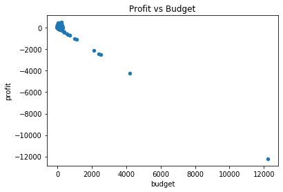
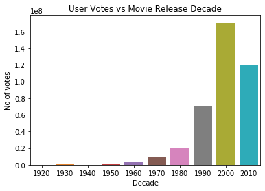

```python
# Supress Warnings
import warnings
warnings.filterwarnings('ignore')
```


```python
# Import the numpy and pandas packages

import numpy as np
import pandas as pd
import seaborn as sns
```

## Task 1: Reading and Inspection

-  ### Subtask 1.1: Import and read

Import and read the movie database. Store it in a variable called `movies`.


```python
movies = pd.read_csv('./Movie+Assignment+Data.csv')# Write your code for importing the csv file here
movies
```


<div>
<style scoped>
    .dataframe tbody tr th:only-of-type {
        vertical-align: middle;
    }

    .dataframe tbody tr th {
        vertical-align: top;
    }

    .dataframe thead th {
        text-align: right;
    }
</style>
<table border="1" class="dataframe">
  <thead>
    <tr style="text-align: right;">
      <th></th>
      <th>color</th>
      <th>director_name</th>
      <th>num_critic_for_reviews</th>
      <th>duration</th>
      <th>director_facebook_likes</th>
      <th>actor_3_facebook_likes</th>
      <th>actor_2_name</th>
      <th>actor_1_facebook_likes</th>
      <th>gross</th>
      <th>genres</th>
      <th>...</th>
      <th>num_user_for_reviews</th>
      <th>language</th>
      <th>country</th>
      <th>content_rating</th>
      <th>budget</th>
      <th>title_year</th>
      <th>actor_2_facebook_likes</th>
      <th>imdb_score</th>
      <th>aspect_ratio</th>
      <th>movie_facebook_likes</th>
    </tr>
  </thead>
  <tbody>
    <tr>
      <th>0</th>
      <td>Color</td>
      <td>James Cameron</td>
      <td>723.0</td>
      <td>178.0</td>
      <td>0.0</td>
      <td>855.0</td>
      <td>Joel David Moore</td>
      <td>1000.0</td>
      <td>760505847.0</td>
      <td>Action|Adventure|Fantasy|Sci-Fi</td>
      <td>...</td>
      <td>3054.0</td>
      <td>English</td>
      <td>USA</td>
      <td>PG-13</td>
      <td>237000000.0</td>
      <td>2009.0</td>
      <td>936.0</td>
      <td>7.9</td>
      <td>1.78</td>
      <td>33000</td>
    </tr>
    <tr>
      <th>1</th>
      <td>Color</td>
      <td>Gore Verbinski</td>
      <td>302.0</td>
      <td>169.0</td>
      <td>563.0</td>
      <td>1000.0</td>
      <td>Orlando Bloom</td>
      <td>40000.0</td>
      <td>309404152.0</td>
      <td>Action|Adventure|Fantasy</td>
      <td>...</td>
      <td>1238.0</td>
      <td>English</td>
      <td>USA</td>
      <td>PG-13</td>
      <td>300000000.0</td>
      <td>2007.0</td>
      <td>5000.0</td>
      <td>7.1</td>
      <td>2.35</td>
      <td>0</td>
    </tr>
    <tr>
      <th>2</th>
      <td>Color</td>
      <td>Sam Mendes</td>
      <td>602.0</td>
      <td>148.0</td>
      <td>0.0</td>
      <td>161.0</td>
      <td>Rory Kinnear</td>
      <td>11000.0</td>
      <td>200074175.0</td>
      <td>Action|Adventure|Thriller</td>
      <td>...</td>
      <td>994.0</td>
      <td>English</td>
      <td>UK</td>
      <td>PG-13</td>
      <td>245000000.0</td>
      <td>2015.0</td>
      <td>393.0</td>
      <td>6.8</td>
      <td>2.35</td>
      <td>85000</td>
    </tr>
    <tr>
      <th>3</th>
      <td>Color</td>
      <td>Christopher Nolan</td>
      <td>813.0</td>
      <td>164.0</td>
      <td>22000.0</td>
      <td>23000.0</td>
      <td>Christian Bale</td>
      <td>27000.0</td>
      <td>448130642.0</td>
      <td>Action|Thriller</td>
      <td>...</td>
      <td>2701.0</td>
      <td>English</td>
      <td>USA</td>
      <td>PG-13</td>
      <td>250000000.0</td>
      <td>2012.0</td>
      <td>23000.0</td>
      <td>8.5</td>
      <td>2.35</td>
      <td>164000</td>
    </tr>
    <tr>
      <th>4</th>
      <td>NaN</td>
      <td>Doug Walker</td>
      <td>NaN</td>
      <td>NaN</td>
      <td>131.0</td>
      <td>NaN</td>
      <td>Rob Walker</td>
      <td>131.0</td>
      <td>NaN</td>
      <td>Documentary</td>
      <td>...</td>
      <td>NaN</td>
      <td>NaN</td>
      <td>NaN</td>
      <td>NaN</td>
      <td>NaN</td>
      <td>NaN</td>
      <td>12.0</td>
      <td>7.1</td>
      <td>NaN</td>
      <td>0</td>
    </tr>
    <tr>
      <th>...</th>
      <td>...</td>
      <td>...</td>
      <td>...</td>
      <td>...</td>
      <td>...</td>
      <td>...</td>
      <td>...</td>
      <td>...</td>
      <td>...</td>
      <td>...</td>
      <td>...</td>
      <td>...</td>
      <td>...</td>
      <td>...</td>
      <td>...</td>
      <td>...</td>
      <td>...</td>
      <td>...</td>
      <td>...</td>
      <td>...</td>
      <td>...</td>
    </tr>
    <tr>
      <th>5038</th>
      <td>Color</td>
      <td>Scott Smith</td>
      <td>1.0</td>
      <td>87.0</td>
      <td>2.0</td>
      <td>318.0</td>
      <td>Daphne Zuniga</td>
      <td>637.0</td>
      <td>NaN</td>
      <td>Comedy|Drama</td>
      <td>...</td>
      <td>6.0</td>
      <td>English</td>
      <td>Canada</td>
      <td>NaN</td>
      <td>NaN</td>
      <td>2013.0</td>
      <td>470.0</td>
      <td>7.7</td>
      <td>NaN</td>
      <td>84</td>
    </tr>
    <tr>
      <th>5039</th>
      <td>Color</td>
      <td>NaN</td>
      <td>43.0</td>
      <td>43.0</td>
      <td>NaN</td>
      <td>319.0</td>
      <td>Valorie Curry</td>
      <td>841.0</td>
      <td>NaN</td>
      <td>Crime|Drama|Mystery|Thriller</td>
      <td>...</td>
      <td>359.0</td>
      <td>English</td>
      <td>USA</td>
      <td>TV-14</td>
      <td>NaN</td>
      <td>NaN</td>
      <td>593.0</td>
      <td>7.5</td>
      <td>16.00</td>
      <td>32000</td>
    </tr>
    <tr>
      <th>5040</th>
      <td>Color</td>
      <td>Benjamin Roberds</td>
      <td>13.0</td>
      <td>76.0</td>
      <td>0.0</td>
      <td>0.0</td>
      <td>Maxwell Moody</td>
      <td>0.0</td>
      <td>NaN</td>
      <td>Drama|Horror|Thriller</td>
      <td>...</td>
      <td>3.0</td>
      <td>English</td>
      <td>USA</td>
      <td>NaN</td>
      <td>1400.0</td>
      <td>2013.0</td>
      <td>0.0</td>
      <td>6.3</td>
      <td>NaN</td>
      <td>16</td>
    </tr>
    <tr>
      <th>5041</th>
      <td>Color</td>
      <td>Daniel Hsia</td>
      <td>14.0</td>
      <td>100.0</td>
      <td>0.0</td>
      <td>489.0</td>
      <td>Daniel Henney</td>
      <td>946.0</td>
      <td>10443.0</td>
      <td>Comedy|Drama|Romance</td>
      <td>...</td>
      <td>9.0</td>
      <td>English</td>
      <td>USA</td>
      <td>PG-13</td>
      <td>NaN</td>
      <td>2012.0</td>
      <td>719.0</td>
      <td>6.3</td>
      <td>2.35</td>
      <td>660</td>
    </tr>
    <tr>
      <th>5042</th>
      <td>Color</td>
      <td>Jon Gunn</td>
      <td>43.0</td>
      <td>90.0</td>
      <td>16.0</td>
      <td>16.0</td>
      <td>Brian Herzlinger</td>
      <td>86.0</td>
      <td>85222.0</td>
      <td>Documentary</td>
      <td>...</td>
      <td>84.0</td>
      <td>English</td>
      <td>USA</td>
      <td>PG</td>
      <td>1100.0</td>
      <td>2004.0</td>
      <td>23.0</td>
      <td>6.6</td>
      <td>1.85</td>
      <td>456</td>
    </tr>
  </tbody>
</table>
<p>5043 rows × 28 columns</p>
</div>


-  ### Subtask 1.2: Inspect the dataframe

Inspect the dataframe's columns, shapes, variable types etc.


```python
# Write your code for inspection here

# Number of rows and columns in the dataset as a tuple : (rows, columns)
shape = movies.shape
print('There are {} rows and {} columns in the movies dataframe'.format(shape[0], shape[1]),'\n\n' )
```

    There are 5043 rows and 28 columns in the movies dataframe 
    
    


```python
#The list of column names converted to a list 
print('Column Names  :', movies.columns.to_list(),'\n\n')
```

    Column Names  : ['color', 'director_name', 'num_critic_for_reviews', 'duration', 'director_facebook_likes', 'actor_3_facebook_likes', 'actor_2_name', 'actor_1_facebook_likes', 'gross', 'genres', 'actor_1_name', 'movie_title', 'num_voted_users', 'cast_total_facebook_likes', 'actor_3_name', 'facenumber_in_poster', 'plot_keywords', 'movie_imdb_link', 'num_user_for_reviews', 'language', 'country', 'content_rating', 'budget', 'title_year', 'actor_2_facebook_likes', 'imdb_score', 'aspect_ratio', 'movie_facebook_likes'] 
    
    


```python
# Column wise data types as a Series
print('Column   : \t\tData Type  \n', movies.dtypes, '\n\n')
```

    Column   : 		Data Type  
     color                         object
    director_name                 object
    num_critic_for_reviews       float64
    duration                     float64
    director_facebook_likes      float64
    actor_3_facebook_likes       float64
    actor_2_name                  object
    actor_1_facebook_likes       float64
    gross                        float64
    genres                        object
    actor_1_name                  object
    movie_title                   object
    num_voted_users                int64
    cast_total_facebook_likes      int64
    actor_3_name                  object
    facenumber_in_poster         float64
    plot_keywords                 object
    movie_imdb_link               object
    num_user_for_reviews         float64
    language                      object
    country                       object
    content_rating                object
    budget                       float64
    title_year                   float64
    actor_2_facebook_likes       float64
    imdb_score                   float64
    aspect_ratio                 float64
    movie_facebook_likes           int64
    dtype: object 
    
    


```python
# Column wise data counts i.e total non-missing values per columnn, as a Series
print('Column   : Data Counts  \n', movies.count(),'\n\n')
```

    Column   : Data Counts  
     color                        5024
    director_name                4939
    num_critic_for_reviews       4993
    duration                     5028
    director_facebook_likes      4939
    actor_3_facebook_likes       5020
    actor_2_name                 5030
    actor_1_facebook_likes       5036
    gross                        4159
    genres                       5043
    actor_1_name                 5036
    movie_title                  5043
    num_voted_users              5043
    cast_total_facebook_likes    5043
    actor_3_name                 5020
    facenumber_in_poster         5030
    plot_keywords                4890
    movie_imdb_link              5043
    num_user_for_reviews         5022
    language                     5031
    country                      5038
    content_rating               4740
    budget                       4551
    title_year                   4935
    actor_2_facebook_likes       5030
    imdb_score                   5043
    aspect_ratio                 4714
    movie_facebook_likes         5043
    dtype: int64 
    
    


```python
# dataframe info 
print('Column   : Values  \n', movies.info(),'\n\n')
```

    <class 'pandas.core.frame.DataFrame'>
    RangeIndex: 5043 entries, 0 to 5042
    Data columns (total 28 columns):
     #   Column                     Non-Null Count  Dtype  
    ---  ------                     --------------  -----  
     0   color                      5024 non-null   object 
     1   director_name              4939 non-null   object 
     2   num_critic_for_reviews     4993 non-null   float64
     3   duration                   5028 non-null   float64
     4   director_facebook_likes    4939 non-null   float64
     5   actor_3_facebook_likes     5020 non-null   float64
     6   actor_2_name               5030 non-null   object 
     7   actor_1_facebook_likes     5036 non-null   float64
     8   gross                      4159 non-null   float64
     9   genres                     5043 non-null   object 
     10  actor_1_name               5036 non-null   object 
     11  movie_title                5043 non-null   object 
     12  num_voted_users            5043 non-null   int64  
     13  cast_total_facebook_likes  5043 non-null   int64  
     14  actor_3_name               5020 non-null   object 
     15  facenumber_in_poster       5030 non-null   float64
     16  plot_keywords              4890 non-null   object 
     17  movie_imdb_link            5043 non-null   object 
     18  num_user_for_reviews       5022 non-null   float64
     19  language                   5031 non-null   object 
     20  country                    5038 non-null   object 
     21  content_rating             4740 non-null   object 
     22  budget                     4551 non-null   float64
     23  title_year                 4935 non-null   float64
     24  actor_2_facebook_likes     5030 non-null   float64
     25  imdb_score                 5043 non-null   float64
     26  aspect_ratio               4714 non-null   float64
     27  movie_facebook_likes       5043 non-null   int64  
    dtypes: float64(13), int64(3), object(12)
    memory usage: 1.1+ MB
    Column   : Values  
     None 
    
    


```python
# description
movies.describe()
```


<div>
<style scoped>
    .dataframe tbody tr th:only-of-type {
        vertical-align: middle;
    }

    .dataframe tbody tr th {
        vertical-align: top;
    }

    .dataframe thead th {
        text-align: right;
    }
</style>
<table border="1" class="dataframe">
  <thead>
    <tr style="text-align: right;">
      <th></th>
      <th>num_critic_for_reviews</th>
      <th>duration</th>
      <th>director_facebook_likes</th>
      <th>actor_3_facebook_likes</th>
      <th>actor_1_facebook_likes</th>
      <th>gross</th>
      <th>num_voted_users</th>
      <th>cast_total_facebook_likes</th>
      <th>facenumber_in_poster</th>
      <th>num_user_for_reviews</th>
      <th>budget</th>
      <th>title_year</th>
      <th>actor_2_facebook_likes</th>
      <th>imdb_score</th>
      <th>aspect_ratio</th>
      <th>movie_facebook_likes</th>
    </tr>
  </thead>
  <tbody>
    <tr>
      <th>count</th>
      <td>4993.000000</td>
      <td>5028.000000</td>
      <td>4939.000000</td>
      <td>5020.000000</td>
      <td>5036.000000</td>
      <td>4.159000e+03</td>
      <td>5.043000e+03</td>
      <td>5043.000000</td>
      <td>5030.000000</td>
      <td>5022.000000</td>
      <td>4.551000e+03</td>
      <td>4935.000000</td>
      <td>5030.000000</td>
      <td>5043.000000</td>
      <td>4714.000000</td>
      <td>5043.000000</td>
    </tr>
    <tr>
      <th>mean</th>
      <td>140.194272</td>
      <td>107.201074</td>
      <td>686.509212</td>
      <td>645.009761</td>
      <td>6560.047061</td>
      <td>4.846841e+07</td>
      <td>8.366816e+04</td>
      <td>9699.063851</td>
      <td>1.371173</td>
      <td>272.770808</td>
      <td>3.975262e+07</td>
      <td>2002.470517</td>
      <td>1651.754473</td>
      <td>6.442138</td>
      <td>2.220403</td>
      <td>7525.964505</td>
    </tr>
    <tr>
      <th>std</th>
      <td>121.601675</td>
      <td>25.197441</td>
      <td>2813.328607</td>
      <td>1665.041728</td>
      <td>15020.759120</td>
      <td>6.845299e+07</td>
      <td>1.384853e+05</td>
      <td>18163.799124</td>
      <td>2.013576</td>
      <td>377.982886</td>
      <td>2.061149e+08</td>
      <td>12.474599</td>
      <td>4042.438863</td>
      <td>1.125116</td>
      <td>1.385113</td>
      <td>19320.445110</td>
    </tr>
    <tr>
      <th>min</th>
      <td>1.000000</td>
      <td>7.000000</td>
      <td>0.000000</td>
      <td>0.000000</td>
      <td>0.000000</td>
      <td>1.620000e+02</td>
      <td>5.000000e+00</td>
      <td>0.000000</td>
      <td>0.000000</td>
      <td>1.000000</td>
      <td>2.180000e+02</td>
      <td>1916.000000</td>
      <td>0.000000</td>
      <td>1.600000</td>
      <td>1.180000</td>
      <td>0.000000</td>
    </tr>
    <tr>
      <th>25%</th>
      <td>50.000000</td>
      <td>93.000000</td>
      <td>7.000000</td>
      <td>133.000000</td>
      <td>614.000000</td>
      <td>5.340988e+06</td>
      <td>8.593500e+03</td>
      <td>1411.000000</td>
      <td>0.000000</td>
      <td>65.000000</td>
      <td>6.000000e+06</td>
      <td>1999.000000</td>
      <td>281.000000</td>
      <td>5.800000</td>
      <td>1.850000</td>
      <td>0.000000</td>
    </tr>
    <tr>
      <th>50%</th>
      <td>110.000000</td>
      <td>103.000000</td>
      <td>49.000000</td>
      <td>371.500000</td>
      <td>988.000000</td>
      <td>2.551750e+07</td>
      <td>3.435900e+04</td>
      <td>3090.000000</td>
      <td>1.000000</td>
      <td>156.000000</td>
      <td>2.000000e+07</td>
      <td>2005.000000</td>
      <td>595.000000</td>
      <td>6.600000</td>
      <td>2.350000</td>
      <td>166.000000</td>
    </tr>
    <tr>
      <th>75%</th>
      <td>195.000000</td>
      <td>118.000000</td>
      <td>194.500000</td>
      <td>636.000000</td>
      <td>11000.000000</td>
      <td>6.230944e+07</td>
      <td>9.630900e+04</td>
      <td>13756.500000</td>
      <td>2.000000</td>
      <td>326.000000</td>
      <td>4.500000e+07</td>
      <td>2011.000000</td>
      <td>918.000000</td>
      <td>7.200000</td>
      <td>2.350000</td>
      <td>3000.000000</td>
    </tr>
    <tr>
      <th>max</th>
      <td>813.000000</td>
      <td>511.000000</td>
      <td>23000.000000</td>
      <td>23000.000000</td>
      <td>640000.000000</td>
      <td>7.605058e+08</td>
      <td>1.689764e+06</td>
      <td>656730.000000</td>
      <td>43.000000</td>
      <td>5060.000000</td>
      <td>1.221550e+10</td>
      <td>2016.000000</td>
      <td>137000.000000</td>
      <td>9.500000</td>
      <td>16.000000</td>
      <td>349000.000000</td>
    </tr>
  </tbody>
</table>
</div>


## Task 2: Cleaning the Data

-  ### Subtask 2.1: Inspect Null values

Find out the number of Null values in all the columns and rows. Also, find the percentage of Null values in each column. Round off the percentages upto two decimal places.


```python
# Write your code for column-wise null count here

# No of rows containing null values in each column.
print('Column Name   \t: \tTotal Null Rows  \n', movies.isnull().sum())

```

    Column Name   	: 	Total Null Rows  
     color                         19
    director_name                104
    num_critic_for_reviews        50
    duration                      15
    director_facebook_likes      104
    actor_3_facebook_likes        23
    actor_2_name                  13
    actor_1_facebook_likes         7
    gross                        884
    genres                         0
    actor_1_name                   7
    movie_title                    0
    num_voted_users                0
    cast_total_facebook_likes      0
    actor_3_name                  23
    facenumber_in_poster          13
    plot_keywords                153
    movie_imdb_link                0
    num_user_for_reviews          21
    language                      12
    country                        5
    content_rating               303
    budget                       492
    title_year                   108
    actor_2_facebook_likes        13
    imdb_score                     0
    aspect_ratio                 329
    movie_facebook_likes           0
    dtype: int64


```python
# Write your code for row-wise null count here

# No of columns containing null values in each row.
print('Row Index : \tTotal Null Columns  \n', movies.isnull().sum(axis=1))
```

    Row Index : 	Total Null Columns  
     0        0
    1        0
    2        0
    3        0
    4       14
            ..
    5038     4
    5039     5
    5040     4
    5041     2
    5042     0
    Length: 5043, dtype: int64


```python
# Write your code for column-wise null percentages here

# (Total null rows per column / Total rows in the data frame) * 100 , rounded to 2 decimals, DataType : Series
column_nulls = np.round((movies.isnull().sum()/movies.shape[0])*100,2)

print('Column Name : \t\tNull Columns (%)  \n', column_nulls)

```

    Column Name : 		Null Columns (%)  
     color                         0.38
    director_name                 2.06
    num_critic_for_reviews        0.99
    duration                      0.30
    director_facebook_likes       2.06
    actor_3_facebook_likes        0.46
    actor_2_name                  0.26
    actor_1_facebook_likes        0.14
    gross                        17.53
    genres                        0.00
    actor_1_name                  0.14
    movie_title                   0.00
    num_voted_users               0.00
    cast_total_facebook_likes     0.00
    actor_3_name                  0.46
    facenumber_in_poster          0.26
    plot_keywords                 3.03
    movie_imdb_link               0.00
    num_user_for_reviews          0.42
    language                      0.24
    country                       0.10
    content_rating                6.01
    budget                        9.76
    title_year                    2.14
    actor_2_facebook_likes        0.26
    imdb_score                    0.00
    aspect_ratio                  6.52
    movie_facebook_likes          0.00
    dtype: float64


-  ### Subtask 2.2: Drop unecessary columns

For this assignment, you will mostly be analyzing the movies with respect to the ratings, gross collection, popularity of movies, etc. So many of the columns in this dataframe are not required. So it is advised to drop the following columns.
-  color
-  director_facebook_likes
-  actor_1_facebook_likes
-  actor_2_facebook_likes
-  actor_3_facebook_likes
-  actor_2_name
-  cast_total_facebook_likes
-  actor_3_name
-  duration
-  facenumber_in_poster
-  content_rating
-  country
-  movie_imdb_link
-  aspect_ratio
-  plot_keywords


```python
# Write your code for dropping the columns here. It is advised to keep inspecting the dataframe after each set of operations 
columns_to_drop = ['color','director_facebook_likes','actor_1_facebook_likes','actor_2_facebook_likes',
                   'actor_3_facebook_likes','actor_2_name','cast_total_facebook_likes','actor_3_name',
                   'duration','facenumber_in_poster','content_rating','country','movie_imdb_link',
                   'aspect_ratio','plot_keywords']

#dropping columns in place
movies.drop(columns=columns_to_drop, inplace=True)
movies.shape
```


    (5043, 13)


-  ### Subtask 2.3: Drop unecessary rows using columns with high Null percentages

Now, on inspection you might notice that some columns have large percentage (greater than 5%) of Null values. Drop all the rows which have Null values for such columns.


```python
# Write your code for dropping the rows here

# columns with null (%) > 5
column_nulls = np.round((movies.isnull().sum()/movies.shape[0])*100,2)
high_null_columns = column_nulls[column_nulls > 5]
print(high_null_columns)

# dropping columns with high null (%)
movies.dropna( axis = 0, subset=high_null_columns.index, inplace=True)
movies
```

    gross     17.53
    budget     9.76
    dtype: float64


<div>
<style scoped>
    .dataframe tbody tr th:only-of-type {
        vertical-align: middle;
    }

    .dataframe tbody tr th {
        vertical-align: top;
    }

    .dataframe thead th {
        text-align: right;
    }
</style>
<table border="1" class="dataframe">
  <thead>
    <tr style="text-align: right;">
      <th></th>
      <th>director_name</th>
      <th>num_critic_for_reviews</th>
      <th>gross</th>
      <th>genres</th>
      <th>actor_1_name</th>
      <th>movie_title</th>
      <th>num_voted_users</th>
      <th>num_user_for_reviews</th>
      <th>language</th>
      <th>budget</th>
      <th>title_year</th>
      <th>imdb_score</th>
      <th>movie_facebook_likes</th>
    </tr>
  </thead>
  <tbody>
    <tr>
      <th>0</th>
      <td>James Cameron</td>
      <td>723.0</td>
      <td>760505847.0</td>
      <td>Action|Adventure|Fantasy|Sci-Fi</td>
      <td>CCH Pounder</td>
      <td>Avatar</td>
      <td>886204</td>
      <td>3054.0</td>
      <td>English</td>
      <td>237000000.0</td>
      <td>2009.0</td>
      <td>7.9</td>
      <td>33000</td>
    </tr>
    <tr>
      <th>1</th>
      <td>Gore Verbinski</td>
      <td>302.0</td>
      <td>309404152.0</td>
      <td>Action|Adventure|Fantasy</td>
      <td>Johnny Depp</td>
      <td>Pirates of the Caribbean: At World's End</td>
      <td>471220</td>
      <td>1238.0</td>
      <td>English</td>
      <td>300000000.0</td>
      <td>2007.0</td>
      <td>7.1</td>
      <td>0</td>
    </tr>
    <tr>
      <th>2</th>
      <td>Sam Mendes</td>
      <td>602.0</td>
      <td>200074175.0</td>
      <td>Action|Adventure|Thriller</td>
      <td>Christoph Waltz</td>
      <td>Spectre</td>
      <td>275868</td>
      <td>994.0</td>
      <td>English</td>
      <td>245000000.0</td>
      <td>2015.0</td>
      <td>6.8</td>
      <td>85000</td>
    </tr>
    <tr>
      <th>3</th>
      <td>Christopher Nolan</td>
      <td>813.0</td>
      <td>448130642.0</td>
      <td>Action|Thriller</td>
      <td>Tom Hardy</td>
      <td>The Dark Knight Rises</td>
      <td>1144337</td>
      <td>2701.0</td>
      <td>English</td>
      <td>250000000.0</td>
      <td>2012.0</td>
      <td>8.5</td>
      <td>164000</td>
    </tr>
    <tr>
      <th>5</th>
      <td>Andrew Stanton</td>
      <td>462.0</td>
      <td>73058679.0</td>
      <td>Action|Adventure|Sci-Fi</td>
      <td>Daryl Sabara</td>
      <td>John Carter</td>
      <td>212204</td>
      <td>738.0</td>
      <td>English</td>
      <td>263700000.0</td>
      <td>2012.0</td>
      <td>6.6</td>
      <td>24000</td>
    </tr>
    <tr>
      <th>...</th>
      <td>...</td>
      <td>...</td>
      <td>...</td>
      <td>...</td>
      <td>...</td>
      <td>...</td>
      <td>...</td>
      <td>...</td>
      <td>...</td>
      <td>...</td>
      <td>...</td>
      <td>...</td>
      <td>...</td>
    </tr>
    <tr>
      <th>5033</th>
      <td>Shane Carruth</td>
      <td>143.0</td>
      <td>424760.0</td>
      <td>Drama|Sci-Fi|Thriller</td>
      <td>Shane Carruth</td>
      <td>Primer</td>
      <td>72639</td>
      <td>371.0</td>
      <td>English</td>
      <td>7000.0</td>
      <td>2004.0</td>
      <td>7.0</td>
      <td>19000</td>
    </tr>
    <tr>
      <th>5034</th>
      <td>Neill Dela Llana</td>
      <td>35.0</td>
      <td>70071.0</td>
      <td>Thriller</td>
      <td>Ian Gamazon</td>
      <td>Cavite</td>
      <td>589</td>
      <td>35.0</td>
      <td>English</td>
      <td>7000.0</td>
      <td>2005.0</td>
      <td>6.3</td>
      <td>74</td>
    </tr>
    <tr>
      <th>5035</th>
      <td>Robert Rodriguez</td>
      <td>56.0</td>
      <td>2040920.0</td>
      <td>Action|Crime|Drama|Romance|Thriller</td>
      <td>Carlos Gallardo</td>
      <td>El Mariachi</td>
      <td>52055</td>
      <td>130.0</td>
      <td>Spanish</td>
      <td>7000.0</td>
      <td>1992.0</td>
      <td>6.9</td>
      <td>0</td>
    </tr>
    <tr>
      <th>5037</th>
      <td>Edward Burns</td>
      <td>14.0</td>
      <td>4584.0</td>
      <td>Comedy|Drama</td>
      <td>Kerry Bishé</td>
      <td>Newlyweds</td>
      <td>1338</td>
      <td>14.0</td>
      <td>English</td>
      <td>9000.0</td>
      <td>2011.0</td>
      <td>6.4</td>
      <td>413</td>
    </tr>
    <tr>
      <th>5042</th>
      <td>Jon Gunn</td>
      <td>43.0</td>
      <td>85222.0</td>
      <td>Documentary</td>
      <td>John August</td>
      <td>My Date with Drew</td>
      <td>4285</td>
      <td>84.0</td>
      <td>English</td>
      <td>1100.0</td>
      <td>2004.0</td>
      <td>6.6</td>
      <td>456</td>
    </tr>
  </tbody>
</table>
<p>3891 rows × 13 columns</p>
</div>


-  ### Subtask 2.4: Fill NaN values

You might notice that the `language` column has some NaN values. Here, on inspection, you will see that it is safe to replace all the missing values with `'English'`.


```python
# Write your code for filling the NaN values in the 'language' column here

# 12 NAs in language column from code block #42 output

# Filling NAs with 'English' 
movies.fillna({'language' : 'English'}, inplace=True)
movies
```


<div>
<style scoped>
    .dataframe tbody tr th:only-of-type {
        vertical-align: middle;
    }

    .dataframe tbody tr th {
        vertical-align: top;
    }

    .dataframe thead th {
        text-align: right;
    }
</style>
<table border="1" class="dataframe">
  <thead>
    <tr style="text-align: right;">
      <th></th>
      <th>director_name</th>
      <th>num_critic_for_reviews</th>
      <th>gross</th>
      <th>genres</th>
      <th>actor_1_name</th>
      <th>movie_title</th>
      <th>num_voted_users</th>
      <th>num_user_for_reviews</th>
      <th>language</th>
      <th>budget</th>
      <th>title_year</th>
      <th>imdb_score</th>
      <th>movie_facebook_likes</th>
    </tr>
  </thead>
  <tbody>
    <tr>
      <th>0</th>
      <td>James Cameron</td>
      <td>723.0</td>
      <td>760505847.0</td>
      <td>Action|Adventure|Fantasy|Sci-Fi</td>
      <td>CCH Pounder</td>
      <td>Avatar</td>
      <td>886204</td>
      <td>3054.0</td>
      <td>English</td>
      <td>237000000.0</td>
      <td>2009.0</td>
      <td>7.9</td>
      <td>33000</td>
    </tr>
    <tr>
      <th>1</th>
      <td>Gore Verbinski</td>
      <td>302.0</td>
      <td>309404152.0</td>
      <td>Action|Adventure|Fantasy</td>
      <td>Johnny Depp</td>
      <td>Pirates of the Caribbean: At World's End</td>
      <td>471220</td>
      <td>1238.0</td>
      <td>English</td>
      <td>300000000.0</td>
      <td>2007.0</td>
      <td>7.1</td>
      <td>0</td>
    </tr>
    <tr>
      <th>2</th>
      <td>Sam Mendes</td>
      <td>602.0</td>
      <td>200074175.0</td>
      <td>Action|Adventure|Thriller</td>
      <td>Christoph Waltz</td>
      <td>Spectre</td>
      <td>275868</td>
      <td>994.0</td>
      <td>English</td>
      <td>245000000.0</td>
      <td>2015.0</td>
      <td>6.8</td>
      <td>85000</td>
    </tr>
    <tr>
      <th>3</th>
      <td>Christopher Nolan</td>
      <td>813.0</td>
      <td>448130642.0</td>
      <td>Action|Thriller</td>
      <td>Tom Hardy</td>
      <td>The Dark Knight Rises</td>
      <td>1144337</td>
      <td>2701.0</td>
      <td>English</td>
      <td>250000000.0</td>
      <td>2012.0</td>
      <td>8.5</td>
      <td>164000</td>
    </tr>
    <tr>
      <th>5</th>
      <td>Andrew Stanton</td>
      <td>462.0</td>
      <td>73058679.0</td>
      <td>Action|Adventure|Sci-Fi</td>
      <td>Daryl Sabara</td>
      <td>John Carter</td>
      <td>212204</td>
      <td>738.0</td>
      <td>English</td>
      <td>263700000.0</td>
      <td>2012.0</td>
      <td>6.6</td>
      <td>24000</td>
    </tr>
    <tr>
      <th>...</th>
      <td>...</td>
      <td>...</td>
      <td>...</td>
      <td>...</td>
      <td>...</td>
      <td>...</td>
      <td>...</td>
      <td>...</td>
      <td>...</td>
      <td>...</td>
      <td>...</td>
      <td>...</td>
      <td>...</td>
    </tr>
    <tr>
      <th>5033</th>
      <td>Shane Carruth</td>
      <td>143.0</td>
      <td>424760.0</td>
      <td>Drama|Sci-Fi|Thriller</td>
      <td>Shane Carruth</td>
      <td>Primer</td>
      <td>72639</td>
      <td>371.0</td>
      <td>English</td>
      <td>7000.0</td>
      <td>2004.0</td>
      <td>7.0</td>
      <td>19000</td>
    </tr>
    <tr>
      <th>5034</th>
      <td>Neill Dela Llana</td>
      <td>35.0</td>
      <td>70071.0</td>
      <td>Thriller</td>
      <td>Ian Gamazon</td>
      <td>Cavite</td>
      <td>589</td>
      <td>35.0</td>
      <td>English</td>
      <td>7000.0</td>
      <td>2005.0</td>
      <td>6.3</td>
      <td>74</td>
    </tr>
    <tr>
      <th>5035</th>
      <td>Robert Rodriguez</td>
      <td>56.0</td>
      <td>2040920.0</td>
      <td>Action|Crime|Drama|Romance|Thriller</td>
      <td>Carlos Gallardo</td>
      <td>El Mariachi</td>
      <td>52055</td>
      <td>130.0</td>
      <td>Spanish</td>
      <td>7000.0</td>
      <td>1992.0</td>
      <td>6.9</td>
      <td>0</td>
    </tr>
    <tr>
      <th>5037</th>
      <td>Edward Burns</td>
      <td>14.0</td>
      <td>4584.0</td>
      <td>Comedy|Drama</td>
      <td>Kerry Bishé</td>
      <td>Newlyweds</td>
      <td>1338</td>
      <td>14.0</td>
      <td>English</td>
      <td>9000.0</td>
      <td>2011.0</td>
      <td>6.4</td>
      <td>413</td>
    </tr>
    <tr>
      <th>5042</th>
      <td>Jon Gunn</td>
      <td>43.0</td>
      <td>85222.0</td>
      <td>Documentary</td>
      <td>John August</td>
      <td>My Date with Drew</td>
      <td>4285</td>
      <td>84.0</td>
      <td>English</td>
      <td>1100.0</td>
      <td>2004.0</td>
      <td>6.6</td>
      <td>456</td>
    </tr>
  </tbody>
</table>
<p>3891 rows × 13 columns</p>
</div>


-  ### Subtask 2.5: Check the number of retained rows

You might notice that two of the columns viz. `num_critic_for_reviews` and `actor_1_name` have small percentages of NaN values left. You can let these columns as it is for now. Check the number and percentage of the rows retained after completing all the tasks above.


```python
# Write your code for checking number of retained rows here
print('Column Name : \t\tTotal Null Rows  \n', movies.isnull().sum(),'\n\n')

# Retained column % = (Current Columns / Initial Columns) * 100
#shape contains the shape of the original imported movies dataset
retained = (movies.shape[0]/shape[0])*100
print('Retained rows wrt to origin dataframe :',retained,'%\n\n')
```

    Column Name : 		Total Null Rows  
     director_name             0
    num_critic_for_reviews    1
    gross                     0
    genres                    0
    actor_1_name              3
    movie_title               0
    num_voted_users           0
    num_user_for_reviews      0
    language                  0
    budget                    0
    title_year                0
    imdb_score                0
    movie_facebook_likes      0
    dtype: int64 
    
    
    Retained rows wrt to origin dataframe : 77.15645449137418 %
    
    


**Checkpoint 1:** You might have noticed that we still have around `77%` of the rows!

## Task 3: Data Analysis

-  ### Subtask 3.1: Change the unit of columns

Convert the unit of the `budget` and `gross` columns from `$` to `million $`.


```python
# Write your code for unit conversion here

#Not rounding off to preserve accuracy
movies['budget'] = movies['budget']/10**6
movies['gross'] = movies['gross']/10**6
movies.head(10)
```


<div>
<style scoped>
    .dataframe tbody tr th:only-of-type {
        vertical-align: middle;
    }

    .dataframe tbody tr th {
        vertical-align: top;
    }

    .dataframe thead th {
        text-align: right;
    }
</style>
<table border="1" class="dataframe">
  <thead>
    <tr style="text-align: right;">
      <th></th>
      <th>director_name</th>
      <th>num_critic_for_reviews</th>
      <th>gross</th>
      <th>genres</th>
      <th>actor_1_name</th>
      <th>movie_title</th>
      <th>num_voted_users</th>
      <th>num_user_for_reviews</th>
      <th>language</th>
      <th>budget</th>
      <th>title_year</th>
      <th>imdb_score</th>
      <th>movie_facebook_likes</th>
    </tr>
  </thead>
  <tbody>
    <tr>
      <th>0</th>
      <td>James Cameron</td>
      <td>723.0</td>
      <td>760.505847</td>
      <td>Action|Adventure|Fantasy|Sci-Fi</td>
      <td>CCH Pounder</td>
      <td>Avatar</td>
      <td>886204</td>
      <td>3054.0</td>
      <td>English</td>
      <td>237.0</td>
      <td>2009.0</td>
      <td>7.9</td>
      <td>33000</td>
    </tr>
    <tr>
      <th>1</th>
      <td>Gore Verbinski</td>
      <td>302.0</td>
      <td>309.404152</td>
      <td>Action|Adventure|Fantasy</td>
      <td>Johnny Depp</td>
      <td>Pirates of the Caribbean: At World's End</td>
      <td>471220</td>
      <td>1238.0</td>
      <td>English</td>
      <td>300.0</td>
      <td>2007.0</td>
      <td>7.1</td>
      <td>0</td>
    </tr>
    <tr>
      <th>2</th>
      <td>Sam Mendes</td>
      <td>602.0</td>
      <td>200.074175</td>
      <td>Action|Adventure|Thriller</td>
      <td>Christoph Waltz</td>
      <td>Spectre</td>
      <td>275868</td>
      <td>994.0</td>
      <td>English</td>
      <td>245.0</td>
      <td>2015.0</td>
      <td>6.8</td>
      <td>85000</td>
    </tr>
    <tr>
      <th>3</th>
      <td>Christopher Nolan</td>
      <td>813.0</td>
      <td>448.130642</td>
      <td>Action|Thriller</td>
      <td>Tom Hardy</td>
      <td>The Dark Knight Rises</td>
      <td>1144337</td>
      <td>2701.0</td>
      <td>English</td>
      <td>250.0</td>
      <td>2012.0</td>
      <td>8.5</td>
      <td>164000</td>
    </tr>
    <tr>
      <th>5</th>
      <td>Andrew Stanton</td>
      <td>462.0</td>
      <td>73.058679</td>
      <td>Action|Adventure|Sci-Fi</td>
      <td>Daryl Sabara</td>
      <td>John Carter</td>
      <td>212204</td>
      <td>738.0</td>
      <td>English</td>
      <td>263.7</td>
      <td>2012.0</td>
      <td>6.6</td>
      <td>24000</td>
    </tr>
    <tr>
      <th>6</th>
      <td>Sam Raimi</td>
      <td>392.0</td>
      <td>336.530303</td>
      <td>Action|Adventure|Romance</td>
      <td>J.K. Simmons</td>
      <td>Spider-Man 3</td>
      <td>383056</td>
      <td>1902.0</td>
      <td>English</td>
      <td>258.0</td>
      <td>2007.0</td>
      <td>6.2</td>
      <td>0</td>
    </tr>
    <tr>
      <th>7</th>
      <td>Nathan Greno</td>
      <td>324.0</td>
      <td>200.807262</td>
      <td>Adventure|Animation|Comedy|Family|Fantasy|Musi...</td>
      <td>Brad Garrett</td>
      <td>Tangled</td>
      <td>294810</td>
      <td>387.0</td>
      <td>English</td>
      <td>260.0</td>
      <td>2010.0</td>
      <td>7.8</td>
      <td>29000</td>
    </tr>
    <tr>
      <th>8</th>
      <td>Joss Whedon</td>
      <td>635.0</td>
      <td>458.991599</td>
      <td>Action|Adventure|Sci-Fi</td>
      <td>Chris Hemsworth</td>
      <td>Avengers: Age of Ultron</td>
      <td>462669</td>
      <td>1117.0</td>
      <td>English</td>
      <td>250.0</td>
      <td>2015.0</td>
      <td>7.5</td>
      <td>118000</td>
    </tr>
    <tr>
      <th>9</th>
      <td>David Yates</td>
      <td>375.0</td>
      <td>301.956980</td>
      <td>Adventure|Family|Fantasy|Mystery</td>
      <td>Alan Rickman</td>
      <td>Harry Potter and the Half-Blood Prince</td>
      <td>321795</td>
      <td>973.0</td>
      <td>English</td>
      <td>250.0</td>
      <td>2009.0</td>
      <td>7.5</td>
      <td>10000</td>
    </tr>
    <tr>
      <th>10</th>
      <td>Zack Snyder</td>
      <td>673.0</td>
      <td>330.249062</td>
      <td>Action|Adventure|Sci-Fi</td>
      <td>Henry Cavill</td>
      <td>Batman v Superman: Dawn of Justice</td>
      <td>371639</td>
      <td>3018.0</td>
      <td>English</td>
      <td>250.0</td>
      <td>2016.0</td>
      <td>6.9</td>
      <td>197000</td>
    </tr>
  </tbody>
</table>
</div>


-  ### Subtask 3.2: Find the movies with highest profit

    1. Create a new column called `profit` which contains the difference of the two columns: `gross` and `budget`.
    2. Sort the dataframe using the `profit` column as reference.
    3. Plot `profit` (y-axis) vs `budget` (x- axis) and observe the outliers using the appropriate chart type.
    4. Extract the top ten profiting movies in descending order and store them in a new dataframe - `top10`


```python
# Write your code for creating the profit column here
movies['profit'] = movies['gross'] - movies['budget']
movies.head()
```


<div>
<style scoped>
    .dataframe tbody tr th:only-of-type {
        vertical-align: middle;
    }

    .dataframe tbody tr th {
        vertical-align: top;
    }

    .dataframe thead th {
        text-align: right;
    }
</style>
<table border="1" class="dataframe">
  <thead>
    <tr style="text-align: right;">
      <th></th>
      <th>director_name</th>
      <th>num_critic_for_reviews</th>
      <th>gross</th>
      <th>genres</th>
      <th>actor_1_name</th>
      <th>movie_title</th>
      <th>num_voted_users</th>
      <th>num_user_for_reviews</th>
      <th>language</th>
      <th>budget</th>
      <th>title_year</th>
      <th>imdb_score</th>
      <th>movie_facebook_likes</th>
      <th>profit</th>
    </tr>
  </thead>
  <tbody>
    <tr>
      <th>0</th>
      <td>James Cameron</td>
      <td>723.0</td>
      <td>760.505847</td>
      <td>Action|Adventure|Fantasy|Sci-Fi</td>
      <td>CCH Pounder</td>
      <td>Avatar</td>
      <td>886204</td>
      <td>3054.0</td>
      <td>English</td>
      <td>237.0</td>
      <td>2009.0</td>
      <td>7.9</td>
      <td>33000</td>
      <td>523.505847</td>
    </tr>
    <tr>
      <th>1</th>
      <td>Gore Verbinski</td>
      <td>302.0</td>
      <td>309.404152</td>
      <td>Action|Adventure|Fantasy</td>
      <td>Johnny Depp</td>
      <td>Pirates of the Caribbean: At World's End</td>
      <td>471220</td>
      <td>1238.0</td>
      <td>English</td>
      <td>300.0</td>
      <td>2007.0</td>
      <td>7.1</td>
      <td>0</td>
      <td>9.404152</td>
    </tr>
    <tr>
      <th>2</th>
      <td>Sam Mendes</td>
      <td>602.0</td>
      <td>200.074175</td>
      <td>Action|Adventure|Thriller</td>
      <td>Christoph Waltz</td>
      <td>Spectre</td>
      <td>275868</td>
      <td>994.0</td>
      <td>English</td>
      <td>245.0</td>
      <td>2015.0</td>
      <td>6.8</td>
      <td>85000</td>
      <td>-44.925825</td>
    </tr>
    <tr>
      <th>3</th>
      <td>Christopher Nolan</td>
      <td>813.0</td>
      <td>448.130642</td>
      <td>Action|Thriller</td>
      <td>Tom Hardy</td>
      <td>The Dark Knight Rises</td>
      <td>1144337</td>
      <td>2701.0</td>
      <td>English</td>
      <td>250.0</td>
      <td>2012.0</td>
      <td>8.5</td>
      <td>164000</td>
      <td>198.130642</td>
    </tr>
    <tr>
      <th>5</th>
      <td>Andrew Stanton</td>
      <td>462.0</td>
      <td>73.058679</td>
      <td>Action|Adventure|Sci-Fi</td>
      <td>Daryl Sabara</td>
      <td>John Carter</td>
      <td>212204</td>
      <td>738.0</td>
      <td>English</td>
      <td>263.7</td>
      <td>2012.0</td>
      <td>6.6</td>
      <td>24000</td>
      <td>-190.641321</td>
    </tr>
  </tbody>
</table>
</div>


```python
# Write your code for sorting the dataframe here
movies.sort_values(by='profit', inplace=True, ascending=False)
movies.head()
```


<div>
<style scoped>
    .dataframe tbody tr th:only-of-type {
        vertical-align: middle;
    }

    .dataframe tbody tr th {
        vertical-align: top;
    }

    .dataframe thead th {
        text-align: right;
    }
</style>
<table border="1" class="dataframe">
  <thead>
    <tr style="text-align: right;">
      <th></th>
      <th>director_name</th>
      <th>num_critic_for_reviews</th>
      <th>gross</th>
      <th>genres</th>
      <th>actor_1_name</th>
      <th>movie_title</th>
      <th>num_voted_users</th>
      <th>num_user_for_reviews</th>
      <th>language</th>
      <th>budget</th>
      <th>title_year</th>
      <th>imdb_score</th>
      <th>movie_facebook_likes</th>
      <th>profit</th>
    </tr>
  </thead>
  <tbody>
    <tr>
      <th>0</th>
      <td>James Cameron</td>
      <td>723.0</td>
      <td>760.505847</td>
      <td>Action|Adventure|Fantasy|Sci-Fi</td>
      <td>CCH Pounder</td>
      <td>Avatar</td>
      <td>886204</td>
      <td>3054.0</td>
      <td>English</td>
      <td>237.0</td>
      <td>2009.0</td>
      <td>7.9</td>
      <td>33000</td>
      <td>523.505847</td>
    </tr>
    <tr>
      <th>29</th>
      <td>Colin Trevorrow</td>
      <td>644.0</td>
      <td>652.177271</td>
      <td>Action|Adventure|Sci-Fi|Thriller</td>
      <td>Bryce Dallas Howard</td>
      <td>Jurassic World</td>
      <td>418214</td>
      <td>1290.0</td>
      <td>English</td>
      <td>150.0</td>
      <td>2015.0</td>
      <td>7.0</td>
      <td>150000</td>
      <td>502.177271</td>
    </tr>
    <tr>
      <th>26</th>
      <td>James Cameron</td>
      <td>315.0</td>
      <td>658.672302</td>
      <td>Drama|Romance</td>
      <td>Leonardo DiCaprio</td>
      <td>Titanic</td>
      <td>793059</td>
      <td>2528.0</td>
      <td>English</td>
      <td>200.0</td>
      <td>1997.0</td>
      <td>7.7</td>
      <td>26000</td>
      <td>458.672302</td>
    </tr>
    <tr>
      <th>3024</th>
      <td>George Lucas</td>
      <td>282.0</td>
      <td>460.935665</td>
      <td>Action|Adventure|Fantasy|Sci-Fi</td>
      <td>Harrison Ford</td>
      <td>Star Wars: Episode IV - A New Hope</td>
      <td>911097</td>
      <td>1470.0</td>
      <td>English</td>
      <td>11.0</td>
      <td>1977.0</td>
      <td>8.7</td>
      <td>33000</td>
      <td>449.935665</td>
    </tr>
    <tr>
      <th>3080</th>
      <td>Steven Spielberg</td>
      <td>215.0</td>
      <td>434.949459</td>
      <td>Family|Sci-Fi</td>
      <td>Henry Thomas</td>
      <td>E.T. the Extra-Terrestrial</td>
      <td>281842</td>
      <td>515.0</td>
      <td>English</td>
      <td>10.5</td>
      <td>1982.0</td>
      <td>7.9</td>
      <td>34000</td>
      <td>424.449459</td>
    </tr>
  </tbody>
</table>
</div>


```python
# Write code for profit vs budget plot here
import matplotlib.pyplot as plt 

movies.plot.scatter('budget', 'profit')
plt.title('Profit vs Budget')
plt.show()
```





```python
#outliers 
movies.loc[(movies['profit'] < -2000) & (movies['budget'] > 2000),'movie_title']
```


    2334             Steamboy 
    2323    Princess Mononoke 
    3005             Fateless 
    3859       Lady Vengeance 
    2988             The Host 
    Name: movie_title, dtype: object


```python
# Write your code to get the top 10 profiting movies here

# movies is already sorted by profit in the previous step 
#top 10 movies by profit
top10 = movies.iloc[:10]
top10
```


<div>
<style scoped>
    .dataframe tbody tr th:only-of-type {
        vertical-align: middle;
    }

    .dataframe tbody tr th {
        vertical-align: top;
    }

    .dataframe thead th {
        text-align: right;
    }
</style>
<table border="1" class="dataframe">
  <thead>
    <tr style="text-align: right;">
      <th></th>
      <th>director_name</th>
      <th>num_critic_for_reviews</th>
      <th>gross</th>
      <th>genres</th>
      <th>actor_1_name</th>
      <th>movie_title</th>
      <th>num_voted_users</th>
      <th>num_user_for_reviews</th>
      <th>language</th>
      <th>budget</th>
      <th>title_year</th>
      <th>imdb_score</th>
      <th>movie_facebook_likes</th>
      <th>profit</th>
    </tr>
  </thead>
  <tbody>
    <tr>
      <th>0</th>
      <td>James Cameron</td>
      <td>723.0</td>
      <td>760.505847</td>
      <td>Action|Adventure|Fantasy|Sci-Fi</td>
      <td>CCH Pounder</td>
      <td>Avatar</td>
      <td>886204</td>
      <td>3054.0</td>
      <td>English</td>
      <td>237.0</td>
      <td>2009.0</td>
      <td>7.9</td>
      <td>33000</td>
      <td>523.505847</td>
    </tr>
    <tr>
      <th>29</th>
      <td>Colin Trevorrow</td>
      <td>644.0</td>
      <td>652.177271</td>
      <td>Action|Adventure|Sci-Fi|Thriller</td>
      <td>Bryce Dallas Howard</td>
      <td>Jurassic World</td>
      <td>418214</td>
      <td>1290.0</td>
      <td>English</td>
      <td>150.0</td>
      <td>2015.0</td>
      <td>7.0</td>
      <td>150000</td>
      <td>502.177271</td>
    </tr>
    <tr>
      <th>26</th>
      <td>James Cameron</td>
      <td>315.0</td>
      <td>658.672302</td>
      <td>Drama|Romance</td>
      <td>Leonardo DiCaprio</td>
      <td>Titanic</td>
      <td>793059</td>
      <td>2528.0</td>
      <td>English</td>
      <td>200.0</td>
      <td>1997.0</td>
      <td>7.7</td>
      <td>26000</td>
      <td>458.672302</td>
    </tr>
    <tr>
      <th>3024</th>
      <td>George Lucas</td>
      <td>282.0</td>
      <td>460.935665</td>
      <td>Action|Adventure|Fantasy|Sci-Fi</td>
      <td>Harrison Ford</td>
      <td>Star Wars: Episode IV - A New Hope</td>
      <td>911097</td>
      <td>1470.0</td>
      <td>English</td>
      <td>11.0</td>
      <td>1977.0</td>
      <td>8.7</td>
      <td>33000</td>
      <td>449.935665</td>
    </tr>
    <tr>
      <th>3080</th>
      <td>Steven Spielberg</td>
      <td>215.0</td>
      <td>434.949459</td>
      <td>Family|Sci-Fi</td>
      <td>Henry Thomas</td>
      <td>E.T. the Extra-Terrestrial</td>
      <td>281842</td>
      <td>515.0</td>
      <td>English</td>
      <td>10.5</td>
      <td>1982.0</td>
      <td>7.9</td>
      <td>34000</td>
      <td>424.449459</td>
    </tr>
    <tr>
      <th>794</th>
      <td>Joss Whedon</td>
      <td>703.0</td>
      <td>623.279547</td>
      <td>Action|Adventure|Sci-Fi</td>
      <td>Chris Hemsworth</td>
      <td>The Avengers</td>
      <td>995415</td>
      <td>1722.0</td>
      <td>English</td>
      <td>220.0</td>
      <td>2012.0</td>
      <td>8.1</td>
      <td>123000</td>
      <td>403.279547</td>
    </tr>
    <tr>
      <th>17</th>
      <td>Joss Whedon</td>
      <td>703.0</td>
      <td>623.279547</td>
      <td>Action|Adventure|Sci-Fi</td>
      <td>Chris Hemsworth</td>
      <td>The Avengers</td>
      <td>995415</td>
      <td>1722.0</td>
      <td>English</td>
      <td>220.0</td>
      <td>2012.0</td>
      <td>8.1</td>
      <td>123000</td>
      <td>403.279547</td>
    </tr>
    <tr>
      <th>509</th>
      <td>Roger Allers</td>
      <td>186.0</td>
      <td>422.783777</td>
      <td>Adventure|Animation|Drama|Family|Musical</td>
      <td>Matthew Broderick</td>
      <td>The Lion King</td>
      <td>644348</td>
      <td>656.0</td>
      <td>English</td>
      <td>45.0</td>
      <td>1994.0</td>
      <td>8.5</td>
      <td>17000</td>
      <td>377.783777</td>
    </tr>
    <tr>
      <th>240</th>
      <td>George Lucas</td>
      <td>320.0</td>
      <td>474.544677</td>
      <td>Action|Adventure|Fantasy|Sci-Fi</td>
      <td>Natalie Portman</td>
      <td>Star Wars: Episode I - The Phantom Menace</td>
      <td>534658</td>
      <td>3597.0</td>
      <td>English</td>
      <td>115.0</td>
      <td>1999.0</td>
      <td>6.5</td>
      <td>13000</td>
      <td>359.544677</td>
    </tr>
    <tr>
      <th>66</th>
      <td>Christopher Nolan</td>
      <td>645.0</td>
      <td>533.316061</td>
      <td>Action|Crime|Drama|Thriller</td>
      <td>Christian Bale</td>
      <td>The Dark Knight</td>
      <td>1676169</td>
      <td>4667.0</td>
      <td>English</td>
      <td>185.0</td>
      <td>2008.0</td>
      <td>9.0</td>
      <td>37000</td>
      <td>348.316061</td>
    </tr>
  </tbody>
</table>
</div>


-  ### Subtask 3.3: Drop duplicate values

After you found out the top 10 profiting movies, you might have noticed a duplicate value. So, it seems like the dataframe has duplicate values as well. Drop the duplicate values from the dataframe and repeat `Subtask 3.2`. Note that the same `movie_title` can be there in different languages. 


```python
# Write your code for dropping duplicate values here

# dropping duplicates considering all columns and retaining the first row among duplicate rows
movies.drop_duplicates(inplace=True)
```


```python
# Write code for repeating subtask 2 here
movies_by_profit = movies.sort_values(by='profit', ascending=False)
top10 = movies_by_profit.iloc[:10]
top10
```


<div>
<style scoped>
    .dataframe tbody tr th:only-of-type {
        vertical-align: middle;
    }

    .dataframe tbody tr th {
        vertical-align: top;
    }

    .dataframe thead th {
        text-align: right;
    }
</style>
<table border="1" class="dataframe">
  <thead>
    <tr style="text-align: right;">
      <th></th>
      <th>director_name</th>
      <th>num_critic_for_reviews</th>
      <th>gross</th>
      <th>genres</th>
      <th>actor_1_name</th>
      <th>movie_title</th>
      <th>num_voted_users</th>
      <th>num_user_for_reviews</th>
      <th>language</th>
      <th>budget</th>
      <th>title_year</th>
      <th>imdb_score</th>
      <th>movie_facebook_likes</th>
      <th>profit</th>
    </tr>
  </thead>
  <tbody>
    <tr>
      <th>0</th>
      <td>James Cameron</td>
      <td>723.0</td>
      <td>760.505847</td>
      <td>Action|Adventure|Fantasy|Sci-Fi</td>
      <td>CCH Pounder</td>
      <td>Avatar</td>
      <td>886204</td>
      <td>3054.0</td>
      <td>English</td>
      <td>237.0</td>
      <td>2009.0</td>
      <td>7.9</td>
      <td>33000</td>
      <td>523.505847</td>
    </tr>
    <tr>
      <th>29</th>
      <td>Colin Trevorrow</td>
      <td>644.0</td>
      <td>652.177271</td>
      <td>Action|Adventure|Sci-Fi|Thriller</td>
      <td>Bryce Dallas Howard</td>
      <td>Jurassic World</td>
      <td>418214</td>
      <td>1290.0</td>
      <td>English</td>
      <td>150.0</td>
      <td>2015.0</td>
      <td>7.0</td>
      <td>150000</td>
      <td>502.177271</td>
    </tr>
    <tr>
      <th>26</th>
      <td>James Cameron</td>
      <td>315.0</td>
      <td>658.672302</td>
      <td>Drama|Romance</td>
      <td>Leonardo DiCaprio</td>
      <td>Titanic</td>
      <td>793059</td>
      <td>2528.0</td>
      <td>English</td>
      <td>200.0</td>
      <td>1997.0</td>
      <td>7.7</td>
      <td>26000</td>
      <td>458.672302</td>
    </tr>
    <tr>
      <th>3024</th>
      <td>George Lucas</td>
      <td>282.0</td>
      <td>460.935665</td>
      <td>Action|Adventure|Fantasy|Sci-Fi</td>
      <td>Harrison Ford</td>
      <td>Star Wars: Episode IV - A New Hope</td>
      <td>911097</td>
      <td>1470.0</td>
      <td>English</td>
      <td>11.0</td>
      <td>1977.0</td>
      <td>8.7</td>
      <td>33000</td>
      <td>449.935665</td>
    </tr>
    <tr>
      <th>3080</th>
      <td>Steven Spielberg</td>
      <td>215.0</td>
      <td>434.949459</td>
      <td>Family|Sci-Fi</td>
      <td>Henry Thomas</td>
      <td>E.T. the Extra-Terrestrial</td>
      <td>281842</td>
      <td>515.0</td>
      <td>English</td>
      <td>10.5</td>
      <td>1982.0</td>
      <td>7.9</td>
      <td>34000</td>
      <td>424.449459</td>
    </tr>
    <tr>
      <th>794</th>
      <td>Joss Whedon</td>
      <td>703.0</td>
      <td>623.279547</td>
      <td>Action|Adventure|Sci-Fi</td>
      <td>Chris Hemsworth</td>
      <td>The Avengers</td>
      <td>995415</td>
      <td>1722.0</td>
      <td>English</td>
      <td>220.0</td>
      <td>2012.0</td>
      <td>8.1</td>
      <td>123000</td>
      <td>403.279547</td>
    </tr>
    <tr>
      <th>509</th>
      <td>Roger Allers</td>
      <td>186.0</td>
      <td>422.783777</td>
      <td>Adventure|Animation|Drama|Family|Musical</td>
      <td>Matthew Broderick</td>
      <td>The Lion King</td>
      <td>644348</td>
      <td>656.0</td>
      <td>English</td>
      <td>45.0</td>
      <td>1994.0</td>
      <td>8.5</td>
      <td>17000</td>
      <td>377.783777</td>
    </tr>
    <tr>
      <th>240</th>
      <td>George Lucas</td>
      <td>320.0</td>
      <td>474.544677</td>
      <td>Action|Adventure|Fantasy|Sci-Fi</td>
      <td>Natalie Portman</td>
      <td>Star Wars: Episode I - The Phantom Menace</td>
      <td>534658</td>
      <td>3597.0</td>
      <td>English</td>
      <td>115.0</td>
      <td>1999.0</td>
      <td>6.5</td>
      <td>13000</td>
      <td>359.544677</td>
    </tr>
    <tr>
      <th>66</th>
      <td>Christopher Nolan</td>
      <td>645.0</td>
      <td>533.316061</td>
      <td>Action|Crime|Drama|Thriller</td>
      <td>Christian Bale</td>
      <td>The Dark Knight</td>
      <td>1676169</td>
      <td>4667.0</td>
      <td>English</td>
      <td>185.0</td>
      <td>2008.0</td>
      <td>9.0</td>
      <td>37000</td>
      <td>348.316061</td>
    </tr>
    <tr>
      <th>439</th>
      <td>Gary Ross</td>
      <td>673.0</td>
      <td>407.999255</td>
      <td>Adventure|Drama|Sci-Fi|Thriller</td>
      <td>Jennifer Lawrence</td>
      <td>The Hunger Games</td>
      <td>701607</td>
      <td>1959.0</td>
      <td>English</td>
      <td>78.0</td>
      <td>2012.0</td>
      <td>7.3</td>
      <td>140000</td>
      <td>329.999255</td>
    </tr>
  </tbody>
</table>
</div>


**Checkpoint 2:** You might spot two movies directed by `James Cameron` in the list.

-  ### Subtask 3.4: Find IMDb Top 250

    1. Create a new dataframe `IMDb_Top_250` and store the top 250 movies with the highest IMDb Rating (corresponding to the column: `imdb_score`). Also make sure that for all of these movies, the `num_voted_users` is greater than 25,000.
Also add a `Rank` column containing the values 1 to 250 indicating the ranks of the corresponding films.
    2. Extract all the movies in the `IMDb_Top_250` dataframe which are not in the English language and store them in a new dataframe named `Top_Foreign_Lang_Film`.


```python
# Write your code for extracting the top 250 movies as per the IMDb score here. Make sure that you store it in a new dataframe 
# and name that dataframe as 'IMDb_Top_250'

# selecting movies where the number of voted users is greater than 25000.
# sorting the selection by imdb_score in descending order
movies_by_imdb_score = movies[movies['num_voted_users'] > 25000].sort_values(by='imdb_score', ascending=False)

# selecting the first 250 movies
IMDb_Top_250 = movies_by_imdb_score.iloc[:250]

#adding a new column "Rank" which contains rank of the movie
IMDb_Top_250['Rank'] = np.arange(1,251)
IMDb_Top_250.tail()
```


<div>
<style scoped>
    .dataframe tbody tr th:only-of-type {
        vertical-align: middle;
    }

    .dataframe tbody tr th {
        vertical-align: top;
    }

    .dataframe thead th {
        text-align: right;
    }
</style>
<table border="1" class="dataframe">
  <thead>
    <tr style="text-align: right;">
      <th></th>
      <th>director_name</th>
      <th>num_critic_for_reviews</th>
      <th>gross</th>
      <th>genres</th>
      <th>actor_1_name</th>
      <th>movie_title</th>
      <th>num_voted_users</th>
      <th>num_user_for_reviews</th>
      <th>language</th>
      <th>budget</th>
      <th>title_year</th>
      <th>imdb_score</th>
      <th>movie_facebook_likes</th>
      <th>profit</th>
      <th>Rank</th>
    </tr>
  </thead>
  <tbody>
    <tr>
      <th>4640</th>
      <td>Cristian Mungiu</td>
      <td>233.0</td>
      <td>1.185783</td>
      <td>Drama</td>
      <td>Anamaria Marinca</td>
      <td>4 Months, 3 Weeks and 2 Days</td>
      <td>44763</td>
      <td>172.0</td>
      <td>Romanian</td>
      <td>0.59</td>
      <td>2007.0</td>
      <td>7.9</td>
      <td>14000</td>
      <td>0.595783</td>
      <td>246</td>
    </tr>
    <tr>
      <th>2492</th>
      <td>John Carpenter</td>
      <td>318.0</td>
      <td>47.000000</td>
      <td>Horror|Thriller</td>
      <td>Jamie Lee Curtis</td>
      <td>Halloween</td>
      <td>157857</td>
      <td>1191.0</td>
      <td>English</td>
      <td>0.30</td>
      <td>1978.0</td>
      <td>7.9</td>
      <td>12000</td>
      <td>46.700000</td>
      <td>247</td>
    </tr>
    <tr>
      <th>4821</th>
      <td>John Carpenter</td>
      <td>318.0</td>
      <td>47.000000</td>
      <td>Horror|Thriller</td>
      <td>Jamie Lee Curtis</td>
      <td>Halloween</td>
      <td>157863</td>
      <td>1191.0</td>
      <td>English</td>
      <td>0.30</td>
      <td>1978.0</td>
      <td>7.9</td>
      <td>12000</td>
      <td>46.700000</td>
      <td>248</td>
    </tr>
    <tr>
      <th>639</th>
      <td>Michael Mann</td>
      <td>209.0</td>
      <td>28.965197</td>
      <td>Biography|Drama|Thriller</td>
      <td>Al Pacino</td>
      <td>The Insider</td>
      <td>133526</td>
      <td>521.0</td>
      <td>English</td>
      <td>68.00</td>
      <td>1999.0</td>
      <td>7.9</td>
      <td>0</td>
      <td>-39.034803</td>
      <td>249</td>
    </tr>
    <tr>
      <th>3029</th>
      <td>David O. Russell</td>
      <td>410.0</td>
      <td>93.571803</td>
      <td>Biography|Drama|Sport</td>
      <td>Christian Bale</td>
      <td>The Fighter</td>
      <td>275869</td>
      <td>389.0</td>
      <td>English</td>
      <td>25.00</td>
      <td>2010.0</td>
      <td>7.9</td>
      <td>36000</td>
      <td>68.571803</td>
      <td>250</td>
    </tr>
  </tbody>
</table>
</div>


```python
#Best Foreign Language films

# Out of the top 250 movies, selecting movies which are not in 'English' language
# sorting the selected Foreign Language Films in ascending order wrt to Rank

Top_Foreign_Lang_Film = IMDb_Top_250[IMDb_Top_250['language'] != 'English'].sort_values(by='Rank')
Top_Foreign_Lang_Film
```


<div>
<style scoped>
    .dataframe tbody tr th:only-of-type {
        vertical-align: middle;
    }

    .dataframe tbody tr th {
        vertical-align: top;
    }

    .dataframe thead th {
        text-align: right;
    }
</style>
<table border="1" class="dataframe">
  <thead>
    <tr style="text-align: right;">
      <th></th>
      <th>director_name</th>
      <th>num_critic_for_reviews</th>
      <th>gross</th>
      <th>genres</th>
      <th>actor_1_name</th>
      <th>movie_title</th>
      <th>num_voted_users</th>
      <th>num_user_for_reviews</th>
      <th>language</th>
      <th>budget</th>
      <th>title_year</th>
      <th>imdb_score</th>
      <th>movie_facebook_likes</th>
      <th>profit</th>
      <th>Rank</th>
    </tr>
  </thead>
  <tbody>
    <tr>
      <th>4498</th>
      <td>Sergio Leone</td>
      <td>181.0</td>
      <td>6.100000</td>
      <td>Western</td>
      <td>Clint Eastwood</td>
      <td>The Good, the Bad and the Ugly</td>
      <td>503509</td>
      <td>780.0</td>
      <td>Italian</td>
      <td>1.200000</td>
      <td>1966.0</td>
      <td>8.9</td>
      <td>20000</td>
      <td>4.900000</td>
      <td>7</td>
    </tr>
    <tr>
      <th>4029</th>
      <td>Fernando Meirelles</td>
      <td>214.0</td>
      <td>7.563397</td>
      <td>Crime|Drama</td>
      <td>Alice Braga</td>
      <td>City of God</td>
      <td>533200</td>
      <td>749.0</td>
      <td>Portuguese</td>
      <td>3.300000</td>
      <td>2002.0</td>
      <td>8.7</td>
      <td>28000</td>
      <td>4.263397</td>
      <td>15</td>
    </tr>
    <tr>
      <th>4747</th>
      <td>Akira Kurosawa</td>
      <td>153.0</td>
      <td>0.269061</td>
      <td>Action|Adventure|Drama</td>
      <td>Takashi Shimura</td>
      <td>Seven Samurai</td>
      <td>229012</td>
      <td>596.0</td>
      <td>Japanese</td>
      <td>2.000000</td>
      <td>1954.0</td>
      <td>8.7</td>
      <td>11000</td>
      <td>-1.730939</td>
      <td>17</td>
    </tr>
    <tr>
      <th>2373</th>
      <td>Hayao Miyazaki</td>
      <td>246.0</td>
      <td>10.049886</td>
      <td>Adventure|Animation|Family|Fantasy</td>
      <td>Bunta Sugawara</td>
      <td>Spirited Away</td>
      <td>417971</td>
      <td>902.0</td>
      <td>Japanese</td>
      <td>19.000000</td>
      <td>2001.0</td>
      <td>8.6</td>
      <td>28000</td>
      <td>-8.950114</td>
      <td>26</td>
    </tr>
    <tr>
      <th>4921</th>
      <td>Majid Majidi</td>
      <td>46.0</td>
      <td>0.925402</td>
      <td>Drama|Family</td>
      <td>Bahare Seddiqi</td>
      <td>Children of Heaven</td>
      <td>27882</td>
      <td>130.0</td>
      <td>Persian</td>
      <td>0.180000</td>
      <td>1997.0</td>
      <td>8.5</td>
      <td>0</td>
      <td>0.745402</td>
      <td>43</td>
    </tr>
    <tr>
      <th>4259</th>
      <td>Florian Henckel von Donnersmarck</td>
      <td>215.0</td>
      <td>11.284657</td>
      <td>Drama|Thriller</td>
      <td>Sebastian Koch</td>
      <td>The Lives of Others</td>
      <td>259379</td>
      <td>407.0</td>
      <td>German</td>
      <td>2.000000</td>
      <td>2006.0</td>
      <td>8.5</td>
      <td>39000</td>
      <td>9.284657</td>
      <td>46</td>
    </tr>
    <tr>
      <th>1329</th>
      <td>S.S. Rajamouli</td>
      <td>44.0</td>
      <td>6.498000</td>
      <td>Action|Adventure|Drama|Fantasy|War</td>
      <td>Tamannaah Bhatia</td>
      <td>Baahubali: The Beginning</td>
      <td>62756</td>
      <td>410.0</td>
      <td>Telugu</td>
      <td>18.026148</td>
      <td>2015.0</td>
      <td>8.4</td>
      <td>21000</td>
      <td>-11.528148</td>
      <td>47</td>
    </tr>
    <tr>
      <th>4659</th>
      <td>Asghar Farhadi</td>
      <td>354.0</td>
      <td>7.098492</td>
      <td>Drama|Mystery</td>
      <td>Shahab Hosseini</td>
      <td>A Separation</td>
      <td>151812</td>
      <td>264.0</td>
      <td>Persian</td>
      <td>0.500000</td>
      <td>2011.0</td>
      <td>8.4</td>
      <td>48000</td>
      <td>6.598492</td>
      <td>49</td>
    </tr>
    <tr>
      <th>1298</th>
      <td>Jean-Pierre Jeunet</td>
      <td>242.0</td>
      <td>33.201661</td>
      <td>Comedy|Romance</td>
      <td>Mathieu Kassovitz</td>
      <td>Amélie</td>
      <td>534262</td>
      <td>1314.0</td>
      <td>French</td>
      <td>77.000000</td>
      <td>2001.0</td>
      <td>8.4</td>
      <td>39000</td>
      <td>-43.798339</td>
      <td>52</td>
    </tr>
    <tr>
      <th>4105</th>
      <td>Chan-wook Park</td>
      <td>305.0</td>
      <td>2.181290</td>
      <td>Drama|Mystery|Thriller</td>
      <td>Min-sik Choi</td>
      <td>Oldboy</td>
      <td>356181</td>
      <td>809.0</td>
      <td>Korean</td>
      <td>3.000000</td>
      <td>2003.0</td>
      <td>8.4</td>
      <td>43000</td>
      <td>-0.818710</td>
      <td>57</td>
    </tr>
    <tr>
      <th>2323</th>
      <td>Hayao Miyazaki</td>
      <td>174.0</td>
      <td>2.298191</td>
      <td>Adventure|Animation|Fantasy</td>
      <td>Minnie Driver</td>
      <td>Princess Mononoke</td>
      <td>221552</td>
      <td>570.0</td>
      <td>Japanese</td>
      <td>2400.000000</td>
      <td>1997.0</td>
      <td>8.4</td>
      <td>11000</td>
      <td>-2397.701809</td>
      <td>58</td>
    </tr>
    <tr>
      <th>2970</th>
      <td>Wolfgang Petersen</td>
      <td>96.0</td>
      <td>11.433134</td>
      <td>Adventure|Drama|Thriller|War</td>
      <td>Jürgen Prochnow</td>
      <td>Das Boot</td>
      <td>168203</td>
      <td>426.0</td>
      <td>German</td>
      <td>14.000000</td>
      <td>1981.0</td>
      <td>8.4</td>
      <td>11000</td>
      <td>-2.566866</td>
      <td>60</td>
    </tr>
    <tr>
      <th>2734</th>
      <td>Fritz Lang</td>
      <td>260.0</td>
      <td>0.026435</td>
      <td>Drama|Sci-Fi</td>
      <td>Brigitte Helm</td>
      <td>Metropolis</td>
      <td>111841</td>
      <td>413.0</td>
      <td>German</td>
      <td>6.000000</td>
      <td>1927.0</td>
      <td>8.3</td>
      <td>12000</td>
      <td>-5.973565</td>
      <td>68</td>
    </tr>
    <tr>
      <th>4033</th>
      <td>Thomas Vinterberg</td>
      <td>349.0</td>
      <td>0.610968</td>
      <td>Drama</td>
      <td>Thomas Bo Larsen</td>
      <td>The Hunt</td>
      <td>170155</td>
      <td>249.0</td>
      <td>Danish</td>
      <td>3.800000</td>
      <td>2012.0</td>
      <td>8.3</td>
      <td>60000</td>
      <td>-3.189032</td>
      <td>70</td>
    </tr>
    <tr>
      <th>2829</th>
      <td>Oliver Hirschbiegel</td>
      <td>192.0</td>
      <td>5.501940</td>
      <td>Biography|Drama|History|War</td>
      <td>Thomas Kretschmann</td>
      <td>Downfall</td>
      <td>248354</td>
      <td>564.0</td>
      <td>German</td>
      <td>13.500000</td>
      <td>2004.0</td>
      <td>8.3</td>
      <td>14000</td>
      <td>-7.998060</td>
      <td>74</td>
    </tr>
    <tr>
      <th>3550</th>
      <td>Denis Villeneuve</td>
      <td>226.0</td>
      <td>6.857096</td>
      <td>Drama|Mystery|War</td>
      <td>Lubna Azabal</td>
      <td>Incendies</td>
      <td>80429</td>
      <td>156.0</td>
      <td>French</td>
      <td>6.800000</td>
      <td>2010.0</td>
      <td>8.2</td>
      <td>37000</td>
      <td>0.057096</td>
      <td>88</td>
    </tr>
    <tr>
      <th>4000</th>
      <td>Juan José Campanella</td>
      <td>262.0</td>
      <td>20.167424</td>
      <td>Drama|Mystery|Thriller</td>
      <td>Ricardo Darín</td>
      <td>The Secret in Their Eyes</td>
      <td>131831</td>
      <td>231.0</td>
      <td>Spanish</td>
      <td>2.000000</td>
      <td>2009.0</td>
      <td>8.2</td>
      <td>33000</td>
      <td>18.167424</td>
      <td>96</td>
    </tr>
    <tr>
      <th>2551</th>
      <td>Guillermo del Toro</td>
      <td>406.0</td>
      <td>37.623143</td>
      <td>Drama|Fantasy|War</td>
      <td>Ivana Baquero</td>
      <td>Pan's Labyrinth</td>
      <td>467234</td>
      <td>1083.0</td>
      <td>Spanish</td>
      <td>13.500000</td>
      <td>2006.0</td>
      <td>8.2</td>
      <td>27000</td>
      <td>24.123143</td>
      <td>104</td>
    </tr>
    <tr>
      <th>2047</th>
      <td>Hayao Miyazaki</td>
      <td>212.0</td>
      <td>4.710455</td>
      <td>Adventure|Animation|Family|Fantasy</td>
      <td>Christian Bale</td>
      <td>Howl's Moving Castle</td>
      <td>214091</td>
      <td>330.0</td>
      <td>Japanese</td>
      <td>24.000000</td>
      <td>2004.0</td>
      <td>8.2</td>
      <td>13000</td>
      <td>-19.289545</td>
      <td>107</td>
    </tr>
    <tr>
      <th>3553</th>
      <td>José Padilha</td>
      <td>142.0</td>
      <td>0.008060</td>
      <td>Action|Crime|Drama|Thriller</td>
      <td>Wagner Moura</td>
      <td>Elite Squad</td>
      <td>81644</td>
      <td>107.0</td>
      <td>Portuguese</td>
      <td>4.000000</td>
      <td>2007.0</td>
      <td>8.1</td>
      <td>11000</td>
      <td>-3.991940</td>
      <td>109</td>
    </tr>
    <tr>
      <th>3423</th>
      <td>Katsuhiro Ôtomo</td>
      <td>150.0</td>
      <td>0.439162</td>
      <td>Action|Animation|Sci-Fi</td>
      <td>Mitsuo Iwata</td>
      <td>Akira</td>
      <td>106160</td>
      <td>430.0</td>
      <td>Japanese</td>
      <td>1100.000000</td>
      <td>1988.0</td>
      <td>8.1</td>
      <td>0</td>
      <td>-1099.560838</td>
      <td>112</td>
    </tr>
    <tr>
      <th>2914</th>
      <td>Je-kyu Kang</td>
      <td>86.0</td>
      <td>1.110186</td>
      <td>Action|Drama|War</td>
      <td>Min-sik Choi</td>
      <td>Tae Guk Gi: The Brotherhood of War</td>
      <td>31943</td>
      <td>224.0</td>
      <td>Korean</td>
      <td>12.800000</td>
      <td>2004.0</td>
      <td>8.1</td>
      <td>0</td>
      <td>-11.689814</td>
      <td>123</td>
    </tr>
    <tr>
      <th>4461</th>
      <td>Thomas Vinterberg</td>
      <td>98.0</td>
      <td>1.647780</td>
      <td>Drama</td>
      <td>Ulrich Thomsen</td>
      <td>The Celebration</td>
      <td>65951</td>
      <td>258.0</td>
      <td>Danish</td>
      <td>1.300000</td>
      <td>1998.0</td>
      <td>8.1</td>
      <td>5000</td>
      <td>0.347780</td>
      <td>125</td>
    </tr>
    <tr>
      <th>4267</th>
      <td>Alejandro G. Iñárritu</td>
      <td>157.0</td>
      <td>5.383834</td>
      <td>Drama|Thriller</td>
      <td>Adriana Barraza</td>
      <td>Amores Perros</td>
      <td>173551</td>
      <td>361.0</td>
      <td>Spanish</td>
      <td>2.000000</td>
      <td>2000.0</td>
      <td>8.1</td>
      <td>11000</td>
      <td>3.383834</td>
      <td>147</td>
    </tr>
    <tr>
      <th>2830</th>
      <td>Alejandro Amenábar</td>
      <td>157.0</td>
      <td>2.086345</td>
      <td>Biography|Drama|Romance</td>
      <td>Belén Rueda</td>
      <td>The Sea Inside</td>
      <td>64556</td>
      <td>140.0</td>
      <td>Spanish</td>
      <td>10.000000</td>
      <td>2004.0</td>
      <td>8.1</td>
      <td>0</td>
      <td>-7.913655</td>
      <td>152</td>
    </tr>
    <tr>
      <th>4284</th>
      <td>Ari Folman</td>
      <td>231.0</td>
      <td>2.283276</td>
      <td>Animation|Biography|Documentary|Drama|History|War</td>
      <td>Ari Folman</td>
      <td>Waltz with Bashir</td>
      <td>46107</td>
      <td>156.0</td>
      <td>Hebrew</td>
      <td>1.500000</td>
      <td>2008.0</td>
      <td>8.0</td>
      <td>0</td>
      <td>0.783276</td>
      <td>157</td>
    </tr>
    <tr>
      <th>3456</th>
      <td>Vincent Paronnaud</td>
      <td>242.0</td>
      <td>4.443403</td>
      <td>Animation|Biography|Drama|War</td>
      <td>Catherine Deneuve</td>
      <td>Persepolis</td>
      <td>70194</td>
      <td>158.0</td>
      <td>French</td>
      <td>7.300000</td>
      <td>2007.0</td>
      <td>8.0</td>
      <td>14000</td>
      <td>-2.856597</td>
      <td>163</td>
    </tr>
    <tr>
      <th>3344</th>
      <td>Karan Johar</td>
      <td>210.0</td>
      <td>4.018695</td>
      <td>Adventure|Drama|Thriller</td>
      <td>Shah Rukh Khan</td>
      <td>My Name Is Khan</td>
      <td>69759</td>
      <td>235.0</td>
      <td>Hindi</td>
      <td>12.000000</td>
      <td>2010.0</td>
      <td>8.0</td>
      <td>27000</td>
      <td>-7.981305</td>
      <td>166</td>
    </tr>
    <tr>
      <th>4897</th>
      <td>Sergio Leone</td>
      <td>122.0</td>
      <td>3.500000</td>
      <td>Action|Drama|Western</td>
      <td>Clint Eastwood</td>
      <td>A Fistful of Dollars</td>
      <td>147566</td>
      <td>235.0</td>
      <td>Italian</td>
      <td>0.200000</td>
      <td>1964.0</td>
      <td>8.0</td>
      <td>0</td>
      <td>3.300000</td>
      <td>182</td>
    </tr>
    <tr>
      <th>4144</th>
      <td>Walter Salles</td>
      <td>71.0</td>
      <td>5.595428</td>
      <td>Drama</td>
      <td>Fernanda Montenegro</td>
      <td>Central Station</td>
      <td>28951</td>
      <td>257.0</td>
      <td>Portuguese</td>
      <td>2.900000</td>
      <td>1998.0</td>
      <td>8.0</td>
      <td>0</td>
      <td>2.695428</td>
      <td>200</td>
    </tr>
    <tr>
      <th>3264</th>
      <td>Michael Haneke</td>
      <td>447.0</td>
      <td>0.225377</td>
      <td>Drama|Romance</td>
      <td>Isabelle Huppert</td>
      <td>Amour</td>
      <td>70382</td>
      <td>190.0</td>
      <td>French</td>
      <td>8.900000</td>
      <td>2012.0</td>
      <td>7.9</td>
      <td>33000</td>
      <td>-8.674623</td>
      <td>206</td>
    </tr>
    <tr>
      <th>2863</th>
      <td>Clint Eastwood</td>
      <td>251.0</td>
      <td>13.753931</td>
      <td>Drama|History|War</td>
      <td>Yuki Matsuzaki</td>
      <td>Letters from Iwo Jima</td>
      <td>132149</td>
      <td>316.0</td>
      <td>Japanese</td>
      <td>19.000000</td>
      <td>2006.0</td>
      <td>7.9</td>
      <td>5000</td>
      <td>-5.246069</td>
      <td>208</td>
    </tr>
    <tr>
      <th>2605</th>
      <td>Ang Lee</td>
      <td>287.0</td>
      <td>128.067808</td>
      <td>Action|Drama|Romance</td>
      <td>Chen Chang</td>
      <td>Crouching Tiger, Hidden Dragon</td>
      <td>217740</td>
      <td>1641.0</td>
      <td>Mandarin</td>
      <td>15.000000</td>
      <td>2000.0</td>
      <td>7.9</td>
      <td>0</td>
      <td>113.067808</td>
      <td>211</td>
    </tr>
    <tr>
      <th>3510</th>
      <td>Yash Chopra</td>
      <td>29.0</td>
      <td>2.921738</td>
      <td>Drama|Musical|Romance</td>
      <td>Shah Rukh Khan</td>
      <td>Veer-Zaara</td>
      <td>34449</td>
      <td>119.0</td>
      <td>Hindi</td>
      <td>7.000000</td>
      <td>2004.0</td>
      <td>7.9</td>
      <td>2000</td>
      <td>-4.078262</td>
      <td>227</td>
    </tr>
    <tr>
      <th>4415</th>
      <td>Fabián Bielinsky</td>
      <td>94.0</td>
      <td>1.221261</td>
      <td>Crime|Drama|Thriller</td>
      <td>Ricardo Darín</td>
      <td>Nine Queens</td>
      <td>38215</td>
      <td>125.0</td>
      <td>Spanish</td>
      <td>1.500000</td>
      <td>2000.0</td>
      <td>7.9</td>
      <td>0</td>
      <td>-0.278739</td>
      <td>238</td>
    </tr>
    <tr>
      <th>3677</th>
      <td>Christophe Barratier</td>
      <td>112.0</td>
      <td>3.629758</td>
      <td>Drama|Music</td>
      <td>Jean-Baptiste Maunier</td>
      <td>The Chorus</td>
      <td>44151</td>
      <td>110.0</td>
      <td>French</td>
      <td>5.500000</td>
      <td>2004.0</td>
      <td>7.9</td>
      <td>0</td>
      <td>-1.870242</td>
      <td>241</td>
    </tr>
    <tr>
      <th>2493</th>
      <td>Yimou Zhang</td>
      <td>283.0</td>
      <td>0.084961</td>
      <td>Action|Adventure|History</td>
      <td>Jet Li</td>
      <td>Hero</td>
      <td>149414</td>
      <td>841.0</td>
      <td>Mandarin</td>
      <td>31.000000</td>
      <td>2002.0</td>
      <td>7.9</td>
      <td>0</td>
      <td>-30.915039</td>
      <td>242</td>
    </tr>
    <tr>
      <th>4640</th>
      <td>Cristian Mungiu</td>
      <td>233.0</td>
      <td>1.185783</td>
      <td>Drama</td>
      <td>Anamaria Marinca</td>
      <td>4 Months, 3 Weeks and 2 Days</td>
      <td>44763</td>
      <td>172.0</td>
      <td>Romanian</td>
      <td>0.590000</td>
      <td>2007.0</td>
      <td>7.9</td>
      <td>14000</td>
      <td>0.595783</td>
      <td>246</td>
    </tr>
  </tbody>
</table>
</div>


**Checkpoint 3:** Can you spot `Veer-Zaara` in the dataframe?

- ### Subtask 3.5: Find the best directors

    1. Group the dataframe using the `director_name` column.
    2. Find out the top 10 directors for whom the mean of `imdb_score` is the highest and store them in a new dataframe `top10director`.  Incase of a tie in IMDb score between two directors, sort them alphabetically. 


```python
# Write your code for extracting the top 10 directors here

#Grouping 'movies' dataframe by 'director_name'. 
# Calculating mean of 'imdb_score' for each 'director_name'
mean_imdb_score = movies.groupby('director_name')['imdb_score'].mean()

#Creating a new dataframe directors_imdb_score
# mean imdb score is rounded to 1 decimal because that the accuracy of 1 decimal in the provided dataset
directors_mean_imdb_score = pd.DataFrame(np.round((mean_imdb_score),1))

# creating a new index and converting director_name into a column
directors_mean_imdb_score = directors_mean_imdb_score.reset_index()

# sorting in descending order of mean imdb scores
directors_mean_imdb_score.sort_values(by=['imdb_score','director_name'], ascending=[False,True],inplace=True)

# top 10 directors by mean imdb scores
top10director = directors_mean_imdb_score.iloc[:10]

top10director

```


<div>
<style scoped>
    .dataframe tbody tr th:only-of-type {
        vertical-align: middle;
    }

    .dataframe tbody tr th {
        vertical-align: top;
    }

    .dataframe thead th {
        text-align: right;
    }
</style>
<table border="1" class="dataframe">
  <thead>
    <tr style="text-align: right;">
      <th></th>
      <th>director_name</th>
      <th>imdb_score</th>
    </tr>
  </thead>
  <tbody>
    <tr>
      <th>216</th>
      <td>Charles Chaplin</td>
      <td>8.6</td>
    </tr>
    <tr>
      <th>1675</th>
      <td>Tony Kaye</td>
      <td>8.6</td>
    </tr>
    <tr>
      <th>45</th>
      <td>Alfred Hitchcock</td>
      <td>8.5</td>
    </tr>
    <tr>
      <th>302</th>
      <td>Damien Chazelle</td>
      <td>8.5</td>
    </tr>
    <tr>
      <th>1017</th>
      <td>Majid Majidi</td>
      <td>8.5</td>
    </tr>
    <tr>
      <th>1440</th>
      <td>Ron Fricke</td>
      <td>8.5</td>
    </tr>
    <tr>
      <th>103</th>
      <td>Asghar Farhadi</td>
      <td>8.4</td>
    </tr>
    <tr>
      <th>260</th>
      <td>Christopher Nolan</td>
      <td>8.4</td>
    </tr>
    <tr>
      <th>1035</th>
      <td>Marius A. Markevicius</td>
      <td>8.4</td>
    </tr>
    <tr>
      <th>1371</th>
      <td>Richard Marquand</td>
      <td>8.4</td>
    </tr>
  </tbody>
</table>
</div>


**Checkpoint 4:** No surprises that `Damien Chazelle` (director of Whiplash and La La Land) is in this list.

-  ### Subtask 3.6: Find popular genres

You might have noticed the `genres` column in the dataframe with all the genres of the movies seperated by a pipe (`|`). Out of all the movie genres, the first two are most significant for any film.

1. Extract the first two genres from the `genres` column and store them in two new columns: `genre_1` and `genre_2`. Some of the movies might have only one genre. In such cases, extract the single genre into both the columns, i.e. for such movies the `genre_2` will be the same as `genre_1`.
2. Group the dataframe using `genre_1` as the primary column and `genre_2` as the secondary column.
3. Find out the 5 most popular combo of genres by finding the mean of the gross values using the `gross` column and store them in a new dataframe named `PopGenre`.


```python
# Write your code for extracting the first two genres of each movie here

# splitting genre into genre_1 and genre_2
movies['genre_1'] = movies['genres'].apply(lambda x : x.split('|')[0])

def genre_2(x) : 
    split = x.split('|')
    if len(split) > 1 : 
        return split[1]
    else : 
        return split[0]
    
movies['genre_2'] = movies['genres'].apply(genre_2)
movies[movies['genre_1'] == movies['genre_2']]
```


<div>
<style scoped>
    .dataframe tbody tr th:only-of-type {
        vertical-align: middle;
    }

    .dataframe tbody tr th {
        vertical-align: top;
    }

    .dataframe thead th {
        text-align: right;
    }
</style>
<table border="1" class="dataframe">
  <thead>
    <tr style="text-align: right;">
      <th></th>
      <th>director_name</th>
      <th>num_critic_for_reviews</th>
      <th>gross</th>
      <th>genres</th>
      <th>actor_1_name</th>
      <th>movie_title</th>
      <th>num_voted_users</th>
      <th>num_user_for_reviews</th>
      <th>language</th>
      <th>budget</th>
      <th>title_year</th>
      <th>imdb_score</th>
      <th>movie_facebook_likes</th>
      <th>profit</th>
      <th>genre_1</th>
      <th>genre_2</th>
      <th>decade</th>
    </tr>
  </thead>
  <tbody>
    <tr>
      <th>1397</th>
      <td>Todd Phillips</td>
      <td>334.0</td>
      <td>277.313371</td>
      <td>Comedy</td>
      <td>Bradley Cooper</td>
      <td>The Hangover</td>
      <td>583341</td>
      <td>626.0</td>
      <td>English</td>
      <td>35.0</td>
      <td>2009.0</td>
      <td>7.8</td>
      <td>24000</td>
      <td>242.313371</td>
      <td>Comedy</td>
      <td>Comedy</td>
      <td>2000</td>
    </tr>
    <tr>
      <th>2916</th>
      <td>William Friedkin</td>
      <td>304.0</td>
      <td>204.565000</td>
      <td>Horror</td>
      <td>Ellen Burstyn</td>
      <td>The Exorcist</td>
      <td>284252</td>
      <td>1058.0</td>
      <td>English</td>
      <td>8.0</td>
      <td>1973.0</td>
      <td>8.0</td>
      <td>18000</td>
      <td>196.565000</td>
      <td>Horror</td>
      <td>Horror</td>
      <td>1970</td>
    </tr>
    <tr>
      <th>440</th>
      <td>Todd Phillips</td>
      <td>383.0</td>
      <td>254.455986</td>
      <td>Comedy</td>
      <td>Bradley Cooper</td>
      <td>The Hangover Part II</td>
      <td>375879</td>
      <td>402.0</td>
      <td>English</td>
      <td>80.0</td>
      <td>2011.0</td>
      <td>6.5</td>
      <td>56000</td>
      <td>174.455986</td>
      <td>Comedy</td>
      <td>Comedy</td>
      <td>2010</td>
    </tr>
    <tr>
      <th>1868</th>
      <td>Barry Levinson</td>
      <td>100.0</td>
      <td>172.825435</td>
      <td>Drama</td>
      <td>Tom Cruise</td>
      <td>Rain Man</td>
      <td>383784</td>
      <td>331.0</td>
      <td>English</td>
      <td>25.0</td>
      <td>1988.0</td>
      <td>8.0</td>
      <td>12000</td>
      <td>147.825435</td>
      <td>Drama</td>
      <td>Drama</td>
      <td>1980</td>
    </tr>
    <tr>
      <th>1875</th>
      <td>Tate Taylor</td>
      <td>373.0</td>
      <td>169.705587</td>
      <td>Drama</td>
      <td>Emma Stone</td>
      <td>The Help</td>
      <td>318955</td>
      <td>460.0</td>
      <td>English</td>
      <td>25.0</td>
      <td>2011.0</td>
      <td>8.1</td>
      <td>75000</td>
      <td>144.705587</td>
      <td>Drama</td>
      <td>Drama</td>
      <td>2010</td>
    </tr>
    <tr>
      <th>...</th>
      <td>...</td>
      <td>...</td>
      <td>...</td>
      <td>...</td>
      <td>...</td>
      <td>...</td>
      <td>...</td>
      <td>...</td>
      <td>...</td>
      <td>...</td>
      <td>...</td>
      <td>...</td>
      <td>...</td>
      <td>...</td>
      <td>...</td>
      <td>...</td>
      <td>...</td>
    </tr>
    <tr>
      <th>934</th>
      <td>Adam McKay</td>
      <td>272.0</td>
      <td>2.175312</td>
      <td>Comedy</td>
      <td>Harrison Ford</td>
      <td>Anchorman 2: The Legend Continues</td>
      <td>131227</td>
      <td>346.0</td>
      <td>English</td>
      <td>50.0</td>
      <td>2013.0</td>
      <td>6.3</td>
      <td>41000</td>
      <td>-47.824688</td>
      <td>Comedy</td>
      <td>Comedy</td>
      <td>2010</td>
    </tr>
    <tr>
      <th>4397</th>
      <td>Romesh Sharma</td>
      <td>4.0</td>
      <td>0.129319</td>
      <td>Romance</td>
      <td>Annabelle Wallis</td>
      <td>Dil Jo Bhi Kahey...</td>
      <td>257</td>
      <td>4.0</td>
      <td>English</td>
      <td>70.0</td>
      <td>2005.0</td>
      <td>5.1</td>
      <td>9</td>
      <td>-69.870681</td>
      <td>Romance</td>
      <td>Romance</td>
      <td>2000</td>
    </tr>
    <tr>
      <th>1782</th>
      <td>Jacques Perrin</td>
      <td>100.0</td>
      <td>10.762178</td>
      <td>Documentary</td>
      <td>Jacques Perrin</td>
      <td>Winged Migration</td>
      <td>10369</td>
      <td>153.0</td>
      <td>English</td>
      <td>160.0</td>
      <td>2001.0</td>
      <td>8.0</td>
      <td>1000</td>
      <td>-149.237822</td>
      <td>Documentary</td>
      <td>Documentary</td>
      <td>2000</td>
    </tr>
    <tr>
      <th>2740</th>
      <td>Tony Jaa</td>
      <td>110.0</td>
      <td>0.102055</td>
      <td>Action</td>
      <td>Nirut Sirichanya</td>
      <td>Ong-bak 2</td>
      <td>24570</td>
      <td>72.0</td>
      <td>Thai</td>
      <td>300.0</td>
      <td>2008.0</td>
      <td>6.2</td>
      <td>0</td>
      <td>-299.897945</td>
      <td>Action</td>
      <td>Action</td>
      <td>2000</td>
    </tr>
    <tr>
      <th>3075</th>
      <td>Karan Johar</td>
      <td>20.0</td>
      <td>3.275443</td>
      <td>Drama</td>
      <td>Shah Rukh Khan</td>
      <td>Kabhi Alvida Naa Kehna</td>
      <td>13998</td>
      <td>264.0</td>
      <td>Hindi</td>
      <td>700.0</td>
      <td>2006.0</td>
      <td>6.0</td>
      <td>659</td>
      <td>-696.724557</td>
      <td>Drama</td>
      <td>Drama</td>
      <td>2000</td>
    </tr>
  </tbody>
</table>
<p>382 rows × 17 columns</p>
</div>


```python
# grouping movies by genre_1 and genre_2 
movies_by_segment = movies.groupby(['genre_1','genre_2'])
movies_by_segment=movies_by_segment['gross'].mean()
movies_by_segment.sort_values(ascending=False, inplace=True)
movies_by_segment
movies_by_segment.head()
```


    genre_1    genre_2  
    Family     Sci-Fi       434.949459
    Adventure  Sci-Fi       228.627758
               Family       118.919540
               Animation    116.998550
    Action     Adventure    109.595465
    Name: gross, dtype: float64


```python
# Write your code for getting the 5 most popular combo of genres here
PopGenre = movies_by_segment.iloc[:5] 
PopGenre
```


    genre_1    genre_2  
    Family     Sci-Fi       434.949459
    Adventure  Sci-Fi       228.627758
               Family       118.919540
               Animation    116.998550
    Action     Adventure    109.595465
    Name: gross, dtype: float64


**Checkpoint 5:** Well, as it turns out. `Family + Sci-Fi` is the most popular combo of genres out there!

-  ### Subtask 3.7: Find the critic-favorite and audience-favorite actors

    1. Create three new dataframes namely, `Meryl_Streep`, `Leo_Caprio`, and `Brad_Pitt` which contain the movies in which the actors: 'Meryl Streep', 'Leonardo DiCaprio', and 'Brad Pitt' are the lead actors. Use only the `actor_1_name` column for extraction. Also, make sure that you use the names 'Meryl Streep', 'Leonardo DiCaprio', and 'Brad Pitt' for the said extraction.
    2. Append the rows of all these dataframes and store them in a new dataframe named `Combined`.
    3. Group the combined dataframe using the `actor_1_name` column.
    4. Find the mean of the `num_critic_for_reviews` and `num_users_for_review` and identify the actors which have the highest mean.
    5. Observe the change in number of voted users over decades using a bar chart. Create a column called `decade` which represents the decade to which every movie belongs to. For example, the  `title_year`  year 1923, 1925 should be stored as 1920s. Sort the dataframe based on the column `decade`, group it by `decade` and find the sum of users voted in each decade. Store this in a new data frame called `df_by_decade`.


```python
# Write your code for creating three new dataframes here

Meryl_Streep = movies[movies['actor_1_name'] == 'Meryl Streep']# Include all movies in which Meryl_Streep is the lead
```


```python
Leo_Caprio = movies[movies['actor_1_name'] == 'Leonardo DiCaprio'] # Include all movies in which Leo_Caprio is the lead
```


```python
Brad_Pitt = movies[movies['actor_1_name'] == 'Brad Pitt']  # Include all movies in which Brad_Pitt is the lead
```


```python
# Write your code for combining the three dataframes here
Combined = pd.concat([Meryl_Streep,Leo_Caprio,Brad_Pitt])
Combined.head()
```


<div>
<style scoped>
    .dataframe tbody tr th:only-of-type {
        vertical-align: middle;
    }

    .dataframe tbody tr th {
        vertical-align: top;
    }

    .dataframe thead th {
        text-align: right;
    }
</style>
<table border="1" class="dataframe">
  <thead>
    <tr style="text-align: right;">
      <th></th>
      <th>director_name</th>
      <th>num_critic_for_reviews</th>
      <th>gross</th>
      <th>genres</th>
      <th>actor_1_name</th>
      <th>movie_title</th>
      <th>num_voted_users</th>
      <th>num_user_for_reviews</th>
      <th>language</th>
      <th>budget</th>
      <th>title_year</th>
      <th>imdb_score</th>
      <th>movie_facebook_likes</th>
      <th>profit</th>
      <th>genre_1</th>
      <th>genre_2</th>
    </tr>
  </thead>
  <tbody>
    <tr>
      <th>1408</th>
      <td>David Frankel</td>
      <td>208.0</td>
      <td>124.732962</td>
      <td>Comedy|Drama|Romance</td>
      <td>Meryl Streep</td>
      <td>The Devil Wears Prada</td>
      <td>286178</td>
      <td>631.0</td>
      <td>English</td>
      <td>35.0</td>
      <td>2006.0</td>
      <td>6.8</td>
      <td>0</td>
      <td>89.732962</td>
      <td>Comedy</td>
      <td>Drama</td>
    </tr>
    <tr>
      <th>1575</th>
      <td>Sydney Pollack</td>
      <td>66.0</td>
      <td>87.100000</td>
      <td>Biography|Drama|Romance</td>
      <td>Meryl Streep</td>
      <td>Out of Africa</td>
      <td>52339</td>
      <td>200.0</td>
      <td>English</td>
      <td>31.0</td>
      <td>1985.0</td>
      <td>7.2</td>
      <td>0</td>
      <td>56.100000</td>
      <td>Biography</td>
      <td>Drama</td>
    </tr>
    <tr>
      <th>1204</th>
      <td>Nora Ephron</td>
      <td>252.0</td>
      <td>94.125426</td>
      <td>Biography|Drama|Romance</td>
      <td>Meryl Streep</td>
      <td>Julie &amp; Julia</td>
      <td>79264</td>
      <td>277.0</td>
      <td>English</td>
      <td>40.0</td>
      <td>2009.0</td>
      <td>7.0</td>
      <td>13000</td>
      <td>54.125426</td>
      <td>Biography</td>
      <td>Drama</td>
    </tr>
    <tr>
      <th>1618</th>
      <td>David Frankel</td>
      <td>234.0</td>
      <td>63.536011</td>
      <td>Comedy|Drama|Romance</td>
      <td>Meryl Streep</td>
      <td>Hope Springs</td>
      <td>34258</td>
      <td>178.0</td>
      <td>English</td>
      <td>30.0</td>
      <td>2012.0</td>
      <td>6.3</td>
      <td>0</td>
      <td>33.536011</td>
      <td>Comedy</td>
      <td>Drama</td>
    </tr>
    <tr>
      <th>410</th>
      <td>Nancy Meyers</td>
      <td>187.0</td>
      <td>112.703470</td>
      <td>Comedy|Drama|Romance</td>
      <td>Meryl Streep</td>
      <td>It's Complicated</td>
      <td>69860</td>
      <td>214.0</td>
      <td>English</td>
      <td>85.0</td>
      <td>2009.0</td>
      <td>6.6</td>
      <td>0</td>
      <td>27.703470</td>
      <td>Comedy</td>
      <td>Drama</td>
    </tr>
  </tbody>
</table>
</div>


```python
# Write your code for grouping the combined dataframe here
reviews_by_actor = Combined.groupby('actor_1_name')
```


```python
# Write the code for finding the mean of critic reviews and audience reviews here

# actors vs mean critic reviews in descending order
critic_reviews = reviews_by_actor['num_critic_for_reviews'].mean().sort_values(ascending=False)

# actors vs mean user reviews in descending order
user_reviews = reviews_by_actor['num_user_for_reviews'].mean().sort_values(ascending=False)
print(critic_reviews,'\n\n',user_reviews,'\n\n')

print('Actor with highest mean critic reviews : ',critic_reviews.index.to_list()[0] )
print('Actor with highest mean user reviews : ',user_reviews.index.to_list()[0] )

```

    actor_1_name
    Leonardo DiCaprio    330.190476
    Brad Pitt            245.000000
    Meryl Streep         181.454545
    Name: num_critic_for_reviews, dtype: float64 
    
     actor_1_name
    Leonardo DiCaprio    914.476190
    Brad Pitt            742.352941
    Meryl Streep         297.181818
    Name: num_user_for_reviews, dtype: float64 
    
    
    Actor with highest mean critic reviews :  Leonardo DiCaprio
    Actor with highest mean user reviews :  Leonardo DiCaprio


**Checkpoint 6:** `Leonardo` has aced both the lists!


```python
# Write the code for calculating decade here

# Function to convert years into decades
decade_fn = np.vectorize(lambda x : int((x//10)*10 ))

# new column decade added to movies dataframe
movies['decade'] = decade_fn(movies['title_year'])

# number of voters grouped by decade
votes_grouped_by_decade = movies.groupby('decade')['num_voted_users'].sum()

```


```python
# Write your code for creating the data frame df_by_decade here 
df_by_decade = pd.DataFrame(votes_grouped_by_decade)
df_by_decade.reset_index(inplace=True)
df_by_decade
```


<div>
<style scoped>
    .dataframe tbody tr th:only-of-type {
        vertical-align: middle;
    }

    .dataframe tbody tr th {
        vertical-align: top;
    }

    .dataframe thead th {
        text-align: right;
    }
</style>
<table border="1" class="dataframe">
  <thead>
    <tr style="text-align: right;">
      <th></th>
      <th>decade</th>
      <th>num_voted_users</th>
    </tr>
  </thead>
  <tbody>
    <tr>
      <th>0</th>
      <td>1920</td>
      <td>116392</td>
    </tr>
    <tr>
      <th>1</th>
      <td>1930</td>
      <td>804839</td>
    </tr>
    <tr>
      <th>2</th>
      <td>1940</td>
      <td>230838</td>
    </tr>
    <tr>
      <th>3</th>
      <td>1950</td>
      <td>678336</td>
    </tr>
    <tr>
      <th>4</th>
      <td>1960</td>
      <td>2983442</td>
    </tr>
    <tr>
      <th>5</th>
      <td>1970</td>
      <td>8524102</td>
    </tr>
    <tr>
      <th>6</th>
      <td>1980</td>
      <td>19987476</td>
    </tr>
    <tr>
      <th>7</th>
      <td>1990</td>
      <td>69735679</td>
    </tr>
    <tr>
      <th>8</th>
      <td>2000</td>
      <td>170908676</td>
    </tr>
    <tr>
      <th>9</th>
      <td>2010</td>
      <td>120640994</td>
    </tr>
  </tbody>
</table>
</div>


```python
# Write your code for plotting number of voted users vs decade
sns.barplot(x='decade',y='num_voted_users',data = df_by_decade)
plt.xlabel('Decade')
plt.ylabel('No of votes')
plt.title('User Votes vs Movie Release Decade')
plt.show()
```




